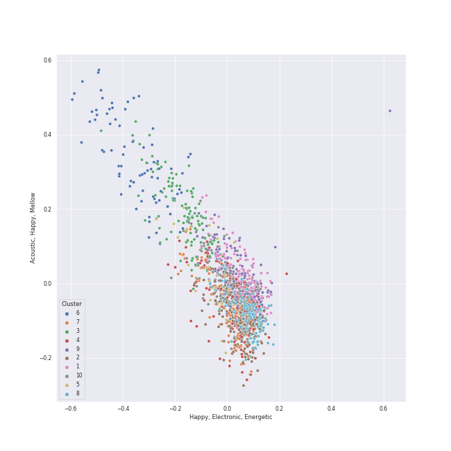

# Clusters in K-Pop

## Cluster #1

226 tracks

| Art | Track | Album | Artists | Label | Rank | 💚 | 🔗 |
|:---|:---|:---|:---|:---|---:|:---|:---|
|  | Baram X 3 | Something New - The 3rd Mini Album | [TAEYEON](../../../../artists/taeyeon/overview.md) | [SM Entertainment](../../../../labels/sm_entertainment) | nan | | [🔗](https://open.spotify.com/track/0DdbiN1gW1t4MU7tQ91eTW) |
|  | Good Thing | Why - The 2nd Mini Album | [TAEYEON](../../../../artists/taeyeon/overview.md) | [SM Entertainment](../../../../labels/sm_entertainment) | nan | | [🔗](https://open.spotify.com/track/30CAqzLOdc8LbPRzchYaAt) |
|  | Airplane pt.2 | Love Yourself 轉 'Tear' | [BTS](../../../../artists/bts/overview.md) | [BIGHIT MUSIC](../../../../labels/bighit_music) | nan | 💚 | [🔗](https://open.spotify.com/track/4lAE47gj539h8R1yxPhhGG) |
|  | ICON | Formula of Love: O+T=<3 | [TWICE](../../../../artists/twice/overview.md) | [Republic Records](../../../../labels/republic_records) | nan | 💚 | [🔗](https://open.spotify.com/track/2VdU1ksBKcETBr8BYRHUvB) |
|  | Give Me Your TMI | MAXIDENT | [Stray Kids](../../../../artists/stray_kids/overview.md) | [Republic Records](../../../../labels/republic_records) | 289 | 💚 | [🔗](https://open.spotify.com/track/7CQhZA3qNDZBoTKWqjD7gR) |
|  | Uh-Oh | Uh-Oh | [(G)I-DLE](../../../../artists/(g)i-dle/overview.md) | [Universal Music LLC](../../../../labels/universal_music_llc) | 36 | 💚 | [🔗](https://open.spotify.com/track/1OBb2wZMXKNmtdyyejLIyL) |
|  | 말해봐 (Talk Talk) | I GOT A BOY - The 4th Album | [Girls' Generation](../../../../artists/girls__generation/overview.md) | [SM Entertainment](../../../../labels/sm_entertainment) | nan | | [🔗](https://open.spotify.com/track/4fcMeRJFjEbvWagaEJD33A) |
|  | Can't Nobody | To Anyone | 2NE1 | [YG Entertainment](../../../../labels/yg_entertainment) | 741 | | [🔗](https://open.spotify.com/track/6bdrK3DnKZWfAsvO21oj1q) |
|  | Make you happy | Make you happy | NiziU | [Sony Music Labels Inc.](../../../../labels/sony_music_labels_inc_) | nan | | [🔗](https://open.spotify.com/track/1LnJVIG1BaHTRznuOgR0yc) |
|  | Banana Allergy Monkey | BANANA ALLERGY MONKEY | OH MY GIRL BANHANA | [WM Entertainment](../../../../labels/wm_entertainment) | nan | | [🔗](https://open.spotify.com/track/65AWCpJajDOVyllaFigbi9) |
## Cluster #2

206 tracks

| Art | Track | Album | Artists | Label | Rank | 💚 | 🔗 |
|:---|:---|:---|:---|:---|---:|:---|:---|
|  | Blue Heart | IVE SWITCH | [IVE](../../../../artists/ive/overview.md) | [Starship Entertainment](../../../../labels/starship_entertainment) | nan | 💚 | [🔗](https://open.spotify.com/track/00wTgWOnpWPlTvFsAkZBme) |
|  | La Vie en Rose | COLOR*IZ | IZ*ONE | [Genie Music Corporation](../../../../labels/genie_music_corporation) | nan | | [🔗](https://open.spotify.com/track/3WfaJhCL4p2JbdffJjV6Va) |
|  | BAMBOLEO | ‘The ReVe Festival 2022 - Feel My Rhythm’ | [Red Velvet](../../../../artists/red_velvet/overview.md) | [SM Entertainment](../../../../labels/sm_entertainment) | 348 | 💚 | [🔗](https://open.spotify.com/track/0jXneVxiitQZsbtftH7HHJ) |
|  | eight(Prod.&Feat. SUGA of BTS) | eight | [IU](../../../../artists/iu/overview.md), SUGA | [EDAM Entertainment](../../../../labels/edam_entertainment) | 784 | 💚 | [🔗](https://open.spotify.com/track/0pYacDCZuRhcrwGUA5nTBe) |
|  | Sugarcoat (NATTY Solo) | KISS OF LIFE | [KISS OF LIFE](../../../../artists/kiss_of_life/overview.md) | [S2 ENTERTAINMENT INC.](../../../../labels/s2_entertainment_inc_) | nan | 💚 | [🔗](https://open.spotify.com/track/0NoeYUnwpb9R26mpylHcR9) |
|  | Into the New World | Girls' Generation | [Girls' Generation](../../../../artists/girls__generation/overview.md) | [SM Entertainment](../../../../labels/sm_entertainment) | nan | | [🔗](https://open.spotify.com/track/1RTW9UthqmZwr8Od6CH4i8) |
|  | aenergy | Savage - The 1st Mini Album | [aespa](../../../../artists/aespa/overview.md) | [SM Entertainment](../../../../labels/sm_entertainment) | nan | | [🔗](https://open.spotify.com/track/1iNvVaWmlKJns2LNTXN39Q) |
|  | The Game | IN:VITE U | [PENTAGON](../../../../artists/pentagon/overview.md) | [Cube Entertainment](../../../../labels/cube_entertainment) | nan | 💚 | [🔗](https://open.spotify.com/track/4uqfxy4VCvlbSfALhRQedJ) |
|  | Deja Vu | ZERO : FEVER Part.3 | [ATEEZ](../../../../artists/ateez/overview.md) | [KQ Entertainment](../../../../labels/kq_entertainment) | 365 | 💚 | [🔗](https://open.spotify.com/track/3zmrdOtnOogqLllz26WLZ3) |
|  | MAESTRO | SEVENTEEN BEST ALBUM '17 IS RIGHT HERE' | [SEVENTEEN](../../../../artists/seventeen/overview.md) | [PLEDIS Entertainment](../../../../labels/pledis_entertainment) | nan | 💚 | [🔗](https://open.spotify.com/track/2UE9XGbAzicJIyo4bB6sqM) |
## Cluster #3

83 tracks

| Art | Track | Album | Artists | Label | Rank | 💚 | 🔗 |
|:---|:---|:---|:---|:---|---:|:---|:---|
|  | BOX | DREAM( )SCAPE | [NCT DREAM](../../../../artists/nct_dream/overview.md) | [SM Entertainment](../../../../labels/sm_entertainment) | nan | | [🔗](https://open.spotify.com/track/4I95uQMtIwg7779WEDy8Mc) |
|  | Still Monster | ORANGE BLOOD | [ENHYPEN](../../../../artists/enhypen/overview.md) | [BELIFT LAB](../../../../labels/belift_lab) | nan | 💚 | [🔗](https://open.spotify.com/track/6tuTpe37ljVcrJeZAAKBE1) |
|  | KIDDING ME | GUESS WHO | [ITZY](../../../../artists/itzy/overview.md) | [Republic Records](../../../../labels/republic_records) | nan | 💚 | [🔗](https://open.spotify.com/track/74WtkDIkOXTtEVO4TatDMX) |
|  | Underwater | Chill Kill - The 3rd Album | [Red Velvet](../../../../artists/red_velvet/overview.md) | [SM Entertainment](../../../../labels/sm_entertainment) | 208 | 💚 | [🔗](https://open.spotify.com/track/58xqapN458N2VjibN3uVrY) |
|  | You Better Know | The Red Summer - Summer Mini Album | [Red Velvet](../../../../artists/red_velvet/overview.md) | [SM Entertainment](../../../../labels/sm_entertainment) | nan | | [🔗](https://open.spotify.com/track/59fJbRecO16BIw9L1neEug) |
|  | YOUNG LUV | YOUNG-LUV.COM | [STAYC](../../../../artists/stayc/overview.md) | [High Up Entertainment](../../../../labels/high_up_entertainment) | nan | 💚 | [🔗](https://open.spotify.com/track/7HGKvoju3ucB7UqVt1GoJu) |
|  | Priority | 2022 Winter SMTOWN : SMCU PALACE | MAX CHANGMIN, [TAEYEON](../../../../artists/taeyeon/overview.md), [WINTER](../../../../artists/winter/overview.md) | [SM Entertainment](../../../../labels/sm_entertainment) | 199 | 💚 | [🔗](https://open.spotify.com/track/79musoVrfPaVxoMSBFJYuc) |
|  | Love Talk | Take Over The Moon - The 2nd Mini Album | WayV | LABEL V | 770 | 💚 | [🔗](https://open.spotify.com/track/6bc8VmlNt5S9WJlyw8bBdd) |
|  | Make Me Happy | WHEE | Whee In | [WM Korea](../../../../labels/wm_korea) | nan | 💚 | [🔗](https://open.spotify.com/track/6ry670EtSALRt1yd0W0wca) |
|  | WINE (Feat.Changmo) (Prod. SUGA) | WINE | SURAN, CHANGMO | Million Market,Inc | 124 | 💚 | [🔗](https://open.spotify.com/track/3eHkFA3StDR9BU7EVrUFLs) |
## Cluster #4

156 tracks

| Art | Track | Album | Artists | Label | Rank | 💚 | 🔗 |
|:---|:---|:---|:---|:---|---:|:---|:---|
|  | Stamp On It | Stamp On It - The 1st Mini Album | [GOT the beat](../../../../artists/got_the_beat/overview.md) | [SM Entertainment](../../../../labels/sm_entertainment) | 35 | 💚 | [🔗](https://open.spotify.com/track/0mlxHb4jbPr1PUBUv0WHRS) |
|  | DDU-DU DDU-DU | SQUARE UP | [BLACKPINK](../../../../artists/blackpink/overview.md) | [Interscope Records](../../../../labels/interscope_records), [YG Entertainment](../../../../labels/yg_entertainment) | 77 | 💚 | [🔗](https://open.spotify.com/track/4lQsB3ERTWSNaAN1IkuNRl) |
|  | Voltage | Voltage | [ITZY](../../../../artists/itzy/overview.md) | [WM Japan](../../../../labels/wm_japan) | 465 | 💚 | [🔗](https://open.spotify.com/track/7e65OAe9L0xWPSHDiahjQe) |
|  | RBB (Really Bad Boy) | RBB - The 5th Mini Album | [Red Velvet](../../../../artists/red_velvet/overview.md) | [SM Entertainment](../../../../labels/sm_entertainment) | 110 | 💚 | [🔗](https://open.spotify.com/track/4xjVP2Vogo0C72o6Nevq0W) |
|  | Oh Boy | The Red - The 1st Album | [Red Velvet](../../../../artists/red_velvet/overview.md) | [SM Entertainment](../../../../labels/sm_entertainment) | nan | 💚 | [🔗](https://open.spotify.com/track/3ts0OSZgdjOP0Uu1DvQK4h) |
|  | Up & Down | AH YEAH | EXID | Yedang Entertainment | 447 | 💚 | [🔗](https://open.spotify.com/track/6BKOhvRPY54uvfqWwg7MKi) |
|  | ASAP | STAYDOM | [STAYC](../../../../artists/stayc/overview.md) | [High Up Entertainment](../../../../labels/high_up_entertainment) | nan | 💚 | [🔗](https://open.spotify.com/track/5BXr7hYZQOeRttkeWYTq5S) |
|  | Don't Call Me | Don't Call Me - The 7th Album | [SHINee](../../../../artists/shinee/overview.md) | [SM Entertainment](../../../../labels/sm_entertainment) | nan | 💚 | [🔗](https://open.spotify.com/track/462OPOKW0VMbvW9H7HIb0U) |
|  | POP/STARS | POP/STARS | K/DA, Madison Beer, [(G)I-DLE](../../../../artists/(g)i-dle/overview.md), Jaira Burns, League of Legends | Riot Games | nan | 💚 | [🔗](https://open.spotify.com/track/5sbooPcNgIE22DwO0VNGUJ) |
|  | CRUSH | MELTING POINT | ZEROBASEONE | [Genie Music Corporation](../../../../labels/genie_music_corporation), [Stone Music Entertainment](../../../../labels/stone_music_entertainment) | nan | | [🔗](https://open.spotify.com/track/2qiWQf7ka0C4XoA7JAZ1q5) |
## Cluster #5

57 tracks

| Art | Track | Album | Artists | Label | Rank | 💚 | 🔗 |
|:---|:---|:---|:---|:---|---:|:---|:---|
|  | Cool With You | NewJeans 2nd EP 'Get Up' | [NewJeans](../../../../artists/newjeans/overview.md) | [ADOR](../../../../labels/ador) | 626 | | [🔗](https://open.spotify.com/track/02wk5BttM0QL38ERjLPQJB) |
|  | New Jeans | NewJeans 2nd EP 'Get Up' | [NewJeans](../../../../artists/newjeans/overview.md) | [ADOR](../../../../labels/ador) | nan | 💚 | [🔗](https://open.spotify.com/track/7woEDtme8YkFiWeyiinIjy) |
|  | Turtle | Twicetagram | [TWICE](../../../../artists/twice/overview.md) | [Republic Records](../../../../labels/republic_records) | nan | | [🔗](https://open.spotify.com/track/1LQtxz9fIrZskoqDSbhKd3) |
|  | Bungee | Delight - The 2nd Mini Album | [BAEKHYUN](../../../../artists/baekhyun/overview.md) | [SM Entertainment](../../../../labels/sm_entertainment) | nan | 💚 | [🔗](https://open.spotify.com/track/6wwmbBoBaFxptJwuvF2QdM) |
|  | Big Booty | 容 : FACE | [Solar](../../../../artists/solar/overview.md) | [RBW Inc.](../../../../labels/rbw_inc_) | nan | 💚 | [🔗](https://open.spotify.com/track/5bwzsMhJZHSHM6M6qslOgd) |
|  | Eyes Locked, Hands Locked | ‘The ReVe Festival’ Day 2 | [Red Velvet](../../../../artists/red_velvet/overview.md) | [SM Entertainment](../../../../labels/sm_entertainment) | nan | 💚 | [🔗](https://open.spotify.com/track/4o6LdaI3q5QFjs0sziszsD) |
|  | Friday (feat.Jang Yi-jeong) | Modern Times – Epilogue | [IU](../../../../artists/iu/overview.md), Jang Yi-jeong | [Kakao Entertainment](../../../../labels/kakao_entertainment) | nan | 💚 | [🔗](https://open.spotify.com/track/0GsRx0gPft6RmijIwMsKmG) |
|  | ALREADY | I NEVER DIE | [(G)I-DLE](../../../../artists/(g)i-dle/overview.md) | [Cube Entertainment](../../../../labels/cube_entertainment) | nan | 💚 | [🔗](https://open.spotify.com/track/1hQtfLmNABXQMSjjYRXqAX) |
|  | Thirsty | MY WORLD - The 3rd Mini Album | [aespa](../../../../artists/aespa/overview.md) | [SM Entertainment](../../../../labels/sm_entertainment), [Warner Records](../../../../labels/warner_records) | 55 | 💚 | [🔗](https://open.spotify.com/track/6nICBdDevG4NZysIqDFPEa) |
|  | COOL (Your rainbow) | ENTWURF | [NMIXX](../../../../artists/nmixx/overview.md) | [Republic Records](../../../../labels/republic_records) | nan | 💚 | [🔗](https://open.spotify.com/track/3D5t7S7W8BABJvA1SAIAHb) |
## Cluster #6

38 tracks

| Art | Track | Album | Artists | Label | Rank | 💚 | 🔗 |
|:---|:---|:---|:---|:---|---:|:---|:---|
|  | Wine | Purpose - The 2nd Album | [TAEYEON](../../../../artists/taeyeon/overview.md) | [SM Entertainment](../../../../labels/sm_entertainment) | nan | 💚 | [🔗](https://open.spotify.com/track/2Bgjj3t5bOh34DfENfgyUY) |
|  | Moonlight Melody | Perfect Velvet - The 2nd Album | [Red Velvet](../../../../artists/red_velvet/overview.md) | [SM Entertainment](../../../../labels/sm_entertainment) | nan | 💚 | [🔗](https://open.spotify.com/track/1WryFxHMRpm6SOl58n8BYz) |
|  | Love wins all | The Winning | [IU](../../../../artists/iu/overview.md) | [EDAM Entertainment](../../../../labels/edam_entertainment) | 255 | 💚 | [🔗](https://open.spotify.com/track/53g7ZIvZE47H9pwXPFYMCH) |
|  | Love poem | Love poem | [IU](../../../../artists/iu/overview.md) | [Kakao Entertainment](../../../../labels/kakao_entertainment) | nan | 💚 | [🔗](https://open.spotify.com/track/7HrE6HtYNBbGqp5GmHbFV0) |
|  | Secret Garden | A flower bookmark | [IU](../../../../artists/iu/overview.md) | Fave Entertainment | nan | 💚 | [🔗](https://open.spotify.com/track/5F6nAnNIsRk9QbPOx9t11B) |
|  | HANN (Alone in winter) | I burn | [(G)I-DLE](../../../../artists/(g)i-dle/overview.md) | [Universal Music LLC](../../../../labels/universal_music_llc) | 137 | 💚 | [🔗](https://open.spotify.com/track/2qYdsdgdeMLFzpLcMQWG2W) |
|  | Where Are We Now | WAW | [MAMAMOO](../../../../artists/mamamoo/overview.md) | [RBW Inc.](../../../../labels/rbw_inc_) | nan | 💚 | [🔗](https://open.spotify.com/track/0cLXk75Pan3mhRlWqHiynh) |
|  | 눈,코,입 (Eyes, Nose, Lips) | RISE | TAEYANG | [YG Entertainment](../../../../labels/yg_entertainment) | 49 | 💚 | [🔗](https://open.spotify.com/track/0lYtIvI7bO51PZSeK22Mbz) |
|  | Seed | Down to Earth | TAEYANG | [THEBLACKLABEL/Interscope Records](../../../../labels/interscope_records) | 444 | | [🔗](https://open.spotify.com/track/49eleLPCqnwgBSICKgcL0z) |
|  | 무제(無題) (Untitled, 2014) | KWON JI YONG | G-DRAGON | [YG Entertainment](../../../../labels/yg_entertainment) | 25 | 💚 | [🔗](https://open.spotify.com/track/16BS342F89MDqouSxgLaUK) |
## Cluster #7

156 tracks

| Art | Track | Album | Artists | Label | Rank | 💚 | 🔗 |
|:---|:---|:---|:---|:---|---:|:---|:---|
|  | Talk that Talk | BETWEEN 1&2 | [TWICE](../../../../artists/twice/overview.md) | [Republic Records](../../../../labels/republic_records) | nan | 💚 | [🔗](https://open.spotify.com/track/0RDqNCRBGrSegk16Avfzuq) |
|  | FIESTA | BLOOM*IZ | IZ*ONE | [Genie Music Corporation](../../../../labels/genie_music_corporation), [Stone Music Entertainment](../../../../labels/stone_music_entertainment) | nan | 💚 | [🔗](https://open.spotify.com/track/6Ihdn6wW2UBhfTKWbP29KA) |
|  | ParadoXXX Invasion | MANIFESTO : DAY 1 | [ENHYPEN](../../../../artists/enhypen/overview.md) | [BELIFT LAB](../../../../labels/belift_lab) | 18 | 💚 | [🔗](https://open.spotify.com/track/3OC2C8IpFhbUJTeMe55QYn) |
|  | Spit it out | SPIT IT OUT | [Solar](../../../../artists/solar/overview.md) | [RBW, INC.](../../../../labels/rbw_inc_) | nan | | [🔗](https://open.spotify.com/track/5F6RrFgt1yvRhNCdAEumM6) |
|  | Beautiful Christmas | 2022 Winter SMTOWN : SMCU PALACE | [Red Velvet](../../../../artists/red_velvet/overview.md), [aespa](../../../../artists/aespa/overview.md) | [SM Entertainment](../../../../labels/sm_entertainment) | 176 | 💚 | [🔗](https://open.spotify.com/track/1MsWVb6YW3AknP1EAZaKOQ) |
|  | Standing Next to You | GOLDEN | Jung Kook | [BIGHIT MUSIC](../../../../labels/bighit_music) | 510 | 💚 | [🔗](https://open.spotify.com/track/2KslE17cAJNHTsI2MI0jb2) |
|  | Bloom | Talk about S. | [Gain](../../../../artists/gain/overview.md) | Kakao M Corp. | nan | 💚 | [🔗](https://open.spotify.com/track/3lcdPSfDGg11Qyimx2ONYH) |
|  | Wow Thing | Wow Thing | [SEULGI](../../../../artists/seulgi/overview.md), [CHUNG HA](../../../../artists/chung_ha/overview.md), SinB, [JEON SOYEON](../../../../artists/jeon_soyeon/overview.md) | [SM Entertainment](../../../../labels/sm_entertainment) | 786 | 💚 | [🔗](https://open.spotify.com/track/5MwfxCtqMFGYp9Nc1BkTrS) |
|  | Flip That | Summer Special [Flip That] | [LOONA](../../../../artists/loona/overview.md) | [WM Korea](../../../../labels/wm_korea) | nan | 💚 | [🔗](https://open.spotify.com/track/7cHXwaBnIBFUPuP376z07E) |
|  | Pity Party | Pity Party | JAMIE | [WM Korea](../../../../labels/wm_korea) | 682 | 💚 | [🔗](https://open.spotify.com/track/3hmjSgK0gSytIf3sbCFShk) |
## Cluster #8

100 tracks

| Art | Track | Album | Artists | Label | Rank | 💚 | 🔗 |
|:---|:---|:---|:---|:---|---:|:---|:---|
|  | God’s Menu | GO LIVE | [Stray Kids](../../../../artists/stray_kids/overview.md) | [Republic Records](../../../../labels/republic_records) | nan | 💚 | [🔗](https://open.spotify.com/track/4XPXrcpyNr30Km6aPiflJy) |
|  | Heaven | Never Gonna Dance Again : Act 2 - The 3rd Album | TAEMIN | [SM Entertainment](../../../../labels/sm_entertainment) | nan | | [🔗](https://open.spotify.com/track/2hjaiDsLLBlY68XrgjZk7F) |
|  | CRIMINAL LOVE | CRIMINAL LOVE | [ENHYPEN](../../../../artists/enhypen/overview.md) | [BELIFT LAB](../../../../labels/belift_lab) | 114 | 💚 | [🔗](https://open.spotify.com/track/0Eglu3fErlG196PtTwCUPM) |
|  | Bing Bing | ‘The ReVe Festival’ Day 1 | [Red Velvet](../../../../artists/red_velvet/overview.md) | [SM Entertainment](../../../../labels/sm_entertainment) | nan | 💚 | [🔗](https://open.spotify.com/track/6u78votmpGuKAE4BOeJtRC) |
|  | Hit That Drum | Summer Magic - Summer Mini Album | [Red Velvet](../../../../artists/red_velvet/overview.md) | [SM Entertainment](../../../../labels/sm_entertainment) | nan | 💚 | [🔗](https://open.spotify.com/track/7dafpAJczCDB1Pzz7bRSCh) |
|  | Décalcomanie | MEMORY | [MAMAMOO](../../../../artists/mamamoo/overview.md) | [Genie Music Corporation](../../../../labels/genie_music_corporation), [Stone Music Entertainment](../../../../labels/stone_music_entertainment) | nan | 💚 | [🔗](https://open.spotify.com/track/5WitNasXEIRptoLIQUcXMx) |
|  | Back to the City | LOVESTRUCK! | Kep1er | [Genie Music Corporation](../../../../labels/genie_music_corporation), [Stone Music Entertainment](../../../../labels/stone_music_entertainment) | nan | | [🔗](https://open.spotify.com/track/2Zx7YnpyTsQvjAf9elDsgX) |
|  | YOLO | Drama - The 4th Mini Album | [aespa](../../../../artists/aespa/overview.md) | [SM Entertainment](../../../../labels/sm_entertainment), [Warner Records](../../../../labels/warner_records) | 171 | | [🔗](https://open.spotify.com/track/3OQWohbPUsvbXaH1AiRazX) |
|  | Electric Shock | Electric Shock - The 2nd Mini Album | [f(x)](../../../../artists/f(x)/overview.md) | [SM Entertainment](../../../../labels/sm_entertainment) | nan | 💚 | [🔗](https://open.spotify.com/track/7tMN6iGJMulMFpSCeU7pmU) |
|  | Hello Bitches | Hello Bitches | CL | [YG Entertainment](../../../../labels/yg_entertainment) | nan | 💚 | [🔗](https://open.spotify.com/track/72ysGFB4mZTgQsPqN9PzPS) |
## Cluster #9

107 tracks

| Art | Track | Album | Artists | Label | Rank | 💚 | 🔗 |
|:---|:---|:---|:---|:---|---:|:---|:---|
|  | OMG | NewJeans 'OMG' | [NewJeans](../../../../artists/newjeans/overview.md) | [ADOR](../../../../labels/ador) | 98 | 💚 | [🔗](https://open.spotify.com/track/65FftemJ1DbbZ45DUfHJXE) |
|  | Killing Me | Killing Me | [CHUNG HA](../../../../artists/chung_ha/overview.md) | [MNH ENTERTAINMENT](../../../../labels/mnh_entertainment) | nan | 💚 | [🔗](https://open.spotify.com/track/3QD0Y1tTngihByjdWC99lG) |
|  | Bite Me | DARK BLOOD | [ENHYPEN](../../../../artists/enhypen/overview.md) | [BELIFT LAB](../../../../labels/belift_lab) | 115 | 💚 | [🔗](https://open.spotify.com/track/7mpdNiaQvygj2rHoxkzMfa) |
|  | Zezé | CHAT-SHIRE | [IU](../../../../artists/iu/overview.md) | [Kakao Entertainment](../../../../labels/kakao_entertainment) | nan | 💚 | [🔗](https://open.spotify.com/track/1dwOTQnBuN8LeVX4jNwJXS) |
|  | BFF (Best Friends Forever) | HARMONY : SET IN | [P1Harmony](../../../../artists/p1harmony/overview.md) | [FNC ENTERTAINMENT](../../../../labels/fnc_entertainment) | nan | 💚 | [🔗](https://open.spotify.com/track/4sJqthsQcuyjhYbJS1JExL) |
|  | Just Right | Just Right | GOT7 | [JYP Entertainment](../../../../labels/jyp_entertainment) | nan | 💚 | [🔗](https://open.spotify.com/track/4ER58qECydWokIsgqtysWu) |
|  | It's Definitely You | HWARANG, Pt. 2 (Music from the Original TV Series) | V, JIN | OH!BOY PROJECT | nan | 💚 | [🔗](https://open.spotify.com/track/2LowwiemmGMzzNSH1PJprK) |
|  | HUG | Hug | [TVXQ!](../../../../artists/tvxq!/overview.md) | [SM Entertainment](../../../../labels/sm_entertainment) | nan | 💚 | [🔗](https://open.spotify.com/track/3fB6z972xZddHD2SBKYCMc) |
|  | GLASSY | GLASSY | JO YURI | [Genie Music Corporation](../../../../labels/genie_music_corporation), [Stone Music Entertainment](../../../../labels/stone_music_entertainment) | nan | 💚 | [🔗](https://open.spotify.com/track/6PFfx4sEBWPuFqFB0mgX1D) |
|  | You’re Pitiful | BLACK LABEL | FIESTAR | Collabodadi | nan | | [🔗](https://open.spotify.com/track/6ssSzCx8vxqkYenaxJuObQ) |
## Cluster #10

140 tracks

| Art | Track | Album | Artists | Label | Rank | 💚 | 🔗 |
|:---|:---|:---|:---|:---|---:|:---|:---|
|  | Stay Gold | MAP OF THE SOUL : 7 ~ THE JOURNEY ~ | [BTS](../../../../artists/bts/overview.md) | [Universal Music LLC](../../../../labels/universal_music_llc) | nan | | [🔗](https://open.spotify.com/track/3Ys2PYl1wyPKQIwyqhP9cQ) |
|  | Telepathy | BE | [BTS](../../../../artists/bts/overview.md) | [BIGHIT MUSIC](../../../../labels/bighit_music) | nan | 💚 | [🔗](https://open.spotify.com/track/6Fnvi5QnVkTskSzeRvvQds) |
|  | Smart | EASY | [LE SSERAFIM](../../../../artists/le_sserafim/overview.md) | [SOURCE MUSIC](../../../../labels/source_music) | 661 | 💚 | [🔗](https://open.spotify.com/track/4lR8sYGMGZPvthF2yUfo7T) |
|  | Quit | Windy | [JEON SOYEON](../../../../artists/jeon_soyeon/overview.md) | [Universal Music LLC](../../../../labels/universal_music_llc) | nan | 💚 | [🔗](https://open.spotify.com/track/54y2W3EYYsSnyqL1rinbJb) |
|  | Back Down | HARMONY : SET IN | [P1Harmony](../../../../artists/p1harmony/overview.md) | [FNC ENTERTAINMENT](../../../../labels/fnc_entertainment) | nan | 💚 | [🔗](https://open.spotify.com/track/7EP9G7AIKrywWGdYsYZzGv) |
|  | JUMP | HARMONY : ALL IN | [P1Harmony](../../../../artists/p1harmony/overview.md) | [FNC ENTERTAINMENT](../../../../labels/fnc_entertainment) | 340 | 💚 | [🔗](https://open.spotify.com/track/4vTXBC7QOjEbi8DcJvCNE2) |
|  | XOXO | XOXO | JEON SOMI | [THE BLACK LABEL/Interscope Records](../../../../labels/interscope_records) | nan | 💚 | [🔗](https://open.spotify.com/track/4r34Yi0eltsu1tp6z4lq3x) |
|  | Salty & Sweet | MY WORLD - The 3rd Mini Album | [aespa](../../../../artists/aespa/overview.md) | [SM Entertainment](../../../../labels/sm_entertainment), [Warner Records](../../../../labels/warner_records) | 106 | 💚 | [🔗](https://open.spotify.com/track/4wQDjZtXjsFtU3BLSiIH4t) |
|  | DICE | DICE - The 2nd Mini Album | ONEW | [SM Entertainment](../../../../labels/sm_entertainment) | 360 | 💚 | [🔗](https://open.spotify.com/track/15wj06fykqiNYvyj8AVMnK) |
|  | Love Me A Little | THE UNSEEN | SHOWNU X HYUNGWON (MONSTA X) | [Starship Entertainment](../../../../labels/starship_entertainment) | nan | 💚 | [🔗](https://open.spotify.com/track/66RK4bz7fZGrfyBb3y9Yal) |