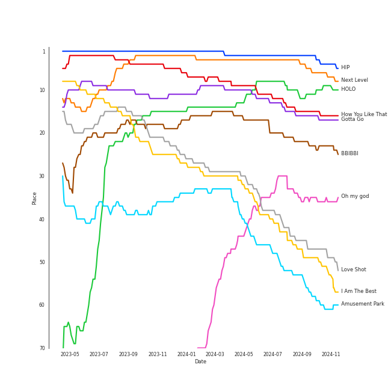
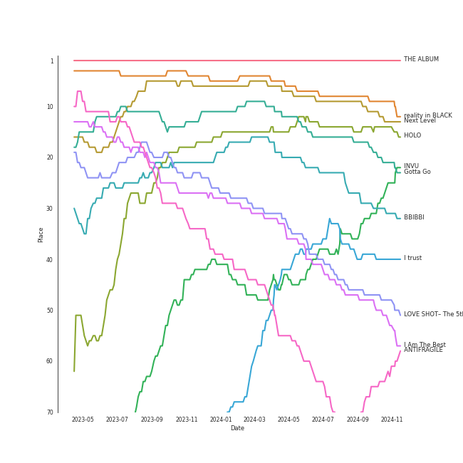
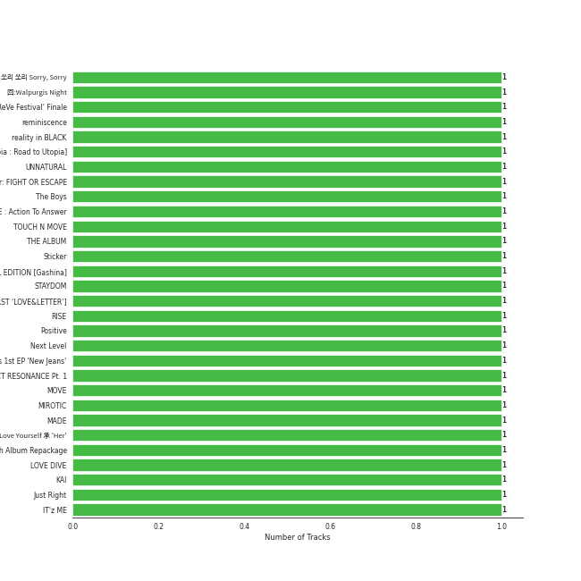
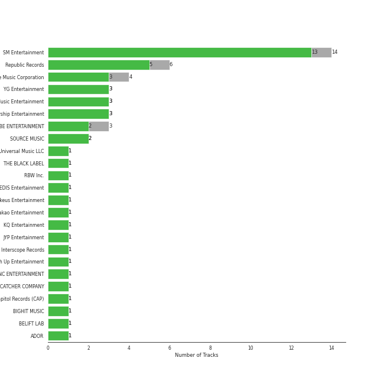
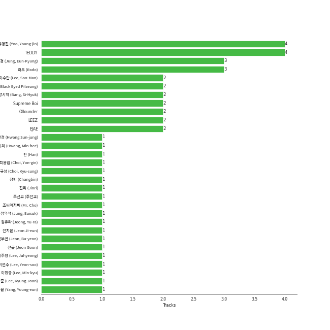
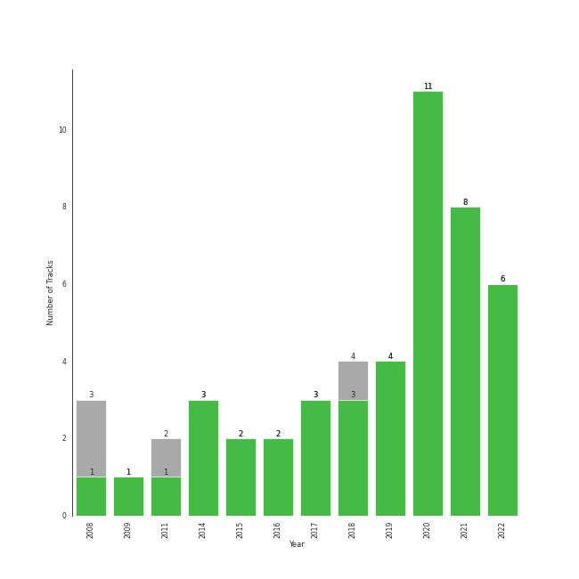

# K-Pop 101

[49 tracks (45 liked) 🔗](https://open.spotify.com/playlist/1NlCn9vDmQDBF54JyVC2MC)

[See Track Features](audio_features.md)

[See Clusters](clusters/overview.md)

## Top Artists

| Art | Rank | Tracks | 💚 | Artist | 🔗 |
|:---|---:|---:|---:|:---|:---|
|  | 12 | 1 | 1 | [SEVENTEEN](../../artists/seventeen/overview.md) | [🔗](https://open.spotify.com/artist/7nqOGRxlXj7N2JYbgNEjYH) |
|  | 9 | 1 | 1 | [TWICE](../../artists/twice/overview.md) | [🔗](https://open.spotify.com/artist/7n2Ycct7Beij7Dj7meI4X0) |
|  | 30 | 1 | 1 | [NCT 127](../../artists/nct_127/overview.md) | [🔗](https://open.spotify.com/artist/7f4ignuCJhLXfZ9giKT7rH) |
|  | 11 | 1 | 1 | [LeeHi](../../artists/leehi/overview.md) | [🔗](https://open.spotify.com/artist/7cVZApDoQZpS447nHTsNqu) |
|  | 58 | 1 | 1 | TAEYANG | [🔗](https://open.spotify.com/artist/6udveWUgX4vu75FF0DTrXV) |
|  | 429 | 1 | 1 | GOT7 | [🔗](https://open.spotify.com/artist/6nfDaffa50mKtEOwR8g4df) |
|  | 159 | 1 | 1 | [TVXQ!](../../artists/tvxq!/overview.md) | [🔗](https://open.spotify.com/artist/6nVMMEywS5Y4tsHPKx1nIo) |
|  | 109 | 1 | 1 | KAI | [🔗](https://open.spotify.com/artist/6iVo62B0bdTknRcrktCmak) |
|  | 252 | 1 | 1 | [WJSN](../../artists/wjsn/overview.md) | [🔗](https://open.spotify.com/artist/6hhqsQZhtp9hfaZhSd0VSD) |
|  | 86 | 1 | 1 | [SUPER JUNIOR](../../artists/super_junior/overview.md) | [🔗](https://open.spotify.com/artist/6gzXCdfYfFe5XKhPKkYqxV) |

See all 49 artists

| Art | Rank | Tracks | 💚 | Artist | 🔗 |
|:---|---:|---:|---:|:---|:---|
|  | 124 | 1 | 1 | 4Minute | [🔗](https://open.spotify.com/artist/6cdC1cwqh3eJAXaxXJt2jv) |
|  | 1 | 1 | 1 | [aespa](../../artists/aespa/overview.md) | [🔗](https://open.spotify.com/artist/6YVMFz59CuY7ngCxTxjpxE) |
|  | 17 | 1 | 1 | [IVE](../../artists/ive/overview.md) | [🔗](https://open.spotify.com/artist/6RHTUrRF63xao58xh9FXYJ) |
|  | 43 | 1 | 1 | [SUNMI](../../artists/sunmi/overview.md) | [🔗](https://open.spotify.com/artist/6MoXcK2GyGg7FIyxPU5yW6) |
|  | 21 | 1 | 1 | [NewJeans](../../artists/newjeans/overview.md) | [🔗](https://open.spotify.com/artist/6HvZYsbFfjnjFrWF950C9d) |
|  | 47 | 1 | 1 | [ATEEZ](../../artists/ateez/overview.md) | [🔗](https://open.spotify.com/artist/68KmkJeZGfwe1OUaivBa2L) |
|  | 7 | 1 | 1 | [ENHYPEN](../../artists/enhypen/overview.md) | [🔗](https://open.spotify.com/artist/5t5FqBwTcgKTaWmfEbwQY9) |
|  | 29 | 1 | 1 | [Dreamcatcher](../../artists/dreamcatcher/overview.md) | [🔗](https://open.spotify.com/artist/5V1qsQHdXNm4ZEZHWvFnqQ) |
|  | 54 | 1 | 1 | [BAEKHYUN](../../artists/baekhyun/overview.md) | [🔗](https://open.spotify.com/artist/4ufh0WuMZh6y4Dmdnklvdl) |
|  | 13 | 1 | 1 | [LE SSERAFIM](../../artists/le_sserafim/overview.md) | [🔗](https://open.spotify.com/artist/4SpbR6yFEvexJuaBpgAU5p) |
|  | 174 | 1 | 1 | BIGBANG | [🔗](https://open.spotify.com/artist/4Kxlr1PRlDKEB0ekOCyHgX) |
|  | 4 | 1 | 1 | [BLACKPINK](../../artists/blackpink/overview.md) | [🔗](https://open.spotify.com/artist/41MozSoPIsD1dJM0CLPjZF) |
|  | 8 | 1 | 1 | [TAEYEON](../../artists/taeyeon/overview.md) | [🔗](https://open.spotify.com/artist/3qNVuliS40BLgXGxhdBdqu) |
|  | 247 | 1 | 1 | [NCT U](../../artists/nct_u/overview.md) | [🔗](https://open.spotify.com/artist/3paGCCtX1Xr4Gx53mSeZuQ) |
|  | 23 | 1 | 1 | [EXO](../../artists/exo/overview.md) | [🔗](https://open.spotify.com/artist/3cjEqqelV9zb4BYE3qDQ4O) |
|  | 41 | 1 | 1 | [EVERGLOW](../../artists/everglow/overview.md) | [🔗](https://open.spotify.com/artist/3ZZzT0naD25RhY2uZvIKkJ) |
|  | 28 | 1 | 1 | [BTS](../../artists/bts/overview.md) | [🔗](https://open.spotify.com/artist/3Nrfpe0tUJi4K4DXYWgMUX) |
|  | 114 | 1 | 1 | [P1Harmony](../../artists/p1harmony/overview.md) | [🔗](https://open.spotify.com/artist/3JjvsPeGMbDJqsphe2z8xU) |
|  | 3 | 1 | 1 | [IU](../../artists/iu/overview.md) | [🔗](https://open.spotify.com/artist/3HqSLMAZ3g3d5poNaI7GOU) |
|  | 269 | 1 | 1 | SISTAR | [🔗](https://open.spotify.com/artist/2wTLheTmMcFCA4hdY8hZJP) |
|  | 10 | 1 | 1 | [Stray Kids](../../artists/stray_kids/overview.md) | [🔗](https://open.spotify.com/artist/2dIgFjalVxs4ThymZ67YCE) |
|  | 14 | 1 | 1 | [CHUNG HA](../../artists/chung_ha/overview.md) | [🔗](https://open.spotify.com/artist/2PSJ6YriU7JsFucxACpU7Y) |
|  | 5 | 1 | 1 | [ITZY](../../artists/itzy/overview.md) | [🔗](https://open.spotify.com/artist/2KC9Qb60EaY0kW4eH68vr3) |
|  | 6 | 1 | 1 | [(G)I-DLE](../../artists/(g)i-dle/overview.md) | [🔗](https://open.spotify.com/artist/2AfmfGFbe0A0WsTYm0SDTx) |
|  | 18 | 1 | 1 | [NMIXX](../../artists/nmixx/overview.md) | [🔗](https://open.spotify.com/artist/28ot3wh4oNmoFOdVajibBl) |
|  | 2 | 1 | 1 | [Red Velvet](../../artists/red_velvet/overview.md) | [🔗](https://open.spotify.com/artist/1z4g3DjTBBZKhvAroFlhOM) |
|  | 67 | 1 | 1 | [PENTAGON](../../artists/pentagon/overview.md) | [🔗](https://open.spotify.com/artist/1wKpMkucynaTfG8lyPprYV) |
|  | 62 | 1 | 1 | 2NE1 | [🔗](https://open.spotify.com/artist/1l0mKo96Jh9HVYONcRl3Yp) |
|  | 25 | 1 | 1 | [NCT DREAM](../../artists/nct_dream/overview.md) | [🔗](https://open.spotify.com/artist/1gBUSTR3TyDdTVFIaQnc02) |
|  | 66 | 1 | 1 | [TAEMIN](../../artists/taemin/overview.md) | [🔗](https://open.spotify.com/artist/13rF01aOogvnkuQXOlgTW8) |
|  | 366 | 1 | 1 | GFRIEND | [🔗](https://open.spotify.com/artist/0qlWcS66ohOIi0M8JZwPft) |
|  | 151 | 1 | 1 | [TOMORROW X TOGETHER](../../artists/tomorrow_x_together/overview.md) | [🔗](https://open.spotify.com/artist/0ghlgldX5Dd6720Q3qFyQB) |
|  | 15 | 1 | 1 | [MAMAMOO](../../artists/mamamoo/overview.md) | [🔗](https://open.spotify.com/artist/0XATRDCYuuGhk0oE7C0o5G) |
|  | 20 | 1 | 1 | [Girls' Generation](../../artists/girls__generation/overview.md) | [🔗](https://open.spotify.com/artist/0Sadg1vgvaPqGTOjxu0N6c) |
|  | 16 | 1 | 1 | [STAYC](../../artists/stayc/overview.md) | [🔗](https://open.spotify.com/artist/01XYiBYaoMJcNhPokrg0l0) |
|  | 368 | 1 | 0 | IZ*ONE | [🔗](https://open.spotify.com/artist/5r1tUTxVSgvBHnoDuDODPH) |
|  | 429 | 1 | 0 | HyunA | [🔗](https://open.spotify.com/artist/3UwlejyX2b458azZ7eCnHb) |
|  | 85 | 1 | 0 | Wonder Girls | [🔗](https://open.spotify.com/artist/3Cv2vi3WTl8VZOTdrBkKdM) |
|  | 100 | 1 | 0 | [SHINee](../../artists/shinee/overview.md) | [🔗](https://open.spotify.com/artist/2hRQKC0gqlZGPrmUKbcchR) |

## Top Tracks

Most and least listened tracks

| Rank | ​ | Most listened tracks | Rank | ​​ | Least listened tracks |
|---:|:---|:---|---:|:---|:---|
| 2 |  | [HIP](../../artists/mamamoo/overview.md) | 971 |  | [Shine](../../artists/pentagon/overview.md) |
| 6 |  | [Next Level](../../artists/aespa/overview.md) | 971 |  | Nobody |
| 11 |  | [HOLO](../../artists/leehi/overview.md) | 971 |  | [쏘리 쏘리 Sorry, Sorry](../../artists/super_junior/overview.md) |
| 15 |  | [How You Like That](../../artists/blackpink/overview.md) | 971 |  | Touch my body |
| 16 |  | [Gotta Go](../../artists/chung_ha/overview.md) | 971 |  | [ASAP](../../artists/stayc/overview.md) |
| 22 |  | [BBIBBI](../../artists/iu/overview.md) | 971 |  | Bubble Pop! |
| 35 |  | [Oh my god](../../artists/(g)i-dle/overview.md) | 971 |  | Just Right |
| 47 |  | [Love Shot](../../artists/exo/overview.md) | 971 |  | [O.O](../../artists/nmixx/overview.md) |
| 49 |  | I Am The Best | 971 |  | [Doom Du Doom](../../artists/p1harmony/overview.md) |
| 56 |  | [Amusement Park](../../artists/baekhyun/overview.md) | 971 |  | BANG BANG BANG |

## Top Albums

| Art | Rank | Tracks | 💚 | Album | Release Date | 🔗 |
|:---|---:|---:|---:|:---|:---|:---|
|  | 642 | 1 | 1 | 쏘리 쏘리 Sorry, Sorry - The 3rd Album | 2009-03-11 | [🔗](https://open.spotify.com/album/3v5XUoZzxbmJbxs7vWTua3) |
|  | 519 | 1 | 1 | 回:Walpurgis Night | 2020-11-09 | [🔗](https://open.spotify.com/album/6keRNtq7CnhNrD2EIKOA6h) |
|  | 138 | 1 | 1 | ‘The ReVe Festival’ Finale | 2019-12-23 | [🔗](https://open.spotify.com/album/3rVtm00UfbuzWOewdm4iYM) |
|  | 586 | 1 | 1 | reminiscence | 2020-02-03 | [🔗](https://open.spotify.com/album/0zH0C0fkzAjhSnGKLOuxwX) |
|  | 8 | 1 | 1 | reality in BLACK | 2019-11-14 | [🔗](https://open.spotify.com/album/7CucpzwxAZ6kHmctI9eo4X) |
|  | 424 | 1 | 1 | [Dystopia : Road to Utopia] | 2021-01-26 | [🔗](https://open.spotify.com/album/1EyLcB9R1KfUV45AxtRR3V) |
|  | 642 | 1 | 1 | UNNATURAL | 2021-03-31 | [🔗](https://open.spotify.com/album/0uD1Chx5ZsnZM4kS8yK0S8) |
|  | 642 | 1 | 1 | The Chaos Chapter: FIGHT OR ESCAPE | 2021-08-17 | [🔗](https://open.spotify.com/album/2CjIfWoFITACUOlWGB7os5) |
|  | 58 | 1 | 1 | The Boys - The 3rd Album | 2011-10-19 | [🔗](https://open.spotify.com/album/4vGkZl9P0sKxupLdJE7ndS) |
|  | 486 | 1 | 1 | TREASURE EPILOGUE : Action To Answer | 2020-01-06 | [🔗](https://open.spotify.com/album/3TTkDOcSzRQCvGMT7VmmPE) |

See all 49 albums

| Art | Rank | Tracks | 💚 | Album | Release Date | 🔗 |
|:---|---:|---:|---:|:---|:---|:---|
|  | 642 | 1 | 1 | TOUCH N MOVE | 2014-07-21 | [🔗](https://open.spotify.com/album/0SeSM1CAqu7QUkive4jCKl) |
|  | 1 | 1 | 1 | THE ALBUM | 2020-10-02 | [🔗](https://open.spotify.com/album/71O60S5gIJSIAhdnrDIh3N) |
|  | 175 | 1 | 1 | Sticker - The 3rd Album | 2021-09-17 | [🔗](https://open.spotify.com/album/6nYbIKGcTmKM5BAlJPPcad) |
|  | 198 | 1 | 1 | SUNMI SPECIAL EDITION [Gashina] | 2017-08-22 | [🔗](https://open.spotify.com/album/3TSX6AxLdCP4E5o3F5jCdN) |
|  | 642 | 1 | 1 | STAYDOM | 2021-04-08 | [🔗](https://open.spotify.com/album/71hjsg660uio3Z8bnbB6fS) |
|  | 172 | 1 | 1 | SEVENTEEN 1ST ALBUM [FIRST ‘LOVE&LETTER’] | 2016-04-25 | [🔗](https://open.spotify.com/album/50BrkBakrLWufmTLjCVBwn) |
|  | 68 | 1 | 1 | RISE | 2014-06-03 | [🔗](https://open.spotify.com/album/1Y9so4jq4t4taAHu0VdKX3) |
|  | 642 | 1 | 1 | Positive | 2018-04-02 | [🔗](https://open.spotify.com/album/1ZRmLzZWvOkSqWePzFeekO) |
|  | 10 | 1 | 1 | Next Level | 2021-05-17 | [🔗](https://open.spotify.com/album/2CzbrboOLzeRoaaH1N5K0N) |
|  | 106 | 1 | 1 | NewJeans 1st EP 'New Jeans' | 2022-08-01 | [🔗](https://open.spotify.com/album/1HMLpmZAnNyl9pxvOnTovV) |
|  | 357 | 1 | 1 | NCT RESONANCE Pt. 1 - The 2nd Album | 2020-10-12 | [🔗](https://open.spotify.com/album/6kudlOyCqSQfsBVSdPZEu4) |
|  | 293 | 1 | 1 | MOVE - The 2nd Album | 2017-10-16 | [🔗](https://open.spotify.com/album/2Ka8QpE2XUUjL4vOQihkJH) |
|  | 514 | 1 | 1 | MIROTIC - The 4th Album | 2008-09-26 | [🔗](https://open.spotify.com/album/51Wmrzs9O87YlKp2vqDwln) |
|  | 243 | 1 | 1 | MADE | 2016-12-13 | [🔗](https://open.spotify.com/album/2SPrl8C8pgSM5gXbAiyJHY) |
|  | 376 | 1 | 1 | Love Yourself 承 'Her' | 2017-09-18 | [🔗](https://open.spotify.com/album/07Rq17GzCnIdWJcyVHb57G) |
|  | 47 | 1 | 1 | LOVE SHOT– The 5th Album Repackage | 2018-12-13 | [🔗](https://open.spotify.com/album/3r5m8utqRZYJnpep7xxVyq) |
|  | 232 | 1 | 1 | LOVE DIVE | 2022-04-05 | [🔗](https://open.spotify.com/album/1AFVTHHm7kKoQ6Rgb25x3p) |
|  | 193 | 1 | 1 | KAI - The 1st Mini Album | 2020-11-30 | [🔗](https://open.spotify.com/album/6xpxMAUhk8hiDTa5zT7F86) |
|  | 642 | 1 | 1 | Just Right | 2015-07-13 | [🔗](https://open.spotify.com/album/4159syQKTGC1JSJN4xBScv) |
|  | 561 | 1 | 1 | IT'z ME | 2020-03-09 | [🔗](https://open.spotify.com/album/7ynKAohxfwPUZzvU8f1p1U) |
|  | 31 | 1 | 1 | INVU - The 3rd Album | 2022-02-14 | [🔗](https://open.spotify.com/album/7i2YLTVQ0dyngRuUqtGmr9) |
|  | 134 | 1 | 1 | IN LIFE | 2020-09-14 | [🔗](https://open.spotify.com/album/0aERWcI2KYSCM4biUihB9X) |
|  | 39 | 1 | 1 | I trust | 2020-04-06 | [🔗](https://open.spotify.com/album/57sl8AvqVqm4Fadre0z8FQ) |
|  | 48 | 1 | 1 | I Am The Best | 2014-12-09 | [🔗](https://open.spotify.com/album/7zjLDZzHo2XgvYwpuNwEvK) |
|  | 245 | 1 | 1 | Hot Sauce - The 1st Album | 2021-05-10 | [🔗](https://open.spotify.com/album/1miTgxRTUje9Jqml1aOSUi) |
|  | 14 | 1 | 1 | HOLO | 2020-07-23 | [🔗](https://open.spotify.com/album/5xq9sm0jGMMDu5LifpBBo1) |
|  | 642 | 1 | 1 | HARMONY : ZERO IN | 2022-07-20 | [🔗](https://open.spotify.com/album/73CTPjApMDvFsycjbbROji) |
|  | 18 | 1 | 1 | Gotta Go | 2019-01-02 | [🔗](https://open.spotify.com/album/3WgHekDElv10Kam9aCMwnx) |
|  | 216 | 1 | 1 | FANCY YOU | 2019-04-22 | [🔗](https://open.spotify.com/album/3aLpWFejbsdyafODLXRqwF) |
|  | 150 | 1 | 1 | Crazy | 2015-02-09 | [🔗](https://open.spotify.com/album/5ooERKclQluBVu00PIH9Xm) |
|  | 170 | 1 | 1 | BORDER : CARNIVAL | 2021-04-26 | [🔗](https://open.spotify.com/album/4LGYBcRsteiXjcPD4QQvxv) |
|  | 28 | 1 | 1 | BBIBBI | 2018-10-10 | [🔗](https://open.spotify.com/album/4ghBzVOTFoeKPPmyNKjVtI) |
|  | 56 | 1 | 1 | Amusement Park | 2020-12-21 | [🔗](https://open.spotify.com/album/1azcqabc4kDgRNMWFA02wZ) |
|  | 67 | 1 | 1 | ANTIFRAGILE | 2022-10-17 | [🔗](https://open.spotify.com/album/3u0ggfmK0vjuHMNdUbtaa9) |
|  | 229 | 1 | 1 | AD MARE | 2022-02-22 | [🔗](https://open.spotify.com/album/2QbA97qjlAs81t6kVS6zBk) |
|  | 642 | 1 | 0 | The Wonder Years - Trilogy | 2008-09-22 | [🔗](https://open.spotify.com/album/5apL7r2YXvPSkB8CxaZ7Pv) |
|  | 642 | 1 | 0 | The SHINee World - The First Album | 2008-08-28 | [🔗](https://open.spotify.com/album/2aiM53N5DGm5VXnfjswpI7) |
|  | 642 | 1 | 0 | COLOR*IZ | 2018-10-29 | [🔗](https://open.spotify.com/album/5Fl13rfH2DRRTo6OV4ecJY) |
|  | 642 | 1 | 0 | Bubble Pop! | 2011-07-05 | [🔗](https://open.spotify.com/album/3ejtzmi1xzQMl8JtJruZPp) |

## Top Record Labels

| Tracks | 💚 | Label |
|---:|---:|:---|
| 14 | 13 | [SM Entertainment](../../labels/sm_entertainment/overview.md) |
| 6 | 5 | [Republic Records](../../labels/republic_records/overview.md) |
| 4 | 3 | [Genie Music Corporation](../../labels/genie_music_corporation/overview.md) |
| 3 | 3 | [YG Entertainment](../../labels/yg_entertainment/overview.md) |
| 3 | 3 | [Stone Music Entertainment](../../labels/stone_music_entertainment/overview.md) |
| 3 | 3 | [Starship Entertainment](../../labels/starship_entertainment/overview.md) |
| 3 | 2 | [CUBE ENTERTAINMENT](../../labels/cube_entertainment/overview.md) |
| 2 | 2 | [SOURCE MUSIC](../../labels/source_music/overview.md) |
| 1 | 1 | [Universal Music LLC](../../labels/universal_music_llc/overview.md) |
| 1 | 1 | THE BLACK LABEL |

See all 24 labels

| Tracks | 💚 | Label |
|---:|---:|:---|
| 1 | 1 | [RBW Inc.](../../labels/rbw_inc_/overview.md) |
| 1 | 1 | [PLEDIS Entertainment](../../labels/pledis_entertainment/overview.md) |
| 1 | 1 | Makeus Entertainment |
| 1 | 1 | [Kakao Entertainment](../../labels/kakao_entertainment/overview.md) |
| 1 | 1 | [KQ Entertainment](../../labels/kq_entertainment/overview.md) |
| 1 | 1 | [JYP Entertainment](../../labels/jyp_entertainment/overview.md) |
| 1 | 1 | [Interscope Records](../../labels/interscope_records/overview.md) |
| 1 | 1 | [High Up Entertainment](../../labels/high_up_entertainment/overview.md) |
| 1 | 1 | [FNC ENTERTAINMENT](../../labels/fnc_entertainment/overview.md) |
| 1 | 1 | [DREAMCATCHER COMPANY](../../labels/dreamcatcher_company/overview.md) |
| 1 | 1 | Capitol Records (CAP) |
| 1 | 1 | [BIGHIT MUSIC](../../labels/bighit_music/overview.md) |
| 1 | 1 | [BELIFT LAB](../../labels/belift_lab/overview.md) |
| 1 | 1 | [ADOR](../../labels/ador/overview.md) |

## Genres

| Tracks | 💚 | Genre |
|---:|---:|:---|
| 43 | 39 | [k-pop](../../genres/k-pop/overview.md) |
| 22 | 20 | [k-pop girl group](../../genres/k-pop_girl_group/overview.md) |
| 17 | 16 | [k-pop boy group](../../genres/k-pop_boy_group/overview.md) |
| 5 | 5 | [pop](../../genres/pop/overview.md) |
| 1 | 1 | [korean r&b](../../genres/korean_r_b/overview.md) |
| 1 | 1 | [dance pop](../../genres/dance_pop/overview.md) |
| 1 | 1 | [anime](../../genres/anime/overview.md) |

## Top Producers

| Art | Producer | Tracks | Credit Types |
|:---|:---|---:|:---|
| | [TEDDY](../../producers/teddy/overview.md) | 4 | Arranger, Lyricist, Producer, Songwriter |
| | [유영진 (Yoo, Young-jin)](../../producers/유영진_(yoo,_young-jin)/overview.md) | 4 | Arranger, Lyricist, Producer, Songwriter |
| | [라도 (Rado)](../../producers/라도_(rado)/overview.md) | 3 | Lyricist, Songwriter, Arranger |
| | [정은경 (Jung, Eun-Kyung)](../../producers/정은경_(jung,_eun-kyung)/overview.md) | 3 | Producer |
| | [이수만 (Lee, Soo-Man)](../../producers/이수만_(lee,_soo-man)/overview.md) | 2 | Producer |
| | [Ollounder](../../producers/ollounder/overview.md) | 2 | Arranger, Lyricist, Songwriter |
| | [LEEZ](../../producers/leez/overview.md) | 2 | Arranger, Lyricist, Songwriter |
| | [블랙아이드필승 (Black Eyed Pilseung)](../../producers/블랙아이드필승_(black_eyed_pilseung)/overview.md) | 2 | Lyricist, Songwriter |
| | [방시혁 (Bang, Si-Hyuk)](../../producers/방시혁_(bang,_si-hyuk)/overview.md) | 2 | Songwriter, Lyricist |
| | [Supreme Boi](../../producers/supreme_boi/overview.md) | 2 | Songwriter, Lyricist |

View all

| Art | Producer | Tracks | Credit Types |
|:---|:---|---:|:---|
| | EJAE | 2 | Songwriter |
| | Jess Morgan | 1 | Songwriter |
| | Thomas Troelsen | 1 | Songwriter |
|  | SUGA | 1 | Songwriter |
| | Nathalie Blue | 1 | Lyricist, Songwriter |
| | 이경준 (Lee, Kyung-Joon) | 1 | Producer |
|  | G-DRAGON | 1 | Lyricist, Songwriter |
| | [SCORE](../../producers/score/overview.md) | 1 | Arranger, Lyricist, Producer, Songwriter |
| | 서재우 (Seo, Jae-woo) | 1 | Lyricist, Songwriter |
| | Paulina Cerrilla | 1 | Lyricist, Songwriter |
| | [구종필 (Koo, Jong-Pil)](../../producers/구종필_(koo,_jong-pil)/overview.md) | 1 | Producer |
| | [24](../../producers/24/overview.md) | 1 | Arranger, Producer, Songwriter |
| | 황선정 (Hwang Sun-jung) | 1 | Lyricist |
| | Sophia Brenan | 1 | Songwriter |
| | Chanti | 1 | Songwriter |
| | Jason Robert | 1 | Producer |
| | 전부연 (Jeon, Bu-yeon) | 1 | Producer |
| | [전군 (Jeon Goon)](../../producers/전군_(jeon_goon)/overview.md) | 1 | Lyricist, Songwriter |
| | Steven Battey | 1 | Songwriter |
| | PhD | 1 | Arranger |
| | Bang Chan | 1 | Arranger, Songwriter |
| | 손영진 (Son, Young-jin) | 1 | Lyricist, Songwriter |
|  | J.Y. Park | 1 | Lyricist |
| | Daniel Davidsen | 1 | Songwriter |
| | 고현정 (Go, Hyeon-Jeong) | 1 | Producer |
| | Kass | 1 | Songwriter |
| | 김정미 (Kim Jung-mi) | 1 | Lyricist |
| | 신재빈 (Shin, Jae Bin) | 1 | Producer |
| | 이민규 (Lee, Min-kyu) | 1 | Producer |
| | 주선교 (주선교) | 1 | Producer |
| | Awry | 1 | Songwriter |
| | Curtis Richardson | 1 | Arranger |
| | Vince | 1 | Lyricist, Songwriter |
| | [정의석 (Jung, Euisuk)](../../producers/정의석_(jung,_euisuk)/overview.md) | 1 | Producer |
| | 이주형 (Lee, Juhyeong) | 1 | Producer |
| | Cazzi Opeia | 1 | Songwriter |
| | YG Family | 1 | Producer |
| | Druski | 1 | Producer |
| | Sophie Curtis | 1 | Songwriter |
| | Enan | 1 | Songwriter |
| | Rachel Furner | 1 | Songwriter |
| | 정유라 (Jeong, Yu-ra) | 1 | Producer |
| | 13 | 1 | Producer |
| | [서지음 (Seo, Ji Eum)](../../producers/서지음_(seo,_ji_eum)/overview.md) | 1 | Lyricist |
| | Brian U | 1 | Songwriter |
| | Kyler Niko | 1 | Lyricist, Songwriter |
| | T.O.P | 1 | Lyricist |
| | DOM | 1 | Arranger, Songwriter |
| | MarkAlong | 1 | Songwriter |
| | 진리 (Jinri) | 1 | Lyricist |
|  | HyunA | 1 | Lyricist |
| | 송민기 (Song, Mingi) | 1 | Lyricist |
| | Chizzy | 1 | Songwriter |
| | Dr.JO | 1 | Lyricist |
| | Richard Garcia | 1 | Arranger, Songwriter |
| | 창빈 (Changbin) | 1 | Songwriter |
| | 이연수 (Lee, Yeon-soo) | 1 | Producer |
| | Elle Campbell | 1 | Songwriter |
| | Mario Marchetti | 1 | Arranger, Songwriter |
| | [EDEN](../../producers/eden/overview.md) | 1 | Arranger, Lyricist, Songwriter |
| | Alawn | 1 | Producer |
| | [Kenzie](../../producers/kenzie/overview.md) | 1 | Songwriter |
| | Adam McInnis | 1 | Arranger, Songwriter |
| | 빅싼초 (Bicksancho) | 1 | Lyricist, Songwriter |
| | Angelique Cinelu | 1 | Arranger |
| | [양영은 (Yang, Young-eun)](../../producers/양영은_(yang,_young-eun)/overview.md) | 1 | Producer |
| | Jason Roberts | 1 | Producer |
| | [Kriz](../../producers/kriz/overview.md) | 1 | Arranger |
| | Gavin Jones | 1 | Songwriter |
| | Rajan Muse | 1 | Songwriter |
| | Lucas | 1 | Songwriter |
| | Sean Callery | 1 | Arranger, Lyricist, Songwriter |
| | 김석민 (Kim Seog-min) | 1 | Producer |
| | Mikkel Remee Sigvardt | 1 | Songwriter |
| | Ayushy | 1 | Songwriter |
| | Danny Chung | 1 | Lyricist |
| | Teddy Riley | 1 | Arranger, Producer, Songwriter |
| | Nick Hahn | 1 | Arranger, Songwriter |
| | Jay Dmuchowski | 1 | Songwriter |
| | Jan Baars | 1 | Songwriter |
| | Shintaro Yasuda | 1 | Lyricist, Songwriter |
| | 황민희 (Hwang, Min-hee) | 1 | Producer |
|  | [SUNMI](../../artists/sunmi/overview.md) | 1 | Lyricist |
| | Chris Galland | 1 | Producer |
| | 김홍중 (Kim, Hong Joong) | 1 | Lyricist |
| | [R.Tee](../../producers/r_tee/overview.md) | 1 | Arranger, Producer, Songwriter |
| | 전지은 (Jeon Ji-eun) | 1 | Lyricist |
| | Carlos Battey | 1 | Songwriter |
| | Isabella Lovestory | 1 | Lyricist, Songwriter |
| | 조씨아저씨 (Mr. Cho) | 1 | Producer |

## Years

| ​ | 10 newest albums | ​​ | 10 oldest albums |
|:---|:---|:---|:---|
|  | ANTIFRAGILE (2022-10-17) |  | The SHINee World - The First Album (2008-08-28) |
|  | NewJeans 1st EP 'New Jeans' (2022-08-01) |  | The Wonder Years - Trilogy (2008-09-22) |
|  | HARMONY : ZERO IN (2022-07-20) |  | MIROTIC - The 4th Album (2008-09-26) |
|  | LOVE DIVE (2022-04-05) |  | 쏘리 쏘리 Sorry, Sorry - The 3rd Album (2009-03-11) |
|  | AD MARE (2022-02-22) |  | Bubble Pop! (2011-07-05) |
|  | INVU - The 3rd Album (2022-02-14) |  | The Boys - The 3rd Album (2011-10-19) |
|  | Sticker - The 3rd Album (2021-09-17) |  | RISE (2014-06-03) |
|  | The Chaos Chapter: FIGHT OR ESCAPE (2021-08-17) |  | TOUCH N MOVE (2014-07-21) |
|  | Next Level (2021-05-17) |  | I Am The Best (2014-12-09) |
|  | Hot Sauce - The 1st Album (2021-05-10) |  | Crazy (2015-02-09) |