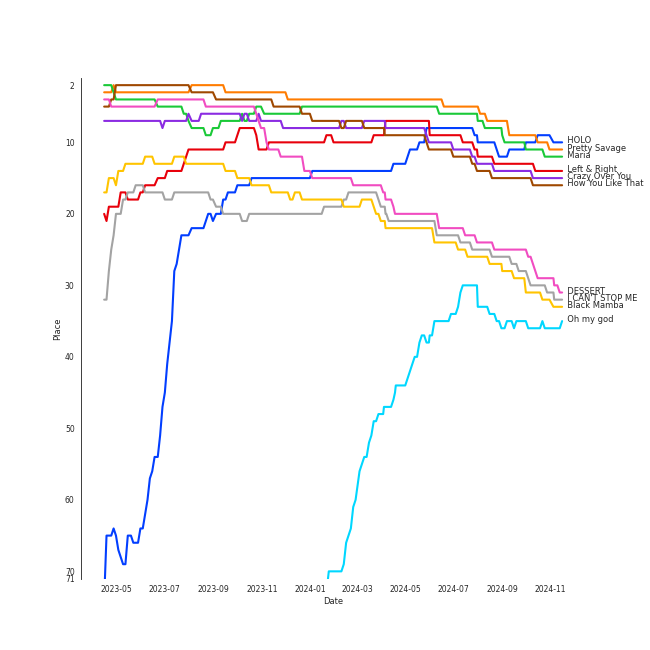

# Tracks in K-Pop Favorites from 2020

## Artists

| Art | Rank | Tracks | 💚 | Artist | 🔗 |
|:---|---:|---:|---:|:---|:---|
|  | 3 | 3 | 3 | [BLACKPINK](../../../artists/blackpink/overview.md) | [🔗](https://open.spotify.com/artist/41MozSoPIsD1dJM0CLPjZF) |
|  | 12 | 2 | 2 | [SEVENTEEN](../../../artists/seventeen/overview.md) | [🔗](https://open.spotify.com/artist/7nqOGRxlXj7N2JYbgNEjYH) |
|  | 9 | 2 | 2 | [TWICE](../../../artists/twice/overview.md) | [🔗](https://open.spotify.com/artist/7n2Ycct7Beij7Dj7meI4X0) |
|  | 97 | 2 | 2 | Red Velvet - IRENE & SEULGI | [🔗](https://open.spotify.com/artist/6bwp9ObI8FWvMPCIWVBmhl) |
|  | 36 | 2 | 2 | [EVERGLOW](../../../artists/everglow/overview.md) | [🔗](https://open.spotify.com/artist/3ZZzT0naD25RhY2uZvIKkJ) |
|  | 11 | 1 | 1 | [LeeHi](../../../artists/leehi/overview.md) | [🔗](https://open.spotify.com/artist/7cVZApDoQZpS447nHTsNqu) |
|  | 42 | 1 | 1 | [HWASA](../../../artists/hwasa/overview.md) | [🔗](https://open.spotify.com/artist/7bmYpVgQub656uNTu6qGNQ) |
|  | 108 | 1 | 1 | KAI | [🔗](https://open.spotify.com/artist/6iVo62B0bdTknRcrktCmak) |
|  | 1 | 1 | 1 | [aespa](../../../artists/aespa/overview.md) | [🔗](https://open.spotify.com/artist/6YVMFz59CuY7ngCxTxjpxE) |
|  | 22 | 1 | 1 | [JEON SOYEON](../../../artists/jeon_soyeon/overview.md) | [🔗](https://open.spotify.com/artist/6Xg22wJOAcnvPUfk5WvODH) |

View all

| Art | Rank | Tracks | 💚 | Artist | 🔗 |
|:---|---:|---:|---:|:---|:---|
|  | 60 | 1 | 1 | [CLC](../../../artists/clc/overview.md) | [🔗](https://open.spotify.com/artist/6QyO41KctzGc70mVaVnXQO) |
|  | 41 | 1 | 1 | [ATEEZ](../../../artists/ateez/overview.md) | [🔗](https://open.spotify.com/artist/68KmkJeZGfwe1OUaivBa2L) |
|  | 7 | 1 | 1 | [ENHYPEN](../../../artists/enhypen/overview.md) | [🔗](https://open.spotify.com/artist/5t5FqBwTcgKTaWmfEbwQY9) |
|  | 29 | 1 | 1 | [Dreamcatcher](../../../artists/dreamcatcher/overview.md) | [🔗](https://open.spotify.com/artist/5V1qsQHdXNm4ZEZHWvFnqQ) |
|  | 409 | 1 | 1 | SuperM | [🔗](https://open.spotify.com/artist/5BHFSMEjfLVx1JwRWjAOsE) |
|  | 96 | 1 | 1 | [LOONA](../../../artists/loona/overview.md) | [🔗](https://open.spotify.com/artist/52zMTJCKluDlFwMQWmccY7) |
|  | 51 | 1 | 1 | [BAEKHYUN](../../../artists/baekhyun/overview.md) | [🔗](https://open.spotify.com/artist/4ufh0WuMZh6y4Dmdnklvdl) |
|  | 8 | 1 | 1 | [TAEYEON](../../../artists/taeyeon/overview.md) | [🔗](https://open.spotify.com/artist/3qNVuliS40BLgXGxhdBdqu) |
|  | 238 | 1 | 1 | [NCT U](../../../artists/nct_u/overview.md) | [🔗](https://open.spotify.com/artist/3paGCCtX1Xr4Gx53mSeZuQ) |
|  | 55 | 1 | 1 | Loopy | [🔗](https://open.spotify.com/artist/3l9s67pOK4Stw9yW1wr0Bg) |
|  | 54 | 1 | 1 | HYO | [🔗](https://open.spotify.com/artist/3U7bOaJLuFkrmDQ1C1OqKl) |
|  | 26 | 1 | 1 | [BTS](../../../artists/bts/overview.md) | [🔗](https://open.spotify.com/artist/3Nrfpe0tUJi4K4DXYWgMUX) |
|  | 10 | 1 | 1 | [Stray Kids](../../../artists/stray_kids/overview.md) | [🔗](https://open.spotify.com/artist/2dIgFjalVxs4ThymZ67YCE) |
|  | 409 | 1 | 1 | LUNCH | [🔗](https://open.spotify.com/artist/2UVzzx3MOPYV3l6xW2lzBv) |
|  | 5 | 1 | 1 | [ITZY](../../../artists/itzy/overview.md) | [🔗](https://open.spotify.com/artist/2KC9Qb60EaY0kW4eH68vr3) |
|  | 6 | 1 | 1 | [(G)I-DLE](../../../artists/(g)i-dle/overview.md) | [🔗](https://open.spotify.com/artist/2AfmfGFbe0A0WsTYm0SDTx) |
|  | 89 | 1 | 1 | [OH MY GIRL](../../../artists/oh_my_girl/overview.md) | [🔗](https://open.spotify.com/artist/2019zR22qK2RBvCqtudBaI) |
|  | 66 | 1 | 1 | [PENTAGON](../../../artists/pentagon/overview.md) | [🔗](https://open.spotify.com/artist/1wKpMkucynaTfG8lyPprYV) |
|  | 409 | 1 | 1 | GFRIEND | [🔗](https://open.spotify.com/artist/0qlWcS66ohOIi0M8JZwPft) |
|  | 13 | 1 | 1 | [MAMAMOO](../../../artists/mamamoo/overview.md) | [🔗](https://open.spotify.com/artist/0XATRDCYuuGhk0oE7C0o5G) |
|  | 16 | 1 | 1 | [STAYC](../../../artists/stayc/overview.md) | [🔗](https://open.spotify.com/artist/01XYiBYaoMJcNhPokrg0l0) |

## Albums

| Art | Rank | Tracks | 💚 | Album | Release Date | 🔗 |
|:---|---:|---:|---:|:---|:---|:---|
|  | 1 | 3 | 3 | THE ALBUM | 2020-10-02 | [🔗](https://open.spotify.com/album/71O60S5gIJSIAhdnrDIh3N) |
|  | 598 | 1 | 1 | 回:Walpurgis Night | 2020-11-09 | [🔗](https://open.spotify.com/album/6keRNtq7CnhNrD2EIKOA6h) |
|  | 545 | 1 | 1 | reminiscence | 2020-02-03 | [🔗](https://open.spotify.com/album/0zH0C0fkzAjhSnGKLOuxwX) |
|  | 598 | 1 | 1 | [12:00] | 2020-10-19 | [🔗](https://open.spotify.com/album/3obToaukLcPbCLPPmWFzQi) |
|  | 96 | 1 | 1 | What Do I Call You - The 4th Mini Album | 2020-12-15 | [🔗](https://open.spotify.com/album/70XJeDlFe1LmZo1lyFKyq3) |
|  | 137 | 1 | 1 | WE:TH | 2020-10-12 | [🔗](https://open.spotify.com/album/1ASYbBYBwV6Rcfc2ycqmlK) |
|  | 510 | 1 | 1 | TREASURE EPILOGUE : Action To Answer | 2020-01-06 | [🔗](https://open.spotify.com/album/3TTkDOcSzRQCvGMT7VmmPE) |
|  | 133 | 1 | 1 | TRAVEL | 2020-11-03 | [🔗](https://open.spotify.com/album/3xje7wSW2xwQx2GNJ5cfNu) |
|  | 598 | 1 | 1 | Super One -The 1st Album | 2020-09-25 | [🔗](https://open.spotify.com/album/10fdwvVIpa0raPkZUTILAt) |
|  | 186 | 1 | 1 | Star To A Young Culture | 2020-11-12 | [🔗](https://open.spotify.com/album/4PrRd0lIunUEiiE5rbZklR) |

View all

| Art | Rank | Tracks | 💚 | Album | Release Date | 🔗 |
|:---|---:|---:|---:|:---|:---|:---|
|  | 162 | 1 | 1 | Naughty | 2020-07-20 | [🔗](https://open.spotify.com/album/2lkUE2gkw5sX0fGzZZCs0N) |
|  | 130 | 1 | 1 | NONSTOP | 2020-04-27 | [🔗](https://open.spotify.com/album/7J8Kp48L7RdLkpjSVrO5PY) |
|  | 326 | 1 | 1 | NCT RESONANCE Pt. 1 - The 2nd Album | 2020-10-12 | [🔗](https://open.spotify.com/album/6kudlOyCqSQfsBVSdPZEu4) |
|  | 111 | 1 | 1 | Monster - The 1st Mini Album | 2020-07-06 | [🔗](https://open.spotify.com/album/4DFheSBXhfewjz7SSe4Kyc) |
|  | 11 | 1 | 1 | María | 2020-06-29 | [🔗](https://open.spotify.com/album/5YYY7QCkq3pSw4Hoc1m0D3) |
|  | 598 | 1 | 1 | MAP OF THE SOUL : 7 | 2020-02-21 | [🔗](https://open.spotify.com/album/5W1XY5ucNATjTULERvXx9j) |
|  | 178 | 1 | 1 | KAI - The 1st Mini Album | 2020-11-30 | [🔗](https://open.spotify.com/album/6xpxMAUhk8hiDTa5zT7F86) |
|  | 520 | 1 | 1 | IT'z ME | 2020-03-09 | [🔗](https://open.spotify.com/album/7ynKAohxfwPUZzvU8f1p1U) |
|  | 127 | 1 | 1 | IN LIFE | 2020-09-14 | [🔗](https://open.spotify.com/album/0aERWcI2KYSCM4biUihB9X) |
|  | 33 | 1 | 1 | I trust | 2020-04-06 | [🔗](https://open.spotify.com/album/57sl8AvqVqm4Fadre0z8FQ) |
|  | 598 | 1 | 1 | I Don't Need You | 2020-06-07 | [🔗](https://open.spotify.com/album/6W4mS8VsOi2WAkkMuh9SJ9) |
|  | 15 | 1 | 1 | Heng:garæ | 2020-06-22 | [🔗](https://open.spotify.com/album/3q6lN3kfsDgGaQUC7kVASH) |
|  | 14 | 1 | 1 | HOLO | 2020-07-23 | [🔗](https://open.spotify.com/album/5xq9sm0jGMMDu5LifpBBo1) |
|  | 66 | 1 | 1 | HELICOPTER | 2020-09-02 | [🔗](https://open.spotify.com/album/1uwfxRAhW1hxclCVkzku8d) |
|  | 26 | 1 | 1 | Eyes Wide Open | 2020-10-26 | [🔗](https://open.spotify.com/album/33jypnU7WULxPaVrjj4RXH) |
|  | 24 | 1 | 1 | DESSERT | 2020-07-22 | [🔗](https://open.spotify.com/album/5brSFD1knAOSM7j6083naD) |
|  | 207 | 1 | 1 | CRY FOR ME | 2020-12-18 | [🔗](https://open.spotify.com/album/2aRAPmBCEdo9pWimsI5l87) |
|  | 27 | 1 | 1 | Black Mamba | 2020-11-17 | [🔗](https://open.spotify.com/album/3syEYrKIsgxaZMB5t1dVG7) |
|  | 430 | 1 | 1 | BORDER : DAY ONE | 2020-11-30 | [🔗](https://open.spotify.com/album/3YxF7jTnpdNepWbO42f8lH) |
|  | 47 | 1 | 1 | Amusement Park | 2020-12-21 | [🔗](https://open.spotify.com/album/1azcqabc4kDgRNMWFA02wZ) |
|  | 84 | 1 | 1 | ; [Semicolon] | 2020-10-19 | [🔗](https://open.spotify.com/album/1EMYSiKKTSKLZrOC2nTStL) |
|  | 247 | 1 | 1 | 1st Album [Dystopia : The Tree of Language] | 2020-02-18 | [🔗](https://open.spotify.com/album/6m5pDOafdvIKxNRxx5hVbr) |
|  | 528 | 1 | 1 | -77.82x-78.29 | 2020-09-21 | [🔗](https://open.spotify.com/album/4kMID9cggWEko9mOb1zisI) |

## Tracks

| Art | Track | Album | Artists | Label | Rank | 💚 | 🔗 |
|:---|:---|:---|:---|:---|---:|:---|:---|
|  | Pretty Savage | THE ALBUM | [BLACKPINK](../../../artists/blackpink/overview.md) | [Interscope Records](../../../labels/interscope_records), [YG Entertainment](../../../labels/yg_entertainment) | 5 | 💚 | [🔗](https://open.spotify.com/track/1XnpzbOGptRwfJhZgLbmSr) |
|  | Maria | María | [HWASA](../../../artists/hwasa/overview.md) | [RBW, Inc](../../../labels/rbw_inc_) | 6 | 💚 | [🔗](https://open.spotify.com/track/0ZeGfEAL5Rl4pd5LZBGuEK) |
|  | HOLO | HOLO | [LeeHi](../../../artists/leehi/overview.md) | [Genie Music Corporation](../../../labels/genie_music_corporation), [Stone Music Entertainment](../../../labels/stone_music_entertainment) | 8 | 💚 | [🔗](https://open.spotify.com/track/4BSluGpjdLQihMmKgHXMxp) |
|  | Left & Right | Heng:garæ | [SEVENTEEN](../../../artists/seventeen/overview.md) | [PLEDIS Entertainment](../../../labels/pledis_entertainment) | 9 | 💚 | [🔗](https://open.spotify.com/track/5QGooKayQPVZMUDc8Qt3Dm) |
|  | Crazy Over You | THE ALBUM | [BLACKPINK](../../../artists/blackpink/overview.md) | [Interscope Records](../../../labels/interscope_records), [YG Entertainment](../../../labels/yg_entertainment) | 11 | 💚 | [🔗](https://open.spotify.com/track/7qq0EOPW4RRlqdvMBmdd73) |
|  | How You Like That | THE ALBUM | [BLACKPINK](../../../artists/blackpink/overview.md) | [Interscope Records](../../../labels/interscope_records), [YG Entertainment](../../../labels/yg_entertainment) | 12 | 💚 | [🔗](https://open.spotify.com/track/4SFknyjLcyTLJFPKD2m96o) |
|  | DESSERT | DESSERT | HYO, Loopy, [JEON SOYEON](../../../artists/jeon_soyeon/overview.md) | [SM Entertainment](../../../labels/sm_entertainment) | 22 | 💚 | [🔗](https://open.spotify.com/track/6u0pZe0Uv7GBR0iKptfWRf) |
|  | I CAN'T STOP ME | Eyes Wide Open | [TWICE](../../../artists/twice/overview.md) | [Republic Records](../../../labels/republic_records) | 24 | 💚 | [🔗](https://open.spotify.com/track/37ZtpRBkHcaq6hHy0X98zn) |
|  | Black Mamba | Black Mamba | [aespa](../../../artists/aespa/overview.md) | [SM Entertainment](../../../labels/sm_entertainment) | 25 | 💚 | [🔗](https://open.spotify.com/track/1t2qYCAjUAoGfeFeoBlK51) |
|  | Oh my god | I trust | [(G)I-DLE](../../../artists/(g)i-dle/overview.md) | [Universal Music LLC](../../../labels/universal_music_llc) | 31 | 💚 | [🔗](https://open.spotify.com/track/2DmRXiyn03tOqKgEJXlaiJ) |

View all

| Art | Track | Album | Artists | Label | Rank | 💚 | 🔗 |
|:---|:---|:---|:---|:---|---:|:---|:---|
|  | Amusement Park | Amusement Park | [BAEKHYUN](../../../artists/baekhyun/overview.md) | [SM Entertainment](../../../labels/sm_entertainment) | 50 | 💚 | [🔗](https://open.spotify.com/track/1TUkEXQrskATO9SoB4QMUN) |
|  | HELICOPTER | HELICOPTER | [CLC](../../../artists/clc/overview.md) | [Universal Music LLC](../../../labels/universal_music_llc) | 64 | 💚 | [🔗](https://open.spotify.com/track/2hJS7BdEaH9Jo8MeJujsHT) |
|  | HOME;RUN | ; [Semicolon] | [SEVENTEEN](../../../artists/seventeen/overview.md) | [PLEDIS Entertainment](../../../labels/pledis_entertainment) | 94 | 💚 | [🔗](https://open.spotify.com/track/2iW0q5jJJT5HKlIs25AAgv) |
|  | What Do I Call You | What Do I Call You - The 4th Mini Album | [TAEYEON](../../../artists/taeyeon/overview.md) | [SM Entertainment](../../../labels/sm_entertainment) | 119 | 💚 | [🔗](https://open.spotify.com/track/3Wu4lFjkhcXxB6WWaX9gtr) |
|  | Monster | Monster - The 1st Mini Album | Red Velvet - IRENE & SEULGI | [SM Entertainment](../../../labels/sm_entertainment) | 143 | 💚 | [🔗](https://open.spotify.com/track/6c1QaQHdDhtFMfUkhueuXK) |
|  | Back Door | IN LIFE | [Stray Kids](../../../artists/stray_kids/overview.md) | [Republic Records](../../../labels/republic_records) | 162 | 💚 | [🔗](https://open.spotify.com/track/0XuepwFJUcKN8T5zTqoP0F) |
|  | Dolphin | NONSTOP | [OH MY GIRL](../../../artists/oh_my_girl/overview.md) | [WM Entertainment](../../../labels/wm_entertainment) | 171 | 💚 | [🔗](https://open.spotify.com/track/3NfgdU9mbIVhcJF3XvC0c9) |
|  | AYA | TRAVEL | [MAMAMOO](../../../artists/mamamoo/overview.md) | [RBW Inc.](../../../labels/rbw_inc_) | 175 | 💚 | [🔗](https://open.spotify.com/track/4BZXVFYCb76Q0Klojq4piV) |
|  | Daisy | WE:TH | [PENTAGON](../../../artists/pentagon/overview.md) | [Universal Music LLC](../../../labels/universal_music_llc) | 178 | 💚 | [🔗](https://open.spotify.com/track/14pjnaIqkpReO5D0tHofAS) |
|  | Naughty | Naughty | Red Velvet - IRENE & SEULGI | [SM Entertainment](../../../labels/sm_entertainment) | 223 | 💚 | [🔗](https://open.spotify.com/track/0P8lbWigAHXPKxUG60xh79) |
|  | Mmmh | KAI - The 1st Mini Album | KAI | [SM Entertainment](../../../labels/sm_entertainment) | 243 | 💚 | [🔗](https://open.spotify.com/track/5dntGTbUtmUO239wQ0k3yM) |
|  | SO BAD | Star To A Young Culture | [STAYC](../../../artists/stayc/overview.md) | [High Up Entertainment](../../../labels/high_up_entertainment) | 256 | 💚 | [🔗](https://open.spotify.com/track/13KR2yNRDrbKwR3dOKCDl4) |
|  | CRY FOR ME | CRY FOR ME | [TWICE](../../../artists/twice/overview.md) | [Republic Records](../../../labels/republic_records) | 283 | 💚 | [🔗](https://open.spotify.com/track/2xtP8RNbo2BEMzLX7tK7aq) |
|  | Make A Wish (Birthday Song) | NCT RESONANCE Pt. 1 - The 2nd Album | [NCT U](../../../artists/nct_u/overview.md) | [SM Entertainment](../../../labels/sm_entertainment) | 461 | 💚 | [🔗](https://open.spotify.com/track/6FdShjf7nA2cqEnpv1tIia) |
|  | Red Sun | 1st Album [Dystopia : The Tree of Language] | [Dreamcatcher](../../../artists/dreamcatcher/overview.md) | [Dreamcatcher Company](../../../labels/dreamcatcher_company) | 532 | 💚 | [🔗](https://open.spotify.com/track/0WXmPCkeeLjpTddcBI98GV) |
|  | Given-Taken | BORDER : DAY ONE | [ENHYPEN](../../../artists/enhypen/overview.md) | [BELIFT LAB](../../../labels/belift_lab) | 635 | 💚 | [🔗](https://open.spotify.com/track/69WpV0U7OMNFGyq8I63dcC) |
|  | Answer | TREASURE EPILOGUE : Action To Answer | [ATEEZ](../../../artists/ateez/overview.md) | [KQ Entertainment](../../../labels/kq_entertainment) | 757 | 💚 | [🔗](https://open.spotify.com/track/3IdPtyJHB1WVPM4eCiCAKM) |
|  | WANNABE | IT'z ME | [ITZY](../../../artists/itzy/overview.md) | [Republic Records](../../../labels/republic_records) | 770 | 💚 | [🔗](https://open.spotify.com/track/4pspYVQGFHLPEFgQPD1J7e) |
|  | LA DI DA | -77.82x-78.29 | [EVERGLOW](../../../artists/everglow/overview.md) | YUEHUA ENTERTAINMENT KOREA | 782 | 💚 | [🔗](https://open.spotify.com/track/6mIjJONoUMvGPT9Kzrab3L) |
|  | DUN DUN | reminiscence | [EVERGLOW](../../../artists/everglow/overview.md) | [Genie Music Corporation](../../../labels/genie_music_corporation), [Stone Music Entertainment](../../../labels/stone_music_entertainment) | 813 | 💚 | [🔗](https://open.spotify.com/track/3ejAkJLWQSEJDqDXxK3efB) |
|  | Black Swan | MAP OF THE SOUL : 7 | [BTS](../../../artists/bts/overview.md) | [BIGHIT MUSIC](../../../labels/bighit_music) | 893 | 💚 | [🔗](https://open.spotify.com/track/2EmcTFQ1rM11wp2ztsXTHa) |
|  | I Don't Need You | I Don't Need You | LUNCH | [WM Korea](../../../labels/wm_korea) | 893 | 💚 | [🔗](https://open.spotify.com/track/5I9mKWUEM2RICe6QJ26PyM) |
|  | Tiger Inside | Super One -The 1st Album | SuperM | [Capitol Records](../../../labels/capitol_records), [SM Entertainment](../../../labels/sm_entertainment) | 893 | 💚 | [🔗](https://open.spotify.com/track/1ADlTU9mFc3oDdD9Vla2Yw) |
|  | Why Not? | [12:00] | [LOONA](../../../artists/loona/overview.md) | BlockBerryCreative | 893 | 💚 | [🔗](https://open.spotify.com/track/6yGQ86UppYULzTCxAWgwVN) |
|  | MAGO | 回:Walpurgis Night | GFRIEND | [SOURCE MUSIC](../../../labels/source_music) | 893 | 💚 | [🔗](https://open.spotify.com/track/46WaBBaEHzgbN88Ew0nh50) |

