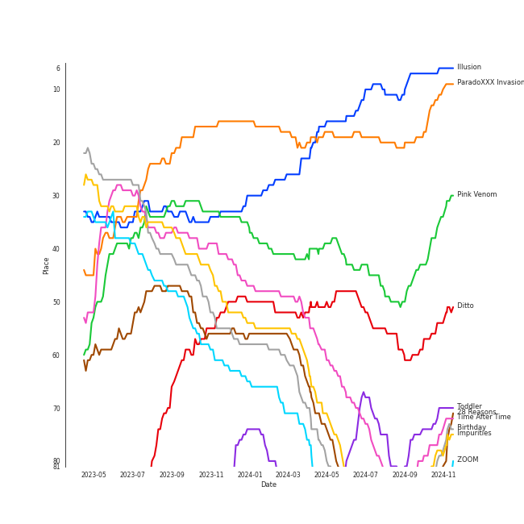

# Tracks in K-Pop Favorites from 2022

## Artists

| Art | Rank | Tracks | 💚 | Artist | 🔗 |
|:---|---:|---:|---:|:---|:---|
|  | 15 | 4 | 4 | [LE SSERAFIM](../../../artists/le_sserafim/overview.md) | [🔗](https://open.spotify.com/artist/4SpbR6yFEvexJuaBpgAU5p) |
|  | 8 | 4 | 4 | [TAEYEON](../../../artists/taeyeon/overview.md) | [🔗](https://open.spotify.com/artist/3qNVuliS40BLgXGxhdBdqu) |
|  | 92 | 3 | 3 | MAX CHANGMIN | [🔗](https://open.spotify.com/artist/7FiAkNWMb6ZBYI8tbQLuIS) |
|  | 2 | 3 | 3 | [Red Velvet](../../../artists/red_velvet/overview.md) | [🔗](https://open.spotify.com/artist/1z4g3DjTBBZKhvAroFlhOM) |
|  | 1 | 2 | 2 | [aespa](../../../artists/aespa/overview.md) | [🔗](https://open.spotify.com/artist/6YVMFz59CuY7ngCxTxjpxE) |
|  | 23 | 2 | 2 | [NewJeans](../../../artists/newjeans/overview.md) | [🔗](https://open.spotify.com/artist/6HvZYsbFfjnjFrWF950C9d) |
|  | 32 | 2 | 2 | [BoA](../../../artists/boa/overview.md) | [🔗](https://open.spotify.com/artist/4muJrGMndyYWqZtfk8OWy4) |
|  | 3 | 2 | 2 | [BLACKPINK](../../../artists/blackpink/overview.md) | [🔗](https://open.spotify.com/artist/41MozSoPIsD1dJM0CLPjZF) |
|  | 70 | 2 | 2 | [TREASURE](../../../artists/treasure/overview.md) | [🔗](https://open.spotify.com/artist/3KonOYiLsU53m4yT7gNotP) |
|  | 10 | 2 | 2 | [Stray Kids](../../../artists/stray_kids/overview.md) | [🔗](https://open.spotify.com/artist/2dIgFjalVxs4ThymZ67YCE) |

View all

| Art | Rank | Tracks | 💚 | Artist | 🔗 |
|:---|---:|---:|---:|:---|:---|
|  | 35 | 2 | 2 | [SEULGI](../../../artists/seulgi/overview.md) | [🔗](https://open.spotify.com/artist/2QM5S4yO6xHgnNvF0nbZZq) |
|  | 5 | 2 | 2 | [ITZY](../../../artists/itzy/overview.md) | [🔗](https://open.spotify.com/artist/2KC9Qb60EaY0kW4eH68vr3) |
|  | 6 | 2 | 2 | [(G)I-DLE](../../../artists/(g)i-dle/overview.md) | [🔗](https://open.spotify.com/artist/2AfmfGFbe0A0WsTYm0SDTx) |
|  | 27 | 2 | 2 | [NMIXX](../../../artists/nmixx/overview.md) | [🔗](https://open.spotify.com/artist/28ot3wh4oNmoFOdVajibBl) |
|  | 72 | 2 | 2 | [Jackson Wang](../../../artists/jackson_wang/overview.md) | [🔗](https://open.spotify.com/artist/1kfWoWgCugPkyxQP8lkRlY) |
|  | 24 | 2 | 2 | [NCT DREAM](../../../artists/nct_dream/overview.md) | [🔗](https://open.spotify.com/artist/1gBUSTR3TyDdTVFIaQnc02) |
|  | 17 | 2 | 2 | [STAYC](../../../artists/stayc/overview.md) | [🔗](https://open.spotify.com/artist/01XYiBYaoMJcNhPokrg0l0) |
|  | 30 | 1 | 1 | [NCT 127](../../../artists/nct_127/overview.md) | [🔗](https://open.spotify.com/artist/7f4ignuCJhLXfZ9giKT7rH) |
|  | 243 | 1 | 1 | MARK | [🔗](https://open.spotify.com/artist/70DFixYAFPv4Pf9kgSfR9O) |
|  | 31 | 1 | 1 | [GOT the beat](../../../artists/got_the_beat/overview.md) | [🔗](https://open.spotify.com/artist/6uNxlIP5lzPFf0BHuELOuX) |
|  | 68 | 1 | 1 | [BIBI](../../../artists/bibi/overview.md) | [🔗](https://open.spotify.com/artist/6UbmqUEgjLA6jAcXwbM1Z9) |
|  | 18 | 1 | 1 | [IVE](../../../artists/ive/overview.md) | [🔗](https://open.spotify.com/artist/6RHTUrRF63xao58xh9FXYJ) |
|  | 38 | 1 | 1 | [SUNMI](../../../artists/sunmi/overview.md) | [🔗](https://open.spotify.com/artist/6MoXcK2GyGg7FIyxPU5yW6) |
|  | 60 | 1 | 1 | [PURPLE KISS](../../../artists/purple_kiss/overview.md) | [🔗](https://open.spotify.com/artist/62T5PGHWJ9sxP2SJq20IHq) |
|  | 7 | 1 | 1 | [ENHYPEN](../../../artists/enhypen/overview.md) | [🔗](https://open.spotify.com/artist/5t5FqBwTcgKTaWmfEbwQY9) |
|  | 79 | 1 | 1 | NINGNING | [🔗](https://open.spotify.com/artist/5t1uryofgueHrjrryqX8vM) |
|  | 37 | 1 | 1 | [HEIZE](../../../artists/heize/overview.md) | [🔗](https://open.spotify.com/artist/5dCvSnVduaFleCnyy98JMo) |
|  | 355 | 1 | 1 | WOOSUNG | [🔗](https://open.spotify.com/artist/5LHu1iF8m0XtRBEJbbwSoo) |
|  | 168 | 1 | 1 | BIGBANG | [🔗](https://open.spotify.com/artist/4Kxlr1PRlDKEB0ekOCyHgX) |
|  | 96 | 1 | 1 | Christopher | [🔗](https://open.spotify.com/artist/3zDRCqOhJXJfS2YWOEwGMC) |
|  | 78 | 1 | 1 | AILEE | [🔗](https://open.spotify.com/artist/3uGFTJ7JMllvhgGpumieHF) |
|  | 73 | 1 | 1 | [WINTER](../../../artists/winter/overview.md) | [🔗](https://open.spotify.com/artist/3mPquBmMu97Iq9TpzQ6ayI) |
|  | 50 | 1 | 1 | [TEN](../../../artists/ten/overview.md) | [🔗](https://open.spotify.com/artist/3Q5Qep7ytrjVleNnMnntgQ) |
|  | 25 | 1 | 1 | [BTS](../../../artists/bts/overview.md) | [🔗](https://open.spotify.com/artist/3Nrfpe0tUJi4K4DXYWgMUX) |
|  | 110 | 1 | 1 | [P1Harmony](../../../artists/p1harmony/overview.md) | [🔗](https://open.spotify.com/artist/3JjvsPeGMbDJqsphe2z8xU) |
|  | 332 | 1 | 1 | JAMIE | [🔗](https://open.spotify.com/artist/2YXlVLKq3X3soXd2aXUtIT) |
|  | 14 | 1 | 1 | [CHUNG HA](../../../artists/chung_ha/overview.md) | [🔗](https://open.spotify.com/artist/2PSJ6YriU7JsFucxACpU7Y) |
|  | 20 | 1 | 1 | [Billlie](../../../artists/billlie/overview.md) | [🔗](https://open.spotify.com/artist/2GQxKDojobwBjZMPf7aoh0) |
|  | 66 | 1 | 1 | [PENTAGON](../../../artists/pentagon/overview.md) | [🔗](https://open.spotify.com/artist/1wKpMkucynaTfG8lyPprYV) |
|  | 372 | 1 | 1 | Xdinary Heroes | [🔗](https://open.spotify.com/artist/1khChLj7REGqjM043PlYyn) |
|  | 28 | 1 | 1 | [WENDY](../../../artists/wendy/overview.md) | [🔗](https://open.spotify.com/artist/0FRUZvZNPzM3YJMABJxf2K) |

## Albums

| Art | Rank | Tracks | 💚 | Album | Release Date | 🔗 |
|:---|---:|---:|---:|:---|:---|:---|
|  | 39 | 3 | 3 | INVU - The 3rd Album | 2022-02-14 | [🔗](https://open.spotify.com/album/7i2YLTVQ0dyngRuUqtGmr9) |
|  | 64 | 3 | 3 | ANTIFRAGILE | 2022-10-17 | [🔗](https://open.spotify.com/album/3u0ggfmK0vjuHMNdUbtaa9) |
|  | 29 | 2 | 2 | ‘The ReVe Festival 2022 - Birthday’ | 2022-11-28 | [🔗](https://open.spotify.com/album/58OR7UoaJkJzqeQGClHzh1) |
|  | 255 | 2 | 2 | MAGIC MAN | 2022-09-09 | [🔗](https://open.spotify.com/album/2VZ4og2ZbwyTQ3X1rbgCe1) |
|  | 13 | 2 | 2 | Girls - The 2nd Mini Album | 2022-07-08 | [🔗](https://open.spotify.com/album/4w1dbvUy1crv0knXQvcSeY) |
|  | 159 | 2 | 2 | Devil - The 2nd Mini Album | 2022-01-13 | [🔗](https://open.spotify.com/album/6bG2rY8NzT7dIzUNADDNCR) |
|  | 37 | 2 | 2 | BORN PINK | 2022-09-16 | [🔗](https://open.spotify.com/album/7jaSNQUBJbvfbZHLNFrV7P) |
|  | 61 | 2 | 2 | 28 Reasons - The 1st Mini Album | 2022-10-04 | [🔗](https://open.spotify.com/album/1t5a29WYbJj83iy3RNICHw) |
|  | 62 | 2 | 2 | 2022 Winter SMTOWN : SMCU PALACE | 2022-12-26 | [🔗](https://open.spotify.com/album/1HwnXJfZx8N8qDfzwUbxcw) |
|  | 72 | 1 | 1 | ‘The ReVe Festival 2022 - Feel My Rhythm’ | 2022-03-21 | [🔗](https://open.spotify.com/album/3HgoCO9wWuPcNhz8Ip4C46) |

View all

| Art | Rank | Tracks | 💚 | Album | Release Date | 🔗 |
|:---|---:|---:|---:|:---|:---|:---|
|  | 151 | 1 | 1 | the Billage of perception: chapter two | 2022-08-31 | [🔗](https://open.spotify.com/album/0NuM7kwh6u6fIRjn7Zh7Ss) |
|  | 235 | 1 | 1 | YOUNG-LUV.COM | 2022-02-21 | [🔗](https://open.spotify.com/album/2xPdgNkM4yIQmP7axJ1T1o) |
|  | 103 | 1 | 1 | When I Get Old | 2022-10-20 | [🔗](https://open.spotify.com/album/3mJMHqT2w0HwjQkneNVE14) |
|  | 363 | 1 | 1 | Voltage | 2022-03-23 | [🔗](https://open.spotify.com/album/3MXVqfk9VG3B757nLlow0D) |
|  | 164 | 1 | 1 | Undo | 2022-06-30 | [🔗](https://open.spotify.com/album/2xR7YEyRweqClzs50bbW3J) |
|  | 106 | 1 | 1 | THE SECOND STEP : CHAPTER TWO | 2022-10-04 | [🔗](https://open.spotify.com/album/4l5YvRcmno5RMKZCZp1j0g) |
|  | 341 | 1 | 1 | THE SECOND STEP : CHAPTER ONE | 2022-02-15 | [🔗](https://open.spotify.com/album/17l09k7ZDb4GYwmsIVGcRZ) |
|  | 552 | 1 | 1 | Still Life | 2022-04-05 | [🔗](https://open.spotify.com/album/2oCAY48bhZvQte0l7apmYC) |
|  | 437 | 1 | 1 | Step Back | 2022-01-03 | [🔗](https://open.spotify.com/album/3gwL04bGAX4Kc2D5Wd7NMk) |
|  | 452 | 1 | 1 | Proof | 2022-06-10 | [🔗](https://open.spotify.com/album/6al2VdKbb6FIz9d7lU7WRB) |
|  | 507 | 1 | 1 | Pity Party | 2022-02-03 | [🔗](https://open.spotify.com/album/2yMHiLYBnrMsdUCUL3bFkU) |
|  | 113 | 1 | 1 | POPPY (Japanese Ver.) | 2022-11-16 | [🔗](https://open.spotify.com/album/2nei1QXcpDotdoMz3IQxr4) |
|  | 327 | 1 | 1 | ODDINARY | 2022-03-18 | [🔗](https://open.spotify.com/album/0Gmf4pfe0POEQq2FgGAj2q) |
|  | 100 | 1 | 1 | NewJeans 1st EP 'New Jeans' | 2022-08-01 | [🔗](https://open.spotify.com/album/1HMLpmZAnNyl9pxvOnTovV) |
|  | 591 | 1 | 1 | MOTH | 2022-05-13 | [🔗](https://open.spotify.com/album/7JdpeV87hczflCV8GXF3yV) |
|  | 22 | 1 | 1 | MANIFESTO : DAY 1 | 2022-07-04 | [🔗](https://open.spotify.com/album/5J8MNLLViH5zqM6VoGErz8) |
|  | 93 | 1 | 1 | Lowlife Princess: Noir | 2022-11-18 | [🔗](https://open.spotify.com/album/0AwCgoJKJUOgLp1imhnxuH) |
|  | 228 | 1 | 1 | LOVE DIVE | 2022-04-05 | [🔗](https://open.spotify.com/album/1AFVTHHm7kKoQ6Rgb25x3p) |
|  | 445 | 1 | 1 | IN:VITE U | 2022-01-24 | [🔗](https://open.spotify.com/album/5vxZM8rFJiNvjtAThYnwek) |
|  | 587 | 1 | 1 | I'M LOVIN' AMY | 2022-03-07 | [🔗](https://open.spotify.com/album/1N3ZneaWp9SVREC9JSgsia) |
|  | 90 | 1 | 1 | I love | 2022-10-17 | [🔗](https://open.spotify.com/album/2Hyuin3i1cSZ1FlQFeCPZH) |
|  | 148 | 1 | 1 | I NEVER DIE | 2022-03-14 | [🔗](https://open.spotify.com/album/1T2W9vDajFreUuycPDjUXk) |
|  | 591 | 1 | 1 | Hello, world! | 2022-07-20 | [🔗](https://open.spotify.com/album/5zjnlpEemkmaN6iv16vmDm) |
|  | 105 | 1 | 1 | Heart Burn | 2022-06-29 | [🔗](https://open.spotify.com/album/0ahb3lp7jXxKUx3beS7AVu) |
|  | 591 | 1 | 1 | HARMONY : ZERO IN | 2022-07-20 | [🔗](https://open.spotify.com/album/73CTPjApMDvFsycjbbROji) |
|  | 591 | 1 | 1 | Glitch Mode - The 2nd Album | 2022-03-28 | [🔗](https://open.spotify.com/album/4cAcTMGFjTBufC7Eu0FizU) |
|  | 591 | 1 | 1 | Geekyland | 2022-07-25 | [🔗](https://open.spotify.com/album/7EDCoH5wfSGYdZ7wXCmTF4) |
|  | 130 | 1 | 1 | Forgive Me - The 3rd Mini Album | 2022-11-22 | [🔗](https://open.spotify.com/album/0vufEpmNpfB9NUPLkbIBN7) |
|  | 136 | 1 | 1 | FEARLESS | 2022-05-02 | [🔗](https://open.spotify.com/album/4Mc7WwYH41hgUWeKX25Sot) |
|  | 591 | 1 | 1 | ENTWURF | 2022-09-19 | [🔗](https://open.spotify.com/album/3wMlxC4t3dN70e1OF8wUfz) |
|  | 49 | 1 | 1 | Ditto | 2022-12-19 | [🔗](https://open.spotify.com/album/7bnqo1fdJU9nSfXQd3bSMe) |
|  | 483 | 1 | 1 | Child - SM STATION : NCT LAB | 2022-02-04 | [🔗](https://open.spotify.com/album/4XGMXl3AMjb11YIKdeujj1) |
|  | 431 | 1 | 1 | CIRCUS | 2022-06-10 | [🔗](https://open.spotify.com/album/4IQHY28D4aHus9lGDlSdPp) |
|  | 60 | 1 | 1 | CHESHIRE | 2022-11-30 | [🔗](https://open.spotify.com/album/2a1ezg7hE6Dyuymv1aCnkm) |
|  | 86 | 1 | 1 | Birthday - SM STATION : NCT LAB | 2022-10-26 | [🔗](https://open.spotify.com/album/6tcPTRUC3gwmG1iyWyzRzr) |
|  | 444 | 1 | 1 | Beatbox - The 2nd Album Repackage | 2022-05-30 | [🔗](https://open.spotify.com/album/4sM1qNxjzxOvoH6jeFHx3W) |
|  | 207 | 1 | 1 | AD MARE | 2022-02-22 | [🔗](https://open.spotify.com/album/2QbA97qjlAs81t6kVS6zBk) |
|  | 120 | 1 | 1 | 2 Baddies - The 4th Album | 2022-09-16 | [🔗](https://open.spotify.com/album/6p80QT3z7kOHpYdnsItQTQ) |

## Tracks

| Art | Track | Album | Artists | Label | Rank | 💚 | 🔗 |
|:---|:---|:---|:---|:---|---:|:---|:---|
|  | Illusion | Girls - The 2nd Mini Album | [aespa](../../../artists/aespa/overview.md) | [SM Entertainment](../../../labels/sm_entertainment), [Warner Records](../../../labels/warner_records) | 11 | 💚 | [🔗](https://open.spotify.com/track/396FqjKmViUZ92Wmm4rx3i) |
|  | ParadoXXX Invasion | MANIFESTO : DAY 1 | [ENHYPEN](../../../artists/enhypen/overview.md) | [BELIFT LAB](../../../labels/belift_lab) | 19 | 💚 | [🔗](https://open.spotify.com/track/3OC2C8IpFhbUJTeMe55QYn) |
|  | Pink Venom | BORN PINK | [BLACKPINK](../../../artists/blackpink/overview.md) | [Interscope Records](../../../labels/interscope_records), [YG Entertainment](../../../labels/yg_entertainment) | 44 | 💚 | [🔗](https://open.spotify.com/track/6stcJnJHPO8RrYx5LLz5OP) |
|  | Ditto | Ditto | [NewJeans](../../../artists/newjeans/overview.md) | [ADOR](../../../labels/ador) | 52 | 💚 | [🔗](https://open.spotify.com/track/3r8RuvgbX9s7ammBn07D3W) |
|  | Toddler | INVU - The 3rd Album | [TAEYEON](../../../artists/taeyeon/overview.md) | [SM Entertainment](../../../labels/sm_entertainment) | 69 | 💚 | [🔗](https://open.spotify.com/track/73pehvxZUb87PhgyJJpTlw) |
|  | Can't Control Myself | INVU - The 3rd Album | [TAEYEON](../../../artists/taeyeon/overview.md) | [SM Entertainment](../../../labels/sm_entertainment) | 71 | 💚 | [🔗](https://open.spotify.com/track/2TZTpkpnDIKUOfU6riqCfE) |
|  | Feel My Rhythm | ‘The ReVe Festival 2022 - Feel My Rhythm’ | [Red Velvet](../../../artists/red_velvet/overview.md) | [SM Entertainment](../../../labels/sm_entertainment) | 72 | 💚 | [🔗](https://open.spotify.com/track/2oBMZYteeO8DyXV9gDx6Za) |
|  | Time After Time | 2022 Winter SMTOWN : SMCU PALACE | [BoA](../../../artists/boa/overview.md), [WENDY](../../../artists/wendy/overview.md), NINGNING | [SM Entertainment](../../../labels/sm_entertainment) | 73 | 💚 | [🔗](https://open.spotify.com/track/6LGcOydwjfaquaRgJwlPkK) |
|  | Cheshire | CHESHIRE | [ITZY](../../../artists/itzy/overview.md) | [Republic Records](../../../labels/republic_records) | 78 | 💚 | [🔗](https://open.spotify.com/track/7ixVW7RobslvMrvlzHYLha) |
|  | Impurities | ANTIFRAGILE | [LE SSERAFIM](../../../artists/le_sserafim/overview.md) | [SOURCE MUSIC](../../../labels/source_music) | 91 | 💚 | [🔗](https://open.spotify.com/track/7F0MuIk5glqtowCUjbn9es) |

View all

| Art | Track | Album | Artists | Label | Rank | 💚 | 🔗 |
|:---|:---|:---|:---|:---|---:|:---|:---|
|  | 28 Reasons | 28 Reasons - The 1st Mini Album | [SEULGI](../../../artists/seulgi/overview.md) | [SM Entertainment](../../../labels/sm_entertainment) | 94 | 💚 | [🔗](https://open.spotify.com/track/1dfsPqH09vnzUWEOsN98Ex) |
|  | Birthday | Birthday - SM STATION : NCT LAB | [TEN](../../../artists/ten/overview.md) | [SM Entertainment](../../../labels/sm_entertainment) | 97 | 💚 | [🔗](https://open.spotify.com/track/2cbllYULJNYhcDK37Uh8hR) |
|  | Birthday | ‘The ReVe Festival 2022 - Birthday’ | [Red Velvet](../../../artists/red_velvet/overview.md) | [SM Entertainment](../../../labels/sm_entertainment) | 103 | 💚 | [🔗](https://open.spotify.com/track/4LJgBT9yo0beHlaBesCFEv) |
|  | ZOOM | ‘The ReVe Festival 2022 - Birthday’ | [Red Velvet](../../../artists/red_velvet/overview.md) | [SM Entertainment](../../../labels/sm_entertainment) | 106 | 💚 | [🔗](https://open.spotify.com/track/18OjYSOz2ryc2vLmAeG2de) |
|  | Animal Farm | Lowlife Princess: Noir | [BIBI](../../../artists/bibi/overview.md) | [Feel Ghood Music/88risingMusic](../../../labels/88rising_music) | 114 | 💚 | [🔗](https://open.spotify.com/track/4g6ZT8vgKNq4iyEbezr3yI) |
|  | Hype Boy | NewJeans 1st EP 'New Jeans' | [NewJeans](../../../artists/newjeans/overview.md) | [ADOR](../../../labels/ador) | 128 | 💚 | [🔗](https://open.spotify.com/track/0a4MMyCrzT0En247IhqZbD) |
|  | When I Get Old | When I Get Old | Christopher, [CHUNG HA](../../../artists/chung_ha/overview.md) | Parlophone Denmark | 131 | 💚 | [🔗](https://open.spotify.com/track/5f2CcxzZoW7hNs1O8NhG6y) |
|  | Heart Burn | Heart Burn | [SUNMI](../../../artists/sunmi/overview.md) | Abyss Company | 133 | 💚 | [🔗](https://open.spotify.com/track/4JmbtS0Muijl37KP9lDscy) |
|  | ANTIFRAGILE | ANTIFRAGILE | [LE SSERAFIM](../../../artists/le_sserafim/overview.md) | [SOURCE MUSIC](../../../labels/source_music) | 135 | 💚 | [🔗](https://open.spotify.com/track/4fsQ0K37TOXa3hEQfjEic1) |
|  | Shut Down | BORN PINK | [BLACKPINK](../../../artists/blackpink/overview.md) | [Interscope Records](../../../labels/interscope_records), [YG Entertainment](../../../labels/yg_entertainment) | 137 | 💚 | [🔗](https://open.spotify.com/track/0ARKW62l9uWIDYMZTUmJHF) |
|  | HELLO | THE SECOND STEP : CHAPTER TWO | [TREASURE](../../../artists/treasure/overview.md) | [YG Entertainment](../../../labels/yg_entertainment) | 138 | 💚 | [🔗](https://open.spotify.com/track/1ex8euBuzVyqjThnYfwY2k) |
|  | Nxde | I love | [(G)I-DLE](../../../artists/(g)i-dle/overview.md) | [Cube Entertainment](../../../labels/cube_entertainment) | 140 | 💚 | [🔗](https://open.spotify.com/track/6NnCWIWV740gP7DQ8kqdIE) |
|  | POPPY - Japanese Ver. | POPPY (Japanese Ver.) | [STAYC](../../../artists/stayc/overview.md) | [Universal Music LLC](../../../labels/universal_music_llc) | 145 | 💚 | [🔗](https://open.spotify.com/track/2gpwaAJnSDTevgZa4uyM0H) |
|  | 2 Baddies | 2 Baddies - The 4th Album | [NCT 127](../../../artists/nct_127/overview.md) | [SM Entertainment](../../../labels/sm_entertainment) | 155 | 💚 | [🔗](https://open.spotify.com/track/1WKLxJpDqkQ9x1qEDNutoX) |
|  | Forgive Me | Forgive Me - The 3rd Mini Album | [BoA](../../../artists/boa/overview.md) | [SM Entertainment](../../../labels/sm_entertainment) | 170 | 💚 | [🔗](https://open.spotify.com/track/4TXo3KpvdwHSdrPJlWDfgn) |
|  | Dead Man Runnin’ | 28 Reasons - The 1st Mini Album | [SEULGI](../../../artists/seulgi/overview.md) | [SM Entertainment](../../../labels/sm_entertainment) | 172 | 💚 | [🔗](https://open.spotify.com/track/5eFGkCXi83auDi0bcDBEKD) |
|  | FEARLESS | FEARLESS | [LE SSERAFIM](../../../artists/le_sserafim/overview.md) | [SOURCE MUSIC](../../../labels/source_music) | 185 | 💚 | [🔗](https://open.spotify.com/track/296nXCOv97WJNRWzIBQnoj) |
|  | INVU | INVU - The 3rd Album | [TAEYEON](../../../artists/taeyeon/overview.md) | [SM Entertainment](../../../labels/sm_entertainment) | 195 | 💚 | [🔗](https://open.spotify.com/track/7rXcCpIAoOUCydkVDMcoPV) |
|  | TOMBOY | I NEVER DIE | [(G)I-DLE](../../../artists/(g)i-dle/overview.md) | [Cube Entertainment](../../../labels/cube_entertainment) | 197 | 💚 | [🔗](https://open.spotify.com/track/0IGUXY4JbK18bu9oD4mPIm) |
|  | RING ma Bell (what a wonderful world) | the Billage of perception: chapter two | [Billlie](../../../artists/billlie/overview.md) | [MYSTIC STORY](../../../labels/mystic_story) | 199 | 💚 | [🔗](https://open.spotify.com/track/2b2Nibg3lTUTKctwwb7bEv) |
|  | Girls | Girls - The 2nd Mini Album | [aespa](../../../artists/aespa/overview.md) | [SM Entertainment](../../../labels/sm_entertainment), [Warner Records](../../../labels/warner_records) | 209 | 💚 | [🔗](https://open.spotify.com/track/2WTHLEVjfefbGoW7F3dXIg) |
|  | Devil | Devil - The 2nd Mini Album | MAX CHANGMIN | [SM Entertainment](../../../labels/sm_entertainment) | 214 | 💚 | [🔗](https://open.spotify.com/track/14jjsKr5HwNhZ18MJR5hYn) |
|  | Priority | 2022 Winter SMTOWN : SMCU PALACE | MAX CHANGMIN, [TAEYEON](../../../artists/taeyeon/overview.md), [WINTER](../../../artists/winter/overview.md) | [SM Entertainment](../../../labels/sm_entertainment) | 219 | 💚 | [🔗](https://open.spotify.com/track/79musoVrfPaVxoMSBFJYuc) |
|  | Undo | Undo | [HEIZE](../../../artists/heize/overview.md) | [Genie Music Corporation](../../../labels/genie_music_corporation), [Stone Music Entertainment](../../../labels/stone_music_entertainment) | 223 | 💚 | [🔗](https://open.spotify.com/track/6z1pJ3KUmQagUpMVqL62sa) |
|  | TANK | AD MARE | [NMIXX](../../../artists/nmixx/overview.md) | [Republic Records](../../../labels/republic_records) | 286 | 💚 | [🔗](https://open.spotify.com/track/4ZbXs9DzvdWlsQfA9ZUkCV) |
|  | LOVE DIVE | LOVE DIVE | [IVE](../../../artists/ive/overview.md) | [STARSHIP Entertainment](../../../labels/starship_entertainment) | 314 | 💚 | [🔗](https://open.spotify.com/track/0Q5VnK2DYzRyfqQRJuUtvi) |
|  | Blow | MAGIC MAN | [Jackson Wang](../../../artists/jackson_wang/overview.md) | TEAM WANG records, [88rising Music](../../../labels/88rising_music), [Warner Records](../../../labels/warner_records) | 348 | 💚 | [🔗](https://open.spotify.com/track/53WD6QvMGh7wXQVP0U8Rnr) |
|  | DARARI | THE SECOND STEP : CHAPTER ONE | [TREASURE](../../../artists/treasure/overview.md) | [YG Entertainment](../../../labels/yg_entertainment) | 493 | 💚 | [🔗](https://open.spotify.com/track/0dcnrLo8s1rhjm8euGjI4n) |
|  | RUN2U | YOUNG-LUV.COM | [STAYC](../../../artists/stayc/overview.md) | [High Up Entertainment](../../../labels/high_up_entertainment) | 509 | 💚 | [🔗](https://open.spotify.com/track/3gFcGnU4kTdMYLXDjH1TK8) |
|  | Voltage | Voltage | [ITZY](../../../artists/itzy/overview.md) | [WM Japan](../../../labels/wm_japan) | 528 | 💚 | [🔗](https://open.spotify.com/track/7e65OAe9L0xWPSHDiahjQe) |
|  | No Celestial | ANTIFRAGILE | [LE SSERAFIM](../../../artists/le_sserafim/overview.md) | [SOURCE MUSIC](../../../labels/source_music) | 564 | 💚 | [🔗](https://open.spotify.com/track/21ApmVGIzIAIDSBdHu6SVt) |
|  | MANIAC | ODDINARY | [Stray Kids](../../../artists/stray_kids/overview.md) | [Republic Records](../../../labels/republic_records) | 601 | 💚 | [🔗](https://open.spotify.com/track/63irPUP3xB74fHdw1Aw9zR) |
|  | CIRCUS | CIRCUS | [Stray Kids](../../../artists/stray_kids/overview.md) | [Sony Music Labels Inc.](../../../labels/sony_music_labels_inc_) | 633 | 💚 | [🔗](https://open.spotify.com/track/2uw2ftfyS4yJLWiTtbxasE) |
|  | Step Back | Step Back | [GOT the beat](../../../artists/got_the_beat/overview.md) | [SM Entertainment](../../../labels/sm_entertainment) | 643 | 💚 | [🔗](https://open.spotify.com/track/3LCwQoTrdQgHsGJE5gGVqx) |
|  | Beatbox | Beatbox - The 2nd Album Repackage | [NCT DREAM](../../../artists/nct_dream/overview.md) | [SM Entertainment](../../../labels/sm_entertainment) | 656 | 💚 | [🔗](https://open.spotify.com/track/0CatzXH85XWyBqqdB6qPMB) |
|  | Sparkling Night | IN:VITE U | [PENTAGON](../../../artists/pentagon/overview.md) | [Cube Entertainment](../../../labels/cube_entertainment) | 660 | 💚 | [🔗](https://open.spotify.com/track/5muXLxcyjv5RY2sGwl68TL) |
|  | Run BTS | Proof | [BTS](../../../artists/bts/overview.md) | [BIGHIT MUSIC](../../../labels/bighit_music) | 668 | 💚 | [🔗](https://open.spotify.com/track/69xohKu8C1fsflYAiSNbwM) |
|  | Child | Child - SM STATION : NCT LAB | MARK | [SM Entertainment](../../../labels/sm_entertainment) | 717 | 💚 | [🔗](https://open.spotify.com/track/5HaYRuf3zAfCb8RSO9LLea) |
|  | Pity Party | Pity Party | JAMIE | [WM Korea](../../../labels/wm_korea) | 755 | 💚 | [🔗](https://open.spotify.com/track/3hmjSgK0gSytIf3sbCFShk) |
|  | Still Life | Still Life | BIGBANG | [YG Entertainment](../../../labels/yg_entertainment) | 827 | 💚 | [🔗](https://open.spotify.com/track/3TSLqZssCoCdDlMhCJ08XW) |
|  | Murder On The Dance Floor | I'M LOVIN' AMY | AILEE | 더라이브레이블 | 875 | 💚 | [🔗](https://open.spotify.com/track/6nuAMaTLREca7BWlXlm52s) |
|  | Fever | Devil - The 2nd Mini Album | MAX CHANGMIN | [SM Entertainment](../../../labels/sm_entertainment) | 880 | 💚 | [🔗](https://open.spotify.com/track/5MI2yZmuoT2OZpb8HUws7z) |
|  | Saturday Drip | Glitch Mode - The 2nd Album | [NCT DREAM](../../../artists/nct_dream/overview.md) | [SM Entertainment](../../../labels/sm_entertainment) | 880 | 💚 | [🔗](https://open.spotify.com/track/2ohOA4P55RsoU1bOanNGyB) |
|  | Phase Me | MOTH | WOOSUNG | Transparent Arts | 880 | 💚 | [🔗](https://open.spotify.com/track/62DCFw57LAAX4CTrzmUCny) |
|  | Doom Du Doom | HARMONY : ZERO IN | [P1Harmony](../../../artists/p1harmony/overview.md) | [FNC ENTERTAINMENT](../../../labels/fnc_entertainment) | 880 | 💚 | [🔗](https://open.spotify.com/track/41tvdK0UNp3oNKWDPkg7FO) |
|  | Strawberry Cake | Hello, world! | Xdinary Heroes | [Republic Records](../../../labels/republic_records) | 880 | 💚 | [🔗](https://open.spotify.com/track/4Bl1Hlu6CHjYocr6TqyW5d) |
|  | Nerdy | Geekyland | [PURPLE KISS](../../../artists/purple_kiss/overview.md) | [RBW Inc.](../../../labels/rbw_inc_) | 880 | 💚 | [🔗](https://open.spotify.com/track/6KExHY2Eo0DphK63s2dfYi) |
|  | Cruel | MAGIC MAN | [Jackson Wang](../../../artists/jackson_wang/overview.md) | TEAM WANG records, [88rising Music](../../../labels/88rising_music), [Warner Records](../../../labels/warner_records) | 880 | 💚 | [🔗](https://open.spotify.com/track/32nxxRcrH6gqlVG2RYYMEN) |
|  | DICE | ENTWURF | [NMIXX](../../../artists/nmixx/overview.md) | [Republic Records](../../../labels/republic_records) | 880 | 💚 | [🔗](https://open.spotify.com/track/5aaE27JUylnG7aPtGJPrrC) |

