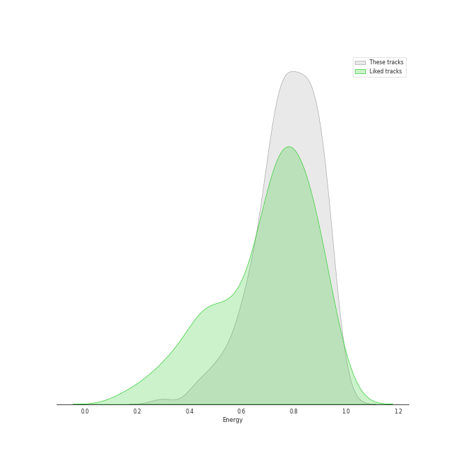
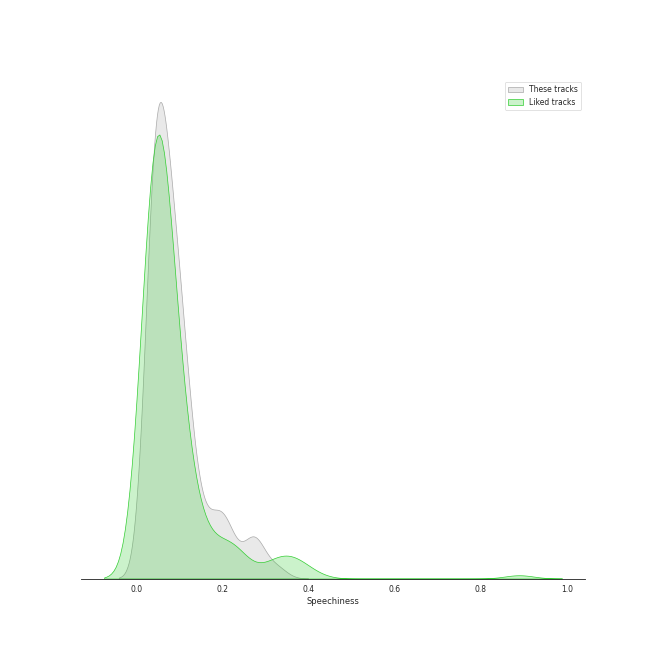
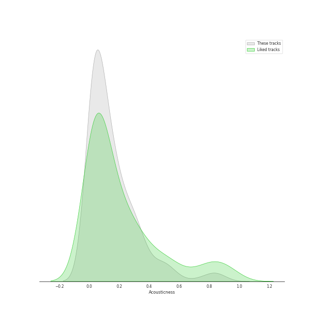
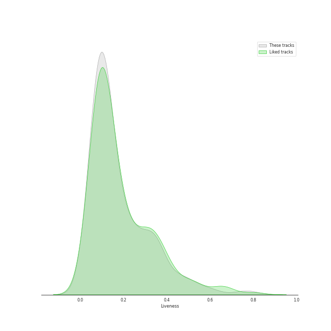
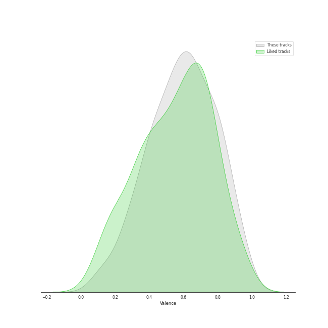
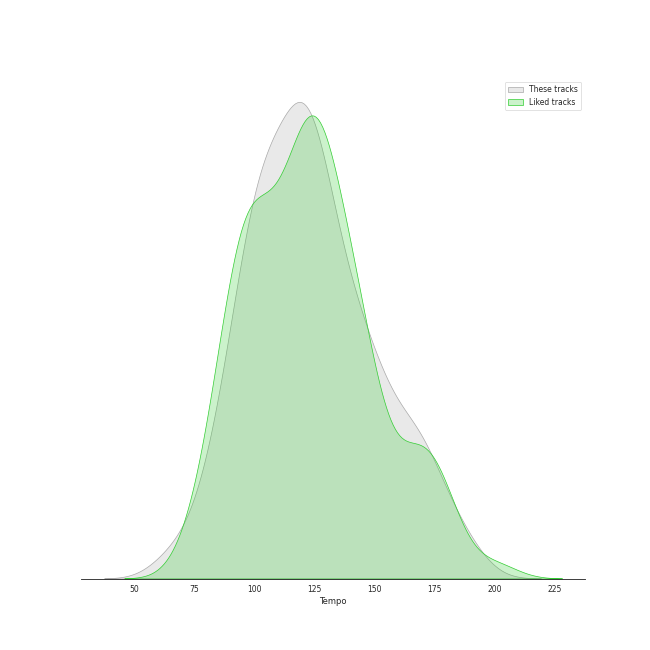

# Track Features for K-Pop Favorites

## Danceability

| ​ | 10 most Danceable tracks | ​​ | 10 least Danceable tracks |
|:---|:---|:---|:---|
|  | On Clap (0.949) |  | Here I Am (0.3) |
|  | ASAP (0.934) |  | My sea (0.353) |
|  | Sensitive (0.918) |  | HWAA (0.384) |
|  | BOOM (0.914) |  | Hello (0.392) |
|  | Red Rover (0.909) |  | HOLO (0.406) |
|  | Get A Guitar (0.9) |  | Feel My Rhythm (0.412) |
|  | Wife (0.899) |  | Time After Time (0.415) |
|  | Dangerous (0.888) |  | Sparkling Night (0.422) |
|  | S-Class (0.886) |  | 7월 7일 One Of These Nights (0.436) |
|  | The Boys (0.885) |  | Butterfly (0.439) |

## Energy

| ​ | 10 most Energetic tracks | ​​ | 10 least Energetic tracks |
|:---|:---|:---|:---|
|  | RING X RING (0.987) |  | ONLY (0.296) |
|  | Girls (0.974) |  | Gone (0.377) |
|  | Alone (0.961) |  | FLOWER (0.389) |
|  | Spark - WINTER Solo (0.951) |  | My sea (0.419) |
|  | RING ma Bell (what a wonderful world) (0.947) |  | HANN (Alone in winter) (0.429) |
|  | Heart Shaker (0.944) |  | Love wins all (0.447) |
|  | HOME;RUN (0.942) |  | Here I Am (0.459) |
|  | Red Lipstick (feat. Yoonmirae) (0.941) |  | 무제(無題) (Untitled, 2014) (0.461) |
|  | Feel My Rhythm (0.94) |  | HOLO (0.474) |
|  | BEcause (0.94) |  | Dream (0.476) |

## Speechiness

| ​ | 10 most Speechy tracks | ​​ | 10 least Speechy tracks |
|:---|:---|:---|:---|
|  | I Don't Need You (0.422) |  | Spark (0.0283) |
|  | MANIAC (0.411) |  | Something (0.0285) |
|  | S-Class (0.333) |  | Je T'aime (0.0295) |
|  | BBIBBI (0.331) |  | HOLO (0.0295) |
|  | Girls (0.325) |  | Welcome To MY World (feat. nævis) (0.0304) |
|  | Sparkling Night (0.299) |  | Cruel (0.0309) |
|  | Baggy Jeans (0.289) |  | Phase Me (0.0309) |
|  | Hold On Tight (0.283) |  | Love wins all (0.0311) |
|  | Sticker (0.28) |  | HANN (Alone) (0.0312) |
|  | Crazy (0.279) |  | When I Get Old (0.0313) |

## Acousticness

| ​ | 10 most Acoustic tracks | ​​ | 10 least Acoustic tracks |
|:---|:---|:---|:---|
|  | ONLY (0.892) |  | Drunk-Dazed (0.000707) |
|  | Amusement Park (0.85) |  | RUN2U (0.000835) |
|  | Love wins all (0.821) |  | LA DI DA (0.00108) |
|  | HANN (Alone in winter) (0.814) |  | Cruel (0.00137) |
|  | When This Rain Stops (0.805) |  | Up & Down (0.00189) |
|  | 무제(無題) (Untitled, 2014) (0.785) |  | BOOMBAYAH (0.00268) |
|  | HOLO (0.768) |  | Shut Down (0.00291) |
|  | 눈,코,입 (Eyes, Nose, Lips) (0.736) |  | Doom Du Doom (0.00356) |
|  | ZOOM (0.696) |  | LOVE DIVE (0.00379) |
|  | Modern Times (0.631) |  | LATATA (0.00427) |

## Instrumentalness

| ​ | 10 most Instrumental tracks | ​​ | 10 least Instrumental tracks |
|:---|:---|:---|:---|
|  | YEPPI YEPPI (0.0391) |  | Traffic light (0.0) |
|  | Cherry Blossom (0.0171) |  | Shut Down (0.0) |
|  | Spark - WINTER Solo (0.0102) |  | Beatbox (0.0) |
|  | VingleVingle (Prod. R.Tee) (0.00676) |  | CRIMINAL LOVE (0.0) |
|  | FEARLESS (0.00324) |  | TOMBOY (0.0) |
|  | Lion Heart (0.00274) |  | Red Lights (Bang Chan, Hyunjin) (0.0) |
|  | Wife (0.00222) |  | FEVER (0.0) |
|  | Kill This Love (0.00221) |  | Red Sun (0.0) |
|  | Why Not? (0.00108) |  | Back Door (0.0) |
|  | Black Mamba (0.000946) |  | Hype Boy (0.0) |

## Liveness

| ​ | 10 most Live tracks | ​​ | 10 least Live tracks |
|:---|:---|:---|:---|
|  | Piano Man (0.807) |  | Black Out (0.0243) |
|  | Red Lipstick (feat. Yoonmirae) (0.792) |  | Red Rover (0.0282) |
|  | Sticker (0.742) |  | YEPPI YEPPI (0.029) |
|  | FANCY (0.627) |  | Beatbox (0.0334) |
|  | Red Lights (Bang Chan, Hyunjin) (0.612) |  | CIRCUS (0.0353) |
|  | Step Back (0.596) |  | Run BTS (0.0358) |
|  | Animal Farm (0.579) |  | Saturday Drip (0.0379) |
|  | Brought The Heat Back (0.552) |  | BOOM (0.0441) |
|  | Pantomime (0.541) |  | Killin’ Me Good (0.0449) |
|  | I GOT A BOY (0.538) |  | SHEESH (0.0473) |

## Valence

| ​ | 10 most Happy tracks | ​​ | 10 least Happy tracks |
|:---|:---|:---|:---|
|  | LIP GLOSS (0.961) |  | Spark - WINTER Solo (0.0918) |
|  | Lion Heart (0.961) |  | 7월 7일 One Of These Nights (0.11) |
|  | 러시안 룰렛 Russian Roulette (0.958) |  | My sea (0.122) |
|  | Left & Right (0.95) |  | Time After Time (0.123) |
|  | Devil (0.946) |  | Here I Am (0.147) |
|  | Nobody Knows (0.927) |  | ONLY (0.151) |
|  | Eat You Up (0.926) |  | Criminal (0.161) |
|  | Fighting (Feat. Lee Young Ji) (0.922) |  | Adrenaline (0.175) |
|  | The Feels (0.922) |  | Ditto (0.183) |
|  | Sweet Venom (0.911) |  | HOLO (0.206) |

## Tempo

| ​ | 10 most Fast tracks | ​​ | 10 least Fast tracks |
|:---|:---|:---|:---|
|  | Strawberry Cake (199.943) |  | Dream (48.973) |
|  | Modern Times (199.923) |  | STRANGER (62.644) |
|  | Birthday (191.769) |  | Run Devil Run (64.927) |
|  | Time After Time (188.781) |  | Sacrifice (Eat Me Up) (68.985) |
|  | Funny Valentine (185.968) |  | FEVER (72.999) |
|  | Top or Cliff (185.959) |  | Devil (74.898) |
|  | Hello (185.869) |  | Rain (76.024) |
|  | One Kiss (180.058) |  | Run BTS (77.004) |
|  | Pink Venom (180.054) |  | Cruel (78.99) |
|  | DASH (179.977) |  | Red Sun (79.441) |
