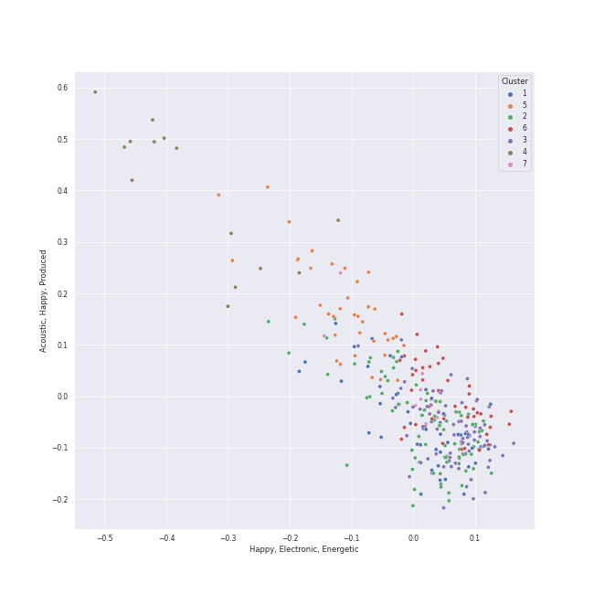

# Clusters in K-Pop Favorites

## Cluster #1

35 tracks

| Art | Track | Album | Artists | Label | Score | 💚 | 🔗 |
|:---|:---|:---|:---|:---|---:|:---|:---|
|  | OMG | NewJeans 'OMG' | [NewJeans](../../../../artists/newjeans/overview.md) | [ADOR](../../../../labels/ador) | 8406 | 💚 | [🔗](https://open.spotify.com/track/65FftemJ1DbbZ45DUfHJXE) |
|  | Killing Me | Killing Me | [CHUNG HA](../../../../artists/chung_ha/overview.md) | [MNH ENTERTAINMENT](../../../../labels/mnh_entertainment) | 0 | 💚 | [🔗](https://open.spotify.com/track/3QD0Y1tTngihByjdWC99lG) |
|  | Kill This Love | KILL THIS LOVE | [BLACKPINK](../../../../artists/blackpink/overview.md) | [Interscope Records](../../../../labels/interscope_records), [YG Entertainment](../../../../labels/yg_entertainment) | 59595 | 💚 | [🔗](https://open.spotify.com/track/6hvczQ05jc1yGlp9zhb95V) |
|  | Bite Me | DARK BLOOD | [ENHYPEN](../../../../artists/enhypen/overview.md) | [BELIFT LAB](../../../../labels/belift_lab) | 3199 | 💚 | [🔗](https://open.spotify.com/track/7mpdNiaQvygj2rHoxkzMfa) |
|  | dlwlrma | Palette | [IU](../../../../artists/iu/overview.md) | Fave Entertainment | 0 | 💚 | [🔗](https://open.spotify.com/track/4NPARrLIbtMl29ZJv8ESr2) |
|  | Mr-Ambiguous | HELLO | [MAMAMOO](../../../../artists/mamamoo/overview.md) | [Genie Music Corporation](../../../../labels/genie_music_corporation), [Stone Music Entertainment](../../../../labels/stone_music_entertainment) | 11 | 💚 | [🔗](https://open.spotify.com/track/4VOZzJeoNhvvTaGTztogVt) |
|  | POPPY - Japanese Ver. | POPPY (Japanese Ver.) | [STAYC](../../../../artists/stayc/overview.md) | [Universal Music LLC](../../../../labels/universal_music_llc) | 5188 | 💚 | [🔗](https://open.spotify.com/track/2gpwaAJnSDTevgZa4uyM0H) |
|  | Funny Valentine | Masterpiece | MISAMO | [WM Japan](../../../../labels/wm_japan) | 229 | 💚 | [🔗](https://open.spotify.com/track/4xtgQGbQnII1buKgl5fguT) |
|  | Hush | Hush | miss A | [Republic Records](../../../../labels/republic_records) | 42 | 💚 | [🔗](https://open.spotify.com/track/3jb7gznZVfqyMQGJo4hzG2) |
|  | When I Get Old | When I Get Old | Christopher, [CHUNG HA](../../../../artists/chung_ha/overview.md) | Parlophone Denmark | 6318 | 💚 | [🔗](https://open.spotify.com/track/5f2CcxzZoW7hNs1O8NhG6y) |
## Cluster #2

35 tracks

| Art | Track | Album | Artists | Label | Score | 💚 | 🔗 |
|:---|:---|:---|:---|:---|---:|:---|:---|
|  | Just A Little Bit | DIMENSION : DILEMMA | [ENHYPEN](../../../../artists/enhypen/overview.md) | [BELIFT LAB](../../../../labels/belift_lab) | 5140 | 💚 | [🔗](https://open.spotify.com/track/3QdjLOemIcMZovVOnvJP7P) |
|  | Given-Taken | BORDER : DAY ONE | [ENHYPEN](../../../../artists/enhypen/overview.md) | [BELIFT LAB](../../../../labels/belift_lab) | 70 | 💚 | [🔗](https://open.spotify.com/track/69WpV0U7OMNFGyq8I63dcC) |
|  | Bulldozer | Chill Kill - The 3rd Album | [Red Velvet](../../../../artists/red_velvet/overview.md) | [SM Entertainment](../../../../labels/sm_entertainment) | 5408 | 💚 | [🔗](https://open.spotify.com/track/4Pp6Ql9wV7A6VqHrmjMFv4) |
|  | The Eve | THE WAR - The 4th Album | [EXO](../../../../artists/exo/overview.md) | [SM Entertainment](../../../../labels/sm_entertainment) | 5331 | 💚 | [🔗](https://open.spotify.com/track/2ujA6F1cpk3m8lsPE5aKua) |
|  | LOVE DIVE | LOVE DIVE | [IVE](../../../../artists/ive/overview.md) | [STARSHIP Entertainment](../../../../labels/starship_entertainment) | 384 | 💚 | [🔗](https://open.spotify.com/track/0Q5VnK2DYzRyfqQRJuUtvi) |
|  | Maria | María | [HWASA](../../../../artists/hwasa/overview.md) | [RBW, Inc](../../../../labels/rbw_inc_) | 60353 | 💚 | [🔗](https://open.spotify.com/track/0ZeGfEAL5Rl4pd5LZBGuEK) |
|  | Welcome To MY World (feat. nævis) | MY WORLD - The 3rd Mini Album | [aespa](../../../../artists/aespa/overview.md), nævis | [SM Entertainment](../../../../labels/sm_entertainment), [Warner Records](../../../../labels/warner_records) | 25781 | 💚 | [🔗](https://open.spotify.com/track/3q5qpprtugUIEPExuI7tRD) |
|  | Drama | Drama - The 4th Mini Album | [aespa](../../../../artists/aespa/overview.md) | [SM Entertainment](../../../../labels/sm_entertainment), [Warner Records](../../../../labels/warner_records) | 16860 | 💚 | [🔗](https://open.spotify.com/track/5XWlyfo0kZ8LF7VSyfS4Ew) |
|  | Devil | Devil - The 2nd Mini Album | MAX CHANGMIN | [SM Entertainment](../../../../labels/sm_entertainment) | 1388 | 💚 | [🔗](https://open.spotify.com/track/14jjsKr5HwNhZ18MJR5hYn) |
|  | Cherry Blossom | 1st Single 'S.i.R' | BOBBY | [Genie Music Corporation](../../../../labels/genie_music_corporation), [Stone Music Entertainment](../../../../labels/stone_music_entertainment) | 8 | 💚 | [🔗](https://open.spotify.com/track/3yWQ5IlzWRPOdtYnQuywcO) |
## Cluster #3

83 tracks

| Art | Track | Album | Artists | Label | Score | 💚 | 🔗 |
|:---|:---|:---|:---|:---|---:|:---|:---|
|  | Kill Shot | KILL MY DOUBT | [ITZY](../../../../artists/itzy/overview.md) | [Republic Records](../../../../labels/republic_records) | 4099 | 💚 | [🔗](https://open.spotify.com/track/3i7Z0CI7QIwnU4MVL0XJB9) |
|  | ICY | IT'z ICY | [ITZY](../../../../artists/itzy/overview.md) | [JYP Entertainment](../../../../labels/jyp_entertainment) | 0 | 💚 | [🔗](https://open.spotify.com/track/7zFBtYAVURF3bUVqEQ6UUu) |
|  | Uh-Oh | Uh-Oh | [(G)I-DLE](../../../../artists/(g)i-dle/overview.md) | [Universal Music LLC](../../../../labels/universal_music_llc) | 30618 | 💚 | [🔗](https://open.spotify.com/track/1OBb2wZMXKNmtdyyejLIyL) |
|  | Baddie | I'VE MINE | [IVE](../../../../artists/ive/overview.md) | [Starship Entertainment](../../../../labels/starship_entertainment) | 898 | 💚 | [🔗](https://open.spotify.com/track/7uyeEbG6hyApgXuEypGcsZ) |
|  | Why So Lonely | Why So Lonely | Wonder Girls | [JYP Entertainment](../../../../labels/jyp_entertainment) | 31 | 💚 | [🔗](https://open.spotify.com/track/3mKK73NhylzXdHV4qZGxI4) |
|  | Nerdy | Geekyland | [PURPLE KISS](../../../../artists/purple_kiss/overview.md) | [RBW Inc.](../../../../labels/rbw_inc_) | 0 | 💚 | [🔗](https://open.spotify.com/track/6KExHY2Eo0DphK63s2dfYi) |
|  | nevertheless | the Billage of perception: chapter three | [Billlie](../../../../artists/billlie/overview.md) | [MYSTIC STORY](../../../../labels/mystic_story) | 71 | 💚 | [🔗](https://open.spotify.com/track/26fVl2CYeXXxD4yEqmhrpM) |
|  | Bubble | TEENFRESH | [STAYC](../../../../artists/stayc/overview.md) | [High Up Entertainment](../../../../labels/high_up_entertainment) | 8059 | 💚 | [🔗](https://open.spotify.com/track/4P5ozkI1bxiGxA5rZ27jlO) |
|  | THRILL RIDE | THE BOYZ 6TH MINI ALBUM [THRILL-ING] | [THE BOYZ](../../../../artists/the_boyz/overview.md) | Cre.ker Entertainment | 26 | 💚 | [🔗](https://open.spotify.com/track/3wEYYVD6uC3A3LhVhqARZv) |
|  | MIROTIC | MIROTIC - The 4th Album | [TVXQ!](../../../../artists/tvxq!/overview.md) | [SM Entertainment](../../../../labels/sm_entertainment) | 43 | 💚 | [🔗](https://open.spotify.com/track/4BZhUnXvXYRQJPClr0hhIC) |
## Cluster #4

20 tracks

| Art | Track | Album | Artists | Label | Score | 💚 | 🔗 |
|:---|:---|:---|:---|:---|---:|:---|:---|
|  | If | Hong Gil Dong OST | [TAEYEON](../../../../artists/taeyeon/overview.md) | msmedia | 0 | 💚 | [🔗](https://open.spotify.com/track/76do9IBWqoiwV3EyoP25Le) |
|  | When This Rain Stops | Like Water - The 1st Mini Album | [WENDY](../../../../artists/wendy/overview.md) | [SM Entertainment](../../../../labels/sm_entertainment) | 42246 | 💚 | [🔗](https://open.spotify.com/track/6mavVLsxaa4YcPje9qZKcf) |
|  | Amusement Park | Amusement Park | [BAEKHYUN](../../../../artists/baekhyun/overview.md) | [SM Entertainment](../../../../labels/sm_entertainment) | 28068 | 💚 | [🔗](https://open.spotify.com/track/1TUkEXQrskATO9SoB4QMUN) |
|  | For You | For You | [LeeHi](../../../../artists/leehi/overview.md), [Crush](../../../../artists/crush/overview.md) | AOMG | 284 | 💚 | [🔗](https://open.spotify.com/track/0JL7DoEqAUcOntWmBuOSdh) |
|  | HOLO | HOLO | [LeeHi](../../../../artists/leehi/overview.md) | [Genie Music Corporation](../../../../labels/genie_music_corporation), [Stone Music Entertainment](../../../../labels/stone_music_entertainment) | 51526 | 💚 | [🔗](https://open.spotify.com/track/4BSluGpjdLQihMmKgHXMxp) |
|  | Love poem | Love poem | [IU](../../../../artists/iu/overview.md) | [Kakao Entertainment](../../../../labels/kakao_entertainment) | 0 | 💚 | [🔗](https://open.spotify.com/track/7HrE6HtYNBbGqp5GmHbFV0) |
|  | HANN (Alone in winter) | I burn | [(G)I-DLE](../../../../artists/(g)i-dle/overview.md) | [Universal Music LLC](../../../../labels/universal_music_llc) | 1119 | 💚 | [🔗](https://open.spotify.com/track/2qYdsdgdeMLFzpLcMQWG2W) |
|  | 눈,코,입 (Eyes, Nose, Lips) | RISE | TAEYANG | [YG Entertainment](../../../../labels/yg_entertainment) | 22481 | 💚 | [🔗](https://open.spotify.com/track/0lYtIvI7bO51PZSeK22Mbz) |
|  | 무제(無題) (Untitled, 2014) | KWON JI YONG | G-DRAGON | [YG Entertainment](../../../../labels/yg_entertainment) | 38552 | 💚 | [🔗](https://open.spotify.com/track/16BS342F89MDqouSxgLaUK) |
|  | Je T'aime | Hello - Special Album | JOY | [SM Entertainment](../../../../labels/sm_entertainment) | 192 | 💚 | [🔗](https://open.spotify.com/track/18m3QugKZFaKjoMbe8CyjL) |
## Cluster #5

49 tracks

| Art | Track | Album | Artists | Label | Score | 💚 | 🔗 |
|:---|:---|:---|:---|:---|---:|:---|:---|
|  | INVU | INVU - The 3rd Album | [TAEYEON](../../../../artists/taeyeon/overview.md) | [SM Entertainment](../../../../labels/sm_entertainment) | 0 | 💚 | [🔗](https://open.spotify.com/track/7rXcCpIAoOUCydkVDMcoPV) |
|  | DUN DUN | reminiscence | [EVERGLOW](../../../../artists/everglow/overview.md) | [Genie Music Corporation](../../../../labels/genie_music_corporation), [Stone Music Entertainment](../../../../labels/stone_music_entertainment) | 10 | 💚 | [🔗](https://open.spotify.com/track/3ejAkJLWQSEJDqDXxK3efB) |
|  | Stamp On It | Stamp On It - The 1st Mini Album | [GOT the beat](../../../../artists/got_the_beat/overview.md) | [SM Entertainment](../../../../labels/sm_entertainment) | 25501 | 💚 | [🔗](https://open.spotify.com/track/0mlxHb4jbPr1PUBUv0WHRS) |
|  | Gotta Go | Gotta Go | [CHUNG HA](../../../../artists/chung_ha/overview.md) | [Genie Music Corporation](../../../../labels/genie_music_corporation), [Stone Music Entertainment](../../../../labels/stone_music_entertainment) | 56855 | 💚 | [🔗](https://open.spotify.com/track/1exnDFdC34GyBcaLt9ZJfX) |
|  | DDU-DU DDU-DU | SQUARE UP | [BLACKPINK](../../../../artists/blackpink/overview.md) | [Interscope Records](../../../../labels/interscope_records), [YG Entertainment](../../../../labels/yg_entertainment) | 11442 | 💚 | [🔗](https://open.spotify.com/track/4lQsB3ERTWSNaAN1IkuNRl) |
|  | Hello Future | Hello Future - The 1st Album Repackage | [NCT DREAM](../../../../artists/nct_dream/overview.md) | [SM Entertainment](../../../../labels/sm_entertainment) | 0 | 💚 | [🔗](https://open.spotify.com/track/332GJ8ykVuEt3jOT1sy7j6) |
|  | Drunk-Dazed | BORDER : CARNIVAL | [ENHYPEN](../../../../artists/enhypen/overview.md) | [BELIFT LAB](../../../../labels/belift_lab) | 94 | 💚 | [🔗](https://open.spotify.com/track/1wcr8DjnN59Awev8nnKpQ4) |
|  | Voltage | Voltage | [ITZY](../../../../artists/itzy/overview.md) | [WM Japan](../../../../labels/wm_japan) | 107 | 💚 | [🔗](https://open.spotify.com/track/7e65OAe9L0xWPSHDiahjQe) |
|  | I AM | I've IVE | [IVE](../../../../artists/ive/overview.md) | [Starship Entertainment](../../../../labels/starship_entertainment) | 5921 | 💚 | [🔗](https://open.spotify.com/track/70t7Q6AYG6ZgTYmJWcnkUM) |
|  | Daisy | WE:TH | [PENTAGON](../../../../artists/pentagon/overview.md) | [Universal Music LLC](../../../../labels/universal_music_llc) | 0 | 💚 | [🔗](https://open.spotify.com/track/14pjnaIqkpReO5D0tHofAS) |
## Cluster #6

45 tracks

| Art | Track | Album | Artists | Label | Score | 💚 | 🔗 |
|:---|:---|:---|:---|:---|---:|:---|:---|
|  | Black Swan | MAP OF THE SOUL : 7 | [BTS](../../../../artists/bts/overview.md) | [BIGHIT MUSIC](../../../../labels/bighit_music) | 0 | 💚 | [🔗](https://open.spotify.com/track/2EmcTFQ1rM11wp2ztsXTHa) |
|  | CRY FOR ME | CRY FOR ME | [TWICE](../../../../artists/twice/overview.md) | [Republic Records](../../../../labels/republic_records) | 475 | 💚 | [🔗](https://open.spotify.com/track/2xtP8RNbo2BEMzLX7tK7aq) |
|  | Sunny Side Up! | ‘The ReVe Festival’ Day 1 | [Red Velvet](../../../../artists/red_velvet/overview.md) | [SM Entertainment](../../../../labels/sm_entertainment) | 2568 | 💚 | [🔗](https://open.spotify.com/track/5yGTiC0ypN09P4Nl6tE3FY) |
|  | Oh my god | I trust | [(G)I-DLE](../../../../artists/(g)i-dle/overview.md) | [Universal Music LLC](../../../../labels/universal_music_llc) | 17570 | 💚 | [🔗](https://open.spotify.com/track/2DmRXiyn03tOqKgEJXlaiJ) |
|  | HELLO | THE SECOND STEP : CHAPTER TWO | [TREASURE](../../../../artists/treasure/overview.md) | [YG Entertainment](../../../../labels/yg_entertainment) | 5740 | 💚 | [🔗](https://open.spotify.com/track/1ex8euBuzVyqjThnYfwY2k) |
|  | NAKKA (with IU) | NEXT EPISODE | [AKMU](../../../../artists/akmu/overview.md), [IU](../../../../artists/iu/overview.md) | [YG Entertainment](../../../../labels/yg_entertainment) | 7 | 💚 | [🔗](https://open.spotify.com/track/4t2FIqZJORKZGSKg30SShr) |
|  | Salty & Sweet | MY WORLD - The 3rd Mini Album | [aespa](../../../../artists/aespa/overview.md) | [SM Entertainment](../../../../labels/sm_entertainment), [Warner Records](../../../../labels/warner_records) | 5615 | 💚 | [🔗](https://open.spotify.com/track/4wQDjZtXjsFtU3BLSiIH4t) |
|  | 28 Reasons | 28 Reasons - The 1st Mini Album | [SEULGI](../../../../artists/seulgi/overview.md) | [SM Entertainment](../../../../labels/sm_entertainment) | 12162 | 💚 | [🔗](https://open.spotify.com/track/1dfsPqH09vnzUWEOsN98Ex) |
|  | Love Talk | Take Over The Moon - The 2nd Mini Album | WayV | LABEL V | 2 | 💚 | [🔗](https://open.spotify.com/track/6bc8VmlNt5S9WJlyw8bBdd) |
|  | SOLO | SOLO | JENNIE | [Interscope Records](../../../../labels/interscope_records), [YG Entertainment](../../../../labels/yg_entertainment) | 2183 | 💚 | [🔗](https://open.spotify.com/track/2wVDWtLKXunswWecARNILj) |
## Cluster #7

34 tracks

| Art | Track | Album | Artists | Label | Score | 💚 | 🔗 |
|:---|:---|:---|:---|:---|---:|:---|:---|
|  | I CAN'T STOP ME | Eyes Wide Open | [TWICE](../../../../artists/twice/overview.md) | [Republic Records](../../../../labels/republic_records) | 43571 | 💚 | [🔗](https://open.spotify.com/track/37ZtpRBkHcaq6hHy0X98zn) |
|  | Like Ooh-Ahh | The Story Begins | [TWICE](../../../../artists/twice/overview.md) | [Republic Records](../../../../labels/republic_records) | 93 | 💚 | [🔗](https://open.spotify.com/track/3c0CJ0DBgsGZ7I79lyx02Z) |
|  | ParadoXXX Invasion | MANIFESTO : DAY 1 | [ENHYPEN](../../../../artists/enhypen/overview.md) | [BELIFT LAB](../../../../labels/belift_lab) | 42720 | 💚 | [🔗](https://open.spotify.com/track/3OC2C8IpFhbUJTeMe55QYn) |
|  | Nxde | I love | [(G)I-DLE](../../../../artists/(g)i-dle/overview.md) | [Cube Entertainment](../../../../labels/cube_entertainment) | 5617 | 💚 | [🔗](https://open.spotify.com/track/6NnCWIWV740gP7DQ8kqdIE) |
|  | Forgive Me | Forgive Me - The 3rd Mini Album | [BoA](../../../../artists/boa/overview.md) | [SM Entertainment](../../../../labels/sm_entertainment) | 3468 | 💚 | [🔗](https://open.spotify.com/track/4TXo3KpvdwHSdrPJlWDfgn) |
|  | Sweet Juice | Cabin Fever | [PURPLE KISS](../../../../artists/purple_kiss/overview.md) | [RBW Inc.](../../../../labels/rbw_inc_) | 2590 | 💚 | [🔗](https://open.spotify.com/track/2th6UWbfVz3hsSDzQAKqy2) |
|  | DESSERT | DESSERT | HYO, Loopy, [JEON SOYEON](../../../../artists/jeon_soyeon/overview.md) | [SM Entertainment](../../../../labels/sm_entertainment) | 45024 | 💚 | [🔗](https://open.spotify.com/track/6u0pZe0Uv7GBR0iKptfWRf) |
|  | HELICOPTER | HELICOPTER | [CLC](../../../../artists/clc/overview.md) | [Universal Music LLC](../../../../labels/universal_music_llc) | 19176 | 💚 | [🔗](https://open.spotify.com/track/2hJS7BdEaH9Jo8MeJujsHT) |
|  | Pity Party | Pity Party | JAMIE | [WM Korea](../../../../labels/wm_korea) | 23 | 💚 | [🔗](https://open.spotify.com/track/3hmjSgK0gSytIf3sbCFShk) |
|  | Strawberry Cake | Hello, world! | Xdinary Heroes | [JYP Entertainment](../../../../labels/jyp_entertainment) | 0 | 💚 | [🔗](https://open.spotify.com/track/6E8EAroyZLFR80NO8Ucliy) |