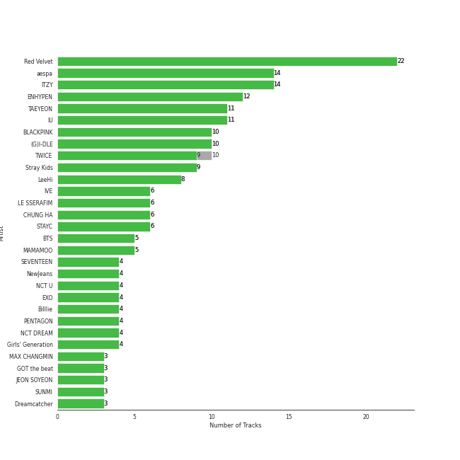
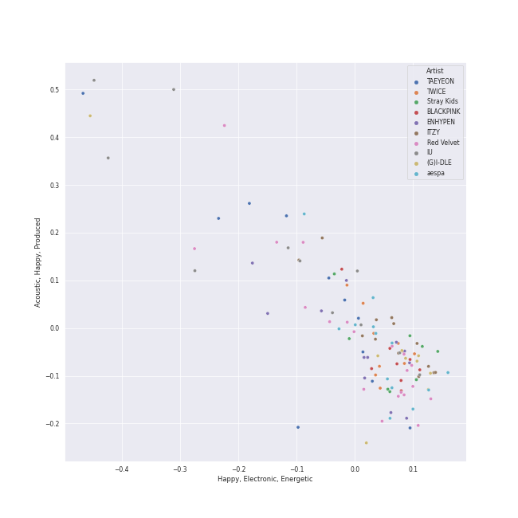
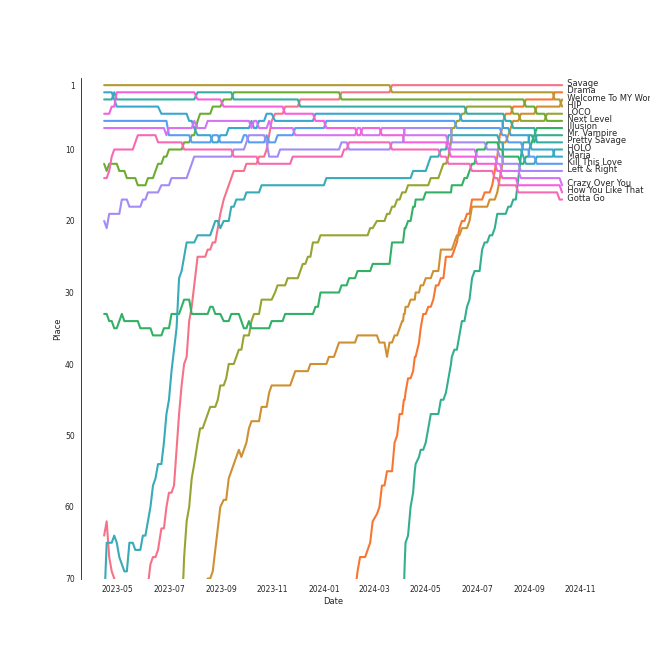
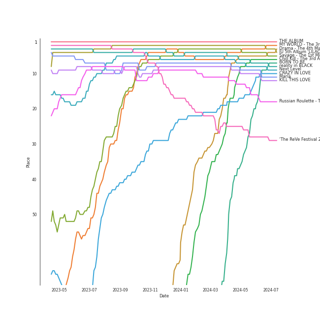
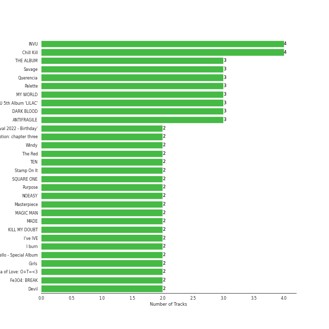
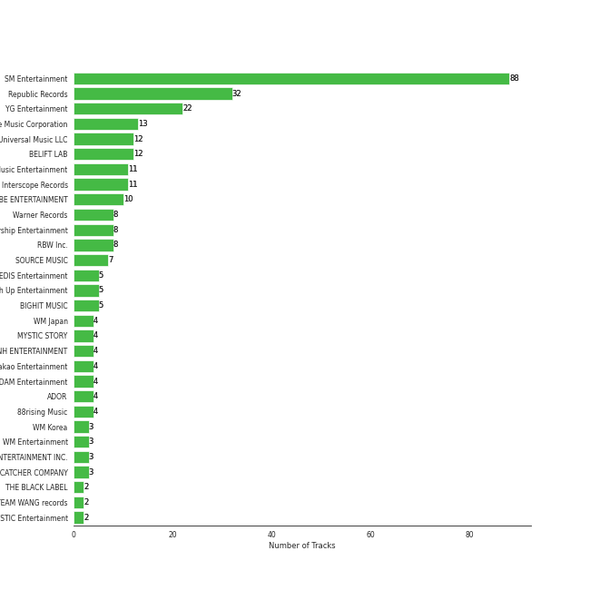
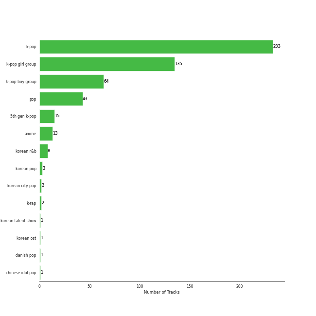
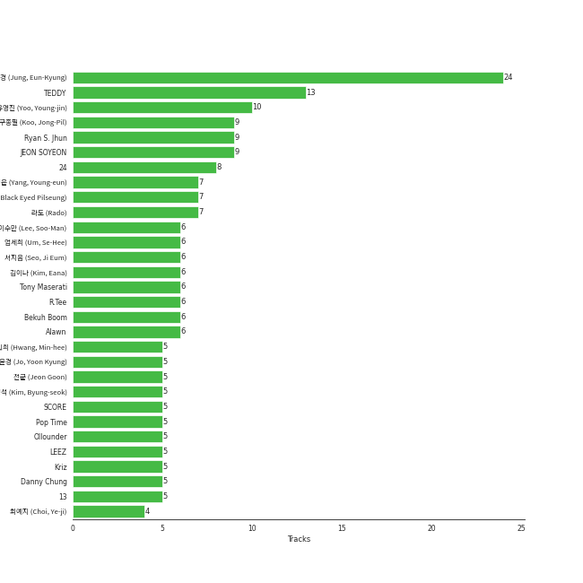
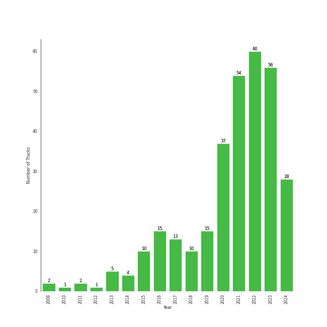

# K-Pop Favorites

[302 tracks 🔗](https://open.spotify.com/playlist/1ZbxKv1noxwZ4zFgRNEFIo)

[See Track Features](audio_features.md)

[See Clusters](clusters/overview.md)

## Top Artists

| Art | Rank | Tracks | 💚 | Artist | 🔗 |
|:---|---:|---:|---:|:---|:---|
|  | 2 | 17 | 17 | [Red Velvet](../../artists/red_velvet/overview.md) | [🔗](https://open.spotify.com/artist/1z4g3DjTBBZKhvAroFlhOM) |
|  | 1 | 14 | 14 | [aespa](../../artists/aespa/overview.md) | [🔗](https://open.spotify.com/artist/6YVMFz59CuY7ngCxTxjpxE) |
|  | 7 | 12 | 12 | [ENHYPEN](../../artists/enhypen/overview.md) | [🔗](https://open.spotify.com/artist/5t5FqBwTcgKTaWmfEbwQY9) |
|  | 4 | 11 | 11 | [IU](../../artists/iu/overview.md) | [🔗](https://open.spotify.com/artist/3HqSLMAZ3g3d5poNaI7GOU) |
|  | 5 | 11 | 11 | [ITZY](../../artists/itzy/overview.md) | [🔗](https://open.spotify.com/artist/2KC9Qb60EaY0kW4eH68vr3) |
|  | 6 | 11 | 11 | [(G)I-DLE](../../artists/(g)i-dle/overview.md) | [🔗](https://open.spotify.com/artist/2AfmfGFbe0A0WsTYm0SDTx) |
|  | 8 | 10 | 10 | [TAEYEON](../../artists/taeyeon/overview.md) | [🔗](https://open.spotify.com/artist/3qNVuliS40BLgXGxhdBdqu) |
|  | 9 | 9 | 9 | [TWICE](../../artists/twice/overview.md) | [🔗](https://open.spotify.com/artist/7n2Ycct7Beij7Dj7meI4X0) |
|  | 3 | 9 | 9 | [BLACKPINK](../../artists/blackpink/overview.md) | [🔗](https://open.spotify.com/artist/41MozSoPIsD1dJM0CLPjZF) |
|  | 10 | 7 | 7 | [Stray Kids](../../artists/stray_kids/overview.md) | [🔗](https://open.spotify.com/artist/2dIgFjalVxs4ThymZ67YCE) |

See top 100 artists

| Art | Rank | Tracks | 💚 | Artist | 🔗 |
|:---|---:|---:|---:|:---|:---|
|  | 14 | 7 | 7 | [CHUNG HA](../../artists/chung_ha/overview.md) | [🔗](https://open.spotify.com/artist/2PSJ6YriU7JsFucxACpU7Y) |
|  | 18 | 6 | 6 | [IVE](../../artists/ive/overview.md) | [🔗](https://open.spotify.com/artist/6RHTUrRF63xao58xh9FXYJ) |
|  | 13 | 6 | 6 | [MAMAMOO](../../artists/mamamoo/overview.md) | [🔗](https://open.spotify.com/artist/0XATRDCYuuGhk0oE7C0o5G) |
|  | 16 | 6 | 6 | [STAYC](../../artists/stayc/overview.md) | [🔗](https://open.spotify.com/artist/01XYiBYaoMJcNhPokrg0l0) |
|  | 11 | 5 | 5 | [LeeHi](../../artists/leehi/overview.md) | [🔗](https://open.spotify.com/artist/7cVZApDoQZpS447nHTsNqu) |
|  | 15 | 5 | 5 | [LE SSERAFIM](../../artists/le_sserafim/overview.md) | [🔗](https://open.spotify.com/artist/4SpbR6yFEvexJuaBpgAU5p) |
|  | 25 | 5 | 5 | [BTS](../../artists/bts/overview.md) | [🔗](https://open.spotify.com/artist/3Nrfpe0tUJi4K4DXYWgMUX) |
|  | 27 | 5 | 5 | [NMIXX](../../artists/nmixx/overview.md) | [🔗](https://open.spotify.com/artist/28ot3wh4oNmoFOdVajibBl) |
|  | 24 | 5 | 5 | [NCT DREAM](../../artists/nct_dream/overview.md) | [🔗](https://open.spotify.com/artist/1gBUSTR3TyDdTVFIaQnc02) |
|  | 12 | 4 | 4 | [SEVENTEEN](../../artists/seventeen/overview.md) | [🔗](https://open.spotify.com/artist/7nqOGRxlXj7N2JYbgNEjYH) |
|  | 23 | 4 | 4 | [NewJeans](../../artists/newjeans/overview.md) | [🔗](https://open.spotify.com/artist/6HvZYsbFfjnjFrWF950C9d) |
|  | 56 | 4 | 4 | [KISS OF LIFE](../../artists/kiss_of_life/overview.md) | [🔗](https://open.spotify.com/artist/4TEK9tIkcoxib4GxT3O4ky) |
|  | 49 | 4 | 4 | [TEN](../../artists/ten/overview.md) | [🔗](https://open.spotify.com/artist/3Q5Qep7ytrjVleNnMnntgQ) |
|  | 20 | 4 | 4 | [Billlie](../../artists/billlie/overview.md) | [🔗](https://open.spotify.com/artist/2GQxKDojobwBjZMPf7aoh0) |
|  | 17 | 4 | 4 | [Girls' Generation](../../artists/girls__generation/overview.md) | [🔗](https://open.spotify.com/artist/0Sadg1vgvaPqGTOjxu0N6c) |
|  | 92 | 3 | 3 | MAX CHANGMIN | [🔗](https://open.spotify.com/artist/7FiAkNWMb6ZBYI8tbQLuIS) |
|  | 31 | 3 | 3 | [GOT the beat](../../artists/got_the_beat/overview.md) | [🔗](https://open.spotify.com/artist/6uNxlIP5lzPFf0BHuELOuX) |
|  | 22 | 3 | 3 | [JEON SOYEON](../../artists/jeon_soyeon/overview.md) | [🔗](https://open.spotify.com/artist/6Xg22wJOAcnvPUfk5WvODH) |
|  | 29 | 3 | 3 | [Dreamcatcher](../../artists/dreamcatcher/overview.md) | [🔗](https://open.spotify.com/artist/5V1qsQHdXNm4ZEZHWvFnqQ) |
|  | 48 | 3 | 3 | [BAEKHYUN](../../artists/baekhyun/overview.md) | [🔗](https://open.spotify.com/artist/4ufh0WuMZh6y4Dmdnklvdl) |
|  | 32 | 3 | 3 | [BoA](../../artists/boa/overview.md) | [🔗](https://open.spotify.com/artist/4muJrGMndyYWqZtfk8OWy4) |
|  | 169 | 3 | 3 | BIGBANG | [🔗](https://open.spotify.com/artist/4Kxlr1PRlDKEB0ekOCyHgX) |
|  | 19 | 3 | 3 | [EXO](../../artists/exo/overview.md) | [🔗](https://open.spotify.com/artist/3cjEqqelV9zb4BYE3qDQ4O) |
|  | 36 | 3 | 3 | [EVERGLOW](../../artists/everglow/overview.md) | [🔗](https://open.spotify.com/artist/3ZZzT0naD25RhY2uZvIKkJ) |
|  | 89 | 3 | 3 | [OH MY GIRL](../../artists/oh_my_girl/overview.md) | [🔗](https://open.spotify.com/artist/2019zR22qK2RBvCqtudBaI) |
|  | 66 | 3 | 3 | [PENTAGON](../../artists/pentagon/overview.md) | [🔗](https://open.spotify.com/artist/1wKpMkucynaTfG8lyPprYV) |
|  | 30 | 2 | 2 | [NCT 127](../../artists/nct_127/overview.md) | [🔗](https://open.spotify.com/artist/7f4ignuCJhLXfZ9giKT7rH) |
|  | 95 | 2 | 2 | Red Velvet - IRENE & SEULGI | [🔗](https://open.spotify.com/artist/6bwp9ObI8FWvMPCIWVBmhl) |
|  | 59 | 2 | 2 | [CLC](../../artists/clc/overview.md) | [🔗](https://open.spotify.com/artist/6QyO41KctzGc70mVaVnXQO) |
|  | 38 | 2 | 2 | [SUNMI](../../artists/sunmi/overview.md) | [🔗](https://open.spotify.com/artist/6MoXcK2GyGg7FIyxPU5yW6) |
|  | 39 | 2 | 2 | [ATEEZ](../../artists/ateez/overview.md) | [🔗](https://open.spotify.com/artist/68KmkJeZGfwe1OUaivBa2L) |
|  | 60 | 2 | 2 | [PURPLE KISS](../../artists/purple_kiss/overview.md) | [🔗](https://open.spotify.com/artist/62T5PGHWJ9sxP2SJq20IHq) |
|  | 67 | 2 | 2 | [Solar](../../artists/solar/overview.md) | [🔗](https://open.spotify.com/artist/5cYcI546S8Lf97m4mNdYLD) |
|  | 160 | 2 | 2 | [f(x)](../../artists/f(x)/overview.md) | [🔗](https://open.spotify.com/artist/3wRA5UYoo08BBKJnzyKkpF) |
|  | 238 | 2 | 2 | [NCT U](../../artists/nct_u/overview.md) | [🔗](https://open.spotify.com/artist/3paGCCtX1Xr4Gx53mSeZuQ) |
|  | 70 | 2 | 2 | [TREASURE](../../artists/treasure/overview.md) | [🔗](https://open.spotify.com/artist/3KonOYiLsU53m4yT7gNotP) |
|  | 87 | 2 | 2 | RIIZE | [🔗](https://open.spotify.com/artist/2jOm3cYujQx6o1dxuiuqaX) |
|  | 35 | 2 | 2 | [SEULGI](../../artists/seulgi/overview.md) | [🔗](https://open.spotify.com/artist/2QM5S4yO6xHgnNvF0nbZZq) |
|  | 109 | 2 | 2 | JENNIE | [🔗](https://open.spotify.com/artist/250b0Wlc5Vk0CoUsaCY84M) |
|  | 99 | 2 | 2 | [YUQI](../../artists/yuqi/overview.md) | [🔗](https://open.spotify.com/artist/22aCD8IrQZjcPgZw728QT6) |
|  | 72 | 2 | 2 | [Jackson Wang](../../artists/jackson_wang/overview.md) | [🔗](https://open.spotify.com/artist/1kfWoWgCugPkyxQP8lkRlY) |
|  | 71 | 2 | 2 | TAEMIN | [🔗](https://open.spotify.com/artist/13rF01aOogvnkuQXOlgTW8) |
|  | 44 | 2 | 2 | JOY | [🔗](https://open.spotify.com/artist/0sYpJ0nCC8AlDrZFeAA7ub) |
|  | 41 | 2 | 2 | MISAMO | [🔗](https://open.spotify.com/artist/0IwZVmMMGE7nNXS7vN9SIo) |
|  | 28 | 2 | 2 | [WENDY](../../artists/wendy/overview.md) | [🔗](https://open.spotify.com/artist/0FRUZvZNPzM3YJMABJxf2K) |
|  | 118 | 2 | 2 | [THE BOYZ](../../artists/the_boyz/overview.md) | [🔗](https://open.spotify.com/artist/0CmvFWTX9zmMNCUi6fHtAx) |
|  | 68 | 1 | 1 | JEON SOMI | [🔗](https://open.spotify.com/artist/7zYj9S9SdIunYCfSm7vzAR) |
|  | 386 | 1 | 1 | BOBBY | [🔗](https://open.spotify.com/artist/7ieMQQDR0bdBPz572mtxwS) |
|  | 40 | 1 | 1 | [HWASA](../../artists/hwasa/overview.md) | [🔗](https://open.spotify.com/artist/7bmYpVgQub656uNTu6qGNQ) |
|  | 75 | 1 | 1 | JIHYO | [🔗](https://open.spotify.com/artist/7F1iAHRYxR3MY7yAEuFqgL) |
|  | 243 | 1 | 1 | MARK | [🔗](https://open.spotify.com/artist/70DFixYAFPv4Pf9kgSfR9O) |
|  | 55 | 1 | 1 | TAEYANG | [🔗](https://open.spotify.com/artist/6udveWUgX4vu75FF0DTrXV) |
|  | 151 | 1 | 1 | [TVXQ!](../../artists/tvxq!/overview.md) | [🔗](https://open.spotify.com/artist/6nVMMEywS5Y4tsHPKx1nIo) |
|  | 105 | 1 | 1 | KAI | [🔗](https://open.spotify.com/artist/6iVo62B0bdTknRcrktCmak) |
|  | 81 | 1 | 1 | [SUPER JUNIOR](../../artists/super_junior/overview.md) | [🔗](https://open.spotify.com/artist/6gzXCdfYfFe5XKhPKkYqxV) |
|  | 119 | 1 | 1 | 4Minute | [🔗](https://open.spotify.com/artist/6cdC1cwqh3eJAXaxXJt2jv) |
|  | 177 | 1 | 1 | R3HAB | [🔗](https://open.spotify.com/artist/6cEuCEZu7PAE9ZSzLLc2oQ) |
|  | 171 | 1 | 1 | [Crush](../../artists/crush/overview.md) | [🔗](https://open.spotify.com/artist/6aLdhHUqgdKE86xbtNmY8g) |
|  | 69 | 1 | 1 | [BIBI](../../artists/bibi/overview.md) | [🔗](https://open.spotify.com/artist/6UbmqUEgjLA6jAcXwbM1Z9) |
|  | 286 | 1 | 1 | JISOO | [🔗](https://open.spotify.com/artist/6UZ0ba50XreR4TM8u322gs) |
|  | 65 | 1 | 1 | [AKMU](../../artists/akmu/overview.md) | [🔗](https://open.spotify.com/artist/6OwKE9Ez6ALxpTaKcT5ayv) |
|  | 79 | 1 | 1 | NINGNING | [🔗](https://open.spotify.com/artist/5t1uryofgueHrjrryqX8vM) |
|  | 190 | 1 | 1 | MINGYU | [🔗](https://open.spotify.com/artist/5gUpo0BRmo6EOTbyU3z5Ay) |
|  | 37 | 1 | 1 | [HEIZE](../../artists/heize/overview.md) | [🔗](https://open.spotify.com/artist/5dCvSnVduaFleCnyy98JMo) |
|  | 354 | 1 | 1 | WOOSUNG | [🔗](https://open.spotify.com/artist/5LHu1iF8m0XtRBEJbbwSoo) |
|  | 407 | 1 | 1 | SuperM | [🔗](https://open.spotify.com/artist/5BHFSMEjfLVx1JwRWjAOsE) |
|  | 94 | 1 | 1 | [LOONA](../../artists/loona/overview.md) | [🔗](https://open.spotify.com/artist/52zMTJCKluDlFwMQWmccY7) |
|  | 98 | 1 | 1 | WayV-TEN&YANGYANG | [🔗](https://open.spotify.com/artist/4wOAdZOMOVSwrZQxDYrUx3) |
|  | 130 | 1 | 1 | EPEX | [🔗](https://open.spotify.com/artist/4e2umhzNHTSeQnSCWPN0uT) |
|  | 129 | 1 | 1 | ZICO | [🔗](https://open.spotify.com/artist/4XpUIb8uuNlIWVKmgKZXC0) |
|  | 239 | 1 | 1 | Lee Mujin | [🔗](https://open.spotify.com/artist/4Xj0peBt3EZHbdF20JmdWC) |
|  | 74 | 1 | 1 | Suzy | [🔗](https://open.spotify.com/artist/4U80LJd8sG6U9YTFP5izka) |
|  | 185 | 1 | 1 | MONSTA X | [🔗](https://open.spotify.com/artist/4TnGh5PKbSjpYqpIdlW5nz) |
|  | 135 | 1 | 1 | [Gain](../../artists/gain/overview.md) | [🔗](https://open.spotify.com/artist/4R60A85t9mTZzCqJlVswuo) |
|  | 96 | 1 | 1 | Christopher | [🔗](https://open.spotify.com/artist/3zDRCqOhJXJfS2YWOEwGMC) |
|  | 110 | 1 | 1 | Nile Rodgers | [🔗](https://open.spotify.com/artist/3yDIp0kaq9EFKe07X1X2rz) |
|  | 78 | 1 | 1 | AILEE | [🔗](https://open.spotify.com/artist/3uGFTJ7JMllvhgGpumieHF) |
|  | 189 | 1 | 1 | WONWOO | [🔗](https://open.spotify.com/artist/3rHcBT06Vb1XGVUWhDALZt) |
|  | 73 | 1 | 1 | [WINTER](../../artists/winter/overview.md) | [🔗](https://open.spotify.com/artist/3mPquBmMu97Iq9TpzQ6ayI) |
|  | 53 | 1 | 1 | Loopy | [🔗](https://open.spotify.com/artist/3l9s67pOK4Stw9yW1wr0Bg) |
|  | 100 | 1 | 1 | CHANGMO | [🔗](https://open.spotify.com/artist/3hvinNZRzTLoREmqFiKr1b) |
|  | 166 | 1 | 1 | ROSÉ | [🔗](https://open.spotify.com/artist/3eVa5w3URK5duf6eyVDbu9) |
|  | 54 | 1 | 1 | HYO | [🔗](https://open.spotify.com/artist/3U7bOaJLuFkrmDQ1C1OqKl) |
|  | 111 | 1 | 1 | [P1Harmony](../../artists/p1harmony/overview.md) | [🔗](https://open.spotify.com/artist/3JjvsPeGMbDJqsphe2z8xU) |
|  | 283 | 1 | 1 | BLITZERS | [🔗](https://open.spotify.com/artist/3Exoh42YMeqnUvYahAGgUE) |
|  | 80 | 1 | 1 | Wonder Girls | [🔗](https://open.spotify.com/artist/3Cv2vi3WTl8VZOTdrBkKdM) |
|  | 58 | 1 | 1 | G-DRAGON | [🔗](https://open.spotify.com/artist/30b9WulBM8sFuBo17nNq9c) |
|  | 272 | 1 | 1 | SISTAR | [🔗](https://open.spotify.com/artist/2wTLheTmMcFCA4hdY8hZJP) |
|  | 97 | 1 | 1 | [SHINee](../../artists/shinee/overview.md) | [🔗](https://open.spotify.com/artist/2hRQKC0gqlZGPrmUKbcchR) |
|  | 219 | 1 | 1 | Loco | [🔗](https://open.spotify.com/artist/2e4G04F77jxVuDYo44TCSm) |

## Top Tracks

Most and least listened tracks

| Rank | ​ | Most listened tracks | Rank | ​​ | Least listened tracks |
|---:|:---|:---|---:|:---|:---|
| 1 |  | [Savage](../../artists/aespa/overview.md) | 882 |  | [Red Flavor](../../artists/red_velvet/overview.md) |
| 2 |  | [HIP](../../artists/mamamoo/overview.md) | 882 |  | [Red Lipstick (feat. Yoonmirae)](../../artists/leehi/overview.md) |
| 3 |  | [Next Level](../../artists/aespa/overview.md) | 882 |  | [HANN (Alone)](../../artists/(g)i-dle/overview.md) |
| 4 |  | [LOCO](../../artists/itzy/overview.md) | 882 |  | [Love poem](../../artists/iu/overview.md) |
| 5 |  | [Pretty Savage](../../artists/blackpink/overview.md) | 882 |  | [Shhh](../../artists/kiss_of_life/overview.md) |
| 6 |  | [Maria](../../artists/hwasa/overview.md) | 882 |  | [Why Not?](../../artists/loona/overview.md) |
| 7 |  | [Kill This Love](../../artists/blackpink/overview.md) | 882 |  | [Don't U Wait No More](../../artists/red_velvet/overview.md) |
| 8 |  | [HOLO](../../artists/leehi/overview.md) | 882 |  | [Nerdy](../../artists/purple_kiss/overview.md) |
| 9 |  | [Left & Right](../../artists/seventeen/overview.md) | 882 |  | [DO or NOT](../../artists/pentagon/overview.md) |
| 10 |  | [Crazy Over You](../../artists/blackpink/overview.md) | 882 |  | Phase Me |

## Top Albums

| Art | Rank | Tracks | 💚 | Album | Release Date | 🔗 |
|:---|---:|---:|---:|:---|:---|:---|
|  | 6 | 4 | 4 | Chill Kill - The 3rd Album | 2023-11-13 | [🔗](https://open.spotify.com/album/4UUICitfodUVCNhzmDFbrO) |
|  | 1 | 3 | 3 | THE ALBUM | 2020-10-02 | [🔗](https://open.spotify.com/album/71O60S5gIJSIAhdnrDIh3N) |
|  | 5 | 3 | 3 | Savage - The 1st Mini Album | 2021-10-05 | [🔗](https://open.spotify.com/album/3vyyDkvYWC36DwgZCYd3Wu) |
|  | 167 | 3 | 3 | Querencia | 2021-02-15 | [🔗](https://open.spotify.com/album/1p2OBhqq0d1N8awjHV9xA3) |
|  | 80 | 3 | 3 | Palette | 2017-04-21 | [🔗](https://open.spotify.com/album/5V8n6fqyAPxvFTibPhQVcp) |
|  | 2 | 3 | 3 | MY WORLD - The 3rd Mini Album | 2023-05-08 | [🔗](https://open.spotify.com/album/69xF8jTd0c4Zoo7DT3Rwrn) |
|  | 3 | 3 | 3 | IU 5th Album 'LILAC' | 2021-03-25 | [🔗](https://open.spotify.com/album/01dPJcwyht77brL4JQiR8R) |
|  | 38 | 3 | 3 | INVU - The 3rd Album | 2022-02-14 | [🔗](https://open.spotify.com/album/7i2YLTVQ0dyngRuUqtGmr9) |
|  | 21 | 3 | 3 | DARK BLOOD | 2023-05-22 | [🔗](https://open.spotify.com/album/7q65W5gVANjh1j1KXLeU0f) |
|  | 65 | 3 | 3 | ANTIFRAGILE | 2022-10-17 | [🔗](https://open.spotify.com/album/3u0ggfmK0vjuHMNdUbtaa9) |

See top 100 albums

| Art | Rank | Tracks | 💚 | Album | Release Date | 🔗 |
|:---|---:|---:|---:|:---|:---|:---|
|  | 29 | 2 | 2 | ‘The ReVe Festival 2022 - Birthday’ | 2022-11-28 | [🔗](https://open.spotify.com/album/58OR7UoaJkJzqeQGClHzh1) |
|  | 59 | 2 | 2 | the Billage of perception: chapter three | 2023-03-28 | [🔗](https://open.spotify.com/album/5bt0sTLia4il2rIlpqUo5g) |
|  | 19 | 2 | 2 | Windy | 2021-07-05 | [🔗](https://open.spotify.com/album/1lv92CIVZbB2BsHmIx7qJf) |
|  | 34 | 2 | 2 | The Red - The 1st Album | 2015-09-09 | [🔗](https://open.spotify.com/album/6YL9J0E6PGtYzkhyMxnmXd) |
|  | 72 | 2 | 2 | TEN - The 1st Mini Album | 2024-02-13 | [🔗](https://open.spotify.com/album/50Zo1vf3YCQtXLUZr2oBiQ) |
|  | 25 | 2 | 2 | Stamp On It - The 1st Mini Album | 2023-01-16 | [🔗](https://open.spotify.com/album/2Gxd1fr4RFHVNx6IxGr9I7) |
|  | 87 | 2 | 2 | SQUARE ONE | 2016-08-08 | [🔗](https://open.spotify.com/album/0FOOodYRlj7gzh7q7IjmNZ) |
|  | 168 | 2 | 2 | Purpose - The 2nd Album | 2019-10-28 | [🔗](https://open.spotify.com/album/0h6wCpdgpSOAbYDDYJVuwr) |
|  | 28 | 2 | 2 | NOEASY | 2021-08-23 | [🔗](https://open.spotify.com/album/558tpdCejjVQNFAumRAeQj) |
|  | 45 | 2 | 2 | Masterpiece | 2023-07-26 | [🔗](https://open.spotify.com/album/3qmO83vO1SsdmP1Y0ljhSQ) |
|  | 255 | 2 | 2 | MAGIC MAN | 2022-09-09 | [🔗](https://open.spotify.com/album/2VZ4og2ZbwyTQ3X1rbgCe1) |
|  | 220 | 2 | 2 | MADE | 2016-12-13 | [🔗](https://open.spotify.com/album/2SPrl8C8pgSM5gXbAiyJHY) |
|  | 75 | 2 | 2 | KILL MY DOUBT | 2023-07-31 | [🔗](https://open.spotify.com/album/6P01cKb7sdwfnNpuMLNEik) |
|  | 102 | 2 | 2 | I've IVE | 2023-04-10 | [🔗](https://open.spotify.com/album/38VzP4yWfHdHafITKKRHEB) |
|  | 89 | 2 | 2 | I burn | 2021-01-11 | [🔗](https://open.spotify.com/album/3ma5amx5s3l1NKoWNHaMYe) |
|  | 36 | 2 | 2 | Hello - Special Album | 2021-05-31 | [🔗](https://open.spotify.com/album/37mRfTDwQzVbHihypYY8oE) |
|  | 13 | 2 | 2 | Girls - The 2nd Mini Album | 2022-07-08 | [🔗](https://open.spotify.com/album/4w1dbvUy1crv0knXQvcSeY) |
|  | 116 | 2 | 2 | Formula of Love: O+T=<3 | 2021-11-12 | [🔗](https://open.spotify.com/album/5052Ip89wdW8EGdpjEpNeq) |
|  | 62 | 2 | 2 | Fe3O4: BREAK | 2024-01-15 | [🔗](https://open.spotify.com/album/5CCxLQgcI7cVwmgFDlicbP) |
|  | 159 | 2 | 2 | Devil - The 2nd Mini Album | 2022-01-13 | [🔗](https://open.spotify.com/album/6bG2rY8NzT7dIzUNADDNCR) |
|  | 109 | 2 | 2 | DIMENSION : DILEMMA | 2021-10-12 | [🔗](https://open.spotify.com/album/5jGRqioNCSWZGBl3QmyuFI) |
|  | 73 | 2 | 2 | Born to be XX | 2023-11-08 | [🔗](https://open.spotify.com/album/6yDtQxvq1XRC7Y5qtS03Xx) |
|  | 7 | 2 | 2 | BORN TO BE | 2024-01-08 | [🔗](https://open.spotify.com/album/3cm3EkNQLpKu58btSJT7fz) |
|  | 37 | 2 | 2 | BORN PINK | 2022-09-16 | [🔗](https://open.spotify.com/album/7jaSNQUBJbvfbZHLNFrV7P) |
|  | 158 | 2 | 2 | BORDER : CARNIVAL | 2021-04-26 | [🔗](https://open.spotify.com/album/4LGYBcRsteiXjcPD4QQvxv) |
|  | 67 | 2 | 2 | Armageddon - The 1st Album | 2024-05-27 | [🔗](https://open.spotify.com/album/058hCti9Bupb5CJc6bd3VB) |
|  | 55 | 2 | 2 | 4 ONLY | 2021-09-09 | [🔗](https://open.spotify.com/album/1DKgZeAYrjslAPZVMe6EFt) |
|  | 61 | 2 | 2 | 28 Reasons - The 1st Mini Album | 2022-10-04 | [🔗](https://open.spotify.com/album/1t5a29WYbJj83iy3RNICHw) |
|  | 63 | 2 | 2 | 2022 Winter SMTOWN : SMCU PALACE | 2022-12-26 | [🔗](https://open.spotify.com/album/1HwnXJfZx8N8qDfzwUbxcw) |
|  | 66 | 2 | 2 | 2 | 2024-01-29 | [🔗](https://open.spotify.com/album/0mC9MXPddkzggVsOXh5gd3) |
|  | 592 | 1 | 1 | 回:Walpurgis Night | 2020-11-09 | [🔗](https://open.spotify.com/album/6keRNtq7CnhNrD2EIKOA6h) |
|  | 142 | 1 | 1 | ‘The ReVe Festival’ Finale | 2019-12-23 | [🔗](https://open.spotify.com/album/3rVtm00UfbuzWOewdm4iYM) |
|  | 114 | 1 | 1 | ‘The ReVe Festival’ Day 1 | 2019-06-19 | [🔗](https://open.spotify.com/album/2nLEiP268mSFZHW5dajM4R) |
|  | 74 | 1 | 1 | ‘The ReVe Festival 2022 - Feel My Rhythm’ | 2022-03-21 | [🔗](https://open.spotify.com/album/3HgoCO9wWuPcNhz8Ip4C46) |
|  | 262 | 1 | 1 | wonderego | 2023-11-14 | [🔗](https://open.spotify.com/album/7ikvq6MB2VhB2IPCDO6RnP) |
|  | 152 | 1 | 1 | the Billage of perception: chapter two | 2022-08-31 | [🔗](https://open.spotify.com/album/0NuM7kwh6u6fIRjn7Zh7Ss) |
|  | 77 | 1 | 1 | the Billage of perception : chapter one | 2021-11-10 | [🔗](https://open.spotify.com/album/1kp4txZsSpDNR4EoDFi2LD) |
|  | 541 | 1 | 1 | reminiscence | 2020-02-03 | [🔗](https://open.spotify.com/album/0zH0C0fkzAjhSnGKLOuxwX) |
|  | 8 | 1 | 1 | reality in BLACK | 2019-11-14 | [🔗](https://open.spotify.com/album/7CucpzwxAZ6kHmctI9eo4X) |
|  | 95 | 1 | 1 | expérgo | 2023-03-20 | [🔗](https://open.spotify.com/album/6GbCvETnCVvkpvK6qCqTYS) |
|  | 344 | 1 | 1 | [Summer Holiday] | 2021-07-30 | [🔗](https://open.spotify.com/album/3dD0qCBPe7eYeaftyIKwa5) |
|  | 385 | 1 | 1 | [Dystopia : Road to Utopia] | 2021-01-26 | [🔗](https://open.spotify.com/album/1EyLcB9R1KfUV45AxtRR3V) |
|  | 592 | 1 | 1 | [12:00] | 2020-10-19 | [🔗](https://open.spotify.com/album/3obToaukLcPbCLPPmWFzQi) |
|  | 81 | 1 | 1 | ZONE | 2023-08-18 | [🔗](https://open.spotify.com/album/1GIkapvyAw5lwdNw66hI44) |
|  | 302 | 1 | 1 | ZERO : FEVER Part.3 | 2021-09-13 | [🔗](https://open.spotify.com/album/5ozaWoYQScjFzGODcJmy3G) |
|  | 592 | 1 | 1 | You Never Walk Alone | 2017-02-13 | [🔗](https://open.spotify.com/album/6THpewjqJ15ORBJkh5CEYb) |
|  | 143 | 1 | 1 | YUQ1 | 2024-04-23 | [🔗](https://open.spotify.com/album/7LYc8ngbhwha4aGJ5kVauc) |
|  | 236 | 1 | 1 | YOUNG-LUV.COM | 2022-02-21 | [🔗](https://open.spotify.com/album/2xPdgNkM4yIQmP7axJ1T1o) |
|  | 592 | 1 | 1 | Why So Lonely | 2016-07-05 | [🔗](https://open.spotify.com/album/2TzaSJlsVyKcZ0NOf2TI9U) |
|  | 353 | 1 | 1 | White Wind | 2019-03-14 | [🔗](https://open.spotify.com/album/60m09rutmwj5ewOJoFIAVY) |
|  | 104 | 1 | 1 | When I Get Old | 2022-10-20 | [🔗](https://open.spotify.com/album/3mJMHqT2w0HwjQkneNVE14) |
|  | 100 | 1 | 1 | What Do I Call You - The 4th Mini Album | 2020-12-15 | [🔗](https://open.spotify.com/album/70XJeDlFe1LmZo1lyFKyq3) |
|  | 39 | 1 | 1 | We Boom - The 3rd Mini Album | 2019-07-26 | [🔗](https://open.spotify.com/album/31ln9LpD1WyhFlOvDp9YJc) |
|  | 108 | 1 | 1 | WINE | 2017-04-27 | [🔗](https://open.spotify.com/album/26adxLsliyYcCfVTF6xA75) |
|  | 135 | 1 | 1 | WE:TH | 2020-10-12 | [🔗](https://open.spotify.com/album/1ASYbBYBwV6Rcfc2ycqmlK) |
|  | 366 | 1 | 1 | Voltage | 2022-03-23 | [🔗](https://open.spotify.com/album/3MXVqfk9VG3B757nLlow0D) |
|  | 70 | 1 | 1 | VINCENZO (Original Television Soundtrack) Pt. 3 | 2021-03-14 | [🔗](https://open.spotify.com/album/47ulDGfVUWUcUSWRQCzxr3) |
|  | 164 | 1 | 1 | Undo | 2022-06-30 | [🔗](https://open.spotify.com/album/2xR7YEyRweqClzs50bbW3J) |
|  | 46 | 1 | 1 | Uh-Oh | 2019-06-26 | [🔗](https://open.spotify.com/album/3PzrNuMGWGpp8WOfrmpkaU) |
|  | 120 | 1 | 1 | UNFORGIVEN | 2023-05-01 | [🔗](https://open.spotify.com/album/4Oz7K9DRwwGMN49i4NbVDT) |
|  | 281 | 1 | 1 | Traffic light | 2021-05-14 | [🔗](https://open.spotify.com/album/4lHGpxL8peLQSZRgl1Lssm) |
|  | 31 | 1 | 1 | To. X - The 5th Mini Album | 2023-11-27 | [🔗](https://open.spotify.com/album/0VciVDVU6NoqtQ0WAIlTmD) |
|  | 41 | 1 | 1 | The Winning | 2024-02-20 | [🔗](https://open.spotify.com/album/08CvAj58nVMpq1Nw7T6maj) |
|  | 57 | 1 | 1 | The Velvet - The 2nd Mini Album | 2016-03-17 | [🔗](https://open.spotify.com/album/2qgl7dAgslqL1w2l2wQhMA) |
|  | 394 | 1 | 1 | The Story Begins | 2015-10-20 | [🔗](https://open.spotify.com/album/72WWZVAx6GtSbEeGESwDLo) |
|  | 592 | 1 | 1 | The Red Summer - Summer Mini Album | 2017-07-09 | [🔗](https://open.spotify.com/album/6OXg149IkmbgW7zfzbwgS2) |
|  | 17 | 1 | 1 | The Perfect Red Velvet - The 2nd Album Repackage | 2018-01-29 | [🔗](https://open.spotify.com/album/0OkJThJls8FO1lutMzMDJ0) |
|  | 331 | 1 | 1 | The Name Chapter: TEMPTATION | 2023-01-27 | [🔗](https://open.spotify.com/album/7gkb4MxKe9rnoR3wxbJXJg) |
|  | 592 | 1 | 1 | The Most Beautiful Moment in Life: Young Forever | 2016-05-02 | [🔗](https://open.spotify.com/album/1k5bJ8l5oL5xxVBVHjil09) |
|  | 48 | 1 | 1 | The Boys - The 3rd Album | 2011-10-19 | [🔗](https://open.spotify.com/album/4vGkZl9P0sKxupLdJE7ndS) |
|  | 574 | 1 | 1 | Take Over The Moon - The 2nd Mini Album | 2019-10-29 | [🔗](https://open.spotify.com/album/4ha80ucjDvhmQPLT77yyob) |
|  | 501 | 1 | 1 | TREASURE EPILOGUE : Action To Answer | 2020-01-06 | [🔗](https://open.spotify.com/album/3TTkDOcSzRQCvGMT7VmmPE) |
|  | 131 | 1 | 1 | TRAVEL | 2020-11-03 | [🔗](https://open.spotify.com/album/3xje7wSW2xwQx2GNJ5cfNu) |
|  | 110 | 1 | 1 | THE WAR - The 4th Album | 2017-07-18 | [🔗](https://open.spotify.com/album/53pJcIJBdlm5rhVhjSnvHn) |
|  | 107 | 1 | 1 | THE SECOND STEP : CHAPTER TWO | 2022-10-04 | [🔗](https://open.spotify.com/album/4l5YvRcmno5RMKZCZp1j0g) |
|  | 343 | 1 | 1 | THE SECOND STEP : CHAPTER ONE | 2022-02-15 | [🔗](https://open.spotify.com/album/17l09k7ZDb4GYwmsIVGcRZ) |
|  | 500 | 1 | 1 | THE BOYZ 6TH MINI ALBUM [THRILL-ING] | 2021-08-09 | [🔗](https://open.spotify.com/album/0lh0pZ8GjZGrAhzIG4Jn0E) |
|  | 240 | 1 | 1 | THE BOYZ 2ND ALBUM [PHANTASY] Pt.1 Christmas In August | 2023-08-07 | [🔗](https://open.spotify.com/album/6j0bF8s6Kptbr4y8tuIhOY) |
|  | 79 | 1 | 1 | TEENFRESH | 2023-08-16 | [🔗](https://open.spotify.com/album/4P5wnRQTBnnjNbjt7A6S6x) |
|  | 592 | 1 | 1 | Super One -The 1st Album | 2020-09-25 | [🔗](https://open.spotify.com/album/10fdwvVIpa0raPkZUTILAt) |
|  | 119 | 1 | 1 | Summer Nights | 2018-07-09 | [🔗](https://open.spotify.com/album/2GKTroaa4ysyhEdvzpvUoM) |
|  | 557 | 1 | 1 | Still Life | 2022-04-05 | [🔗](https://open.spotify.com/album/2oCAY48bhZvQte0l7apmYC) |
|  | 225 | 1 | 1 | Sticker - The 3rd Album | 2021-09-17 | [🔗](https://open.spotify.com/album/6nYbIKGcTmKM5BAlJPPcad) |
|  | 440 | 1 | 1 | Step Back | 2022-01-03 | [🔗](https://open.spotify.com/album/3gwL04bGAX4Kc2D5Wd7NMk) |
|  | 186 | 1 | 1 | Star To A Young Culture | 2020-11-12 | [🔗](https://open.spotify.com/album/4PrRd0lIunUEiiE5rbZklR) |
|  | 181 | 1 | 1 | SUNMI SPECIAL EDITION [Gashina] | 2017-08-22 | [🔗](https://open.spotify.com/album/3TSX6AxLdCP4E5o3F5jCdN) |
|  | 424 | 1 | 1 | STEREOTYPE | 2021-09-06 | [🔗](https://open.spotify.com/album/7HGjNJBj1NQGNwCzFD2LHj) |
|  | 592 | 1 | 1 | STAYDOM | 2021-04-08 | [🔗](https://open.spotify.com/album/71hjsg660uio3Z8bnbB6fS) |
|  | 71 | 1 | 1 | SQUARE UP | 2018-06-15 | [🔗](https://open.spotify.com/album/0wOiWrujRbxlKEGWRQpKYc) |
|  | 453 | 1 | 1 | SPRING | 2016-05-04 | [🔗](https://open.spotify.com/album/0HtbFp1B1WrbUr9mcBrAhN) |

## Top Record Labels

| Tracks | 💚 | Label |
|---:|---:|:---|
| 89 | 89 | [SM Entertainment](../../labels/sm_entertainment/overview.md) |
| 33 | 33 | [Republic Records](../../labels/republic_records/overview.md) |
| 22 | 22 | [YG Entertainment](../../labels/yg_entertainment/overview.md) |
| 13 | 13 | [Genie Music Corporation](../../labels/genie_music_corporation/overview.md) |
| 12 | 12 | [Universal Music LLC](../../labels/universal_music_llc/overview.md) |
| 12 | 12 | [BELIFT LAB](../../labels/belift_lab/overview.md) |
| 11 | 11 | [Stone Music Entertainment](../../labels/stone_music_entertainment/overview.md) |
| 11 | 11 | [Interscope Records](../../labels/interscope_records/overview.md) |
| 10 | 10 | [CUBE ENTERTAINMENT](../../labels/cube_entertainment/overview.md) |
| 8 | 8 | [Warner Records](../../labels/warner_records/overview.md) |

See all 63 labels

| Tracks | 💚 | Label |
|---:|---:|:---|
| 8 | 8 | [Starship Entertainment](../../labels/starship_entertainment/overview.md) |
| 8 | 8 | [RBW Inc.](../../labels/rbw_inc_/overview.md) |
| 6 | 6 | [SOURCE MUSIC](../../labels/source_music/overview.md) |
| 6 | 6 | [PLEDIS Entertainment](../../labels/pledis_entertainment/overview.md) |
| 5 | 5 | [High Up Entertainment](../../labels/high_up_entertainment/overview.md) |
| 5 | 5 | [BIGHIT MUSIC](../../labels/bighit_music/overview.md) |
| 4 | 4 | [WM Japan](../../labels/wm_japan/overview.md) |
| 4 | 4 | [S2 ENTERTAINMENT INC.](../../labels/s2_entertainment_inc_/overview.md) |
| 4 | 4 | [MYSTIC STORY](../../labels/mystic_story/overview.md) |
| 4 | 4 | [MNH ENTERTAINMENT](../../labels/mnh_entertainment/overview.md) |
| 4 | 4 | [Kakao Entertainment](../../labels/kakao_entertainment/overview.md) |
| 4 | 4 | [EDAM Entertainment](../../labels/edam_entertainment/overview.md) |
| 4 | 4 | [ADOR](../../labels/ador/overview.md) |
| 4 | 4 | [88rising Music](../../labels/88rising_music/overview.md) |
| 3 | 3 | [WM Korea](../../labels/wm_korea/overview.md) |
| 3 | 3 | [WM Entertainment](../../labels/wm_entertainment/overview.md) |
| 3 | 3 | Fave Entertainment |
| 3 | 3 | [DREAMCATCHER COMPANY](../../labels/dreamcatcher_company/overview.md) |
| 2 | 2 | THE BLACK LABEL |
| 2 | 2 | TEAM WANG records |
| 2 | 2 | MYSTIC Entertainment |
| 2 | 2 | LABEL V |
| 2 | 2 | [KQ Entertainment](../../labels/kq_entertainment/overview.md) |
| 1 | 1 | 우조엔터테인먼트 |
| 1 | 1 | 더라이브레이블 |
| 1 | 1 | [avex trax](../../labels/avex_trax/overview.md) |
| 1 | 1 | Yedang Entertainment |
| 1 | 1 | YUEHUA ENTERTAINMENT KOREA |
| 1 | 1 | Transparent Arts |
| 1 | 1 | [Sony Music Labels Inc.](../../labels/sony_music_labels_inc_/overview.md) |
| 1 | 1 | ShowPLAY ENTERTAINMENT |
| 1 | 1 | Republic Records – JIHYO (TWICE) |
| 1 | 1 | [RCA Records Label](../../labels/rca_records_label/overview.md) |
| 1 | 1 | [Parlophone UK](../../labels/parlophone_uk/overview.md) |
| 1 | 1 | Parlophone Denmark |
| 1 | 1 | P NATION |
| 1 | 1 | Million Market |
| 1 | 1 | Makeus Entertainment |
| 1 | 1 | KOZ Entertainment |
| 1 | 1 | [JYP Entertainment](../../labels/jyp_entertainment/overview.md) |
| 1 | 1 | JELLYFISH ENTERTAINMENT |
| 1 | 1 | IST Entertainment |
| 1 | 1 | GU Music |
| 1 | 1 | Fontana South |
| 1 | 1 | Feel Ghood Music |
| 1 | 1 | [FNC ENTERTAINMENT](../../labels/fnc_entertainment/overview.md) |
| 1 | 1 | Cre.ker Entertainment |
| 1 | 1 | ChoongangICS |
| 1 | 1 | [Capitol Records](../../labels/capitol_records/overview.md) |
| 1 | 1 | C9 Entertainment |
| 1 | 1 | BlockBerryCreative |
| 1 | 1 | Abyss Company |
| 1 | 1 | APOP Entertainment |

## Genres

| Tracks | 💚 | Genre |
|---:|---:|:---|
| 231 | 231 | [k-pop](../../genres/k-pop/overview.md) |
| 134 | 134 | [k-pop girl group](../../genres/k-pop_girl_group/overview.md) |
| 61 | 61 | [k-pop boy group](../../genres/k-pop_boy_group/overview.md) |
| 41 | 41 | [pop](../../genres/pop/overview.md) |
| 12 | 12 | [anime](../../genres/anime/overview.md) |
| 8 | 8 | [5th gen k-pop](../../genres/5th_gen_k-pop/overview.md) |
| 7 | 7 | [korean r&b](../../genres/korean_r_b/overview.md) |
| 2 | 2 | [korean pop](../../genres/korean_pop/overview.md) |
| 2 | 2 | korean city pop |
| 1 | 1 | korean talent show |

See all 14 genres

| Tracks | 💚 | Genre |
|---:|---:|:---|
| 1 | 1 | korean ost |
| 1 | 1 | [k-rap](../../genres/k-rap/overview.md) |
| 1 | 1 | danish pop |
| 1 | 1 | chinese idol pop |

## Top Producers

| Art | Producer | Tracks | Credit Types |
|:---|:---|---:|:---|
| | [정은경 (Jung, Eun-Kyung)](../../producers/정은경_(jung,_eun-kyung)/overview.md) | 24 | Producer |
| | [TEDDY](../../producers/teddy/overview.md) | 13 | Arranger, Lyricist, Songwriter, Producer |
| | [유영진 (Yoo, Young-jin)](../../producers/유영진_(yoo,_young-jin)/overview.md) | 10 | Arranger, Lyricist, Producer, Songwriter |
|  | [JEON SOYEON](../../artists/jeon_soyeon/overview.md) | 9 | Arranger, Lyricist, Songwriter |
| | [Ryan S. Jhun](../../producers/ryan_s__jhun/overview.md) | 9 | Arranger, Songwriter, Lyricist |
| | [구종필 (Koo, Jong-Pil)](../../producers/구종필_(koo,_jong-pil)/overview.md) | 9 | Producer |
| | [24](../../producers/24/overview.md) | 8 | Arranger, Songwriter, Producer |
| | [양영은 (Yang, Young-eun)](../../producers/양영은_(yang,_young-eun)/overview.md) | 7 | Producer |
| | [블랙아이드필승 (Black Eyed Pilseung)](../../producers/블랙아이드필승_(black_eyed_pilseung)/overview.md) | 7 | Lyricist, Songwriter, Arranger |
| | [라도 (Rado)](../../producers/라도_(rado)/overview.md) | 7 | Arranger, Lyricist, Songwriter, Producer |

View all

| Art | Producer | Tracks | Credit Types |
|:---|:---|---:|:---|
| | [김이나 (Kim, Eana)](../../producers/김이나_(kim,_eana)/overview.md) | 6 | Lyricist |
| | [서지음 (Seo, Ji Eum)](../../producers/서지음_(seo,_ji_eum)/overview.md) | 6 | Lyricist |
| | [R.Tee](../../producers/r_tee/overview.md) | 6 | Arranger, Songwriter, Producer |
| | [엄세희 (Um, Se-Hee)](../../producers/엄세희_(um,_se-hee)/overview.md) | 6 | Producer |
|  | Bekuh Boom | 6 | Lyricist, Songwriter |
| | Alawn | 6 | Producer, Arranger |
| | [Tony Maserati](../../producers/tony_maserati/overview.md) | 6 | Producer |
| | [이수만 (Lee, Soo-Man)](../../producers/이수만_(lee,_soo-man)/overview.md) | 6 | Producer |
| | 13 | 5 | Producer |
| | [SCORE](../../producers/score/overview.md) | 5 | Arranger, Lyricist, Producer, Songwriter |
| | [Ollounder](../../producers/ollounder/overview.md) | 5 | Arranger, Lyricist, Songwriter |
| | [LEEZ](../../producers/leez/overview.md) | 5 | Arranger, Lyricist, Songwriter |
| | [조윤경 (Jo, Yoon Kyung)](../../producers/조윤경_(jo,_yoon_kyung)/overview.md) | 5 | Lyricist, Songwriter |
| | [Kriz](../../producers/kriz/overview.md) | 5 | Songwriter, Arranger |
| | [전군 (Jeon Goon)](../../producers/전군_(jeon_goon)/overview.md) | 5 | Lyricist, Songwriter |
| | Danny Chung | 5 | Lyricist |
| | [김병석 (Kim, Byung-seok)](../../producers/김병석_(kim,_byung-seok)/overview.md) | 5 | Arranger, Lyricist, Producer, Songwriter |
| | 황민희 (Hwang, Min-hee) | 5 | Producer |
| | [Pop Time](../../producers/pop_time/overview.md) | 5 | Arranger, Songwriter |
| | [danke](../../producers/danke/overview.md) | 4 | Lyricist, Songwriter |
| | Dr.JO | 4 | Lyricist, Songwriter, Arranger |
| | [이민수 (이민수)](../../producers/이민수_(이민수)/overview.md) | 4 | Arranger, Songwriter |
| | 최예지 (Choi, Ye-ji) | 4 | Producer |
| | 전부연 (Jeon, Bu-yeon) | 4 | Producer |
| | [방시혁 (Bang, Si-Hyuk)](../../producers/방시혁_(bang,_si-hyuk)/overview.md) | 4 | Songwriter, Lyricist |
| | [구혜진 (Gu, Hye-jin)](../../producers/구혜진_(gu,_hye-jin)/overview.md) | 4 | Producer |
| | [Kenzie](../../producers/kenzie/overview.md) | 4 | Songwriter, Arranger, Lyricist |
| | 조씨아저씨 (Mr. Cho) | 4 | Producer |
| | 정의석 (Jung, Euisuk) | 4 | Producer |
| | 고현정 (Go, Hyeon-Jeong) | 4 | Producer |
| | 남궁진 (Nam Goong, Jin) | 4 | Producer |
| | 김영현 (Kim, Young-hyun) | 4 | Producer |
| | [Supreme Boi](../../producers/supreme_boi/overview.md) | 4 | Songwriter, Lyricist |
| | 김철순 (Kim, Chul-Soon) | 4 | Producer |
| | 이민규 (Lee, Min-kyu) | 3 | Producer |
| | [Fuxxy](../../producers/fuxxy/overview.md) | 3 | Lyricist, Songwriter, Arranger |
| | Young Chance | 3 | Lyricist, Songwriter |
| | 김수정 (김수정) | 3 | Producer |
| | 이연수 (Lee, Yeon-soo) | 3 | Producer |
| | 이스란 (Lee, Seran) | 3 | Lyricist |
| | 빅싼초 (Bicksancho) | 3 | Songwriter, Arranger, Lyricist |
| | Vince | 3 | Lyricist, Songwriter |
| | 이상엽 (Lee, Sang-yeob) | 3 | Producer |
| | Rick Bridges | 3 | Lyricist, Songwriter |
| | [FLYT](../../producers/flyt/overview.md) | 3 | Arranger, Songwriter |
| | Celine Svanbäck (Svanbäck, Celine) | 3 | Arranger, Songwriter |
| | 오현선 (Oh, Hyun-sun) | 3 | Lyricist |
| | Jason Roberts | 3 | Producer |
| | 김석민 (Kim Seog-min) | 3 | Producer |
| | Lauren Aquilina | 3 | Songwriter |
| | Tayla Parx | 3 | Songwriter, Arranger |
| | Anne Judith Wik | 3 | Arranger, Songwriter, Lyricist |
| | [VINCENZO](../../producers/vincenzo/overview.md) | 3 | Arranger, Lyricist, Songwriter |
| | 윤원권 (Yoon, Won-kwon) | 3 | Producer |
| | 손명갑 (Son, Myung-gap) | 3 | Producer |
| | Kyler Niko | 3 | Lyricist, Songwriter |
| | [Manny Marroquin](../../producers/manny_marroquin/overview.md) | 3 | Producer |
| | Chris Galland | 3 | Producer |
|  | [IU](../../artists/iu/overview.md) | 3 | Lyricist, Songwriter |
| | Dem Jointz | 3 | Arranger, Songwriter |
| | 이지홍 (Lee, Ji-hong) | 3 | Producer |
| | Adrian McKinnon | 2 | Songwriter, Lyricist |
| | Likey | 2 | Arranger, Songwriter |
|  | RM | 2 | Songwriter |
| | RISC | 2 | Arranger |
| | 이해솔 (Lee, Hae Sol) | 2 | Arranger, Songwriter, Producer |
| | Corey Sanders | 2 | Lyricist, Songwriter |
| | Kobee | 2 | Arranger, Producer, Songwriter |
| | C'SA | 2 | Songwriter, Arranger, Producer |
| | [Pdogg](../../producers/pdogg/overview.md) | 2 | Producer, Songwriter, Arranger |
| | Paulina Cerrilla | 2 | Lyricist, Songwriter |
| | [김도훈 (Kim, Do-hoon)](../../producers/김도훈_(kim,_do-hoon)/overview.md) | 2 | Arranger, Songwriter |
| | Pontus Petersson | 2 | Lyricist, Songwriter |
|  | [SUNMI](../../artists/sunmi/overview.md) | 2 | Lyricist |
| | Julie Han | 2 | Lyricist |
| | Lauritz Emil Christiansen | 2 | Arranger, Songwriter |
| | 김홍중 (Kim, Hong Joong) | 2 | Songwriter, Lyricist |
| | 송민기 (Song, Mingi) | 2 | Songwriter, Lyricist |
| | 최용인 (Choi, Yon-gin) | 2 | Producer |
| | Jason Robert | 2 | Producer |
| | Deanna | 2 | Songwriter, Arranger |
| | [이태섭 (Lee, Tae-Sub)](../../producers/이태섭_(lee,_tae-sub)/overview.md) | 2 | Producer |
| | BLVSH | 2 | Lyricist, Songwriter |
| | Brian U | 2 | Arranger, Songwriter |
| | JARO | 2 | Lyricist, Songwriter |
|  | HUH YUNJIN | 2 | Lyricist, Songwriter |
| | Cutfather | 2 | Songwriter, Arranger |
| | Nikolay Mohr | 2 | Lyricist, Songwriter |
| | Kako | 2 | Arranger, Songwriter |
| | Nermin Harambašić (Harambašić, Nermin) | 2 | Lyricist, Songwriter |

## Years

View all years

| Year | Number of Tracks |
|:---|---:|
| [2024](2024/overview.md) | 20 |
| [2023](2023/overview.md) | 54 |
| [2022](2022/overview.md) | 59 |
| [2021](2021/overview.md) | 55 |
| [2020](2020/overview.md) | 35 |
| 2019 | 16 |
| 2018 | 10 |
| 2017 | 13 |
| 2016 | 15 |
| 2015 | 11 |
| 2014 | 4 |
| 2013 | 4 |
| 2012 | 1 |
| 2011 | 2 |
| 2010 | 1 |
| 2008 | 2 |

| ​ | 10 newest albums | ​​ | 10 oldest albums |
|:---|:---|:---|:---|
|  | RIIZING - The 1st Mini Album (2024-06-17) |  | MIROTIC - The 4th Album (2008-09-26) |
|  | Armageddon - The 1st Album (2024-05-27) |  | Eat You Up (2008-10-21) |
|  | DARK MOON SPECIAL ALBUM <MEMORABILIA> (2024-05-13) |  | Run Devil Run - The 2nd Album Repackage (2010-03-22) |
|  | COLOURS (2024-04-30) |  | The Boys - The 3rd Album (2011-10-19) |
|  | IVE SWITCH (2024-04-29) |  | Last Fantasy (2011-11-29) |
|  | SEVENTEEN BEST ALBUM '17 IS RIGHT HERE' (2024-04-29) |  | ALONE (2012-04-12) |
|  | SPOT! (2024-04-26) |  | I GOT A BOY - The 4th Album (2013-01-01) |
|  | YUQ1 (2024-04-23) |  | Pink Tape - The 2nd Album (2013-07-29) |
|  | Midas Touch (2024-04-03) |  | Modern Times (2013-10-08) |
|  | BABYMONS7ER (2024-04-01) |  | Hush (2013-11-06) |