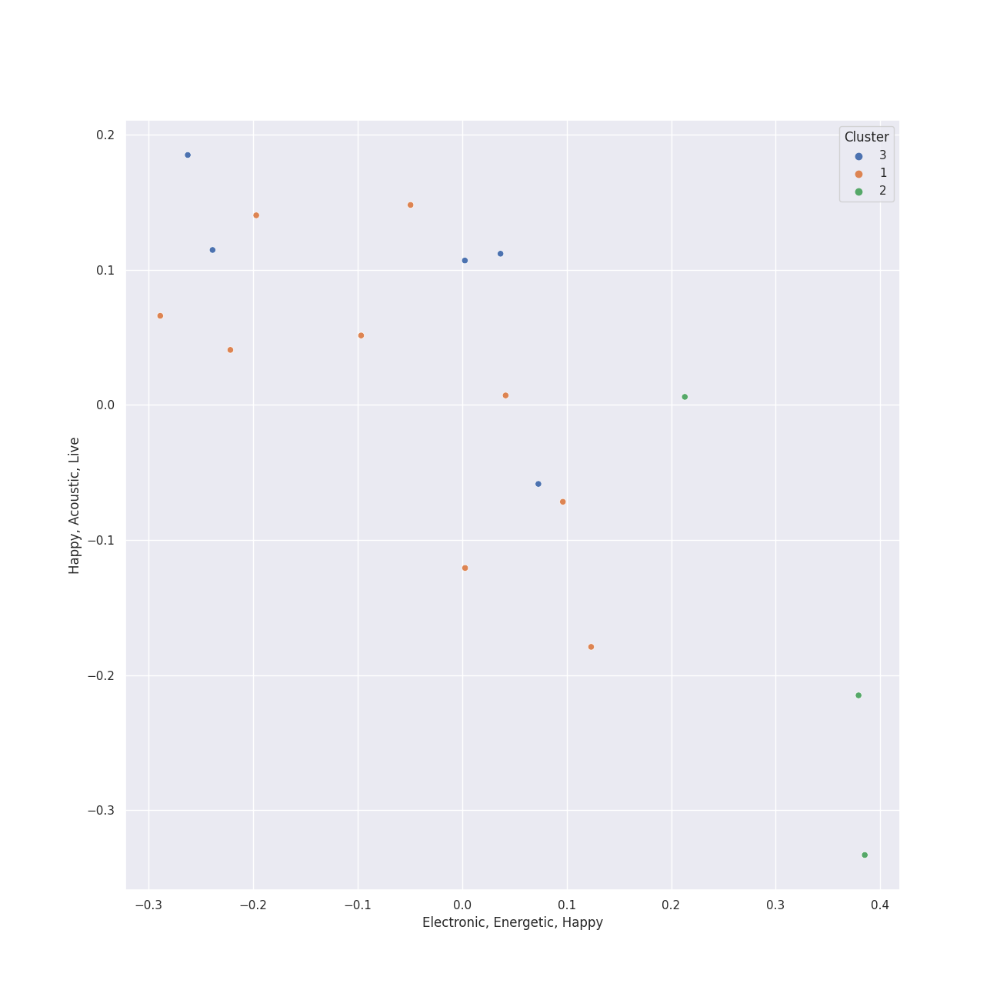

# Clusters in K-OST

## Cluster #1

7 tracks

| Art | Track | Album | Artists | Label | 💚 | 🔗 |
|:---|:---|:---|:---|:---|:---|:---|
|  | Show Your Heart 너를 보여줘 | Meow the secret boy 어서와 (Original Television Soundtrack), Pt.11 | CHAN 찬 | Donuts Music N | 💚 | [🔗](https://open.spotify.com/track/7oYfQoClg6KCZ0NBVvLZzY) |
|  | Say Yes | Moonlovers - Scarlet Heart Ryeo (Original Television Soundtrack), Pt. 2 | Loco, Punch | [Stone Music Entertainment](../../../../labels/stone_music_entertainment) | 💚 | [🔗](https://open.spotify.com/track/27zrFrtUtWl2urlvjOn5xc) |
|  | Love, Maybe | Love, Maybe (A Business Proposal OST Special Track) | MeloMance | FLEX M | 💚 | [🔗](https://open.spotify.com/track/2X45nVBeYzmDlrXji9Av0Q) |
|  | 어떤 별보다 | Hotel del Luna (Original Television Soundtrack) Pt.8 | [Red Velvet](../../../../artists/red_velvet/overview.md) | FNC인베스트먼트 | | [🔗](https://open.spotify.com/track/3rjWX5YhfI3Alagrf4poY0) |
|  | Starlight | Twenty-Five Twenty-One OST | TAEIL | Studio MaumC, Hwa&Dam pictures | 💚 | [🔗](https://open.spotify.com/track/7cIC9v7EfYZl7vFLPkIXTS) |
|  | Bandit | Song of the Bandits (Music from The Netflix Series) | TAEIL | [Genie Music Corporation](../../../../labels/genie_music_corporation), [Stone Music Entertainment](../../../../labels/stone_music_entertainment) | 💚 | [🔗](https://open.spotify.com/track/3mQH4pXsnixxr8EDK7ZZVa) |
|  | My Day Is Full Of You | The King: Eternal Monarch (Original Television Soundtrack), Pt. 10 | ZICO, [WENDY](../../../../artists/wendy/overview.md) | [Genie Music Corporation](../../../../labels/genie_music_corporation), [Stone Music Entertainment](../../../../labels/stone_music_entertainment) | | [🔗](https://open.spotify.com/track/2QWa5RjnIGFwraHDPqlhFh) |
## Cluster #2

7 tracks

| Art | Track | Album | Artists | Label | 💚 | 🔗 |
|:---|:---|:---|:---|:---|:---|:---|
|  | U | Doom at Your Service (Original Television Soundtrack) Pt. 3 | [BAEKHYUN](../../../../artists/baekhyun/overview.md) | 뮤직앤뉴, 스튜디오앤뉴 | 💚 | [🔗](https://open.spotify.com/track/0AtHUIDAkXWgpbD0QkyKgi) |
|  | Very, Slowly | Twenty-Five Twenty-One OST | [BIBI](../../../../artists/bibi/overview.md) | Studio MaumC, Hwa&Dam pictures | 💚 | [🔗](https://open.spotify.com/track/1dpLjawAb5PhlDr1w1diEe) |
|  | 내 맘을 볼 수 있나요 | Hotel del Luna (Original Television Soundtrack) Pt.5 | [HEIZE](../../../../artists/heize/overview.md) | FNC인베스트먼트 | | [🔗](https://open.spotify.com/track/2oVHb8wyg6oC2iNpGBNvx1) |
|  | Heartbeat | Strong Woman Do Bong Soon, Pt. 2 (Original Television Soundtrack) | SURAN | JTBC Studios | 💚 | [🔗](https://open.spotify.com/track/3Mz7i60GsWWLRyDeAIuCZA) |
|  | If | Hong Gil Dong OST | [TAEYEON](../../../../artists/taeyeon/overview.md) | msmedia | 💚 | [🔗](https://open.spotify.com/track/76do9IBWqoiwV3EyoP25Le) |
|  | 그대라는 시 | Hotel del Luna (Original Television Soundtrack) Pt.3 | [TAEYEON](../../../../artists/taeyeon/overview.md) | FNC인베스트먼트 | 💚 | [🔗](https://open.spotify.com/track/56Cmy1rCQ35V2Q7groYiHl) |
|  | Goodbye | The Beauty Inside Pt. 6 (Original Television Soundtrack) | [WENDY](../../../../artists/wendy/overview.md) | 뮤직앤뉴, 스튜디오앤뉴 | 💚 | [🔗](https://open.spotify.com/track/2ogfEqGNv9LAzkPY6rjfsi) |
## Cluster #3

4 tracks

| Art | Track | Album | Artists | Label | 💚 | 🔗 |
|:---|:---|:---|:---|:---|:---|:---|
|  | Stay With Me | Guardian (Original Television Soundtrack), Pt. 1 | CHANYEOL, Punch | [Genie Music Corporation](../../../../labels/genie_music_corporation), [Stone Music Entertainment](../../../../labels/stone_music_entertainment) | 💚 | [🔗](https://open.spotify.com/track/1HYzRuWjmS9LXCkdVHi25K) |
|  | Yours | Jirisan (Original Television Soundtrack) Pt. 4 | JIN | 에이스토리, 모스트콘텐츠 | 💚 | [🔗](https://open.spotify.com/track/10IfXtjKQmOiON7tNAHv0y) |
|  | Adrenaline | VINCENZO (Original Television Soundtrack) Pt. 3 | Solar | [Genie Music Corporation](../../../../labels/genie_music_corporation) | 💚 | [🔗](https://open.spotify.com/track/6ZQmJVUuXk1Q27d8vkmgm8) |
|  | Sweet Night | ITAEWON CLASS (Original Television Soundtrack) Pt. 12 | V | (주)블렌딩 | 💚 | [🔗](https://open.spotify.com/track/39EXZNMxb4RBHlRjnRaOKp) |