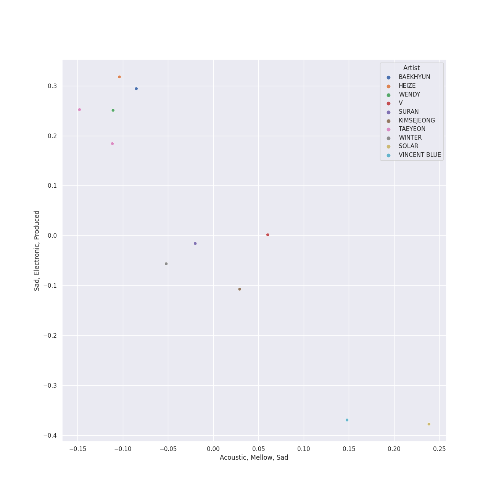
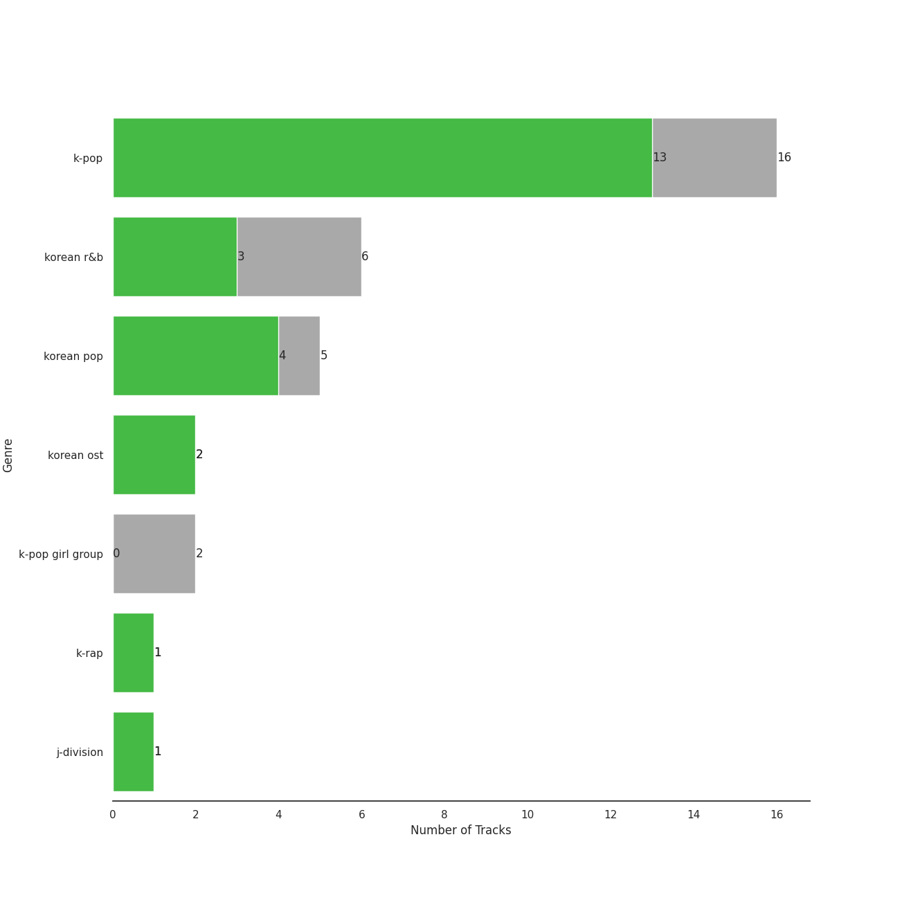
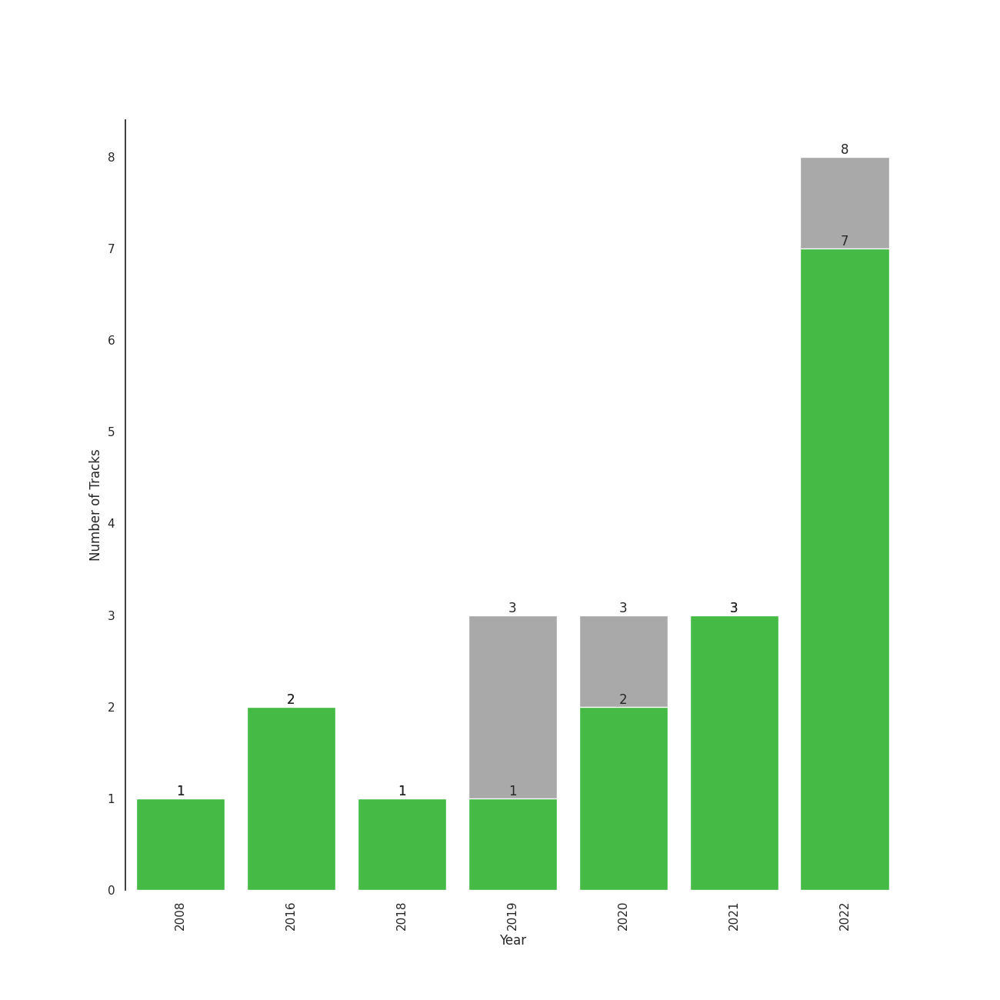

# K-OST

[22 songs (18 liked)](tracks.md)

[See Track Features](audio_features.md)

[See Clusters](clusters/overview.md)

## Top Artists

| Art | Tracks | 💚 | Artist | 🔗 |
|:---|---:|---:|:---|:---|
|  | 2 | 2 | [TAEYEON](../../artists/taeyeon/overview.md) | [🔗](https://open.spotify.com/artist/3qNVuliS40BLgXGxhdBdqu) |
|  | 2 | 1 | Punch | [🔗](https://open.spotify.com/artist/2FgZrgTMX6Sk0VNcOsEPmm) |
|  | 2 | 1 | [WENDY](../../artists/wendy/overview.md) | [🔗](https://open.spotify.com/artist/0FRUZvZNPzM3YJMABJxf2K) |
|  | 1 | 1 | JIHYO | [🔗](https://open.spotify.com/artist/7F1iAHRYxR3MY7yAEuFqgL) |
|  | 1 | 1 | MeloMance | [🔗](https://open.spotify.com/artist/6k4r73Wq8nhkCDoUsECL1e) |
|  | 1 | 1 | CHANYEOL | [🔗](https://open.spotify.com/artist/6jV25rzTKQ2zMgrqHha1V5) |
|  | 1 | 1 | [BIBI](../../artists/bibi/overview.md) | [🔗](https://open.spotify.com/artist/6UbmqUEgjLA6jAcXwbM1Z9) |
|  | 1 | 1 | Nam Joohyuk | [🔗](https://open.spotify.com/artist/69ybhMoBUPmIcH4MyDARDv) |
|  | 1 | 1 | JIN | [🔗](https://open.spotify.com/artist/5vV3bFXnN6D6N3Nj4xRvaV) |
|  | 1 | 1 | NINGNING | [🔗](https://open.spotify.com/artist/5t1uryofgueHrjrryqX8vM) |

See all 26 artists

| Art | Tracks | 💚 | Artist | 🔗 |
|:---|---:|---:|:---|:---|
|  | 1 | 1 | Wonstein | [🔗](https://open.spotify.com/artist/5o615XColiSVMPDWlslKSk) |
|  | 1 | 1 | Solar | [🔗](https://open.spotify.com/artist/5cYcI546S8Lf97m4mNdYLD) |
|  | 1 | 1 | Bona(WJSN) | [🔗](https://open.spotify.com/artist/5EHm62VI2botfXyNvboLlL) |
|  | 1 | 1 | [BAEKHYUN](../../artists/baekhyun/overview.md) | [🔗](https://open.spotify.com/artist/4ufh0WuMZh6y4Dmdnklvdl) |
|  | 1 | 1 | Lee Joomyung | [🔗](https://open.spotify.com/artist/4dN1DsKUXV6xugiarFBAa6) |
|  | 1 | 1 | WINTER | [🔗](https://open.spotify.com/artist/3mPquBmMu97Iq9TpzQ6ayI) |
|  | 1 | 1 | V | [🔗](https://open.spotify.com/artist/3JsHnjpbhX4SnySpvpa9DK) |
|  | 1 | 1 | Vincent Blue | [🔗](https://open.spotify.com/artist/2AZgVjkPB4a4ULepFyPPgZ) |
|  | 1 | 1 | Choi Hyunwook | [🔗](https://open.spotify.com/artist/1z2J8XtoQxczs0U1lMWEiZ) |
|  | 1 | 1 | TAEIL | [🔗](https://open.spotify.com/artist/1z0Hi3myYw4x32xCq0H3aq) |
|  | 1 | 1 | SURAN | [🔗](https://open.spotify.com/artist/1mORehSVEd7lcaT2d7Sl2K) |
|  | 1 | 1 | CHAN 찬 | [🔗](https://open.spotify.com/artist/0nxWeW71DDYHY26V4LzMz9) |
|  | 1 | 1 | Kim Taeri | [🔗](https://open.spotify.com/artist/0bBDQ4QeizwResorw0iD7X) |
|  | 1 | 0 | HEIZE | [🔗](https://open.spotify.com/artist/5dCvSnVduaFleCnyy98JMo) |
|  | 1 | 0 | ZICO | [🔗](https://open.spotify.com/artist/4XpUIb8uuNlIWVKmgKZXC0) |
|  | 1 | 0 | KIMSEJEONG | [🔗](https://open.spotify.com/artist/1lFLniFTaPjYCtQZvDXpqu) |

## Top Albums

| Art | Tracks | 💚 | Album | Release Date | 🔗 |
|:---|---:|---:|:---|:---|:---|
|  | 5 | 5 | Twenty-Five Twenty-One OST | 2022-04-03 | [🔗](https://open.spotify.com/album/77NPr874WU941XZhjO43dR) |
|  | 1 | 1 | Weightlifting Fairy Kim Bok Joo (Original Television Soundtrack, Pt. 2) | 2016-11-23 | [🔗](https://open.spotify.com/album/1T8J131uP2pI7VuxSF2zp3) |
|  | 1 | 1 | VINCENZO (Original Television Soundtrack) Pt. 3 | 2021-03-14 | [🔗](https://open.spotify.com/album/47ulDGfVUWUcUSWRQCzxr3) |
|  | 1 | 1 | The Beauty Inside Pt. 6 (Original Television Soundtrack) | 2018-11-06 | [🔗](https://open.spotify.com/album/6w3jg4xGMI5LLr5DEL3zWY) |
|  | 1 | 1 | Strong Woman Do Bong Soon, Pt. 2 (Original Television Soundtrack) | 2017-03-04 | [🔗](https://open.spotify.com/album/21jYCYSrxo7IEO67xH6XeN) |
|  | 1 | 1 | Our Blues, Pt. 10 (Original Television Soundtrack) | 2022-05-22 | [🔗](https://open.spotify.com/album/0mP330aRyX4P4ZjarRKnXO) |
|  | 1 | 1 | Meow the secret boy 어서와 (Original Television Soundtrack), Pt.11 | 2020-04-23 | [🔗](https://open.spotify.com/album/0ZqZDky3PSbzKgHJzvSRuJ) |
|  | 1 | 1 | Love, Maybe (A Business Proposal OST Special Track) | 2022-02-18 | [🔗](https://open.spotify.com/album/5lKdnY9bGYUyfaJhcRnHgk) |
|  | 1 | 1 | Jirisan (Original Television Soundtrack) Pt. 4 | 2021-11-07 | [🔗](https://open.spotify.com/album/2FUiBNFWz47sBPEf3Dcma4) |
|  | 1 | 1 | ITAEWON CLASS (Original Television Soundtrack) Pt. 12 | 2020-03-13 | [🔗](https://open.spotify.com/album/1q3j12Y1sp2eqqffSnyA93) |

See all 18 albums

| Art | Tracks | 💚 | Album | Release Date | 🔗 |
|:---|---:|---:|:---|:---|:---|
|  | 1 | 1 | Hotel del Luna (Original Television Soundtrack) Pt.3 | 2019-07-21 | [🔗](https://open.spotify.com/album/6nddI94g7zC5bbyNzRBO0Y) |
|  | 1 | 1 | Hong Gil Dong OST | 2008-01-23 | [🔗](https://open.spotify.com/album/5Efud8Wmo7vBQjSJI1WcJ7) |
|  | 1 | 1 | Guardian (Original Television Soundtrack), Pt. 1 | 2016-12-03 | [🔗](https://open.spotify.com/album/6Pr1DaOWfT6hEewhZMRyqg) |
|  | 1 | 1 | Doom at Your Service (Original Television Soundtrack) Pt. 3 | 2021-05-31 | [🔗](https://open.spotify.com/album/2fy01jwC0GrnBGQ4Crcnve) |
|  | 1 | 0 | The King: Eternal Monarch (Original Television Soundtrack), Pt. 10 | 2020-05-16 | [🔗](https://open.spotify.com/album/02zl7wdcgbI0URRfMbzmF5) |
|  | 1 | 0 | Love, Maybe (A Business Proposal OST Bonus Track) | 2022-04-05 | [🔗](https://open.spotify.com/album/7I3EMy3n72e6ABSq4Ubhoz) |
|  | 1 | 0 | Hotel del Luna (Original Television Soundtrack) Pt.5 | 2019-07-28 | [🔗](https://open.spotify.com/album/2PdRNAz6mDmy9OR7hDCrH5) |
|  | 1 | 0 | Hotel del Luna (Original Television Soundtrack) Pt.12 | 2019-08-18 | [🔗](https://open.spotify.com/album/6iNbnT79OJu9C5j5ZZLQvZ) |

## Top Record Labels

| Tracks | 💚 | Label |
|---:|---:|:---|
| 5 | 5 | Studio MaumC |
| 5 | 5 | Hwa&Dam pictures |
| 4 | 3 | [Genie Music Corporation](../../labels/genie_music_corporation/overview.md) |
| 3 | 2 | [Stone Music Entertainment](../../labels/stone_music_entertainment/overview.md) |
| 2 | 2 | 스튜디오앤뉴 |
| 2 | 2 | 뮤직앤뉴 |
| 3 | 1 | FNC인베스트먼트 |
| 2 | 1 | FLEX M |
| 1 | 1 | 에이스토리 |
| 1 | 1 | 스타엔트리엔터테인먼트 |

See all 15 labels

| Tracks | 💚 | Label |
|---:|---:|:---|
| 1 | 1 | 모스트콘텐츠 |
| 1 | 1 | msmedia |
| 1 | 1 | JTBC Studios |
| 1 | 1 | Donuts Music N |
| 1 | 1 | (주)블렌딩 |

## Genres

| Tracks | 💚 | Genre |
|---:|---:|:---|
| 13 | 10 | [k-pop](../../genres/k_pop/overview.md) |
| 4 | 3 | korean pop |
| 4 | 2 | [korean r&b](../../genres/korean_r_b/overview.md) |
| 2 | 2 | korean ost |
| 1 | 1 | j-division |

## Years

| ​ | 10 newest albums | ​​ | 10 oldest albums |
|:---|:---|:---|:---|
|  | Our Blues, Pt. 10 (Original Television Soundtrack) (2022-05-22) |  | Hong Gil Dong OST (2008-01-23) |
|  | Love, Maybe (A Business Proposal OST Bonus Track) (2022-04-05) |  | Weightlifting Fairy Kim Bok Joo (Original Television Soundtrack, Pt. 2) (2016-11-23) |
|  | Twenty-Five Twenty-One OST (2022-04-03) |  | Guardian (Original Television Soundtrack), Pt. 1 (2016-12-03) |
|  | Love, Maybe (A Business Proposal OST Special Track) (2022-02-18) |  | Strong Woman Do Bong Soon, Pt. 2 (Original Television Soundtrack) (2017-03-04) |
|  | Jirisan (Original Television Soundtrack) Pt. 4 (2021-11-07) |  | The Beauty Inside Pt. 6 (Original Television Soundtrack) (2018-11-06) |
|  | Doom at Your Service (Original Television Soundtrack) Pt. 3 (2021-05-31) |  | Hotel del Luna (Original Television Soundtrack) Pt.3 (2019-07-21) |
|  | VINCENZO (Original Television Soundtrack) Pt. 3 (2021-03-14) |  | Hotel del Luna (Original Television Soundtrack) Pt.5 (2019-07-28) |
|  | The King: Eternal Monarch (Original Television Soundtrack), Pt. 10 (2020-05-16) |  | Hotel del Luna (Original Television Soundtrack) Pt.12 (2019-08-18) |
|  | Meow the secret boy 어서와 (Original Television Soundtrack), Pt.11 (2020-04-23) |  | ITAEWON CLASS (Original Television Soundtrack) Pt. 12 (2020-03-13) |
|  | ITAEWON CLASS (Original Television Soundtrack) Pt. 12 (2020-03-13) |  | Meow the secret boy 어서와 (Original Television Soundtrack), Pt.11 (2020-04-23) |