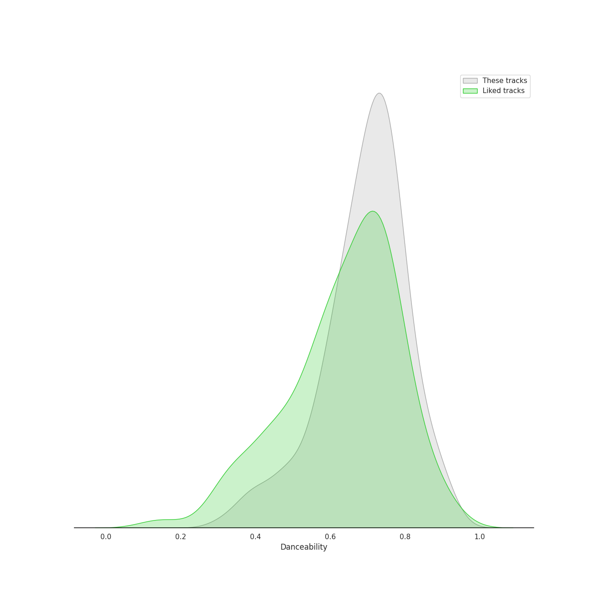
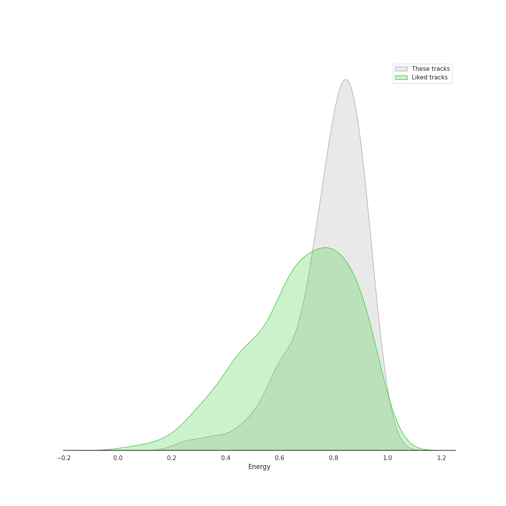
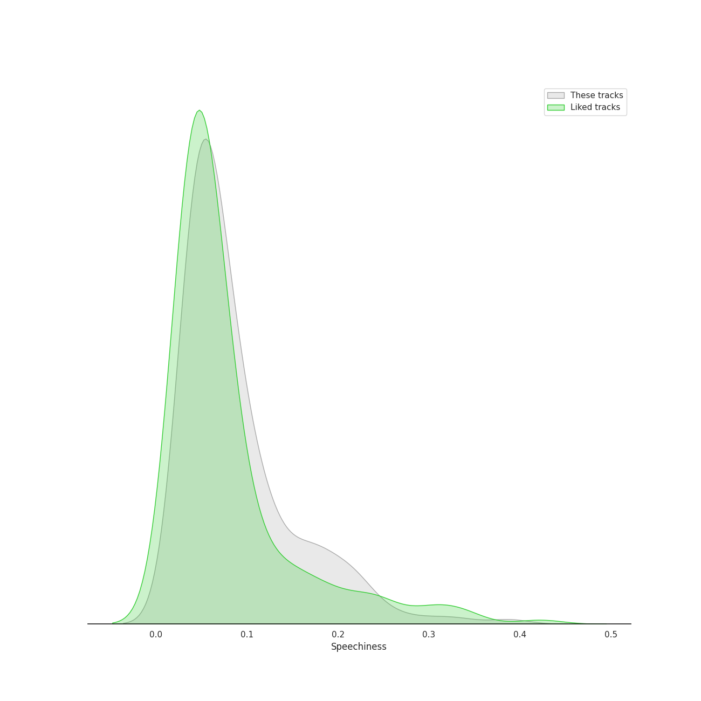
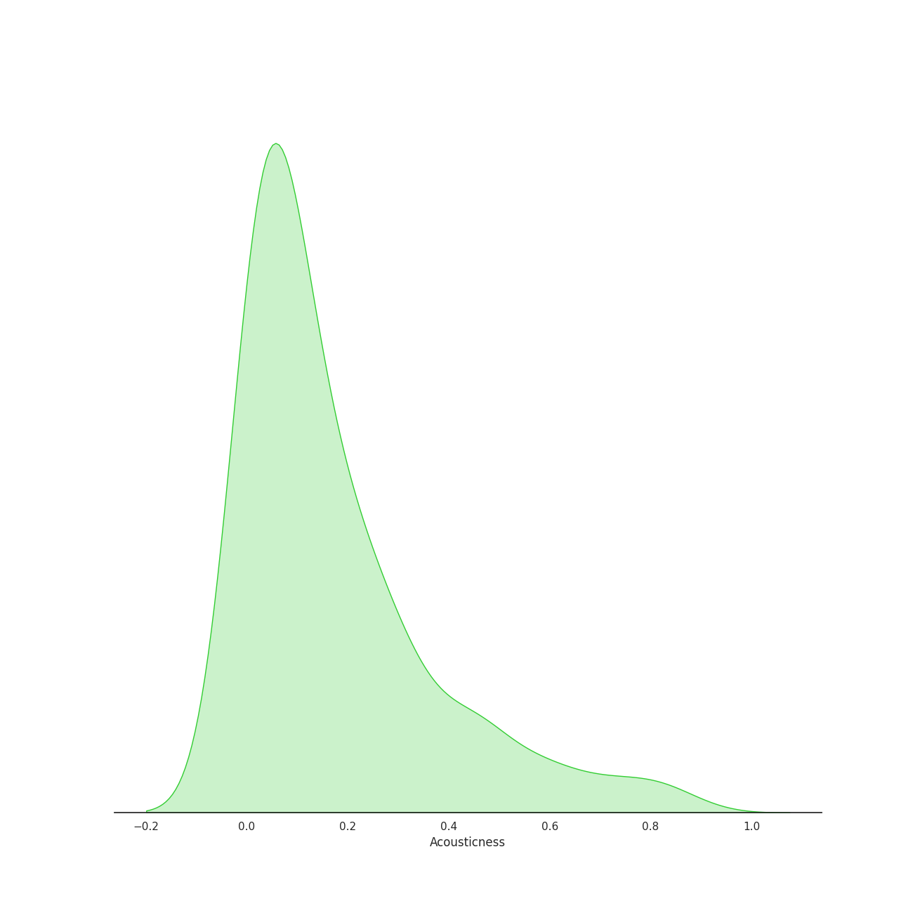
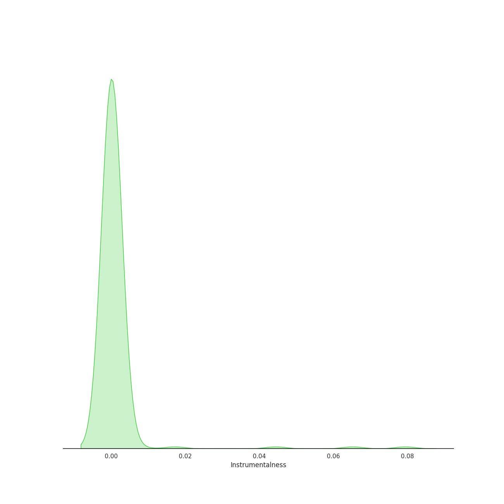
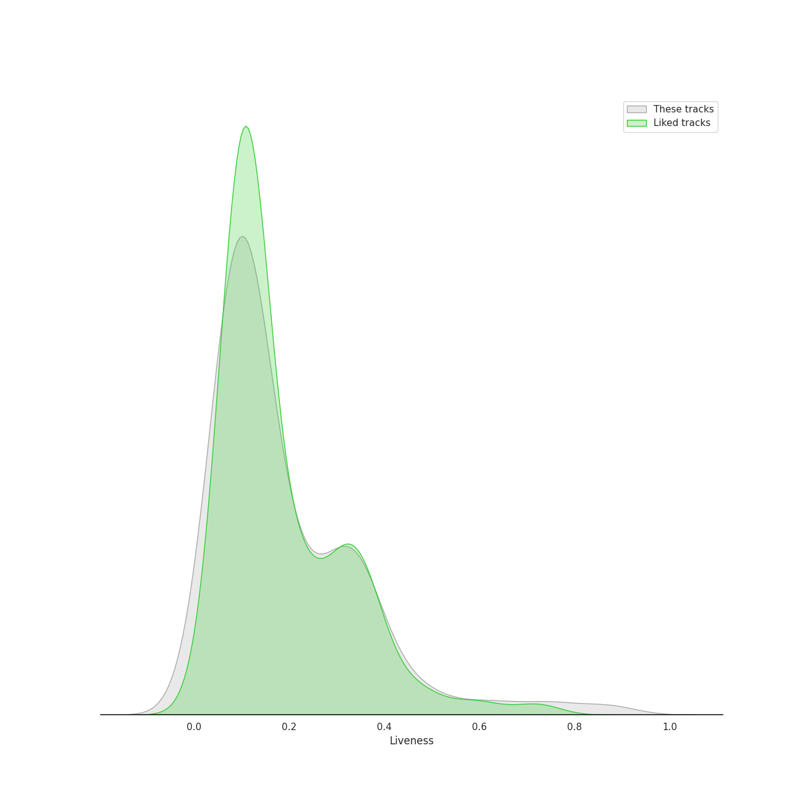
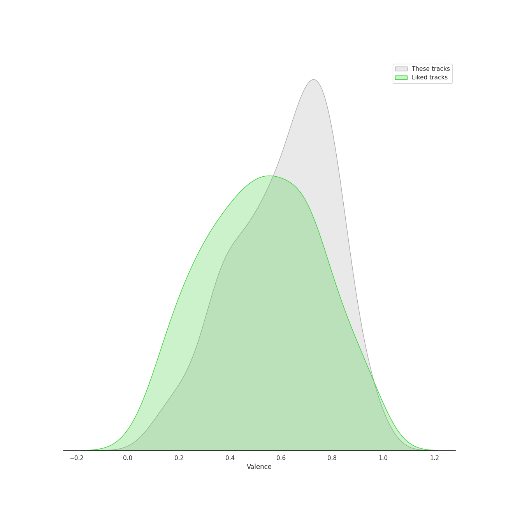
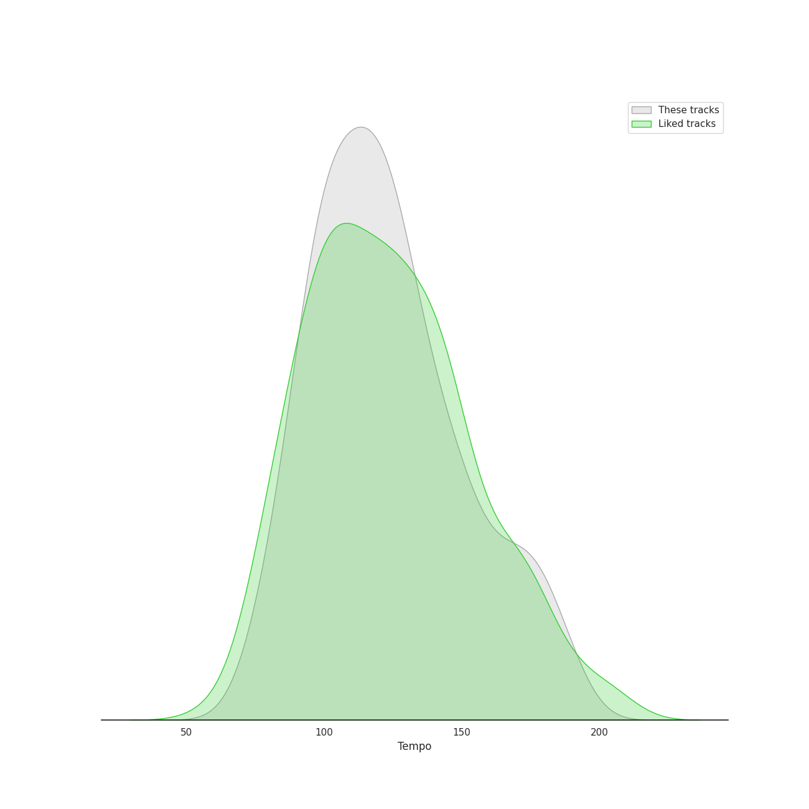

# Track Features for K-Pop

## Danceability

| ​ | 10 most Danceable tracks | ​​ | 10 least Danceable tracks |
|:---|:---|:---|:---|
|  | Cold Blooded (0.961) |  | Here I Am (0.3) |
|  | #Twenty (0.956) |  | On The Ground (0.311) |
|  | Ah puh (0.954) |  | AMYGDALA (0.311) |
|  | SNEAKERS (0.935) |  | My sea (0.353) |
|  | ASAP (0.934) |  | Fine (0.36) |
|  | Idle song (0.933) |  | Like Water (0.365) |
|  | Jelly (0.921) |  | Epilogue (0.366) |
|  | Sensitive (0.918) |  | Clockwork (0.37) |
|  | BET ON ME (0.917) |  | CHEESE (0.376) |
|  | Weather (0.915) |  | HWAA (0.384) |

## Energy

| ​ | 10 most Energetic tracks | ​​ | 10 least Energetic tracks |
|:---|:---|:---|:---|
|  | War of Hormone (0.993) |  | miss you (Hyunjin) (0.226) |
|  | RING X RING (0.987) |  | Winter Sleep (0.237) |
|  | Hit That Drum (0.984) |  | Boy in time - HUI Solo (0.255) |
|  | Misfit (0.984) |  | Singularity (0.272) |
|  | MIROH (0.979) |  | Flower Way (Prod. By ZICO) (0.282) |
|  | Side Effects (0.977) |  | Through the Night (0.313) |
|  | 소방차 Fire Truck (0.976) |  | Seed (0.33) |
|  | Girls (0.974) |  | Rose (0.352) |
|  | Abracadabra (0.973) |  | Put It Straight (0.358) |
|  | 쏘리 쏘리 Sorry, Sorry (0.972) |  | The Happiest Girl (0.374) |

## Speechiness

| ​ | 10 most Speechy tracks | ​​ | 10 least Speechy tracks |
|:---|:---|:---|:---|
|  | No More Dream (0.472) |  | Scary Fairy Tale (0.0263) |
|  | Addicted (0.419) |  | Moonlight Melody (0.0269) |
|  | MANIAC (0.411) |  | Winter Sleep (0.0273) |
|  | Freedom (0.388) |  | Hope Not (0.0274) |
|  | Free Fall (0.376) |  | Gee (0.0277) |
|  | I GOT IT (HAN) (0.365) |  | NANANA (0.0277) |
|  | Ice Cream (with Selena Gomez) (0.365) |  | YOUNG LUV (0.0277) |
|  | Feelin' Like (0.353) |  | LOVE FOOL (0.0281) |
|  | JACKPOT (0.345) |  | Spark (0.0283) |
|  | VENOM (0.339) |  | In My Dreams (0.0283) |

## Acousticness

| ​ | 10 most Acoustic tracks | ​​ | 10 least Acoustic tracks |
|:---|:---|:---|:---|
|  | Boy in time - HUI Solo (0.876) |  | Poison (9.27e-05) |
|  | In The Fall (0.854) |  | Easy (0.000219) |
|  | Amusement Park (0.85) |  | Mr. Simple (0.000219) |
|  | unlucky (0.836) |  | Tamed-Dashed (0.000253) |
|  | Flower Way (Prod. By ZICO) (0.831) |  | Cyberpunk (0.000265) |
|  | miss you (Hyunjin) (0.826) |  | Oh Sorry Ya (0.000315) |
|  | Secret Garden (0.825) |  | I Love You (0.000371) |
|  | Winter Sleep (0.82) |  | Red Light (0.000457) |
|  | HANN (Alone in winter) (0.814) |  | Attention, please! (0.000483) |
|  | Rainy Season (0.806) |  | KNOCK (0.000545) |

## Instrumentalness

| ​ | 10 most Instrumental tracks | ​​ | 10 least Instrumental tracks |
|:---|:---|:---|:---|
|  | Tarantino (0.792) |  | Set Myself On Fire (0.0) |
|  | Tippy Toes (0.106) |  | Gangnam Style (강남스타일) (0.0) |
|  | You and I (Park Bom) (0.0837) |  | GGBB (0.0) |
|  | Adios (0.0794) |  | Moonlight (0.0) |
|  | pporappippam (0.0652) |  | Fire in the belly (0.0) |
|  | Badster (0.0444) |  | To the moon (0.0) |
|  | YEPPI YEPPI (0.0391) |  | SUPER BOARD (0.0) |
|  | It′s Raining (0.0233) |  | Clockwork (0.0) |
|  | Cherry Blossom (0.0171) |  | Shut Down (0.0) |
|  | HIT YA! (0.0127) |  | DALALA (0.0) |

## Liveness

| ​ | 10 most Live tracks | ​​ | 10 least Live tracks |
|:---|:---|:---|:---|
|  | Heart Attack (0.887) |  | PING PONG (0.0202) |
|  | Jopping (0.857) |  | CASE 143 (0.0222) |
|  | Piano Man (0.807) |  | SNEAKERS (0.0223) |
|  | You Better Run (0.803) |  | Black Out (0.0243) |
|  | MAKE U DANCE (feat. EUNHA) (0.792) |  | Fire in the belly (0.0266) |
|  | 미행 (그림자 : Shadow) (0.782) |  | That That (prod. & feat. SUGA of BTS) (0.0272) |
|  | Generation (0.777) |  | memeM (0.0287) |
|  | Sticker (0.742) |  | YEPPI YEPPI (0.029) |
|  | I Like That (0.737) |  | Holiday Party (0.0294) |
|  | 행복 (Happiness) (0.725) |  | Ice Cream (with Selena Gomez) (0.0311) |

## Valence

| ​ | 10 most Happy tracks | ​​ | 10 least Happy tracks |
|:---|:---|:---|:---|
|  | Twenty-three (0.968) |  | The Road (0.073) |
|  | Devil (0.968) |  | Grey Suit (0.0955) |
|  | Tell Me (0.968) |  | 7월 7일 One Of These Nights (0.11) |
|  | Pepe (0.966) |  | Put It Straight (0.111) |
|  | So Hot (0.963) |  | Good Night My Princess (0.112) |
|  | Miniskirt (0.963) |  | Side Effects (0.118) |
|  | Twinkle (0.962) |  | In The Fall (0.12) |
|  | 쏘리 쏘리 Sorry, Sorry (0.962) |  | Wet Nightmare (0.121) |
|  | LIP GLOSS (0.961) |  | My sea (0.122) |
|  | Cupid (0.961) |  | Time After Time (0.123) |

## Tempo

| ​ | 10 most Fast tracks | ​​ | 10 least Fast tracks |
|:---|:---|:---|:---|
|  | Signal (207.819) |  | Dream (48.973) |
|  | Freedom (203.833) |  | Bambi (61.45) |
|  | Adore U (203.802) |  | Naked Gold (Prod. Czaer) (62.107) |
|  | Every night (203.639) |  | STRANGER (62.644) |
|  | 11:11 (203.155) |  | Run Devil Run (64.927) |
|  | PAXXWORD (200.646) |  | Over Me (67.998) |
|  | O.O (200.263) |  | Clockwork (68.045) |
|  | Awkward Silence (199.981) |  | Winter Sleep (68.045) |
|  | Strawberry Cake (199.943) |  | Sacrifice (Eat Me Up) (68.985) |
|  | Modern Times (199.923) |  | Brunch (69.581) |
