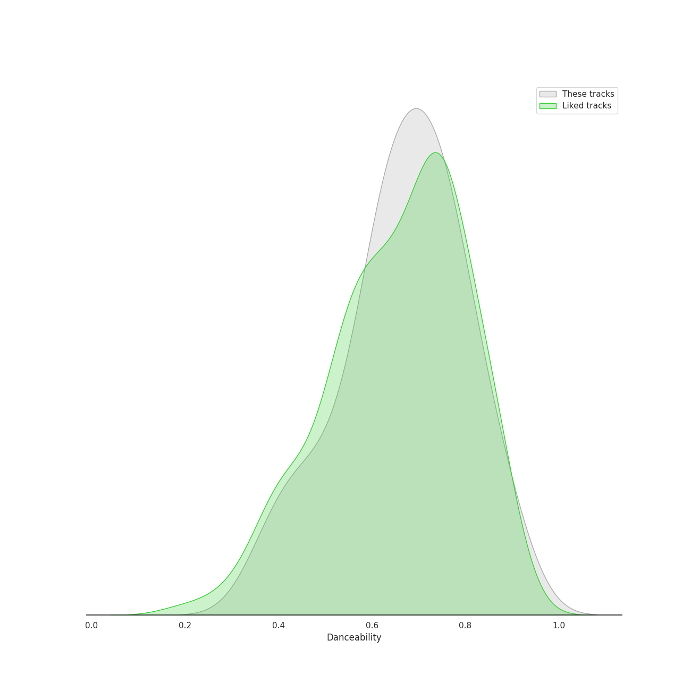
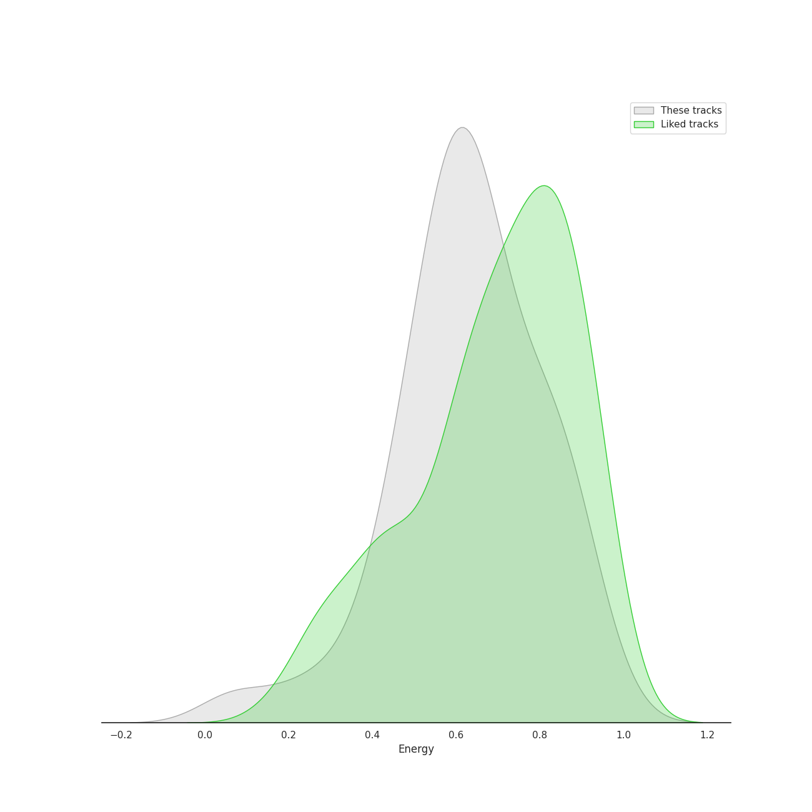
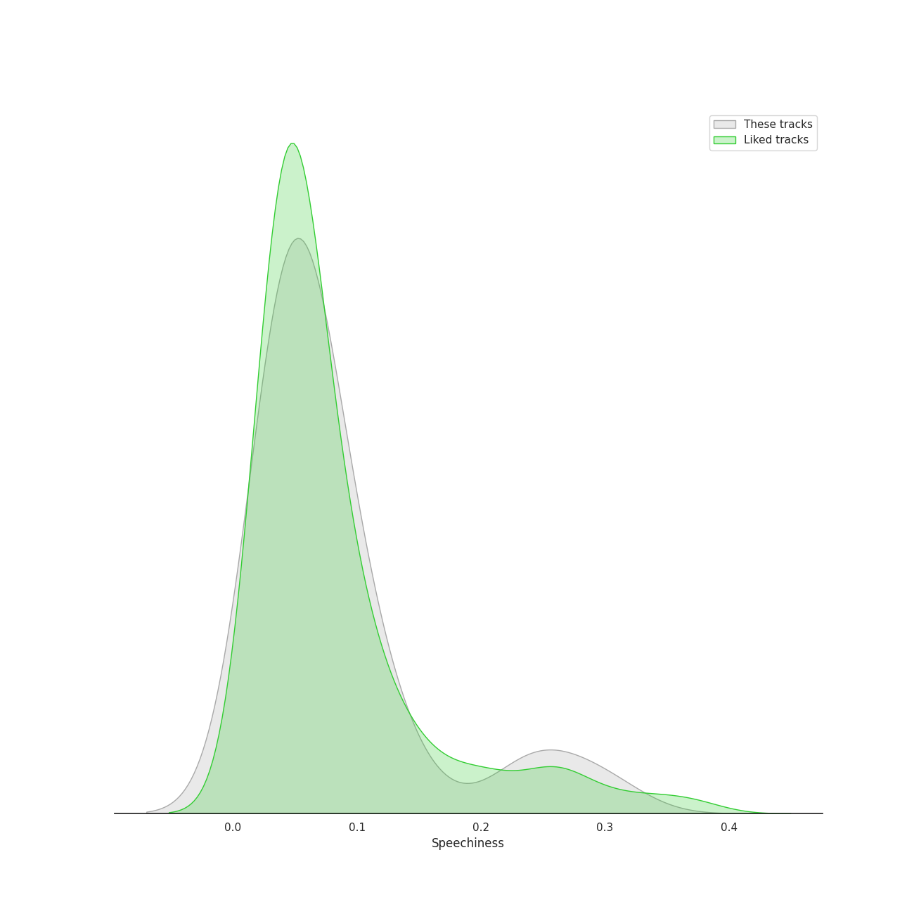
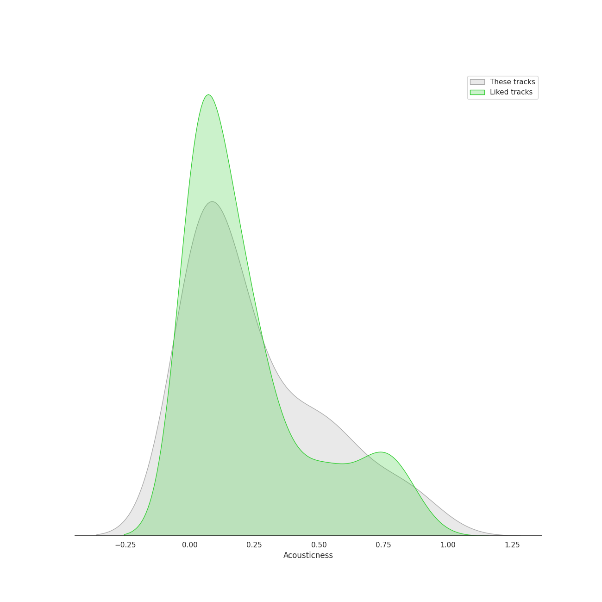
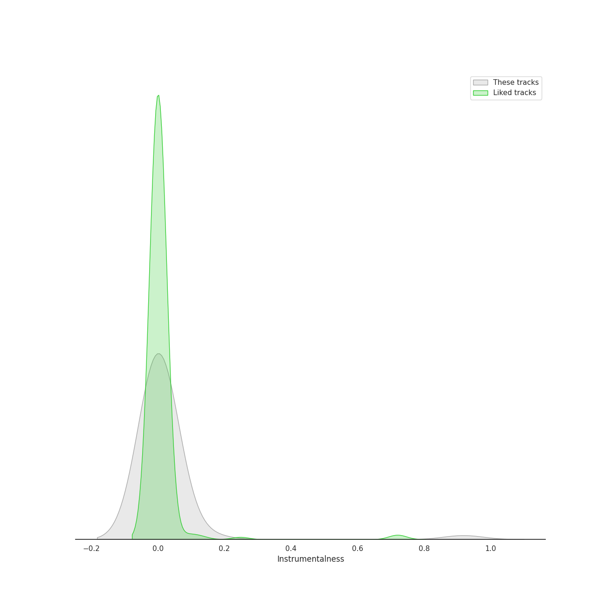
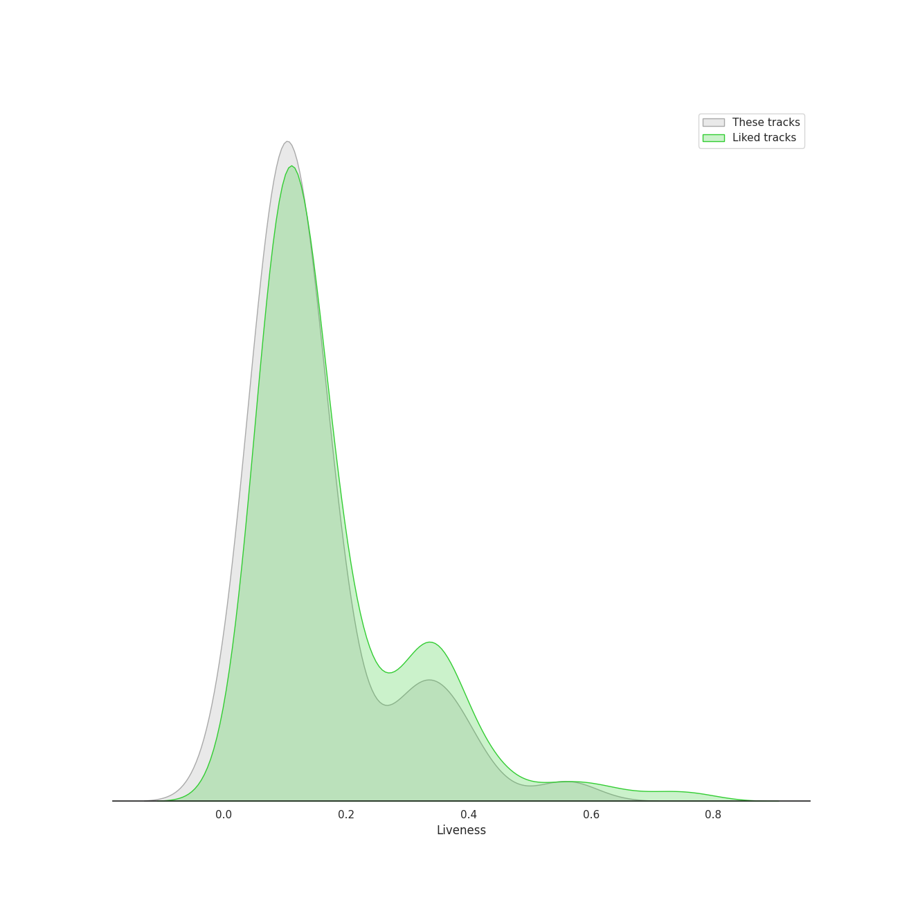
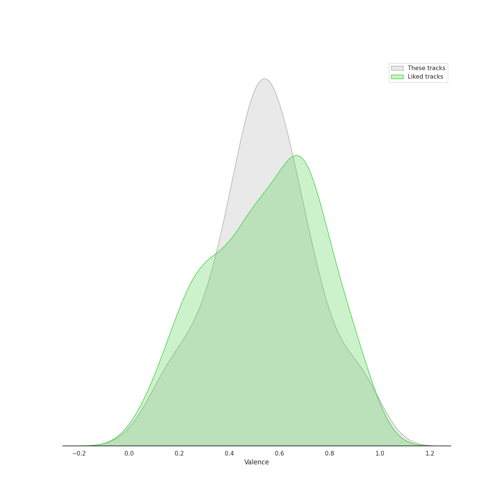
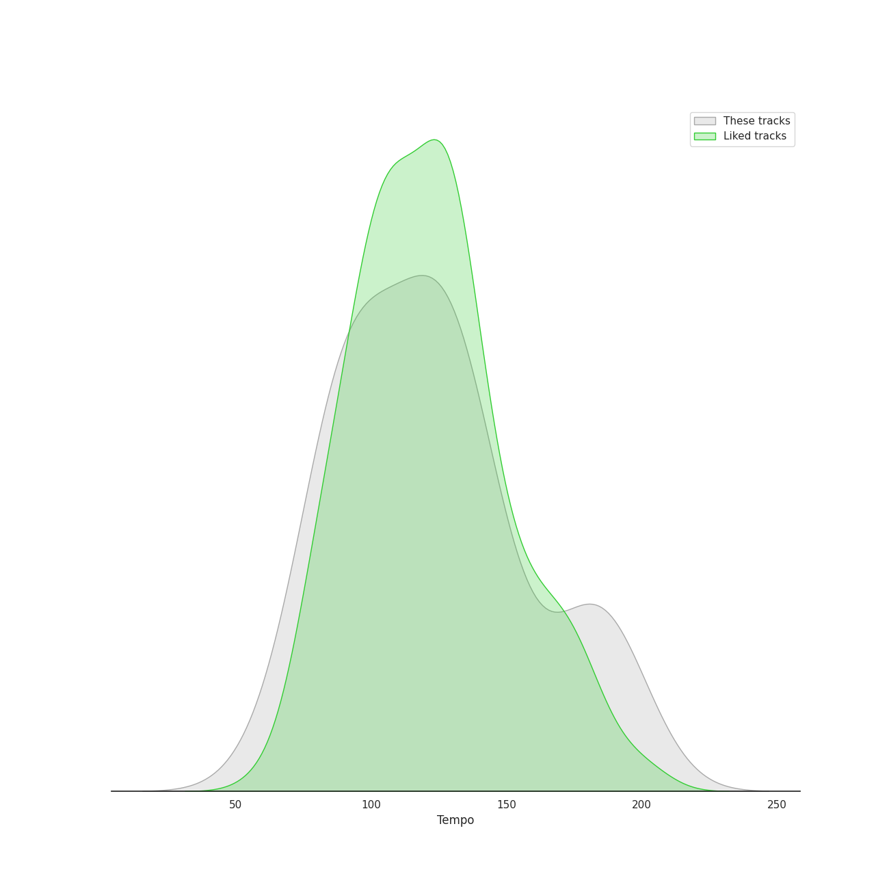

# Audio Features for K-Pop-Adjacent

## Danceability

| 10 most Danceable tracks | 10 least Danceable tracks |
|:---|:---|
| Sneaky Snitch (0.904) | I'll Show You (0.361) |
| MALAMENTE - Cap.1: Augurio (0.893) | Blue Whale - 2016 Version (0.382) |
| Next Level (0.885) | Partition (0.418) |
| Call Me Mother (0.859) | I Love You 3000 II (0.435) |
| Cravin (feat. G-Eazy) (0.834) | Heartbreak Anniversary (0.449) |
| Next Level - Habstrakt Remix (0.828) | ドライフラワー (0.463) |
| At My Worst (0.813) | Sk8er Boi (0.487) |
| SG (with Ozuna, Megan Thee Stallion & LISA of BLACKPINK) (0.8) | Off My Face (0.509) |
| Mr. Rover (0.799) | Tango (0.53) |
| Motley Crew (0.797) | SILENCE (0.532) |

## Energy

| 10 most Energetic tracks | 10 least Energetic tracks |
|:---|:---|
| Love's Battery (0.928) | Sneaky Snitch (0.0699) |
| I'm Out Of My Mind (0.909) | Off My Face (0.228) |
| Sk8er Boi (0.9) | I Love You 3000 II (0.338) |
| Break My Heart Myself (feat. Travis Barker) (0.857) | At My Worst (0.415) |
| SG (with Ozuna, Megan Thee Stallion & LISA of BLACKPINK) (0.837) | Partition (0.441) |
| ME! (feat. Brendon Urie of Panic! At The Disco) (0.83) | Heartbreak Anniversary (0.465) |
| Mr. Rover (0.829) | River (0.477) |
| Call Me Mother (0.828) | MALAMENTE - Cap.1: Augurio (0.482) |
| Next Level - Habstrakt Remix (0.816) | Tango (0.519) |
| Cry for Me (0.805) | Written In The Stars (0.519) |

## Speechiness

| 10 most Speechy tracks | 10 least Speechy tracks |
|:---|:---|
| Light Switch (0.308) | ドライフラワー (0.0276) |
| Partition (0.283) | Love's Battery (0.0297) |
| Boat (0.252) | SILENCE (0.0314) |
| Cravin (feat. G-Eazy) (0.246) | When I Get Old (0.0315) |
| Tango (0.224) | West Coast Love (0.0326) |
| Next Level (0.147) | Off My Face (0.0332) |
| Bad (0.12) | At My Worst (0.0349) |
| Sneaky Snitch (0.118) | Maria (0.0357) |
| Next Level - Habstrakt Remix (0.106) | Blue Whale - 2016 Version (0.0368) |
| Mr. Rover (0.103) | Good Thing (with Kehlani) (0.0378) |

## Acousticness

| 10 most Acoustic tracks | 10 least Acoustic tracks |
|:---|:---|
| Off My Face (0.92) | Sk8er Boi (6.79e-05) |
| I Love You 3000 II (0.853) | Maria (0.00226) |
| At My Worst (0.777) | SILENCE (0.00271) |
| Mushroom Chocolate (with 6LACK) (0.765) | Next Level - Habstrakt Remix (0.00387) |
| Sneaky Snitch (0.638) | SG (with Ozuna, Megan Thee Stallion & LISA of BLACKPINK) (0.00406) |
| Next Level (0.581) | West Coast Love (0.00666) |
| MALAMENTE - Cap.1: Augurio (0.549) | Call Me Mother (0.0156) |
| Heartbreak Anniversary (0.524) | Wet The Bed (feat. Ludacris) (0.0166) |
| ドライフラワー (0.495) | VILLAIN (0.0232) |
| Written In The Stars (0.478) | Partition (0.029) |

## Instrumentalness

| 10 most Instrumental tracks | 10 least Instrumental tracks |
|:---|:---|
| Sneaky Snitch (0.918) | Sk8er Boi (0.0) |
| Next Level - Habstrakt Remix (0.201) | At My Worst (0.0) |
| West Coast Love (0.153) | Salute (0.0) |
| Partition (0.0707) | City Girls (0.0) |
| MALAMENTE - Cap.1: Augurio (0.0164) | Tango (0.0) |
| Tomboy (0.00512) | I'm Out Of My Mind (0.0) |
| SG (with Ozuna, Megan Thee Stallion & LISA of BLACKPINK) (0.00313) | ME! (feat. Brendon Urie of Panic! At The Disco) (0.0) |
| Maria (0.00168) | Wet The Bed (feat. Ludacris) (0.0) |
| Call Me Mother (0.000828) | Boat (0.0) |
| From now on (0.000374) | Love's Battery (0.0) |

## Liveness

| 10 most Live tracks | 10 least Live tracks |
|:---|:---|
| Boat (0.56) | Call Me Mother (0.0205) |
| I Love You 3000 II (0.412) | Flowers (0.0322) |
| I'm Out Of My Mind (0.37) | Good Thing (with Kehlani) (0.0409) |
| Beggin' (0.359) | Maria (0.0534) |
| Sk8er Boi (0.358) | City Girls (0.0554) |
| Bad (0.329) | River (0.0579) |
| Partition (0.306) | Next Level (0.0657) |
| Heartbreak Anniversary (0.303) | Next Level - Habstrakt Remix (0.074) |
| Salute (0.285) | MALAMENTE - Cap.1: Augurio (0.0752) |
| When I Get Old (0.203) | Break My Heart Myself (feat. Travis Barker) (0.0801) |

## Valence

| 10 most Happy tracks | 10 least Happy tracks |
|:---|:---|
| Love's Battery (0.941) | I'll Show You (0.0789) |
| Next Level (0.923) | Partition (0.172) |
| Boat (0.922) | Blue Whale - 2016 Version (0.207) |
| Light Switch (0.905) | Motley Crew (0.288) |
| City Girls (0.815) | VILLAIN (0.306) |
| From now on (0.749) | Mr. Rover (0.351) |
| ME! (feat. Brendon Urie of Panic! At The Disco) (0.728) | Salute (0.354) |
| Bad (0.713) | I Love You 3000 II (0.354) |
| SG (with Ozuna, Megan Thee Stallion & LISA of BLACKPINK) (0.702) | Call Me Mother (0.36) |
| At My Worst (0.667) | Next Level - Habstrakt Remix (0.392) |

## Tempo

| 10 most Fast tracks | 10 least Fast tracks |
|:---|:---|
| Blue Whale - 2016 Version (200.096) | River (62.507) |
| I'll Show You (191.812) | SILENCE (77.995) |
| Good Thing (with Kehlani) (185.913) | Tomboy (77.998) |
| From now on (184.059) | Maria (80.056) |
| Light Switch (184.008) | Written In The Stars (80.882) |
| ME! (feat. Brendon Urie of Panic! At The Disco) (182.162) | Salute (82.027) |
| I Love You 3000 II (179.727) | Sneaky Snitch (87.037) |
| Partition (175.928) | Heartbreak Anniversary (89.087) |
| VILLAIN (160.013) | Off My Face (90.674) |
| Sk8er Boi (149.937) | At My Worst (91.921) |
