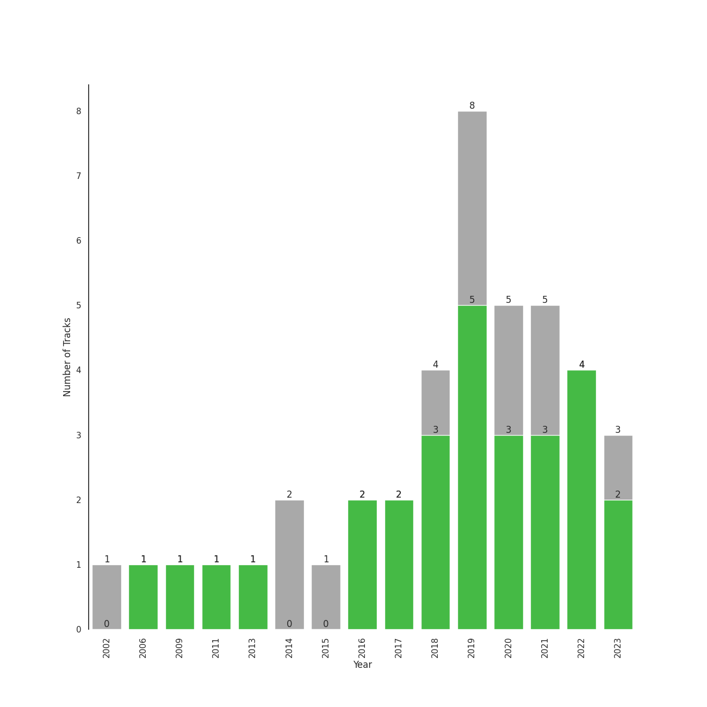

# K-Pop-Adjacent

[39 songs](tracks.md)

## Top Artists

See all 53 artists

| Number of Tracks | Art | Artist | 🔗 |
|---:|:---|:---|:---|
| 3 |  | XG | [🔗](https://open.spotify.com/artist/0LOK81e9H5lr61HlGGHqwA) |
| 2 |  | Chris Brown | [🔗](https://open.spotify.com/artist/7bXgB6jMjp9ATFy66eO08Z) |
| 2 |  | Christopher | [🔗](https://open.spotify.com/artist/3zDRCqOhJXJfS2YWOEwGMC) |
| 2 |  | Justin Bieber | [🔗](https://open.spotify.com/artist/1uNFoZAHBGtllmzznpCI3s) |
| 2 |  | YB | [🔗](https://open.spotify.com/artist/1rpgxJZxZMLnFNc1Jmyov5) |
| 1 |  | ROSALÍA | [🔗](https://open.spotify.com/artist/7ltDVBr6mKbRvohxheJ9h1) |
| 1 |  | [Beyoncé](../../artists/beyonc_.md) | [🔗](https://open.spotify.com/artist/6vWDO969PvNqNYHIOW5v0m) |
| 1 |  | Loving Caliber | [🔗](https://open.spotify.com/artist/6psCCMHymYfQy6VvYRr6cs) |
| 1 |  | Destiny Rogers | [🔗](https://open.spotify.com/artist/6gezkje7GoJlQbHBgLXHuu) |
| 1 |  | Brendon Urie | [🔗](https://open.spotify.com/artist/6eYFryfcEu3QSq59D62wZQ) |
| 1 |  | Charlie Puth | [🔗](https://open.spotify.com/artist/6VuMaDnrHyPL1p4EHjYLi7) |
| 1 |  | Nam Joohyuk | [🔗](https://open.spotify.com/artist/69ybhMoBUPmIcH4MyDARDv) |
| 1 |  | Bebe Rexha | [🔗](https://open.spotify.com/artist/64M6ah0SkkRsnPGtGiRAbb) |
| 1 |  | Stellar | [🔗](https://open.spotify.com/artist/5yw4tA8D5uG7tT3NaDvq10) |
| 1 |  | G Curtis | [🔗](https://open.spotify.com/artist/5kXFGisUTEE54i06rrXhJE) |
| 1 |  | Hong Jin Young | [🔗](https://open.spotify.com/artist/5LwiBgLTllBUiqQGNiQ7jY) |
| 1 |  | LISA | [🔗](https://open.spotify.com/artist/5L1lO4eRHmJ7a0Q6csE5cT) |
| 1 |  | Bona(WJSN) | [🔗](https://open.spotify.com/artist/5EHm62VI2botfXyNvboLlL) |
| 1 |  | DJ Snake | [🔗](https://open.spotify.com/artist/540vIaP2JwjQb9dm3aArA4) |
| 1 |  | Young Thug | [🔗](https://open.spotify.com/artist/50co4Is1HCEo8bhOyUWKpn) |
| 1 |  | Camila Cabello | [🔗](https://open.spotify.com/artist/4nDoRrQiYLoBzwC5BhVJzF) |
| 1 |  | K/DA | [🔗](https://open.spotify.com/artist/4gOc8TsQed9eqnqJct2c5v) |
| 1 |  | Giveon | [🔗](https://open.spotify.com/artist/4fxd5Ee7UefO4CUXgwJ7IP) |
| 1 |  | Kevin MacLeod | [🔗](https://open.spotify.com/artist/4fSMtiyC6lF5BUO1tUMWMs) |
| 1 |  | Travis Barker | [🔗](https://open.spotify.com/artist/4exLIFE8sISLr28sqG1qNX) |
| 1 |  | Lee Joomyung | [🔗](https://open.spotify.com/artist/4dN1DsKUXV6xugiarFBAa6) |
| 1 |  | 6LACK | [🔗](https://open.spotify.com/artist/4IVAbR2w4JJNJDDRFP3E83) |
| 1 |  | League of Legends | [🔗](https://open.spotify.com/artist/47mIJdHORyRerp4os813jD) |
| 1 |  | QUIN | [🔗](https://open.spotify.com/artist/3sHS70DMNgPxRqx2fUNrRA) |
| 1 |  | Ludacris | [🔗](https://open.spotify.com/artist/3ipn9JLAPI5GUEo4y4jcoi) |
| 1 |  | Little Mix | [🔗](https://open.spotify.com/artist/3e7awlrlDSwF3iM0WBjGMp) |
| 1 |  | Kim Petras | [🔗](https://open.spotify.com/artist/3Xt3RrJMFv5SZkCfUE8C1J) |
| 1 |  | ABIR | [🔗](https://open.spotify.com/artist/3QUOtWgmuxFyae4C0Q0thd) |
| 1 |  | Zedd | [🔗](https://open.spotify.com/artist/2qxJFvFYMEDqd7ui6kSAcq) |
| 1 |  | george | [🔗](https://open.spotify.com/artist/2pRZp2WxvnWWiSPcSSYkNV) |
| 1 |  | Madison Beer | [🔗](https://open.spotify.com/artist/2kRfqPViCqYdSGhYSM9R0Q) |
| 1 |  | [CHUNG HA](../../artists/chung_ha.md) | [🔗](https://open.spotify.com/artist/2PSJ6YriU7JsFucxACpU7Y) |
| 1 |  | Vincent Blue | [🔗](https://open.spotify.com/artist/2AZgVjkPB4a4ULepFyPPgZ) |
| 1 |  | Post Malone | [🔗](https://open.spotify.com/artist/246dkjvS1zLTtiykXe5h60) |
| 1 |  | Panic! At The Disco | [🔗](https://open.spotify.com/artist/20JZFwl6HVl6yg8a4H3ZqK) |
| 1 |  | Choi Hyunwook | [🔗](https://open.spotify.com/artist/1z2J8XtoQxczs0U1lMWEiZ) |
| 1 |  | Ozuna | [🔗](https://open.spotify.com/artist/1i8SpTcr7yvPOmcqrbnVXY) |
| 1 |  | Kim Ah Joong | [🔗](https://open.spotify.com/artist/1daXpWxDzFCR7fvPP6Z8wK) |
| 1 |  | Pink Sweat$ | [🔗](https://open.spotify.com/artist/1W7FNibLa0O0b572tB2w7t) |
| 1 |  | Megan Thee Stallion | [🔗](https://open.spotify.com/artist/181bsRPaVXVlUKXrxwZfHK) |
| 1 |  | Emotional Oranges | [🔗](https://open.spotify.com/artist/12trz2INGglrKMzLmg0y2C) |
| 1 |  | Bishop Briggs | [🔗](https://open.spotify.com/artist/0yb46jwm7gqbZXVXZQ8Z1e) |
| 1 |  | Avril Lavigne | [🔗](https://open.spotify.com/artist/0p4nmQO2msCgU4IF37Wi3j) |
| 1 |  | Kehlani | [🔗](https://open.spotify.com/artist/0cGUm45nv7Z6M6qdXYQGTX) |
| 1 |  | Kim Taeri | [🔗](https://open.spotify.com/artist/0bBDQ4QeizwResorw0iD7X) |
| 1 |  | DaniLeigh | [🔗](https://open.spotify.com/artist/0XIKGBo9PnK1ApI5tZA60d) |
| 1 |  | [Taylor Swift](../../artists/taylor_swift.md) | [🔗](https://open.spotify.com/artist/06HL4z0CvFAxyc27GXpf02) |
| 1 |  | G-Eazy | [🔗](https://open.spotify.com/artist/02kJSzxNuaWGqwubyUba0Z) |

## Top Albums

See all 38 albums

| Number of Tracks | Art | Album | Release Date | 🔗 |
|---:|:---|:---|:---|:---|
| 2 |  | SHOOTING STAR | 2023-01-25 | [🔗](https://open.spotify.com/album/1Gi6ij4Jxc4qE35i3I0gqS) |
| 1 |  | 미녀는 괴로워 Original Motion picture Soundtrack | 2006-12-12 | [🔗](https://open.spotify.com/album/5XUYDlbeJCIFSCekufQiZb) |
| 1 |  | When I Get Old | 2022-10-20 | [🔗](https://open.spotify.com/album/3mJMHqT2w0HwjQkneNVE14) |
| 1 |  | Weightlifting Fairy Kim Bok Joo (Original Television Soundtrack, Pt. 2) | 2016-11-23 | [🔗](https://open.spotify.com/album/1T8J131uP2pI7VuxSF2zp3) |
| 1 |  | Under the Surface | 2019-02-22 | [🔗](https://open.spotify.com/album/6ISIdF1gCK9X8pn4FaObHE) |
| 1 |  | Twenty-Five Twenty-One OST | 2022-04-03 | [🔗](https://open.spotify.com/album/77NPr874WU941XZhjO43dR) |
| 1 |  | Tomboy | 2019-02-28 | [🔗](https://open.spotify.com/album/2uDZBeyyQ7mfwF9mUJeYUG) |
| 1 |  | Tippy Toes | 2022-03-18 | [🔗](https://open.spotify.com/album/6P9erpHs7hgJlca7Tj3F0w) |
| 1 |  | The Prelude | 2020-07-17 | [🔗](https://open.spotify.com/album/3Qj2vsFzmaB8jcH6Q60WIG) |
| 1 |  | The Juice: Vol. II | 2019-11-08 | [🔗](https://open.spotify.com/album/6q8BNcH6wkWwWC0fGoJwkS) |
| 1 |  | Taxidriver OST Part.1 | 2021-04-16 | [🔗](https://open.spotify.com/album/3PNXlS9tggXmCm1hrlHDcQ) |
| 1 |  | TAKE TIME | 2020-03-27 | [🔗](https://open.spotify.com/album/1zHR48K6XtWYm6bhrw4J6C) |
| 1 |  | Sneaky Snitch | 2014-12-27 | [🔗](https://open.spotify.com/album/3Rs66sqYGwhu6uFxFXoP1T) |
| 1 |  | Slime & B | 2020-05-08 | [🔗](https://open.spotify.com/album/7fZKtzZAsfH0kzeTivu5TG) |
| 1 |  | Salute (Expanded Edition) | 2013-11-11 | [🔗](https://open.spotify.com/album/4cH9WxyfNWlfR257RitWBt) |
| 1 |  | SG (with Ozuna, Megan Thee Stallion & LISA of BLACKPINK) | 2021-10-22 | [🔗](https://open.spotify.com/album/2TGtXG18s21Q1jnY2TC39M) |
| 1 |  | REMIND | 2016-10-26 | [🔗](https://open.spotify.com/album/2wA8OXIv1JXX9kTY2ddfR4) |
| 1 |  | Purpose (Deluxe) | 2015-11-13 | [🔗](https://open.spotify.com/album/6Fr2rQkZ383FcMqFyT7yPr) |
| 1 |  | Motley Crew | 2021-07-09 | [🔗](https://open.spotify.com/album/4tokbQaFXRrq8keVGBD9vb) |
| 1 |  | Magical | 2018-09-04 | [🔗](https://open.spotify.com/album/2rUeXUM8fCb2D26NPoy0Y3) |
| 1 |  | MINT | 2018-10-19 | [🔗](https://open.spotify.com/album/5hUQgovUfTYN47QGQXF8k2) |
| 1 |  | Lover | 2019-08-23 | [🔗](https://open.spotify.com/album/1NAmidJlEaVgA3MpcPFYGq) |
| 1 |  | Love's Battery | 2009-06-19 | [🔗](https://open.spotify.com/album/03IVWQyi8lzS4t2WQKu5iI) |
| 1 |  | Let Go | 2002-06-04 | [🔗](https://open.spotify.com/album/3zXjR3y2dUWklKmmp6lEhy) |
| 1 |  | LUCID | 2019-11-15 | [🔗](https://open.spotify.com/album/5qQhQ1rmPjqQgv8RmfaQU3) |
| 1 |  | Justice | 2021-03-19 | [🔗](https://open.spotify.com/album/5dGWwsZ9iB2Xc3UKR0gif2) |
| 1 |  | Good Thing (with Kehlani) | 2019-09-27 | [🔗](https://open.spotify.com/album/3wpdeV1FZfiEnelZSfAFp4) |
| 1 |  | F.A.M.E. (Expanded Edition) | 2011-03-22 | [🔗](https://open.spotify.com/album/6df0qvkMXoyHGt9J8cujZb) |
| 1 |  | El Mal Querer | 2018-11-02 | [🔗](https://open.spotify.com/album/355bjCHzRJztCzaG5Za4gq) |
| 1 |  | Cry for Me | 2019-10-04 | [🔗](https://open.spotify.com/album/2dq4ae5hiyxlFPG1s8rlq5) |
| 1 |  | Cravin | 2019-10-18 | [🔗](https://open.spotify.com/album/6c66PBJdg7EWPcFUvLyFFu) |
| 1 |  | Church Of Scars | 2018-04-20 | [🔗](https://open.spotify.com/album/1TTxcgs3zEngN0EB56yXzY) |
| 1 |  | CHARLIE | 2022-10-06 | [🔗](https://open.spotify.com/album/5Jk4Eg7pxYhDrWJCVVzmMt) |
| 1 |  | Boat | 2017-11-17 | [🔗](https://open.spotify.com/album/02uMD7AxTNi2Af2H4DxfPO) |
| 1 |  | Better Mistakes | 2021-05-07 | [🔗](https://open.spotify.com/album/0ypVp54cO3kexiJNu33wYp) |
| 1 |  | BEYONCÉ [Platinum Edition] | 2014-11-24 | [🔗](https://open.spotify.com/album/2UJwKSBUz6rtW4QLK74kQu) |
| 1 |  | Ashes | 2020-05-03 | [🔗](https://open.spotify.com/album/41gMZm0ib3Je8hU0eFNUwS) |
| 1 |  | ALL OUT | 2020-11-06 | [🔗](https://open.spotify.com/album/26IdRjba8f8DNa7c0FwfQb) |

## Top Record Labels

See all 38 labels

| Number of Tracks | Label |
|---:|:---|
| 3 | XGALX |
| 2 | [Syco Music](../../labels/syco_music.md) |
| 2 | RBMG |
| 2 | Parlophone Denmark |
| 2 | Island Records |
| 2 | [Interscope Records](../../labels/interscope_records.md) |
| 2 | [Epic](../../labels/epic.md) |
| 2 | Def Jam |
| 2 | [Columbia](../../labels/columbia.md) |
| 2 | [Atlantic Records](../../labels/atlantic_records.md) |
| 2 | Arista |
| 1 | 코어콘텐츠미디어 |
| 1 | 스타엔트리엔터테인먼트 |
| 1 | 디컴퍼니 |
| 1 | [Warner Records](../../labels/warner_records.md) |
| 1 | The Other Songs |
| 1 | Teleport Records |
| 1 | [Taylor Swift](../../labels/taylor_swift.md) |
| 1 | Studio MaumC |
| 1 | SBS Contents Hub Co. |
| 1 | Riot Games |
| 1 | [Republic Records](../../labels/republic_records.md) |
| 1 | [RCA Records Label](../../labels/rca_records_label.md) |
| 1 | Parkwood Entertainment |
| 1 | Not specified |
| 1 | Not So Fast |
| 1 | Music Recipe |
| 1 | [Jive](../../labels/jive.md) |
| 1 | Hwa&Dam pictures |
| 1 | Fez's Finest |
| 1 | Fantasy Soul |
| 1 | Epidemic Sound |
| 1 | [Def Jam Recordings](../../labels/def_jam_recordings.md) |
| 1 | DJ Snake Music Productions Limited |
| 1 | Chris Brown Entertainment |
| 1 | CRAFT AND JUN |
| 1 | 300 Entertainment |
| 1 | (주)블렌딩 |

## Genres

See all 40 genres

| Number of Tracks | Genre |
|---:|:---|
| 15 | [pop](../../genres/pop.md) |
| 10 | [dance pop](../../genres/dance_pop.md) |
| 5 | [r&b](../../genres/r_b.md) |
| 5 | [post-teen pop](../../genres/post_teen_pop.md) |
| 4 | [k-pop](../../genres/k_pop.md) |
| 3 | pop rap |
| 3 | edm |
| 3 | canadian pop |
| 2 | rap |
| 2 | pop dance |
| 2 | korean indie rock |
| 2 | indie r&b |
| 2 | [electropop](../../genres/electropop.md) |
| 2 | danish pop |
| 2 | chill r&b |
| 1 | viral pop |
| 1 | video game music |
| 1 | uk pop |
| 1 | trot |
| 1 | tropical house |
| 1 | talent show |
| 1 | social media pop |
| 1 | scandipop |
| 1 | rap latina |
| 1 | r&b en espanol |
| 1 | pop r&b |
| 1 | modern rock |
| 1 | modern alternative rock |
| 1 | melodic rap |
| 1 | [korean pop](../../genres/korean_pop.md) |
| 1 | korean city pop |
| 1 | [k-pop girl group](../../genres/k_pop_girl_group.md) |
| 1 | girl group |
| 1 | german techno |
| 1 | electronic trap |
| 1 | electro house |
| 1 | dfw rap |
| 1 | complextro |
| 1 | candy pop |
| 1 | bedroom soul |

## Years

| 10 newest albums | 10 oldest albums |
|:---|:---|
| 
 SHOOTING STAR (2023-01-25)
 | 
 Let Go (2002-06-04)
 |
| 
 When I Get Old (2022-10-20)
 | 
 미녀는 괴로워 Original Motion picture Soundtrack (2006-12-12)
 |
| 
 CHARLIE (2022-10-06)
 | 
 Love's Battery (2009-06-19)
 |
| 
 Twenty-Five Twenty-One OST (2022-04-03)
 | 
 F.A.M.E. (Expanded Edition) (2011-03-22)
 |
| 
 Tippy Toes (2022-03-18)
 | 
 Salute (Expanded Edition) (2013-11-11)
 |
| 
 SG (with Ozuna, Megan Thee Stallion & LISA of BLACKPINK) (2021-10-22)
 | 
 BEYONCÉ [Platinum Edition] (2014-11-24)
 |
| 
 Motley Crew (2021-07-09)
 | 
 Sneaky Snitch (2014-12-27)
 |
| 
 Better Mistakes (2021-05-07)
 | 
 Purpose (Deluxe) (2015-11-13)
 |
| 
 Taxidriver OST Part.1 (2021-04-16)
 | 
 REMIND (2016-10-26)
 |
| 
 Justice (2021-03-19)
 | 
 Weightlifting Fairy Kim Bok Joo (Original Television Soundtrack, Pt. 2) (2016-11-23)
 |
## Audio Features

| 10 most Danceable tracks | 10 least Danceable tracks |
|:---|:---|
| Tippy Toes (0.913) | I'll Show You (0.361) |
| Sneaky Snitch (0.904) | Blue Whale - 2016 Version (0.382) |
| MALAMENTE - Cap.1: Augurio (0.893) | Partition (0.418) |
| Cravin (feat. G-Eazy) (0.834) | Heartbreak Anniversary (0.449) |
| At My Worst (0.813) | Sk8er Boi (0.487) |
| SG (with Ozuna, Megan Thee Stallion & LISA of BLACKPINK) (0.8) | Off My Face (0.509) |
| Motley Crew (0.797) | Tango (0.53) |
| Boat (0.792) | SILENCE (0.532) |
| LEFT RIGHT (0.767) | With (0.565) |
| Bad (0.759) | Wet The Bed (feat. Ludacris) (0.58) |

| 10 most Energetic tracks | 10 least Energetic tracks |
|:---|:---|
| Love's Battery (0.928) | Sneaky Snitch (0.0699) |
| I'm Out Of My Mind (0.909) | Off My Face (0.228) |
| Sk8er Boi (0.9) | At My Worst (0.415) |
| Break My Heart Myself (feat. Travis Barker) (0.857) | Partition (0.441) |
| SG (with Ozuna, Megan Thee Stallion & LISA of BLACKPINK) (0.837) | With (0.461) |
| ME! (feat. Brendon Urie of Panic! At The Disco) (0.83) | Heartbreak Anniversary (0.465) |
| Cry for Me (0.805) | River (0.477) |
| Maria (0.733) | MALAMENTE - Cap.1: Augurio (0.482) |
| Salute (0.732) | Tango (0.519) |
| From now on (0.729) | Cravin (feat. G-Eazy) (0.538) |

| 10 most Speechy tracks | 10 least Speechy tracks |
|:---|:---|
| Light Switch (0.308) | With (0.0228) |
| Partition (0.283) | Love's Battery (0.0297) |
| Boat (0.252) | SILENCE (0.0314) |
| Cravin (feat. G-Eazy) (0.246) | When I Get Old (0.0315) |
| Tango (0.224) | West Coast Love (0.0326) |
| Bad (0.12) | Off My Face (0.0332) |
| Sneaky Snitch (0.118) | At My Worst (0.0349) |
| I'll Show You (0.098) | Maria (0.0357) |
| Cry for Me (0.0927) | Blue Whale - 2016 Version (0.0368) |
| MALAMENTE - Cap.1: Augurio (0.0873) | Good Thing (with Kehlani) (0.0378) |

| 10 most Acoustic tracks | 10 least Acoustic tracks |
|:---|:---|
| Off My Face (0.92) | Sk8er Boi (6.79e-05) |
| At My Worst (0.777) | Maria (0.00226) |
| Mushroom Chocolate (with 6LACK) (0.765) | SILENCE (0.00271) |
| Sneaky Snitch (0.638) | SG (with Ozuna, Megan Thee Stallion & LISA of BLACKPINK) (0.00406) |
| MALAMENTE - Cap.1: Augurio (0.549) | West Coast Love (0.00666) |
| With (0.525) | Wet The Bed (feat. Ludacris) (0.0166) |
| Heartbreak Anniversary (0.524) | SHOOTING STAR (0.0229) |
| Tomboy (0.423) | VILLAIN (0.0232) |
| Good Thing (with Kehlani) (0.399) | Partition (0.029) |
| Boat (0.389) | ME! (feat. Brendon Urie of Panic! At The Disco) (0.033) |

| 10 most Instrumental tracks | 10 least Instrumental tracks |
|:---|:---|
| Sneaky Snitch (0.918) | Sk8er Boi (0.0) |
| West Coast Love (0.153) | At My Worst (0.0) |
| Tippy Toes (0.106) | Salute (0.0) |
| Partition (0.0707) | City Girls (0.0) |
| MALAMENTE - Cap.1: Augurio (0.0164) | Tango (0.0) |
| Tomboy (0.00512) | I'm Out Of My Mind (0.0) |
| SG (with Ozuna, Megan Thee Stallion & LISA of BLACKPINK) (0.00313) | ME! (feat. Brendon Urie of Panic! At The Disco) (0.0) |
| Maria (0.00168) | Wet The Bed (feat. Ludacris) (0.0) |
| From now on (0.000374) | Boat (0.0) |
| Light Switch (0.000321) | SHOOTING STAR (0.0) |

| 10 most Live tracks | 10 least Live tracks |
|:---|:---|
| Boat (0.56) | Good Thing (with Kehlani) (0.0409) |
| I'm Out Of My Mind (0.37) | Maria (0.0534) |
| Sk8er Boi (0.358) | City Girls (0.0554) |
| Bad (0.329) | River (0.0579) |
| Partition (0.306) | MALAMENTE - Cap.1: Augurio (0.0752) |
| Heartbreak Anniversary (0.303) | Break My Heart Myself (feat. Travis Barker) (0.0801) |
| Salute (0.285) | SILENCE (0.0867) |
| SHOOTING STAR (0.252) | Mushroom Chocolate (with 6LACK) (0.0874) |
| When I Get Old (0.203) | SG (with Ozuna, Megan Thee Stallion & LISA of BLACKPINK) (0.0904) |
| I'll Show You (0.183) | Light Switch (0.0905) |

| 10 most Happy tracks | 10 least Happy tracks |
|:---|:---|
| Love's Battery (0.941) | I'll Show You (0.0789) |
| Boat (0.922) | Partition (0.172) |
| Light Switch (0.905) | Blue Whale - 2016 Version (0.207) |
| LEFT RIGHT (0.884) | Motley Crew (0.288) |
| City Girls (0.815) | VILLAIN (0.306) |
| From now on (0.749) | With (0.322) |
| ME! (feat. Brendon Urie of Panic! At The Disco) (0.728) | Salute (0.354) |
| Bad (0.713) | SHOOTING STAR (0.398) |
| SG (with Ozuna, Megan Thee Stallion & LISA of BLACKPINK) (0.702) | Sneaky Snitch (0.4) |
| At My Worst (0.667) | Wet The Bed (feat. Ludacris) (0.411) |
