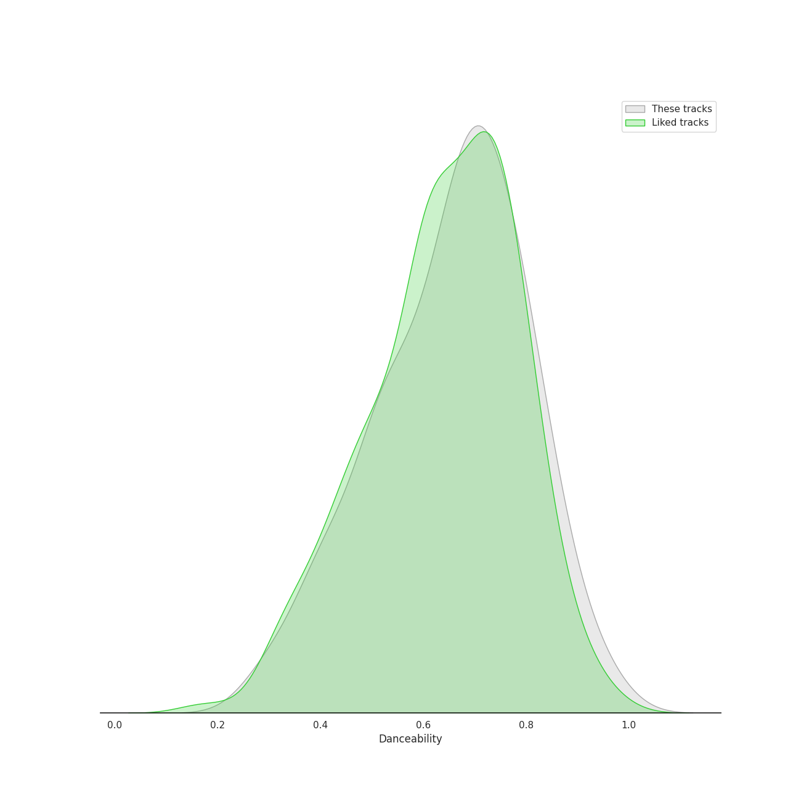
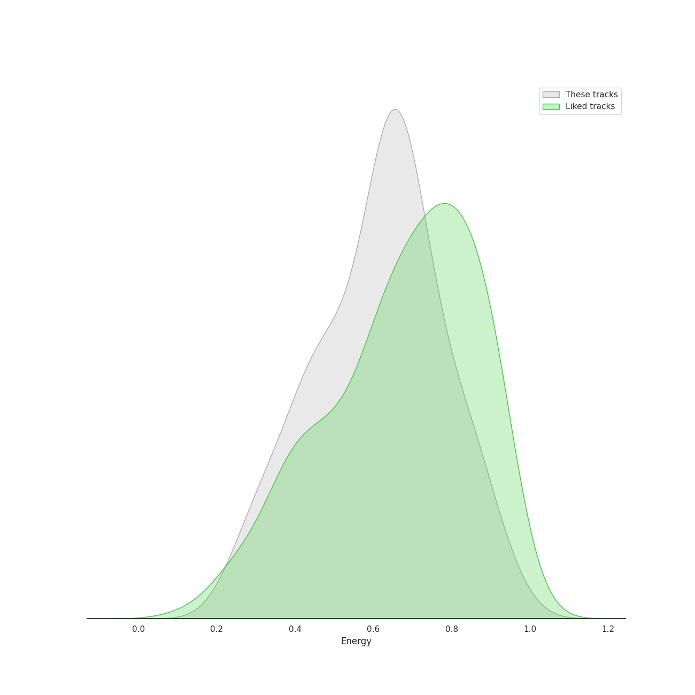
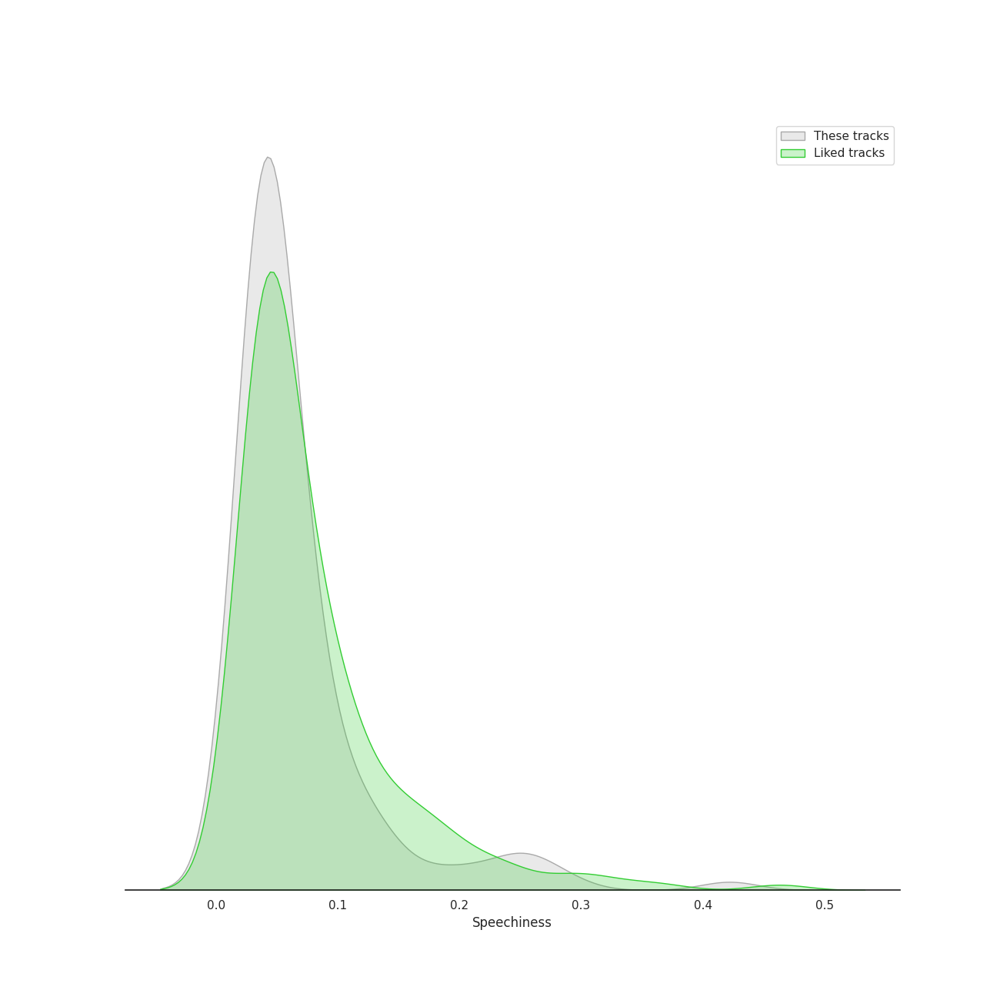
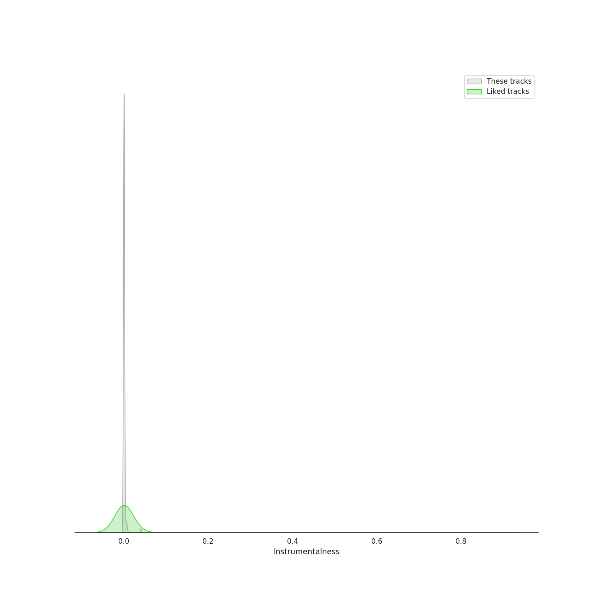
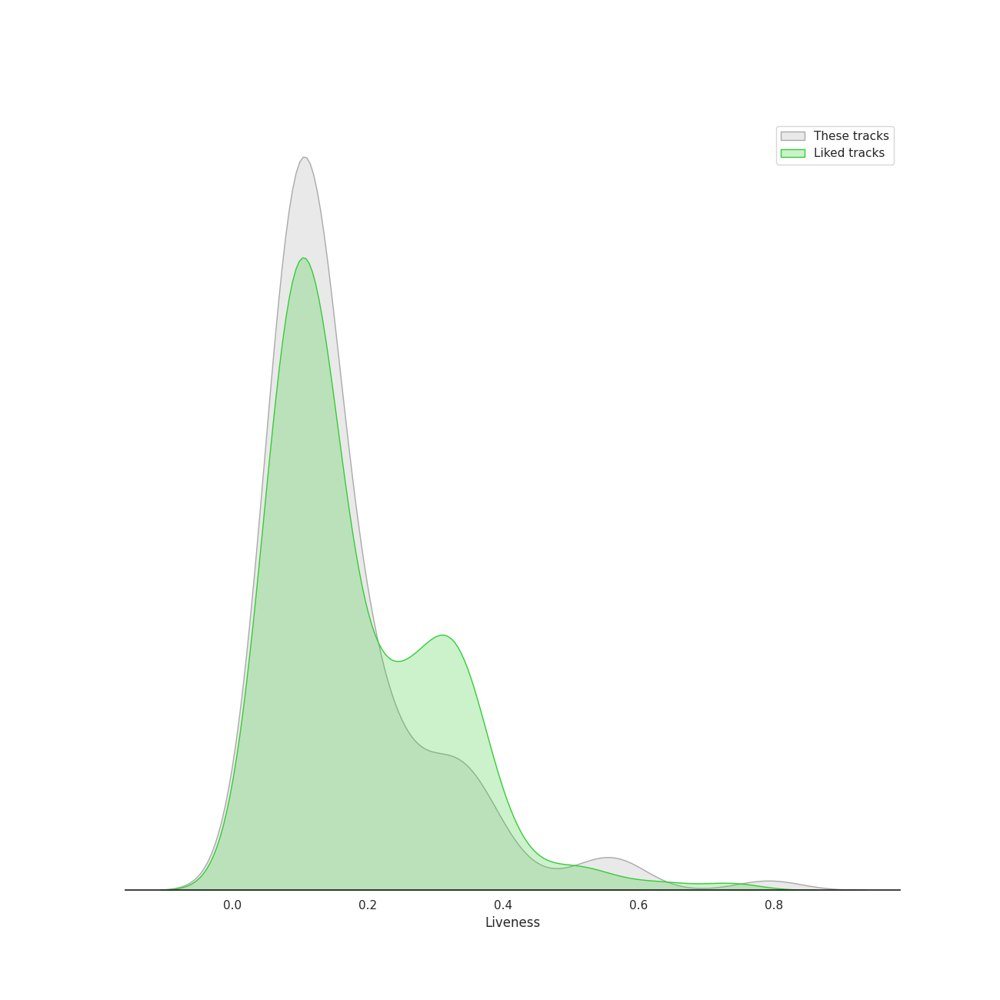
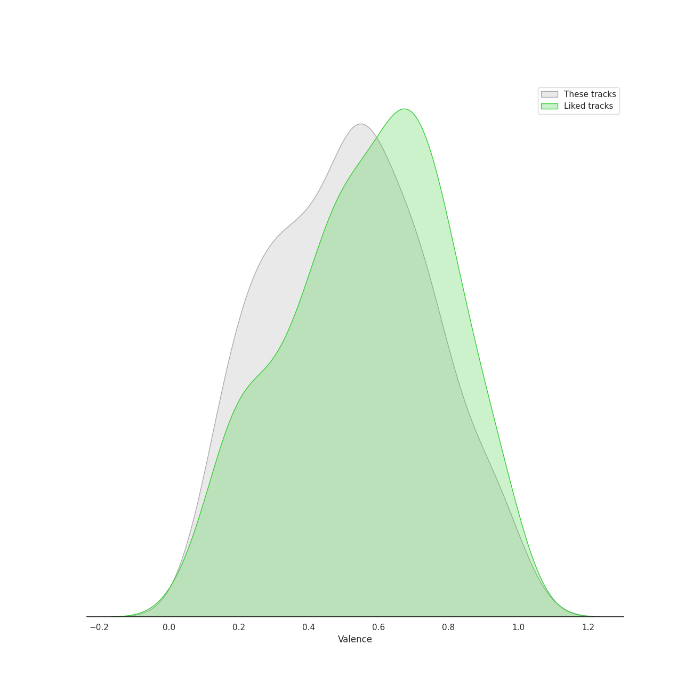
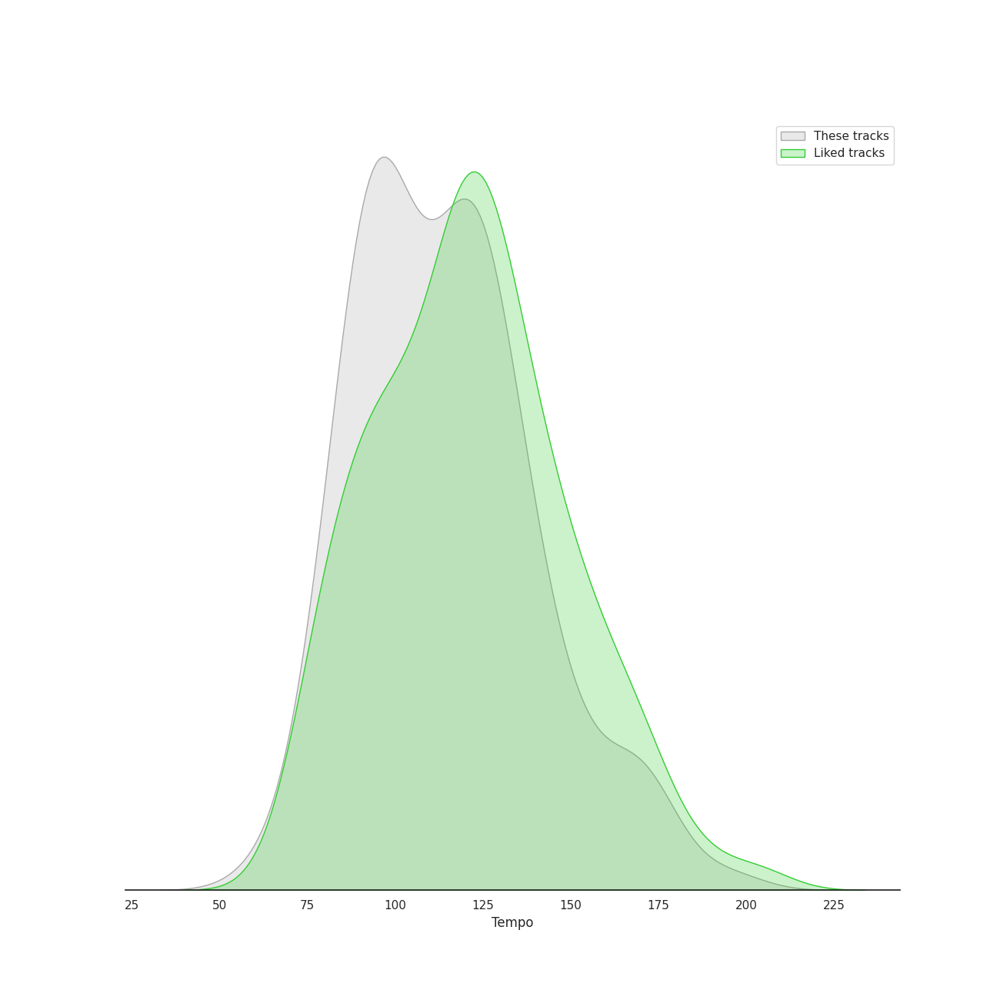

# Track Features for K-R&B

## Danceability

| ​ | 10 most Danceable tracks | ​​ | 10 least Danceable tracks |
|:---|:---|:---|:---|
|  | FACE (0.954) |  | U (0.301) |
|  | Villain (0.95) |  | Miracle (0.302) |
|  | Love Lee (0.914) |  | Sweet (0.302) |
|  | 1, 2, 3, 4 (0.905) |  | MY LOVE (0.375) |
|  | Cat (Feat. IU) (0.882) |  | Melted (0.384) |
|  | Love Theory (0.878) |  | Sorry (0.388) |
|  | Sour candy (0.871) |  | Get Ready To Leave (0.402) |
|  | Phase Me (0.857) |  | HOLO (0.406) |
|  | NOT SORRY (Feat. pH-1) (Prod. by Slom) (0.856) |  | sweet little kitty (0.416) |
|  | Don’t (0.85) |  | All I Got (0.417) |

## Energy

| ​ | 10 most Energetic tracks | ​​ | 10 least Energetic tracks |
|:---|:---|:---|:---|
|  | Poison (0.951) |  | How can I love the heartbreak, you're the one I love (0.248) |
|  | Red Lipstick (feat. Yoonmirae) (0.941) |  | BREATHE (0.251) |
|  | NEON (0.921) |  | Rain and You (0.275) |
|  | MY STAR (0.872) |  | Run With Me (0.295) |
|  | Jogging (0.872) |  | ONLY (0.296) |
|  | I will show you (0.872) |  | Wicked (0.32) |
|  | WAITING (0.871) |  | Natural (0.321) |
|  | Love is a magic (0.869) |  | MY LOVE (0.343) |
|  | Event Horizon (0.861) |  | Rose (0.352) |
|  | And July (0.852) |  | FACE (0.356) |

## Speechiness

| ​ | 10 most Speechy tracks | ​​ | 10 least Speechy tracks |
|:---|:---|:---|:---|
|  | I Don't Need You (0.422) |  | Radio (0.0255) |
|  | MOMMAE (0.287) |  | Slightly Tipsy (She is My Type♡ X SANDEUL) (0.0264) |
|  | All I Wanna Do (0.267) |  | She′s In The Rain (0.0264) |
|  | Boat (0.252) |  | Rain and You (0.027) |
|  | NOT SORRY (Feat. pH-1) (Prod. by Slom) (0.25) |  | Wicked (0.0273) |
|  | GANADARA (Feat. IU) (0.244) |  | Summer (0.0283) |
|  | Summer Is for Falling in Love (0.218) |  | HOLO (0.0295) |
|  | Your Existence (0.204) |  | When Night Is Falling (0.0307) |
|  | Whale (0.181) |  | Phase Me (0.0309) |
|  | FXXK WIT US (0.163) |  | Melted (0.0311) |

## Acousticness

| ​ | 10 most Acoustic tracks | ​​ | 10 least Acoustic tracks |
|:---|:---|:---|:---|
|  | How can I love the heartbreak, you're the one I love (0.91) |  | Poison (0.00063) |
|  | ONLY (0.892) |  | Headlock (0.000953) |
|  | Run With Me (0.868) |  | sweet little kitty (0.00196) |
|  | MY LOVE (0.859) |  | WAITING (0.00213) |
|  | In The Fall (0.854) |  | MRCH Mood (0.00316) |
|  | Amusement Park (0.85) |  | Radio (0.0226) |
|  | Miracle (0.846) |  | FXXK WIT US (0.0293) |
|  | Natural (0.841) |  | Sour (0.0334) |
|  | U (0.834) |  | BABY (0.0337) |
|  | Melted (0.832) |  | And July (0.0401) |

## Instrumentalness

| ​ | 10 most Instrumental tracks | ​​ | 10 least Instrumental tracks |
|:---|:---|:---|:---|
|  | Poison (0.0396) |  | Miracle (0.0) |
|  | VingleVingle (Prod. R.Tee) (0.00676) |  | Traffic light (0.0) |
|  | Summer (0.00485) |  | For You (0.0) |
|  | Radio (0.00449) |  | UN Village (0.0) |
|  | Whale (0.00351) |  | And July (0.0) |
|  | Can't Stop This Party (0.00125) |  | How People Move (0.0) |
|  | FREEDOM (0.000966) |  | Some (feat. Lil Boi) (0.0) |
|  | Way Back Home (0.000183) |  | NO ONE (0.0) |
|  | Phase Me (0.000135) |  | NO WAY (0.0) |
|  | Sour (8.35e-05) |  | sweet little kitty (0.0) |

## Liveness

| ​ | 10 most Live tracks | ​​ | 10 least Live tracks |
|:---|:---|:---|:---|
|  | Red Lipstick (feat. Yoonmirae) (0.792) |  | 1+1=0 (Feat. DEAN) (0.0372) |
|  | Rose (0.56) |  | It's Over (0.0471) |
|  | Boat (0.56) |  | How People Move (0.0511) |
|  | Headlock (0.507) |  | NOT SORRY (Feat. pH-1) (Prod. by Slom) (0.0512) |
|  | When It Snows mmm (feat. Wheein) (0.425) |  | Waterride (0.0512) |
|  | NEON (0.379) |  | D (Half Moon) (0.0573) |
|  | Shutdown (Feat.Seori) (0.377) |  | FACE (0.0581) |
|  | sweet little kitty (0.369) |  | NO ONE (0.0664) |
|  | Lyricist (0.352) |  | All I Got (0.0672) |
|  | HOLD MY HAND (0.351) |  | Traffic light (0.0694) |

## Valence

| ​ | 10 most Happy tracks | ​​ | 10 least Happy tracks |
|:---|:---|:---|:---|
|  | Sour candy (0.98) |  | In The Fall (0.12) |
|  | Some (feat. Lil Boi) (0.961) |  | U (0.137) |
|  | 1, 2, 3, 4 (0.955) |  | ONLY (0.151) |
|  | Jogging (0.937) |  | FREEDOM (0.152) |
|  | RE-BYE (0.924) |  | Run With Me (0.156) |
|  | Boat (0.922) |  | MY LOVE (0.158) |
|  | MY STAR (0.92) |  | Melted (0.169) |
|  | Waterride (0.908) |  | When it snows(Feat.Heize) (0.176) |
|  | Love Theory (0.888) |  | Summer (0.177) |
|  | How People Move (0.848) |  | NUMB (0.188) |

## Tempo

| ​ | 10 most Fast tracks | ​​ | 10 least Fast tracks |
|:---|:---|:---|:---|
|  | Sweet (195.738) |  | Bambi (61.45) |
|  | HOLO (179.914) |  | MISSING U (71.967) |
|  | Sorry (173.61) |  | Shutdown (Feat.Seori) (74.029) |
|  | D (Half Moon) (169.709) |  | Rose (74.703) |
|  | Miracle (168.222) |  | Summer Is for Falling in Love (75.279) |
|  | LULLABY (168.068) |  | FXXK WIT US (80.037) |
|  | Murder On The Dance Floor (167.88) |  | Written In The Stars (80.882) |
|  | NUMB (165.936) |  | Radio (80.992) |
|  | WAITING (158.179) |  | 봄인가 봐 Spring Love (82.861) |
|  | Sour (154.344) |  | sweet little kitty (82.944) |
