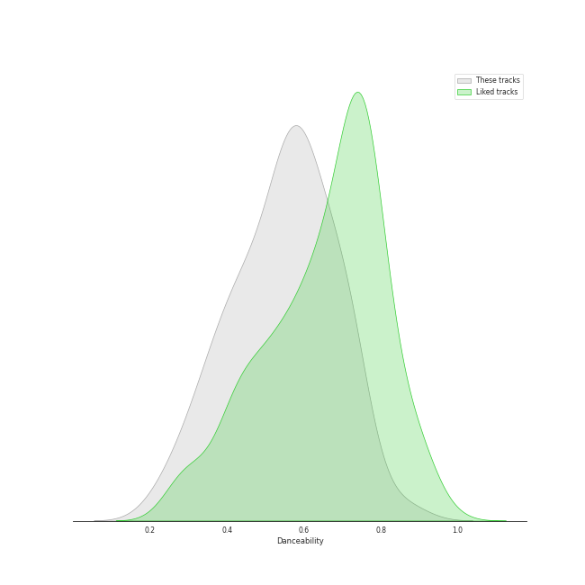
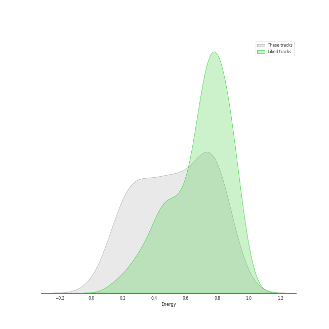
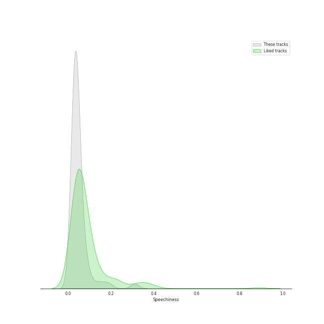
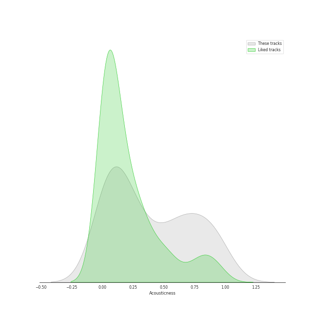
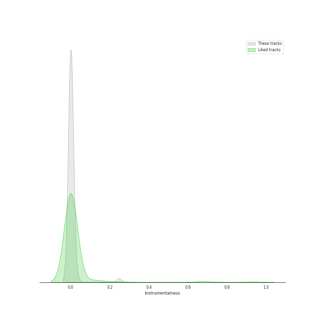
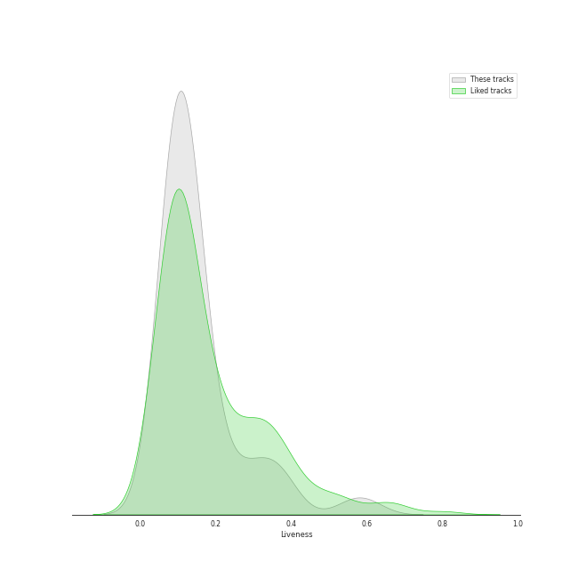
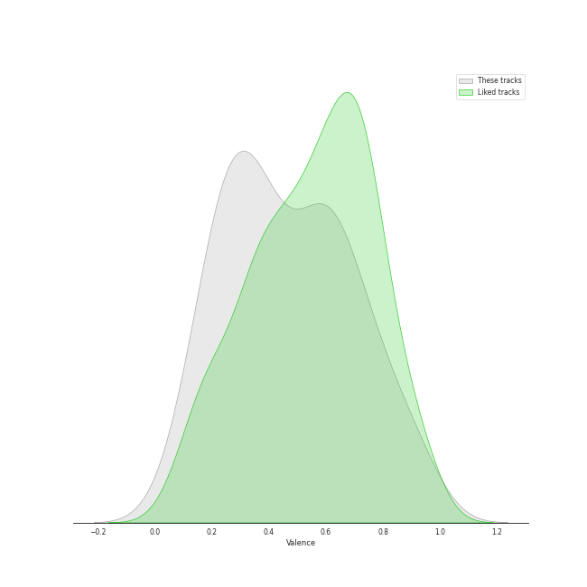
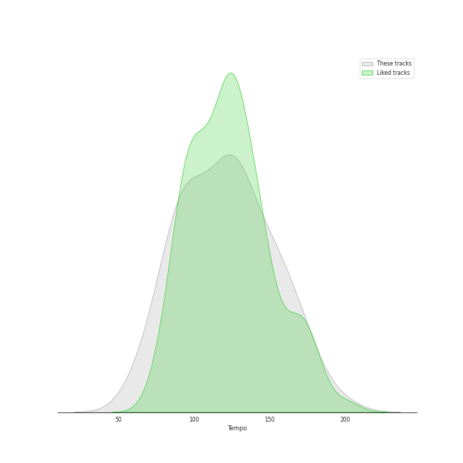

# Track Features for Karaoke

## Danceability

| ​ | 10 most Danceable tracks | ​​ | 10 least Danceable tracks |
|:---|:---|:---|:---|
|  | Somebody That I Used To Know (0.864) |  | Desperado - 2013 Remaster (0.228) |
|  | Sincerely, Jane (0.753) |  | Gravity (0.27) |
|  | I Choose You (0.731) |  | Poison & Wine (0.285) |
|  | Break My Heart (0.73) |  | Piano Man (0.331) |
|  | Rolling in the Deep (0.73) |  | Yesterday - Remastered 2009 (0.332) |
|  | This Love (0.712) |  | Mad World (0.344) |
|  | Death By A Thousand Cuts (0.712) |  | We All Need Saving (0.35) |
|  | Silver Lining (0.709) |  | Honeybee (0.352) |
|  | Disturbia (0.707) |  | Bohemian Rhapsody - Remastered 2011 (0.391) |
|  | Grenade (0.704) |  | Chandelier (0.399) |

## Energy

| ​ | 10 most Energetic tracks | ​​ | 10 least Energetic tracks |
|:---|:---|:---|:---|
|  | Everybody Talks (0.924) |  | Mad World (0.0585) |
|  | Movin' Out (Anthony's Song) (0.88) |  | Say Something (0.147) |
|  | Only the Good Die Young (0.872) |  | Golden Slumbers - Remastered 2009 (0.152) |
|  | This Love (0.862) |  | Manhattan (0.168) |
|  | The Middle (0.849) |  | Yesterday - Remastered 2009 (0.179) |
|  | Disturbia (0.814) |  | Honeybee (0.186) |
|  | Dog Days Are Over (0.81) |  | Poison & Wine (0.186) |
|  | Sweater Weather (0.807) |  | Desperado - 2013 Remaster (0.224) |
|  | Home (0.804) |  | Off My Face (0.228) |
|  | Chasing The Sun (0.794) |  | The Way You Look Tonight (0.24) |

## Speechiness

| ​ | 10 most Speechy tracks | ​​ | 10 least Speechy tracks |
|:---|:---|:---|:---|
|  | So Sick (0.311) |  | The Scientist (0.0243) |
|  | Don't Stop Me Now (0.192) |  | Old Fashioned (0.0246) |
|  | Only the Good Die Young (0.159) |  | Everything (0.0254) |
|  | Home (0.128) |  | Put A Little Love On Me (0.0262) |
|  | Love On Top (0.0886) |  | Machine Gun (0.0268) |
|  | Break My Heart (0.0884) |  | I Want It That Way (0.027) |
|  | Sincerely, Jane (0.0867) |  | Piano Man (0.0272) |
|  | Dog Days Are Over (0.0847) |  | Chasing Cars (0.0274) |
|  | Death By A Thousand Cuts (0.0629) |  | Golden Slumbers - Remastered 2009 (0.0277) |
|  | The Boxer (0.0615) |  | Goodbye Yellow Brick Road - Remastered 2014 (0.0279) |

## Acousticness

| ​ | 10 most Acoustic tracks | ​​ | 10 least Acoustic tracks |
|:---|:---|:---|:---|
|  | Mad World (0.976) |  | Everybody Talks (0.00301) |
|  | Manhattan (0.972) |  | If I Go (0.00959) |
|  | Desperado - 2013 Remaster (0.946) |  | Creep (0.0097) |
|  | When I Was Your Man (0.932) |  | Oh! Darling - Remastered 2009 (0.0126) |
|  | Off My Face (0.92) |  | Chandelier (0.0197) |
|  | Someone Like You (0.893) |  | Love Song (0.0208) |
|  | Yesterday - Remastered 2009 (0.879) |  | Come Together - Remastered 2009 (0.0304) |
|  | Honeybee (0.871) |  | Machine Gun (0.0365) |
|  | Say Something (0.857) |  | The Middle (0.0371) |
|  | Gravity (0.834) |  | Dog Days Are Over (0.0416) |

## Instrumentalness

| ​ | 10 most Instrumental tracks | ​​ | 10 least Instrumental tracks |
|:---|:---|:---|:---|
|  | Come Together - Remastered 2009 (0.247) |  | The Lighthouse's Tale (0.0) |
|  | Oh! Darling - Remastered 2009 (0.0288) |  | The Way You Look Tonight (0.0) |
|  | Sweater Weather (0.0177) |  | When I Was Your Man (0.0) |
|  | Dog Days Are Over (0.00379) |  | Take Me to Church (0.0) |
|  | Golden Slumbers - Remastered 2009 (0.0034) |  | I'm Yours (0.0) |
|  | Goodbye Yellow Brick Road - Remastered 2014 (0.00141) |  | Rolling in the Deep (0.0) |
|  | Don't Stop Me Now (0.00128) |  | YOUTH (0.0) |
|  | Sincerely, Jane (0.000649) |  | Put A Little Love On Me (0.0) |
|  | Manhattan (0.000585) |  | Only the Good Die Young (0.0) |
|  | Mad World (0.000362) |  | Love On Top (0.0) |

## Liveness

| ​ | 10 most Live tracks | ​​ | 10 least Live tracks |
|:---|:---|:---|:---|
|  | Love On Top (0.604) |  | Rolling in the Deep (0.0473) |
|  | Don't Stop Me Now (0.558) |  | Chasing The Sun (0.0497) |
|  | Home (0.393) |  | The Middle (0.058) |
|  | I Want You Back (0.37) |  | Movin' Out (Anthony's Song) (0.0591) |
|  | Old Fashioned (0.36) |  | Easy (0.0596) |
|  | Break My Heart (0.349) |  | The Lighthouse's Tale (0.0601) |
|  | Death By A Thousand Cuts (0.319) |  | Chandelier (0.0685) |
|  | Everybody Talks (0.313) |  | Vienna (0.0754) |
|  | Desperado - 2013 Remaster (0.273) |  | YOUTH (0.0777) |
|  | Oh! Darling - Remastered 2009 (0.268) |  | Fly Me To The Moon - 2008 Remastered (0.0797) |

## Valence

| ​ | 10 most Happy tracks | ​​ | 10 least Happy tracks |
|:---|:---|:---|:---|
|  | I Choose You (0.947) |  | Say Something (0.0765) |
|  | The Middle (0.903) |  | Creep (0.104) |
|  | Movin' Out (Anthony's Song) (0.895) |  | We All Need Saving (0.117) |
|  | I Want You Back (0.885) |  | Chasing Cars (0.144) |
|  | This Love (0.808) |  | Desperado - 2013 Remaster (0.18) |
|  | Haven't Met You Yet (0.796) |  | Come Together - Remastered 2009 (0.188) |
|  | Home (0.795) |  | Poison & Wine (0.203) |
|  | Only the Good Die Young (0.761) |  | The Scientist (0.213) |
|  | Somebody That I Used To Know (0.719) |  | Honeybee (0.216) |
|  | Disturbia (0.717) |  | Bohemian Rhapsody - Remastered 2011 (0.228) |

## Tempo

| ​ | 10 most Fast tracks | ​​ | 10 least Fast tracks |
|:---|:---|:---|:---|
|  | I Want You Back (196.606) |  | Desperado - 2013 Remaster (60.3) |
|  | Piano Man (177.734) |  | Moondance - 2013 Remaster (66.975) |
|  | Mad World (174.149) |  | When I Was Your Man (72.795) |
|  | Oh! Darling - Remastered 2009 (173.941) |  | We All Need Saving (74.717) |
|  | Gravity (168.964) |  | Only the Good Die Young (76.214) |
|  | Chasing The Sun (164.989) |  | Golden Slumbers - Remastered 2009 (80.591) |
|  | Come Together - Remastered 2009 (164.775) |  | Home (82.288) |
|  | The Middle (162.152) |  | Old Fashioned (85.043) |
|  | Don't Stop Me Now (156.435) |  | Honeybee (87.919) |
|  | Everybody Talks (154.962) |  | Manhattan (90.321) |
