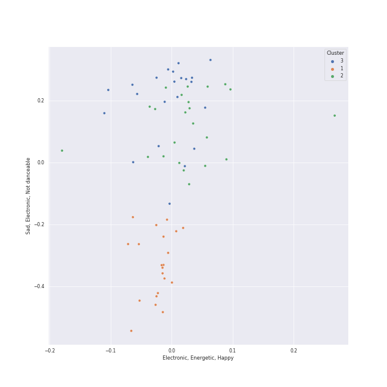

# Clusters in Karaoke

## Cluster #1

21 tracks

| Art | Track | Album | Artists | Label | Rank | 💚 | 🔗 |
|:---|:---|:---|:---|:---|---:|:---|:---|
|  | Gravity | Little Voice | [Sara Bareilles](../../../../artists/sara_bareilles/overview.md) | [Epic](../../../../labels/epic) | nan | 💚 | [🔗](https://open.spotify.com/track/4oa14QBfWRDfJy2agySy0L) |
|  | Manhattan | The Blessed Unrest | [Sara Bareilles](../../../../artists/sara_bareilles/overview.md) | [Epic](../../../../labels/epic) | 527 | 💚 | [🔗](https://open.spotify.com/track/0aSgzAUObtmSSwh1yO6shv) |
|  | Yesterday - Remastered 2009 | Help! (Remastered) | [The Beatles](../../../../artists/the_beatles/overview.md) | [EMI Catalogue](../../../../labels/emi_catalogue) | nan | 💚 | [🔗](https://open.spotify.com/track/3BQHpFgAp4l80e1XslIjNI) |
|  | When I Was Your Man | Unorthodox Jukebox | [Bruno Mars](../../../../artists/bruno_mars/overview.md) | [Atlantic Records](../../../../labels/atlantic_records) | 713 | 💚 | [🔗](https://open.spotify.com/track/0nJW01T7XtvILxQgC5J7Wh) |
|  | The Lighthouse's Tale | Nickel Creek | Nickel Creek | Sugar Hill Records | nan | 💚 | [🔗](https://open.spotify.com/track/05HjafWVI238CLw5RDNkas) |
|  | Vienna | The Stranger | [Billy Joel](../../../../artists/billy_joel/overview.md) | [Columbia](../../../../labels/columbia) | nan | 💚 | [🔗](https://open.spotify.com/track/7gREIuHognJFspylIDJ94p) |
|  | Someone Like You | 21 | [Adele](../../../../artists/adele/overview.md) | [XL Recordings](../../../../labels/xl_recordings) | nan | 💚 | [🔗](https://open.spotify.com/track/1zwMYTA5nlNjZxYrvBB2pV) |
|  | The Scientist | A Rush of Blood to the Head | [Coldplay](../../../../artists/coldplay/overview.md) | Parlophone Records Limited | nan | 💚 | [🔗](https://open.spotify.com/track/75JFxkI2RXiU7L9VXzMkle) |
|  | Your Song | Elton John | Elton John | [UMC (Universal Music Catalogue)](../../../../labels/umc_(universal_music_catalogue)) | 295 | 💚 | [🔗](https://open.spotify.com/track/38zsOOcu31XbbYj9BIPUF1) |
|  | Honeybee | The 2¢ Show | Steam Powered Giraffe | Steam Powered Giraffe | 382 | 💚 | [🔗](https://open.spotify.com/track/3MZjOGeXhpHbQ9ESMNFFnH) |
## Cluster #2

23 tracks

| Art | Track | Album | Artists | Label | Rank | 💚 | 🔗 |
|:---|:---|:---|:---|:---|---:|:---|:---|
|  | Grenade | Doo-Wops & Hooligans | [Bruno Mars](../../../../artists/bruno_mars/overview.md) | [Atlantic Records](../../../../labels/atlantic_records) | nan | 💚 | [🔗](https://open.spotify.com/track/2tJulUYLDKOg9XrtVkMgcJ) |
|  | Sincerely, Jane | Metropolis: The Chase Suite (Special Edition) | [Janelle Monáe](../../../../artists/janelle_monáe/overview.md) | [Bad Boy Records](../../../../labels/bad_boy) | 546 | 💚 | [🔗](https://open.spotify.com/track/06I6iDFVtZDGcRu9BgHraA) |
|  | Viva La Vida | Viva La Vida or Death and All His Friends | [Coldplay](../../../../artists/coldplay/overview.md) | [Parlophone UK](../../../../labels/parlophone_uk) | nan | 💚 | [🔗](https://open.spotify.com/track/1mea3bSkSGXuIRvnydlB5b) |
|  | Fly Me To The Moon - 2008 Remastered | Nothing But The Best (2008 Remastered) | [Frank Sinatra](../../../../artists/frank_sinatra/overview.md), Count Basie | FRANK SINATRA DIGITAL REPRISE | nan | | [🔗](https://open.spotify.com/track/7FXj7Qg3YorUxdrzvrcY25) |
|  | Dog Days Are Over | Lungs (Deluxe Edition) | [Florence + The Machine](../../../../artists/florence_+_the_machine/overview.md) | [Universal-Island Records Ltd.](../../../../labels/universal-island_records_ltd_) | nan | 💚 | [🔗](https://open.spotify.com/track/1YLJVmuzeM2YSUkCCaTNUB) |
|  | Easy | Commodores | Commodores | [Motown](../../../../labels/motown) | nan | 💚 | [🔗](https://open.spotify.com/track/1JQ6Xm1JrvHfvAqhl5pwaA) |
|  | Goodbye Yellow Brick Road - Remastered 2014 | Goodbye Yellow Brick Road (Remastered) | Elton John | [UMC (Universal Music Catalogue)](../../../../labels/umc_(universal_music_catalogue)) | nan | 💚 | [🔗](https://open.spotify.com/track/4IRHwIZHzlHT1FQpRa5RdE) |
|  | Sweater Weather | I Love You. | The Neighbourhood | [Columbia](../../../../labels/columbia) | nan | 💚 | [🔗](https://open.spotify.com/track/2QjOHCTQ1Jl3zawyYOpxh6) |
|  | I Want It That Way | Millennium | Backstreet Boys | [Jive](../../../../labels/jive) | nan | 💚 | [🔗](https://open.spotify.com/track/47BBI51FKFwOMlIiX6m8ya) |
|  | Chasing Cars | Eyes Open | Snow Patrol | [Polydor Records](../../../../labels/polydor_records) | nan | | [🔗](https://open.spotify.com/track/5hnyJvgoWiQUYZttV4wXy6) |
## Cluster #3

22 tracks

| Art | Track | Album | Artists | Label | Rank | 💚 | 🔗 |
|:---|:---|:---|:---|:---|---:|:---|:---|
|  | Machine Gun | Kaleidoscope Heart | [Sara Bareilles](../../../../artists/sara_bareilles/overview.md) | [Epic](../../../../labels/epic) | 417 | 💚 | [🔗](https://open.spotify.com/track/2ZfnsQ81jNuY4MHAshnxyp) |
|  | Love Song | Little Voice | [Sara Bareilles](../../../../artists/sara_bareilles/overview.md) | [Epic](../../../../labels/epic) | nan | 💚 | [🔗](https://open.spotify.com/track/4E6cwWJWZw2zWf7VFbH7wf) |
|  | Chasing The Sun | The Blessed Unrest | [Sara Bareilles](../../../../artists/sara_bareilles/overview.md) | [Epic](../../../../labels/epic) | nan | 💚 | [🔗](https://open.spotify.com/track/6lzlRAp5VqLLF78PwnfHjq) |
|  | Only the Good Die Young | The Stranger | [Billy Joel](../../../../artists/billy_joel/overview.md) | [Columbia](../../../../labels/columbia) | nan | 💚 | [🔗](https://open.spotify.com/track/2xabqm0YNQCTcPteQjJ22K) |
|  | Disturbia | Good Girl Gone Bad: Reloaded | [Rihanna](../../../../artists/rihanna/overview.md) | [Def Jam Recordings](../../../../labels/def_jam_recordings) | nan | 💚 | [🔗](https://open.spotify.com/track/2VOomzT6VavJOGBeySqaMc) |
|  | Silver Lining | Under The Blacklight (Standard Version) | [Rilo Kiley](../../../../artists/rilo_kiley/overview.md) | [Warner Records](../../../../labels/warner_records) | 353 | 💚 | [🔗](https://open.spotify.com/track/0ieqq1wbtso2UjJWPqJ5Xc) |
|  | Haven't Met You Yet | Crazy Love | [Michael Bublé](../../../../artists/michael_bublé/overview.md) | [143](../../../../labels/143), [Reprise](../../../../labels/reprise) | nan | 💚 | [🔗](https://open.spotify.com/track/4fIWvT19w9PR0VVBuPYpWA) |
|  | YOUTH | Blue Neighbourhood (Deluxe) | Troye Sivan | EMI Recorded Music Australia Pty Ltd | nan | 💚 | [🔗](https://open.spotify.com/track/1cOyWWUr3oXJIxY0AjJEx9) |
|  | Everybody Talks | Picture Show | Neon Trees | Mercury Records | 584 | 💚 | [🔗](https://open.spotify.com/track/2iUmqdfGZcHIhS3b9E9EWq) |
|  | If I Go | Ella Eyre | Ella Eyre | [Virgin Records Ltd](../../../../labels/virgin_records) | nan | 💚 | [🔗](https://open.spotify.com/track/5JO7yGfeJKYjbOXRRdNk64) |