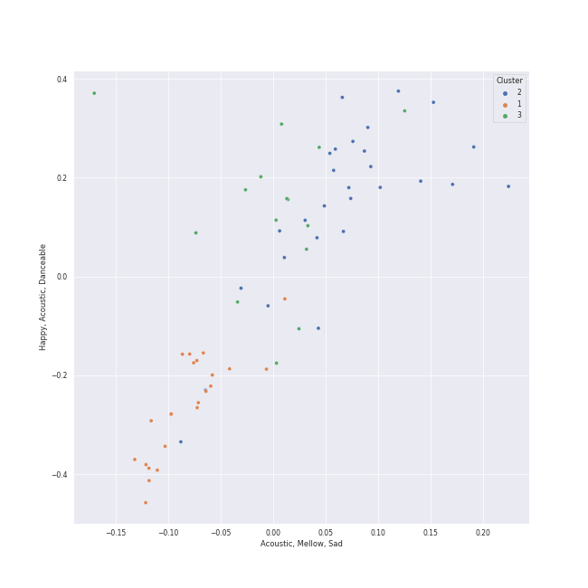

# Clusters in Karaoke

## Cluster #1

21 tracks

| Art | Track | Album | Artists | Label | 💚 | 🔗 |
|:---|:---|:---|:---|:---|:---|:---|
|  | Someone Like You | 21 | Adele | [XL Recordings](../../../../labels/xl_recordings) | | [🔗](https://open.spotify.com/track/1zwMYTA5nlNjZxYrvBB2pV) |
|  | Vienna | The Stranger | [Billy Joel](../../../../artists/billy_joel/overview.md) | [Columbia](../../../../labels/columbia) | 💚 | [🔗](https://open.spotify.com/track/7gREIuHognJFspylIDJ94p) |
|  | When I Was Your Man | Unorthodox Jukebox | [Bruno Mars](../../../../artists/bruno_mars/overview.md) | [Atlantic Records](../../../../labels/atlantic_records) | 💚 | [🔗](https://open.spotify.com/track/0nJW01T7XtvILxQgC5J7Wh) |
|  | The Scientist | A Rush of Blood to the Head | [Coldplay](../../../../artists/coldplay/overview.md) | Parlophone Records Limited | 💚 | [🔗](https://open.spotify.com/track/75JFxkI2RXiU7L9VXzMkle) |
|  | Your Song | Elton John | Elton John | [UMC (Universal Music Catalogue)](../../../../labels/umc__universal_music_catalogue_) | 💚 | [🔗](https://open.spotify.com/track/38zsOOcu31XbbYj9BIPUF1) |
|  | The Lighthouse's Tale | Nickel Creek | Nickel Creek | Sugar Hill Records | 💚 | [🔗](https://open.spotify.com/track/05HjafWVI238CLw5RDNkas) |
|  | Gravity | Little Voice | [Sara Bareilles](../../../../artists/sara_bareilles/overview.md) | [Epic](../../../../labels/epic) | 💚 | [🔗](https://open.spotify.com/track/4oa14QBfWRDfJy2agySy0L) |
|  | Manhattan | The Blessed Unrest | [Sara Bareilles](../../../../artists/sara_bareilles/overview.md) | [Epic](../../../../labels/epic) | 💚 | [🔗](https://open.spotify.com/track/0aSgzAUObtmSSwh1yO6shv) |
|  | Honeybee | The 2¢ Show | Steam Powered Giraffe | Steam Powered Giraffe | 💚 | [🔗](https://open.spotify.com/track/3MZjOGeXhpHbQ9ESMNFFnH) |
|  | Yesterday - Remastered 2009 | Help! (Remastered) | [The Beatles](../../../../artists/the_beatles/overview.md) | [EMI Catalogue](../../../../labels/emi_catalogue) | 💚 | [🔗](https://open.spotify.com/track/3BQHpFgAp4l80e1XslIjNI) |
## Cluster #2

16 tracks

| Art | Track | Album | Artists | Label | 💚 | 🔗 |
|:---|:---|:---|:---|:---|:---|:---|
|  | Only the Good Die Young | The Stranger | [Billy Joel](../../../../artists/billy_joel/overview.md) | [Columbia](../../../../labels/columbia) | 💚 | [🔗](https://open.spotify.com/track/2xabqm0YNQCTcPteQjJ22K) |
|  | Somebody That I Used To Know | Aussie Legends | Gotye, [Kimbra](../../../../artists/kimbra/overview.md) | UMG Recordings, Inc. | 💚 | [🔗](https://open.spotify.com/track/54ZV2zBKOn1EVDUs7Jvf2F) |
|  | I'm Yours | We Sing. We Dance. We Steal Things. | Jason Mraz | [Atlantic Records/ATG](../../../../labels/atlantic_records) | 💚 | [🔗](https://open.spotify.com/track/1EzrEOXmMH3G43AXT1y7pA) |
|  | Home | Carencro | Marc Broussard | Island Records | 💚 | [🔗](https://open.spotify.com/track/1XhzO8cuPaqsqUKw92Wbwc) |
|  | This Love | Songs About Jane | [Maroon 5](../../../../artists/maroon_5/overview.md) | [Interscope Records*](../../../../labels/interscope_records) | 💚 | [🔗](https://open.spotify.com/track/6YgV0EF8xJMZz0Zm6BTaT4) |
|  | Haven't Met You Yet | Crazy Love | [Michael Bublé](../../../../artists/michael_bubl_/overview.md) | [143](../../../../labels/143), [Reprise](../../../../labels/reprise) | 💚 | [🔗](https://open.spotify.com/track/4fIWvT19w9PR0VVBuPYpWA) |
|  | Everybody Talks | Picture Show | Neon Trees | Mercury Records | 💚 | [🔗](https://open.spotify.com/track/2iUmqdfGZcHIhS3b9E9EWq) |
|  | Disturbia | Good Girl Gone Bad: Reloaded | [Rihanna](../../../../artists/rihanna/overview.md) | [Def Jam Recordings](../../../../labels/def_jam_recordings) | 💚 | [🔗](https://open.spotify.com/track/2VOomzT6VavJOGBeySqaMc) |
|  | Silver Lining | Under The Blacklight (Standard Version) | [Rilo Kiley](../../../../artists/rilo_kiley/overview.md) | [Warner Records](../../../../labels/warner_records) | 💚 | [🔗](https://open.spotify.com/track/0ieqq1wbtso2UjJWPqJ5Xc) |
|  | I Want You Back | Diana Ross Presents The Jackson 5 | The Jackson 5 | [MOTOWN](../../../../labels/motown), [UNI](../../../../labels/uni) | 💚 | [🔗](https://open.spotify.com/track/5LxvwujISqiB8vpRYv887S) |
## Cluster #3

28 tracks

| Art | Track | Album | Artists | Label | 💚 | 🔗 |
|:---|:---|:---|:---|:---|:---|:---|
|  | I Want It That Way | Millennium | Backstreet Boys | [Jive](../../../../labels/jive) | 💚 | [🔗](https://open.spotify.com/track/47BBI51FKFwOMlIiX6m8ya) |
|  | Grenade | Doo-Wops & Hooligans | [Bruno Mars](../../../../artists/bruno_mars/overview.md) | [Atlantic Records](../../../../labels/atlantic_records) | 💚 | [🔗](https://open.spotify.com/track/2tJulUYLDKOg9XrtVkMgcJ) |
|  | Viva La Vida | Viva La Vida or Death and All His Friends | [Coldplay](../../../../artists/coldplay/overview.md) | Parlophone UK | 💚 | [🔗](https://open.spotify.com/track/1mea3bSkSGXuIRvnydlB5b) |
|  | Easy | Commodores | Commodores | [Motown](../../../../labels/motown) | 💚 | [🔗](https://open.spotify.com/track/1JQ6Xm1JrvHfvAqhl5pwaA) |
|  | If I Go | Ella Eyre | Ella Eyre | [Virgin Records Ltd](../../../../labels/virgin_records) | 💚 | [🔗](https://open.spotify.com/track/5JO7yGfeJKYjbOXRRdNk64) |
|  | Goodbye Yellow Brick Road - Remastered 2014 | Goodbye Yellow Brick Road (Remastered) | Elton John | [UMC (Universal Music Catalogue)](../../../../labels/umc__universal_music_catalogue_) | 💚 | [🔗](https://open.spotify.com/track/4IRHwIZHzlHT1FQpRa5RdE) |
|  | Dog Days Are Over | Lungs | [Florence + The Machine](../../../../artists/florence___the_machine/overview.md) | [Universal-Island Records Ltd.](../../../../labels/universal_island_records_ltd_) | 💚 | [🔗](https://open.spotify.com/track/416zj01H28D6uQP43LL6x3) |
|  | Love Song | Little Voice | [Sara Bareilles](../../../../artists/sara_bareilles/overview.md) | [Epic](../../../../labels/epic) | 💚 | [🔗](https://open.spotify.com/track/4E6cwWJWZw2zWf7VFbH7wf) |
|  | Chandelier | 1000 Forms Of Fear (Deluxe Version) | [Sia](../../../../artists/sia/overview.md) | [Monkey Puzzle Records/RCA Records](../../../../labels/rca_records_label) | 💚 | [🔗](https://open.spotify.com/track/2s1sdSqGcKxpPr5lCl7jAV) |
|  | Sweater Weather | I Love You. | The Neighbourhood | [Columbia](../../../../labels/columbia) | 💚 | [🔗](https://open.spotify.com/track/2QjOHCTQ1Jl3zawyYOpxh6) |