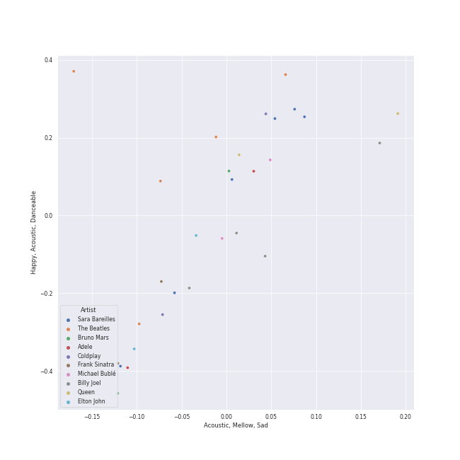
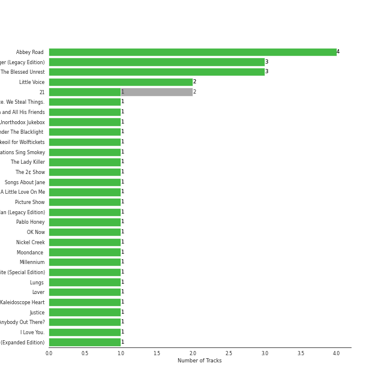
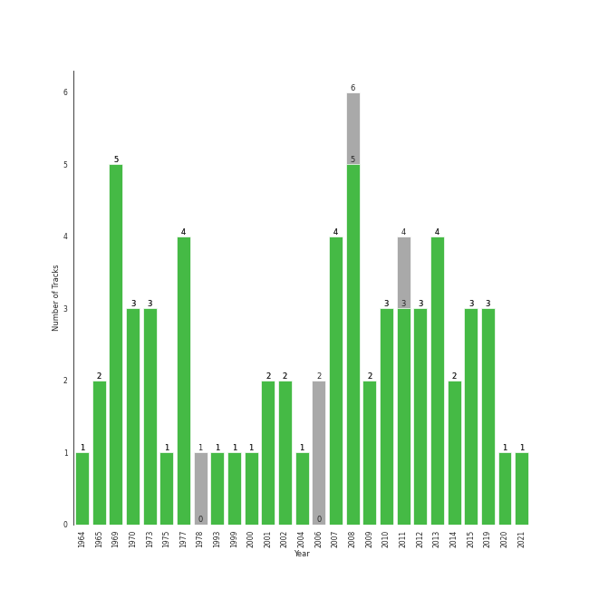

# Karaoke

[64 songs](tracks.md)

## Top Artists

See all 49 artists

| Number of Tracks | Art | Artist | 🔗 |
|---:|:---|:---|:---|
| 6 |  | [Sara Bareilles](../../artists/sara_bareilles.md) | [🔗](https://open.spotify.com/artist/2Sqr0DXoaYABbjBo9HaMkM) |
| 5 |  | [The Beatles](../../artists/the_beatles.md) | [🔗](https://open.spotify.com/artist/3WrFJ7ztbogyGnTHbHJFl2) |
| 4 |  | [Billy Joel](../../artists/billy_joel.md) | [🔗](https://open.spotify.com/artist/6zFYqv1mOsgBRQbae3JJ9e) |
| 2 |  | Coldplay | [🔗](https://open.spotify.com/artist/4gzpq5DPGxSnKTe4SA8HAU) |
| 2 |  | Adele | [🔗](https://open.spotify.com/artist/4dpARuHxo51G3z768sgnrY) |
| 2 |  | Elton John | [🔗](https://open.spotify.com/artist/3PhoLpVuITZKcymswpck5b) |
| 2 |  | [Queen](../../artists/queen.md) | [🔗](https://open.spotify.com/artist/1dfeR4HaWDbWqFHLkxsg1d) |
| 2 |  | Frank Sinatra | [🔗](https://open.spotify.com/artist/1Mxqyy3pSjf8kZZL4QVxS0) |
| 2 |  | [Michael Bublé](../../artists/michael_bubl_.md) | [🔗](https://open.spotify.com/artist/1GxkXlMwML1oSg5eLPiAz3) |
| 2 |  | [Bruno Mars](../../artists/bruno_mars.md) | [🔗](https://open.spotify.com/artist/0du5cEVh5yTK9QJze8zA0C) |
| 1 |  | The Neighbourhood | [🔗](https://open.spotify.com/artist/77SW9BnxLY8rJ0RciFqkHh) |
| 1 |  | Simon & Garfunkel | [🔗](https://open.spotify.com/artist/70cRZdQywnSFp9pnc2WTCE) |
| 1 |  | Jon McLaughlin | [🔗](https://open.spotify.com/artist/6z29S0IoiBJpSMP8plyCj7) |
| 1 |  | [Beyoncé](../../artists/beyonc_.md) | [🔗](https://open.spotify.com/artist/6vWDO969PvNqNYHIOW5v0m) |
| 1 |  | Janelle Monáe | [🔗](https://open.spotify.com/artist/6ueGR6SWhUJfvEhqkvMsVs) |
| 1 |  | Commodores | [🔗](https://open.spotify.com/artist/6twIAGnYuIT1pncMAsXnEm) |
| 1 |  | [Kimbra](../../artists/kimbra.md) | [🔗](https://open.spotify.com/artist/6hk7Yq1DU9QcCCrz9uc0Ti) |
| 1 |  | [Dua Lipa](../../artists/dua_lipa.md) | [🔗](https://open.spotify.com/artist/6M2wZ9GZgrQXHCFfjv46we) |
| 1 |  | The Civil Wars | [🔗](https://open.spotify.com/artist/6J7rw7NELJUCThPbAfyLIE) |
| 1 |  | Ella Eyre | [🔗](https://open.spotify.com/artist/66TrUkUZ3RM29dqeDQRgyA) |
| 1 |  | A Great Big World | [🔗](https://open.spotify.com/artist/5xKp3UyavIBUsGy3DQdXeF) |
| 1 |  | Backstreet Boys | [🔗](https://open.spotify.com/artist/5rSXSAkZ67PYJSvpUpkOr7) |
| 1 |  | [Rihanna](../../artists/rihanna.md) | [🔗](https://open.spotify.com/artist/5pKCCKE2ajJHZ9KAiaK11H) |
| 1 |  | Gary Jules | [🔗](https://open.spotify.com/artist/5oRnbmgqvvq7fVlgk4vcEa) |
| 1 |  | CeeLo Green | [🔗](https://open.spotify.com/artist/5nLYd9ST4Cnwy6NHaCxbj8) |
| 1 |  | Sia | [🔗](https://open.spotify.com/artist/5WUlDfRSoLAfcVSX1WnrxN) |
| 1 |  | Jason Mraz | [🔗](https://open.spotify.com/artist/4phGZZrJZRo4ElhRtViYdl) |
| 1 |  | Marc Broussard | [🔗](https://open.spotify.com/artist/4cEwEednPwWCdYT7ZhROZe) |
| 1 |  | [Radiohead](../../artists/radiohead.md) | [🔗](https://open.spotify.com/artist/4Z8W4fKeB5YxbusRsdQVPb) |
| 1 |  | Van Morrison | [🔗](https://open.spotify.com/artist/44NX2ffIYHr6D4n7RaZF7A) |
| 1 |  | Snow Patrol | [🔗](https://open.spotify.com/artist/3rIZMv9rysU7JkLzEaC5Jp) |
| 1 |  | Nickel Creek | [🔗](https://open.spotify.com/artist/3bcLBxvaI7GsBzGp3WHnwQ) |
| 1 |  | Troye Sivan | [🔗](https://open.spotify.com/artist/3WGpXCj9YhhfX11TToZcXP) |
| 1 |  | The Temptations | [🔗](https://open.spotify.com/artist/3RwQ26hR2tJtA8F9p2n7jG) |
| 1 |  | Count Basie | [🔗](https://open.spotify.com/artist/2jFZlvIea42ZvcCw4OeEdA) |
| 1 |  | The Jackson 5 | [🔗](https://open.spotify.com/artist/2iE18Oxc8YSumAU232n4rW) |
| 1 |  | Rilo Kiley | [🔗](https://open.spotify.com/artist/2cevwbv7ISD92VMNLYLHZA) |
| 1 |  | Hozier | [🔗](https://open.spotify.com/artist/2FXC3k01G6Gw61bmprjgqS) |
| 1 |  | Gotye | [🔗](https://open.spotify.com/artist/2AsusXITU8P25dlRNhcAbG) |
| 1 |  | Ne-Yo | [🔗](https://open.spotify.com/artist/21E3waRsmPlU7jZsS13rcj) |
| 1 |  | Steam Powered Giraffe | [🔗](https://open.spotify.com/artist/1yqs45BSh7457Flyhmdv7f) |
| 1 |  | Justin Bieber | [🔗](https://open.spotify.com/artist/1uNFoZAHBGtllmzznpCI3s) |
| 1 |  | [Florence + The Machine](../../artists/florence___the_machine.md) | [🔗](https://open.spotify.com/artist/1moxjboGR7GNWYIMWsRjgG) |
| 1 |  | Christina Aguilera | [🔗](https://open.spotify.com/artist/1l7ZsJRRS8wlW3WfJfPfNS) |
| 1 |  | Neon Trees | [🔗](https://open.spotify.com/artist/0RpddSzUHfncUWNJXKOsjy) |
| 1 |  | Michael Andrews | [🔗](https://open.spotify.com/artist/0RkqytrwoGyXGvDiZwT6i2) |
| 1 |  | Eagles | [🔗](https://open.spotify.com/artist/0ECwFtbIWEVNwjlrfc6xoL) |
| 1 |  | [Taylor Swift](../../artists/taylor_swift.md) | [🔗](https://open.spotify.com/artist/06HL4z0CvFAxyc27GXpf02) |
| 1 |  | Maroon 5 | [🔗](https://open.spotify.com/artist/04gDigrS5kc9YWfZHwBETP) |

## Top Albums

See all 55 albums

| Number of Tracks | Art | Album | Release Date | 🔗 |
|---:|:---|:---|:---|:---|
| 4 |  | Abbey Road (Remastered) | 1969-09-26 | [🔗](https://open.spotify.com/album/0ETFjACtuP2ADo6LFhL6HN) |
| 3 |  | The Stranger | 1977-09-29 | [🔗](https://open.spotify.com/album/3IILMjMMnoN2sKzgesX8KV) |
| 3 |  | The Blessed Unrest | 2013-07-16 | [🔗](https://open.spotify.com/album/7lpbyGc4fHsQkBTsfWVBhp) |
| 2 |  | Little Voice | 2007-07-03 | [🔗](https://open.spotify.com/album/2Z9WUERfMjOgQ6ze9TcGbF) |
| 2 |  | 21 | 2011-01-24 | [🔗](https://open.spotify.com/album/0Lg1uZvI312TPqxNWShFXL) |
| 1 |  | We Sing. We Dance. We Steal Things. | 2008-05-12 | [🔗](https://open.spotify.com/album/04G0YylSjvDQZrjOfE5jA5) |
| 1 |  | Viva La Vida or Death and All His Friends | 2008-05-26 | [🔗](https://open.spotify.com/album/1CEODgTmTwLyabvwd7HBty) |
| 1 |  | Unorthodox Jukebox | 2012-12-07 | [🔗](https://open.spotify.com/album/58ufpQsJ1DS5kq4hhzQDiI) |
| 1 |  | Under The Blacklight (Standard Version) | 2007-08-20 | [🔗](https://open.spotify.com/album/2f9RsTZpsYMLRVZBtW7En8) |
| 1 |  | Trading Snakeoil for Wolftickets | 2001-01-01 | [🔗](https://open.spotify.com/album/1OydCrx4m7fguwcX4stR9z) |
| 1 |  | The Temptations Sing Smokey | 1965-03-22 | [🔗](https://open.spotify.com/album/45tweuKI0zdh8zgKo05cTw) |
| 1 |  | The Lady Killer | 2010-11-09 | [🔗](https://open.spotify.com/album/3MXU6UoWrf4w4bOvjZTlvY) |
| 1 |  | The 2¢ Show | 2012-05-23 | [🔗](https://open.spotify.com/album/4DECRyKlhKJgjZLLuvfAI6) |
| 1 |  | Songs About Jane: 10th Anniversary Edition | 2002 | [🔗](https://open.spotify.com/album/5zClcGCSWj926AMjvBNSLc) |
| 1 |  | Picture Show | 2012-01-01 | [🔗](https://open.spotify.com/album/0uRFz92JmjwDbZbB7hEBIr) |
| 1 |  | Piano Man | 1973-11-09 | [🔗](https://open.spotify.com/album/77ErLrVvYETIlQJHAwhfIH) |
| 1 |  | Pablo Honey | 1993-02-22 | [🔗](https://open.spotify.com/album/3gBVdu4a1MMJVMy6vwPEb8) |
| 1 |  | OK Now | 2008-01-01 | [🔗](https://open.spotify.com/album/3fKJJQFV6a61fnKYDDj2LU) |
| 1 |  | Nothing But The Best (Remastered) | 2008-01-01 | [🔗](https://open.spotify.com/album/3i67sGIVw8EBlgfSRv3Lj2) |
| 1 |  | Nickel Creek | 2000 | [🔗](https://open.spotify.com/album/5SGG7graQOU3OnK3cZZCNd) |
| 1 |  | Moondance (Deluxe Edition) | 1970-02 | [🔗](https://open.spotify.com/album/7diHYi0CglGJekoM3KaWBK) |
| 1 |  | Millennium | 1999-05-18 | [🔗](https://open.spotify.com/album/5ySxm9hxBNss01WCL7GLyQ) |
| 1 |  | Metropolis: The Chase Suite (Special Edition) | 2008-08-12 | [🔗](https://open.spotify.com/album/3T3bJi3cvwR5U7ihwgEwF1) |
| 1 |  | Lungs | 2009-01-01 | [🔗](https://open.spotify.com/album/2KAK58PimXHF4lSoKO3RxA) |
| 1 |  | Lover | 2019-08-23 | [🔗](https://open.spotify.com/album/1NAmidJlEaVgA3MpcPFYGq) |
| 1 |  | Kaleidoscope Heart | 2010-09-07 | [🔗](https://open.spotify.com/album/627ukPRwYxyBREHxBq0vGJ) |
| 1 |  | Justice | 2021-03-19 | [🔗](https://open.spotify.com/album/5dGWwsZ9iB2Xc3UKR0gif2) |
| 1 |  | Jazz | 1978-11-10 | [🔗](https://open.spotify.com/album/5X3rA8To5GDOeIWdQyMEcE) |
| 1 |  | Is There Anybody Out There? | 2014-01-20 | [🔗](https://open.spotify.com/album/1yOcLa4euMk9sV7rRJ89Dl) |
| 1 |  | In My Own Words | 2006-01-01 | [🔗](https://open.spotify.com/album/6gkwOLmk0ALMOjWs5WhAEr) |
| 1 |  | I Love You. | 2013-04-19 | [🔗](https://open.spotify.com/album/4xkM0BwLM9H2IUcbYzpcBI) |
| 1 |  | Hozier (Expanded Edition) | 2014-09-19 | [🔗](https://open.spotify.com/album/4Pv7m8D82A1Xun7xNCKZjJ) |
| 1 |  | Help! (Remastered) | 1965-08-06 | [🔗](https://open.spotify.com/album/0PT5m6hwPRrpBwIHVnvbFX) |
| 1 |  | Goodbye Yellow Brick Road (Remastered) | 1973-10-05 | [🔗](https://open.spotify.com/album/5WupqgR68HfuHt3BMJtgun) |
| 1 |  | Good Girl Gone Bad: Reloaded | 2008-06-02 | [🔗](https://open.spotify.com/album/3JSWZWeTHF4HDGt5Eozdy7) |
| 1 |  | Future Nostalgia | 2020-03-27 | [🔗](https://open.spotify.com/album/5lKlFlReHOLShQKyRv6AL9) |
| 1 |  | Eyes Open | 2006-01-01 | [🔗](https://open.spotify.com/album/3k7bXPw2u0C0SBKPMsgMS3) |
| 1 |  | Elton John | 1970-04-10 | [🔗](https://open.spotify.com/album/69P9Ro0W286yLFgYwrGVN0) |
| 1 |  | Ella Eyre | 2015-01-12 | [🔗](https://open.spotify.com/album/5J69OYtRXeI9dHDK2R95h5) |
| 1 |  | Doo-Wops & Hooligans | 2010-10-05 | [🔗](https://open.spotify.com/album/1uyf3l2d4XYwiEqAb7t7fX) |
| 1 |  | Diana Ross Presents The Jackson 5 | 1969-12-18 | [🔗](https://open.spotify.com/album/51uoKRa8vT5SULrlF8s2t1) |
| 1 |  | Desperado (2013 Remaster) | 1973 | [🔗](https://open.spotify.com/album/09WBxbis5Sixt01FVMs8UM) |
| 1 |  | Days Of Wine And Roses, Moon River And Other Academy Award Winners | 1964 | [🔗](https://open.spotify.com/album/7FAo3wmrJNNzz2W5Z5ZG80) |
| 1 |  | Crazy Love | 2009-10-06 | [🔗](https://open.spotify.com/album/3MXDonOIzrIrCh0HvlACyj) |
| 1 |  | Commodores | 1977-01-01 | [🔗](https://open.spotify.com/album/2tzbNCAUTmW4MIM2Ulvrwl) |
| 1 |  | Carencro | 2004-08-03 | [🔗](https://open.spotify.com/album/15dP7BadtY55t9VvFlVrBA) |
| 1 |  | Call Me Irresponsible | 2007-04-30 | [🔗](https://open.spotify.com/album/3h4pyWRJIB9ZyRKXChbX22) |
| 1 |  | Bridge Over Troubled Water | 1970-01-26 | [🔗](https://open.spotify.com/album/0JwHz5SSvpYWuuCNbtYZoV) |
| 1 |  | Blue Neighbourhood (Deluxe) | 2015-12-04 | [🔗](https://open.spotify.com/album/5ouTDazE4LF9bVJPx1nlgW) |
| 1 |  | Barton Hollow | 2011-02-01 | [🔗](https://open.spotify.com/album/4uWgDFxGAp7XlVSHuVBv4E) |
| 1 |  | Aussie Legends | 2019-11-22 | [🔗](https://open.spotify.com/album/3IGRFGa4ErR0CU8aMMrRql) |
| 1 |  | A Rush of Blood to the Head | 2002-08-08 | [🔗](https://open.spotify.com/album/0RHX9XECH8IVI3LNgWDpmQ) |
| 1 |  | A Night At The Opera | 1975-11-21 | [🔗](https://open.spotify.com/album/3KCJzwKOdBxDu6TKaFPqM9) |
| 1 |  | 4 | 2011-06-24 | [🔗](https://open.spotify.com/album/1gIC63gC3B7o7FfpPACZQJ) |
| 1 |  | 1000 Forms Of Fear (Deluxe Version) | 2015-05-04 | [🔗](https://open.spotify.com/album/6FdNvoO5sF4EKwCX9je1MH) |

## Top Record Labels

See all 42 labels

| Number of Tracks | Label |
|---:|:---|
| 8 | [Columbia](../../labels/columbia.md) |
| 7 | [Epic](../../labels/epic.md) |
| 5 | [EMI Catalogue](../../labels/emi_catalogue.md) |
| 3 | [XL Recordings](../../labels/xl_recordings.md) |
| 3 | [Warner Records](../../labels/warner_records.md) |
| 3 | [MOTOWN](../../labels/motown.md) |
| 3 | [Atlantic Records](../../labels/atlantic_records.md) |
| 2 | UNI |
| 2 | [UMC (Universal Music Catalogue)](../../labels/umc__universal_music_catalogue_.md) |
| 2 | [Reprise](../../labels/reprise.md) |
| 2 | [Hollywood Records](../../labels/hollywood_records.md) |
| 2 | FRANK SINATRA DIGITAL REPRISE |
| 2 | Elektra |
| 2 | [143](../../labels/143.md) |
| 1 | sensibility recordings |
| 1 | [Virgin Records](../../labels/virgin_records.md) |
| 1 | [Universal-Island Records Ltd.](../../labels/universal_island_records_ltd_.md) |
| 1 | UMG Recordings |
| 1 | [Taylor Swift](../../labels/taylor_swift.md) |
| 1 | Sugar Hill Records |
| 1 | Steam Powered Giraffe |
| 1 | [Rhino](../../labels/rhino.md) |
| 1 | Radiculture |
| 1 | [RCA Records Label](../../labels/rca_records_label.md) |
| 1 | RBMG |
| 1 | [Polydor Records](../../labels/polydor_records.md) |
| 1 | Parlophone UK |
| 1 | Parlophone Records Limited |
| 1 | Parkwood Entertainment |
| 1 | Monkey Puzzle Records |
| 1 | Mercury Records |
| 1 | [Jive](../../labels/jive.md) |
| 1 | Island Records |
| 1 | Island Def Jam |
| 1 | [Interscope Records](../../labels/interscope_records.md) |
| 1 | EMI Recorded Music Australia Pty Ltd |
| 1 | Down Up Down Music |
| 1 | Def Soul |
| 1 | [Def Jam Recordings](../../labels/def_jam_recordings.md) |
| 1 | Def Jam |
| 1 | Bad Boy |
| 1 | ATG |

## Genres

See all 84 genres

| Number of Tracks | Genre |
|---:|:---|
| 26 | [pop](../../genres/pop.md) |
| 16 | [rock](../../genres/rock.md) |
| 14 | [classic rock](../../genres/classic_rock.md) |
| 13 | [neo mellow](../../genres/neo_mellow.md) |
| 10 | [pop rock](../../genres/pop_rock.md) |
| 10 | [mellow gold](../../genres/mellow_gold.md) |
| 10 | [dance pop](../../genres/dance_pop.md) |
| 10 | [acoustic pop](../../genres/acoustic_pop.md) |
| 8 | piano rock |
| 7 | [soft rock](../../genres/soft_rock.md) |
| 7 | [lilith](../../genres/lilith.md) |
| 6 | [hollywood](../../genres/hollywood.md) |
| 6 | [adult standards](../../genres/adult_standards.md) |
| 5 | [singer-songwriter](../../genres/singer_songwriter.md) |
| 5 | [psychedelic rock](../../genres/psychedelic_rock.md) |
| 5 | merseybeat |
| 5 | british invasion |
| 5 | beatlesque |
| 4 | uk pop |
| 4 | permanent wave |
| 4 | lounge |
| 4 | glam rock |
| 3 | folk rock |
| 3 | canadian pop |
| 3 | australian pop |
| 2 | viral pop |
| 2 | urban contemporary |
| 2 | soul |
| 2 | pop soul |
| 2 | motown |
| 2 | modern rock |
| 2 | modern alternative rock |
| 2 | melancholia |
| 2 | jazz pop |
| 2 | indie folk |
| 2 | funk |
| 2 | folk |
| 2 | [electropop](../../genres/electropop.md) |
| 2 | easy listening |
| 2 | british soul |
| 2 | atl hip hop |
| 1 | yacht rock |
| 1 | uk alternative pop |
| 1 | tropical house |
| 1 | stomp and holler |
| 1 | steampunk |
| 1 | shimmer pop |
| 1 | roots rock |
| 1 | [r&b](../../genres/r_b.md) |
| 1 | quiet storm |
| 1 | progressive bluegrass |
| 1 | [post-teen pop](../../genres/post_teen_pop.md) |
| 1 | oxford indie |
| 1 | new americana |
| 1 | neo soul |
| 1 | memphis soul |
| 1 | mandolin |
| 1 | lafayette indie |
| 1 | la indie |
| 1 | irish singer-songwriter |
| 1 | irish rock |
| 1 | instrumental bluegrass |
| 1 | indy indie |
| 1 | indiecoustica |
| 1 | indie rock |
| 1 | indie poptimism |
| 1 | indie pop |
| 1 | heartland rock |
| 1 | escape room |
| 1 | disco |
| 1 | country rock |
| 1 | comic |
| 1 | classic soul |
| 1 | boy band |
| 1 | bluegrass |
| 1 | baroque pop |
| 1 | barbadian pop |
| 1 | australian dance |
| 1 | art rock |
| 1 | anti-folk |
| 1 | alternative rock |
| 1 | alternative r&b |
| 1 | album rock |
| 1 | afrofuturism |

## Years

| 10 newest albums | 10 oldest albums |
|:---|:---|
| 
 Justice (2021-03-19)
 | 
 Days Of Wine And Roses, Moon River And Other Academy Award Winners (1964)
 |
| 
 Future Nostalgia (2020-03-27)
 | 
 The Temptations Sing Smokey (1965-03-22)
 |
| 
 Aussie Legends (2019-11-22)
 | 
 Help! (Remastered) (1965-08-06)
 |
| 
 Lover (2019-08-23)
 | 
 Abbey Road (Remastered) (1969-09-26)
 |
| 
 Blue Neighbourhood (Deluxe) (2015-12-04)
 | 
 Diana Ross Presents The Jackson 5 (1969-12-18)
 |
| 
 1000 Forms Of Fear (Deluxe Version) (2015-05-04)
 | 
 Bridge Over Troubled Water (1970-01-26)
 |
| 
 Ella Eyre (2015-01-12)
 | 
 Moondance (Deluxe Edition) (1970-02)
 |
| 
 Hozier (Expanded Edition) (2014-09-19)
 | 
 Elton John (1970-04-10)
 |
| 
 Is There Anybody Out There? (2014-01-20)
 | 
 Desperado (2013 Remaster) (1973)
 |
| 
 The Blessed Unrest (2013-07-16)
 | 
 Goodbye Yellow Brick Road (Remastered) (1973-10-05)
 |
## Audio Features

| 10 most Danceable tracks | 10 least Danceable tracks |
|:---|:---|
| Somebody That I Used To Know (0.864) | Desperado - 2013 Remaster (0.228) |
| Sincerely, Jane (0.753) | Gravity (0.27) |
| I Choose You (0.731) | Poison & Wine (0.285) |
| Break My Heart (0.73) | Yesterday - Remastered 2009 (0.332) |
| Rolling in the Deep (0.73) | Piano Man (0.334) |
| This Love (0.712) | Mad World (0.344) |
| Death By A Thousand Cuts (0.712) | We All Need Saving (0.35) |
| Silver Lining (0.709) | Honeybee (0.352) |
| Disturbia (0.707) | Bohemian Rhapsody (0.391) |
| Grenade (0.704) | Something - Remastered 2009 (0.396) |

| 10 most Energetic tracks | 10 least Energetic tracks |
|:---|:---|
| Everybody Talks (0.924) | Mad World (0.0585) |
| Movin' Out (Anthony's Song) (0.88) | Say Something (0.147) |
| Only the Good Die Young (0.872) | Golden Slumbers - Remastered 2009 (0.152) |
| This Love (0.862) | Manhattan (0.168) |
| Disturbia (0.813) | Yesterday - Remastered 2009 (0.179) |
| Sweater Weather (0.807) | Honeybee (0.186) |
| Home (0.804) | Poison & Wine (0.186) |
| Dog Days Are Over (0.795) | Desperado - 2013 Remaster (0.224) |
| Chasing The Sun (0.794) | Off My Face (0.228) |
| Chandelier (0.787) | The Way You Look Tonight (0.24) |

| 10 most Speechy tracks | 10 least Speechy tracks |
|:---|:---|
| So Sick (0.31) | The Scientist (0.0243) |
| Don't Stop Me Now (0.192) | Old Fashioned (0.0246) |
| Only the Good Die Young (0.159) | Everything (0.0254) |
| Home (0.128) | Machine Gun (0.0268) |
| Love On Top (0.0886) | I Want It That Way (0.027) |
| Break My Heart (0.0884) | Chasing Cars (0.0274) |
| Sincerely, Jane (0.0867) | Piano Man (0.0276) |
| Dog Days Are Over (0.0788) | Golden Slumbers - Remastered 2009 (0.0277) |
| Death By A Thousand Cuts (0.0629) | Goodbye Yellow Brick Road - Remastered 2014 (0.0279) |
| The Boxer (0.0615) | Someone Like You (0.0281) |

| 10 most Acoustic tracks | 10 least Acoustic tracks |
|:---|:---|
| Mad World (0.976) | Everybody Talks (0.00301) |
| Manhattan (0.972) | If I Go (0.00959) |
| Desperado - 2013 Remaster (0.946) | Creep (0.0097) |
| When I Was Your Man (0.932) | Oh! Darling - Remastered 2009 (0.0126) |
| Off My Face (0.92) | Chandelier (0.0197) |
| Someone Like You (0.893) | Love Song (0.0208) |
| Yesterday - Remastered 2009 (0.879) | Come Together - Remastered 2009 (0.0302) |
| Honeybee (0.871) | Machine Gun (0.0365) |
| Say Something (0.857) | Dog Days Are Over (0.0438) |
| Gravity (0.834) | Sweater Weather (0.0495) |

| 10 most Instrumental tracks | 10 least Instrumental tracks |
|:---|:---|
| Come Together - Remastered 2009 (0.248) | The Lighthouse's Tale (0.0) |
| Oh! Darling - Remastered 2009 (0.0279) | The Way You Look Tonight (0.0) |
| Sweater Weather (0.0177) | When I Was Your Man (0.0) |
| Golden Slumbers - Remastered 2009 (0.0034) | Take Me to Church (0.0) |
| Dog Days Are Over (0.00255) | I'm Yours (0.0) |
| Goodbye Yellow Brick Road - Remastered 2014 (0.00141) | Rolling in the Deep (0.0) |
| Don't Stop Me Now (0.00127) | YOUTH (0.0) |
| Sincerely, Jane (0.000649) | Love On Top (0.0) |
| Manhattan (0.000585) | Someone Like You (0.0) |
| Mad World (0.000362) | Disturbia (0.0) |

| 10 most Live tracks | 10 least Live tracks |
|:---|:---|
| Love On Top (0.604) | Rolling in the Deep (0.0473) |
| Don't Stop Me Now (0.558) | Chasing The Sun (0.0497) |
| Home (0.393) | Movin' Out (Anthony's Song) (0.0591) |
| I Want You Back (0.37) | Easy (0.0596) |
| Old Fashioned (0.36) | The Lighthouse's Tale (0.0601) |
| Break My Heart (0.349) | Chandelier (0.0685) |
| Death By A Thousand Cuts (0.319) | Vienna (0.0754) |
| Everybody Talks (0.313) | YOUTH (0.0777) |
| Piano Man (0.312) | Fly Me To The Moon - 2008 Remastered (0.0797) |
| Desperado - 2013 Remaster (0.273) | When I Was Your Man (0.088) |

| 10 most Happy tracks | 10 least Happy tracks |
|:---|:---|
| I Choose You (0.947) | Say Something (0.0765) |
| Movin' Out (Anthony's Song) (0.895) | Creep (0.104) |
| I Want You Back (0.886) | We All Need Saving (0.117) |
| This Love (0.809) | Chasing Cars (0.144) |
| Haven't Met You Yet (0.796) | Desperado - 2013 Remaster (0.18) |
| Home (0.795) | Come Together - Remastered 2009 (0.187) |
| Only the Good Die Young (0.761) | Poison & Wine (0.203) |
| Everybody Talks (0.725) | The Scientist (0.213) |
| Disturbia (0.722) | Honeybee (0.216) |
| Somebody That I Used To Know (0.719) | Bohemian Rhapsody (0.227) |
