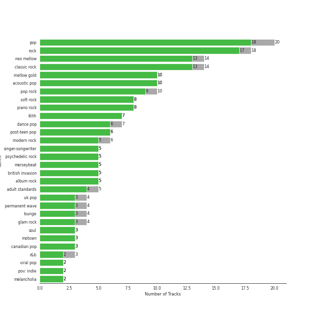

# Karaoke

[66 tracks (59 liked) 🔗](https://open.spotify.com/playlist/784bxrrG3W6L0naOkaCL5F)

[See Track Features](audio_features.md)

[See Clusters](clusters/overview.md)

## Top Artists

| Art | Tracks | 💚 | Artist | 🔗 |
|:---|---:|---:|:---|:---|
|  | 6 | 6 | [Sara Bareilles](../../artists/sara_bareilles/overview.md) | [🔗](https://open.spotify.com/artist/2Sqr0DXoaYABbjBo9HaMkM) |
|  | 5 | 5 | [The Beatles](../../artists/the_beatles/overview.md) | [🔗](https://open.spotify.com/artist/3WrFJ7ztbogyGnTHbHJFl2) |
|  | 4 | 4 | [Billy Joel](../../artists/billy_joel/overview.md) | [🔗](https://open.spotify.com/artist/6zFYqv1mOsgBRQbae3JJ9e) |
|  | 2 | 2 | [Coldplay](../../artists/coldplay/overview.md) | [🔗](https://open.spotify.com/artist/4gzpq5DPGxSnKTe4SA8HAU) |
|  | 2 | 2 | Elton John | [🔗](https://open.spotify.com/artist/3PhoLpVuITZKcymswpck5b) |
|  | 2 | 2 | [Michael Bublé](../../artists/michael_bubl_/overview.md) | [🔗](https://open.spotify.com/artist/1GxkXlMwML1oSg5eLPiAz3) |
|  | 2 | 2 | [Bruno Mars](../../artists/bruno_mars/overview.md) | [🔗](https://open.spotify.com/artist/0du5cEVh5yTK9QJze8zA0C) |
|  | 2 | 1 | [Frank Sinatra](../../artists/frank_sinatra/overview.md) | [🔗](https://open.spotify.com/artist/1Mxqyy3pSjf8kZZL4QVxS0) |
|  | 1 | 1 | The Neighbourhood | [🔗](https://open.spotify.com/artist/77SW9BnxLY8rJ0RciFqkHh) |
|  | 1 | 1 | [Simon & Garfunkel](../../artists/simon___garfunkel/overview.md) | [🔗](https://open.spotify.com/artist/70cRZdQywnSFp9pnc2WTCE) |

See all 51 artists

| Art | Tracks | 💚 | Artist | 🔗 |
|:---|---:|---:|:---|:---|
|  | 1 | 1 | Jon McLaughlin | [🔗](https://open.spotify.com/artist/6z29S0IoiBJpSMP8plyCj7) |
|  | 1 | 1 | [Beyoncé](../../artists/beyonc_/overview.md) | [🔗](https://open.spotify.com/artist/6vWDO969PvNqNYHIOW5v0m) |
|  | 1 | 1 | [Janelle Monáe](../../artists/janelle_mon_e/overview.md) | [🔗](https://open.spotify.com/artist/6ueGR6SWhUJfvEhqkvMsVs) |
|  | 1 | 1 | Commodores | [🔗](https://open.spotify.com/artist/6twIAGnYuIT1pncMAsXnEm) |
|  | 1 | 1 | [Kimbra](../../artists/kimbra/overview.md) | [🔗](https://open.spotify.com/artist/6hk7Yq1DU9QcCCrz9uc0Ti) |
|  | 1 | 1 | [Dua Lipa](../../artists/dua_lipa/overview.md) | [🔗](https://open.spotify.com/artist/6M2wZ9GZgrQXHCFfjv46we) |
|  | 1 | 1 | The Civil Wars | [🔗](https://open.spotify.com/artist/6J7rw7NELJUCThPbAfyLIE) |
|  | 1 | 1 | Ella Eyre | [🔗](https://open.spotify.com/artist/66TrUkUZ3RM29dqeDQRgyA) |
|  | 1 | 1 | A Great Big World | [🔗](https://open.spotify.com/artist/5xKp3UyavIBUsGy3DQdXeF) |
|  | 1 | 1 | Backstreet Boys | [🔗](https://open.spotify.com/artist/5rSXSAkZ67PYJSvpUpkOr7) |
|  | 1 | 1 | [Rihanna](../../artists/rihanna/overview.md) | [🔗](https://open.spotify.com/artist/5pKCCKE2ajJHZ9KAiaK11H) |
|  | 1 | 1 | Gary Jules | [🔗](https://open.spotify.com/artist/5oRnbmgqvvq7fVlgk4vcEa) |
|  | 1 | 1 | CeeLo Green | [🔗](https://open.spotify.com/artist/5nLYd9ST4Cnwy6NHaCxbj8) |
|  | 1 | 1 | [Sia](../../artists/sia/overview.md) | [🔗](https://open.spotify.com/artist/5WUlDfRSoLAfcVSX1WnrxN) |
|  | 1 | 1 | Jason Mraz | [🔗](https://open.spotify.com/artist/4phGZZrJZRo4ElhRtViYdl) |
|  | 1 | 1 | Marc Broussard | [🔗](https://open.spotify.com/artist/4cEwEednPwWCdYT7ZhROZe) |
|  | 1 | 1 | [Radiohead](../../artists/radiohead/overview.md) | [🔗](https://open.spotify.com/artist/4Z8W4fKeB5YxbusRsdQVPb) |
|  | 1 | 1 | Van Morrison | [🔗](https://open.spotify.com/artist/44NX2ffIYHr6D4n7RaZF7A) |
|  | 1 | 1 | Nickel Creek | [🔗](https://open.spotify.com/artist/3bcLBxvaI7GsBzGp3WHnwQ) |
|  | 1 | 1 | Troye Sivan | [🔗](https://open.spotify.com/artist/3WGpXCj9YhhfX11TToZcXP) |
|  | 1 | 1 | The Temptations | [🔗](https://open.spotify.com/artist/3RwQ26hR2tJtA8F9p2n7jG) |
|  | 1 | 1 | Jimmy Eat World | [🔗](https://open.spotify.com/artist/3Ayl7mCk0nScecqOzvNp6s) |
|  | 1 | 1 | The Jackson 5 | [🔗](https://open.spotify.com/artist/2iE18Oxc8YSumAU232n4rW) |
|  | 1 | 1 | [Rilo Kiley](../../artists/rilo_kiley/overview.md) | [🔗](https://open.spotify.com/artist/2cevwbv7ISD92VMNLYLHZA) |
|  | 1 | 1 | Hozier | [🔗](https://open.spotify.com/artist/2FXC3k01G6Gw61bmprjgqS) |
|  | 1 | 1 | Gotye | [🔗](https://open.spotify.com/artist/2AsusXITU8P25dlRNhcAbG) |
|  | 1 | 1 | Steam Powered Giraffe | [🔗](https://open.spotify.com/artist/1yqs45BSh7457Flyhmdv7f) |
|  | 1 | 1 | [Justin Bieber](../../artists/justin_bieber/overview.md) | [🔗](https://open.spotify.com/artist/1uNFoZAHBGtllmzznpCI3s) |
|  | 1 | 1 | [Florence + The Machine](../../artists/florence___the_machine/overview.md) | [🔗](https://open.spotify.com/artist/1moxjboGR7GNWYIMWsRjgG) |
|  | 1 | 1 | Christina Aguilera | [🔗](https://open.spotify.com/artist/1l7ZsJRRS8wlW3WfJfPfNS) |
|  | 1 | 1 | Niall Horan | [🔗](https://open.spotify.com/artist/1Hsdzj7Dlq2I7tHP7501T4) |
|  | 1 | 1 | Neon Trees | [🔗](https://open.spotify.com/artist/0RpddSzUHfncUWNJXKOsjy) |
|  | 1 | 1 | Michael Andrews | [🔗](https://open.spotify.com/artist/0RkqytrwoGyXGvDiZwT6i2) |
|  | 1 | 1 | Eagles | [🔗](https://open.spotify.com/artist/0ECwFtbIWEVNwjlrfc6xoL) |
|  | 1 | 1 | [Taylor Swift](../../artists/taylor_swift/overview.md) | [🔗](https://open.spotify.com/artist/06HL4z0CvFAxyc27GXpf02) |
|  | 1 | 1 | [Maroon 5](../../artists/maroon_5/overview.md) | [🔗](https://open.spotify.com/artist/04gDigrS5kc9YWfZHwBETP) |
|  | 2 | 0 | Adele | [🔗](https://open.spotify.com/artist/4dpARuHxo51G3z768sgnrY) |
|  | 2 | 0 | [Queen](../../artists/queen/overview.md) | [🔗](https://open.spotify.com/artist/1dfeR4HaWDbWqFHLkxsg1d) |
|  | 1 | 0 | Snow Patrol | [🔗](https://open.spotify.com/artist/3rIZMv9rysU7JkLzEaC5Jp) |
|  | 1 | 0 | Count Basie | [🔗](https://open.spotify.com/artist/2jFZlvIea42ZvcCw4OeEdA) |
|  | 1 | 0 | Ne-Yo | [🔗](https://open.spotify.com/artist/21E3waRsmPlU7jZsS13rcj) |

## Top Albums

| Art | Tracks | 💚 | Album | Release Date | 🔗 |
|:---|---:|---:|:---|:---|:---|
|  | 4 | 4 | Abbey Road (Remastered) | 1969-09-26 | [🔗](https://open.spotify.com/album/0ETFjACtuP2ADo6LFhL6HN) |
|  | 3 | 3 | The Stranger | 1977-09-29 | [🔗](https://open.spotify.com/album/3IILMjMMnoN2sKzgesX8KV) |
|  | 3 | 3 | The Blessed Unrest | 2013-07-16 | [🔗](https://open.spotify.com/album/7lpbyGc4fHsQkBTsfWVBhp) |
|  | 2 | 2 | Little Voice | 2007-07-03 | [🔗](https://open.spotify.com/album/2Z9WUERfMjOgQ6ze9TcGbF) |
|  | 2 | 0 | 21 | 2011-01-24 | [🔗](https://open.spotify.com/album/0Lg1uZvI312TPqxNWShFXL) |
|  | 1 | 1 | We Sing. We Dance. We Steal Things. | 2008-05-12 | [🔗](https://open.spotify.com/album/04G0YylSjvDQZrjOfE5jA5) |
|  | 1 | 1 | Viva La Vida or Death and All His Friends | 2008-05-26 | [🔗](https://open.spotify.com/album/1CEODgTmTwLyabvwd7HBty) |
|  | 1 | 1 | Unorthodox Jukebox | 2012-12-07 | [🔗](https://open.spotify.com/album/58ufpQsJ1DS5kq4hhzQDiI) |
|  | 1 | 1 | Under The Blacklight (Standard Version) | 2007-08-20 | [🔗](https://open.spotify.com/album/2f9RsTZpsYMLRVZBtW7En8) |
|  | 1 | 1 | Trading Snakeoil for Wolftickets | 2001-01-01 | [🔗](https://open.spotify.com/album/1OydCrx4m7fguwcX4stR9z) |

See all 57 albums

| Art | Tracks | 💚 | Album | Release Date | 🔗 |
|:---|---:|---:|:---|:---|:---|
|  | 1 | 1 | The Temptations Sing Smokey | 1965-03-22 | [🔗](https://open.spotify.com/album/45tweuKI0zdh8zgKo05cTw) |
|  | 1 | 1 | The Lady Killer | 2010-11-09 | [🔗](https://open.spotify.com/album/3MXU6UoWrf4w4bOvjZTlvY) |
|  | 1 | 1 | The 2¢ Show | 2012-05-23 | [🔗](https://open.spotify.com/album/4DECRyKlhKJgjZLLuvfAI6) |
|  | 1 | 1 | Songs About Jane | 2002-06-25 | [🔗](https://open.spotify.com/album/1Rv9WRKyYhFaGbuYDaQunN) |
|  | 1 | 1 | Put A Little Love On Me | 2019-12-06 | [🔗](https://open.spotify.com/album/7dUgmUMDNnQAejhNLeIQWz) |
|  | 1 | 1 | Picture Show | 2012-01-01 | [🔗](https://open.spotify.com/album/0uRFz92JmjwDbZbB7hEBIr) |
|  | 1 | 1 | Piano Man | 1973-11-09 | [🔗](https://open.spotify.com/album/77ErLrVvYETIlQJHAwhfIH) |
|  | 1 | 1 | Pablo Honey | 1993-02-22 | [🔗](https://open.spotify.com/album/3gBVdu4a1MMJVMy6vwPEb8) |
|  | 1 | 1 | OK Now | 2008-01-01 | [🔗](https://open.spotify.com/album/3fKJJQFV6a61fnKYDDj2LU) |
|  | 1 | 1 | Nickel Creek | 2000 | [🔗](https://open.spotify.com/album/5SGG7graQOU3OnK3cZZCNd) |
|  | 1 | 1 | Moondance (Deluxe Edition) | 1970-02 | [🔗](https://open.spotify.com/album/7diHYi0CglGJekoM3KaWBK) |
|  | 1 | 1 | Millennium | 1999-05-18 | [🔗](https://open.spotify.com/album/5ySxm9hxBNss01WCL7GLyQ) |
|  | 1 | 1 | Metropolis: The Chase Suite (Special Edition) | 2008-08-12 | [🔗](https://open.spotify.com/album/3T3bJi3cvwR5U7ihwgEwF1) |
|  | 1 | 1 | Lungs | 2009-01-01 | [🔗](https://open.spotify.com/album/2KAK58PimXHF4lSoKO3RxA) |
|  | 1 | 1 | Lover | 2019-08-23 | [🔗](https://open.spotify.com/album/1NAmidJlEaVgA3MpcPFYGq) |
|  | 1 | 1 | Kaleidoscope Heart | 2010-09-07 | [🔗](https://open.spotify.com/album/627ukPRwYxyBREHxBq0vGJ) |
|  | 1 | 1 | Justice | 2021-03-19 | [🔗](https://open.spotify.com/album/5dGWwsZ9iB2Xc3UKR0gif2) |
|  | 1 | 1 | Is There Anybody Out There? | 2014-01-20 | [🔗](https://open.spotify.com/album/1yOcLa4euMk9sV7rRJ89Dl) |
|  | 1 | 1 | I Love You. | 2013-04-19 | [🔗](https://open.spotify.com/album/4xkM0BwLM9H2IUcbYzpcBI) |
|  | 1 | 1 | Hozier (Expanded Edition) | 2014-09-19 | [🔗](https://open.spotify.com/album/4Pv7m8D82A1Xun7xNCKZjJ) |
|  | 1 | 1 | Help! (Remastered) | 1965-08-06 | [🔗](https://open.spotify.com/album/0PT5m6hwPRrpBwIHVnvbFX) |
|  | 1 | 1 | Goodbye Yellow Brick Road (Remastered) | 1973-10-05 | [🔗](https://open.spotify.com/album/5WupqgR68HfuHt3BMJtgun) |
|  | 1 | 1 | Good Girl Gone Bad: Reloaded | 2008-06-02 | [🔗](https://open.spotify.com/album/3JSWZWeTHF4HDGt5Eozdy7) |
|  | 1 | 1 | Future Nostalgia | 2020-03-27 | [🔗](https://open.spotify.com/album/5lKlFlReHOLShQKyRv6AL9) |
|  | 1 | 1 | Elton John | 1970-04-10 | [🔗](https://open.spotify.com/album/69P9Ro0W286yLFgYwrGVN0) |
|  | 1 | 1 | Ella Eyre | 2015-01-12 | [🔗](https://open.spotify.com/album/5J69OYtRXeI9dHDK2R95h5) |
|  | 1 | 1 | Doo-Wops & Hooligans | 2010-10-05 | [🔗](https://open.spotify.com/album/1uyf3l2d4XYwiEqAb7t7fX) |
|  | 1 | 1 | Diana Ross Presents The Jackson 5 | 1969-12-18 | [🔗](https://open.spotify.com/album/51uoKRa8vT5SULrlF8s2t1) |
|  | 1 | 1 | Desperado (2013 Remaster) | 1973-04-17 | [🔗](https://open.spotify.com/album/09WBxbis5Sixt01FVMs8UM) |
|  | 1 | 1 | Days Of Wine And Roses, Moon River And Other Academy Award Winners | 1964 | [🔗](https://open.spotify.com/album/7FAo3wmrJNNzz2W5Z5ZG80) |
|  | 1 | 1 | Crazy Love | 2009-10-06 | [🔗](https://open.spotify.com/album/3MXDonOIzrIrCh0HvlACyj) |
|  | 1 | 1 | Commodores | 1977-01-01 | [🔗](https://open.spotify.com/album/2tzbNCAUTmW4MIM2Ulvrwl) |
|  | 1 | 1 | Carencro | 2004-08-03 | [🔗](https://open.spotify.com/album/15dP7BadtY55t9VvFlVrBA) |
|  | 1 | 1 | Call Me Irresponsible | 2007-04-30 | [🔗](https://open.spotify.com/album/3h4pyWRJIB9ZyRKXChbX22) |
|  | 1 | 1 | Bridge Over Troubled Water | 1970-01-26 | [🔗](https://open.spotify.com/album/0JwHz5SSvpYWuuCNbtYZoV) |
|  | 1 | 1 | Blue Neighbourhood (Deluxe) | 2015-12-04 | [🔗](https://open.spotify.com/album/5ouTDazE4LF9bVJPx1nlgW) |
|  | 1 | 1 | Bleed American | 2001-07-17 | [🔗](https://open.spotify.com/album/0UJhhj5bn5AGAjryFnhueP) |
|  | 1 | 1 | Barton Hollow | 2011-02-01 | [🔗](https://open.spotify.com/album/4uWgDFxGAp7XlVSHuVBv4E) |
|  | 1 | 1 | Aussie Legends | 2019-11-22 | [🔗](https://open.spotify.com/album/3IGRFGa4ErR0CU8aMMrRql) |
|  | 1 | 1 | A Rush of Blood to the Head | 2002-08-08 | [🔗](https://open.spotify.com/album/0RHX9XECH8IVI3LNgWDpmQ) |
|  | 1 | 1 | 4 | 2011-06-24 | [🔗](https://open.spotify.com/album/1gIC63gC3B7o7FfpPACZQJ) |
|  | 1 | 1 | 1000 Forms Of Fear (Deluxe Version) | 2015-05-04 | [🔗](https://open.spotify.com/album/6FdNvoO5sF4EKwCX9je1MH) |
|  | 1 | 0 | Nothing But The Best (Remastered) | 2008-01-01 | [🔗](https://open.spotify.com/album/3i67sGIVw8EBlgfSRv3Lj2) |
|  | 1 | 0 | Jazz | 1978-11-10 | [🔗](https://open.spotify.com/album/5X3rA8To5GDOeIWdQyMEcE) |
|  | 1 | 0 | In My Own Words | 2006-01-01 | [🔗](https://open.spotify.com/album/6gkwOLmk0ALMOjWs5WhAEr) |
|  | 1 | 0 | Eyes Open | 2006-01-01 | [🔗](https://open.spotify.com/album/3k7bXPw2u0C0SBKPMsgMS3) |
|  | 1 | 0 | A Night At The Opera | 1975-11-21 | [🔗](https://open.spotify.com/album/3KCJzwKOdBxDu6TKaFPqM9) |

## Top Record Labels

| Tracks | 💚 | Label |
|---:|---:|:---|
| 8 | 8 | [Columbia](../../labels/columbia/overview.md) |
| 7 | 7 | [Epic](../../labels/epic/overview.md) |
| 5 | 5 | [EMI Catalogue](../../labels/emi_catalogue/overview.md) |
| 3 | 3 | [Warner Records](../../labels/warner_records/overview.md) |
| 3 | 3 | [MOTOWN](../../labels/motown/overview.md) |
| 3 | 3 | [Atlantic Records](../../labels/atlantic_records/overview.md) |
| 2 | 2 | [UNI](../../labels/uni/overview.md) |
| 2 | 2 | [UMC (Universal Music Catalogue)](../../labels/umc__universal_music_catalogue_/overview.md) |
| 2 | 2 | [Reprise](../../labels/reprise/overview.md) |
| 2 | 2 | [Interscope Records](../../labels/interscope_records/overview.md) |

See all 43 labels

| Tracks | 💚 | Label |
|---:|---:|:---|
| 2 | 2 | Elektra |
| 2 | 2 | [143](../../labels/143/overview.md) |
| 3 | 1 | [XL Recordings](../../labels/xl_recordings/overview.md) |
| 2 | 1 | FRANK SINATRA DIGITAL REPRISE |
| 1 | 1 | sensibility recordings |
| 1 | 1 | [Virgin Records](../../labels/virgin_records/overview.md) |
| 1 | 1 | [Universal-Island Records Ltd.](../../labels/universal_island_records_ltd_/overview.md) |
| 1 | 1 | UMG Recordings |
| 1 | 1 | [Taylor Swift](../../labels/taylor_swift/overview.md) |
| 1 | 1 | Sugar Hill Records |
| 1 | 1 | Steam Powered Giraffe |
| 1 | 1 | [Rhino](../../labels/rhino/overview.md) |
| 1 | 1 | Radiculture |
| 1 | 1 | [RCA Records Label](../../labels/rca_records_label/overview.md) |
| 1 | 1 | RBMG |
| 1 | 1 | Parlophone UK |
| 1 | 1 | Parlophone Records Limited |
| 1 | 1 | Parkwood Entertainment |
| 1 | 1 | Monkey Puzzle Records |
| 1 | 1 | Mercury Records |
| 1 | 1 | [Jive](../../labels/jive/overview.md) |
| 1 | 1 | [Island Records](../../labels/island_records/overview.md) |
| 1 | 1 | Island Def Jam |
| 1 | 1 | EMI Recorded Music Australia Pty Ltd |
| 1 | 1 | Down Up Down Music |
| 1 | 1 | [Def Jam Recordings](../../labels/def_jam_recordings/overview.md) |
| 1 | 1 | Def Jam |
| 1 | 1 | [Capitol Records](../../labels/capitol_records/overview.md) |
| 1 | 1 | Bad Boy |
| 1 | 1 | ATG |
| 2 | 0 | [Hollywood Records](../../labels/hollywood_records/overview.md) |
| 1 | 0 | [Polydor Records](../../labels/polydor_records/overview.md) |
| 1 | 0 | Def Soul |

## Genres

| Tracks | 💚 | Genre |
|---:|---:|:---|
| 20 | 17 | [pop](../../genres/pop/overview.md) |
| 18 | 16 | [rock](../../genres/rock/overview.md) |
| 14 | 12 | [classic rock](../../genres/classic_rock/overview.md) |
| 13 | 12 | [neo mellow](../../genres/neo_mellow/overview.md) |
| 10 | 10 | [mellow gold](../../genres/mellow_gold/overview.md) |
| 10 | 10 | [acoustic pop](../../genres/acoustic_pop/overview.md) |
| 10 | 9 | [pop rock](../../genres/pop_rock/overview.md) |
| 8 | 8 | [soft rock](../../genres/soft_rock/overview.md) |
| 8 | 8 | [piano rock](../../genres/piano_rock/overview.md) |
| 7 | 7 | [lilith](../../genres/lilith/overview.md) |

See all 84 genres

| Tracks | 💚 | Genre |
|---:|---:|:---|
| 7 | 6 | [dance pop](../../genres/dance_pop/overview.md) |
| 6 | 6 | [post-teen pop](../../genres/post_teen_pop/overview.md) |
| 6 | 6 | [heartland rock](../../genres/heartland_rock/overview.md) |
| 6 | 5 | [modern rock](../../genres/modern_rock/overview.md) |
| 5 | 5 | [singer-songwriter](../../genres/singer_songwriter/overview.md) |
| 5 | 5 | [psychedelic rock](../../genres/psychedelic_rock/overview.md) |
| 5 | 5 | merseybeat |
| 5 | 5 | [british invasion](../../genres/british_invasion/overview.md) |
| 5 | 5 | [beatlesque](../../genres/beatlesque/overview.md) |
| 5 | 5 | [album rock](../../genres/album_rock/overview.md) |
| 5 | 4 | [adult standards](../../genres/adult_standards/overview.md) |
| 4 | 3 | [permanent wave](../../genres/permanent_wave/overview.md) |
| 4 | 3 | [lounge](../../genres/lounge/overview.md) |
| 3 | 3 | [soul](../../genres/soul/overview.md) |
| 3 | 3 | motown |
| 3 | 3 | [canadian pop](../../genres/canadian_pop/overview.md) |
| 3 | 3 | australian pop |
| 4 | 2 | [uk pop](../../genres/uk_pop/overview.md) |
| 4 | 2 | glam rock |
| 3 | 2 | [r&b](../../genres/r_b/overview.md) |
| 2 | 2 | [viral pop](../../genres/viral_pop/overview.md) |
| 2 | 2 | pov: indie |
| 2 | 2 | melancholia |
| 2 | 2 | jazz pop |
| 2 | 2 | folk rock |
| 2 | 2 | folk |
| 2 | 2 | atl hip hop |
| 2 | 2 | [alternative rock](../../genres/alternative_rock/overview.md) |
| 2 | 1 | urban contemporary |
| 2 | 1 | easy listening |
| 1 | 1 | yacht rock |
| 1 | 1 | uk dance |
| 1 | 1 | uk alternative pop |
| 1 | 1 | talent show |
| 1 | 1 | stomp and holler |
| 1 | 1 | steampunk |
| 1 | 1 | quiet storm |
| 1 | 1 | punk |
| 1 | 1 | progressive bluegrass |
| 1 | 1 | post-grunge |
| 1 | 1 | pop punk |
| 1 | 1 | oxford indie |
| 1 | 1 | new americana |
| 1 | 1 | neon pop punk |
| 1 | 1 | neo soul |
| 1 | 1 | modern power pop |
| 1 | 1 | modern alternative rock |
| 1 | 1 | memphis soul |
| 1 | 1 | mandolin |
| 1 | 1 | lafayette indie |
| 1 | 1 | la indie |
| 1 | 1 | irish singer-songwriter |
| 1 | 1 | instrumental bluegrass |
| 1 | 1 | indy indie |
| 1 | 1 | indie rock |
| 1 | 1 | indie pop |
| 1 | 1 | indie folk |
| 1 | 1 | funktronica |
| 1 | 1 | funk |
| 1 | 1 | emo |
| 1 | 1 | disco |
| 1 | 1 | chamber pop |
| 1 | 1 | boy band |
| 1 | 1 | bluegrass |
| 1 | 1 | baroque pop |
| 1 | 1 | barbadian pop |
| 1 | 1 | australian dance |
| 1 | 1 | art rock |
| 1 | 1 | alternative r&b |
| 1 | 1 | alternative metal |
| 1 | 1 | afrofuturism |
| 2 | 0 | pop soul |
| 2 | 0 | british soul |
| 1 | 0 | irish rock |

## Years

| ​ | 10 newest albums | ​​ | 10 oldest albums |
|:---|:---|:---|:---|
|  | Justice (2021-03-19) |  | Days Of Wine And Roses, Moon River And Other Academy Award Winners (1964) |
|  | Future Nostalgia (2020-03-27) |  | The Temptations Sing Smokey (1965-03-22) |
|  | Put A Little Love On Me (2019-12-06) |  | Help! (Remastered) (1965-08-06) |
|  | Aussie Legends (2019-11-22) |  | Abbey Road (Remastered) (1969-09-26) |
|  | Lover (2019-08-23) |  | Diana Ross Presents The Jackson 5 (1969-12-18) |
|  | Blue Neighbourhood (Deluxe) (2015-12-04) |  | Bridge Over Troubled Water (1970-01-26) |
|  | 1000 Forms Of Fear (Deluxe Version) (2015-05-04) |  | Moondance (Deluxe Edition) (1970-02) |
|  | Ella Eyre (2015-01-12) |  | Elton John (1970-04-10) |
|  | Hozier (Expanded Edition) (2014-09-19) |  | Desperado (2013 Remaster) (1973-04-17) |
|  | Is There Anybody Out There? (2014-01-20) |  | Goodbye Yellow Brick Road (Remastered) (1973-10-05) |