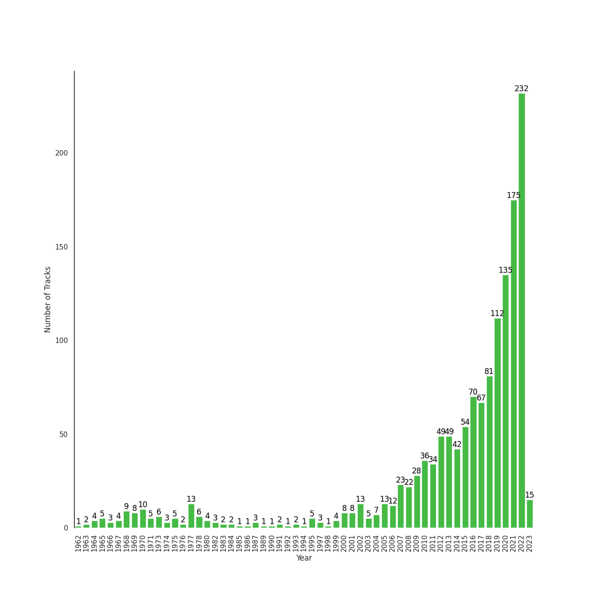

# Liked Songs

[1459 songs](tracks.md)

## Top Artists

See top 100 artists

| Number of Tracks | Art | Artist | 🔗 |
|---:|:---|:---|:---|
| 51 |  | [Red Velvet](../../artists/red_velvet.md) | [🔗](https://open.spotify.com/artist/1z4g3DjTBBZKhvAroFlhOM) |
| 43 |  | [Sara Bareilles](../../artists/sara_bareilles.md) | [🔗](https://open.spotify.com/artist/2Sqr0DXoaYABbjBo9HaMkM) |
| 37 |  | [Taylor Swift](../../artists/taylor_swift.md) | [🔗](https://open.spotify.com/artist/06HL4z0CvFAxyc27GXpf02) |
| 28 |  | [TWICE](../../artists/twice.md) | [🔗](https://open.spotify.com/artist/7n2Ycct7Beij7Dj7meI4X0) |
| 25 |  | [BLACKPINK](../../artists/blackpink.md) | [🔗](https://open.spotify.com/artist/41MozSoPIsD1dJM0CLPjZF) |
| 25 |  | [BTS](../../artists/bts.md) | [🔗](https://open.spotify.com/artist/3Nrfpe0tUJi4K4DXYWgMUX) |
| 23 |  | [IU](../../artists/iu.md) | [🔗](https://open.spotify.com/artist/3HqSLMAZ3g3d5poNaI7GOU) |
| 23 |  | [Stray Kids](../../artists/stray_kids.md) | [🔗](https://open.spotify.com/artist/2dIgFjalVxs4ThymZ67YCE) |
| 23 |  | [ITZY](../../artists/itzy.md) | [🔗](https://open.spotify.com/artist/2KC9Qb60EaY0kW4eH68vr3) |
| 23 |  | [(G)I-DLE](../../artists/_g_i_dle.md) | [🔗](https://open.spotify.com/artist/2AfmfGFbe0A0WsTYm0SDTx) |
| 22 |  | [The Beatles](../../artists/the_beatles.md) | [🔗](https://open.spotify.com/artist/3WrFJ7ztbogyGnTHbHJFl2) |
| 21 |  | [The Tarpeggios](../../artists/the_tarpeggios.md) | [🔗](https://open.spotify.com/artist/2HXd5pFHJyaQJr5aXfErrE) |
| 19 |  | [ENHYPEN](../../artists/enhypen.md) | [🔗](https://open.spotify.com/artist/5t5FqBwTcgKTaWmfEbwQY9) |
| 18 |  | [LeeHi](../../artists/leehi.md) | [🔗](https://open.spotify.com/artist/7cVZApDoQZpS447nHTsNqu) |
| 18 |  | [TAEYEON](../../artists/taeyeon.md) | [🔗](https://open.spotify.com/artist/3qNVuliS40BLgXGxhdBdqu) |
| 17 |  | [Rihanna](../../artists/rihanna.md) | [🔗](https://open.spotify.com/artist/5pKCCKE2ajJHZ9KAiaK11H) |
| 17 |  | [Pentatonix](../../artists/pentatonix.md) | [🔗](https://open.spotify.com/artist/26AHtbjWKiwYzsoGoUZq53) |
| 16 |  | [Ariana Grande](../../artists/ariana_grande.md) | [🔗](https://open.spotify.com/artist/66CXWjxzNUsdJxJ2JdwvnR) |
| 15 |  | [Billy Joel](../../artists/billy_joel.md) | [🔗](https://open.spotify.com/artist/6zFYqv1mOsgBRQbae3JJ9e) |
| 15 |  | [Florence + The Machine](../../artists/florence___the_machine.md) | [🔗](https://open.spotify.com/artist/1moxjboGR7GNWYIMWsRjgG) |
| 15 |  | [MAMAMOO](../../artists/mamamoo.md) | [🔗](https://open.spotify.com/artist/0XATRDCYuuGhk0oE7C0o5G) |
| 14 |  | [aespa](../../artists/aespa.md) | [🔗](https://open.spotify.com/artist/6YVMFz59CuY7ngCxTxjpxE) |
| 14 |  | [Radiohead](../../artists/radiohead.md) | [🔗](https://open.spotify.com/artist/4Z8W4fKeB5YxbusRsdQVPb) |
| 13 |  | [CHUNG HA](../../artists/chung_ha.md) | [🔗](https://open.spotify.com/artist/2PSJ6YriU7JsFucxACpU7Y) |
| 12 |  | [STAYC](../../artists/stayc.md) | [🔗](https://open.spotify.com/artist/01XYiBYaoMJcNhPokrg0l0) |
| 11 |  | [SEVENTEEN](../../artists/seventeen.md) | [🔗](https://open.spotify.com/artist/7nqOGRxlXj7N2JYbgNEjYH) |
| 11 |  | [Queen](../../artists/queen.md) | [🔗](https://open.spotify.com/artist/1dfeR4HaWDbWqFHLkxsg1d) |
| 11 |  | [Girls' Generation](../../artists/girls__generation.md) | [🔗](https://open.spotify.com/artist/0Sadg1vgvaPqGTOjxu0N6c) |
| 10 |  | [Billie Eilish](../../artists/billie_eilish.md) | [🔗](https://open.spotify.com/artist/6qqNVTkY8uBg9cP3Jd7DAH) |
| 10 |  | [Kimbra](../../artists/kimbra.md) | [🔗](https://open.spotify.com/artist/6hk7Yq1DU9QcCCrz9uc0Ti) |
| 10 |  | [Dreamcatcher](../../artists/dreamcatcher.md) | [🔗](https://open.spotify.com/artist/5V1qsQHdXNm4ZEZHWvFnqQ) |
| 10 |  | [Bruno Mars](../../artists/bruno_mars.md) | [🔗](https://open.spotify.com/artist/0du5cEVh5yTK9QJze8zA0C) |
| 10 |  | [Lana Del Rey](../../artists/lana_del_rey.md) | [🔗](https://open.spotify.com/artist/00FQb4jTyendYWaN8pK0wa) |
| 9 |  | [Beyoncé](../../artists/beyonc_.md) | [🔗](https://open.spotify.com/artist/6vWDO969PvNqNYHIOW5v0m) |
| 9 |  | [Lady Gaga](../../artists/lady_gaga.md) | [🔗](https://open.spotify.com/artist/1HY2Jd0NmPuamShAr6KMms) |
| 8 |  | JEON SOYEON | [🔗](https://open.spotify.com/artist/6Xg22wJOAcnvPUfk5WvODH) |
| 8 |  | BIBI | [🔗](https://open.spotify.com/artist/6UbmqUEgjLA6jAcXwbM1Z9) |
| 8 |  | SUNMI | [🔗](https://open.spotify.com/artist/6MoXcK2GyGg7FIyxPU5yW6) |
| 8 |  | Sia | [🔗](https://open.spotify.com/artist/5WUlDfRSoLAfcVSX1WnrxN) |
| 8 |  | BAEKHYUN | [🔗](https://open.spotify.com/artist/4ufh0WuMZh6y4Dmdnklvdl) |
| 8 |  | [Billlie](../../artists/billlie.md) | [🔗](https://open.spotify.com/artist/2GQxKDojobwBjZMPf7aoh0) |
| 8 |  | NCT DREAM | [🔗](https://open.spotify.com/artist/1gBUSTR3TyDdTVFIaQnc02) |
| 8 |  | WENDY | [🔗](https://open.spotify.com/artist/0FRUZvZNPzM3YJMABJxf2K) |
| 8 |  | Jason Derulo | [🔗](https://open.spotify.com/artist/07YZf4WDAMNwqr4jfgOZ8y) |
| 7 |  | Hwa Sa | [🔗](https://open.spotify.com/artist/7bmYpVgQub656uNTu6qGNQ) |
| 7 |  | Imogen Heap | [🔗](https://open.spotify.com/artist/6Xb4ezwoAQC4516kI89nWz) |
| 7 |  | AKMU | [🔗](https://open.spotify.com/artist/6OwKE9Ez6ALxpTaKcT5ayv) |
| 7 |  | BABYMETAL | [🔗](https://open.spotify.com/artist/630wzNP2OL7fl4Xl0GnMWq) |
| 7 |  | Camila Cabello | [🔗](https://open.spotify.com/artist/4nDoRrQiYLoBzwC5BhVJzF) |
| 7 |  | [EXO](../../artists/exo.md) | [🔗](https://open.spotify.com/artist/3cjEqqelV9zb4BYE3qDQ4O) |
| 6 |  | [NCT 127](../../artists/nct_127.md) | [🔗](https://open.spotify.com/artist/7f4ignuCJhLXfZ9giKT7rH) |
| 6 |  | GOT the beat | [🔗](https://open.spotify.com/artist/6uNxlIP5lzPFf0BHuELOuX) |
| 6 |  | WJSN | [🔗](https://open.spotify.com/artist/6hhqsQZhtp9hfaZhSd0VSD) |
| 6 |  | SUPER JUNIOR | [🔗](https://open.spotify.com/artist/6gzXCdfYfFe5XKhPKkYqxV) |
| 6 |  | [Dua Lipa](../../artists/dua_lipa.md) | [🔗](https://open.spotify.com/artist/6M2wZ9GZgrQXHCFfjv46we) |
| 6 |  | ATEEZ | [🔗](https://open.spotify.com/artist/68KmkJeZGfwe1OUaivBa2L) |
| 6 |  | The Who | [🔗](https://open.spotify.com/artist/67ea9eGLXYMsO2eYQRui3w) |
| 6 |  | Joni Mitchell | [🔗](https://open.spotify.com/artist/5hW4L92KnC6dX9t7tYM4Ve) |
| 6 |  | Doja Cat | [🔗](https://open.spotify.com/artist/5cj0lLjcoR7YOSnhnX0Po5) |
| 6 |  | Daft Punk | [🔗](https://open.spotify.com/artist/4tZwfgrHOc3mvqYlEYSvVi) |
| 6 |  | LE SSERAFIM | [🔗](https://open.spotify.com/artist/4SpbR6yFEvexJuaBpgAU5p) |
| 6 |  | NCT U | [🔗](https://open.spotify.com/artist/3paGCCtX1Xr4Gx53mSeZuQ) |
| 6 |  | EVERGLOW | [🔗](https://open.spotify.com/artist/3ZZzT0naD25RhY2uZvIKkJ) |
| 6 |  | OH MY GIRL | [🔗](https://open.spotify.com/artist/2019zR22qK2RBvCqtudBaI) |
| 6 |  | PENTAGON | [🔗](https://open.spotify.com/artist/1wKpMkucynaTfG8lyPprYV) |
| 6 |  | TOMORROW X TOGETHER | [🔗](https://open.spotify.com/artist/0ghlgldX5Dd6720Q3qFyQB) |
| 5 |  | Simon & Garfunkel | [🔗](https://open.spotify.com/artist/70cRZdQywnSFp9pnc2WTCE) |
| 5 |  | Janelle Monáe | [🔗](https://open.spotify.com/artist/6ueGR6SWhUJfvEhqkvMsVs) |
| 5 |  | Katy Perry | [🔗](https://open.spotify.com/artist/6jJ0s89eD6GaHleKKya26X) |
| 5 |  | CLC | [🔗](https://open.spotify.com/artist/6QyO41KctzGc70mVaVnXQO) |
| 5 |  | Clean Bandit | [🔗](https://open.spotify.com/artist/6MDME20pz9RveH9rEXvrOM) |
| 5 |  | NewJeans | [🔗](https://open.spotify.com/artist/6HvZYsbFfjnjFrWF950C9d) |
| 5 |  | HEIZE | [🔗](https://open.spotify.com/artist/5dCvSnVduaFleCnyy98JMo) |
| 5 |  | MOMOLAND | [🔗](https://open.spotify.com/artist/5RR0MLwcjc87wjSw2JYdwx) |
| 5 |  | LOONA | [🔗](https://open.spotify.com/artist/52zMTJCKluDlFwMQWmccY7) |
| 5 |  | Coldplay | [🔗](https://open.spotify.com/artist/4gzpq5DPGxSnKTe4SA8HAU) |
| 5 |  | Michael Jackson | [🔗](https://open.spotify.com/artist/3fMbdgg4jU18AjLCKBhRSm) |
| 5 |  | Lindsey Stirling | [🔗](https://open.spotify.com/artist/378dH6EszOLFShpRzAQkVM) |
| 5 |  | Rilo Kiley | [🔗](https://open.spotify.com/artist/2cevwbv7ISD92VMNLYLHZA) |
| 5 |  | Seori | [🔗](https://open.spotify.com/artist/2bWTIIQP9zaVc55RaMGu7e) |
| 5 |  | [Michael Bublé](../../artists/michael_bubl_.md) | [🔗](https://open.spotify.com/artist/1GxkXlMwML1oSg5eLPiAz3) |
| 5 |  | Nicki Minaj | [🔗](https://open.spotify.com/artist/0hCNtLu0JehylgoiP8L4Gh) |
| 5 |  | j-hope | [🔗](https://open.spotify.com/artist/0b1sIQumIAsNbqAoIClSpy) |
| 5 |  | Maroon 5 | [🔗](https://open.spotify.com/artist/04gDigrS5kc9YWfZHwBETP) |
| 4 |  | GOT7 | [🔗](https://open.spotify.com/artist/6nfDaffa50mKtEOwR8g4df) |
| 4 |  | The Rose | [🔗](https://open.spotify.com/artist/5na1LmEmK2VzNLje9snJYW) |
| 4 |  | A Fine Frenzy | [🔗](https://open.spotify.com/artist/5dTYaRzOn4rXGBLH052EeQ) |
| 4 |  | Solar | [🔗](https://open.spotify.com/artist/5cYcI546S8Lf97m4mNdYLD) |
| 4 |  | K/DA | [🔗](https://open.spotify.com/artist/4gOc8TsQed9eqnqJct2c5v) |
| 4 |  | BIGBANG | [🔗](https://open.spotify.com/artist/4Kxlr1PRlDKEB0ekOCyHgX) |
| 4 |  | League of Legends | [🔗](https://open.spotify.com/artist/47mIJdHORyRerp4os813jD) |
| 4 |  | Regina Spektor | [🔗](https://open.spotify.com/artist/3z6Gk257P9jNcZbBXJNX5i) |
| 4 |  | TREASURE | [🔗](https://open.spotify.com/artist/3KonOYiLsU53m4yT7gNotP) |
| 4 |  | P1Harmony | [🔗](https://open.spotify.com/artist/3JjvsPeGMbDJqsphe2z8xU) |
| 4 |  | SEULGI | [🔗](https://open.spotify.com/artist/2QM5S4yO6xHgnNvF0nbZZq) |
| 4 |  | NMIXX | [🔗](https://open.spotify.com/artist/28ot3wh4oNmoFOdVajibBl) |
| 4 |  | Britney Spears | [🔗](https://open.spotify.com/artist/26dSoYclwsYLMAKD3tpOr4) |
| 4 |  | Justin Bieber | [🔗](https://open.spotify.com/artist/1uNFoZAHBGtllmzznpCI3s) |
| 4 |  | Jackson Wang | [🔗](https://open.spotify.com/artist/1kfWoWgCugPkyxQP8lkRlY) |
| 4 |  | Muse | [🔗](https://open.spotify.com/artist/12Chz98pHFMPJEknJQMWvI) |

## Top Albums

See top 100 albums

| Number of Tracks | Art | Album | Release Date | 🔗 |
|---:|:---|:---|:---|:---|
| 11 |  | The Blessed Unrest | 2013-07-16 | [🔗](https://open.spotify.com/album/7lpbyGc4fHsQkBTsfWVBhp) |
| 10 |  | Kaleidoscope Heart | 2010-09-07 | [🔗](https://open.spotify.com/album/627ukPRwYxyBREHxBq0vGJ) |
| 9 |  | reputation | 2017-11-10 | [🔗](https://open.spotify.com/album/6DEjYFkNZh67HP7R9PSZvv) |
| 8 |  | The Teal Album | 2016-11-12 | [🔗](https://open.spotify.com/album/7mTQ62MIYHSbkZHGjY0Ftg) |
| 8 |  | Little Voice | 2007-07-03 | [🔗](https://open.spotify.com/album/2Z9WUERfMjOgQ6ze9TcGbF) |
| 7 |  | Vows (Deluxe Version) | 2011 | [🔗](https://open.spotify.com/album/6V9rvW05Um5bIHePPfeI8p) |
| 7 |  | THE ALBUM | 2020-10-02 | [🔗](https://open.spotify.com/album/71O60S5gIJSIAhdnrDIh3N) |
| 7 |  | SKZ-REPLAY | 2022-12-21 | [🔗](https://open.spotify.com/album/3UXrliH0JUQvcaLnBD8Txz) |
| 7 |  | I NEVER DIE | 2022-03-14 | [🔗](https://open.spotify.com/album/1T2W9vDajFreUuycPDjUXk) |
| 7 |  | BORN PINK | 2022-09-16 | [🔗](https://open.spotify.com/album/7jaSNQUBJbvfbZHLNFrV7P) |
| 7 |  | 1989 | 2014-10-27 | [🔗](https://open.spotify.com/album/2QJmrSgbdM35R67eoGQo4j) |
| 6 |  | folklore | 2020-07-24 | [🔗](https://open.spotify.com/album/2fenSS68JI1h4Fo296JfGr) |
| 6 |  | The Stranger | 1977-09-29 | [🔗](https://open.spotify.com/album/3IILMjMMnoN2sKzgesX8KV) |
| 6 |  | Lungs | 2009-01-01 | [🔗](https://open.spotify.com/album/2KAK58PimXHF4lSoKO3RxA) |
| 6 |  | INVU - The 3rd Album | 2022-02-14 | [🔗](https://open.spotify.com/album/7i2YLTVQ0dyngRuUqtGmr9) |
| 6 |  | Formula of Love: O+T=<3 | 2021-11-12 | [🔗](https://open.spotify.com/album/5052Ip89wdW8EGdpjEpNeq) |
| 6 |  | Ceremonials (Deluxe Edition) | 2011-01-01 | [🔗](https://open.spotify.com/album/5SxudoALxEAVh9l83kSebx) |
| 6 |  | Carolina State of Mind | 2013-11-15 | [🔗](https://open.spotify.com/album/3zKusinRVxdC5s2wOPYBgX) |
| 6 |  | Born To Die | 2012-01-30 | [🔗](https://open.spotify.com/album/4X8hAqIWpQyQks2yRhyqs4) |
| 6 |  | Amidst the Chaos (Bonus Version) | 2019-05-10 | [🔗](https://open.spotify.com/album/5x2sDapUIdq0qk1ezff3gm) |
| 6 |  | Abbey Road (Remastered) | 1969-09-26 | [🔗](https://open.spotify.com/album/0ETFjACtuP2ADo6LFhL6HN) |
| 6 |  | 4 ONLY | 2021-09-09 | [🔗](https://open.spotify.com/album/1DKgZeAYrjslAPZVMe6EFt) |
| 5 |  | ‘The ReVe Festival 2022 - Feel My Rhythm’ | 2022-03-21 | [🔗](https://open.spotify.com/album/3HgoCO9wWuPcNhz8Ip4C46) |
| 5 |  | Windy | 2021-07-05 | [🔗](https://open.spotify.com/album/1lv92CIVZbB2BsHmIx7qJf) |
| 5 |  | WHEN WE ALL FALL ASLEEP, WHERE DO WE GO? | 2019-03-29 | [🔗](https://open.spotify.com/album/0S0KGZnfBGSIssfF54WSJh) |
| 5 |  | The Beatles (Remastered) | 1968-11-22 | [🔗](https://open.spotify.com/album/1klALx0u4AavZNEvC4LrTL) |
| 5 |  | Stamp On It - The 1st Mini Album | 2023-01-16 | [🔗](https://open.spotify.com/album/2Gxd1fr4RFHVNx6IxGr9I7) |
| 5 |  | Savage - The 1st Mini Album | 2021-10-05 | [🔗](https://open.spotify.com/album/3vyyDkvYWC36DwgZCYd3Wu) |
| 5 |  | Querencia | 2021-02-15 | [🔗](https://open.spotify.com/album/1p2OBhqq0d1N8awjHV9xA3) |
| 5 |  | Queendom - The 6th Mini Album | 2021-08-16 | [🔗](https://open.spotify.com/album/6Pe5LGQgU3mmvuRjFMsACV) |
| 5 |  | Once Upon Another Time | 2012-05-22 | [🔗](https://open.spotify.com/album/1PrqYZJRzGNf8AsSOraxnZ) |
| 5 |  | OK Computer | 1997-05-28 | [🔗](https://open.spotify.com/album/6dVIqQ8qmQ5GBnJ9shOYGE) |
| 5 |  | Midnights | 2022-10-21 | [🔗](https://open.spotify.com/album/151w1FgRZfnKZA9FEcg9Z3) |
| 5 |  | Lover | 2019-08-23 | [🔗](https://open.spotify.com/album/1NAmidJlEaVgA3MpcPFYGq) |
| 5 |  | Like Water - The 1st Mini Album | 2021-04-05 | [🔗](https://open.spotify.com/album/1Ao5vWPO13f4l0ldwxOKL7) |
| 5 |  | I love | 2022-10-17 | [🔗](https://open.spotify.com/album/2Hyuin3i1cSZ1FlQFeCPZH) |
| 5 |  | Girls - The 2nd Mini Album | 2022-07-08 | [🔗](https://open.spotify.com/album/4w1dbvUy1crv0knXQvcSeY) |
| 5 |  | DIMENSION : DILEMMA | 2021-10-12 | [🔗](https://open.spotify.com/album/5jGRqioNCSWZGBl3QmyuFI) |
| 4 |  | ‘The ReVe Festival’ Finale | 2019-12-23 | [🔗](https://open.spotify.com/album/3rVtm00UfbuzWOewdm4iYM) |
| 4 |  | ‘The ReVe Festival 2022 - Birthday’ | 2022-11-28 | [🔗](https://open.spotify.com/album/58OR7UoaJkJzqeQGClHzh1) |
| 4 |  | YOUNG-LUV.COM | 2022-02-21 | [🔗](https://open.spotify.com/album/2xPdgNkM4yIQmP7axJ1T1o) |
| 4 |  | Twenty-Five Twenty-One OST | 2022-04-03 | [🔗](https://open.spotify.com/album/77NPr874WU941XZhjO43dR) |
| 4 |  | This Is Acting (Deluxe Version) | 2016-10-21 | [🔗](https://open.spotify.com/album/2eV6DIPDnGl1idcjww6xyX) |
| 4 |  | Russian Roulette - The 3rd Mini Album | 2016-09-07 | [🔗](https://open.spotify.com/album/6MNlcai3skKLKv5syzFwC3) |
| 4 |  | Perfect Velvet - The 2nd Album | 2017-11-17 | [🔗](https://open.spotify.com/album/0rvrbZvaDX5S9ZBhwOwFfH) |
| 4 |  | PTX, Vol. III | 2014-09-23 | [🔗](https://open.spotify.com/album/32y54TelUHSUDWVOx4h1B4) |
| 4 |  | My Everything (Deluxe) | 2014-08-25 | [🔗](https://open.spotify.com/album/6EVYTRG1drKdO8OnIQBeEj) |
| 4 |  | MANIFESTO : DAY 1 | 2022-07-04 | [🔗](https://open.spotify.com/album/5J8MNLLViH5zqM6VoGErz8) |
| 4 |  | IU 5th Album 'LILAC' | 2021-03-25 | [🔗](https://open.spotify.com/album/01dPJcwyht77brL4JQiR8R) |
| 4 |  | Homeward | 2022-04-08 | [🔗](https://open.spotify.com/album/2FiDSelqVoi7VQfpmaMRJK) |
| 4 |  | GUESS WHO | 2021-04-30 | [🔗](https://open.spotify.com/album/4lS8nhX8cplsYPzKjvhw6G) |
| 4 |  | CRAZY IN LOVE | 2021-09-24 | [🔗](https://open.spotify.com/album/4U7rGOkJgtxs27H9L93Xli) |
| 4 |  | CHECKMATE | 2022-07-15 | [🔗](https://open.spotify.com/album/64EGnoCD5NuC41OqQ3E7UK) |
| 4 |  | 1000 Forms Of Fear (Deluxe Version) | 2015-05-04 | [🔗](https://open.spotify.com/album/6FdNvoO5sF4EKwCX9je1MH) |
| 3 |  | ‘The ReVe Festival’ Day 1 | 2019-06-19 | [🔗](https://open.spotify.com/album/2nLEiP268mSFZHW5dajM4R) |
| 3 |  | the collective soul and unconscious: chapter one | 2022-02-23 | [🔗](https://open.spotify.com/album/4ophrgcnwWi1I5nWYImyhw) |
| 3 |  | the Billage of perception : chapter one | 2021-11-10 | [🔗](https://open.spotify.com/album/1kp4txZsSpDNR4EoDFi2LD) |
| 3 |  | Thriller | 1982-11-30 | [🔗](https://open.spotify.com/album/2ANVost0y2y52ema1E9xAZ) |
| 3 |  | The Red - The 1st Album | 2015-09-09 | [🔗](https://open.spotify.com/album/6YL9J0E6PGtYzkhyMxnmXd) |
| 3 |  | The Game | 1980-06-27 | [🔗](https://open.spotify.com/album/1h0j80HhdzIMsUGUFiVkqa) |
| 3 |  | The Fame | 2008-01-01 | [🔗](https://open.spotify.com/album/1jpUMnKpRlng1OJN7LJauV) |
| 3 |  | The Chaos Chapter: FREEZE | 2021-05-31 | [🔗](https://open.spotify.com/album/5Zdr9vactwnJH4Vpe9Mid9) |
| 3 |  | The Bends | 1995-03-13 | [🔗](https://open.spotify.com/album/35UJLpClj5EDrhpNIi4DFg) |
| 3 |  | Teenage Dream | 2010-01-01 | [🔗](https://open.spotify.com/album/3BoUxfC7YhxNq3TpOfnRif) |
| 3 |  | Taste of Love | 2021-06-11 | [🔗](https://open.spotify.com/album/00vb6sViDbJLmLLchfbRh4) |
| 3 |  | Summer Magic - Summer Mini Album | 2018-08-06 | [🔗](https://open.spotify.com/album/5zWa1ZEUBctbKqvwXbFawo) |
| 3 |  | Speak for Yourself | 2005-07-18 | [🔗](https://open.spotify.com/album/0t0Cr8jA63wlm8nWj7qfvJ) |
| 3 |  | SQUARE UP | 2018-06-15 | [🔗](https://open.spotify.com/album/0wOiWrujRbxlKEGWRQpKYc) |
| 3 |  | SEOULITE | 2016-03-09 | [🔗](https://open.spotify.com/album/2c41Flo2HQgy0A9P3xuSFf) |
| 3 |  | SAILING | 2019-09-25 | [🔗](https://open.spotify.com/album/7C0Ci0alKWwwXPIFYEdVcn) |
| 3 |  | Palette | 2017-04-21 | [🔗](https://open.spotify.com/album/5V8n6fqyAPxvFTibPhQVcp) |
| 3 |  | PTX, Vol. 2 | 2013-11-05 | [🔗](https://open.spotify.com/album/12dPqNFIdjiVFSHvtsDmzJ) |
| 3 |  | PTX, Vol. 1 | 2012-06-26 | [🔗](https://open.spotify.com/album/5wGlP6EqF7akh6N3UGfKVZ) |
| 3 |  | PTX Vol. IV - Classics | 2017-04-07 | [🔗](https://open.spotify.com/album/00JpoY0ZaQRXTNJUruibfX) |
| 3 |  | Oh! - The Second Album | 2010-01-28 | [🔗](https://open.spotify.com/album/4e841RxorIoZIufX8v7p7E) |
| 3 |  | ODDINARY | 2022-03-18 | [🔗](https://open.spotify.com/album/0Gmf4pfe0POEQq2FgGAj2q) |
| 3 |  | Not Shy | 2020-08-17 | [🔗](https://open.spotify.com/album/5NN55LKbjzX16a7Uf8u7Os) |
| 3 |  | No Strings Attached | 2000-03-21 | [🔗](https://open.spotify.com/album/20RMokVwJ2wjQ0s8FOdOFC) |
| 3 |  | NewJeans 1st EP 'New Jeans' | 2022-08-01 | [🔗](https://open.spotify.com/album/1HMLpmZAnNyl9pxvOnTovV) |
| 3 |  | NOEASY | 2021-08-23 | [🔗](https://open.spotify.com/album/558tpdCejjVQNFAumRAeQj) |
| 3 |  | NCT 2018 EMPATHY | 2018-03-14 | [🔗](https://open.spotify.com/album/3KAJvo62RNQEtXwIyB5rzX) |
| 3 |  | More Adventurous (U.S. Release) | 2004-07-27 | [🔗](https://open.spotify.com/album/4n36X2GMJ84BKh9D9zMRVI) |
| 3 |  | MAP OF THE SOUL : 7 | 2020-02-21 | [🔗](https://open.spotify.com/album/5W1XY5ucNATjTULERvXx9j) |
| 3 |  | MAGIC MAN | 2022-09-09 | [🔗](https://open.spotify.com/album/2VZ4og2ZbwyTQ3X1rbgCe1) |
| 3 |  | MADE | 2016-12-13 | [🔗](https://open.spotify.com/album/2SPrl8C8pgSM5gXbAiyJHY) |
| 3 |  | Love, Save The Empty | 2009 | [🔗](https://open.spotify.com/album/1tF7625TFqvfzMbappj1pQ) |
| 3 |  | Love Yourself 轉 'Tear' | 2018-05-18 | [🔗](https://open.spotify.com/album/4NIqCxqP9o8Tp6tGLBqd8O) |
| 3 |  | Life in Cartoon Motion | 2007-02-05 | [🔗](https://open.spotify.com/album/4wKkXYJXQWDa9sndBSx0gI) |
| 3 |  | Jack In The Box | 2022-07-15 | [🔗](https://open.spotify.com/album/0FrC9lzgVhziJenigsrXdl) |
| 3 |  | Hamilton (Original Broadway Cast Recording) | 2015-09-25 | [🔗](https://open.spotify.com/album/1kCHru7uhxBUdzkm4gzRQc) |
| 3 |  | Good Girl Gone Bad: Reloaded | 2008-06-02 | [🔗](https://open.spotify.com/album/3JSWZWeTHF4HDGt5Eozdy7) |
| 3 |  | Future Nostalgia | 2020-03-27 | [🔗](https://open.spotify.com/album/5lKlFlReHOLShQKyRv6AL9) |
| 3 |  | FOREVER 1 - The 7th Album | 2022-08-05 | [🔗](https://open.spotify.com/album/3CcgnUkTrUaPTt4Ms1MkoP) |
| 3 |  | FEARLESS | 2022-05-02 | [🔗](https://open.spotify.com/album/4Mc7WwYH41hgUWeKX25Sot) |
| 3 |  | Ellipse | 2009-08-25 | [🔗](https://open.spotify.com/album/5AYKGPzPBJNHeKehCxMaq0) |
| 3 |  | Discovery | 2001-03-12 | [🔗](https://open.spotify.com/album/2noRn2Aes5aoNVsU6iWThc) |
| 3 |  | Dangerous Woman | 2016-05-20 | [🔗](https://open.spotify.com/album/3pdKKSqqLVIKmRTGw0x2N7) |
| 3 |  | D-2 | 2020-05-22 | [🔗](https://open.spotify.com/album/0zhGddZ83RpCgnelKWa2qS) |
| 3 |  | Camila | 2018-01-12 | [🔗](https://open.spotify.com/album/2vD3zSQr8hNlg0obNel4TE) |
| 3 |  | Bridge Over Troubled Water | 1970-01-26 | [🔗](https://open.spotify.com/album/0JwHz5SSvpYWuuCNbtYZoV) |

## Top Record Labels

See top 100 labels

| Number of Tracks | Label |
|---:|:---|
| 170 | [SM Entertainment](../../labels/sm_entertainment.md) |
| 81 | [Republic Records](../../labels/republic_records.md) |
| 61 | [Epic](../../labels/epic.md) |
| 59 | [YG Entertainment](../../labels/yg_entertainment.md) |
| 56 | [Interscope Records](../../labels/interscope_records.md) |
| 54 | [Columbia](../../labels/columbia.md) |
| 49 | [Genie Music Corporation](../../labels/genie_music_corporation.md) |
| 47 | [Stone Music Entertainment](../../labels/stone_music_entertainment.md) |
| 46 | [Warner Records](../../labels/warner_records.md) |
| 44 | [Universal Music LLC](../../labels/universal_music_llc.md) |
| 43 | [RCA Records Label](../../labels/rca_records_label.md) |
| 30 | [BIGHIT MUSIC](../../labels/bighit_music.md) |
| 26 | [Atlantic Records](../../labels/atlantic_records.md) |
| 25 | [RBW Inc.](../../labels/rbw_inc_.md) |
| 25 | [CUBE ENTERTAINMENT](../../labels/cube_entertainment.md) |
| 21 | [EMI Catalogue](../../labels/emi_catalogue.md) |
| 19 | [Big Machine Records](../../labels/big_machine_records.md) |
| 18 | [Taylor Swift](../../labels/taylor_swift.md) |
| 18 | [BELIFT LAB](../../labels/belift_lab.md) |
| 17 | [XL Recordings](../../labels/xl_recordings.md) |
| 17 | [Polydor Records](../../labels/polydor_records.md) |
| 17 | [JYP Entertainment](../../labels/jyp_entertainment.md) |
| 16 | [Universal-Island Records Ltd.](../../labels/universal_island_records_ltd_.md) |
| 15 | [Def Jam Recordings](../../labels/def_jam_recordings.md) |
| 14 | [Starship Entertainment](../../labels/starship_entertainment.md) |
| 14 | [Rhino](../../labels/rhino.md) |
| 14 | [PLEDIS Entertainment](../../labels/pledis_entertainment.md) |
| 13 | [The Tarpeggios](../../labels/the_tarpeggios.md) |
| 13 | [Kakao Entertainment](../../labels/kakao_entertainment.md) |
| 13 | [Capitol Records](../../labels/capitol_records.md) |
| 12 | [Jive](../../labels/jive.md) |
| 12 | [Hollywood Records](../../labels/hollywood_records.md) |
| 11 | [SOURCE MUSIC](../../labels/source_music.md) |
| 11 | [High Up Entertainment](../../labels/high_up_entertainment.md) |
| 10 | [Syco Music](../../labels/syco_music.md) |
| 10 | [HYBE](../../labels/hybe.md) |
| 10 | [Darkroom](../../labels/darkroom.md) |
| 8 | [WM Korea](../../labels/wm_korea.md) |
| 8 | [WM Entertainment](../../labels/wm_entertainment.md) |
| 8 | The Unc - Chapel Hill Tarpeggios |
| 8 | Monkey Puzzle Records |
| 8 | [MYSTIC STORY](../../labels/mystic_story.md) |
| 8 | MNH ENTERTAINMENT |
| 8 | [FNC ENTERTAINMENT](../../labels/fnc_entertainment.md) |
| 8 | 88rising Music |
| 7 | [MOTOWN](../../labels/motown.md) |
| 7 | [DREAMCATCHER COMPANY](../../labels/dreamcatcher_company.md) |
| 7 | Cooking Vinyl Limited |
| 6 | [Virgin Records](../../labels/virgin_records.md) |
| 6 | UNI |
| 6 | Sire |
| 6 | EDAM Entertainment |
| 6 | Bad Boy |
| 5 | [Reprise](../../labels/reprise.md) |
| 5 | Parkwood Entertainment |
| 5 | KQ Entertainment |
| 5 | Fueled By Ramen |
| 5 | Beluga Heights |
| 5 | Atlantic Records UK |
| 5 | Abyss Company |
| 5 | ADOR |
| 5 | [143](../../labels/143.md) |
| 4 | avex trax |
| 4 | WM Japan |
| 4 | [UMC (Universal Music Catalogue)](../../labels/umc__universal_music_catalogue_.md) |
| 4 | THE BLACK LABEL |
| 4 | Studio MaumC |
| 4 | SWING ENTERTAINMENT |
| 4 | Riot Games |
| 4 | P NATION |
| 4 | [Legacy](../../labels/legacy.md) |
| 4 | Kemosabe Records |
| 4 | Hwa&Dam pictures |
| 4 | Geffen |
| 4 | Elektra |
| 4 | Daft Life Ltd. |
| 4 | BlockBerryCreative |
| 4 | Arista |
| 4 | ATL |
| 4 | ADA France |
| 4 | A&M |
| 3 | Universal (MT) |
| 3 | TEAM WANG records |
| 3 | Steam Powered Giraffe |
| 3 | Sony Music Entertainment |
| 3 | Sony BMG Music UK |
| 3 | Parlophone Records Limited |
| 3 | Parlophone Denmark |
| 3 | Open Wide |
| 3 | Olivia Rodrigo PS |
| 3 | Music World Music |
| 3 | MRCH MUSIC |
| 3 | MLD ENTERTAINMENT |
| 3 | Lindseystomp Records |
| 3 | Island UK |
| 3 | Island Records |
| 3 | Fave Entertainment |
| 3 | Casablanca Records |
| 3 | Canvasback |
| 3 | Brute |

## Genres

See top 100 genres

| Number of Tracks | Genre |
|---:|:---|
| 638 | [k-pop](../../genres/k_pop.md) |
| 380 | [pop](../../genres/pop.md) |
| 294 | [k-pop girl group](../../genres/k_pop_girl_group.md) |
| 163 | [k-pop boy group](../../genres/k_pop_boy_group.md) |
| 163 | [dance pop](../../genres/dance_pop.md) |
| 105 | [rock](../../genres/rock.md) |
| 78 | [classic rock](../../genres/classic_rock.md) |
| 62 | [neo mellow](../../genres/neo_mellow.md) |
| 59 | [lilith](../../genres/lilith.md) |
| 55 | [acoustic pop](../../genres/acoustic_pop.md) |
| 54 | [pop rock](../../genres/pop_rock.md) |
| 43 | [post-teen pop](../../genres/post_teen_pop.md) |
| 43 | [hollywood](../../genres/hollywood.md) |
| 42 | [mellow gold](../../genres/mellow_gold.md) |
| 38 | [electropop](../../genres/electropop.md) |
| 36 | [korean pop](../../genres/korean_pop.md) |
| 34 | [art pop](../../genres/art_pop.md) |
| 33 | [folk rock](../../genres/folk_rock.md) |
| 32 | [soft rock](../../genres/soft_rock.md) |
| 30 | [psychedelic rock](../../genres/psychedelic_rock.md) |
| 30 | korean r&b |
| 30 | british invasion |
| 29 | [singer-songwriter](../../genres/singer_songwriter.md) |
| 25 | piano rock |
| 24 | permanent wave |
| 23 | beatlesque |
| 23 | art rock |
| 22 | urban contemporary |
| 22 | [r&b](../../genres/r_b.md) |
| 22 | merseybeat |
| 20 | pop rap |
| 20 | modern rock |
| 19 | uk pop |
| 19 | melancholia |
| 19 | edm |
| 19 | anime |
| 19 | album rock |
| 19 | [adult standards](../../genres/adult_standards.md) |
| 18 | hard rock |
| 18 | [a cappella](../../genres/a_cappella.md) |
| 17 | indie pop |
| 15 | uk alternative pop |
| 15 | metropopolis |
| 15 | k-rap |
| 15 | baroque pop |
| 15 | barbadian pop |
| 15 | alternative rock |
| 14 | oxford indie |
| 14 | neo soul |
| 14 | folk |
| 13 | glam rock |
| 13 | canadian pop |
| 12 | soul |
| 12 | nz pop |
| 12 | korean ost |
| 12 | australian pop |
| 12 | atl hip hop |
| 11 | rap |
| 11 | indie rock |
| 9 | tropical house |
| 9 | lounge |
| 9 | bergen indie |
| 8 | viral pop |
| 8 | pop dance |
| 8 | latin pop |
| 8 | k-indie |
| 8 | etherpop |
| 8 | escape room |
| 8 | blues rock |
| 8 | australian dance |
| 7 | korean city pop |
| 7 | kawaii metal |
| 7 | j-pop |
| 7 | j-metal |
| 7 | idol rock |
| 7 | electro |
| 7 | country dawn |
| 7 | country |
| 7 | comic metal |
| 7 | canadian singer-songwriter |
| 7 | british soul |
| 7 | boy band |
| 7 | alternative r&b |
| 6 | stomp and holler |
| 6 | pop soul |
| 6 | motown |
| 6 | modern alternative rock |
| 6 | la indie |
| 6 | hip pop |
| 6 | hip hop |
| 6 | funk |
| 6 | filter house |
| 6 | country rock |
| 5 | uk funky |
| 5 | uk dance |
| 5 | talent show |
| 5 | jazz pop |
| 5 | indietronica |
| 5 | girl group |
| 5 | anti-folk |

## Years

View all years

| Year | Number of Tracks |
|:---|---:|
| [2023](2023.md) | 22 |
| [2022](2022.md) | 236 |
| [2021](2021.md) | 181 |
| [2020](2020.md) | 133 |
| [2019](2019.md) | 115 |
| [2018](2018.md) | 81 |
| [2017](2017.md) | 72 |
| [2016](2016.md) | 75 |
| [2015](2015.md) | 53 |
| [2014](2014.md) | 44 |
| [2013](2013.md) | 50 |
| [2012](2012.md) | 51 |
| [2011](2011.md) | 35 |
| [2010](2010.md) | 41 |
| [2009](2009.md) | 29 |
| [2008](2008.md) | 23 |
| [2007](2007.md) | 24 |
| 2006 | 12 |
| 2005 | 14 |
| 2004 | 7 |
| 2003 | 6 |
| 2002 | 13 |
| 2001 | 8 |
| 2000 | 9 |
| 1999 | 4 |
| 1998 | 1 |
| 1997 | 5 |
| 1995 | 5 |
| 1994 | 1 |
| 1993 | 2 |
| 1992 | 1 |
| 1991 | 2 |
| 1990 | 1 |
| 1989 | 1 |
| 1987 | 3 |
| 1986 | 1 |
| 1985 | 1 |
| 1984 | 2 |
| 1983 | 2 |
| 1982 | 3 |
| 1980 | 4 |
| 1978 | 6 |
| 1977 | 13 |
| 1976 | 2 |
| 1975 | 5 |
| 1974 | 3 |
| 1973 | 6 |
| 1971 | 5 |
| 1970 | 10 |
| 1969 | 8 |
| 1968 | 9 |
| 1967 | 4 |
| 1966 | 3 |
| 1965 | 5 |
| 1964 | 4 |
| 1963 | 2 |
| 1962 | 1 |

| 10 newest albums | 10 oldest albums |
|:---|:---|
| 
 Floral Sense - The 1st Album (Special Version) (2023-02-27)
 | 
 Sinatra/Basie: The Complete Reprise Studio Recordings (1962-12-10)
 |
| 
 Cabin Fever (2023-02-15)
 | 
 Ring Of Fire: The Best Of Johnny Cash (1963-08-06)
 |
| 
 Teddy Bear (2023-02-14)
 | 
 With The Beatles (Remastered) (1963-11-22)
 |
| 
 Killer - The 2nd Album Repackage (2023-02-13)
 | 
 Mary Wells Sings My Guy (1964)
 |
| 
 Best Friend Ever (2023-02-08)
 | 
 Days Of Wine And Roses, Moon River And Other Academy Award Winners (1964)
 |
| 
 BSS 1st Single Album 'SECOND WIND' (2023-02-06)
 | 
 A Hard Day's Night (Remastered) (1964-07-10)
 |
| 
 The 3rd Mini Album 'VarioUS' (2023-01-31)
 | 
 Wednesday Morning, 3 A.M. (1964-10-19)
 |
| 
 8TURNRISE (2023-01-30)
 | 
 The Temptations Sing Smokey (1965-03-22)
 |
| 
 A Reckoning (2023-01-27)
 | 
 Out Of Our Heads (1965-07-30)
 |
| 
 SHOOTING STAR (2023-01-25)
 | 
 Help! (Remastered) (1965-08-06)
 |
## Audio Features

| 10 most Danceable tracks | 10 least Danceable tracks |
|:---|:---|
| SexyBack (feat. Timbaland) (0.967) | Pyramid Song (0.127) |
| Anaconda (0.964) | Bridge Over Troubled Water (0.149) |
| Cold Blooded (0.961) | Amore (0.167) |
| #Twenty (0.956) | The End (Interlude) (0.176) |
| FACE (0.954) | Born To Die (0.18) |
| WAP (feat. Megan Thee Stallion) (0.935) | You Take My Breath Away (0.192) |
| Billie Jean (0.932) | Lights (0.193) |
| RUN (HAN) (0.929) | Nature Boy (0.203) |
| Another One Bites The Dust (0.926) | A Case of You (0.205) |
| Baby Got Back (0.926) | Fix You (0.209) |

| 10 most Energetic tracks | 10 least Energetic tracks |
|:---|:---|
| チョコレイト・ディスコ (0.99) | Kaleidoscope Heart (0.0516) |
| When Doves Cry (0.989) | Mad World (0.0585) |
| Shanti Shanti Shanti (0.988) | Run to You (0.0622) |
| Rondo of Nightmare (0.987) | And So It Goes (0.0871) |
| RING X RING (0.987) | Nature Boy (0.0895) |
| Headbangeeeeerrrrr!!!!! (0.985) | Used (0.0938) |
| Gimme Chocolate!! (0.985) | The Dawntreader (0.103) |
| Hit That Drum (0.984) | when the party's over (0.111) |
| KARATE (0.982) | xanny (0.125) |
| だいじょばない (0.982) | Blackbird - Remastered 2009 (0.127) |

| 10 most Speechy tracks | 10 least Speechy tracks |
|:---|:---|
| Youngblood (0.463) | With (0.0228) |
| I Don't Need You (0.422) | Satellite Call (0.0241) |
| MANIAC (0.411) | 情非得已 (0.0241) |
| Mambo No. 5 (a Little Bit of...) (0.408) | Breakeven (0.0242) |
| Free Fall (0.376) | All Too Well (0.0243) |
| WAP (feat. Megan Thee Stallion) (0.375) | The Scientist (0.0243) |
| bad guy (0.375) | Old Fashioned (0.0246) |
| I GOT IT (HAN) (0.365) | I'd Rather Go Blind (0.0247) |
| Ice Cream (with Selena Gomez) (0.365) | Set Fire to the Rain (0.0249) |
| Feelin' Like (0.353) | Sweet Night (0.025) |

| 10 most Acoustic tracks | 10 least Acoustic tracks |
|:---|:---|
| when the party's over (0.978) | The Phantom Of The Opera (7.33e-06) |
| Bright Lights and Cityscapes (0.977) | Kagerou (3.1e-05) |
| Mad World (0.976) | Headbangeeeeerrrrr!!!!! (7.67e-05) |
| Manhattan (0.972) | Poison (9.27e-05) |
| Nature Boy (0.971) | Let Down (0.000121) |
| The Night We Met (0.969) | Pon de Replay (0.000155) |
| I Had a King (0.968) | Mr. Simple (0.000219) |
| The Dawntreader (0.957) | Tamed-Dashed (0.000253) |
| Take It All (0.957) | Gimme Chocolate!! (0.000282) |
| Skinny Love (0.952) | Oh Sorry Ya (0.000315) |

| 10 most Instrumental tracks | 10 least Instrumental tracks |
|:---|:---|
| Digital Love (0.867) | Leave The Door Open (0.0) |
| だいじょばない (0.844) | Gangnam Style (강남스타일) (0.0) |
| Animals (0.796) | Traffic light (0.0) |
| Street Spirit (Fade Out) (0.694) | No Hands (feat. Roscoe Dash & Wale) (0.0) |
| everything i wanted (0.657) | Sweet As Whole (0.0) |
| Instant Crush (feat. Julian Casablancas) (0.619) | The Lighthouse's Tale (0.0) |
| There, There (0.52) | Clean (0.0) |
| Smooth Criminal - 2012 Remaster (0.468) | Shut Down (0.0) |
| Pyramid Song (0.427) | Travelin' Soldier (0.0) |
| Shanti Shanti Shanti (0.318) | SCIENTIST (0.0) |

| 10 most Live tracks | 10 least Live tracks |
|:---|:---|
| Bel Air (0.901) | PING PONG (0.0202) |
| Thriller (0.89) | Ain't It Fun (0.021) |
| XS (0.869) | Finesse - Remix; feat. Cardi B (0.0215) |
| Piano Man (0.807) | CASE 143 (0.0222) |
| You Better Run (0.803) | Finesse (0.0232) |
| Red Lipstick (feat. Yoonmirae) (0.792) | That That (prod. & feat. SUGA of BTS) (0.0272) |
| MAKE U DANCE (feat. EUNHA) (0.792) | memeM (0.0287) |
| Sticker (0.742) | YEPPI YEPPI (0.029) |
| You Oughta Know (0.736) | Holiday Party (0.0294) |
| 행복 (Happiness) (0.725) | Ice Cream (with Selena Gomez) (0.0311) |

| 10 most Happy tracks | 10 least Happy tracks |
|:---|:---|
| Sour candy (0.98) | You Take My Breath Away (0.0384) |
| Big Yellow Taxi (0.97) | What Sarah Said (0.0401) |
| Like a Virgin (0.97) | Free (0.0494) |
| There's Nothing Holdin' Me Back (0.969) | Delicate (0.0499) |
| Twenty-three (0.968) | No Time To Die (0.0517) |
| Devil (0.968) | xanny (0.0528) |
| Mercy (0.964) | Once Upon Another Time (0.0551) |
| SexyBack (feat. Timbaland) (0.964) | Crystallize (0.0563) |
| I'm a Slave 4 U (0.963) | Lose Yourself (0.059) |
| Miniskirt (0.963) | Falling (0.0592) |
