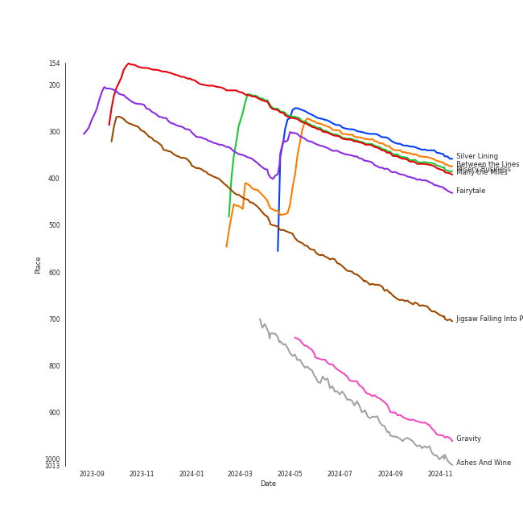

# Tracks in Liked Tracks from 2007

## Artists

| Art | Tracks | 💚 | Artist | 🔗 |
|:---|---:|---:|:---|:---|
|  | 8 | 8 | [Sara Bareilles](../../../artists/sara_bareilles/overview.md) | [🔗](https://open.spotify.com/artist/2Sqr0DXoaYABbjBo9HaMkM) |
|  | 3 | 3 | MIKA | [🔗](https://open.spotify.com/artist/5MmVJVhhYKQ86izuGHzJYA) |
|  | 2 | 2 | A Fine Frenzy | [🔗](https://open.spotify.com/artist/5dTYaRzOn4rXGBLH052EeQ) |
|  | 2 | 2 | [Radiohead](../../../artists/radiohead/overview.md) | [🔗](https://open.spotify.com/artist/4Z8W4fKeB5YxbusRsdQVPb) |
|  | 1 | 1 | Paramore | [🔗](https://open.spotify.com/artist/74XFHRwlV6OrjEM0A2NCMF) |
|  | 1 | 1 | [Beyoncé](../../../artists/beyoncé/overview.md) | [🔗](https://open.spotify.com/artist/6vWDO969PvNqNYHIOW5v0m) |
|  | 1 | 1 | Hatsune Miku | [🔗](https://open.spotify.com/artist/6pNgnvzBa6Bthsv8SrZJYl) |
|  | 1 | 1 | Amy Winehouse | [🔗](https://open.spotify.com/artist/6Q192DXotxtaysaqNPy5yR) |
|  | 1 | 1 | Feist | [🔗](https://open.spotify.com/artist/6CWTBjOJK75cTE8Xv8u1kj) |
|  | 1 | 1 | Ella Fitzgerald | [🔗](https://open.spotify.com/artist/5V0MlUE1Bft0mbLlND7FJz) |

View all

| Art | Tracks | 💚 | Artist | 🔗 |
|:---|---:|---:|:---|:---|
|  | 1 | 1 | OneRepublic | [🔗](https://open.spotify.com/artist/5Pwc4xIPtQLFEnJriah9YJ) |
|  | 1 | 1 | Kanye West | [🔗](https://open.spotify.com/artist/5K4W6rqBFWDnAN6FQUkS6x) |
|  | 1 | 1 | Mark Ronson | [🔗](https://open.spotify.com/artist/3hv9jJF3adDNsBSIQDqcjp) |
|  | 1 | 1 | Wonder Girls | [🔗](https://open.spotify.com/artist/3Cv2vi3WTl8VZOTdrBkKdM) |
|  | 1 | 1 | [Rilo Kiley](../../../artists/rilo_kiley/overview.md) | [🔗](https://open.spotify.com/artist/2cevwbv7ISD92VMNLYLHZA) |
|  | 1 | 1 | Nightwish | [🔗](https://open.spotify.com/artist/2NPduAUeLVsfIauhRwuft1) |
|  | 1 | 1 | [Michael Bublé](../../../artists/michael_bublé/overview.md) | [🔗](https://open.spotify.com/artist/1GxkXlMwML1oSg5eLPiAz3) |
|  | 1 | 1 | Louis Armstrong | [🔗](https://open.spotify.com/artist/19eLuQmk9aCobbVDHc6eek) |
|  | 1 | 1 | Stacey Kent | [🔗](https://open.spotify.com/artist/03EYBMnqSchCMp5D9qmFXi) |

## Albums

| Art | Tracks | 💚 | Album | Release Date | 🔗 |
|:---|---:|---:|:---|:---|:---|
|  | 8 | 8 | Little Voice | 2007-07-03 | [🔗](https://open.spotify.com/album/2Z9WUERfMjOgQ6ze9TcGbF) |
|  | 3 | 3 | Life in Cartoon Motion | 2007-02-05 | [🔗](https://open.spotify.com/album/4wKkXYJXQWDa9sndBSx0gI) |
|  | 2 | 2 | One Cell In The Sea | 2007 | [🔗](https://open.spotify.com/album/0Ot7MEgreG2R93aN42M9iK) |
|  | 2 | 2 | In Rainbows | 2007-12-28 | [🔗](https://open.spotify.com/album/5vkqYmiPBYLaalcmjujWxK) |
|  | 1 | 1 | Version | 2007-07-10 | [🔗](https://open.spotify.com/album/74ooEOK4jY2ZCWjMK6pYmk) |
|  | 1 | 1 | Under The Blacklight (Standard Version) | 2007-08-20 | [🔗](https://open.spotify.com/album/2f9RsTZpsYMLRVZBtW7En8) |
|  | 1 | 1 | The Wonder Years | 2007-09-12 | [🔗](https://open.spotify.com/album/3svp0TRDC5MMUAPNMimAi1) |
|  | 1 | 1 | The Reminder | 2007-01-01 | [🔗](https://open.spotify.com/album/7bTdGfczXffzzNE9ssJj4Z) |
|  | 1 | 1 | Riot! | 2007-06-11 | [🔗](https://open.spotify.com/album/71rziY9eLo1tA2dBMxrwhc) |
|  | 1 | 1 | Love, Ella | 2007-05-03 | [🔗](https://open.spotify.com/album/1y5KGkUKO0NG32MhIIagCA) |

View all

| Art | Tracks | 💚 | Album | Release Date | 🔗 |
|:---|---:|---:|:---|:---|:---|
|  | 1 | 1 | Ievan Polkka | 2007-09-04 | [🔗](https://open.spotify.com/album/1JtScNnTB2JWsnc7AyayIr) |
|  | 1 | 1 | Graduation | 2007-09-11 | [🔗](https://open.spotify.com/album/4SZko61aMnmgvNhfhgTuD3) |
|  | 1 | 1 | Dreaming Out Loud | 2007-01-01 | [🔗](https://open.spotify.com/album/2KSpGeDoNjqCKg6HL8LAyI) |
|  | 1 | 1 | Dark Passion Play | 2007 | [🔗](https://open.spotify.com/album/4oOfQhhbHBfIcIDwuJjwTy) |
|  | 1 | 1 | Call Me Irresponsible | 2007-04-27 | [🔗](https://open.spotify.com/album/3h4pyWRJIB9ZyRKXChbX22) |
|  | 1 | 1 | Breakfast on the Morning Tram | 2007-09-03 | [🔗](https://open.spotify.com/album/5RwBI4pEinXbIiUhWzAMbX) |
|  | 1 | 1 | B'Day Deluxe Edition | 2007-05-29 | [🔗](https://open.spotify.com/album/0Zd10MKN5j9KwUST0TdBBB) |

## Tracks

| Art | Track | Album | Artists | Label | Rank | 💚 | 🔗 |
|:---|:---|:---|:---|:---|---:|:---|:---|
|  | Silver Lining | Under The Blacklight (Standard Version) | [Rilo Kiley](../../../artists/rilo_kiley/overview.md) | [Warner Records](../../../labels/warner_records) | 289 | 💚 | [🔗](https://open.spotify.com/track/0ieqq1wbtso2UjJWPqJ5Xc) |
|  | Between the Lines | Little Voice | [Sara Bareilles](../../../artists/sara_bareilles/overview.md) | [Epic](../../../labels/epic) | 302 | 💚 | [🔗](https://open.spotify.com/track/2t3b5MZMzsArvQflOUo804) |
|  | Misery Business | Riot! | Paramore | [Fueled By Ramen](../../../labels/fueled_by_ramen) | 308 | 💚 | [🔗](https://open.spotify.com/track/6SpLc7EXZIPpy0sVko0aoU) |
|  | Many the Miles | Little Voice | [Sara Bareilles](../../../artists/sara_bareilles/overview.md) | [Epic](../../../labels/epic) | 311 | 💚 | [🔗](https://open.spotify.com/track/03kCR9HZpX5muU7D8xYPOL) |
|  | Fairytale | Little Voice | [Sara Bareilles](../../../artists/sara_bareilles/overview.md) | [Epic](../../../labels/epic) | 344 | 💚 | [🔗](https://open.spotify.com/track/1q8eyTNRSGEAqSvTATTgIG) |
|  | Jigsaw Falling Into Place | In Rainbows | [Radiohead](../../../artists/radiohead/overview.md) | [XL Recordings](../../../labels/xl_recordings) | 574 | 💚 | [🔗](https://open.spotify.com/track/0YJ9FWWHn9EfnN0lHwbzvV) |
|  | Gravity | Little Voice | [Sara Bareilles](../../../artists/sara_bareilles/overview.md) | [Epic](../../../labels/epic) | 807 | 💚 | [🔗](https://open.spotify.com/track/4oa14QBfWRDfJy2agySy0L) |
|  | Ashes And Wine | One Cell In The Sea | A Fine Frenzy | [Virgin Records](../../../labels/virgin_records) | 846 | 💚 | [🔗](https://open.spotify.com/track/1l9Q5NyhsyodDzIrdtJ6Ub) |
|  | Amaranth | Dark Passion Play | Nightwish | Nuclear Blast Entertainment | 864 | 💚 | [🔗](https://open.spotify.com/track/1vzqcPRQ6P1Uw7NZ5M77wJ) |
|  | Whisper | One Cell In The Sea | A Fine Frenzy | [Virgin Records](../../../labels/virgin_records) | 864 | 💚 | [🔗](https://open.spotify.com/track/3yUJDAcGYn66tg752ErDyC) |

View all

| Art | Track | Album | Artists | Label | Rank | 💚 | 🔗 |
|:---|:---|:---|:---|:---|---:|:---|:---|
|  | Say (All I Need) | Dreaming Out Loud | OneRepublic | [Mosley / Interscope](../../../labels/interscope_records) | 864 | 💚 | [🔗](https://open.spotify.com/track/6H4vq5gz0rlNjH0LBzu4An) |
|  | 1234 | The Reminder | Feist | Universal Music Division Decca Records France | 864 | 💚 | [🔗](https://open.spotify.com/track/2CzWeyC9zlDpIOZPUUKrBW) |
|  | Grace Kelly | Life in Cartoon Motion | MIKA | Casablanca Records/Island UK | 864 | 💚 | [🔗](https://open.spotify.com/track/7dzUZec5MnWMyQnk5klnKR) |
|  | Happy Ending | Life in Cartoon Motion | MIKA | Casablanca Records/Island UK | 864 | 💚 | [🔗](https://open.spotify.com/track/1wl3u4FrzcuBv2LQ97Z6TQ) |
|  | Lollipop | Life in Cartoon Motion | MIKA | Casablanca Records/Island UK | 864 | 💚 | [🔗](https://open.spotify.com/track/1JAnC4VkVIbO7C6Vislnue) |
|  | Everything | Call Me Irresponsible | [Michael Bublé](../../../artists/michael_bublé/overview.md) | [143](../../../labels/143), [Reprise](../../../labels/reprise) | 864 | 💚 | [🔗](https://open.spotify.com/track/4T6HLdP6OcAtqC6tGnQelG) |
|  | Dream A Little Dream Of Me - Single Version | Love, Ella | Ella Fitzgerald, Louis Armstrong | Verve Reissues | 864 | 💚 | [🔗](https://open.spotify.com/track/78MI7mu1LV1k4IA2HzKmHe) |
|  | Listen (From the Motion Picture "Dreamgirls") | B'Day Deluxe Edition | [Beyoncé](../../../artists/beyoncé/overview.md) | [Columbia](../../../labels/columbia) | 864 | 💚 | [🔗](https://open.spotify.com/track/4z7Ja0RNran3XpIvc1PIQz) |
|  | Bottle It Up | Little Voice | [Sara Bareilles](../../../artists/sara_bareilles/overview.md) | [Epic](../../../labels/epic) | 864 | 💚 | [🔗](https://open.spotify.com/track/3kfHdr2sYF2EeWEmBHquVj) |
|  | Come Round Soon | Little Voice | [Sara Bareilles](../../../artists/sara_bareilles/overview.md) | [Epic](../../../labels/epic) | 864 | 💚 | [🔗](https://open.spotify.com/track/0jkVXytWSisMUtrBEej9mi) |
|  | Love On the Rocks | Little Voice | [Sara Bareilles](../../../artists/sara_bareilles/overview.md) | [Epic](../../../labels/epic) | 864 | 💚 | [🔗](https://open.spotify.com/track/45bHK5dR8PeWcuMJqmpsP1) |
|  | Love Song | Little Voice | [Sara Bareilles](../../../artists/sara_bareilles/overview.md) | [Epic](../../../labels/epic) | 864 | 💚 | [🔗](https://open.spotify.com/track/4E6cwWJWZw2zWf7VFbH7wf) |
|  | Valerie (feat. Amy Winehouse) - Version Revisited | Version | Mark Ronson, Amy Winehouse | [RCA Records Label](../../../labels/rca_records_label) | 864 | 💚 | [🔗](https://open.spotify.com/track/631U6DaszJisq3TiaQ0vTM) |
|  | Breakfast on the Morning Tram | Breakfast on the Morning Tram | Stacey Kent | Parlophone (France) | 864 | 💚 | [🔗](https://open.spotify.com/track/0mcs5XA4bwgCVYLUxvJ9sg) |
|  | Ievan Polkka | Ievan Polkka | Hatsune Miku | CMMG | 864 | 💚 | [🔗](https://open.spotify.com/track/2otYBUFkdIJSrHAPTEDeOm) |
|  | Can't Tell Me Nothing | Graduation | Kanye West | Roc-A-Fella | 864 | 💚 | [🔗](https://open.spotify.com/track/0mEdbdeRFQwBhN4xfyIeUM) |
|  | Tell Me | The Wonder Years | Wonder Girls | [Republic Records](../../../labels/republic_records) | 864 | 💚 | [🔗](https://open.spotify.com/track/2UuKZDzjZ7cVMOvpmuAMYj) |
|  | Reckoner | In Rainbows | [Radiohead](../../../artists/radiohead/overview.md) | [XL Recordings](../../../labels/xl_recordings) | 864 | 💚 | [🔗](https://open.spotify.com/track/02ppMPbg1OtEdHgoPqoqju) |

