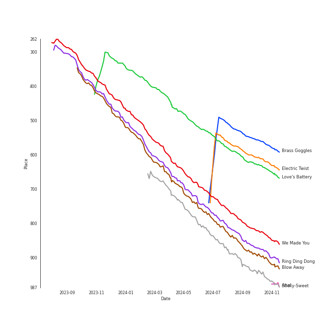

# Tracks in Liked Tracks from 2009

## Artists

| Art | Rank | Tracks | 💚 | Artist | 🔗 |
|:---|---:|---:|---:|:---|:---|
|  | 80 | 6 | 6 | [Florence + The Machine](../../../artists/florence_+_the_machine/overview.md) | [🔗](https://open.spotify.com/artist/1moxjboGR7GNWYIMWsRjgG) |
|  | 420 | 3 | 3 | Erin McCarley | [🔗](https://open.spotify.com/artist/6Y4bCmUNPDKqc7dHkVvgim) |
|  | 424 | 3 | 3 | [Imogen Heap](../../../artists/imogen_heap/overview.md) | [🔗](https://open.spotify.com/artist/6Xb4ezwoAQC4516kI89nWz) |
|  | 315 | 2 | 2 | A Fine Frenzy | [🔗](https://open.spotify.com/artist/5dTYaRzOn4rXGBLH052EeQ) |
|  | 434 | 2 | 2 | Carrie Underwood | [🔗](https://open.spotify.com/artist/4xFUf1FHVy696Q1JQZMTRj) |
|  | 139 | 2 | 2 | [Lady Gaga](../../../artists/lady_gaga/overview.md) | [🔗](https://open.spotify.com/artist/1HY2Jd0NmPuamShAr6KMms) |
|  | 325 | 1 | 1 | [Eminem](../../../artists/eminem/overview.md) | [🔗](https://open.spotify.com/artist/7dGJo4pcD2V6oG8kP0tJRR) |
|  | 141 | 1 | 1 | [Beyoncé](../../../artists/beyoncé/overview.md) | [🔗](https://open.spotify.com/artist/6vWDO969PvNqNYHIOW5v0m) |
|  | 363 | 1 | 1 | Madonna | [🔗](https://open.spotify.com/artist/6tbjWDEIzxoDsBA1FuhfPW) |
|  | 85 | 1 | 1 | [SUPER JUNIOR](../../../artists/super_junior/overview.md) | [🔗](https://open.spotify.com/artist/6gzXCdfYfFe5XKhPKkYqxV) |

View all

| Art | Rank | Tracks | 💚 | Artist | 🔗 |
|:---|---:|---:|---:|:---|:---|
|  | 132 | 1 | 1 | [Rihanna](../../../artists/rihanna/overview.md) | [🔗](https://open.spotify.com/artist/5pKCCKE2ajJHZ9KAiaK11H) |
|  | 329 | 1 | 1 | HONG JIN YOUNG | [🔗](https://open.spotify.com/artist/5LwiBgLTllBUiqQGNiQ7jY) |
|  | 434 | 1 | 1 | Anjulie | [🔗](https://open.spotify.com/artist/4DTbdShHu2RPYEEMUp2XWV) |
|  | 434 | 1 | 1 | Regina Spektor | [🔗](https://open.spotify.com/artist/3z6Gk257P9jNcZbBXJNX5i) |
|  | 434 | 1 | 1 | Mumford & Sons | [🔗](https://open.spotify.com/artist/3gd8FJtBJtkRxdfbTu19U2) |
|  | 223 | 1 | 1 | Elton John | [🔗](https://open.spotify.com/artist/3PhoLpVuITZKcymswpck5b) |
|  | 336 | 1 | 1 | Justin Timberlake | [🔗](https://open.spotify.com/artist/31TPClRtHm23RisEBtV3X7) |
|  | 434 | 1 | 1 | Brandi Carlile | [🔗](https://open.spotify.com/artist/2sG4zTOLvjKG1PSoOyf5Ej) |
|  | 100 | 1 | 1 | [SHINee](../../../artists/shinee/overview.md) | [🔗](https://open.spotify.com/artist/2hRQKC0gqlZGPrmUKbcchR) |
|  | 76 | 1 | 1 | Ciara | [🔗](https://open.spotify.com/artist/2NdeV5rLm47xAvogXrYhJX) |
|  | 134 | 1 | 1 | Steam Powered Giraffe | [🔗](https://open.spotify.com/artist/1yqs45BSh7457Flyhmdv7f) |
|  | 179 | 1 | 1 | Metric | [🔗](https://open.spotify.com/artist/1rCIEwPp5OnXW0ornlSsRl) |
|  | 94 | 1 | 1 | [Michael Bublé](../../../artists/michael_bublé/overview.md) | [🔗](https://open.spotify.com/artist/1GxkXlMwML1oSg5eLPiAz3) |
|  | 21 | 1 | 1 | [Girls' Generation](../../../artists/girls__generation/overview.md) | [🔗](https://open.spotify.com/artist/0Sadg1vgvaPqGTOjxu0N6c) |

## Albums

| Art | Rank | Tracks | 💚 | Album | Release Date | 🔗 |
|:---|---:|---:|---:|:---|:---|:---|
|  | 665 | 6 | 6 | Lungs (Deluxe Edition) | 2009 | [🔗](https://open.spotify.com/album/2FgknX5e7fJlriQtxvpLhZ) |
|  | 644 | 3 | 3 | Love, Save The Empty | 2009 | [🔗](https://open.spotify.com/album/1tF7625TFqvfzMbappj1pQ) |
|  | 643 | 3 | 3 | Ellipse | 2009-08-25 | [🔗](https://open.spotify.com/album/5AYKGPzPBJNHeKehCxMaq0) |
|  | 665 | 2 | 2 | The Fame Monster (Deluxe Edition) | 2009-11-05 | [🔗](https://open.spotify.com/album/6rePArBMb5nLWEaY9aQqL4) |
|  | 665 | 2 | 2 | Play On | 2009 | [🔗](https://open.spotify.com/album/3iLrVuA1k7onNmZTuUQH4u) |
|  | 422 | 2 | 2 | Bomb In A Birdcage | 2009-01-01 | [🔗](https://open.spotify.com/album/07IV5RxLvAUeZbcPm4zOzn) |
|  | 665 | 1 | 1 | 쏘리 쏘리 Sorry, Sorry - The 3rd Album | 2009-03-11 | [🔗](https://open.spotify.com/album/3v5XUoZzxbmJbxs7vWTua3) |
|  | 665 | 1 | 1 | Sigh No More | 2009-10-02 | [🔗](https://open.spotify.com/album/6w5W6ZGTvDsppKUOiGMuMo) |
|  | 568 | 1 | 1 | Relapse: Refill | 2009-05-15 | [🔗](https://open.spotify.com/album/7MZzYkbHL9Tk3O6WeD4Z0Z) |
|  | 665 | 1 | 1 | Rated R | 2009-11-20 | [🔗](https://open.spotify.com/album/7uGmyYwDFJbSc1xs4hkEs2) |

View all

| Art | Rank | Tracks | 💚 | Album | Release Date | 🔗 |
|:---|---:|---:|---:|:---|:---|:---|
|  | 440 | 1 | 1 | Love's Battery | 2009-06-19 | [🔗](https://open.spotify.com/album/03IVWQyi8lzS4t2WQKu5iI) |
|  | 665 | 1 | 1 | Give Up The Ghost | 2009-10-05 | [🔗](https://open.spotify.com/album/1NhFksWs1Nsz6wQI8ysTkv) |
|  | 665 | 1 | 1 | Gee - The First Mini Album | 2009-01-05 | [🔗](https://open.spotify.com/album/4YroJ4NELkaJ34JjEZ6RyJ) |
|  | 665 | 1 | 1 | Far | 2009-06-19 | [🔗](https://open.spotify.com/album/5t0lQDPLF22wmWCtSZkIVv) |
|  | 665 | 1 | 1 | Fantasy Ride | 2009-05-05 | [🔗](https://open.spotify.com/album/5bIi3gz4jULkZV38aTwLPn) |
|  | 665 | 1 | 1 | Fantasies | 2009-04-14 | [🔗](https://open.spotify.com/album/3Oj8FdHcV6kAiOVWfkqRaA) |
|  | 665 | 1 | 1 | Crazy Love | 2009-10-06 | [🔗](https://open.spotify.com/album/3MXDonOIzrIrCh0HvlACyj) |
|  | 665 | 1 | 1 | Celebration (Bonus Track Version) | 2009-09-18 | [🔗](https://open.spotify.com/album/4GU7z3q6fg90MWrkTacYYG) |
|  | 665 | 1 | 1 | Anjulie | 2009-01-01 | [🔗](https://open.spotify.com/album/13ablPhINDfXMbbvgX7eLw) |
|  | 399 | 1 | 1 | Album One | 2009-10-30 | [🔗](https://open.spotify.com/album/60nJMMPYjHWNjli6APs40v) |
|  | 601 | 1 | 1 | 2009, Year Of Us - The Third Mini Album | 2009-10-19 | [🔗](https://open.spotify.com/album/5AH7uBaxp7ojNCvImOeZvC) |

## Tracks

| Art | Track | Album | Artists | Label | Rank | 💚 | 🔗 |
|:---|:---|:---|:---|:---|---:|:---|:---|
|  | Brass Goggles | Album One | Steam Powered Giraffe | Steam Powered Giraffe | 587 | 💚 | [🔗](https://open.spotify.com/track/4Jo29Uu8726KtzclLNBbmc) |
|  | Electric Twist | Bomb In A Birdcage | A Fine Frenzy | [Virgin Records](../../../labels/virgin_records) | 638 | 💚 | [🔗](https://open.spotify.com/track/2jQ7ZztDfmt4qeW0tOMIqY) |
|  | Love's Battery | Love's Battery | HONG JIN YOUNG | 코어콘텐츠미디어 | 658 | 💚 | [🔗](https://open.spotify.com/track/3ODnfFXZP7hLp2fn2KpGGG) |
|  | We Made You | Relapse: Refill | [Eminem](../../../artists/eminem/overview.md) | [Aftermath](../../../labels/aftermath) | 861 | 💚 | [🔗](https://open.spotify.com/track/4UMTp91LHhvW33ol9ZQH0Q) |
|  | Ring Ding Dong | 2009, Year Of Us - The Third Mini Album | [SHINee](../../../artists/shinee/overview.md) | [SM Entertainment](../../../labels/sm_entertainment) | 910 | 💚 | [🔗](https://open.spotify.com/track/4vLqN0bIxIQjlet2mIMBnx) |
|  | Blow Away | Bomb In A Birdcage | A Fine Frenzy | [Virgin Records](../../../labels/virgin_records) | 927 | 💚 | [🔗](https://open.spotify.com/track/2phwpCR68nWlTy8ao0PnK2) |
|  | Aha! | Ellipse | [Imogen Heap](../../../artists/imogen_heap/overview.md) | [RCA Records Label](../../../labels/rca_records_label) | 981 | 💚 | [🔗](https://open.spotify.com/track/42itRd5WoYb42RSYOloJvD) |
|  | Sticky-Sweet | Love, Save The Empty | Erin McCarley | Universal (MT) | 985 | 💚 | [🔗](https://open.spotify.com/track/52UNaCyLmuWZQMFgiIBvyQ) |
|  | It's Not That Easy | Love, Save The Empty | Erin McCarley | Universal (MT) | 1015 | 💚 | [🔗](https://open.spotify.com/track/52XDPMr17ILKppuZRBFwqy) |
|  | SleepWalking | Love, Save The Empty | Erin McCarley | Universal (MT) | 1015 | 💚 | [🔗](https://open.spotify.com/track/5bxPLXz6TCeZtPVx3w4OHM) |

View all

| Art | Track | Album | Artists | Label | Rank | 💚 | 🔗 |
|:---|:---|:---|:---|:---|---:|:---|:---|
|  | Between Two Lungs | Lungs (Deluxe Edition) | [Florence + The Machine](../../../artists/florence_+_the_machine/overview.md) | [Universal-Island Records Ltd.](../../../labels/universal-island_records_ltd_) | 1015 | 💚 | [🔗](https://open.spotify.com/track/5WnYyCWBbJyLChmd2sbZK9) |
|  | Dog Days Are Over | Lungs (Deluxe Edition) | [Florence + The Machine](../../../artists/florence_+_the_machine/overview.md) | [Universal-Island Records Ltd.](../../../labels/universal-island_records_ltd_) | 1015 | 💚 | [🔗](https://open.spotify.com/track/1YLJVmuzeM2YSUkCCaTNUB) |
|  | I'm Not Calling You A Liar | Lungs (Deluxe Edition) | [Florence + The Machine](../../../artists/florence_+_the_machine/overview.md) | [Universal-Island Records Ltd.](../../../labels/universal-island_records_ltd_) | 1015 | 💚 | [🔗](https://open.spotify.com/track/3euILOYDltKArnqpupsE1W) |
|  | Kiss With A Fist | Lungs (Deluxe Edition) | [Florence + The Machine](../../../artists/florence_+_the_machine/overview.md) | [Universal-Island Records Ltd.](../../../labels/universal-island_records_ltd_) | 1015 | 💚 | [🔗](https://open.spotify.com/track/0jv5OcbvTUHgO8FgHhya8b) |
|  | Rabbit Heart (Raise It Up) | Lungs (Deluxe Edition) | [Florence + The Machine](../../../artists/florence_+_the_machine/overview.md) | [Universal-Island Records Ltd.](../../../labels/universal-island_records_ltd_) | 1015 | 💚 | [🔗](https://open.spotify.com/track/5RoLLyMmaEG4WiVMlp7r59) |
|  | You've Got The Love | Lungs (Deluxe Edition) | [Florence + The Machine](../../../artists/florence_+_the_machine/overview.md) | [Universal-Island Records Ltd.](../../../labels/universal-island_records_ltd_) | 1015 | 💚 | [🔗](https://open.spotify.com/track/6u9RqxALwkjJ1ukB1y8vuP) |
|  | Cowboy Casanova | Play On | Carrie Underwood | 19 Recordings Limited / Arista Nashville | 1015 | 💚 | [🔗](https://open.spotify.com/track/6OqdF0vHI9xkqswI7EK0cD) |
|  | Undo It | Play On | Carrie Underwood | 19 Recordings Limited / Arista Nashville | 1015 | 💚 | [🔗](https://open.spotify.com/track/1Fo2N5iXRi37maMboaig7O) |
|  | Boom | Anjulie | Anjulie | Hear Music | 1015 | 💚 | [🔗](https://open.spotify.com/track/2Jf86nCe8O3LgAcflzxuy9) |
|  | Gee | Gee - The First Mini Album | [Girls' Generation](../../../artists/girls__generation/overview.md) | [SM Entertainment](../../../labels/sm_entertainment) | 1015 | 💚 | [🔗](https://open.spotify.com/track/2BQIMF7CyLe2xAKzh74A4C) |
|  | 쏘리 쏘리 Sorry, Sorry | 쏘리 쏘리 Sorry, Sorry - The 3rd Album | [SUPER JUNIOR](../../../artists/super_junior/overview.md) | [SM Entertainment](../../../labels/sm_entertainment) | 1015 | 💚 | [🔗](https://open.spotify.com/track/5w18nowVMRZrC5Na9Vxoth) |
|  | Gimme Sympathy | Fantasies | Metric | Metric Music International | 1015 | 💚 | [🔗](https://open.spotify.com/track/1blxMGAKo9uttR9bHsXCOV) |
|  | Love Sex Magic (feat. Justin Timberlake) | Fantasy Ride | Ciara, Justin Timberlake | LaFace Records | 1015 | 💚 | [🔗](https://open.spotify.com/track/7xdmTEHRbgQuLR8KpRLLnn) |
|  | Eet | Far | Regina Spektor | Sire | 1015 | 💚 | [🔗](https://open.spotify.com/track/0N9WhEz6DiBDvBxa6uJCTY) |
|  | Earth | Ellipse | [Imogen Heap](../../../artists/imogen_heap/overview.md) | [RCA Records Label](../../../labels/rca_records_label) | 1015 | 💚 | [🔗](https://open.spotify.com/track/4zXgNwVhtfDrPLjKs52msC) |
|  | Wait It Out | Ellipse | [Imogen Heap](../../../artists/imogen_heap/overview.md) | [RCA Records Label](../../../labels/rca_records_label) | 1015 | 💚 | [🔗](https://open.spotify.com/track/4xszw2YraekWIpj0SZ6Lp6) |
|  | Like a Prayer | Celebration (Bonus Track Version) | Madonna | [Warner Records](../../../labels/warner_records) | 1015 | 💚 | [🔗](https://open.spotify.com/track/7Bj27KfbcrXFqQd3JsJBUK) |
|  | Little Lion Man | Sigh No More | Mumford & Sons | Glassnote Entertainment Group LLC | 1015 | 💚 | [🔗](https://open.spotify.com/track/6JnufVNLIO5F5Lk4sEVLeI) |
|  | Caroline (feat. Elton John) | Give Up The Ghost | Brandi Carlile, Elton John | [Columbia](../../../labels/columbia) | 1015 | 💚 | [🔗](https://open.spotify.com/track/4DVgaZDTvz72q3jAepAAbe) |
|  | Haven't Met You Yet | Crazy Love | [Michael Bublé](../../../artists/michael_bublé/overview.md) | [143](../../../labels/143), [Reprise](../../../labels/reprise) | 1015 | 💚 | [🔗](https://open.spotify.com/track/4fIWvT19w9PR0VVBuPYpWA) |
|  | Bad Romance | The Fame Monster (Deluxe Edition) | [Lady Gaga](../../../artists/lady_gaga/overview.md) | [Interscope](../../../labels/interscope_records) | 1015 | 💚 | [🔗](https://open.spotify.com/track/0SiywuOBRcynK0uKGWdCnn) |
|  | Telephone | The Fame Monster (Deluxe Edition) | [Lady Gaga](../../../artists/lady_gaga/overview.md), [Beyoncé](../../../artists/beyoncé/overview.md) | [Interscope](../../../labels/interscope_records) | 1015 | 💚 | [🔗](https://open.spotify.com/track/4TCL0qqKyqsMZml0G3M9IM) |
|  | Rude Boy | Rated R | [Rihanna](../../../artists/rihanna/overview.md) | [Def Jam Recordings](../../../labels/def_jam_recordings) | 1015 | 💚 | [🔗](https://open.spotify.com/track/60jzFy6Nn4M0iD1d94oteF) |

