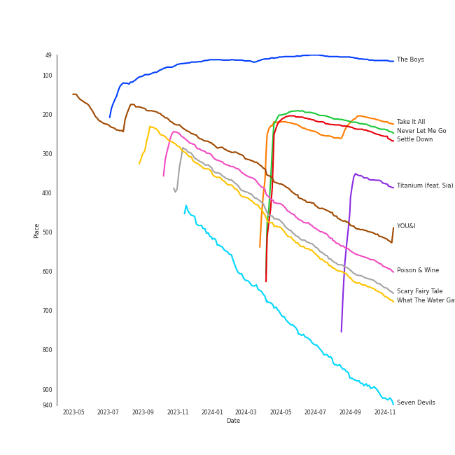

# Tracks in Liked Tracks from 2011

## Artists

| Art | Rank | Tracks | 💚 | Artist | 🔗 |
|:---|---:|---:|---:|:---|:---|
|  | 91 | 7 | 7 | [Kimbra](../../../artists/kimbra/overview.md) | [🔗](https://open.spotify.com/artist/6hk7Yq1DU9QcCCrz9uc0Ti) |
|  | 79 | 6 | 6 | [Florence + The Machine](../../../artists/florence_+_the_machine/overview.md) | [🔗](https://open.spotify.com/artist/1moxjboGR7GNWYIMWsRjgG) |
|  | 139 | 3 | 3 | [Beyoncé](../../../artists/beyoncé/overview.md) | [🔗](https://open.spotify.com/artist/6vWDO969PvNqNYHIOW5v0m) |
|  | 127 | 3 | 3 | [Adele](../../../artists/adele/overview.md) | [🔗](https://open.spotify.com/artist/4dpARuHxo51G3z768sgnrY) |
|  | 305 | 2 | 2 | The Civil Wars | [🔗](https://open.spotify.com/artist/6J7rw7NELJUCThPbAfyLIE) |
|  | 130 | 2 | 2 | [Rihanna](../../../artists/rihanna/overview.md) | [🔗](https://open.spotify.com/artist/5pKCCKE2ajJHZ9KAiaK11H) |
|  | 3 | 2 | 2 | [IU](../../../artists/iu/overview.md) | [🔗](https://open.spotify.com/artist/3HqSLMAZ3g3d5poNaI7GOU) |
|  | 431 | 2 | 2 | Jessie J | [🔗](https://open.spotify.com/artist/2gsggkzM5R49q6jpPvazou) |
|  | 135 | 2 | 2 | [Lady Gaga](../../../artists/lady_gaga/overview.md) | [🔗](https://open.spotify.com/artist/1HY2Jd0NmPuamShAr6KMms) |
|  | 431 | 1 | 1 | Calvin Harris | [🔗](https://open.spotify.com/artist/7CajNmpbOovFoOoasH2HaY) |

View all

| Art | Rank | Tracks | 💚 | Artist | 🔗 |
|:---|---:|---:|---:|:---|:---|
|  | 431 | 1 | 1 | Seth MacFarlane | [🔗](https://open.spotify.com/artist/79D4dipwR6scV8AN3dm7gW) |
|  | 431 | 1 | 1 | J. Cole | [🔗](https://open.spotify.com/artist/6l3HvQ5sa6mXTsMTB19rO5) |
|  | 85 | 1 | 1 | [SUPER JUNIOR](../../../artists/super_junior/overview.md) | [🔗](https://open.spotify.com/artist/6gzXCdfYfFe5XKhPKkYqxV) |
|  | 431 | 1 | 1 | B.o.B | [🔗](https://open.spotify.com/artist/5ndkK3dpZLKtBklKjxNQwT) |
|  | 145 | 1 | 1 | [Sia](../../../artists/sia/overview.md) | [🔗](https://open.spotify.com/artist/5WUlDfRSoLAfcVSX1WnrxN) |
|  | 431 | 1 | 1 | Young the Giant | [🔗](https://open.spotify.com/artist/4j56EQDQu5XnL7R3E9iFJT) |
|  | 431 | 1 | 1 | Birdy | [🔗](https://open.spotify.com/artist/2WX2uTcsvV5OnS0inACecP) |
|  | 23 | 1 | 1 | [Sara Bareilles](../../../artists/sara_bareilles/overview.md) | [🔗](https://open.spotify.com/artist/2Sqr0DXoaYABbjBo9HaMkM) |
|  | 213 | 1 | 1 | David Guetta | [🔗](https://open.spotify.com/artist/1Cs0zKBU1kc0i8ypK3B9ai) |
|  | 370 | 1 | 1 | miss A | [🔗](https://open.spotify.com/artist/1BEohdSWSBggmO979tzRwW) |
|  | 431 | 1 | 1 | Trouble Maker | [🔗](https://open.spotify.com/artist/0ztjVBmFk6OuHq6XBBwMI9) |
|  | 431 | 1 | 1 | Ellie Goulding | [🔗](https://open.spotify.com/artist/0X2BH1fck6amBIoJhDVmmJ) |
|  | 20 | 1 | 1 | [Girls' Generation](../../../artists/girls__generation/overview.md) | [🔗](https://open.spotify.com/artist/0Sadg1vgvaPqGTOjxu0N6c) |

## Albums

| Art | Rank | Tracks | 💚 | Album | Release Date | 🔗 |
|:---|---:|---:|---:|:---|:---|:---|
|  | 183 | 7 | 7 | Vows (Deluxe Version) | 2011 | [🔗](https://open.spotify.com/album/6V9rvW05Um5bIHePPfeI8p) |
|  | 168 | 6 | 6 | Ceremonials - Deluxe Edition | 2011-01-01 | [🔗](https://open.spotify.com/album/5SxudoALxEAVh9l83kSebx) |
|  | 651 | 3 | 3 | 4 | 2011-06-24 | [🔗](https://open.spotify.com/album/1gIC63gC3B7o7FfpPACZQJ) |
|  | 160 | 3 | 3 | 21 | 2011-01-24 | [🔗](https://open.spotify.com/album/0Lg1uZvI312TPqxNWShFXL) |
|  | 651 | 2 | 2 | Who You Are (Platinum Edition) | 2011-01-01 | [🔗](https://open.spotify.com/album/3ga4adzUpLaS2LDcoqfs2r) |
|  | 651 | 2 | 2 | Talk That Talk | 2011-11-19 | [🔗](https://open.spotify.com/album/1Kw1bVd07oRqcjrcjQKC8T) |
|  | 651 | 2 | 2 | Born This Way | 2011-01-01 | [🔗](https://open.spotify.com/album/2KkMVsxymoNR7hRmBcMttd) |
|  | 392 | 2 | 2 | Barton Hollow | 2011-02-01 | [🔗](https://open.spotify.com/album/4uWgDFxGAp7XlVSHuVBv4E) |
|  | 651 | 1 | 1 | Young The Giant (Special Edition) | 2011 | [🔗](https://open.spotify.com/album/2ww7MYrkExsljnKhcINDse) |
|  | 651 | 1 | 1 | Trouble Maker | 2011-12-01 | [🔗](https://open.spotify.com/album/130MEXfaPjOmSkE18F9rJm) |

View all

| Art | Rank | Tracks | 💚 | Album | Release Date | 🔗 |
|:---|---:|---:|---:|:---|:---|:---|
|  | 62 | 1 | 1 | The Boys - The 3rd Album | 2011-10-19 | [🔗](https://open.spotify.com/album/4vGkZl9P0sKxupLdJE7ndS) |
|  | 422 | 1 | 1 | REAL+ | 2011-02-17 | [🔗](https://open.spotify.com/album/79725WrSou2C9RrEUxClUf) |
|  | 258 | 1 | 1 | Nothing but the Beat 2.0 | 2011-08-24 | [🔗](https://open.spotify.com/album/5aprcHwM1KJhaY9Kbxkfkn) |
|  | 651 | 1 | 1 | Music Is Better Than Words | 2011-01-01 | [🔗](https://open.spotify.com/album/6VojJdbXviFkMuemAQ2Ivo) |
|  | 651 | 1 | 1 | Mr. Simple - The 5th Album | 2011-08-02 | [🔗](https://open.spotify.com/album/0eouyQPmljivHfUuG5nYBa) |
|  | 651 | 1 | 1 | Lights | 2011-01-01 | [🔗](https://open.spotify.com/album/3duZhvcaoqdNveQYXf9dMV) |
|  | 317 | 1 | 1 | Last Fantasy | 2011-11-29 | [🔗](https://open.spotify.com/album/149BHv6qAyMgJ483vPi77C) |
|  | 651 | 1 | 1 | Cole World: The Sideline Story | 2011-09-27 | [🔗](https://open.spotify.com/album/0fhmJYVhW0e4i33pCLPA5i) |
|  | 651 | 1 | 1 | Birdy | 2011-11-04 | [🔗](https://open.spotify.com/album/1WGjSVIw0TVfbp5KrOFiP0) |
|  | 651 | 1 | 1 | A Class | 2011-07-18 | [🔗](https://open.spotify.com/album/5Nq0GIIfrsCnUPx4Ayej1c) |

## Tracks

| Art | Track | Album | Artists | Label | Rank | 💚 | 🔗 |
|:---|:---|:---|:---|:---|---:|:---|:---|
|  | The Boys | The Boys - The 3rd Album | [Girls' Generation](../../../artists/girls__generation/overview.md) | [SM Entertainment](../../../labels/sm_entertainment) | 63 | 💚 | [🔗](https://open.spotify.com/track/4sRQg2aoec0VIvQ7GZPGMy) |
|  | Take It All | 21 | [Adele](../../../artists/adele/overview.md) | [XL Recordings](../../../labels/xl_recordings) | 213 | 💚 | [🔗](https://open.spotify.com/track/08YJEcxGtYXwCGqXMZDiyQ) |
|  | Never Let Me Go | Ceremonials - Deluxe Edition | [Florence + The Machine](../../../artists/florence_+_the_machine/overview.md) | [Universal-Island Records Ltd.](../../../labels/universal-island_records_ltd_) | 233 | 💚 | [🔗](https://open.spotify.com/track/6cC9RY7MoUx5z3aHjDTNI6) |
|  | Settle Down | Vows (Deluxe Version) | [Kimbra](../../../artists/kimbra/overview.md) | [Warner Records](../../../labels/warner_records) | 250 | 💚 | [🔗](https://open.spotify.com/track/6cdslY3YKjh7pImxFhSBVG) |
|  | Titanium (feat. Sia) | Nothing but the Beat 2.0 | David Guetta, [Sia](../../../artists/sia/overview.md) | Parlophone (France) | 368 | 💚 | [🔗](https://open.spotify.com/track/0lHAMNU8RGiIObScrsRgmP) |
|  | YOU&I | Last Fantasy | [IU](../../../artists/iu/overview.md) | [Kakao Entertainment](../../../labels/kakao_entertainment) | 507 | 💚 | [🔗](https://open.spotify.com/track/37S86pw74OH8j96ZmMnrpR) |
|  | Poison & Wine | Barton Hollow | The Civil Wars | sensibility recordings | 579 | 💚 | [🔗](https://open.spotify.com/track/4BFudy2Zbryi9a1KFad66B) |
|  | Scary Fairy Tale | REAL+ | [IU](../../../artists/iu/overview.md) | [Kakao Entertainment](../../../labels/kakao_entertainment) | 634 | 💚 | [🔗](https://open.spotify.com/track/4I7QHqHq3luA1ygpWZqqBV) |
|  | What The Water Gave Me | Ceremonials - Deluxe Edition | [Florence + The Machine](../../../artists/florence_+_the_machine/overview.md) | [Universal-Island Records Ltd.](../../../labels/universal-island_records_ltd_) | 654 | 💚 | [🔗](https://open.spotify.com/track/3RiOPzAvhNKuMIdPYOrKV8) |
|  | Seven Devils | Ceremonials - Deluxe Edition | [Florence + The Machine](../../../artists/florence_+_the_machine/overview.md) | [Universal-Island Records Ltd.](../../../labels/universal-island_records_ltd_) | 909 | 💚 | [🔗](https://open.spotify.com/track/5qaLfqAUiqvsoL0l4T05Yx) |

View all

| Art | Track | Album | Artists | Label | Rank | 💚 | 🔗 |
|:---|:---|:---|:---|:---|---:|:---|:---|
|  | Limbo | Vows (Deluxe Version) | [Kimbra](../../../artists/kimbra/overview.md) | [Warner Records](../../../labels/warner_records) | 956 | 💚 | [🔗](https://open.spotify.com/track/6go4VH47IaXtYlTGHizjhm) |
|  | Cameo Lover | Vows (Deluxe Version) | [Kimbra](../../../artists/kimbra/overview.md) | [Warner Records](../../../labels/warner_records) | 994 | 💚 | [🔗](https://open.spotify.com/track/6mEDMe0zG5pYrsRxizjauk) |
|  | Good Intent | Vows (Deluxe Version) | [Kimbra](../../../artists/kimbra/overview.md) | [Warner Records](../../../labels/warner_records) | 994 | 💚 | [🔗](https://open.spotify.com/track/5vLJID1JbJEpYdYLWIGVXf) |
|  | Old Flame | Vows (Deluxe Version) | [Kimbra](../../../artists/kimbra/overview.md) | [Warner Records](../../../labels/warner_records) | 994 | 💚 | [🔗](https://open.spotify.com/track/6bGCWZagdKs2yZKt4H3IlV) |
|  | Plain Gold Ring | Vows (Deluxe Version) | [Kimbra](../../../artists/kimbra/overview.md) | [Warner Records](../../../labels/warner_records) | 994 | 💚 | [🔗](https://open.spotify.com/track/55RJLcVGohfyfuSP4EyE1I) |
|  | Two Way Street | Vows (Deluxe Version) | [Kimbra](../../../artists/kimbra/overview.md) | [Warner Records](../../../labels/warner_records) | 994 | 💚 | [🔗](https://open.spotify.com/track/7ptSTFAis4UckLAfUrMfM0) |
|  | Cough Syrup | Young The Giant (Special Edition) | Young the Giant | Roadrunner Records | 994 | 💚 | [🔗](https://open.spotify.com/track/1UqhkbzB1kuFwt2iy4h29Q) |
|  | Judas | Born This Way | [Lady Gaga](../../../artists/lady_gaga/overview.md) | [Interscope](../../../labels/interscope_records) | 994 | 💚 | [🔗](https://open.spotify.com/track/0QkWikH5Z3U0f79T9iuF6c) |
|  | Yoü And I | Born This Way | [Lady Gaga](../../../artists/lady_gaga/overview.md) | [Interscope](../../../labels/interscope_records) | 994 | 💚 | [🔗](https://open.spotify.com/track/6rkAY9rk1NTFB94QxG3LJR) |
|  | Lover To Lover | Ceremonials - Deluxe Edition | [Florence + The Machine](../../../artists/florence_+_the_machine/overview.md) | [Universal-Island Records Ltd.](../../../labels/universal-island_records_ltd_) | 994 | 💚 | [🔗](https://open.spotify.com/track/1LsZVVQxkbmL9izqfy1RRK) |
|  | No Light, No Light | Ceremonials - Deluxe Edition | [Florence + The Machine](../../../artists/florence_+_the_machine/overview.md) | [Universal-Island Records Ltd.](../../../labels/universal-island_records_ltd_) | 994 | 💚 | [🔗](https://open.spotify.com/track/5nkYDYUSb1bvLJ4nP8CnQ1) |
|  | Shake It Out | Ceremonials - Deluxe Edition | [Florence + The Machine](../../../artists/florence_+_the_machine/overview.md) | [Universal-Island Records Ltd.](../../../labels/universal-island_records_ltd_) | 994 | 💚 | [🔗](https://open.spotify.com/track/4lY95OMGb9WxP6IYut64ir) |
|  | Lights - Single Version | Lights | Ellie Goulding | [Polydor Records](../../../labels/polydor_records) | 994 | 💚 | [🔗](https://open.spotify.com/track/5qftsSFD6Qgndcx13SSqQj) |
|  | Love Won't Let You Get Away | Music Is Better Than Words | Seth MacFarlane, [Sara Bareilles](../../../artists/sara_bareilles/overview.md) | [Fuzzy Door Productions/Universal](../../../labels/universal_music_llc) | 994 | 💚 | [🔗](https://open.spotify.com/track/5xNdKpcKqES50j78ac9woY) |
|  | Price Tag | Who You Are (Platinum Edition) | Jessie J, B.o.B | [Lava Music/Republic Records](../../../labels/republic_records) | 994 | 💚 | [🔗](https://open.spotify.com/track/5mvKuE9Lf9ARVXVXA32kK9) |
|  | Who You Are | Who You Are (Platinum Edition) | Jessie J | [Lava Music/Republic Records](../../../labels/republic_records) | 994 | 💚 | [🔗](https://open.spotify.com/track/65lIGCfW59BxcEJnnIOCq3) |
|  | Set Fire to the Rain | 21 | [Adele](../../../artists/adele/overview.md) | [XL Recordings](../../../labels/xl_recordings) | 994 | 💚 | [🔗](https://open.spotify.com/track/73CMRj62VK8nUS4ezD2wvi) |
|  | Someone Like You | 21 | [Adele](../../../artists/adele/overview.md) | [XL Recordings](../../../labels/xl_recordings) | 994 | 💚 | [🔗](https://open.spotify.com/track/1zwMYTA5nlNjZxYrvBB2pV) |
|  | Barton Hollow | Barton Hollow | The Civil Wars | sensibility recordings | 994 | 💚 | [🔗](https://open.spotify.com/track/6ZOBY9RG2tcxXX0ohKtfRc) |
|  | Countdown | 4 | [Beyoncé](../../../artists/beyoncé/overview.md) | [Columbia](../../../labels/columbia), [Parkwood Entertainment](../../../labels/parkwood_entertainment) | 994 | 💚 | [🔗](https://open.spotify.com/track/3axkNosdVQLZiq1HakuGhc) |
|  | I Was Here | 4 | [Beyoncé](../../../artists/beyoncé/overview.md) | [Columbia](../../../labels/columbia), [Parkwood Entertainment](../../../labels/parkwood_entertainment) | 994 | 💚 | [🔗](https://open.spotify.com/track/64Tp4KN5U5rtqrasP5a7FH) |
|  | Love On Top | 4 | [Beyoncé](../../../artists/beyoncé/overview.md) | [Columbia](../../../labels/columbia), [Parkwood Entertainment](../../../labels/parkwood_entertainment) | 994 | 💚 | [🔗](https://open.spotify.com/track/1z6WtY7X4HQJvzxC4UgkSf) |
|  | Bad Girl Good Girl | A Class | miss A | [Republic Records](../../../labels/republic_records) | 994 | 💚 | [🔗](https://open.spotify.com/track/1EkLacfCJIJcHkJvxlkJKE) |
|  | Mr. Simple | Mr. Simple - The 5th Album | [SUPER JUNIOR](../../../artists/super_junior/overview.md) | [SM Entertainment](../../../labels/sm_entertainment) | 994 | 💚 | [🔗](https://open.spotify.com/track/6QTBYKLlV2PQniwAWrBV2z) |
|  | Work Out | Cole World: The Sideline Story | J. Cole | Roc Nation LLC | 994 | 💚 | [🔗](https://open.spotify.com/track/2wAJTrFhCnQyNSD3oUgTZO) |
|  | Skinny Love | Birdy | Birdy | Atlantic Records UK | 994 | 💚 | [🔗](https://open.spotify.com/track/4RL77hMWUq35NYnPLXBpih) |
|  | Watch n' Learn | Talk That Talk | [Rihanna](../../../artists/rihanna/overview.md) | [Def Jam Recordings](../../../labels/def_jam_recordings) | 994 | 💚 | [🔗](https://open.spotify.com/track/1ROCX1nquOZ5i05YfGysu0) |
|  | We Found Love | Talk That Talk | [Rihanna](../../../artists/rihanna/overview.md), Calvin Harris | [Def Jam Recordings](../../../labels/def_jam_recordings) | 994 | 💚 | [🔗](https://open.spotify.com/track/0U10zFw4GlBacOy9VDGfGL) |
|  | Trouble Maker | Trouble Maker | Trouble Maker | [CUBE ENTERTAINMENT](../../../labels/cube_entertainment) | 994 | 💚 | [🔗](https://open.spotify.com/track/0RP3Qjp1QhIjhtG7gYoBqn) |

