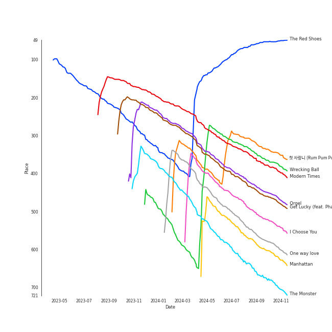

# Tracks in Liked Tracks from 2013

## Artists

| Art | Rank | Tracks | 💚 | Artist | 🔗 |
|:---|---:|---:|---:|:---|:---|
|  | 23 | 13 | 13 | [Sara Bareilles](../../../artists/sara_bareilles/overview.md) | [🔗](https://open.spotify.com/artist/2Sqr0DXoaYABbjBo9HaMkM) |
|  | 3 | 6 | 6 | [IU](../../../artists/iu/overview.md) | [🔗](https://open.spotify.com/artist/3HqSLMAZ3g3d5poNaI7GOU) |
|  | 39 | 6 | 6 | [The Tarpeggios](../../../artists/the_tarpeggios/overview.md) | [🔗](https://open.spotify.com/artist/2HXd5pFHJyaQJr5aXfErrE) |
|  | 34 | 3 | 3 | [Pentatonix](../../../artists/pentatonix/overview.md) | [🔗](https://open.spotify.com/artist/26AHtbjWKiwYzsoGoUZq53) |
|  | 288 | 3 | 3 | [Jason Derulo](../../../artists/jason_derulo/overview.md) | [🔗](https://open.spotify.com/artist/07YZf4WDAMNwqr4jfgOZ8y) |
|  | 11 | 2 | 2 | [LeeHi](../../../artists/leehi/overview.md) | [🔗](https://open.spotify.com/artist/7cVZApDoQZpS447nHTsNqu) |
|  | 110 | 2 | 2 | [Janelle Monáe](../../../artists/janelle_monáe/overview.md) | [🔗](https://open.spotify.com/artist/6ueGR6SWhUJfvEhqkvMsVs) |
|  | 33 | 2 | 2 | [Ariana Grande](../../../artists/ariana_grande/overview.md) | [🔗](https://open.spotify.com/artist/66CXWjxzNUsdJxJ2JdwvnR) |
|  | 266 | 2 | 2 | [Daft Punk](../../../artists/daft_punk/overview.md) | [🔗](https://open.spotify.com/artist/4tZwfgrHOc3mvqYlEYSvVi) |
|  | 166 | 2 | 2 | [f(x)](../../../artists/f(x)/overview.md) | [🔗](https://open.spotify.com/artist/3wRA5UYoo08BBKJnzyKkpF) |

View all

| Art | Rank | Tracks | 💚 | Artist | 🔗 |
|:---|---:|---:|---:|:---|:---|
| | 434 | 1 | 1 | Jang Yi-jeong | [🔗](https://open.spotify.com/artist/7nLakaHt1koh5mP4OIVM0F) |
|  | 434 | 1 | 1 | Roman GianArthur | [🔗](https://open.spotify.com/artist/7hgRzsQGjlm1zifNoigyB9) |
|  | 326 | 1 | 1 | [Eminem](../../../artists/eminem/overview.md) | [🔗](https://open.spotify.com/artist/7dGJo4pcD2V6oG8kP0tJRR) |
|  | 434 | 1 | 1 | Arctic Monkeys | [🔗](https://open.spotify.com/artist/7Ln80lUS6He07XvHI8qqHH) |
|  | 309 | 1 | 1 | HYOLYN | [🔗](https://open.spotify.com/artist/78sJswwVn4P8aEhkF4K6fQ) |
|  | 434 | 1 | 1 | The Neighbourhood | [🔗](https://open.spotify.com/artist/77SW9BnxLY8rJ0RciFqkHh) |
|  | 156 | 1 | 1 | Paramore | [🔗](https://open.spotify.com/artist/74XFHRwlV6OrjEM0A2NCMF) |
|  | 44 | 1 | 1 | [SUNMI](../../../artists/sunmi/overview.md) | [🔗](https://open.spotify.com/artist/6MoXcK2GyGg7FIyxPU5yW6) |
|  | 434 | 1 | 1 | John Legend | [🔗](https://open.spotify.com/artist/5y2Xq6xcjJb2jVM54GHK3t) |
|  | 434 | 1 | 1 | Rania | [🔗](https://open.spotify.com/artist/5sUKi0QlHVxvsCzmrhJsFO) |
|  | 133 | 1 | 1 | [Rihanna](../../../artists/rihanna/overview.md) | [🔗](https://open.spotify.com/artist/5pKCCKE2ajJHZ9KAiaK11H) |
|  | 355 | 1 | 1 | Stromae | [🔗](https://open.spotify.com/artist/5j4HeCoUlzhfWtjAfM1acR) |
|  | 220 | 1 | 1 | Miley Cyrus | [🔗](https://open.spotify.com/artist/5YGY8feqx7naU7z4HrwZM6) |
|  | 434 | 1 | 1 | Tyga | [🔗](https://open.spotify.com/artist/5LHRHt1k9lMyONurDHEdrp) |
|  | 434 | 1 | 1 | 9MUSES | [🔗](https://open.spotify.com/artist/55tJwpPIz9BMrSLM45iEXX) |
|  | 392 | 1 | 1 | HAIM | [🔗](https://open.spotify.com/artist/4Ui2kfOqGujY81UcPrb5KE) |
|  | 102 | 1 | 1 | Nile Rodgers | [🔗](https://open.spotify.com/artist/3yDIp0kaq9EFKe07X1X2rz) |
|  | 243 | 1 | 1 | Little Mix | [🔗](https://open.spotify.com/artist/3e7awlrlDSwF3iM0WBjGMp) |
|  | 25 | 1 | 1 | [EXO](../../../artists/exo/overview.md) | [🔗](https://open.spotify.com/artist/3cjEqqelV9zb4BYE3qDQ4O) |
|  | 61 | 1 | 1 | G-DRAGON | [🔗](https://open.spotify.com/artist/30b9WulBM8sFuBo17nNq9c) |
|  | 273 | 1 | 1 | SISTAR | [🔗](https://open.spotify.com/artist/2wTLheTmMcFCA4hdY8hZJP) |
|  | 100 | 1 | 1 | [SHINee](../../../artists/shinee/overview.md) | [🔗](https://open.spotify.com/artist/2hRQKC0gqlZGPrmUKbcchR) |
|  | 434 | 1 | 1 | Solange | [🔗](https://open.spotify.com/artist/2auiVi8sUZo17dLy1HwrTU) |
|  | 430 | 1 | 1 | Perfume | [🔗](https://open.spotify.com/artist/2XMxWKPKCxoLkSdpCViCnr) |
|  | 267 | 1 | 1 | Pharrell Williams | [🔗](https://open.spotify.com/artist/2RdwBSPQiwcmiDo9kixcl8) |
|  | 162 | 1 | 1 | [Britney Spears](../../../artists/britney_spears/overview.md) | [🔗](https://open.spotify.com/artist/26dSoYclwsYLMAKD3tpOr4) |
|  | 434 | 1 | 1 | Straight No Chaser | [🔗](https://open.spotify.com/artist/1yQ8S4xdGOGbUcpaPR6hCM) |
|  | 434 | 1 | 1 | Julian Casablancas | [🔗](https://open.spotify.com/artist/1rAv1GhTQ2rmG94p9lU3rB) |
|  | 372 | 1 | 1 | miss A | [🔗](https://open.spotify.com/artist/1BEohdSWSBggmO979tzRwW) |
|  | 434 | 1 | 1 | 2 Chainz | [🔗](https://open.spotify.com/artist/17lzZA2AlOHwCwFALHttmp) |
|  | 213 | 1 | 1 | Lorde | [🔗](https://open.spotify.com/artist/163tK9Wjr9P9DmM0AVK7lm) |
|  | 21 | 1 | 1 | [Girls' Generation](../../../artists/girls__generation/overview.md) | [🔗](https://open.spotify.com/artist/0Sadg1vgvaPqGTOjxu0N6c) |

## Albums

| Art | Rank | Tracks | 💚 | Album | Release Date | 🔗 |
|:---|---:|---:|---:|:---|:---|:---|
|  | 277 | 12 | 12 | The Blessed Unrest | 2013-07-16 | [🔗](https://open.spotify.com/album/7lpbyGc4fHsQkBTsfWVBhp) |
|  | 600 | 6 | 6 | Carolina State of Mind | 2013-11-15 | [🔗](https://open.spotify.com/album/3zKusinRVxdC5s2wOPYBgX) |
|  | 49 | 5 | 5 | Modern Times | 2013-10-08 | [🔗](https://open.spotify.com/album/2QcuXvQBWv1ZKyQtEhLbFe) |
|  | 665 | 3 | 3 | PTX, Vol. 2 | 2013-11-05 | [🔗](https://open.spotify.com/album/12dPqNFIdjiVFSHvtsDmzJ) |
|  | 482 | 2 | 2 | Yours Truly | 2013-01-01 | [🔗](https://open.spotify.com/album/5xSvNPstcxHtR4ap2vvN8A) |
|  | 665 | 2 | 2 | The Electric Lady | 2013-09-06 | [🔗](https://open.spotify.com/album/3bnHtSmmsgJiG82hGCmsq9) |
|  | 665 | 2 | 2 | Talk Dirty | 2013-09-10 | [🔗](https://open.spotify.com/album/4PeZu0It7qVrTG40t3HM9A) |
|  | 343 | 2 | 2 | Random Access Memories | 2013-05-20 | [🔗](https://open.spotify.com/album/4m2880jivSbbyEGAKfITCa) |
|  | 251 | 2 | 2 | Pink Tape - The 2nd Album | 2013-07-29 | [🔗](https://open.spotify.com/album/62tuEHFtjk3L6Xjdkzyt4z) |
|  | 665 | 2 | 2 | First Love | 2013-03-28 | [🔗](https://open.spotify.com/album/74thqvuyVQfosFffvKx2uo) |

View all

| Art | Rank | Tracks | 💚 | Album | Release Date | 🔗 |
|:---|---:|---:|---:|:---|:---|:---|
|  | 665 | 1 | 1 | Under the Influence (Ultimate Edition) | 2013-05-07 | [🔗](https://open.spotify.com/album/2jeIoe6RbirPCprvXQnqqn) |
|  | 479 | 1 | 1 | The Marshall Mathers LP2 | 2013-11-05 | [🔗](https://open.spotify.com/album/3vOgbDjgsZBAPwV2M3bNOj) |
|  | 665 | 1 | 1 | The 1st Album 'XOXO' (Repackage) | 2013-08-05 | [🔗](https://open.spotify.com/album/4qduCvpyBL5hGYdBvCvcDA) |
|  | 665 | 1 | 1 | Tattoos (Deluxe Edition) | 2013-09-10 | [🔗](https://open.spotify.com/album/3wDeTllVvayYsWTHsFNWZQ) |
|  | 665 | 1 | 1 | Salute (Expanded Edition) | 2013-11-11 | [🔗](https://open.spotify.com/album/4cH9WxyfNWlfR257RitWBt) |
|  | 336 | 1 | 1 | SHINee The 3rd Album 'The Misconceptions Of Us' | 2013-08-08 | [🔗](https://open.spotify.com/album/0f0brenHcU2NmUANeix9rN) |
|  | 496 | 1 | 1 | Racine Carrée (Standard US Version) | 2013-01-01 | [🔗](https://open.spotify.com/album/22yd3bcffqUO7Pn5nsDaoj) |
|  | 665 | 1 | 1 | Pure Heroine | 2013-09-27 | [🔗](https://open.spotify.com/album/0rmhjUgoVa17LZuS8xWQ3v) |
|  | 665 | 1 | 1 | Paramore | 2013-04-05 | [🔗](https://open.spotify.com/album/4sgYpkIASM1jVlNC8Wp9oF) |
|  | 665 | 1 | 1 | Modern Times – Epilogue | 2013-12-20 | [🔗](https://open.spotify.com/album/56MqewtCUq5bplrqEYTVL0) |
|  | 665 | 1 | 1 | Love In The Future (Expanded Edition) | 2013-08-30 | [🔗](https://open.spotify.com/album/4OTAx9un4e6NfoHuVRiOrC) |
|  | 414 | 1 | 1 | LOVE & HATE | 2013-11-26 | [🔗](https://open.spotify.com/album/26FsnZOVOJDjKeWUbXuDVG) |
|  | 662 | 1 | 1 | LEVEL3 | 2013-10-16 | [🔗](https://open.spotify.com/album/2DdXcewGp8Akqutak3yLDg) |
|  | 665 | 1 | 1 | Just go | 2013-03-08 | [🔗](https://open.spotify.com/album/4rNbLQCtgRSSCvYjk12zX3) |
|  | 665 | 1 | 1 | I Love You. | 2013-04-22 | [🔗](https://open.spotify.com/album/4xkM0BwLM9H2IUcbYzpcBI) |
|  | 532 | 1 | 1 | I GOT A BOY - The 4th Album | 2013-01-01 | [🔗](https://open.spotify.com/album/3uhihQCm9aSvdJmDXcVrvi) |
|  | 538 | 1 | 1 | Hush | 2013-11-06 | [🔗](https://open.spotify.com/album/01zi2Tsa9ojYgPY5Q08aUb) |
|  | 665 | 1 | 1 | Give It To Me | 2013-06-11 | [🔗](https://open.spotify.com/album/1nErNFyYvHnuCYvfwrMyoz) |
|  | 665 | 1 | 1 | Days Are Gone | 2013-09-30 | [🔗](https://open.spotify.com/album/729Vh0HApsm7hGDVjbmtrf) |
|  | 665 | 1 | 1 | DOLLS | 2013-01-24 | [🔗](https://open.spotify.com/album/3gCmOfwfMprkm469ZUyZ6m) |
|  | 665 | 1 | 1 | COUP D'ETAT | 2013-09-05 | [🔗](https://open.spotify.com/album/4msI9bSfKohOPFic15aLR4) |
|  | 665 | 1 | 1 | Britney Jean (Deluxe Version) | 2013-11-30 | [🔗](https://open.spotify.com/album/5rlB2HPoNHg2m1wmmh0TRv) |
|  | 271 | 1 | 1 | Bangerz (Deluxe Version) | 2013-10-04 | [🔗](https://open.spotify.com/album/3RDqXDc1bAETps54MSSOW0) |
|  | 665 | 1 | 1 | AM | 2013-09-09 | [🔗](https://open.spotify.com/album/78bpIziExqiI9qztvNFlQu) |
|  | 665 | 1 | 1 | 24 Hours | 2013-08-26 | [🔗](https://open.spotify.com/album/4ag4tJmAksjMdxICMV83Aw) |

## Tracks

| Art | Track | Album | Artists | Label | Rank | 💚 | 🔗 |
|:---|:---|:---|:---|:---|---:|:---|:---|
|  | The Red Shoes | Modern Times | [IU](../../../artists/iu/overview.md) | [Kakao Entertainment](../../../labels/kakao_entertainment) | 50 | 💚 | [🔗](https://open.spotify.com/track/3atsk5EWI5fNxLMIJnfYfJ) |
|  | 첫 사랑니 (Rum Pum Pum Pum) | Pink Tape - The 2nd Album | [f(x)](../../../artists/f(x)/overview.md) | [SM Entertainment](../../../labels/sm_entertainment) | 358 | 💚 | [🔗](https://open.spotify.com/track/22sIPXiQzcPydCC6skPPPq) |
|  | Wrecking Ball | Bangerz (Deluxe Version) | Miley Cyrus | [RCA Records Label](../../../labels/rca_records_label) | 388 | 💚 | [🔗](https://open.spotify.com/track/2vwlzO0Qp8kfEtzTsCXfyE) |
|  | Modern Times | Modern Times | [IU](../../../artists/iu/overview.md) | [Kakao Entertainment](../../../labels/kakao_entertainment) | 403 | 💚 | [🔗](https://open.spotify.com/track/38Dwg8OrUClCZl2wzUKrmi) |
|  | Orgel | SHINee The 3rd Album 'The Misconceptions Of Us' | [SHINee](../../../artists/shinee/overview.md) | [SM Entertainment](../../../labels/sm_entertainment) | 476 | 💚 | [🔗](https://open.spotify.com/track/5QW673bbf5BnFQcULXUUE5) |
|  | Get Lucky (feat. Pharrell Williams and Nile Rodgers) | Random Access Memories | [Daft Punk](../../../artists/daft_punk/overview.md), Pharrell Williams, Nile Rodgers | [Columbia](../../../labels/columbia) | 486 | 💚 | [🔗](https://open.spotify.com/track/69kOkLUCkxIZYexIgSG8rq) |
|  | I Choose You | The Blessed Unrest | [Sara Bareilles](../../../artists/sara_bareilles/overview.md) | [Epic](../../../labels/epic) | 551 | 💚 | [🔗](https://open.spotify.com/track/7jJH8F3PHlNvxfqEAAfFDl) |
|  | One way love | LOVE & HATE | HYOLYN | [Starship Entertainment](../../../labels/starship_entertainment) | 610 | 💚 | [🔗](https://open.spotify.com/track/2UIXAxLWIPM6ALPGCeeXfH) |
|  | Manhattan | The Blessed Unrest | [Sara Bareilles](../../../artists/sara_bareilles/overview.md) | [Epic](../../../labels/epic) | 635 | 💚 | [🔗](https://open.spotify.com/track/0aSgzAUObtmSSwh1yO6shv) |
|  | The Monster | The Marshall Mathers LP2 | [Eminem](../../../artists/eminem/overview.md), [Rihanna](../../../artists/rihanna/overview.md) | [Aftermath](../../../labels/aftermath) | 716 | 💚 | [🔗](https://open.spotify.com/track/48RrDBpOSSl1aLVCalGl5C) |

View all

| Art | Track | Album | Artists | Label | Rank | 💚 | 🔗 |
|:---|:---|:---|:---|:---|---:|:---|:---|
|  | Baby I | Yours Truly | [Ariana Grande](../../../artists/ariana_grande/overview.md) | [Universal Records](../../../labels/universal_music_llc) | 724 | 💚 | [🔗](https://open.spotify.com/track/6EIsMa5lbvljYxqCkjZVDi) |
|  | Papaoutai | Racine Carrée (Standard US Version) | Stromae | Universal Music Distributed Labels | 744 | 💚 | [🔗](https://open.spotify.com/track/1QFw2xxyQtgKjlrMCEqsNj) |
|  | I GOT A BOY | I GOT A BOY - The 4th Album | [Girls' Generation](../../../artists/girls__generation/overview.md) | [SM Entertainment](../../../labels/sm_entertainment) | 807 | 💚 | [🔗](https://open.spotify.com/track/2WkPfNd237yc0l5KewCDpp) |
|  | Hush | Hush | miss A | [Republic Records](../../../labels/republic_records) | 815 | 💚 | [🔗](https://open.spotify.com/track/3jb7gznZVfqyMQGJo4hzG2) |
|  | Hercules | The Blessed Unrest | [Sara Bareilles](../../../artists/sara_bareilles/overview.md) | [Epic](../../../labels/epic) | 852 | 💚 | [🔗](https://open.spotify.com/track/1Ng4tk8lYfiwXbw4t8gdA2) |
|  | Obliviate | Modern Times | [IU](../../../artists/iu/overview.md) | [Kakao Entertainment](../../../labels/kakao_entertainment) | 883 | 💚 | [🔗](https://open.spotify.com/track/2RENeWPEosqVewFaHSNnjT) |
|  | Settle Down | Carolina State of Mind | [The Tarpeggios](../../../artists/the_tarpeggios/overview.md) | [The Tarpeggios](../../../labels/the_tarpeggios) | 910 | 💚 | [🔗](https://open.spotify.com/track/2RGGnyqlJ65QcpA4FggZ2x) |
|  | だいじょばない | LEVEL3 | Perfume | [Universal Music LLC](../../../labels/universal_music_llc) | 1002 | 💚 | [🔗](https://open.spotify.com/track/24UeVxRQCinBJtTwWT1158) |
|  | Honeymoon Avenue | Yours Truly | [Ariana Grande](../../../artists/ariana_grande/overview.md) | [Universal Records](../../../labels/universal_music_llc) | 1015 | 💚 | [🔗](https://open.spotify.com/track/2ofOe2OaXFpZF5ETbsc7Qu) |
|  | Dolls | DOLLS | 9MUSES | Star Empire | 1015 | 💚 | [🔗](https://open.spotify.com/track/1XxT5GxDa5GD8hnhTK2AD6) |
|  | Dr.feel good | Just go | Rania | [Kakao Entertainment](../../../labels/kakao_entertainment) | 1015 | 💚 | [🔗](https://open.spotify.com/track/5bHHIh8rTDH3ukXrdp7lcw) |
|  | It's Over | First Love | [LeeHi](../../../artists/leehi/overview.md) | [YG Entertainment](../../../labels/yg_entertainment) | 1015 | 💚 | [🔗](https://open.spotify.com/track/47PAgx8nAijlmCdJtiq2iE) |
|  | Rose | First Love | [LeeHi](../../../artists/leehi/overview.md) | [YG Entertainment](../../../labels/yg_entertainment) | 1015 | 💚 | [🔗](https://open.spotify.com/track/6MksZu2sx5jzoPszxbRZMw) |
|  | Ain't It Fun | Paramore | Paramore | [Fueled By Ramen](../../../labels/fueled_by_ramen) | 1015 | 💚 | [🔗](https://open.spotify.com/track/1j8z4TTjJ1YOdoFEDwJTQa) |
|  | Sweater Weather | I Love You. | The Neighbourhood | [Columbia](../../../labels/columbia) | 1015 | 💚 | [🔗](https://open.spotify.com/track/2QjOHCTQ1Jl3zawyYOpxh6) |
|  | I Want You Back (feat. Sara Bareilles) | Under the Influence (Ultimate Edition) | Straight No Chaser, [Sara Bareilles](../../../artists/sara_bareilles/overview.md) | [Atlantic Records](../../../labels/atlantic_records) | 1015 | 💚 | [🔗](https://open.spotify.com/track/5teF3el9gP5j2cf7Dvkbm0) |
|  | Instant Crush (feat. Julian Casablancas) | Random Access Memories | [Daft Punk](../../../artists/daft_punk/overview.md), Julian Casablancas | [Columbia](../../../labels/columbia) | 1015 | 💚 | [🔗](https://open.spotify.com/track/2cGxRwrMyEAp8dEbuZaVv6) |
|  | Give it to me | Give It To Me | SISTAR | [Starship Entertainment](../../../labels/starship_entertainment) | 1015 | 💚 | [🔗](https://open.spotify.com/track/1t88m8JUlqn9kf0FLmVta5) |
|  | 1000 Times | The Blessed Unrest | [Sara Bareilles](../../../artists/sara_bareilles/overview.md) | [Epic](../../../labels/epic) | 1015 | 💚 | [🔗](https://open.spotify.com/track/5sulMp8BnWKlR9PqEH5G9M) |
|  | Brave | The Blessed Unrest | [Sara Bareilles](../../../artists/sara_bareilles/overview.md) | [Epic](../../../labels/epic) | 1015 | 💚 | [🔗](https://open.spotify.com/track/6Uy6K3KdmUdAfelUp0SeXn) |
|  | Cassiopeia | The Blessed Unrest | [Sara Bareilles](../../../artists/sara_bareilles/overview.md) | [Epic](../../../labels/epic) | 1015 | 💚 | [🔗](https://open.spotify.com/track/4XGet6CWBb9QoZSHGGT0NM) |
|  | Chasing The Sun | The Blessed Unrest | [Sara Bareilles](../../../artists/sara_bareilles/overview.md) | [Epic](../../../labels/epic) | 1015 | 💚 | [🔗](https://open.spotify.com/track/6lzlRAp5VqLLF78PwnfHjq) |
|  | December | The Blessed Unrest | [Sara Bareilles](../../../artists/sara_bareilles/overview.md) | [Epic](../../../labels/epic) | 1015 | 💚 | [🔗](https://open.spotify.com/track/5I6exXg95LKzq9Eb0hCFXM) |
|  | Eden | The Blessed Unrest | [Sara Bareilles](../../../artists/sara_bareilles/overview.md) | [Epic](../../../labels/epic) | 1015 | 💚 | [🔗](https://open.spotify.com/track/0oihjTriCn7793AJwKBTrJ) |
|  | Islands | The Blessed Unrest | [Sara Bareilles](../../../artists/sara_bareilles/overview.md) | [Epic](../../../labels/epic) | 1015 | 💚 | [🔗](https://open.spotify.com/track/661ZfXbuoFYd3NkgnqaQ3v) |
|  | Little Black Dress | The Blessed Unrest | [Sara Bareilles](../../../artists/sara_bareilles/overview.md) | [Epic](../../../labels/epic) | 1015 | 💚 | [🔗](https://open.spotify.com/track/3MOUUE92JOO8UdVTszYaJ0) |
|  | Satellite Call | The Blessed Unrest | [Sara Bareilles](../../../artists/sara_bareilles/overview.md) | [Epic](../../../labels/epic) | 1015 | 💚 | [🔗](https://open.spotify.com/track/0Jab895fPkyyQdNkMl6nYi) |
|  | 미행 (그림자 : Shadow) | Pink Tape - The 2nd Album | [f(x)](../../../artists/f(x)/overview.md) | [SM Entertainment](../../../labels/sm_entertainment) | 1015 | 💚 | [🔗](https://open.spotify.com/track/1xbJNPLSTtIWgGTt3Uu4gl) |
|  | Growl | The 1st Album 'XOXO' (Repackage) | [EXO](../../../artists/exo/overview.md) | [SM Entertainment](../../../labels/sm_entertainment) | 1015 | 💚 | [🔗](https://open.spotify.com/track/4pi0Elz7B7cLfw37J3bYm9) |
|  | 24 Hours | 24 Hours | [SUNMI](../../../artists/sunmi/overview.md) | [Republic Records](../../../labels/republic_records) | 1015 | 💚 | [🔗](https://open.spotify.com/track/4ayWErdGIvSo4o6a3lMVLt) |
|  | All of Me | Love In The Future (Expanded Edition) | John Legend | [G.O.O.D. Music/Columbia](../../../labels/columbia) | 1015 | 💚 | [🔗](https://open.spotify.com/track/3U4isOIWM3VvDubwSI3y7a) |
|  | CROOKED | COUP D'ETAT | G-DRAGON | [YG Entertainment](../../../labels/yg_entertainment) | 1015 | 💚 | [🔗](https://open.spotify.com/track/4EwNWRBWdZ6bgvxRHlZ8OO) |
|  | Dance Apocalyptic | The Electric Lady | [Janelle Monáe](../../../artists/janelle_monáe/overview.md) | [Bad Boy/Wondaland](../../../labels/bad_boy) | 1015 | 💚 | [🔗](https://open.spotify.com/track/3dUMuxNadGxCE3qXuhCwqa) |
|  | Electric Lady (feat. Solange) | The Electric Lady | [Janelle Monáe](../../../artists/janelle_monáe/overview.md), Roman GianArthur, Solange | [Bad Boy/Wondaland](../../../labels/bad_boy) | 1015 | 💚 | [🔗](https://open.spotify.com/track/69vzkewKl2LPquyEiqD8BB) |
|  | Knee Socks | AM | Arctic Monkeys | Domino Recording Co | 1015 | 💚 | [🔗](https://open.spotify.com/track/2LGdO5MtFdyphi2EihANZG) |
|  | Talk Dirty (feat. 2 Chainz) | Talk Dirty | [Jason Derulo](../../../artists/jason_derulo/overview.md), 2 Chainz | [Beluga Heights/Warner Records](../../../labels/warner_records) | 1015 | 💚 | [🔗](https://open.spotify.com/track/6g6A7qNhTfUgOSH7ROOxTD) |
|  | Trumpets | Talk Dirty | [Jason Derulo](../../../artists/jason_derulo/overview.md) | [Beluga Heights/Warner Records](../../../labels/warner_records) | 1015 | 💚 | [🔗](https://open.spotify.com/track/5KONnBIQ9LqCxyeSPin26k) |
|  | Bubblegum (feat. Tyga) | Tattoos (Deluxe Edition) | [Jason Derulo](../../../artists/jason_derulo/overview.md), Tyga | [Beluga Heights/Warner Records](../../../labels/warner_records) | 1015 | 💚 | [🔗](https://open.spotify.com/track/1EujTZPE2yBYbbwu2vWXvr) |
|  | Royals | Pure Heroine | Lorde | Universal Music New Zealand Limited | 1015 | 💚 | [🔗](https://open.spotify.com/track/2dLLR6qlu5UJ5gk0dKz0h3) |
|  | The Wire | Days Are Gone | HAIM | [Columbia](../../../labels/columbia) | 1015 | 💚 | [🔗](https://open.spotify.com/track/6golelYKuy85o3u0cxIxFK) |
|  | Between the lips (50cm) | Modern Times | [IU](../../../artists/iu/overview.md) | [Kakao Entertainment](../../../labels/kakao_entertainment) | 1015 | 💚 | [🔗](https://open.spotify.com/track/5K8D8VKWxLlS9irhfGlIEi) |
|  | Love of B | Modern Times | [IU](../../../artists/iu/overview.md) | [Kakao Entertainment](../../../labels/kakao_entertainment) | 1015 | 💚 | [🔗](https://open.spotify.com/track/7b3p9nGAWa2fByucNemToA) |
|  | Daft Punk | PTX, Vol. 2 | [Pentatonix](../../../artists/pentatonix/overview.md) | [RCA Records Label](../../../labels/rca_records_label) | 1015 | 💚 | [🔗](https://open.spotify.com/track/6ukvsBzq4d1vBsAUmz7ZVt) |
|  | Run to You | PTX, Vol. 2 | [Pentatonix](../../../artists/pentatonix/overview.md) | [RCA Records Label](../../../labels/rca_records_label) | 1015 | 💚 | [🔗](https://open.spotify.com/track/1bukNCD9JEwNp235Ov0iZH) |
|  | Valentine | PTX, Vol. 2 | [Pentatonix](../../../artists/pentatonix/overview.md) | [RCA Records Label](../../../labels/rca_records_label) | 1015 | 💚 | [🔗](https://open.spotify.com/track/5djjmpqAOlne6d5RSHQmvu) |
|  | Salute | Salute (Expanded Edition) | Little Mix | [Syco Music](../../../labels/syco_music) | 1015 | 💚 | [🔗](https://open.spotify.com/track/1iupzLgX4O0Qosb4yDpYoz) |
|  | Carolina State of Mind | Carolina State of Mind | [The Tarpeggios](../../../artists/the_tarpeggios/overview.md) | [The Tarpeggios](../../../labels/the_tarpeggios) | 1015 | 💚 | [🔗](https://open.spotify.com/track/60xweUiIfi93UhZEDN3DKY) |
|  | Home | Carolina State of Mind | [The Tarpeggios](../../../artists/the_tarpeggios/overview.md) | [The Tarpeggios](../../../labels/the_tarpeggios) | 1015 | 💚 | [🔗](https://open.spotify.com/track/5EiVVKFfodbFiHTCFEB1i3) |
|  | I Knew You Were Trouble | Carolina State of Mind | [The Tarpeggios](../../../artists/the_tarpeggios/overview.md) | [The Tarpeggios](../../../labels/the_tarpeggios) | 1015 | 💚 | [🔗](https://open.spotify.com/track/2uB0wu6NOxNAEYmKvf1VDi) |
|  | Lullabye (Goodnight, My Angel) | Carolina State of Mind | [The Tarpeggios](../../../artists/the_tarpeggios/overview.md) | [The Tarpeggios](../../../labels/the_tarpeggios) | 1015 | 💚 | [🔗](https://open.spotify.com/track/4OXK8cslw5QGKzk6U1yRfU) |
|  | The Scientist | Carolina State of Mind | [The Tarpeggios](../../../artists/the_tarpeggios/overview.md) | [The Tarpeggios](../../../labels/the_tarpeggios) | 1015 | 💚 | [🔗](https://open.spotify.com/track/6NOjptrSCGSEr6vvSQuDmC) |
|  | Work Bitch | Britney Jean (Deluxe Version) | [Britney Spears](../../../artists/britney_spears/overview.md) | [RCA Records Label](../../../labels/rca_records_label) | 1015 | 💚 | [🔗](https://open.spotify.com/track/3KliPMvk1EvFZu9cvkj8p1) |
|  | Friday (feat.Jang Yi-jeong) | Modern Times – Epilogue | [IU](../../../artists/iu/overview.md), Jang Yi-jeong | [Kakao Entertainment](../../../labels/kakao_entertainment) | 1015 | 💚 | [🔗](https://open.spotify.com/track/0GsRx0gPft6RmijIwMsKmG) |

