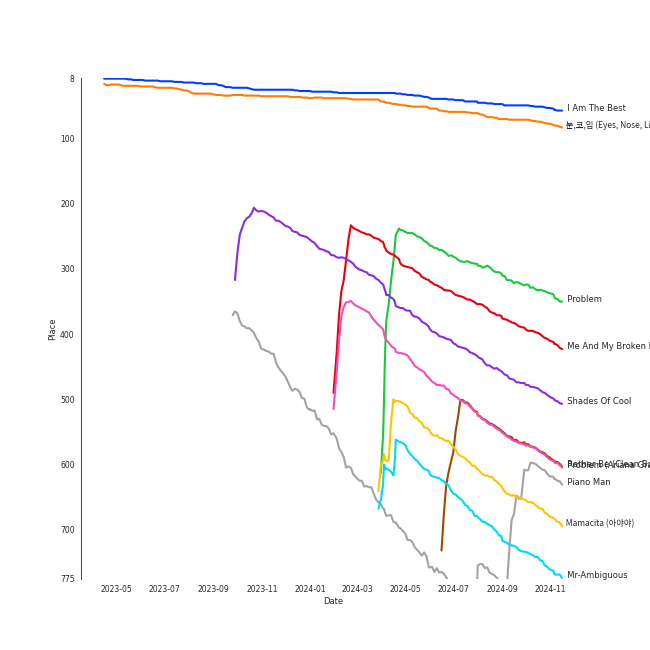

# Tracks in Liked Tracks from 2014

## Artists

| Art | Rank | Tracks | 💚 | Artist | 🔗 |
|:---|---:|---:|---:|:---|:---|
|  | 21 | 7 | 7 | [Taylor Swift](../../../artists/taylor_swift/overview.md) | [🔗](https://open.spotify.com/artist/06HL4z0CvFAxyc27GXpf02) |
|  | 33 | 5 | 5 | [Pentatonix](../../../artists/pentatonix/overview.md) | [🔗](https://open.spotify.com/artist/26AHtbjWKiwYzsoGoUZq53) |
|  | 34 | 4 | 4 | [Ariana Grande](../../../artists/ariana_grande/overview.md) | [🔗](https://open.spotify.com/artist/66CXWjxzNUsdJxJ2JdwvnR) |
|  | 407 | 3 | 3 | [Lindsey Stirling](../../../artists/lindsey_stirling/overview.md) | [🔗](https://open.spotify.com/artist/378dH6EszOLFShpRzAQkVM) |
|  | 65 | 2 | 2 | [AKMU](../../../artists/akmu/overview.md) | [🔗](https://open.spotify.com/artist/6OwKE9Ez6ALxpTaKcT5ayv) |
|  | 407 | 2 | 2 | Hozier | [🔗](https://open.spotify.com/artist/2FXC3k01G6Gw61bmprjgqS) |
|  | 2 | 2 | 2 | [Red Velvet](../../../artists/red_velvet/overview.md) | [🔗](https://open.spotify.com/artist/1z4g3DjTBBZKhvAroFlhOM) |
|  | 13 | 2 | 2 | [MAMAMOO](../../../artists/mamamoo/overview.md) | [🔗](https://open.spotify.com/artist/0XATRDCYuuGhk0oE7C0o5G) |
|  | 16 | 2 | 2 | [Girls' Generation](../../../artists/girls__generation/overview.md) | [🔗](https://open.spotify.com/artist/0Sadg1vgvaPqGTOjxu0N6c) |
|  | 407 | 1 | 1 | Wyvern Lingo | [🔗](https://open.spotify.com/artist/7etzKNDxaZ1LefgbGrexsN) |

View all

| Art | Rank | Tracks | 💚 | Artist | 🔗 |
|:---|---:|---:|---:|:---|:---|
|  | 300 | 1 | 1 | [Eminem](../../../artists/eminem/overview.md) | [🔗](https://open.spotify.com/artist/7dGJo4pcD2V6oG8kP0tJRR) |
|  | 407 | 1 | 1 | Junggigo | [🔗](https://open.spotify.com/artist/6zTIxEXFWjoNu2VXauDITb) |
|  | 55 | 1 | 1 | TAEYANG | [🔗](https://open.spotify.com/artist/6udveWUgX4vu75FF0DTrXV) |
|  | 87 | 1 | 1 | [Kimbra](../../../artists/kimbra/overview.md) | [🔗](https://open.spotify.com/artist/6hk7Yq1DU9QcCCrz9uc0Ti) |
|  | 81 | 1 | 1 | [SUPER JUNIOR](../../../artists/super_junior/overview.md) | [🔗](https://open.spotify.com/artist/6gzXCdfYfFe5XKhPKkYqxV) |
|  | 142 | 1 | 1 | TAEYONG | [🔗](https://open.spotify.com/artist/6SKusTjOAPsTZ6kareKQdm) |
|  | 407 | 1 | 1 | [Clean Bandit](../../../artists/clean_bandit/overview.md) | [🔗](https://open.spotify.com/artist/6MDME20pz9RveH9rEXvrOM) |
|  | 188 | 1 | 1 | Iggy Azalea | [🔗](https://open.spotify.com/artist/5yG7ZAZafVaAlMTeBybKAL) |
|  | 407 | 1 | 1 | A Great Big World | [🔗](https://open.spotify.com/artist/5xKp3UyavIBUsGy3DQdXeF) |
|  | 407 | 1 | 1 | Juicy J | [🔗](https://open.spotify.com/artist/5gCRApTajqwbnHHPbr2Fpi) |
|  | 407 | 1 | 1 | AOA | [🔗](https://open.spotify.com/artist/54gWVQFHf8IIqbjxAoOarN) |
|  | 407 | 1 | 1 | Jess Glynne | [🔗](https://open.spotify.com/artist/4ScCswdRlyA23odg9thgIO) |
|  | 407 | 1 | 1 | Block B | [🔗](https://open.spotify.com/artist/4RnezwRV7VBJUCI1S0AE5u) |
|  | 160 | 1 | 1 | [f(x)](../../../artists/f(x)/overview.md) | [🔗](https://open.spotify.com/artist/3wRA5UYoo08BBKJnzyKkpF) |
|  | 407 | 1 | 1 | SOYOU | [🔗](https://open.spotify.com/artist/3b4kLCI0ZJW47TFsNRqgCb) |
|  | 25 | 1 | 1 | [BTS](../../../artists/bts/overview.md) | [🔗](https://open.spotify.com/artist/3Nrfpe0tUJi4K4DXYWgMUX) |
|  | 4 | 1 | 1 | [IU](../../../artists/iu/overview.md) | [🔗](https://open.spotify.com/artist/3HqSLMAZ3g3d5poNaI7GOU) |
|  | 272 | 1 | 1 | SISTAR | [🔗](https://open.spotify.com/artist/2wTLheTmMcFCA4hdY8hZJP) |
|  | 407 | 1 | 1 | Jessie J | [🔗](https://open.spotify.com/artist/2gsggkzM5R49q6jpPvazou) |
|  | 407 | 1 | 1 | lIlBOI | [🔗](https://open.spotify.com/artist/25wMXkplvEHJpJHX8A6Ved) |
|  | 407 | 1 | 1 | USHER | [🔗](https://open.spotify.com/artist/23zg3TcAtWQy7J6upgbUnj) |
|  | 407 | 1 | 1 | Christina Aguilera | [🔗](https://open.spotify.com/artist/1l7ZsJRRS8wlW3WfJfPfNS) |
|  | 62 | 1 | 1 | 2NE1 | [🔗](https://open.spotify.com/artist/1l0mKo96Jh9HVYONcRl3Yp) |
|  | 204 | 1 | 1 | Lorde | [🔗](https://open.spotify.com/artist/163tK9Wjr9P9DmM0AVK7lm) |
|  | 221 | 1 | 1 | Rixton | [🔗](https://open.spotify.com/artist/0kkxsdcaWmWU2yWAqclDh4) |
|  | 407 | 1 | 1 | Nicki Minaj | [🔗](https://open.spotify.com/artist/0hCNtLu0JehylgoiP8L4Gh) |
|  | 104 | 1 | 1 | [Maroon 5](../../../artists/maroon_5/overview.md) | [🔗](https://open.spotify.com/artist/04gDigrS5kc9YWfZHwBETP) |
|  | 113 | 1 | 1 | [Lana Del Rey](../../../artists/lana_del_rey/overview.md) | [🔗](https://open.spotify.com/artist/00FQb4jTyendYWaN8pK0wa) |

## Albums

| Art | Rank | Tracks | 💚 | Album | Release Date | 🔗 |
|:---|---:|---:|---:|:---|:---|:---|
|  | 591 | 7 | 7 | 1989 | 2014-10-27 | [🔗](https://open.spotify.com/album/2QJmrSgbdM35R67eoGQo4j) |
|  | 276 | 4 | 4 | PTX, Vol. III | 2014-09-23 | [🔗](https://open.spotify.com/album/32y54TelUHSUDWVOx4h1B4) |
|  | 210 | 4 | 4 | My Everything (Deluxe) | 2014-08-22 | [🔗](https://open.spotify.com/album/6EVYTRG1drKdO8OnIQBeEj) |
|  | 468 | 2 | 2 | PLAY | 2014-04-07 | [🔗](https://open.spotify.com/album/1eu07xRE0vQfN5et0Y3DAy) |
|  | 591 | 2 | 2 | Mr. Mr. - The 4th Mini Album | 2014-02-24 | [🔗](https://open.spotify.com/album/1WyHAY8OWdfCFWTF0Ufwjj) |
|  | 591 | 2 | 2 | Hozier (Expanded Edition) | 2014-09-19 | [🔗](https://open.spotify.com/album/4Pv7m8D82A1Xun7xNCKZjJ) |
|  | 489 | 1 | 1 | 행복(Happiness) | 2014-08-01 | [🔗](https://open.spotify.com/album/6MMkaYzyM0aLZmDBce3nL6) |
|  | 591 | 1 | 1 | Yellow Flicker Beat (From The Hunger Games: Mockingjay Part 1) | 2014-09-30 | [🔗](https://open.spotify.com/album/7sg5iqMiDrM2aJqLAmv83V) |
|  | 591 | 1 | 1 | V | 2014-09-02 | [🔗](https://open.spotify.com/album/2Auw0pTT6EcQdvHNimhLQI) |
|  | 303 | 1 | 1 | Ultraviolence (Deluxe) | 2014-01-01 | [🔗](https://open.spotify.com/album/1ORxRsK3MrSLvh7VQTF01F) |

View all

| Art | Rank | Tracks | 💚 | Album | Release Date | 🔗 |
|:---|---:|---:|---:|:---|:---|:---|
|  | 591 | 1 | 1 | The Widow Knows E.P. | 2014-08-14 | [🔗](https://open.spotify.com/album/548WnictHrfJKj2u6tXqFe) |
|  | 591 | 1 | 1 | The Golden Echo | 2014-08-15 | [🔗](https://open.spotify.com/album/66hoUkjxM7tVQwu7bZocwP) |
|  | 591 | 1 | 1 | TOUCH N MOVE | 2014-07-21 | [🔗](https://open.spotify.com/album/0SeSM1CAqu7QUkive4jCKl) |
|  | 591 | 1 | 1 | Some | 2014-02-07 | [🔗](https://open.spotify.com/album/2r1oAmMSnUasXigJ2fTwk6) |
|  | 591 | 1 | 1 | Skool Luv Affair | 2014-02-12 | [🔗](https://open.spotify.com/album/5r35iS0uSSoQBKzQj0IeI3) |
|  | 591 | 1 | 1 | Shatter Me | 2014-04-29 | [🔗](https://open.spotify.com/album/2spbck4ETZz1aLq5Fi5phC) |
|  | 591 | 1 | 1 | SHADYXV | 2014-11-24 | [🔗](https://open.spotify.com/album/6wdSf72duVewXTqhYU3Z87) |
|  | 544 | 1 | 1 | Red Light - The 3rd Album | 2014-07-11 | [🔗](https://open.spotify.com/album/6T9SFwLGHVU75jRAjUJn3W) |
|  | 53 | 1 | 1 | RISE | 2014-06-03 | [🔗](https://open.spotify.com/album/1Y9so4jq4t4taAHu0VdKX3) |
|  | 532 | 1 | 1 | Piano Man | 2014-11-21 | [🔗](https://open.spotify.com/album/1kdURRaOTpDCQqsVIU5CiT) |
|  | 591 | 1 | 1 | PTX | 2014-09-19 | [🔗](https://open.spotify.com/album/77RBn8pRsfXlZdfTQh221D) |
|  | 591 | 1 | 1 | New Eyes | 2014-06-02 | [🔗](https://open.spotify.com/album/4a6DxkhmMvvEdPXxm4ergN) |
|  | 591 | 1 | 1 | MINISKIRT | 2014-01-16 | [🔗](https://open.spotify.com/album/6esB2DBt46m38ZycDPsn8D) |
|  | 395 | 1 | 1 | MAMACITA - The 7th Album | 2014-08-29 | [🔗](https://open.spotify.com/album/53i190Z2uGOLljuS3DCvz2) |
|  | 250 | 1 | 1 | Let The Road | 2014-01-01 | [🔗](https://open.spotify.com/album/02ae5i5UAoFrt2peVox9Xd) |
|  | 591 | 1 | 1 | Is There Anybody Out There? | 2014-01-20 | [🔗](https://open.spotify.com/album/1yOcLa4euMk9sV7rRJ89Dl) |
|  | 591 | 1 | 1 | I Don't Mind (feat. Juicy J) | 2014-11-21 | [🔗](https://open.spotify.com/album/5BAqg5IJQ7XFKfdoCiOlJw) |
|  | 41 | 1 | 1 | I Am The Best | 2014-12-09 | [🔗](https://open.spotify.com/album/7zjLDZzHo2XgvYwpuNwEvK) |
|  | 591 | 1 | 1 | HER | 2014-07-24 | [🔗](https://open.spotify.com/album/5wHs7NGuapCYtY4wWsYMi3) |
|  | 442 | 1 | 1 | HELLO | 2014-06-18 | [🔗](https://open.spotify.com/album/3Z9cZon6ukg4rvGYu7i4NA) |
|  | 591 | 1 | 1 | Be Natural - The 2nd Single | 2014-10-13 | [🔗](https://open.spotify.com/album/4OeQ9nilS4Sy3efzt0hVFi) |
|  | 591 | 1 | 1 | A flower bookmark | 2014-05-16 | [🔗](https://open.spotify.com/album/460uGpon2JwPfRgDohV2bP) |

## Tracks

| Art | Track | Album | Artists | Label | Rank | 💚 | 🔗 |
|:---|:---|:---|:---|:---|---:|:---|:---|
|  | I Am The Best | I Am The Best | 2NE1 | Capitol Records (CAP) | 40 | 💚 | [🔗](https://open.spotify.com/track/26EM9sZnQkLLQxixGd88KE) |
|  | 눈,코,입 (Eyes, Nose, Lips) | RISE | TAEYANG | [YG Entertainment](../../../labels/yg_entertainment) | 59 | 💚 | [🔗](https://open.spotify.com/track/0lYtIvI7bO51PZSeK22Mbz) |
|  | Problem | My Everything (Deluxe) | [Ariana Grande](../../../artists/ariana_grande/overview.md), Iggy Azalea | [Universal Records](../../../labels/universal_music_llc) | 290 | 💚 | [🔗](https://open.spotify.com/track/7vS3Y0IKjde7Xg85LWIEdP) |
|  | Me And My Broken Heart | Let The Road | Rixton | Silent Records/Giant Little Man | 343 | 💚 | [🔗](https://open.spotify.com/track/1oew3nFNY3vMacJAsvry0S) |
|  | Shades Of Cool | Ultraviolence (Deluxe) | [Lana Del Rey](../../../artists/lana_del_rey/overview.md) | [Polydor Records](../../../labels/polydor_records) | 422 | 💚 | [🔗](https://open.spotify.com/track/4VSg5K1hnbmIg4PwRdY6wV) |
|  | Problem (Ariana Grande Cover) | PTX, Vol. III | [Pentatonix](../../../artists/pentatonix/overview.md) | [RCA Records Label](../../../labels/rca_records_label) | 501 | 💚 | [🔗](https://open.spotify.com/track/45h4cCw7ccsRXb0Orle2an) |
|  | Rather Be (Clean Bandit Cover) | PTX, Vol. III | [Pentatonix](../../../artists/pentatonix/overview.md) | [RCA Records Label](../../../labels/rca_records_label) | 532 | 💚 | [🔗](https://open.spotify.com/track/4hxemf0pE0mSzubgsfRLWu) |
|  | Mamacita (아야야) | MAMACITA - The 7th Album | [SUPER JUNIOR](../../../artists/super_junior/overview.md) | [SM Entertainment](../../../labels/sm_entertainment) | 584 | 💚 | [🔗](https://open.spotify.com/track/23z7nLq4CD83EyzeeIokkt) |
|  | Mr-Ambiguous | HELLO | [MAMAMOO](../../../artists/mamamoo/overview.md) | [Genie Music Corporation](../../../labels/genie_music_corporation), [Stone Music Entertainment](../../../labels/stone_music_entertainment) | 653 | 💚 | [🔗](https://open.spotify.com/track/4VOZzJeoNhvvTaGTztogVt) |
|  | Melted | PLAY | [AKMU](../../../artists/akmu/overview.md) | [YG Entertainment](../../../labels/yg_entertainment) | 693 | 💚 | [🔗](https://open.spotify.com/track/2tYPFWrbGbsGKafe5pP64z) |

View all

| Art | Track | Album | Artists | Label | Rank | 💚 | 🔗 |
|:---|:---|:---|:---|:---|---:|:---|:---|
|  | 행복 (Happiness) | 행복(Happiness) | [Red Velvet](../../../artists/red_velvet/overview.md) | [SM Entertainment](../../../labels/sm_entertainment) | 724 | 💚 | [🔗](https://open.spotify.com/track/6XP9L7di5JnOc9WaeAW8oe) |
|  | Piano Man | Piano Man | [MAMAMOO](../../../artists/mamamoo/overview.md) | [Genie Music Corporation](../../../labels/genie_music_corporation), [Stone Music Entertainment](../../../labels/stone_music_entertainment) | 792 | 💚 | [🔗](https://open.spotify.com/track/2CC7fLFEcJBrO82NUwi9Op) |
|  | Dracula | Red Light - The 3rd Album | [f(x)](../../../artists/f(x)/overview.md) | [SM Entertainment](../../../labels/sm_entertainment) | 813 | 💚 | [🔗](https://open.spotify.com/track/5vClivCCQDK6sxmL6MhMFc) |
|  | Miniskirt | MINISKIRT | AOA | [FNC ENTERTAINMENT](../../../labels/fnc_entertainment) | 880 | 💚 | [🔗](https://open.spotify.com/track/6Yj8kVuVR3UPxx9r5eFEoV) |
|  | Say Something | Is There Anybody Out There? | A Great Big World, Christina Aguilera | [Epic](../../../labels/epic) | 880 | 💚 | [🔗](https://open.spotify.com/track/6Vc5wAMmXdKIAM7WUoEb7N) |
|  | Some (feat. Lil Boi) | Some | SOYOU, Junggigo, lIlBOI | Starship Ent. | 880 | 💚 | [🔗](https://open.spotify.com/track/0g1AmSKokPboFrxmG1dxKx) |
|  | Boy in Luv | Skool Luv Affair | [BTS](../../../artists/bts/overview.md) | [BIGHIT MUSIC](../../../labels/bighit_music) | 880 | 💚 | [🔗](https://open.spotify.com/track/3FnDv33WrrMtuEr7hNR3ev) |
|  | Mr.Mr. | Mr. Mr. - The 4th Mini Album | [Girls' Generation](../../../artists/girls__generation/overview.md) | [SM Entertainment](../../../labels/sm_entertainment) | 880 | 💚 | [🔗](https://open.spotify.com/track/3JaMGQXJmtbAhvgl0nBPPN) |
|  | Soul | Mr. Mr. - The 4th Mini Album | [Girls' Generation](../../../artists/girls__generation/overview.md) | [SM Entertainment](../../../labels/sm_entertainment) | 880 | 💚 | [🔗](https://open.spotify.com/track/76ssTbsB9z3eXcAfcEx19r) |
|  | 200% | PLAY | [AKMU](../../../artists/akmu/overview.md) | [YG Entertainment](../../../labels/yg_entertainment) | 880 | 💚 | [🔗](https://open.spotify.com/track/6qkx0tenDglbF21CU4wa1k) |
|  | Shatter Me Featuring Lzzy Hale | Shatter Me | [Lindsey Stirling](../../../artists/lindsey_stirling/overview.md) | Lindseystomp Records | 880 | 💚 | [🔗](https://open.spotify.com/track/2K7j4xrQENCi5r3Hii4cVe) |
|  | Pierrot laughs at us | A flower bookmark | [IU](../../../artists/iu/overview.md) | [Kakao Entertainment](../../../labels/kakao_entertainment) | 880 | 💚 | [🔗](https://open.spotify.com/track/7rx1DA57CL4nGS3AnFGjgJ) |
|  | Rather Be (feat. Jess Glynne) | New Eyes | [Clean Bandit](../../../artists/clean_bandit/overview.md), Jess Glynne | [Big Beat Records/Atlantic](../../../labels/atlantic_records) | 880 | 💚 | [🔗](https://open.spotify.com/track/0am001WwFBVGDGLwRh3ixi) |
|  | Touch my body | TOUCH N MOVE | SISTAR | [Starship Entertainment](../../../labels/starship_entertainment) | 880 | 💚 | [🔗](https://open.spotify.com/track/5crARIrvoMiMf2AdlD78WN) |
|  | JACKPOT | HER | Block B | [Genie Music Corporation](../../../labels/genie_music_corporation), [Stone Music Entertainment](../../../labels/stone_music_entertainment) | 880 | 💚 | [🔗](https://open.spotify.com/track/1T03TbRPcIMuqRLGKD5oRS) |
|  | Used | The Widow Knows E.P. | Wyvern Lingo | Wyvern Lingo | 880 | 💚 | [🔗](https://open.spotify.com/track/6QaBosEz0XcT3YuMYeTI1y) |
|  | Waltz Me to the Grave | The Golden Echo | [Kimbra](../../../artists/kimbra/overview.md) | [Warner Records](../../../labels/warner_records) | 880 | 💚 | [🔗](https://open.spotify.com/track/2p7QlaQFpB2YFwdvt2ArtD) |
|  | Bang Bang | My Everything (Deluxe) | Jessie J, [Ariana Grande](../../../artists/ariana_grande/overview.md), Nicki Minaj | [Universal Records](../../../labels/universal_music_llc) | 880 | 💚 | [🔗](https://open.spotify.com/track/466s1BacUmiRdR3ISvNjyx) |
|  | My Everything | My Everything (Deluxe) | [Ariana Grande](../../../artists/ariana_grande/overview.md) | [Universal Records](../../../labels/universal_music_llc) | 880 | 💚 | [🔗](https://open.spotify.com/track/4eumFsTnduH3zRfaASoAPs) |
|  | One Last Time | My Everything (Deluxe) | [Ariana Grande](../../../artists/ariana_grande/overview.md) | [Universal Records](../../../labels/universal_music_llc) | 880 | 💚 | [🔗](https://open.spotify.com/track/7xoUc6faLbCqZO6fQEYprd) |
|  | Sugar | V | [Maroon 5](../../../artists/maroon_5/overview.md) | [Interscope Records*](../../../labels/interscope_records) | 880 | 💚 | [🔗](https://open.spotify.com/track/2iuZJX9X9P0GKaE93xcPjk) |
|  | Take Me to Church | Hozier (Expanded Edition) | Hozier | [Columbia](../../../labels/columbia) | 880 | 💚 | [🔗](https://open.spotify.com/track/1CS7Sd1u5tWkstBhpssyjP) |
|  | Work Song | Hozier (Expanded Edition) | Hozier | [Columbia](../../../labels/columbia) | 880 | 💚 | [🔗](https://open.spotify.com/track/5TgEJ62DOzBpGxZ7WRsrqb) |
|  | Radioactive | PTX | [Pentatonix](../../../artists/pentatonix/overview.md), [Lindsey Stirling](../../../artists/lindsey_stirling/overview.md) | [RCA Records Label](../../../labels/rca_records_label) | 880 | 💚 | [🔗](https://open.spotify.com/track/7dJGehjbhJvs3K4fWwYTW1) |
|  | La La Latch (Sam Smith/Disclosure/Naughty Boy Mashup) | PTX, Vol. III | [Pentatonix](../../../artists/pentatonix/overview.md) | [RCA Records Label](../../../labels/rca_records_label) | 880 | 💚 | [🔗](https://open.spotify.com/track/6fOqEAXCwboCO4BdzbZG1K) |
|  | Papaoutai (Stromae Cover) (feat. Lindsey Stirling) | PTX, Vol. III | [Pentatonix](../../../artists/pentatonix/overview.md), [Lindsey Stirling](../../../artists/lindsey_stirling/overview.md) | [RCA Records Label](../../../labels/rca_records_label) | 880 | 💚 | [🔗](https://open.spotify.com/track/4LeTorR5FyWgxM3zZI7Qii) |
|  | Yellow Flicker Beat | Yellow Flicker Beat (From The Hunger Games: Mockingjay Part 1) | Lorde | Hunger Games 3/Mockingjay | 880 | 💚 | [🔗](https://open.spotify.com/track/0Nf53RDPZEjFrQE4B5n6Vf) |
|  | Be Natural | Be Natural - The 2nd Single | [Red Velvet](../../../artists/red_velvet/overview.md), TAEYONG | [SM Entertainment](../../../labels/sm_entertainment) | 880 | 💚 | [🔗](https://open.spotify.com/track/41qLzxymjkp0R5vl3REb1S) |
|  | Blank Space | 1989 | [Taylor Swift](../../../artists/taylor_swift/overview.md) | [Big Machine Records, LLC](../../../labels/big_machine_records) | 880 | 💚 | [🔗](https://open.spotify.com/track/1p80LdxRV74UKvL8gnD7ky) |
|  | Clean | 1989 | [Taylor Swift](../../../artists/taylor_swift/overview.md) | [Big Machine Records, LLC](../../../labels/big_machine_records) | 880 | 💚 | [🔗](https://open.spotify.com/track/06WgOCf0LV2h4keYXDRnuh) |
|  | I Know Places | 1989 | [Taylor Swift](../../../artists/taylor_swift/overview.md) | [Big Machine Records, LLC](../../../labels/big_machine_records) | 880 | 💚 | [🔗](https://open.spotify.com/track/3jBMHD19RZdAqG9iFQh7xc) |
|  | Out Of The Woods | 1989 | [Taylor Swift](../../../artists/taylor_swift/overview.md) | [Big Machine Records, LLC](../../../labels/big_machine_records) | 880 | 💚 | [🔗](https://open.spotify.com/track/5OndtwLGA9O6XHFcGm2H7r) |
|  | Shake It Off | 1989 | [Taylor Swift](../../../artists/taylor_swift/overview.md) | [Big Machine Records, LLC](../../../labels/big_machine_records) | 880 | 💚 | [🔗](https://open.spotify.com/track/5xTtaWoae3wi06K5WfVUUH) |
|  | Style | 1989 | [Taylor Swift](../../../artists/taylor_swift/overview.md) | [Big Machine Records, LLC](../../../labels/big_machine_records) | 880 | 💚 | [🔗](https://open.spotify.com/track/4lIxdJw6W3Fg4vUIYCB0S5) |
|  | Wildest Dreams | 1989 | [Taylor Swift](../../../artists/taylor_swift/overview.md) | [Big Machine Records, LLC](../../../labels/big_machine_records) | 880 | 💚 | [🔗](https://open.spotify.com/track/59HjlYCeBsxdI0fcm3zglw) |
|  | I Don't Mind (feat. Juicy J) | I Don't Mind (feat. Juicy J) | USHER, Juicy J | [RCA Records Label](../../../labels/rca_records_label) | 880 | 💚 | [🔗](https://open.spotify.com/track/7aXuop4Qambx5Oi3ynsKQr) |
|  | Lose Yourself | SHADYXV | [Eminem](../../../artists/eminem/overview.md) | 3H | 880 | 💚 | [🔗](https://open.spotify.com/track/77Ft1RJngppZlq59B6uP0z) |

