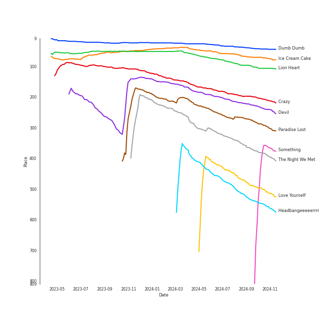

# Tracks in Liked Tracks from 2015

## Artists

| Art | Rank | Tracks | 💚 | Artist | 🔗 |
|:---|---:|---:|---:|:---|:---|
|  | 2 | 7 | 7 | [Red Velvet](../../../artists/red_velvet/overview.md) | [🔗](https://open.spotify.com/artist/1z4g3DjTBBZKhvAroFlhOM) |
|  | 163 | 4 | 4 | [Sia](../../../artists/sia/overview.md) | [🔗](https://open.spotify.com/artist/5WUlDfRSoLAfcVSX1WnrxN) |
|  | 54 | 3 | 3 | [BABYMETAL](../../../artists/babymetal/overview.md) | [🔗](https://open.spotify.com/artist/630wzNP2OL7fl4Xl0GnMWq) |
|  | 413 | 3 | 3 | Leslie Odom Jr. | [🔗](https://open.spotify.com/artist/3cR4rhS2hBWqI7rJEBacvN) |
|  | 413 | 3 | 3 | Original Broadway Cast of Hamilton | [🔗](https://open.spotify.com/artist/3UUJfRbrA2nTbcg4i0MOwu) |
|  | 4 | 3 | 3 | [IU](../../../artists/iu/overview.md) | [🔗](https://open.spotify.com/artist/3HqSLMAZ3g3d5poNaI7GOU) |
|  | 18 | 3 | 3 | [Girls' Generation](../../../artists/girls__generation/overview.md) | [🔗](https://open.spotify.com/artist/0Sadg1vgvaPqGTOjxu0N6c) |
|  | 413 | 2 | 2 | Lin-Manuel Miranda | [🔗](https://open.spotify.com/artist/4aXXDj9aZnlshx7mzj3W1N) |
|  | 20 | 2 | 2 | [EXO](../../../artists/exo/overview.md) | [🔗](https://open.spotify.com/artist/3cjEqqelV9zb4BYE3qDQ4O) |
|  | 413 | 2 | 2 | Twenty One Pilots | [🔗](https://open.spotify.com/artist/3YQKmKGau1PzlVlkL1iodx) |

View all

| Art | Rank | Tracks | 💚 | Artist | 🔗 |
|:---|---:|---:|---:|:---|:---|
|  | 33 | 2 | 2 | [Pentatonix](../../../artists/pentatonix/overview.md) | [🔗](https://open.spotify.com/artist/26AHtbjWKiwYzsoGoUZq53) |
|  | 280 | 2 | 2 | EXID | [🔗](https://open.spotify.com/artist/1xs6WFotNQSXweo0GXrS0O) |
|  | 78 | 2 | 2 | [Florence + The Machine](../../../artists/florence_+_the_machine/overview.md) | [🔗](https://open.spotify.com/artist/1moxjboGR7GNWYIMWsRjgG) |
|  | 272 | 2 | 2 | [Jason Derulo](../../../artists/jason_derulo/overview.md) | [🔗](https://open.spotify.com/artist/07YZf4WDAMNwqr4jfgOZ8y) |
|  | 9 | 1 | 1 | [TWICE](../../../artists/twice/overview.md) | [🔗](https://open.spotify.com/artist/7n2Ycct7Beij7Dj7meI4X0) |
|  | 106 | 1 | 1 | [Janelle Monáe](../../../artists/janelle_monáe/overview.md) | [🔗](https://open.spotify.com/artist/6ueGR6SWhUJfvEhqkvMsVs) |
|  | 413 | 1 | 1 | Christopher Jackson | [🔗](https://open.spotify.com/artist/6sLwRSXSUF5JTUnQaFenyj) |
|  | 413 | 1 | 1 | GOT7 | [🔗](https://open.spotify.com/artist/6nfDaffa50mKtEOwR8g4df) |
|  | 218 | 1 | 1 | Lord Huron | [🔗](https://open.spotify.com/artist/6ltzsmQQbmdoHHbLZ4ZN25) |
|  | 83 | 1 | 1 | [SUPER JUNIOR](../../../artists/super_junior/overview.md) | [🔗](https://open.spotify.com/artist/6gzXCdfYfFe5XKhPKkYqxV) |
|  | 122 | 1 | 1 | 4Minute | [🔗](https://open.spotify.com/artist/6cdC1cwqh3eJAXaxXJt2jv) |
|  | 413 | 1 | 1 | Sheppard | [🔗](https://open.spotify.com/artist/6VxCmtR7S3yz4vnzsJqhSV) |
|  | 413 | 1 | 1 | Demi Lovato | [🔗](https://open.spotify.com/artist/6S2OmqARrzebs0tKUEyXyp) |
|  | 413 | 1 | 1 | Kid Ink | [🔗](https://open.spotify.com/artist/6KZDXtSj0SzGOV705nNeh3) |
| | 413 | 1 | 1 | Okieriete Onaodowan | [🔗](https://open.spotify.com/artist/6G3sPhnj4JBCsBVBGvZnkk) |
|  | 413 | 1 | 1 | Ella Eyre | [🔗](https://open.spotify.com/artist/66TrUkUZ3RM29dqeDQRgyA) |
|  | 34 | 1 | 1 | [Ariana Grande](../../../artists/ariana_grande/overview.md) | [🔗](https://open.spotify.com/artist/66CXWjxzNUsdJxJ2JdwvnR) |
|  | 413 | 1 | 1 | Anthony Ramos | [🔗](https://open.spotify.com/artist/660YptcR0hNHJ8iEr1qcse) |
|  | 326 | 1 | 1 | Bebe Rexha | [🔗](https://open.spotify.com/artist/64M6ah0SkkRsnPGtGiRAbb) |
|  | 413 | 1 | 1 | We Are The Night | [🔗](https://open.spotify.com/artist/5UT1mOF7JAjcc7e3wen8vw) |
|  | 413 | 1 | 1 | Tink | [🔗](https://open.spotify.com/artist/4v6XOdonnfpdTKTRJArG7v) |
|  | 32 | 1 | 1 | [BoA](../../../artists/boa/overview.md) | [🔗](https://open.spotify.com/artist/4muJrGMndyYWqZtfk8OWy4) |
|  | 363 | 1 | 1 | Jay Park | [🔗](https://open.spotify.com/artist/4XDi67ZENZcbfKnvMnTYsI) |
|  | 302 | 1 | 1 | Jidenna | [🔗](https://open.spotify.com/artist/4TsHKU8l8Wq7n7OPVikirn) |
|  | 135 | 1 | 1 | [Gain](../../../artists/gain/overview.md) | [🔗](https://open.spotify.com/artist/4R60A85t9mTZzCqJlVswuo) |
|  | 413 | 1 | 1 | Jasmine Cephas-Jones | [🔗](https://open.spotify.com/artist/4H3e5t5utgPvj6Nsuda5QF) |
|  | 413 | 1 | 1 | Funkadelic | [🔗](https://open.spotify.com/artist/450o9jw6AtiQlQkHCdH6Ru) |
|  | 164 | 1 | 1 | [f(x)](../../../artists/f(x)/overview.md) | [🔗](https://open.spotify.com/artist/3wRA5UYoo08BBKJnzyKkpF) |
|  | 413 | 1 | 1 | Daveed Diggs | [🔗](https://open.spotify.com/artist/3twuAojvYNrlWZpMkxLm3P) |
|  | 8 | 1 | 1 | [TAEYEON](../../../artists/taeyeon/overview.md) | [🔗](https://open.spotify.com/artist/3qNVuliS40BLgXGxhdBdqu) |
|  | 413 | 1 | 1 | Mark Ronson | [🔗](https://open.spotify.com/artist/3hv9jJF3adDNsBSIQDqcjp) |
|  | 187 | 1 | 1 | Little Mix | [🔗](https://open.spotify.com/artist/3e7awlrlDSwF3iM0WBjGMp) |
|  | 413 | 1 | 1 | Troye Sivan | [🔗](https://open.spotify.com/artist/3WGpXCj9YhhfX11TToZcXP) |
|  | 413 | 1 | 1 | HELLOVENUS | [🔗](https://open.spotify.com/artist/3TW9U1f93tpGBsEtCSf7JG) |
|  | 332 | 1 | 1 | Caravan Palace | [🔗](https://open.spotify.com/artist/37J1PlAkhRK7yrZUtqaUpQ) |
|  | 413 | 1 | 1 | Brandi Carlile | [🔗](https://open.spotify.com/artist/2sG4zTOLvjKG1PSoOyf5Ej) |
|  | 100 | 1 | 1 | [SHINee](../../../artists/shinee/overview.md) | [🔗](https://open.spotify.com/artist/2hRQKC0gqlZGPrmUKbcchR) |
|  | 413 | 1 | 1 | Sydney James Harcourt | [🔗](https://open.spotify.com/artist/2fHcpUAFhqmfloo2HkBN3e) |
|  | 26 | 1 | 1 | [Sara Bareilles](../../../artists/sara_bareilles/overview.md) | [🔗](https://open.spotify.com/artist/2Sqr0DXoaYABbjBo9HaMkM) |
|  | 413 | 1 | 1 | Phillipa Soo | [🔗](https://open.spotify.com/artist/2OEGI2wrCVmvavKEOMlccy) |
|  | 91 | 1 | 1 | [OH MY GIRL](../../../artists/oh_my_girl/overview.md) | [🔗](https://open.spotify.com/artist/2019zR22qK2RBvCqtudBaI) |
|  | 193 | 1 | 1 | [Justin Bieber](../../../artists/justin_bieber/overview.md) | [🔗](https://open.spotify.com/artist/1uNFoZAHBGtllmzznpCI3s) |
|  | 413 | 1 | 1 | Fifth Harmony | [🔗](https://open.spotify.com/artist/1l8Fu6IkuTP0U5QetQJ5Xt) |
|  | 413 | 1 | 1 | Ripe | [🔗](https://open.spotify.com/artist/19lQ2rJLlP71FOKESiMNJT) |
|  | 413 | 1 | 1 | Girl's Day | [🔗](https://open.spotify.com/artist/13kJgvU22LHMsJtGWLmx7W) |
|  | 413 | 1 | 1 | Dalshabet | [🔗](https://open.spotify.com/artist/10xsuRNvidaOLxWd3fRIel) |
|  | 413 | 1 | 1 | CL | [🔗](https://open.spotify.com/artist/0tzSBCPJZmHTdOA3ZV2mN3) |
|  | 92 | 1 | 1 | [Bruno Mars](../../../artists/bruno_mars/overview.md) | [🔗](https://open.spotify.com/artist/0du5cEVh5yTK9QJze8zA0C) |
|  | 13 | 1 | 1 | [MAMAMOO](../../../artists/mamamoo/overview.md) | [🔗](https://open.spotify.com/artist/0XATRDCYuuGhk0oE7C0o5G) |
|  | 408 | 1 | 1 | Isyana Sarasvati | [🔗](https://open.spotify.com/artist/05CRzFTp7TouOXPuH6Tapu) |
|  | 413 | 1 | 1 | G-Eazy | [🔗](https://open.spotify.com/artist/02kJSzxNuaWGqwubyUba0Z) |

## Albums

| Art | Rank | Tracks | 💚 | Album | Release Date | 🔗 |
|:---|---:|---:|---:|:---|:---|:---|
|  | 37 | 5 | 5 | The Red - The 1st Album | 2015-09-09 | [🔗](https://open.spotify.com/album/6YL9J0E6PGtYzkhyMxnmXd) |
|  | 610 | 4 | 4 | 1000 Forms Of Fear (Deluxe Version) | 2015-05-04 | [🔗](https://open.spotify.com/album/6FdNvoO5sF4EKwCX9je1MH) |
|  | 610 | 3 | 3 | Hamilton (Original Broadway Cast Recording) | 2015-09-25 | [🔗](https://open.spotify.com/album/1kCHru7uhxBUdzkm4gzRQc) |
|  | 595 | 3 | 3 | CHAT-SHIRE | 2015-10-23 | [🔗](https://open.spotify.com/album/3rMvAe0zU0pJRnRa7Rfc1U) |
|  | 346 | 3 | 3 | BABYMETAL | 2015-05-11 | [🔗](https://open.spotify.com/album/6Eepi724OOt38pTaUrZErI) |
|  | 610 | 2 | 2 | Pentatonix (Deluxe Version) | 2015-10-16 | [🔗](https://open.spotify.com/album/6qf9tE8pNRW0kX1Cucrixr) |
|  | 80 | 2 | 2 | Lion Heart - The 5th Album | 2015-08-19 | [🔗](https://open.spotify.com/album/4eKdn0skJCidO2wqIJyCgB) |
|  | 57 | 2 | 2 | Ice Cream Cake - The 1st Mini Album | 2015-03-17 | [🔗](https://open.spotify.com/album/27cBQ5FDqv0xLgiJ7qNpZr) |
|  | 610 | 2 | 2 | How Big, How Blue, How Beautiful | 2015-06-01 | [🔗](https://open.spotify.com/album/2btszoya78vyT8fwelmVnz) |
|  | 610 | 2 | 2 | Blurryface | 2015-05-15 | [🔗](https://open.spotify.com/album/3cQO7jp5S9qLBoIVtbkSM1) |

View all

| Art | Rank | Tracks | 💚 | Album | Release Date | 🔗 |
|:---|---:|---:|---:|:---|:---|:---|
|  | 368 | 2 | 2 | AH YEAH | 2015-04-14 | [🔗](https://open.spotify.com/album/54r8xseUAz0c9ORidjAKmZ) |
|  | 610 | 1 | 1 | Young Soul Rebels (Original Soundtrack) [Digitally Remastered] | 2015-05-05 | [🔗](https://open.spotify.com/album/68VvPqFOLXUtnn8NfrQpIe) |
|  | 384 | 1 | 1 | Yoga | 2015-03-31 | [🔗](https://open.spotify.com/album/5rzxGeVyCV74SvV5hjLRAU) |
|  | 610 | 1 | 1 | WiggleWiggle | 2015-01-05 | [🔗](https://open.spotify.com/album/6NoXyAXGGRrnRkt9qVkR8W) |
|  | 610 | 1 | 1 | When It's Dark Out | 2015-12-04 | [🔗](https://open.spotify.com/album/09Q3WwGYsQe5ognkvVkmCu) |
|  | 610 | 1 | 1 | What's Inside: Songs from Waitress | 2015-11-06 | [🔗](https://open.spotify.com/album/1s6codM2ZAB008t9GTyaEk) |
|  | 610 | 1 | 1 | Uptown Special | 2015-01-12 | [🔗](https://open.spotify.com/album/3vLaOYCNCzngDf8QdBg2V1) |
|  | 610 | 1 | 1 | Tiramisu Cake | 2015-04-29 | [🔗](https://open.spotify.com/album/3eAZuza8f2Ga4IG1KUDc2j) |
|  | 405 | 1 | 1 | The Story Begins | 2015-10-20 | [🔗](https://open.spotify.com/album/72WWZVAx6GtSbEeGESwDLo) |
|  | 610 | 1 | 1 | The Firewatcher's Daughter | 2015-03-06 | [🔗](https://open.spotify.com/album/5ZpxRLVRkCZ2BXXW1KYbTB) |
|  | 251 | 1 | 1 | Strange Trails | 2015-04-07 | [🔗](https://open.spotify.com/album/3yoNZlqerJnsnMN5EDwwBS) |
|  | 610 | 1 | 1 | Reflection (Deluxe) | 2015-01-30 | [🔗](https://open.spotify.com/album/0zAsh6hObeNmFgFPrUiFcP) |
|  | 325 | 1 | 1 | Purpose (Deluxe) | 2015-11-13 | [🔗](https://open.spotify.com/album/6Fr2rQkZ383FcMqFyT7yPr) |
|  | 610 | 1 | 1 | Pink Funky | 2015-06-19 | [🔗](https://open.spotify.com/album/5Fy5PyBWqMNK7xvXO9Q32f) |
|  | 610 | 1 | 1 | Odd - The 4th Album | 2015-05-18 | [🔗](https://open.spotify.com/album/47zSQLQWjPLmiEbCpOOEJa) |
|  | 610 | 1 | 1 | MOMMAE | 2015-05-22 | [🔗](https://open.spotify.com/album/1kgzGqeJbY7gwiheabVk1L) |
|  | 610 | 1 | 1 | LOVE ME RIGHT - The 2nd Album Repackage | 2015-06-03 | [🔗](https://open.spotify.com/album/2tSO8aEYf5YvpwmvvrOWH7) |
|  | 610 | 1 | 1 | Kiss My Lips - The 8th Album | 2015-05-12 | [🔗](https://open.spotify.com/album/0SmJjNGEXCMp5bTGbxmjyy) |
|  | 610 | 1 | 1 | Just Right | 2015-07-13 | [🔗](https://open.spotify.com/album/4159syQKTGC1JSJN4xBScv) |
|  | 610 | 1 | 1 | Joker is Alive | 2015-04-15 | [🔗](https://open.spotify.com/album/3jYpoS7JeJ8i8q3OHVNYXZ) |
|  | 610 | 1 | 1 | I - The 1st Mini Album | 2015-10-07 | [🔗](https://open.spotify.com/album/4e7kLQu7SKBUiMtV5WH3A1) |
|  | 610 | 1 | 1 | Hey Hello | 2015-07-27 | [🔗](https://open.spotify.com/album/1hPQOTErkj7sRrlMXuSqnX) |
|  | 610 | 1 | 1 | Hello Bitches | 2015-12-05 | [🔗](https://open.spotify.com/album/1pu6aEuAKBdTdQLSbfBNTG) |
|  | 188 | 1 | 1 | Hawwah | 2015-03-12 | [🔗](https://open.spotify.com/album/1fghVqJ812j2fqPYrSFd0Q) |
|  | 610 | 1 | 1 | Girl's Day Love Second Album | 2015-07-07 | [🔗](https://open.spotify.com/album/6bf0r561nSUanYZ9ej56Me) |
|  | 610 | 1 | 1 | Get Weird (Expanded Edition) | 2015-11-06 | [🔗](https://open.spotify.com/album/2FnfZiFMv7bmXAIATOJDHs) |
|  | 495 | 1 | 1 | Focus | 2015-10-30 | [🔗](https://open.spotify.com/album/3IGM1sXYke2UGII2DORrof) |
|  | 592 | 1 | 1 | Everything Is 4 | 2015-05-29 | [🔗](https://open.spotify.com/album/59eUYETmE1zi31ESb3SUkI) |
|  | 610 | 1 | 1 | Ella Eyre | 2015-01-12 | [🔗](https://open.spotify.com/album/5J69OYtRXeI9dHDK2R95h5) |
|  | 596 | 1 | 1 | EXPLORE! | 2015-11-25 | [🔗](https://open.spotify.com/album/6TXaOwBLoyJrD6vem7L8Ba) |
|  | 600 | 1 | 1 | EXODUS - The 2nd Album | 2015-03-30 | [🔗](https://open.spotify.com/album/0PepQsL30ADZO7gc4Tz7Af) |
|  | 155 | 1 | 1 | DEVIL - SUPER JUNIOR SPECIAL ALBUM | 2015-07-16 | [🔗](https://open.spotify.com/album/4YdR3Qy3eZXsLGIXaEAw8o) |
|  | 143 | 1 | 1 | Crazy | 2015-02-09 | [🔗](https://open.spotify.com/album/5ooERKclQluBVu00PIH9Xm) |
|  | 610 | 1 | 1 | Confident | 2015-01-01 | [🔗](https://open.spotify.com/album/56yYgfX6M5FlpETfyZSHkn) |
|  | 610 | 1 | 1 | Catch Me If You Can | 2015-04-10 | [🔗](https://open.spotify.com/album/4efZAcyaIaPMIeBQheHKOy) |
|  | 610 | 1 | 1 | CLOSER | 2015-10-08 | [🔗](https://open.spotify.com/album/08iyrLkLFP2ByBkqVhBls7) |
|  | 610 | 1 | 1 | Bombs Away | 2015-03-10 | [🔗](https://open.spotify.com/album/2Yi29VOccHCwktsZNqtxbt) |
|  | 610 | 1 | 1 | Blue Neighbourhood (Deluxe) | 2015-12-04 | [🔗](https://open.spotify.com/album/5ouTDazE4LF9bVJPx1nlgW) |
|  | 434 | 1 | 1 | <|º_º|> | 2015-10-16 | [🔗](https://open.spotify.com/album/4DrZfbV5FB2Hwzpq6rwArp) |
|  | 429 | 1 | 1 | 4 Walls - The 4th Album | 2015-10-27 | [🔗](https://open.spotify.com/album/6yJdchE7ARS996BxRgplFH) |

## Tracks

| Art | Track | Album | Artists | Label | Rank | 💚 | 🔗 |
|:---|:---|:---|:---|:---|---:|:---|:---|
|  | Dumb Dumb | The Red - The 1st Album | [Red Velvet](../../../artists/red_velvet/overview.md) | [SM Entertainment](../../../labels/sm_entertainment) | 34 | 💚 | [🔗](https://open.spotify.com/track/64iDjAuWDogVhuoWhKklF9) |
|  | Ice Cream Cake | Ice Cream Cake - The 1st Mini Album | [Red Velvet](../../../artists/red_velvet/overview.md) | [SM Entertainment](../../../labels/sm_entertainment) | 59 | 💚 | [🔗](https://open.spotify.com/track/5vCuawHQ8Poch1odz9JDpB) |
|  | Lion Heart | Lion Heart - The 5th Album | [Girls' Generation](../../../artists/girls__generation/overview.md) | [SM Entertainment](../../../labels/sm_entertainment) | 86 | 💚 | [🔗](https://open.spotify.com/track/405SQUJdQut02dxtuQ0CZ3) |
|  | Crazy | Crazy | 4Minute | [CUBE ENTERTAINMENT](../../../labels/cube_entertainment) | 189 | 💚 | [🔗](https://open.spotify.com/track/5DZdCgnX9xAj59X6X7cQBs) |
|  | Devil | DEVIL - SUPER JUNIOR SPECIAL ALBUM | [SUPER JUNIOR](../../../artists/super_junior/overview.md) | [SM Entertainment](../../../labels/sm_entertainment) | 210 | 💚 | [🔗](https://open.spotify.com/track/3IQ9FJ2cMVQtger5ZhgCaj) |
|  | Paradise Lost | Hawwah | [Gain](../../../artists/gain/overview.md) | APOP Entertainment, MYSTIC Entertainment | 261 | 💚 | [🔗](https://open.spotify.com/track/1PVluFXbdOTv29475JS2Mj) |
|  | The Night We Met | Strange Trails | Lord Huron | IAMSOUND | 343 | 💚 | [🔗](https://open.spotify.com/track/0QZ5yyl6B6utIWkxeBDxQN) |
|  | Love Yourself | Purpose (Deluxe) | [Justin Bieber](../../../artists/justin_bieber/overview.md) | RBMG/Def Jam | 457 | 💚 | [🔗](https://open.spotify.com/track/50kpGaPAhYJ3sGmk6vplg0) |
|  | Headbangeeeeerrrrr!!!!! | BABYMETAL | [BABYMETAL](../../../artists/babymetal/overview.md) | Cooking Vinyl Limited | 502 | 💚 | [🔗](https://open.spotify.com/track/7zuuWZo0MyOdG3VHg1Mgml) |
|  | Up & Down | AH YEAH | EXID | Yedang Entertainment | 536 | 💚 | [🔗](https://open.spotify.com/track/6BKOhvRPY54uvfqWwg7MKi) |

View all

| Art | Track | Album | Artists | Label | Rank | 💚 | 🔗 |
|:---|:---|:---|:---|:---|---:|:---|:---|
|  | Yoga | Yoga | [Janelle Monáe](../../../artists/janelle_monáe/overview.md), Jidenna | [Wondaland Records/Epic](../../../labels/epic) | 570 | 💚 | [🔗](https://open.spotify.com/track/3IJCSQoLF4YzPAKaxq2JLb) |
|  | Like Ooh-Ahh | The Story Begins | [TWICE](../../../artists/twice/overview.md) | [Republic Records](../../../labels/republic_records) | 602 | 💚 | [🔗](https://open.spotify.com/track/3c0CJ0DBgsGZ7I79lyx02Z) |
|  | 4 Walls | 4 Walls - The 4th Album | [f(x)](../../../artists/f(x)/overview.md) | [SM Entertainment](../../../labels/sm_entertainment) | 637 | 💚 | [🔗](https://open.spotify.com/track/2YkjXEab4USTV9uuAgC90E) |
|  | Lone Digger | <|º_º|> | Caravan Palace | Le Plan Recordings | 644 | 💚 | [🔗](https://open.spotify.com/track/0thLhIqWsqqycEqFONOyhu) |
|  | Day 1 | The Red - The 1st Album | [Red Velvet](../../../artists/red_velvet/overview.md) | [SM Entertainment](../../../labels/sm_entertainment) | 665 | 💚 | [🔗](https://open.spotify.com/track/74muMkVdMYoR65lhmdzy13) |
|  | Focus | Focus | [Ariana Grande](../../../artists/ariana_grande/overview.md) | [Universal Records](../../../labels/universal_music_llc) | 744 | 💚 | [🔗](https://open.spotify.com/track/1cdzfFjEbUbgTm5nv3FgXR) |
|  | Get Ugly | Everything Is 4 | [Jason Derulo](../../../artists/jason_derulo/overview.md) | [Beluga Heights/Warner Records](../../../labels/warner_records) | 895 | 💚 | [🔗](https://open.spotify.com/track/1dl3vuXJS9anUXE7XnNP75) |
|  | Tetap Dalam Jiwa | EXPLORE! | Isyana Sarasvati | Sony Music Entertainment | 896 | 💚 | [🔗](https://open.spotify.com/track/1cKm6kQLMhc7N3mHS238fk) |
|  | Zezé | CHAT-SHIRE | [IU](../../../artists/iu/overview.md) | [Kakao Entertainment](../../../labels/kakao_entertainment) | 899 | 💚 | [🔗](https://open.spotify.com/track/1dwOTQnBuN8LeVX4jNwJXS) |
|  | CALL ME BABY | EXODUS - The 2nd Album | [EXO](../../../artists/exo/overview.md) | [SM Entertainment](../../../labels/sm_entertainment) | 907 | 💚 | [🔗](https://open.spotify.com/track/6Rx0ORYPP3GH9rTvGS5Vy8) |
|  | Stone Cold | Confident | Demi Lovato | [Hollywood Records](../../../labels/hollywood_records) | 917 | 💚 | [🔗](https://open.spotify.com/track/3by8IfnW9dZ2t4pZw1WVxz) |
|  | WiggleWiggle | WiggleWiggle | HELLOVENUS | fantagio music | 917 | 💚 | [🔗](https://open.spotify.com/track/5v8PeA3Ui2TihKPSLJkpJ4) |
|  | If I Go | Ella Eyre | Ella Eyre | [Virgin Records Ltd](../../../labels/virgin_records) | 917 | 💚 | [🔗](https://open.spotify.com/track/5JO7yGfeJKYjbOXRRdNk64) |
|  | Uptown Funk (feat. Bruno Mars) | Uptown Special | Mark Ronson, [Bruno Mars](../../../artists/bruno_mars/overview.md) | [Columbia](../../../labels/columbia) | 917 | 💚 | [🔗](https://open.spotify.com/track/32OlwWuMpZ6b0aN2RZOeMS) |
|  | Worth It (feat. Kid Ink) | Reflection (Deluxe) | Fifth Harmony, Kid Ink | [Epic](../../../labels/epic), [Syco Music](../../../labels/syco_music) | 917 | 💚 | [🔗](https://open.spotify.com/track/41Fflg7qHiVOD6dEPvsCzO) |
|  | The Eye | The Firewatcher's Daughter | Brandi Carlile | ATO Records | 917 | 💚 | [🔗](https://open.spotify.com/track/0Plf9mewMoYkwEvncCjfxS) |
|  | Geronimo | Bombs Away | Sheppard | [Decca (UMO)](../../../labels/decca_(umo)) | 917 | 💚 | [🔗](https://open.spotify.com/track/19cL3SOKpwnwoKkII7U3Wh) |
|  | Automatic | Ice Cream Cake - The 1st Mini Album | [Red Velvet](../../../artists/red_velvet/overview.md) | [SM Entertainment](../../../labels/sm_entertainment) | 917 | 💚 | [🔗](https://open.spotify.com/track/76DhGlPaJ112MHVs1PJMyX) |
|  | Catch Me If You Can - Korean Version | Catch Me If You Can | [Girls' Generation](../../../artists/girls__generation/overview.md) | [SM Entertainment](../../../labels/sm_entertainment) | 917 | 💚 | [🔗](https://open.spotify.com/track/5mejZAeca4Ry7Sptw7LnvS) |
|  | Ah Yeah | AH YEAH | EXID | Yedang Entertainment | 917 | 💚 | [🔗](https://open.spotify.com/track/68daw5D7jgDf55BJmaiQIf) |
|  | JOKER | Joker is Alive | Dalshabet | [DREAMCATCHER COMPANY](../../../labels/dreamcatcher_company) | 917 | 💚 | [🔗](https://open.spotify.com/track/4YB8A1ZnmXnNkfCRBmISqa) |
|  | Tiramisu Cake | Tiramisu Cake | We Are The Night | 루비레코드 | 917 | 💚 | [🔗](https://open.spotify.com/track/2LNe50dfsa7WaFa7LprfQg) |
|  | Big Girls Cry | 1000 Forms Of Fear (Deluxe Version) | [Sia](../../../artists/sia/overview.md) | [Monkey Puzzle](../../../labels/monkey_puzzle), [RCA Records Label](../../../labels/rca_records_label) | 917 | 💚 | [🔗](https://open.spotify.com/track/7zE6pyXLjUCOy8PG0UL5SZ) |
|  | Chandelier | 1000 Forms Of Fear (Deluxe Version) | [Sia](../../../artists/sia/overview.md) | [Monkey Puzzle](../../../labels/monkey_puzzle), [RCA Records Label](../../../labels/rca_records_label) | 917 | 💚 | [🔗](https://open.spotify.com/track/2s1sdSqGcKxpPr5lCl7jAV) |
|  | Elastic Heart | 1000 Forms Of Fear (Deluxe Version) | [Sia](../../../artists/sia/overview.md) | [Monkey Puzzle](../../../labels/monkey_puzzle), [RCA Records Label](../../../labels/rca_records_label) | 917 | 💚 | [🔗](https://open.spotify.com/track/5S9lfZu1YF8xKkgSsqL2Bd) |
|  | Eye of the Needle | 1000 Forms Of Fear (Deluxe Version) | [Sia](../../../artists/sia/overview.md) | [Monkey Puzzle](../../../labels/monkey_puzzle), [RCA Records Label](../../../labels/rca_records_label) | 917 | 💚 | [🔗](https://open.spotify.com/track/6H8UxS43KArEIu2vGZI9Dj) |
|  | One Nation Under a Groove | Young Soul Rebels (Original Soundtrack) [Digitally Remastered] | Funkadelic | Conscious Manifesto / Essential Media Group | 917 | 💚 | [🔗](https://open.spotify.com/track/2nqpN3cSmL0tTlJ724fE2a) |
|  | Gimme Chocolate!! | BABYMETAL | [BABYMETAL](../../../artists/babymetal/overview.md) | Cooking Vinyl Limited | 917 | 💚 | [🔗](https://open.spotify.com/track/16D5bGymrzpi9ZlnYXB5ql) |
|  | Rondo of Nightmare | BABYMETAL | [BABYMETAL](../../../artists/babymetal/overview.md) | Cooking Vinyl Limited | 917 | 💚 | [🔗](https://open.spotify.com/track/7MFAj03YCmsp0aeHMmZPCr) |
|  | Kiss My Lips | Kiss My Lips - The 8th Album | [BoA](../../../artists/boa/overview.md) | [SM Entertainment](../../../labels/sm_entertainment) | 917 | 💚 | [🔗](https://open.spotify.com/track/0T3uL8inslJIxiQyLlMenl) |
|  | Ride | Blurryface | Twenty One Pilots | [Fueled By Ramen](../../../labels/fueled_by_ramen) | 917 | 💚 | [🔗](https://open.spotify.com/track/2Z8WuEywRWYTKe1NybPQEW) |
|  | Stressed Out | Blurryface | Twenty One Pilots | [Fueled By Ramen](../../../labels/fueled_by_ramen) | 917 | 💚 | [🔗](https://open.spotify.com/track/3CRDbSIZ4r5MsZ0YwxuEkn) |
|  | View | Odd - The 4th Album | [SHINee](../../../artists/shinee/overview.md) | [SM Entertainment](../../../labels/sm_entertainment) | 917 | 💚 | [🔗](https://open.spotify.com/track/46E1ic6n099e76t5J1TbHn) |
|  | Sex Trip | MOMMAE | Jay Park | [Genie Music Corporation](../../../labels/genie_music_corporation), [Stone Music Entertainment](../../../labels/stone_music_entertainment) | 917 | 💚 | [🔗](https://open.spotify.com/track/6dJ4jLQMM8SXGYrM0eRCNm) |
|  | Delilah | How Big, How Blue, How Beautiful | [Florence + The Machine](../../../artists/florence_+_the_machine/overview.md) | [Universal-Island Records Ltd.](../../../labels/universal-island_records_ltd_) | 917 | 💚 | [🔗](https://open.spotify.com/track/3o9qzsqkT0mvfxcusUaXsN) |
|  | How Big, How Blue, How Beautiful | How Big, How Blue, How Beautiful | [Florence + The Machine](../../../artists/florence_+_the_machine/overview.md) | [Universal-Island Records Ltd.](../../../labels/universal-island_records_ltd_) | 917 | 💚 | [🔗](https://open.spotify.com/track/7GlwvJ8iAbCEfZjGq3iwmZ) |
|  | LOVE ME RIGHT | LOVE ME RIGHT - The 2nd Album Repackage | [EXO](../../../artists/exo/overview.md) | [SM Entertainment](../../../labels/sm_entertainment) | 917 | 💚 | [🔗](https://open.spotify.com/track/1kFevEv3s7Gf6o5xSDR5DL) |
|  | AHH OOP! | Pink Funky | [MAMAMOO](../../../artists/mamamoo/overview.md) | [Genie Music Corporation](../../../labels/genie_music_corporation), [Stone Music Entertainment](../../../labels/stone_music_entertainment) | 917 | 💚 | [🔗](https://open.spotify.com/track/5bhPsVZrng5VjNKh822yJH) |
|  | Something | Girl's Day Love Second Album | Girl's Day | GU Music | 917 | 💚 | [🔗](https://open.spotify.com/track/3xHIyErJUeuy0MpjUKRuPw) |
|  | Just Right | Just Right | GOT7 | [JYP Entertainment](../../../labels/jyp_entertainment) | 917 | 💚 | [🔗](https://open.spotify.com/track/4ER58qECydWokIsgqtysWu) |
|  | Caralee | Hey Hello | Ripe | Self Released | 917 | 💚 | [🔗](https://open.spotify.com/track/46OPEiFmQBOyASN4ZNePqb) |
|  | You Think | Lion Heart - The 5th Album | [Girls' Generation](../../../artists/girls__generation/overview.md) | [SM Entertainment](../../../labels/sm_entertainment) | 917 | 💚 | [🔗](https://open.spotify.com/track/0FleCid5zJl78Gc4NSpg3s) |
|  | Don't U Wait No More | The Red - The 1st Album | [Red Velvet](../../../artists/red_velvet/overview.md) | [SM Entertainment](../../../labels/sm_entertainment) | 917 | 💚 | [🔗](https://open.spotify.com/track/6RKpcgjYeiC5crivVGNNrZ) |
|  | Oh Boy | The Red - The 1st Album | [Red Velvet](../../../artists/red_velvet/overview.md) | [SM Entertainment](../../../labels/sm_entertainment) | 917 | 💚 | [🔗](https://open.spotify.com/track/3ts0OSZgdjOP0Uu1DvQK4h) |
|  | Time Slip | The Red - The 1st Album | [Red Velvet](../../../artists/red_velvet/overview.md) | [SM Entertainment](../../../labels/sm_entertainment) | 917 | 💚 | [🔗](https://open.spotify.com/track/7q2qLI13TejYkBr4A5ZhEJ) |
|  | Alexander Hamilton | Hamilton (Original Broadway Cast Recording) | Leslie Odom Jr., Daveed Diggs, Okieriete Onaodowan, Lin-Manuel Miranda, Phillipa Soo, Christopher Jackson, Original Broadway Cast of Hamilton, Anthony Ramos | [Atlantic Records](../../../labels/atlantic_records) | 917 | 💚 | [🔗](https://open.spotify.com/track/4TTV7EcfroSLWzXRY6gLv6) |
|  | Say No to This | Hamilton (Original Broadway Cast Recording) | Jasmine Cephas-Jones, Leslie Odom Jr., Lin-Manuel Miranda, Sydney James Harcourt, Original Broadway Cast of Hamilton | [Atlantic Records](../../../labels/atlantic_records) | 917 | 💚 | [🔗](https://open.spotify.com/track/3s9itRgJYcKhem01P17865) |
|  | Wait for It | Hamilton (Original Broadway Cast Recording) | Leslie Odom Jr., Original Broadway Cast of Hamilton | [Atlantic Records](../../../labels/atlantic_records) | 917 | 💚 | [🔗](https://open.spotify.com/track/7EqpEBPOohgk7NnKvBGFWo) |
|  | Stress | I - The 1st Mini Album | [TAEYEON](../../../artists/taeyeon/overview.md) | [SM Entertainment](../../../labels/sm_entertainment) | 917 | 💚 | [🔗](https://open.spotify.com/track/0a0FISfY8ty1xC69xCWf2T) |
|  | SAY NO MORE | CLOSER | [OH MY GIRL](../../../artists/oh_my_girl/overview.md) | [WM Entertainment](../../../labels/wm_entertainment) | 917 | 💚 | [🔗](https://open.spotify.com/track/3vFAa5RYxyZmxTuV0YE9Em) |
|  | Can't Sleep Love (feat. Tink) | Pentatonix (Deluxe Version) | [Pentatonix](../../../artists/pentatonix/overview.md), Tink | [RCA Records Label](../../../labels/rca_records_label) | 917 | 💚 | [🔗](https://open.spotify.com/track/1GXFYdKM6MNrogE2PacpKe) |
|  | If I Ever Fall In Love (feat. Jason Derulo) | Pentatonix (Deluxe Version) | [Pentatonix](../../../artists/pentatonix/overview.md), [Jason Derulo](../../../artists/jason_derulo/overview.md) | [RCA Records Label](../../../labels/rca_records_label) | 917 | 💚 | [🔗](https://open.spotify.com/track/3vaWsG3oKZt0bSra2p5c5R) |
|  | Glasses | CHAT-SHIRE | [IU](../../../artists/iu/overview.md) | [Kakao Entertainment](../../../labels/kakao_entertainment) | 917 | 💚 | [🔗](https://open.spotify.com/track/4ogMtogPGtC1VwKRNiHymx) |
|  | Twenty-three | CHAT-SHIRE | [IU](../../../artists/iu/overview.md) | [Kakao Entertainment](../../../labels/kakao_entertainment) | 917 | 💚 | [🔗](https://open.spotify.com/track/3YkDslZvvMixTwgDId0aYB) |
|  | Black Magic | Get Weird (Expanded Edition) | Little Mix | [Syco Music](../../../labels/syco_music) | 917 | 💚 | [🔗](https://open.spotify.com/track/6rmXhRIemCTPyMYZRDN7Qg) |
|  | She Used To Be Mine | What's Inside: Songs from Waitress | [Sara Bareilles](../../../artists/sara_bareilles/overview.md) | [Epic](../../../labels/epic) | 917 | 💚 | [🔗](https://open.spotify.com/track/2D4BSm5Z8Hq5zYbSgJwEOh) |
|  | YOUTH | Blue Neighbourhood (Deluxe) | Troye Sivan | EMI Recorded Music Australia Pty Ltd | 917 | 💚 | [🔗](https://open.spotify.com/track/1cOyWWUr3oXJIxY0AjJEx9) |
|  | Me, Myself & I | When It's Dark Out | G-Eazy, Bebe Rexha | [BPG/RVG/RCA Records](../../../labels/rca_records_label) | 917 | 💚 | [🔗](https://open.spotify.com/track/40YcuQysJ0KlGQTeGUosTC) |
|  | Hello Bitches | Hello Bitches | CL | [YG Entertainment](../../../labels/yg_entertainment) | 917 | 💚 | [🔗](https://open.spotify.com/track/72ysGFB4mZTgQsPqN9PzPS) |

