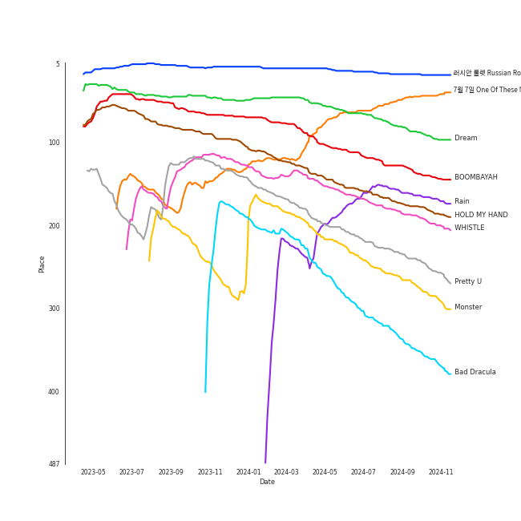

# Tracks in Liked Tracks from 2016

## Artists

| Art | Rank | Tracks | 💚 | Artist | 🔗 |
|:---|---:|---:|---:|:---|:---|
|  | 43 | 7 | 7 | [The Tarpeggios](../../../artists/the_tarpeggios/overview.md) | [🔗](https://open.spotify.com/artist/2HXd5pFHJyaQJr5aXfErrE) |
|  | 2 | 5 | 5 | [Red Velvet](../../../artists/red_velvet/overview.md) | [🔗](https://open.spotify.com/artist/1z4g3DjTBBZKhvAroFlhOM) |
|  | 11 | 4 | 4 | [LeeHi](../../../artists/leehi/overview.md) | [🔗](https://open.spotify.com/artist/7cVZApDoQZpS447nHTsNqu) |
|  | 27 | 4 | 4 | [BTS](../../../artists/bts/overview.md) | [🔗](https://open.spotify.com/artist/3Nrfpe0tUJi4K4DXYWgMUX) |
|  | 37 | 4 | 4 | [Jacob Collier](../../../artists/jacob_collier/overview.md) | [🔗](https://open.spotify.com/artist/0QWrMNukfcVOmgEU0FEDyD) |
|  | 34 | 3 | 3 | [Ariana Grande](../../../artists/ariana_grande/overview.md) | [🔗](https://open.spotify.com/artist/66CXWjxzNUsdJxJ2JdwvnR) |
|  | 163 | 3 | 3 | [Sia](../../../artists/sia/overview.md) | [🔗](https://open.spotify.com/artist/5WUlDfRSoLAfcVSX1WnrxN) |
|  | 173 | 3 | 3 | BIGBANG | [🔗](https://open.spotify.com/artist/4Kxlr1PRlDKEB0ekOCyHgX) |
|  | 3 | 3 | 3 | [BLACKPINK](../../../artists/blackpink/overview.md) | [🔗](https://open.spotify.com/artist/41MozSoPIsD1dJM0CLPjZF) |
|  | 346 | 3 | 3 | DEAN | [🔗](https://open.spotify.com/artist/3eCd0TZrBPm2n9cDG6yWfF) |

View all

| Art | Rank | Tracks | 💚 | Artist | 🔗 |
|:---|---:|---:|---:|:---|:---|
|  | 412 | 2 | 2 | Reol | [🔗](https://open.spotify.com/artist/7rpKUJ0AnklJ8q9nIPVSpZ) |
|  | 9 | 2 | 2 | [TWICE](../../../artists/twice/overview.md) | [🔗](https://open.spotify.com/artist/7n2Ycct7Beij7Dj7meI4X0) |
|  | 66 | 2 | 2 | [AKMU](../../../artists/akmu/overview.md) | [🔗](https://open.spotify.com/artist/6OwKE9Ez6ALxpTaKcT5ayv) |
|  | 54 | 2 | 2 | [BABYMETAL](../../../artists/babymetal/overview.md) | [🔗](https://open.spotify.com/artist/630wzNP2OL7fl4Xl0GnMWq) |
|  | 135 | 2 | 2 | [Gain](../../../artists/gain/overview.md) | [🔗](https://open.spotify.com/artist/4R60A85t9mTZzCqJlVswuo) |
|  | 8 | 2 | 2 | [TAEYEON](../../../artists/taeyeon/overview.md) | [🔗](https://open.spotify.com/artist/3qNVuliS40BLgXGxhdBdqu) |
|  | 221 | 2 | 2 | Punch | [🔗](https://open.spotify.com/artist/2FgZrgTMX6Sk0VNcOsEPmm) |
|  | 92 | 2 | 2 | [Bruno Mars](../../../artists/bruno_mars/overview.md) | [🔗](https://open.spotify.com/artist/0du5cEVh5yTK9QJze8zA0C) |
|  | 15 | 2 | 2 | [MAMAMOO](../../../artists/mamamoo/overview.md) | [🔗](https://open.spotify.com/artist/0XATRDCYuuGhk0oE7C0o5G) |
|  | 12 | 1 | 1 | [SEVENTEEN](../../../artists/seventeen/overview.md) | [🔗](https://open.spotify.com/artist/7nqOGRxlXj7N2JYbgNEjYH) |
|  | 30 | 1 | 1 | [NCT 127](../../../artists/nct_127/overview.md) | [🔗](https://open.spotify.com/artist/7f4ignuCJhLXfZ9giKT7rH) |
|  | 414 | 1 | 1 | Thirdstory | [🔗](https://open.spotify.com/artist/7GJbWH8vhhuW22707B8HsW) |
|  | 132 | 1 | 1 | [Beyoncé](../../../artists/beyoncé/overview.md) | [🔗](https://open.spotify.com/artist/6vWDO969PvNqNYHIOW5v0m) |
|  | 414 | 1 | 1 | CHANYEOL | [🔗](https://open.spotify.com/artist/6jV25rzTKQ2zMgrqHha1V5) |
|  | 246 | 1 | 1 | [WJSN](../../../artists/wjsn/overview.md) | [🔗](https://open.spotify.com/artist/6hhqsQZhtp9hfaZhSd0VSD) |
|  | 414 | 1 | 1 | Yerin Baek | [🔗](https://open.spotify.com/artist/6dhfy4ByARPJdPtMyrUYJK) |
|  | 122 | 1 | 1 | 4Minute | [🔗](https://open.spotify.com/artist/6cdC1cwqh3eJAXaxXJt2jv) |
|  | 360 | 1 | 1 | Charlie Puth | [🔗](https://open.spotify.com/artist/6VuMaDnrHyPL1p4EHjYLi7) |
|  | 414 | 1 | 1 | The Chainsmokers | [🔗](https://open.spotify.com/artist/69GGBxA162lTqCwzJG5jLp) |
|  | 414 | 1 | 1 | JIN | [🔗](https://open.spotify.com/artist/5vV3bFXnN6D6N3Nj4xRvaV) |
|  | 126 | 1 | 1 | [Rihanna](../../../artists/rihanna/overview.md) | [🔗](https://open.spotify.com/artist/5pKCCKE2ajJHZ9KAiaK11H) |
|  | 36 | 1 | 1 | [HEIZE](../../../artists/heize/overview.md) | [🔗](https://open.spotify.com/artist/5dCvSnVduaFleCnyy98JMo) |
|  | 414 | 1 | 1 | WINNER | [🔗](https://open.spotify.com/artist/5DuzBeOgFwViFcv00Q5PFb) |
|  | 414 | 1 | 1 | VIXX | [🔗](https://open.spotify.com/artist/5BkB3rXc0qIdUtuEnhbK0A) |
|  | 414 | 1 | 1 | AOA | [🔗](https://open.spotify.com/artist/54gWVQFHf8IIqbjxAoOarN) |
|  | 414 | 1 | 1 | Glass Animals | [🔗](https://open.spotify.com/artist/4yvcSjfu4PC0CYQyLy4wSq) |
|  | 52 | 1 | 1 | [BAEKHYUN](../../../artists/baekhyun/overview.md) | [🔗](https://open.spotify.com/artist/4ufh0WuMZh6y4Dmdnklvdl) |
|  | 414 | 1 | 1 | LADIES' CODE | [🔗](https://open.spotify.com/artist/4epPY1AW9lQeVUM1XaFiwi) |
|  | 366 | 1 | 1 | Jay Park | [🔗](https://open.spotify.com/artist/4XDi67ZENZcbfKnvMnTYsI) |
|  | 76 | 1 | 1 | Suzy | [🔗](https://open.spotify.com/artist/4U80LJd8sG6U9YTFP5izka) |
|  | 188 | 1 | 1 | Little Mix | [🔗](https://open.spotify.com/artist/3e7awlrlDSwF3iM0WBjGMp) |
|  | 20 | 1 | 1 | [EXO](../../../artists/exo/overview.md) | [🔗](https://open.spotify.com/artist/3cjEqqelV9zb4BYE3qDQ4O) |
|  | 414 | 1 | 1 | V | [🔗](https://open.spotify.com/artist/3JsHnjpbhX4SnySpvpa9DK) |
|  | 82 | 1 | 1 | Wonder Girls | [🔗](https://open.spotify.com/artist/3Cv2vi3WTl8VZOTdrBkKdM) |
|  | 222 | 1 | 1 | Loco | [🔗](https://open.spotify.com/artist/2e4G04F77jxVuDYo44TCSm) |
|  | 195 | 1 | 1 | Stella Jang | [🔗](https://open.spotify.com/artist/2Y9AUayH5pyZpVfkDYDfJV) |
|  | 414 | 1 | 1 | Vincent Blue | [🔗](https://open.spotify.com/artist/2AZgVjkPB4a4ULepFyPPgZ) |
|  | 321 | 1 | 1 | Halsey | [🔗](https://open.spotify.com/artist/26VFTg2z8YR0cCuwLzESi2) |
|  | 414 | 1 | 1 | YB | [🔗](https://open.spotify.com/artist/1rpgxJZxZMLnFNc1Jmyov5) |
|  | 414 | 1 | 1 | VÉRITÉ | [🔗](https://open.spotify.com/artist/1Fr6agZ6iSM5Ynn2k4C8sc) |
|  | 345 | 1 | 1 | Gaeko | [🔗](https://open.spotify.com/artist/0tkHE1pQ5ZCgQb8WZ0ba79) |
|  | 414 | 1 | 1 | Dok2 | [🔗](https://open.spotify.com/artist/0rW6fVd3yuW2CF2sLYWQtE) |
|  | 352 | 1 | 1 | GFRIEND | [🔗](https://open.spotify.com/artist/0qlWcS66ohOIi0M8JZwPft) |
|  | 414 | 1 | 1 | dj friz | [🔗](https://open.spotify.com/artist/0js3wKXyi7RL11sfOykRt1) |
|  | 414 | 1 | 1 | Nicki Minaj | [🔗](https://open.spotify.com/artist/0hCNtLu0JehylgoiP8L4Gh) |
|  | 414 | 1 | 1 | Selena Gomez | [🔗](https://open.spotify.com/artist/0C8ZW7ezQVs4URX5aX7Kqx) |
|  | 414 | 1 | 1 | HYOYEON | [🔗](https://open.spotify.com/artist/0B3I6YgdnfXehUCpsO6oB8) |

## Albums

| Art | Rank | Tracks | 💚 | Album | Release Date | 🔗 |
|:---|---:|---:|---:|:---|:---|:---|
|  | 523 | 7 | 7 | The Teal Album | 2016-11-12 | [🔗](https://open.spotify.com/album/7mTQ62MIYHSbkZHGjY0Ftg) |
|  | 18 | 4 | 4 | Russian Roulette - The 3rd Mini Album | 2016-09-07 | [🔗](https://open.spotify.com/album/6MNlcai3skKLKv5syzFwC3) |
|  | 612 | 4 | 4 | In My Room | 2016-07-01 | [🔗](https://open.spotify.com/album/70N5l7CBZmAMCh1WfnM6in) |
|  | 612 | 3 | 3 | This Is Acting (Deluxe Version) | 2016-10-21 | [🔗](https://open.spotify.com/album/2eV6DIPDnGl1idcjww6xyX) |
|  | 125 | 3 | 3 | SEOULITE | 2016-03-09 | [🔗](https://open.spotify.com/album/2c41Flo2HQgy0A9P3xuSFf) |
|  | 230 | 3 | 3 | MADE | 2016-12-13 | [🔗](https://open.spotify.com/album/2SPrl8C8pgSM5gXbAiyJHY) |
|  | 526 | 3 | 3 | Dangerous Woman | 2016-05-20 | [🔗](https://open.spotify.com/album/3pdKKSqqLVIKmRTGw0x2N7) |
|  | 612 | 2 | 2 | Wings | 2016-10-10 | [🔗](https://open.spotify.com/album/1vhNGBTFoaSTLbHjPGFIlF) |
|  | 612 | 2 | 2 | The Most Beautiful Moment in Life: Young Forever | 2016-05-02 | [🔗](https://open.spotify.com/album/1k5bJ8l5oL5xxVBVHjil09) |
|  | 90 | 2 | 2 | SQUARE ONE | 2016-08-08 | [🔗](https://open.spotify.com/album/0FOOodYRlj7gzh7q7IjmNZ) |

View all

| Art | Rank | Tracks | 💚 | Album | Release Date | 🔗 |
|:---|---:|---:|---:|:---|:---|:---|
|  | 369 | 2 | 2 | SPRING | 2016-05-04 | [🔗](https://open.spotify.com/album/0HtbFp1B1WrbUr9mcBrAhN) |
|  | 231 | 2 | 2 | METAL RESISTANCE | 2016-04-01 | [🔗](https://open.spotify.com/album/2vIRdYffs93ca7L0Eh4mTm) |
|  | 565 | 2 | 2 | End Again | 2016-09-09 | [🔗](https://open.spotify.com/album/1Lb5NVfPBTadR5jl6Vpkdq) |
|  | 612 | 2 | 2 | 24K Magic | 2016-11-17 | [🔗](https://open.spotify.com/album/4PgleR09JVnm3zY1fW3XBA) |
|  | 480 | 2 | 2 | 130 Mood : TRBL | 2016-03-25 | [🔗](https://open.spotify.com/album/1MW3txTS49ZGvyLi0fziLU) |
|  | 612 | 1 | 1 | Σ | 2016-10-19 | [🔗](https://open.spotify.com/album/5MruJPW5X4cal6bpN7llrF) |
|  | 512 | 1 | 1 | Why So Lonely | 2016-07-05 | [🔗](https://open.spotify.com/album/2TzaSJlsVyKcZ0NOf2TI9U) |
|  | 612 | 1 | 1 | Why - The 2nd Mini Album | 2016-06-28 | [🔗](https://open.spotify.com/album/1ukBQWhQwWKqTGgs0YzRzU) |
|  | 612 | 1 | 1 | Weightlifting Fairy Kim Bok Joo (Original Television Soundtrack, Pt. 2) | 2016-11-23 | [🔗](https://open.spotify.com/album/1T8J131uP2pI7VuxSF2zp3) |
|  | 612 | 1 | 1 | Twicecoaster: Lane 1 | 2016-10-24 | [🔗](https://open.spotify.com/album/5zQhaDNbiXHRqd8Y51I4vy) |
|  | 50 | 1 | 1 | The Velvet - The 2nd Mini Album | 2016-03-17 | [🔗](https://open.spotify.com/album/2qgl7dAgslqL1w2l2wQhMA) |
|  | 612 | 1 | 1 | THE SECRET | 2016-08-17 | [🔗](https://open.spotify.com/album/0usNbLkckzIo34wUPehZdh) |
|  | 612 | 1 | 1 | Somebody Else | 2016-09-09 | [🔗](https://open.spotify.com/album/3Q4yhhyFA2cpZq2FGOgMwU) |
|  | 612 | 1 | 1 | Searching | 2016-05-06 | [🔗](https://open.spotify.com/album/7pjWbCevZabqDKwm26ggKd) |
|  | 387 | 1 | 1 | SQUARE TWO | 2016-11-01 | [🔗](https://open.spotify.com/album/2Fna4Tb7fme5aHsNMJtVtp) |
|  | 163 | 1 | 1 | SEVENTEEN 1ST ALBUM [FIRST ‘LOVE&LETTER’] | 2016-04-25 | [🔗](https://open.spotify.com/album/50BrkBakrLWufmTLjCVBwn) |
|  | 612 | 1 | 1 | SEOULITE | 2016-04-20 | [🔗](https://open.spotify.com/album/3cGyWEJaQlj7kCdKBCOGeb) |
|  | 121 | 1 | 1 | Rain - SM STATION | 2016-02-03 | [🔗](https://open.spotify.com/album/5MgY1E2inbDcthAQEzwz8L) |
|  | 612 | 1 | 1 | REMIND | 2016-10-26 | [🔗](https://open.spotify.com/album/2wA8OXIv1JXX9kTY2ddfR4) |
|  | 612 | 1 | 1 | Page Two | 2016-04-25 | [🔗](https://open.spotify.com/album/6q2oUEqL9uzVXHCeKoA8JV) |
|  | 603 | 1 | 1 | No title- | 2016-03-18 | [🔗](https://open.spotify.com/album/5qPZrSLh2oecfujdUZqgmy) |
|  | 612 | 1 | 1 | Nine Track Mind | 2016-01-29 | [🔗](https://open.spotify.com/album/3kndSWeE2IYOrZEToZrHEV) |
|  | 405 | 1 | 1 | NCT #127 - The 1st Mini Album | 2016-07-10 | [🔗](https://open.spotify.com/album/7xmqXxPAmkgn5HK9FcyBxR) |
|  | 255 | 1 | 1 | Moonlovers - Scarlet Heart Ryeo (Original Television Soundtrack), Pt. 2 | 2016-08-29 | [🔗](https://open.spotify.com/album/68xTLBWjoRADRf86WYmTmy) |
|  | 612 | 1 | 1 | Melting | 2016-02-26 | [🔗](https://open.spotify.com/album/11hjJntrvmauDoga4Krr0U) |
|  | 612 | 1 | 1 | MYST3RY | 2016-02-24 | [🔗](https://open.spotify.com/album/2kOn7OTf9UGL0fyxy8yT7n) |
|  | 612 | 1 | 1 | MEMORY | 2016-11-07 | [🔗](https://open.spotify.com/album/3Q34hV5fBbMpRpADmlptr7) |
|  | 612 | 1 | 1 | Lemonade | 2016-04-23 | [🔗](https://open.spotify.com/album/7dK54iZuOxXFarGhXwEXfF) |
|  | 612 | 1 | 1 | How To Be A Human Being | 2016-08-26 | [🔗](https://open.spotify.com/album/6qb9MDR0lfsN9a2pw77uJy) |
|  | 612 | 1 | 1 | Hades | 2016-08-12 | [🔗](https://open.spotify.com/album/78huKT6T1zZUJxbkGBQJZC) |
|  | 612 | 1 | 1 | HWARANG, Pt. 2 (Music from the Original TV Series) | 2016-12-20 | [🔗](https://open.spotify.com/album/0sL76PXbgRh97MTzadqEMa) |
|  | 612 | 1 | 1 | Guardian (Original Television Soundtrack), Pt. 1 | 2016-12-03 | [🔗](https://open.spotify.com/album/6Pr1DaOWfT6hEewhZMRyqg) |
|  | 612 | 1 | 1 | Glory Days (Expanded Edition) | 2016-11-18 | [🔗](https://open.spotify.com/album/4w49hcqZt66HZX0MJHfW0m) |
|  | 612 | 1 | 1 | GFRIEND 3rd Mini Album 'SNOWFLAKE' | 2016-01-25 | [🔗](https://open.spotify.com/album/0COnSwFb5qOhABUyWNw6Kp) |
|  | 612 | 1 | 1 | EXIT : E | 2016-02-01 | [🔗](https://open.spotify.com/album/7D2FML3EyRJcCoiEgUbRxT) |
|  | 177 | 1 | 1 | EX'ACT | 2016-06-09 | [🔗](https://open.spotify.com/album/5Cckx6G2aRR4aZBV6eIYdc) |
|  | 612 | 1 | 1 | EVERYTHING YOU WANTED | 2016-10-20 | [🔗](https://open.spotify.com/album/0c4LKBzh0ufU36AyuzZRc2) |
|  | 76 | 1 | 1 | Dream | 2016-01-07 | [🔗](https://open.spotify.com/album/7ciJtZ2tYXhKsndQ7bf7Vw) |
|  | 612 | 1 | 1 | Colors | 2016-10-06 | [🔗](https://open.spotify.com/album/419WgjPNItZIDgjd1GSgrO) |
|  | 612 | 1 | 1 | Closer | 2016-07-29 | [🔗](https://open.spotify.com/album/0rSLgV8p5FzfnqlEk4GzxE) |
|  | 612 | 1 | 1 | Bye Bye My Blue | 2016-06-20 | [🔗](https://open.spotify.com/album/22qM69DGAvUsSyQfVh8Lgm) |
|  | 612 | 1 | 1 | And July | 2016-07-18 | [🔗](https://open.spotify.com/album/3xUWeFeLn6m3NXKr0FlT3E) |
|  | 612 | 1 | 1 | Act. 7 | 2016-02-01 | [🔗](https://open.spotify.com/album/2QGDdrZDuxK7VBmcJZxi1B) |
|  | 612 | 1 | 1 | AOA 4th Mini Album Good Luck | 2016-05-16 | [🔗](https://open.spotify.com/album/3D4EskjAYfo91G4BN7XcbB) |
|  | 612 | 1 | 1 | ANTI (Deluxe) | 2016-01-28 | [🔗](https://open.spotify.com/album/4UlGauD7ROb3YbVOFMgW5u) |

## Tracks

| Art | Track | Album | Artists | Label | Rank | 💚 | 🔗 |
|:---|:---|:---|:---|:---|---:|:---|:---|
|  | 러시안 룰렛 Russian Roulette | Russian Roulette - The 3rd Mini Album | [Red Velvet](../../../artists/red_velvet/overview.md) | [SM Entertainment](../../../labels/sm_entertainment) | 17 | 💚 | [🔗](https://open.spotify.com/track/5HiSc2ZCGn8L3cH3qSwzBT) |
|  | 7월 7일 One Of These Nights | The Velvet - The 2nd Mini Album | [Red Velvet](../../../artists/red_velvet/overview.md) | [SM Entertainment](../../../labels/sm_entertainment) | 52 | 💚 | [🔗](https://open.spotify.com/track/6koMMQlsRWBwHZXdtWxgUk) |
|  | Dream | Dream | Suzy, [BAEKHYUN](../../../artists/baekhyun/overview.md) | ChoongangICS, MYSTIC Entertainment, [JYP Entertainment](../../../labels/jyp_entertainment), [SM Entertainment](../../../labels/sm_entertainment) | 75 | 💚 | [🔗](https://open.spotify.com/track/3JBnDOUd18QKjDqSYuOfpm) |
|  | BOOMBAYAH | SQUARE ONE | [BLACKPINK](../../../artists/blackpink/overview.md) | [YG Entertainment](../../../labels/yg_entertainment) | 126 | 💚 | [🔗](https://open.spotify.com/track/13MF2TYuyfITClL1R2ei6e) |
|  | Rain | Rain - SM STATION | [TAEYEON](../../../artists/taeyeon/overview.md) | [SM Entertainment](../../../labels/sm_entertainment) | 152 | 💚 | [🔗](https://open.spotify.com/track/1ukyvyEeSg1odSQvhlRAIU) |
|  | HOLD MY HAND | SEOULITE | [LeeHi](../../../artists/leehi/overview.md) | [YG Entertainment](../../../labels/yg_entertainment) | 165 | 💚 | [🔗](https://open.spotify.com/track/7bwSMCwF2C4cK2W97H6oCA) |
|  | WHISTLE | SQUARE ONE | [BLACKPINK](../../../artists/blackpink/overview.md) | [YG Entertainment](../../../labels/yg_entertainment) | 175 | 💚 | [🔗](https://open.spotify.com/track/6NEoeBLQbOMw92qMeLfI40) |
|  | Pretty U | SEVENTEEN 1ST ALBUM [FIRST ‘LOVE&LETTER’] | [SEVENTEEN](../../../artists/seventeen/overview.md) | [PLEDIS ENTERTAINMENT](../../../labels/pledis_entertainment) | 225 | 💚 | [🔗](https://open.spotify.com/track/1117juaaAkSIUsQxTmmcKM) |
|  | Monster | EX'ACT | [EXO](../../../artists/exo/overview.md) | [SM Entertainment](../../../labels/sm_entertainment) | 243 | 💚 | [🔗](https://open.spotify.com/track/7GbUWl6qLW1gdngbEV2WDJ) |
|  | Bad Dracula | Russian Roulette - The 3rd Mini Album | [Red Velvet](../../../artists/red_velvet/overview.md) | [SM Entertainment](../../../labels/sm_entertainment) | 321 | 💚 | [🔗](https://open.spotify.com/track/4z5aqQOYYsvjXuXjjhKVJ2) |

View all

| Art | Track | Album | Artists | Label | Rank | 💚 | 🔗 |
|:---|:---|:---|:---|:---|---:|:---|:---|
|  | LOSER | MADE | BIGBANG | [YG Entertainment](../../../labels/yg_entertainment) | 329 | 💚 | [🔗](https://open.spotify.com/track/2vzn8usBcuNL93DnTjEK0z) |
|  | Say Yes | Moonlovers - Scarlet Heart Ryeo (Original Television Soundtrack), Pt. 2 | Loco, Punch | [Genie Music Corporation](../../../labels/genie_music_corporation) | 355 | 💚 | [🔗](https://open.spotify.com/track/27zrFrtUtWl2urlvjOn5xc) |
|  | BREATHE | SEOULITE | [LeeHi](../../../artists/leehi/overview.md) | [YG Entertainment](../../../labels/yg_entertainment) | 383 | 💚 | [🔗](https://open.spotify.com/track/6G4z9WbxyEeWdEQTfShACT) |
|  | Fool | Russian Roulette - The 3rd Mini Album | [Red Velvet](../../../artists/red_velvet/overview.md) | [SM Entertainment](../../../labels/sm_entertainment) | 426 | 💚 | [🔗](https://open.spotify.com/track/21C7B7PWYDW00czamOjleO) |
|  | KARATE | METAL RESISTANCE | [BABYMETAL](../../../artists/babymetal/overview.md) | Cooking Vinyl Limited | 432 | 💚 | [🔗](https://open.spotify.com/track/2A4wfplwsIXUUD3UVirWDd) |
|  | How People Move | SPRING | [AKMU](../../../artists/akmu/overview.md) | [YG Entertainment](../../../labels/yg_entertainment) | 539 | 💚 | [🔗](https://open.spotify.com/track/0c2Yg75sFgD0hWhRq4voAn) |
|  | PLAYING WITH FIRE | SQUARE TWO | [BLACKPINK](../../../artists/blackpink/overview.md) | [YG Entertainment](../../../labels/yg_entertainment) | 575 | 💚 | [🔗](https://open.spotify.com/track/7qmvLmX9tyaTiBAVNI6YEn) |
|  | Lucky Girl | Russian Roulette - The 3rd Mini Album | [Red Velvet](../../../artists/red_velvet/overview.md) | [SM Entertainment](../../../labels/sm_entertainment) | 582 | 💚 | [🔗](https://open.spotify.com/track/22v5j98MRwc6p5KgwHvpBZ) |
|  | 소방차 Fire Truck | NCT #127 - The 1st Mini Album | [NCT 127](../../../artists/nct_127/overview.md) | [SM Entertainment](../../../labels/sm_entertainment) | 601 | 💚 | [🔗](https://open.spotify.com/track/5hHlmrSV6d9LFMsDA1lamE) |
|  | D (Half Moon) | 130 Mood : TRBL | DEAN, Gaeko | [Universal Music Ltd.](../../../labels/universal_music_llc) | 717 | 💚 | [🔗](https://open.spotify.com/track/3uA8SjMyDtwtt0jLPMQbVD) |
|  | LET'S NOT FALL IN LOVE | MADE | BIGBANG | [YG Entertainment](../../../labels/yg_entertainment) | 751 | 💚 | [🔗](https://open.spotify.com/track/6UgkB0xM45TR3Zjqm3GQ6T) |
|  | Why So Lonely | Why So Lonely | Wonder Girls | [Republic Records](../../../labels/republic_records) | 770 | 💚 | [🔗](https://open.spotify.com/track/2FBNkgK3GbF2tVWxKNFRjX) |
|  | I See Fire | The Teal Album | [The Tarpeggios](../../../artists/the_tarpeggios/overview.md) | The Unc - Chapel Hill Tarpeggios | 783 | 💚 | [🔗](https://open.spotify.com/track/4Mp2l1tCHxnm65a6yQ8lph) |
|  | Into You | Dangerous Woman | [Ariana Grande](../../../artists/ariana_grande/overview.md) | [Universal Records](../../../labels/universal_music_llc) | 791 | 💚 | [🔗](https://open.spotify.com/track/63y6xWR4gXz7bnUGOk8iI6) |
|  | Carrie (The First Day) | End Again | [Gain](../../../artists/gain/overview.md) | APOP Entertainment, MYSTIC Entertainment | 847 | 💚 | [🔗](https://open.spotify.com/track/5n2Z6Z4Tw6hkbMqY4lT24u) |
|  | No title | No title- | Reol | TOY'S FACTORY | 914 | 💚 | [🔗](https://open.spotify.com/track/5pZVsZ8TOGly1KnYFmZ61B) |
|  | Rough | GFRIEND 3rd Mini Album 'SNOWFLAKE' | GFRIEND | [SOURCE MUSIC](../../../labels/source_music) | 922 | 💚 | [🔗](https://open.spotify.com/track/3CVeGXpoPKJQ9JuhPp3mpL) |
|  | Love On The Brain | ANTI (Deluxe) | [Rihanna](../../../artists/rihanna/overview.md) | Roc Nation / Rihanna | 922 | 💚 | [🔗](https://open.spotify.com/track/5oO3drDxtziYU2H1X23ZIp) |
|  | We Don't Talk Anymore (feat. Selena Gomez) | Nine Track Mind | Charlie Puth, Selena Gomez | Artist Partner | 922 | 💚 | [🔗](https://open.spotify.com/track/37FXw5QGFN7uwwsLy8uAc0) |
|  | Hate | Act. 7 | 4Minute | [CUBE ENTERTAINMENT](../../../labels/cube_entertainment) | 922 | 💚 | [🔗](https://open.spotify.com/track/3Hd6zm1J4bVeu4VXwaDQL3) |
|  | BABY BABY | EXIT : E | WINNER | [YG Entertainment](../../../labels/yg_entertainment) | 922 | 💚 | [🔗](https://open.spotify.com/track/2zLRE8rUhH2i7maIU5sWVI) |
|  | Galaxy | MYST3RY | LADIES' CODE | 폴라리스엔터테인먼트, BlockBerryCreative | 922 | 💚 | [🔗](https://open.spotify.com/track/5rd00qaUJugfI8nhPcxA3o) |
|  | You’re the Best | Melting | [MAMAMOO](../../../artists/mamamoo/overview.md) | [Genie Music Corporation](../../../labels/genie_music_corporation), [Stone Music Entertainment](../../../labels/stone_music_entertainment) | 922 | 💚 | [🔗](https://open.spotify.com/track/3BUZUCu1uHaTvroizwqLHt) |
|  | FXXK WIT US | SEOULITE | [LeeHi](../../../artists/leehi/overview.md), Dok2 | [YG Entertainment](../../../labels/yg_entertainment) | 922 | 💚 | [🔗](https://open.spotify.com/track/6wj3blmFAG2pNWQ40Yuaq8) |
|  | Bonnie & Clyde | 130 Mood : TRBL | DEAN | [Universal Music Ltd.](../../../labels/universal_music_llc) | 922 | 💚 | [🔗](https://open.spotify.com/track/6IFpwncCkKrXHyP0RuG9r6) |
|  | Amore | METAL RESISTANCE | [BABYMETAL](../../../artists/babymetal/overview.md) | Cooking Vinyl Limited | 922 | 💚 | [🔗](https://open.spotify.com/track/4KGOgUYx9x7J9LYhtuZNRb) |
|  | MISSING U | SEOULITE | [LeeHi](../../../artists/leehi/overview.md) | [YG Entertainment](../../../labels/yg_entertainment) | 922 | 💚 | [🔗](https://open.spotify.com/track/4uk677I1lb0ZPSXGhL2FcA) |
|  | Daddy Lessons | Lemonade | [Beyoncé](../../../artists/beyoncé/overview.md) | [Columbia](../../../labels/columbia), [Parkwood Entertainment](../../../labels/parkwood_entertainment) | 922 | 💚 | [🔗](https://open.spotify.com/track/71OvX5NNLrmz7rpq1ANTQn) |
|  | CHEER UP | Page Two | [TWICE](../../../artists/twice/overview.md) | [Republic Records](../../../labels/republic_records) | 922 | 💚 | [🔗](https://open.spotify.com/track/7lB4rxNVc7vm33ZSZXVRAQ) |
|  | Butterfly | The Most Beautiful Moment in Life: Young Forever | [BTS](../../../artists/bts/overview.md) | [BIGHIT MUSIC](../../../labels/bighit_music) | 922 | 💚 | [🔗](https://open.spotify.com/track/2QP1vvLPtAVOVAFabpqypA) |
|  | Dope | The Most Beautiful Moment in Life: Young Forever | [BTS](../../../artists/bts/overview.md) | [BIGHIT MUSIC](../../../labels/bighit_music) | 922 | 💚 | [🔗](https://open.spotify.com/track/4o3Ao6wY5fbJR32fQKabfQ) |
|  | RE-BYE | SPRING | [AKMU](../../../artists/akmu/overview.md) | [YG Entertainment](../../../labels/yg_entertainment) | 922 | 💚 | [🔗](https://open.spotify.com/track/7pz1YzMwDxS9uuwAEp7MLk) |
|  | G Train | Searching | Thirdstory | Verve | 922 | 💚 | [🔗](https://open.spotify.com/track/0vYIpioP94c4gwxOyopklE) |
|  | Good Luck | AOA 4th Mini Album Good Luck | AOA | [FNC ENTERTAINMENT](../../../labels/fnc_entertainment) | 922 | 💚 | [🔗](https://open.spotify.com/track/577ckDBuyYNGeqetUhbv7d) |
|  | Dangerous Woman | Dangerous Woman | [Ariana Grande](../../../artists/ariana_grande/overview.md) | [Universal Records](../../../labels/universal_music_llc) | 922 | 💚 | [🔗](https://open.spotify.com/track/6RUhbFEhrvGISaQ8u2j2JN) |
|  | Side To Side | Dangerous Woman | [Ariana Grande](../../../artists/ariana_grande/overview.md), Nicki Minaj | [Universal Records](../../../labels/universal_music_llc) | 922 | 💚 | [🔗](https://open.spotify.com/track/43bCmCI0nSgcT7QdMXY6LV) |
|  | Bye Bye My Blue | Bye Bye My Blue | Yerin Baek | [JYP Entertainment](../../../labels/jyp_entertainment) | 922 | 💚 | [🔗](https://open.spotify.com/track/1XslqSASDWaMZdjhWa7Jb7) |
|  | Up & Down | Why - The 2nd Mini Album | [TAEYEON](../../../artists/taeyeon/overview.md), HYOYEON | [SM Entertainment](../../../labels/sm_entertainment) | 922 | 💚 | [🔗](https://open.spotify.com/track/2T20Nb7QlVK8K6pRSiDl8N) |
|  | Hajanga | In My Room | [Jacob Collier](../../../artists/jacob_collier/overview.md) | Hajanga Records | 922 | 💚 | [🔗](https://open.spotify.com/track/3VW8i6i8zT9YbIiZXmZFoQ) |
|  | In My Room | In My Room | [Jacob Collier](../../../artists/jacob_collier/overview.md) | Hajanga Records | 922 | 💚 | [🔗](https://open.spotify.com/track/1yGl3V3BiRSaVnuFC93CYd) |
|  | Woke Up Today | In My Room | [Jacob Collier](../../../artists/jacob_collier/overview.md) | Hajanga Records | 922 | 💚 | [🔗](https://open.spotify.com/track/5wSBAOJizZFq1lhgppsDNj) |
|  | You And I | In My Room | [Jacob Collier](../../../artists/jacob_collier/overview.md) | Hajanga Records | 922 | 💚 | [🔗](https://open.spotify.com/track/0yZ1VBdUdX2dEBXv4LXzn8) |
|  | And July | And July | [HEIZE](../../../artists/heize/overview.md), DEAN, dj friz | [Genie Music Corporation](../../../labels/genie_music_corporation) | 922 | 💚 | [🔗](https://open.spotify.com/track/0Yz3F0UGDibDe8uU69zmjn) |
|  | Closer | Closer | The Chainsmokers, Halsey | [Disruptor Records/Columbia](../../../labels/columbia) | 922 | 💚 | [🔗](https://open.spotify.com/track/7BKLCZ1jbUBVqRi2FVlTVw) |
|  | Fantasy | Hades | VIXX | JELLYFISH ENTERTAINMENT | 922 | 💚 | [🔗](https://open.spotify.com/track/3GuJYdmgBXo6Add2CPTRw4) |
|  | Secret | THE SECRET | [WJSN](../../../artists/wjsn/overview.md) | [Starship Entertainment](../../../labels/starship_entertainment) | 922 | 💚 | [🔗](https://open.spotify.com/track/1OIb1AalkGikhzCRbWgchd) |
|  | The Other Side Of Paradise | How To Be A Human Being | Glass Animals | Wolf Tone | 922 | 💚 | [🔗](https://open.spotify.com/track/0rRjGruFonCGOt0S5zAJNQ) |
|  | Carnival (The Last Day) | End Again | [Gain](../../../artists/gain/overview.md) | APOP Entertainment, MYSTIC Entertainment | 922 | 💚 | [🔗](https://open.spotify.com/track/1wFwU41aWXC5wb7ycY9q61) |
|  | Somebody Else | Somebody Else | VÉRITÉ | VÉRITÉ | 922 | 💚 | [🔗](https://open.spotify.com/track/34i4yxPrHWquuR4kjiivFO) |
|  | Colors | Colors | Stella Jang | GRDL | 922 | 💚 | [🔗](https://open.spotify.com/track/1oACG26rFg4XwAkW5oGGUa) |
|  | Blood Sweat & Tears | Wings | [BTS](../../../artists/bts/overview.md) | [BIGHIT MUSIC](../../../labels/bighit_music) | 922 | 💚 | [🔗](https://open.spotify.com/track/2u54HNQamwFuOMLSuhSRom) |
|  | Lie | Wings | [BTS](../../../artists/bts/overview.md) | [BIGHIT MUSIC](../../../labels/bighit_music) | 922 | 💚 | [🔗](https://open.spotify.com/track/1nWB8isqs2tviWk20G5pow) |
|  | 404 not found | Σ | Reol | TOY'S FACTORY | 922 | 💚 | [🔗](https://open.spotify.com/track/2BY5fNHmpjV797ByjLX4I7) |
|  | All I Wanna Do | EVERYTHING YOU WANTED | Jay Park | [Genie Music Corporation](../../../labels/genie_music_corporation), [Stone Music Entertainment](../../../labels/stone_music_entertainment) | 922 | 💚 | [🔗](https://open.spotify.com/track/2PcJoVkfjcbvoqBxV1Nj7y) |
|  | Alive | This Is Acting (Deluxe Version) | [Sia](../../../artists/sia/overview.md) | [Monkey Puzzle](../../../labels/monkey_puzzle), [RCA Records Label](../../../labels/rca_records_label) | 922 | 💚 | [🔗](https://open.spotify.com/track/25R5Tdr4K7ENb6umHzdCXn) |
|  | Bird Set Free | This Is Acting (Deluxe Version) | [Sia](../../../artists/sia/overview.md) | [Monkey Puzzle](../../../labels/monkey_puzzle), [RCA Records Label](../../../labels/rca_records_label) | 922 | 💚 | [🔗](https://open.spotify.com/track/6MowG7MRVgPfGlCMsXKMJ2) |
|  | Cheap Thrills | This Is Acting (Deluxe Version) | [Sia](../../../artists/sia/overview.md) | [Monkey Puzzle](../../../labels/monkey_puzzle), [RCA Records Label](../../../labels/rca_records_label) | 922 | 💚 | [🔗](https://open.spotify.com/track/3S4px9f4lceWdKf0gWciFu) |
|  | TT | Twicecoaster: Lane 1 | [TWICE](../../../artists/twice/overview.md) | [Republic Records](../../../labels/republic_records) | 922 | 💚 | [🔗](https://open.spotify.com/track/60jFaQV7Z4boGC4ob5B5c6) |
|  | Blue Whale - 2016 Version | REMIND | YB | 디컴퍼니 | 922 | 💚 | [🔗](https://open.spotify.com/track/1WFj1P1TUJJXH1R41PP9Vg) |
|  | Décalcomanie | MEMORY | [MAMAMOO](../../../artists/mamamoo/overview.md) | [Genie Music Corporation](../../../labels/genie_music_corporation), [Stone Music Entertainment](../../../labels/stone_music_entertainment) | 922 | 💚 | [🔗](https://open.spotify.com/track/5WitNasXEIRptoLIQUcXMx) |
|  | A Case of You | The Teal Album | [The Tarpeggios](../../../artists/the_tarpeggios/overview.md) | The Unc - Chapel Hill Tarpeggios | 922 | 💚 | [🔗](https://open.spotify.com/track/6YwWeHUYCkRoGJWGtohs0j) |
|  | Bottom of the River | The Teal Album | [The Tarpeggios](../../../artists/the_tarpeggios/overview.md) | The Unc - Chapel Hill Tarpeggios | 922 | 💚 | [🔗](https://open.spotify.com/track/25XUZBlrcbb5U2fsJBY03P) |
|  | Build Me up Buttercup | The Teal Album | [The Tarpeggios](../../../artists/the_tarpeggios/overview.md) | The Unc - Chapel Hill Tarpeggios | 922 | 💚 | [🔗](https://open.spotify.com/track/7Gi0VBh0IsTbIncQGNJjv3) |
|  | Can't Take My Eyes off You | The Teal Album | [The Tarpeggios](../../../artists/the_tarpeggios/overview.md) | The Unc - Chapel Hill Tarpeggios | 922 | 💚 | [🔗](https://open.spotify.com/track/1wT7nx5HLq9mhBf3P0BwTf) |
|  | Candyman | The Teal Album | [The Tarpeggios](../../../artists/the_tarpeggios/overview.md) | The Unc - Chapel Hill Tarpeggios | 922 | 💚 | [🔗](https://open.spotify.com/track/1OEnvNhDx4iYvjKD8rIp89) |
|  | Drag Me Down / As Long as You Love Me | The Teal Album | [The Tarpeggios](../../../artists/the_tarpeggios/overview.md) | The Unc - Chapel Hill Tarpeggios | 922 | 💚 | [🔗](https://open.spotify.com/track/3GqtzxfUrdmrApqEMaWggL) |
|  | Finesse | 24K Magic | [Bruno Mars](../../../artists/bruno_mars/overview.md) | [Atlantic Records](../../../labels/atlantic_records) | 922 | 💚 | [🔗](https://open.spotify.com/track/5XMkENs3GfeRza8MfVAhjK) |
|  | That's What I Like | 24K Magic | [Bruno Mars](../../../artists/bruno_mars/overview.md) | [Atlantic Records](../../../labels/atlantic_records) | 922 | 💚 | [🔗](https://open.spotify.com/track/0KKkJNfGyhkQ5aFogxQAPU) |
|  | Power | Glory Days (Expanded Edition) | Little Mix | [Syco Music](../../../labels/syco_music) | 922 | 💚 | [🔗](https://open.spotify.com/track/0lUSd7TCG8srh6HpIAEIWL) |
|  | From now on | Weightlifting Fairy Kim Bok Joo (Original Television Soundtrack, Pt. 2) | Vincent Blue | 스타엔트리엔터테인먼트 | 922 | 💚 | [🔗](https://open.spotify.com/track/6vic1TI7BdzAc9HM0LnAF0) |
|  | Stay With Me | Guardian (Original Television Soundtrack), Pt. 1 | CHANYEOL, Punch | [Genie Music Corporation](../../../labels/genie_music_corporation), [Stone Music Entertainment](../../../labels/stone_music_entertainment) | 922 | 💚 | [🔗](https://open.spotify.com/track/1HYzRuWjmS9LXCkdVHi25K) |
|  | BANG BANG BANG | MADE | BIGBANG | [YG Entertainment](../../../labels/yg_entertainment) | 922 | 💚 | [🔗](https://open.spotify.com/track/3dI59jLoFMjMAyUAyRZnkE) |
|  | It's Definitely You | HWARANG, Pt. 2 (Music from the Original TV Series) | V, JIN | OH!BOY PROJECT | 922 | 💚 | [🔗](https://open.spotify.com/track/2LowwiemmGMzzNSH1PJprK) |

