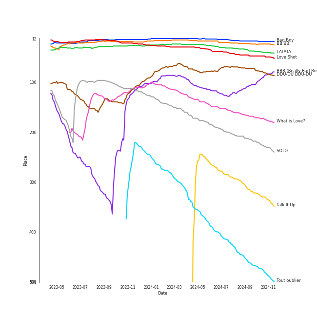

# Tracks in Liked Tracks from 2018

## Artists

| Art | Rank | Tracks | 💚 | Artist | 🔗 |
|:---|---:|---:|---:|:---|:---|
|  | 2 | 6 | 6 | [Red Velvet](../../../artists/red_velvet/overview.md) | [🔗](https://open.spotify.com/artist/1z4g3DjTBBZKhvAroFlhOM) |
|  | 27 | 5 | 5 | [BTS](../../../artists/bts/overview.md) | [🔗](https://open.spotify.com/artist/3Nrfpe0tUJi4K4DXYWgMUX) |
|  | 9 | 3 | 3 | [TWICE](../../../artists/twice/overview.md) | [🔗](https://open.spotify.com/artist/7n2Ycct7Beij7Dj7meI4X0) |
|  | 328 | 3 | 3 | Metropole Orkest | [🔗](https://open.spotify.com/artist/7JYdpWAsiqzrmMB3qxkEbI) |
|  | 427 | 3 | 3 | [Clean Bandit](../../../artists/clean_bandit/overview.md) | [🔗](https://open.spotify.com/artist/6MDME20pz9RveH9rEXvrOM) |
|  | 327 | 3 | 3 | Jules Buckley | [🔗](https://open.spotify.com/artist/5gGbAKDXhDoBXIJe8SuBvX) |
|  | 253 | 3 | 3 | [Camila Cabello](../../../artists/camila_cabello/overview.md) | [🔗](https://open.spotify.com/artist/4nDoRrQiYLoBzwC5BhVJzF) |
|  | 356 | 3 | 3 | NCT | [🔗](https://open.spotify.com/artist/48eO052eSDcn8aTxiv6QaG) |
|  | 3 | 3 | 3 | [BLACKPINK](../../../artists/blackpink/overview.md) | [🔗](https://open.spotify.com/artist/41MozSoPIsD1dJM0CLPjZF) |
|  | 243 | 3 | 3 | [NCT U](../../../artists/nct_u/overview.md) | [🔗](https://open.spotify.com/artist/3paGCCtX1Xr4Gx53mSeZuQ) |

View all

| Art | Rank | Tracks | 💚 | Artist | 🔗 |
|:---|---:|---:|---:|:---|:---|
|  | 6 | 3 | 3 | [(G)I-DLE](../../../artists/(g)i-dle/overview.md) | [🔗](https://open.spotify.com/artist/2AfmfGFbe0A0WsTYm0SDTx) |
|  | 35 | 3 | 3 | [Jacob Collier](../../../artists/jacob_collier/overview.md) | [🔗](https://open.spotify.com/artist/0QWrMNukfcVOmgEU0FEDyD) |
|  | 107 | 2 | 2 | [Janelle Monáe](../../../artists/janelle_monáe/overview.md) | [🔗](https://open.spotify.com/artist/6ueGR6SWhUJfvEhqkvMsVs) |
|  | 86 | 2 | 2 | [Dua Lipa](../../../artists/dua_lipa/overview.md) | [🔗](https://open.spotify.com/artist/6M2wZ9GZgrQXHCFfjv46we) |
|  | 34 | 2 | 2 | [Ariana Grande](../../../artists/ariana_grande/overview.md) | [🔗](https://open.spotify.com/artist/66CXWjxzNUsdJxJ2JdwvnR) |
|  | 427 | 2 | 2 | [The Rose](../../../artists/the_rose/overview.md) | [🔗](https://open.spotify.com/artist/5na1LmEmK2VzNLje9snJYW) |
|  | 36 | 2 | 2 | [HEIZE](../../../artists/heize/overview.md) | [🔗](https://open.spotify.com/artist/5dCvSnVduaFleCnyy98JMo) |
|  | 281 | 2 | 2 | [MOMOLAND](../../../artists/momoland/overview.md) | [🔗](https://open.spotify.com/artist/5RR0MLwcjc87wjSw2JYdwx) |
|  | 32 | 2 | 2 | [BoA](../../../artists/boa/overview.md) | [🔗](https://open.spotify.com/artist/4muJrGMndyYWqZtfk8OWy4) |
|  | 144 | 2 | 2 | Sammy Rae & The Friends | [🔗](https://open.spotify.com/artist/3lFDsTyYNPQc8WzJExnQWn) |
|  | 21 | 2 | 2 | [EXO](../../../artists/exo/overview.md) | [🔗](https://open.spotify.com/artist/3cjEqqelV9zb4BYE3qDQ4O) |
|  | 125 | 2 | 2 | [Lady Gaga](../../../artists/lady_gaga/overview.md) | [🔗](https://open.spotify.com/artist/1HY2Jd0NmPuamShAr6KMms) |
|  | 15 | 2 | 2 | [MAMAMOO](../../../artists/mamamoo/overview.md) | [🔗](https://open.spotify.com/artist/0XATRDCYuuGhk0oE7C0o5G) |
|  | 28 | 2 | 2 | [WENDY](../../../artists/wendy/overview.md) | [🔗](https://open.spotify.com/artist/0FRUZvZNPzM3YJMABJxf2K) |
|  | 200 | 1 | 1 | SZA | [🔗](https://open.spotify.com/artist/7tYKF4w9nC0nq9CsPZTHyP) |
|  | 427 | 1 | 1 | Vulfpeck | [🔗](https://open.spotify.com/artist/7pXu47GoqSYRajmBCjxdD6) |
|  | 427 | 1 | 1 | ROSALÍA | [🔗](https://open.spotify.com/artist/7ltDVBr6mKbRvohxheJ9h1) |
|  | 427 | 1 | 1 | Aitana | [🔗](https://open.spotify.com/artist/7eLcDZDYHXZCebtQmVFL25) |
|  | 49 | 1 | 1 | [HWASA](../../../artists/hwasa/overview.md) | [🔗](https://open.spotify.com/artist/7bmYpVgQub656uNTu6qGNQ) |
|  | 427 | 1 | 1 | Play-N-Skillz | [🔗](https://open.spotify.com/artist/7MP4jhYmFEgb0AtiOkw55s) |
|  | 427 | 1 | 1 | Aya Nakamura | [🔗](https://open.spotify.com/artist/7IlRNXHjoOCgEAWN5qYksg) |
|  | 256 | 1 | 1 | YUJU | [🔗](https://open.spotify.com/artist/7Bu0r4MCDX3sbhcFD5IXyx) |
|  | 427 | 1 | 1 | The Happy Fits | [🔗](https://open.spotify.com/artist/73rPcaYEhBd0UuVZBqqyQJ) |
|  | 427 | 1 | 1 | SHAUN | [🔗](https://open.spotify.com/artist/72nLe76yBFSlP6VBzME358) |
|  | 44 | 1 | 1 | [Billie Eilish](../../../artists/billie_eilish/overview.md) | [🔗](https://open.spotify.com/artist/6qqNVTkY8uBg9cP3Jd7DAH) |
|  | 427 | 1 | 1 | Loving Caliber | [🔗](https://open.spotify.com/artist/6psCCMHymYfQy6VvYRr6cs) |
|  | 156 | 1 | 1 | [TVXQ!](../../../artists/tvxq!/overview.md) | [🔗](https://open.spotify.com/artist/6nVMMEywS5Y4tsHPKx1nIo) |
|  | 85 | 1 | 1 | [SUPER JUNIOR](../../../artists/super_junior/overview.md) | [🔗](https://open.spotify.com/artist/6gzXCdfYfFe5XKhPKkYqxV) |
|  | 176 | 1 | 1 | [Crush](../../../artists/crush/overview.md) | [🔗](https://open.spotify.com/artist/6aLdhHUqgdKE86xbtNmY8g) |
|  | 26 | 1 | 1 | [JEON SOYEON](../../../artists/jeon_soyeon/overview.md) | [🔗](https://open.spotify.com/artist/6Xg22wJOAcnvPUfk5WvODH) |
|  | 369 | 1 | 1 | Charlie Puth | [🔗](https://open.spotify.com/artist/6VuMaDnrHyPL1p4EHjYLi7) |
|  | 427 | 1 | 1 | Dominic Fike | [🔗](https://open.spotify.com/artist/6USv9qhCn6zfxlBQIYJ9qs) |
|  | 427 | 1 | 1 | Demi Lovato | [🔗](https://open.spotify.com/artist/6S2OmqARrzebs0tKUEyXyp) |
|  | 60 | 1 | 1 | [CLC](../../../artists/clc/overview.md) | [🔗](https://open.spotify.com/artist/6QyO41KctzGc70mVaVnXQO) |
|  | 427 | 1 | 1 | Khalid | [🔗](https://open.spotify.com/artist/6LuN9FCkKOj5PcnpouEgny) |
|  | 427 | 1 | 1 | Leslie Grace | [🔗](https://open.spotify.com/artist/6BeO1KuAWBqFriL1mLHtNc) |
|  | 427 | 1 | 1 | Second Shift A Cappella | [🔗](https://open.spotify.com/artist/62Sh3v52pBL7IhWZMaGgq6) |
|  | 427 | 1 | 1 | John Legend | [🔗](https://open.spotify.com/artist/5y2Xq6xcjJb2jVM54GHK3t) |
|  | 340 | 1 | 1 | iKON | [🔗](https://open.spotify.com/artist/5qRSs6mvI17zrkJpOHkCoM) |
|  | 427 | 1 | 1 | G Curtis | [🔗](https://open.spotify.com/artist/5kXFGisUTEE54i06rrXhJE) |
|  | 427 | 1 | 1 | Gyeongree | [🔗](https://open.spotify.com/artist/5YF2nij1cyiWmWFB8TLZtj) |
|  | 427 | 1 | 1 | 5 Seconds of Summer | [🔗](https://open.spotify.com/artist/5Rl15oVamLq7FbSb0NNBNy) |
|  | 427 | 1 | 1 | Young Thug | [🔗](https://open.spotify.com/artist/50co4Is1HCEo8bhOyUWKpn) |
|  | 427 | 1 | 1 | Becky G | [🔗](https://open.spotify.com/artist/4obzFoKoKRHIphyHzJ35G3) |
|  | 119 | 1 | 1 | K/DA | [🔗](https://open.spotify.com/artist/4gOc8TsQed9eqnqJct2c5v) |
|  | 427 | 1 | 1 | Netta | [🔗](https://open.spotify.com/artist/4Z4afeDmHFxPmJorIwupbZ) |
|  | 427 | 1 | 1 | Ermal Meta | [🔗](https://open.spotify.com/artist/4XWTdNlsP8jqo5BDn5hgmd) |
|  | 206 | 1 | 1 | Fleet Foxes | [🔗](https://open.spotify.com/artist/4EVpmkEwrLYEg6jIsiPMIb) |
|  | 427 | 1 | 1 | Sam Kim | [🔗](https://open.spotify.com/artist/4BBN286rBKyCWsSPq2cxYO) |
|  | 427 | 1 | 1 | LANY | [🔗](https://open.spotify.com/artist/49tQo2QULno7gxHutgccqF) |
|  | 118 | 1 | 1 | League of Legends | [🔗](https://open.spotify.com/artist/47mIJdHORyRerp4os813jD) |
|  | 8 | 1 | 1 | [TAEYEON](../../../artists/taeyeon/overview.md) | [🔗](https://open.spotify.com/artist/3qNVuliS40BLgXGxhdBdqu) |
|  | 412 | 1 | 1 | Ghali | [🔗](https://open.spotify.com/artist/3egWSWp7Y4FyCKIyvXbw7L) |
|  | 427 | 1 | 1 | Fabrizio Moro | [🔗](https://open.spotify.com/artist/3ebOqZZsLCDAkLS6QdI8cc) |
|  | 259 | 1 | 1 | Angèle | [🔗](https://open.spotify.com/artist/3QVolfxko2UyCOtexhVTli) |
|  | 402 | 1 | 1 | ABIR | [🔗](https://open.spotify.com/artist/3QUOtWgmuxFyae4C0Q0thd) |
|  | 427 | 1 | 1 | Ana Guerra | [🔗](https://open.spotify.com/artist/3MRynBsyLGzv3IQ9Fip6hO) |
|  | 427 | 1 | 1 | Sean Paul | [🔗](https://open.spotify.com/artist/3Isy6kedDrgPYoTS1dazA9) |
|  | 4 | 1 | 1 | [IU](../../../artists/iu/overview.md) | [🔗](https://open.spotify.com/artist/3HqSLMAZ3g3d5poNaI7GOU) |
|  | 427 | 1 | 1 | Take 6 | [🔗](https://open.spotify.com/artist/31zQEL3ARiYe63jn3jtM18) |
|  | 260 | 1 | 1 | Roméo Elvis | [🔗](https://open.spotify.com/artist/2pHk4wAmL7ofTAuvCIUWtv) |
|  | 121 | 1 | 1 | Madison Beer | [🔗](https://open.spotify.com/artist/2kRfqPViCqYdSGhYSM9R0Q) |
|  | 224 | 1 | 1 | Loco | [🔗](https://open.spotify.com/artist/2e4G04F77jxVuDYo44TCSm) |
|  | 427 | 1 | 1 | Theo Katzman | [🔗](https://open.spotify.com/artist/2a4lU7F8toqKpb5v6Ftqya) |
|  | 294 | 1 | 1 | [Kendrick Lamar](../../../artists/kendrick_lamar/overview.md) | [🔗](https://open.spotify.com/artist/2YZyLoL8N0Wb9xBt1NhZWg) |
|  | 196 | 1 | 1 | Stella Jang | [🔗](https://open.spotify.com/artist/2Y9AUayH5pyZpVfkDYDfJV) |
|  | 427 | 1 | 1 | YURI | [🔗](https://open.spotify.com/artist/2TMRvcwsmvVhvuEbKVEbZe) |
|  | 37 | 1 | 1 | [SEULGI](../../../artists/seulgi/overview.md) | [🔗](https://open.spotify.com/artist/2QM5S4yO6xHgnNvF0nbZZq) |
|  | 14 | 1 | 1 | [CHUNG HA](../../../artists/chung_ha/overview.md) | [🔗](https://open.spotify.com/artist/2PSJ6YriU7JsFucxACpU7Y) |
|  | 33 | 1 | 1 | [Pentatonix](../../../artists/pentatonix/overview.md) | [🔗](https://open.spotify.com/artist/26AHtbjWKiwYzsoGoUZq53) |
|  | 110 | 1 | 1 | JENNIE | [🔗](https://open.spotify.com/artist/250b0Wlc5Vk0CoUsaCY84M) |
|  | 427 | 1 | 1 | Anne-Marie | [🔗](https://open.spotify.com/artist/1zNqDE7qDGCsyzJwohVaoX) |
|  | 286 | 1 | 1 | EXID | [🔗](https://open.spotify.com/artist/1xs6WFotNQSXweo0GXrS0O) |
|  | 67 | 1 | 1 | [PENTAGON](../../../artists/pentagon/overview.md) | [🔗](https://open.spotify.com/artist/1wKpMkucynaTfG8lyPprYV) |
|  | 422 | 1 | 1 | Madame Monsieur | [🔗](https://open.spotify.com/artist/1tQn5gWbo3ee6n2Z52ogY5) |
|  | 427 | 1 | 1 | Zara Larsson | [🔗](https://open.spotify.com/artist/1Xylc3o4UrD53lo9CvFvVg) |
|  | 427 | 1 | 1 | Gen Hoshino | [🔗](https://open.spotify.com/artist/1S2S00lgLYLGHWA44qGEUs) |
|  | 427 | 1 | 1 | NATTI NATASHA | [🔗](https://open.spotify.com/artist/1GDbiv3spRmZ1XdM1jQbT7) |
|  | 427 | 1 | 1 | Bishop Briggs | [🔗](https://open.spotify.com/artist/0yb46jwm7gqbZXVXZQ8Z1e) |
|  | 357 | 1 | 1 | Gaeko | [🔗](https://open.spotify.com/artist/0tkHE1pQ5ZCgQb8WZ0ba79) |
|  | 424 | 1 | 1 | SinB | [🔗](https://open.spotify.com/artist/0tZl5OAXf9jYXFmfRGejs2) |
|  | 427 | 1 | 1 | Jaira Burns | [🔗](https://open.spotify.com/artist/0tRFWXqKBBQcu5oFVOgVzX) |
|  | 427 | 1 | 1 | Ellie Goulding | [🔗](https://open.spotify.com/artist/0X2BH1fck6amBIoJhDVmmJ) |
|  | 427 | 1 | 1 | Jacob Banks | [🔗](https://open.spotify.com/artist/0AepkoQhYvkjEzzwIcGxdV) |
|  | 427 | 1 | 1 | Delta Sleep | [🔗](https://open.spotify.com/artist/05MlomiA9La0OiNIAGqECk) |

## Albums

| Art | Rank | Tracks | 💚 | Album | Release Date | 🔗 |
|:---|---:|---:|---:|:---|:---|:---|
|  | 92 | 3 | 3 | RBB - The 5th Mini Album | 2018-11-30 | [🔗](https://open.spotify.com/album/7rNIvLwIpB2mwOzk20iqIl) |
|  | 498 | 3 | 3 | NCT 2018 EMPATHY | 2018-03-14 | [🔗](https://open.spotify.com/album/3KAJvo62RNQEtXwIyB5rzX) |
|  | 630 | 3 | 3 | Love Yourself 轉 'Tear' | 2018-05-18 | [🔗](https://open.spotify.com/album/4NIqCxqP9o8Tp6tGLBqd8O) |
|  | 430 | 3 | 3 | Djesse Vol. 1 | 2018-12-07 | [🔗](https://open.spotify.com/album/47bMDS4CMLbqcIVjEMWUjK) |
|  | 630 | 3 | 3 | Camila | 2018-01-12 | [🔗](https://open.spotify.com/album/2vD3zSQr8hNlg0obNel4TE) |
|  | 630 | 2 | 2 | What Is Love? (Deluxe Edition) | 2018-11-30 | [🔗](https://open.spotify.com/album/1MvF4ulZKH7SaDQs9rE5nc) |
|  | 630 | 2 | 2 | Void | 2018-04-16 | [🔗](https://open.spotify.com/album/6kdRAzt9oU3X9eUdeTB0Yk) |
|  | 225 | 2 | 2 | The Good Life | 2018-07-10 | [🔗](https://open.spotify.com/album/4s1igjt5YJe7s7BdCeX3DX) |
|  | 630 | 2 | 2 | Sweetener | 2018-08-17 | [🔗](https://open.spotify.com/album/3tx8gQqWbGwqIGZHqDNrGe) |
|  | 130 | 2 | 2 | Summer Nights | 2018-07-09 | [🔗](https://open.spotify.com/album/2GKTroaa4ysyhEdvzpvUoM) |

View all

| Art | Rank | Tracks | 💚 | Album | Release Date | 🔗 |
|:---|---:|---:|---:|:---|:---|:---|
|  | 630 | 2 | 2 | Summer Magic - Summer Mini Album | 2018-08-06 | [🔗](https://open.spotify.com/album/5zWa1ZEUBctbKqvwXbFawo) |
|  | 69 | 2 | 2 | SQUARE UP | 2018-06-15 | [🔗](https://open.spotify.com/album/0wOiWrujRbxlKEGWRQpKYc) |
|  | 531 | 2 | 2 | Love Yourself 結 'Answer' | 2018-08-24 | [🔗](https://open.spotify.com/album/43wFM1HquliY3iwKWzPN4y) |
|  | 630 | 2 | 2 | Dua Lipa (Complete Edition) | 2018-10-19 | [🔗](https://open.spotify.com/album/0obMz8EHnr3dg6NCUK4xWp) |
|  | 630 | 2 | 2 | Dirty Computer | 2018-04-27 | [🔗](https://open.spotify.com/album/2PjlaxlMunGOUvcRzlTbtE) |
|  | 630 | 2 | 2 | A Star Is Born Soundtrack | 2018-10-05 | [🔗](https://open.spotify.com/album/4sLtOBOzn4s3GDUv3c5oJD) |
|  | 630 | 1 | 1 | lovely (with Khalid) | 2018-04-19 | [🔗](https://open.spotify.com/album/2sBB17RXTamvj7Ncps15AK) |
|  | 630 | 1 | 1 | Youngblood - Deluxe | 2018-06-15 | [🔗](https://open.spotify.com/album/2D0Hi3Jj6RFnpWDcSa0Otu) |
|  | 630 | 1 | 1 | Yellow Flower | 2018-03-07 | [🔗](https://open.spotify.com/album/7zIvhrdl7dvtucNw4tSd62) |
|  | 630 | 1 | 1 | YES or YES | 2018-11-05 | [🔗](https://open.spotify.com/album/25VunQEW0x2W6ALND2Mh4g) |
|  | 630 | 1 | 1 | Written In The Stars | 2018-10-11 | [🔗](https://open.spotify.com/album/08z3DsL7P6RpBR3FgNMSvN) |
|  | 619 | 1 | 1 | Wow Thing | 2018-09-28 | [🔗](https://open.spotify.com/album/3xEPyp7h78uULpDPuKvokH) |
|  | 630 | 1 | 1 | Wish & Wind | 2018-03-08 | [🔗](https://open.spotify.com/album/5Fs2dlwUz1zkNcUPu6KaKF) |
|  | 630 | 1 | 1 | WOMAN - The 9th Album | 2018-10-24 | [🔗](https://open.spotify.com/album/68AStxkvhmfQv3A1qdW8CP) |
|  | 630 | 1 | 1 | Voicenotes | 2018-05-11 | [🔗](https://open.spotify.com/album/0mZIUXje90JtHxPNzWsJNR) |
|  | 630 | 1 | 1 | Village | 2018-11-02 | [🔗](https://open.spotify.com/album/2KxC2M0bVm5hrK3GgGMuV9) |
|  | 630 | 1 | 1 | Under Caffeine | 2018-09-01 | [🔗](https://open.spotify.com/album/0xx0aVmnZiiqsFfKRTXOJp) |
|  | 630 | 1 | 1 | Toy | 2018-05-23 | [🔗](https://open.spotify.com/album/21YEfZ84TzdjNvOWEdwjeF) |
|  | 18 | 1 | 1 | The Perfect Red Velvet - The 2nd Album Repackage | 2018-01-29 | [🔗](https://open.spotify.com/album/0OkJThJls8FO1lutMzMDJ0) |
|  | 630 | 1 | 1 | The Hyena on the Keyboard Pt. 4 | 2018-04-21 | [🔗](https://open.spotify.com/album/2fMMk4DD96UcAmSczUQ0kq) |
|  | 630 | 1 | 1 | The First Scene - The 1st Mini Album | 2018-10-04 | [🔗](https://open.spotify.com/album/1vRQP001rGl7zI3W6ghGSR) |
|  | 630 | 1 | 1 | The Beauty Inside Pt. 6 (Original Television Soundtrack) | 2018-11-06 | [🔗](https://open.spotify.com/album/6w3jg4xGMI5LLr5DEL3zWY) |
|  | 630 | 1 | 1 | Take | 2018-06-27 | [🔗](https://open.spotify.com/album/1NgwpxtZFd1x4DbC74V9bO) |
|  | 630 | 1 | 1 | Sun And Moon | 2018-11-22 | [🔗](https://open.spotify.com/album/0AsQlY5YENtlvd8SLnrSxX) |
|  | 630 | 1 | 1 | Something New - The 3rd Mini Album | 2018-06-18 | [🔗](https://open.spotify.com/album/0xYQcPVyEEegJlTXLttWUx) |
|  | 630 | 1 | 1 | Solo (feat. Demi Lovato) | 2018-05-17 | [🔗](https://open.spotify.com/album/1q7a5wZeti0neU2jDn8Dz3) |
|  | 630 | 1 | 1 | Sin Pijama | 2018-04-20 | [🔗](https://open.spotify.com/album/6hAxqfWO3xDGzjs8yad1pB) |
|  | 146 | 1 | 1 | SOLO | 2018-11-12 | [🔗](https://open.spotify.com/album/7qAJpYeABXN9ZV5wOOX59k) |
|  | 630 | 1 | 1 | Return | 2018-01-25 | [🔗](https://open.spotify.com/album/7th9VLudqM04TpG8hNE1pb) |
|  | 630 | 1 | 1 | REPLAY - The 8th Repackage Album | 2018-04-12 | [🔗](https://open.spotify.com/album/5uxH9so2Yrmi6nLClUZJkv) |
|  | 469 | 1 | 1 | RED MOON | 2018-07-16 | [🔗](https://open.spotify.com/album/3vlnS8olJIlCACkLBbHYP2) |
|  | 630 | 1 | 1 | Positive | 2018-04-02 | [🔗](https://open.spotify.com/album/1ZRmLzZWvOkSqWePzFeekO) |
|  | 630 | 1 | 1 | PTX Presents: Top Pop, Vol. I | 2018-04-13 | [🔗](https://open.spotify.com/album/2viOlnLfhPLDgx7hvBqLwW) |
|  | 630 | 1 | 1 | POP/STARS | 2018-11-03 | [🔗](https://open.spotify.com/album/0UnBZ8laFgLUq5Ty5vbikQ) |
|  | 630 | 1 | 1 | POP VIRUS | 2018-12-19 | [🔗](https://open.spotify.com/album/7oFLY1YL5bBI32UHsmQO6q) |
|  | 630 | 1 | 1 | ONE SHOT, TWO SHOT - The 1st Mini Album | 2018-02-20 | [🔗](https://open.spotify.com/album/04gRvDvXy6ctlFxI3G7Wd5) |
|  | 630 | 1 | 1 | Non mi avete fatto niente | 2018-02-07 | [🔗](https://open.spotify.com/album/3Qs5bBmUVXpZBcEkw4uxJ8) |
|  | 630 | 1 | 1 | New Chapter #1: The Chance of Love - The 8th Album | 2018-03-28 | [🔗](https://open.spotify.com/album/0ipyHYAE0cMf4aDJNIDIU1) |
|  | 629 | 1 | 1 | Mercy | 2018-01-20 | [🔗](https://open.spotify.com/album/1uuuqBmA5Xklb3htp7Akke) |
|  | 630 | 1 | 1 | Malibu Nights | 2018-10-05 | [🔗](https://open.spotify.com/album/6SWmGozzQDUaczHXMuE8Za) |
|  | 630 | 1 | 1 | Magical | 2018-09-04 | [🔗](https://open.spotify.com/album/2rUeXUM8fCb2D26NPoy0Y3) |
|  | 580 | 1 | 1 | MINT | 2018-10-19 | [🔗](https://open.spotify.com/album/5hUQgovUfTYN47QGQXF8k2) |
|  | 630 | 1 | 1 | Love Rain | 2018-06-29 | [🔗](https://open.spotify.com/album/40fAbWLsPvL0nUuiDCwxHu) |
|  | 630 | 1 | 1 | Lo Malo | 2018-04-06 | [🔗](https://open.spotify.com/album/0BtpL9HEIaBg95FefsA3Hn) |
|  | 630 | 1 | 1 | Lady | 2018-04-02 | [🔗](https://open.spotify.com/album/7hdql29wHs1VTWxmGmm5HV) |
|  | 46 | 1 | 1 | LOVE SHOT– The 5th Album Repackage | 2018-12-13 | [🔗](https://open.spotify.com/album/3r5m8utqRZYJnpep7xxVyq) |
|  | 39 | 1 | 1 | I am | 2018-05-02 | [🔗](https://open.spotify.com/album/1GtPnOiHxCnoZPCiLcKj22) |
|  | 630 | 1 | 1 | Hill Climber | 2018-12-07 | [🔗](https://open.spotify.com/album/2cZ4rjMOn8zz1ToKSBQVWa) |
|  | 630 | 1 | 1 | HANN (Alone) | 2018-08-14 | [🔗](https://open.spotify.com/album/4VLR1cDqRIeS86GYSJvlmZ) |
|  | 630 | 1 | 1 | Graveyard Shift | 2018-10-28 | [🔗](https://open.spotify.com/album/4i6gztUxx7Iq1tocxEX1pY) |
|  | 630 | 1 | 1 | Ghost City | 2018-08-10 | [🔗](https://open.spotify.com/album/63PgGSb6ZkwPVfMZVOhObO) |
|  | 630 | 1 | 1 | GREAT! | 2018-01-03 | [🔗](https://open.spotify.com/album/5vt2sEP5J0VNbYXoA7h2k4) |
|  | 630 | 1 | 1 | Fun to The World | 2018-06-26 | [🔗](https://open.spotify.com/album/75dkh8s39e7txjNe9cODH3) |
|  | 630 | 1 | 1 | First Sight | 2018-12-14 | [🔗](https://open.spotify.com/album/5M9f9Tze7sspUDrIAjdCgV) |
|  | 630 | 1 | 1 | First Collection 2006-2009 | 2018-11-09 | [🔗](https://open.spotify.com/album/6ou9sQOsIY5xIIX417L3ud) |
|  | 630 | 1 | 1 | Fifty Shades Freed - Original Motion Picture Soundtrack | 2018-02-09 | [🔗](https://open.spotify.com/album/4w0N1CaZwQ5RPIuawqlYyy) |
|  | 630 | 1 | 1 | El Mal Querer | 2018-11-02 | [🔗](https://open.spotify.com/album/355bjCHzRJztCzaG5Za4gq) |
|  | 630 | 1 | 1 | Don't Forget About Me, Demos | 2018-10-16 | [🔗](https://open.spotify.com/album/05jbNkYoEQdjVDHEHtg1gY) |
|  | 630 | 1 | 1 | Djadja | 2018-04-06 | [🔗](https://open.spotify.com/album/76VGIFOKrF1rba6Xznep45) |
|  | 630 | 1 | 1 | DON’T MESS UP MY TEMPO – The 5th Album | 2018-11-02 | [🔗](https://open.spotify.com/album/0aMI0Kctp6xwSnRFakNF3D) |
|  | 630 | 1 | 1 | Concentrate | 2018-06-15 | [🔗](https://open.spotify.com/album/1mgzsmNo3XcdjonlRIwvFk) |
|  | 630 | 1 | 1 | Church Of Scars | 2018-04-20 | [🔗](https://open.spotify.com/album/1TTxcgs3zEngN0EB56yXzY) |
|  | 603 | 1 | 1 | Cara Italia | 2018-05-02 | [🔗](https://open.spotify.com/album/3E3S8FQudapOj9Mpxc5v3N) |
|  | 322 | 1 | 1 | Brol | 2018-10-05 | [🔗](https://open.spotify.com/album/6KSvWFf4g4PrIldtchJsTC) |
|  | 630 | 1 | 1 | Black Panther The Album Music From And Inspired By | 2018-02-09 | [🔗](https://open.spotify.com/album/3pLdWdkj83EYfDN6H2N8MR) |
|  | 630 | 1 | 1 | BLUE MOON | 2018-07-05 | [🔗](https://open.spotify.com/album/2yqhBnsPUlWMEZseylT2ze) |
|  | 630 | 1 | 1 | BLACK DRESS | 2018-02-22 | [🔗](https://open.spotify.com/album/3I3c4rkP6v5LtjMrgbD6d0) |
|  | 27 | 1 | 1 | BBIBBI | 2018-10-10 | [🔗](https://open.spotify.com/album/4ghBzVOTFoeKPPmyNKjVtI) |

## Tracks

| Art | Track | Album | Artists | Label | Rank | 💚 | 🔗 |
|:---|:---|:---|:---|:---|---:|:---|:---|
|  | Bad Boy | The Perfect Red Velvet - The 2nd Album Repackage | [Red Velvet](../../../artists/red_velvet/overview.md) | [SM Entertainment](../../../labels/sm_entertainment) | 17 | 💚 | [🔗](https://open.spotify.com/track/5GKwq4sO5ZHKuWaDmdwMQc) |
|  | BBIBBI | BBIBBI | [IU](../../../artists/iu/overview.md) | [Kakao Entertainment](../../../labels/kakao_entertainment) | 22 | 💚 | [🔗](https://open.spotify.com/track/4as4XEOR03oGm1STUKl6pa) |
|  | LATATA | I am | [(G)I-DLE](../../../artists/(g)i-dle/overview.md) | [CUBE ENTERTAINMENT](../../../labels/cube_entertainment) | 33 | 💚 | [🔗](https://open.spotify.com/track/2ezKXygNO30pXyDQXkm6oD) |
|  | Love Shot | LOVE SHOT– The 5th Album Repackage | [EXO](../../../artists/exo/overview.md) | [SM Entertainment](../../../labels/sm_entertainment) | 45 | 💚 | [🔗](https://open.spotify.com/track/0yB4jrSwN0bFtFRDR5vyMj) |
|  | DDU-DU DDU-DU | SQUARE UP | [BLACKPINK](../../../artists/blackpink/overview.md) | [Interscope Records](../../../labels/interscope_records), [YG Entertainment](../../../labels/yg_entertainment) | 72 | 💚 | [🔗](https://open.spotify.com/track/4lQsB3ERTWSNaAN1IkuNRl) |
|  | RBB (Really Bad Boy) | RBB - The 5th Mini Album | [Red Velvet](../../../artists/red_velvet/overview.md) | [SM Entertainment](../../../labels/sm_entertainment) | 111 | 💚 | [🔗](https://open.spotify.com/track/4xjVP2Vogo0C72o6Nevq0W) |
|  | What is Love | Summer Nights | [TWICE](../../../artists/twice/overview.md) | [Republic Records](../../../labels/republic_records) | 166 | 💚 | [🔗](https://open.spotify.com/track/3zhbXKFjUDw40pTYyCgt1Y) |
|  | SOLO | SOLO | JENNIE | [Interscope Records](../../../labels/interscope_records), [YG Entertainment](../../../labels/yg_entertainment) | 204 | 💚 | [🔗](https://open.spotify.com/track/2wVDWtLKXunswWecARNILj) |
|  | Talk It Up | The Good Life | Sammy Rae & The Friends | [Nettwerk Music Group](../../../labels/nettwerk_music_group) | 310 | 💚 | [🔗](https://open.spotify.com/track/7FQCZ5i5bmQ76LoGHyVcX0) |
|  | Tout oublier | Brol | Angèle, Roméo Elvis | Angèle VL Records | 454 | 💚 | [🔗](https://open.spotify.com/track/06O3hxudc6V0BOuoCFSy71) |

View all

| Art | Track | Album | Artists | Label | Rank | 💚 | 🔗 |
|:---|:---|:---|:---|:---|---:|:---|:---|
|  | Every Little Thing She Does Is Magic | Djesse Vol. 1 | [Jacob Collier](../../../artists/jacob_collier/overview.md), Metropole Orkest, Jules Buckley | [Decca (UMO)](../../../labels/decca_(umo)) | 639 | 💚 | [🔗](https://open.spotify.com/track/0xuz9pSNwyWljXUgEGEhjp) |
|  | Egotistic | RED MOON | [MAMAMOO](../../../artists/mamamoo/overview.md) | [RBW, Inc.](../../../labels/rbw_inc_) | 696 | 💚 | [🔗](https://open.spotify.com/track/3a7OyTsoZ8CCBdvEEvzLBv) |
|  | BOSS | NCT 2018 EMPATHY | NCT, [NCT U](../../../artists/nct_u/overview.md) | [SM Entertainment](../../../labels/sm_entertainment) | 743 | 💚 | [🔗](https://open.spotify.com/track/0ErzcmZ2gIwX7X0xSMQPix) |
|  | Dance The Night Away | Summer Nights | [TWICE](../../../artists/twice/overview.md) | [Republic Records](../../../labels/republic_records) | 766 | 💚 | [🔗](https://open.spotify.com/track/4DYIDSMIB5y2UmZFv9fxeX) |
|  | Singularity | Love Yourself 結 'Answer' | [BTS](../../../artists/bts/overview.md) | [BIGHIT MUSIC](../../../labels/bighit_music) | 799 | 💚 | [🔗](https://open.spotify.com/track/2ApfJvLr7RbhJl6NOVhEu6) |
|  | Tango | MINT | ABIR | Fez's Finest, LLC | 886 | 💚 | [🔗](https://open.spotify.com/track/24jrwTJSlYOCguuLa4j28A) |
|  | Cara Italia | Cara Italia | Ghali | WMI Italy | 913 | 💚 | [🔗](https://open.spotify.com/track/3atDsUhlUgDlQQrI0XFh7I) |
|  | Wow Thing | Wow Thing | [SEULGI](../../../artists/seulgi/overview.md), [CHUNG HA](../../../artists/chung_ha/overview.md), SinB, [JEON SOYEON](../../../artists/jeon_soyeon/overview.md) | [SM Entertainment](../../../labels/sm_entertainment) | 938 | 💚 | [🔗](https://open.spotify.com/track/5MwfxCtqMFGYp9Nc1BkTrS) |
|  | Mercy | Mercy | Madame Monsieur | Play Two | 954 | 💚 | [🔗](https://open.spotify.com/track/29eZ3b1mfZIwOMQMdRFNZ0) |
|  | BBoom BBoom | GREAT! | [MOMOLAND](../../../artists/momoland/overview.md) | [DUBLEKICK COMPANY, Kakao Entertainment](../../../labels/kakao_entertainment) | 955 | 💚 | [🔗](https://open.spotify.com/track/3BPoSr2pO34Aan6alFfVto) |
|  | Consequences | Camila | [Camila Cabello](../../../artists/camila_cabello/overview.md) | [Epic](../../../labels/epic), [Syco Music](../../../labels/syco_music) | 955 | 💚 | [🔗](https://open.spotify.com/track/7sTtHHrD0zDpmzQzH3zegz) |
|  | Havana (feat. Young Thug) | Camila | [Camila Cabello](../../../artists/camila_cabello/overview.md), Young Thug | [Epic](../../../labels/epic), [Syco Music](../../../labels/syco_music) | 955 | 💚 | [🔗](https://open.spotify.com/track/1rfofaqEpACxVEHIZBJe6W) |
|  | Never Be the Same | Camila | [Camila Cabello](../../../artists/camila_cabello/overview.md) | [Epic](../../../labels/epic), [Syco Music](../../../labels/syco_music) | 955 | 💚 | [🔗](https://open.spotify.com/track/4eWQlBRaTjPPUlzacqEeoQ) |
|  | LOVE SCENARIO | Return | iKON | [YG Entertainment](../../../labels/yg_entertainment) | 955 | 💚 | [🔗](https://open.spotify.com/track/3d3ELsqKlQ7WA0a10Isu3l) |
|  | Non mi avete fatto niente | Non mi avete fatto niente | Ermal Meta, Fabrizio Moro | Mescal | 955 | 💚 | [🔗](https://open.spotify.com/track/1oMYET9xQB8XpxwTt2c5Dz) |
|  | All The Stars (with SZA) | Black Panther The Album Music From And Inspired By | [Kendrick Lamar](../../../artists/kendrick_lamar/overview.md), SZA | Black Panther (TDE/DMG) PS | 955 | 💚 | [🔗](https://open.spotify.com/track/3GCdLUSnKSMJhs4Tj6CV3s) |
|  | Love Me Like You Do | Fifty Shades Freed - Original Motion Picture Soundtrack | Ellie Goulding | FSF, [Republic Records](../../../labels/republic_records), [Universal Music LLC](../../../labels/universal_music_llc) | 955 | 💚 | [🔗](https://open.spotify.com/track/0Cy7wt6IlRfBPHXXjmZbcP) |
|  | ONE SHOT, TWO SHOT | ONE SHOT, TWO SHOT - The 1st Mini Album | [BoA](../../../artists/boa/overview.md) | [SM Entertainment](../../../labels/sm_entertainment) | 955 | 💚 | [🔗](https://open.spotify.com/track/1OWxlgwPtWuEvGkH8uS1Tj) |
|  | BLACK DRESS | BLACK DRESS | [CLC](../../../artists/clc/overview.md) | [CUBE ENTERTAINMENT](../../../labels/cube_entertainment) | 955 | 💚 | [🔗](https://open.spotify.com/track/4g73tmQQc6pSfe4NMXKrZD) |
|  | Starry Night | Yellow Flower | [MAMAMOO](../../../artists/mamamoo/overview.md) | [RBW, Inc.](../../../labels/rbw_inc_) | 955 | 💚 | [🔗](https://open.spotify.com/track/3qUJ0kC9YdBO5qRFdYXeXX) |
|  | Jenga (feat. Gaeko) | Wish & Wind | [HEIZE](../../../artists/heize/overview.md), Gaeko | CJ E&M MUSIC | 955 | 💚 | [🔗](https://open.spotify.com/track/1dA1tlzwcJ3YDYsSul1m06) |
|  | Baby Don’t Stop | NCT 2018 EMPATHY | NCT, [NCT U](../../../artists/nct_u/overview.md) | [SM Entertainment](../../../labels/sm_entertainment) | 955 | 💚 | [🔗](https://open.spotify.com/track/1EYSS9Lp7a9f20C3FaOVgI) |
|  | The 7th Sense | NCT 2018 EMPATHY | NCT, [NCT U](../../../artists/nct_u/overview.md) | [SM Entertainment](../../../labels/sm_entertainment) | 955 | 💚 | [🔗](https://open.spotify.com/track/6BdchFAP4TUZUceAsAEb5U) |
|  | 운명 The Chance of Love | New Chapter #1: The Chance of Love - The 8th Album | [TVXQ!](../../../artists/tvxq!/overview.md) | [SM Entertainment](../../../labels/sm_entertainment) | 955 | 💚 | [🔗](https://open.spotify.com/track/3XzxHvEomjJIKZcZqYfFut) |
|  | Lady | Lady | EXID | BANANA CULTURE | 955 | 💚 | [🔗](https://open.spotify.com/track/2WusoL0p5HmFzhR5DLGUVx) |
|  | Shine | Positive | [PENTAGON](../../../artists/pentagon/overview.md) | [CUBE ENTERTAINMENT](../../../labels/cube_entertainment) | 955 | 💚 | [🔗](https://open.spotify.com/track/7nkp1uuSbKkoxMvEs8cSw0) |
|  | Djadja | Djadja | Aya Nakamura | Rec. 118 | 955 | 💚 | [🔗](https://open.spotify.com/track/3XfnssSD9HMQ9LhVOJvXTE) |
|  | Lo Malo | Lo Malo | Aitana, Ana Guerra | Universal Music Spain S.L. | 955 | 💚 | [🔗](https://open.spotify.com/track/5bhDL4GgUvr5LBrpjqyrte) |
|  | Lo Siento | REPLAY - The 8th Repackage Album | [SUPER JUNIOR](../../../artists/super_junior/overview.md), Leslie Grace, Play-N-Skillz | [SM Entertainment](../../../labels/sm_entertainment) | 955 | 💚 | [🔗](https://open.spotify.com/track/2VVqxQhALecXvaArlZSVXr) |
|  | Havana | PTX Presents: Top Pop, Vol. I | [Pentatonix](../../../artists/pentatonix/overview.md) | [RCA Records Label](../../../labels/rca_records_label) | 955 | 💚 | [🔗](https://open.spotify.com/track/0wkiCJqCtI8keITfZ642jg) |
|  | BABY | Void | [The Rose](../../../artists/the_rose/overview.md) | RADCOMM | 955 | 💚 | [🔗](https://open.spotify.com/track/3LrBIrUKRF1VF30wqV7JV8) |
|  | sorry | Void | [The Rose](../../../artists/the_rose/overview.md) | RADCOMM | 955 | 💚 | [🔗](https://open.spotify.com/track/2mqN6WJawRJzT2X9T5bdYV) |
|  | lovely (with Khalid) | lovely (with Khalid) | [Billie Eilish](../../../artists/billie_eilish/overview.md), Khalid | [Darkroom](../../../labels/darkroom) | 955 | 💚 | [🔗](https://open.spotify.com/track/0u2P5u6lvoDfwTYjAADbn4) |
|  | River | Church Of Scars | Bishop Briggs | [Teleport Records / Island Records](../../../labels/island_records) | 955 | 💚 | [🔗](https://open.spotify.com/track/3mRLHiSHYtC8Hk7bzZdUs1) |
|  | Sin Pijama | Sin Pijama | Becky G, NATTI NATASHA | Sony Music Latin | 955 | 💚 | [🔗](https://open.spotify.com/track/2ijef6ni2amuunRoKTlgww) |
|  | Don’t | The Hyena on the Keyboard Pt. 4 | Loco, [HWASA](../../../artists/hwasa/overview.md) | [Genie Music Corporation](../../../labels/genie_music_corporation), [Stone Music Entertainment](../../../labels/stone_music_entertainment) | 955 | 💚 | [🔗](https://open.spotify.com/track/6KyafpXji3NKMmlmSokT9Y) |
|  | I Like That | Dirty Computer | [Janelle Monáe](../../../artists/janelle_monáe/overview.md) | [Bad Boy Records](../../../labels/bad_boy) | 955 | 💚 | [🔗](https://open.spotify.com/track/2EznBGrlmx9wBeYgyDojsA) |
|  | Make Me Feel | Dirty Computer | [Janelle Monáe](../../../artists/janelle_monáe/overview.md) | [Bad Boy Records](../../../labels/bad_boy) | 955 | 💚 | [🔗](https://open.spotify.com/track/5gW5dSy3vXJxgzma4rQuzH) |
|  | Attention | Voicenotes | Charlie Puth | Artist Partner | 955 | 💚 | [🔗](https://open.spotify.com/track/5cF0dROlMOK5uNZtivgu50) |
|  | Solo (feat. Demi Lovato) | Solo (feat. Demi Lovato) | [Clean Bandit](../../../artists/clean_bandit/overview.md), Demi Lovato | Atlantic Records UK | 955 | 💚 | [🔗](https://open.spotify.com/track/6kPJZM97LwdG9QIsT7khp6) |
|  | Airplane pt.2 | Love Yourself 轉 'Tear' | [BTS](../../../artists/bts/overview.md) | [BIGHIT MUSIC](../../../labels/bighit_music) | 955 | 💚 | [🔗](https://open.spotify.com/track/4lAE47gj539h8R1yxPhhGG) |
|  | Anpanman | Love Yourself 轉 'Tear' | [BTS](../../../artists/bts/overview.md) | [BIGHIT MUSIC](../../../labels/bighit_music) | 955 | 💚 | [🔗](https://open.spotify.com/track/34OSqW5ULWxmCEMjJ1ZgVW) |
|  | FAKE LOVE | Love Yourself 轉 'Tear' | [BTS](../../../artists/bts/overview.md) | [BIGHIT MUSIC](../../../labels/bighit_music) | 955 | 💚 | [🔗](https://open.spotify.com/track/6m1TWFMeon7ai9XLOzdbiR) |
|  | Toy | Toy | Netta | S-Curve Records | 955 | 💚 | [🔗](https://open.spotify.com/track/6n2eIfLj0wOOUkUfNmYzlh) |
|  | Relimerence | Concentrate | The Happy Fits | The Happy Fits Records | 955 | 💚 | [🔗](https://open.spotify.com/track/77fgmofMCNb6Lra5ZMvEDE) |
|  | Forever Young | SQUARE UP | [BLACKPINK](../../../artists/blackpink/overview.md) | [Interscope Records](../../../labels/interscope_records), [YG Entertainment](../../../labels/yg_entertainment) | 955 | 💚 | [🔗](https://open.spotify.com/track/6veFyjNycn6EaNCKhkPXUY) |
|  | Youngblood | Youngblood - Deluxe | 5 Seconds of Summer | [Capitol](../../../labels/capitol_records) | 955 | 💚 | [🔗](https://open.spotify.com/track/2iUXsYOEPhVqEBwsqP70rE) |
|  | Something New | Something New - The 3rd Mini Album | [TAEYEON](../../../artists/taeyeon/overview.md) | [SM Entertainment](../../../labels/sm_entertainment) | 955 | 💚 | [🔗](https://open.spotify.com/track/6oDX7N6VnXSyLdyGsDP5jV) |
|  | BAAM | Fun to The World | [MOMOLAND](../../../artists/momoland/overview.md) | [MLD ENTERTAINMENT, Kakao Entertainment](../../../labels/kakao_entertainment) | 955 | 💚 | [🔗](https://open.spotify.com/track/4Is1b37KJY9XVCgzp81FBW) |
|  | Way Back Home | Take | SHAUN | DCTOM | 955 | 💚 | [🔗](https://open.spotify.com/track/3NxuezMdSLgt4OwHzBoUhL) |
|  | Love Rain (Feat. SURAN) | Love Rain | YUJU | [SOURCE MUSIC](../../../labels/source_music) | 955 | 💚 | [🔗](https://open.spotify.com/track/4T5fM8eGg5Pj6PLtIGLeU5) |
|  | Blue Moon | BLUE MOON | Gyeongree | STAR EMPIRE | 955 | 💚 | [🔗](https://open.spotify.com/track/3uyqncQnOtA6zVD4pmQN0U) |
|  | Kick It to Me | The Good Life | Sammy Rae & The Friends | [Nettwerk Music Group](../../../labels/nettwerk_music_group) | 955 | 💚 | [🔗](https://open.spotify.com/track/6QZbDUZEgkwaVWROtWzjQ0) |
|  | Hit That Drum | Summer Magic - Summer Mini Album | [Red Velvet](../../../artists/red_velvet/overview.md) | [SM Entertainment](../../../labels/sm_entertainment) | 955 | 💚 | [🔗](https://open.spotify.com/track/7dafpAJczCDB1Pzz7bRSCh) |
|  | Power Up | Summer Magic - Summer Mini Album | [Red Velvet](../../../artists/red_velvet/overview.md) | [SM Entertainment](../../../labels/sm_entertainment) | 955 | 💚 | [🔗](https://open.spotify.com/track/381g0b6QZxC13SzA2HRMIc) |
|  | El Pastor | Ghost City | Delta Sleep | Big Scary Monsters | 955 | 💚 | [🔗](https://open.spotify.com/track/3Y2wHKbmVFQK7Br1EfzKGY) |
|  | HANN (Alone) | HANN (Alone) | [(G)I-DLE](../../../artists/(g)i-dle/overview.md) | [CUBE ENTERTAINMENT](../../../labels/cube_entertainment) | 955 | 💚 | [🔗](https://open.spotify.com/track/7gr57cYekMWriyJYbT7oZ4) |
|  | breathin | Sweetener | [Ariana Grande](../../../artists/ariana_grande/overview.md) | [Republic Records](../../../labels/republic_records) | 955 | 💚 | [🔗](https://open.spotify.com/track/4OafepJy2teCjYJbvFE60J) |
|  | no tears left to cry | Sweetener | [Ariana Grande](../../../artists/ariana_grande/overview.md) | [Republic Records](../../../labels/republic_records) | 955 | 💚 | [🔗](https://open.spotify.com/track/2qT1uLXPVPzGgFOx4jtEuo) |
|  | IDOL | Love Yourself 結 'Answer' | [BTS](../../../artists/bts/overview.md) | [BIGHIT MUSIC](../../../labels/bighit_music) | 955 | 💚 | [🔗](https://open.spotify.com/track/1e8J3XClxZbFmvIHLI8CE4) |
|  | Under Caffeine | Under Caffeine | Stella Jang | GRANDLINE | 955 | 💚 | [🔗](https://open.spotify.com/track/4DunhC1RuUbqC3MXrMozIg) |
|  | I'm Out Of My Mind | Magical | Loving Caliber, G Curtis | Epidemic Sound | 955 | 💚 | [🔗](https://open.spotify.com/track/2K6MN5HOzudzLb13EINSb8) |
|  | Into You | The First Scene - The 1st Mini Album | YURI | [SM Entertainment](../../../labels/sm_entertainment) | 955 | 💚 | [🔗](https://open.spotify.com/track/6L8wVNs6kuQ7sRjHowbrLp) |
|  | La Vie En Rose | A Star Is Born Soundtrack | [Lady Gaga](../../../artists/lady_gaga/overview.md) | A Star is Born OST | 955 | 💚 | [🔗](https://open.spotify.com/track/3WKnfkgwrARwElktHSU5Ik) |
|  | Look What I Found | A Star Is Born Soundtrack | [Lady Gaga](../../../artists/lady_gaga/overview.md) | A Star is Born OST | 955 | 💚 | [🔗](https://open.spotify.com/track/1l9G7M8gNyQsgOGWZGoQsT) |
|  | Malibu Nights | Malibu Nights | LANY | [Polydor Records](../../../labels/polydor_records) | 955 | 💚 | [🔗](https://open.spotify.com/track/0Eqg0CQ7bK3RQIMPw1A7pl) |
|  | Written In The Stars | Written In The Stars | [WENDY](../../../artists/wendy/overview.md), John Legend | [SM Entertainment](../../../labels/sm_entertainment) | 955 | 💚 | [🔗](https://open.spotify.com/track/6SLMyJPRTh2zCX9SJJHTZQ) |
|  | Babydoll | Don't Forget About Me, Demos | Dominic Fike | [Columbia](../../../labels/columbia) | 955 | 💚 | [🔗](https://open.spotify.com/track/7yNf9YjeO5JXUE3JEBgnYc) |
|  | Kiss and Make Up | Dua Lipa (Complete Edition) | [Dua Lipa](../../../artists/dua_lipa/overview.md), [BLACKPINK](../../../artists/blackpink/overview.md) | [Warner Records](../../../labels/warner_records) | 955 | 💚 | [🔗](https://open.spotify.com/track/7jr3iPu4O4bTCVwLMbdU2i) |
|  | New Rules | Dua Lipa (Complete Edition) | [Dua Lipa](../../../artists/dua_lipa/overview.md) | [Warner Records](../../../labels/warner_records) | 955 | 💚 | [🔗](https://open.spotify.com/track/43oK4OAWUsRZUDVeHtKI4U) |
|  | Woman | WOMAN - The 9th Album | [BoA](../../../artists/boa/overview.md) | [SM Entertainment](../../../labels/sm_entertainment) | 955 | 💚 | [🔗](https://open.spotify.com/track/14rpBBTV0qi60Ex4jonuNi) |
|  | Take Me to Church / Like a Prayer | Graveyard Shift | Second Shift A Cappella | Second Shift a Cappella | 955 | 💚 | [🔗](https://open.spotify.com/track/4KIb1vBHFEzb1tymlJKrDB) |
|  | Tempo | DON’T MESS UP MY TEMPO – The 5th Album | [EXO](../../../artists/exo/overview.md) | [SM Entertainment](../../../labels/sm_entertainment) | 955 | 💚 | [🔗](https://open.spotify.com/track/4EjUFjzi4ErWjklOA3Aslu) |
|  | MALAMENTE - Cap.1: Augurio | El Mal Querer | ROSALÍA | [Columbia](../../../labels/columbia) | 955 | 💚 | [🔗](https://open.spotify.com/track/1B0BQaSRHxhI0AUlItY3LK) |
|  | Unknown (To You) | Village | Jacob Banks | UMGRI Interscope | 955 | 💚 | [🔗](https://open.spotify.com/track/4jDDaKTqcZQWvgubuW6N7l) |
|  | POP/STARS | POP/STARS | K/DA, Madison Beer, [(G)I-DLE](../../../artists/(g)i-dle/overview.md), Jaira Burns, League of Legends | Riot Games | 955 | 💚 | [🔗](https://open.spotify.com/track/5sbooPcNgIE22DwO0VNGUJ) |
|  | YES or YES | YES or YES | [TWICE](../../../artists/twice/overview.md) | [Republic Records](../../../labels/republic_records) | 955 | 💚 | [🔗](https://open.spotify.com/track/26OVhEqFDQH0Ij77QtmGP9) |
|  | Goodbye | The Beauty Inside Pt. 6 (Original Television Soundtrack) | [WENDY](../../../artists/wendy/overview.md) | 뮤직앤뉴, 스튜디오앤뉴 | 955 | 💚 | [🔗](https://open.spotify.com/track/2ogfEqGNv9LAzkPY6rjfsi) |
|  | Mykonos | First Collection 2006-2009 | Fleet Foxes | Sub Pop Records | 955 | 💚 | [🔗](https://open.spotify.com/track/2s7pyee9w04uQy3cNKzey9) |
|  | Make Up (Feat. Crush) | Sun And Moon | Sam Kim, [Crush](../../../artists/crush/overview.md) | Antenna | 955 | 💚 | [🔗](https://open.spotify.com/track/19zsSUEuJNzNA6eqInqyF9) |
|  | Butterflies | RBB - The 5th Mini Album | [Red Velvet](../../../artists/red_velvet/overview.md) | [SM Entertainment](../../../labels/sm_entertainment) | 955 | 💚 | [🔗](https://open.spotify.com/track/0cZMA3EdKJKrKoGQEeMhFJ) |
|  | Sassy Me | RBB - The 5th Mini Album | [Red Velvet](../../../artists/red_velvet/overview.md) | [SM Entertainment](../../../labels/sm_entertainment) | 955 | 💚 | [🔗](https://open.spotify.com/track/1GpDAcUjhk3luk6ce8pOi1) |
|  | Rockabye (feat. Sean Paul & Anne-Marie) | What Is Love? (Deluxe Edition) | [Clean Bandit](../../../artists/clean_bandit/overview.md), Sean Paul, Anne-Marie | Atlantic Records UK | 955 | 💚 | [🔗](https://open.spotify.com/track/2hrUO4drrO63i7FYbCLBl2) |
|  | Symphony (feat. Zara Larsson) | What Is Love? (Deluxe Edition) | [Clean Bandit](../../../artists/clean_bandit/overview.md), Zara Larsson | Atlantic Records UK | 955 | 💚 | [🔗](https://open.spotify.com/track/72gv4zhNvRVdQA0eOenCal) |
|  | All Night Long (feat. Take 6) | Djesse Vol. 1 | [Jacob Collier](../../../artists/jacob_collier/overview.md), Metropole Orkest, Jules Buckley, Take 6 | [Decca (UMO)](../../../labels/decca_(umo)) | 955 | 💚 | [🔗](https://open.spotify.com/track/6TN4FrJvMdYrLDF2Lz7ArI) |
|  | With The Love In My Heart | Djesse Vol. 1 | [Jacob Collier](../../../artists/jacob_collier/overview.md), Metropole Orkest, Jules Buckley | [Decca (UMO)](../../../labels/decca_(umo)) | 955 | 💚 | [🔗](https://open.spotify.com/track/0ZVPABdzJEa0nG85uAlBjB) |
|  | Half of the Way | Hill Climber | Vulfpeck, Theo Katzman | Vulf Records | 955 | 💚 | [🔗](https://open.spotify.com/track/3uFp6gGgNMtSEmzx1cHTG4) |
|  | First Sight | First Sight | [HEIZE](../../../artists/heize/overview.md) | [Genie Music Corporation](../../../labels/genie_music_corporation) | 955 | 💚 | [🔗](https://open.spotify.com/track/2g76vE59gdow7ynPQdzuaw) |
|  | Koi | POP VIRUS | Gen Hoshino | Speedstar | 955 | 💚 | [🔗](https://open.spotify.com/track/4nmjL1mUKOAfAbo9QG9tSE) |

