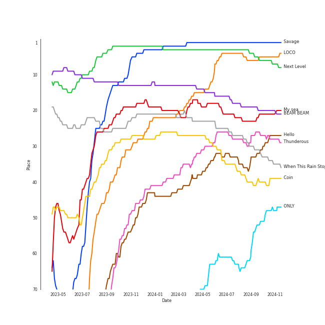

# Tracks in Liked Tracks from 2021

## Artists

| Art | Rank | Tracks | 💚 | Artist | 🔗 |
|:---|---:|---:|---:|:---|:---|
|  | 9 | 9 | 9 | [TWICE](../../../artists/twice/overview.md) | [🔗](https://open.spotify.com/artist/7n2Ycct7Beij7Dj7meI4X0) |
|  | 7 | 8 | 8 | [ENHYPEN](../../../artists/enhypen/overview.md) | [🔗](https://open.spotify.com/artist/5t5FqBwTcgKTaWmfEbwQY9) |
|  | 11 | 7 | 7 | [LeeHi](../../../artists/leehi/overview.md) | [🔗](https://open.spotify.com/artist/7cVZApDoQZpS447nHTsNqu) |
|  | 1 | 7 | 7 | [aespa](../../../artists/aespa/overview.md) | [🔗](https://open.spotify.com/artist/6YVMFz59CuY7ngCxTxjpxE) |
|  | 3 | 7 | 7 | [IU](../../../artists/iu/overview.md) | [🔗](https://open.spotify.com/artist/3HqSLMAZ3g3d5poNaI7GOU) |
|  | 14 | 7 | 7 | [CHUNG HA](../../../artists/chung_ha/overview.md) | [🔗](https://open.spotify.com/artist/2PSJ6YriU7JsFucxACpU7Y) |
|  | 5 | 6 | 6 | [ITZY](../../../artists/itzy/overview.md) | [🔗](https://open.spotify.com/artist/2KC9Qb60EaY0kW4eH68vr3) |
|  | 28 | 5 | 5 | [JEON SOYEON](../../../artists/jeon_soyeon/overview.md) | [🔗](https://open.spotify.com/artist/6Xg22wJOAcnvPUfk5WvODH) |
|  | 53 | 5 | 5 | [BAEKHYUN](../../../artists/baekhyun/overview.md) | [🔗](https://open.spotify.com/artist/4ufh0WuMZh6y4Dmdnklvdl) |
|  | 10 | 5 | 5 | [Stray Kids](../../../artists/stray_kids/overview.md) | [🔗](https://open.spotify.com/artist/2dIgFjalVxs4ThymZ67YCE) |

View all

| Art | Rank | Tracks | 💚 | Artist | 🔗 |
|:---|---:|---:|---:|:---|:---|
|  | 26 | 5 | 5 | [WENDY](../../../artists/wendy/overview.md) | [🔗](https://open.spotify.com/artist/0FRUZvZNPzM3YJMABJxf2K) |
|  | 2 | 4 | 4 | [Red Velvet](../../../artists/red_velvet/overview.md) | [🔗](https://open.spotify.com/artist/1z4g3DjTBBZKhvAroFlhOM) |
|  | 69 | 3 | 3 | JEON SOMI | [🔗](https://open.spotify.com/artist/7zYj9S9SdIunYCfSm7vzAR) |
|  | 12 | 3 | 3 | [SEVENTEEN](../../../artists/seventeen/overview.md) | [🔗](https://open.spotify.com/artist/7nqOGRxlXj7N2JYbgNEjYH) |
|  | 30 | 3 | 3 | [NCT 127](../../../artists/nct_127/overview.md) | [🔗](https://open.spotify.com/artist/7f4ignuCJhLXfZ9giKT7rH) |
|  | 434 | 3 | 3 | Silk Sonic | [🔗](https://open.spotify.com/artist/6PvvGcCY2XtUcSRld1Wilr) |
|  | 52 | 3 | 3 | [PURPLE KISS](../../../artists/purple_kiss/overview.md) | [🔗](https://open.spotify.com/artist/62T5PGHWJ9sxP2SJq20IHq) |
|  | 204 | 3 | 3 | [Doja Cat](../../../artists/doja_cat/overview.md) | [🔗](https://open.spotify.com/artist/5cj0lLjcoR7YOSnhnX0Po5) |
|  | 434 | 3 | 3 | Anderson .Paak | [🔗](https://open.spotify.com/artist/3jK9MiCrA42lLAdMGUZpwa) |
|  | 42 | 3 | 3 | [EVERGLOW](../../../artists/everglow/overview.md) | [🔗](https://open.spotify.com/artist/3ZZzT0naD25RhY2uZvIKkJ) |
|  | 22 | 3 | 3 | [Billlie](../../../artists/billlie/overview.md) | [🔗](https://open.spotify.com/artist/2GQxKDojobwBjZMPf7aoh0) |
|  | 62 | 3 | 3 | [PENTAGON](../../../artists/pentagon/overview.md) | [🔗](https://open.spotify.com/artist/1wKpMkucynaTfG8lyPprYV) |
|  | 292 | 3 | 3 | [Olivia Rodrigo](../../../artists/olivia_rodrigo/overview.md) | [🔗](https://open.spotify.com/artist/1McMsnEElThX1knmY4oliG) |
|  | 161 | 3 | 3 | [TOMORROW X TOGETHER](../../../artists/tomorrow_x_together/overview.md) | [🔗](https://open.spotify.com/artist/0ghlgldX5Dd6720Q3qFyQB) |
|  | 91 | 3 | 3 | [Bruno Mars](../../../artists/bruno_mars/overview.md) | [🔗](https://open.spotify.com/artist/0du5cEVh5yTK9QJze8zA0C) |
|  | 434 | 2 | 2 | WOODZ | [🔗](https://open.spotify.com/artist/6y9nlaoynxSvoTGY09Vdcy) |
|  | 46 | 2 | 2 | [Billie Eilish](../../../artists/billie_eilish/overview.md) | [🔗](https://open.spotify.com/artist/6qqNVTkY8uBg9cP3Jd7DAH) |
|  | 44 | 2 | 2 | [SUNMI](../../../artists/sunmi/overview.md) | [🔗](https://open.spotify.com/artist/6MoXcK2GyGg7FIyxPU5yW6) |
|  | 45 | 2 | 2 | [ATEEZ](../../../artists/ateez/overview.md) | [🔗](https://open.spotify.com/artist/68KmkJeZGfwe1OUaivBa2L) |
|  | 217 | 2 | 2 | PinkFantasy | [🔗](https://open.spotify.com/artist/5syu5kN4a5f4rgMCRGlnZp) |
|  | 29 | 2 | 2 | [Dreamcatcher](../../../artists/dreamcatcher/overview.md) | [🔗](https://open.spotify.com/artist/5V1qsQHdXNm4ZEZHWvFnqQ) |
|  | 141 | 2 | 2 | ROSÉ | [🔗](https://open.spotify.com/artist/3eVa5w3URK5duf6eyVDbu9) |
|  | 248 | 2 | 2 | ONEUS | [🔗](https://open.spotify.com/artist/3CVYSpM7nfHFG5qCTW7Ht9) |
|  | 419 | 2 | 2 | Seori | [🔗](https://open.spotify.com/artist/2bWTIIQP9zaVc55RaMGu7e) |
|  | 39 | 2 | 2 | [The Tarpeggios](../../../artists/the_tarpeggios/overview.md) | [🔗](https://open.spotify.com/artist/2HXd5pFHJyaQJr5aXfErrE) |
|  | 6 | 2 | 2 | [(G)I-DLE](../../../artists/(g)i-dle/overview.md) | [🔗](https://open.spotify.com/artist/2AfmfGFbe0A0WsTYm0SDTx) |
|  | 65 | 2 | 2 | [YUQI](../../../artists/yuqi/overview.md) | [🔗](https://open.spotify.com/artist/22aCD8IrQZjcPgZw728QT6) |
|  | 89 | 2 | 2 | [OH MY GIRL](../../../artists/oh_my_girl/overview.md) | [🔗](https://open.spotify.com/artist/2019zR22qK2RBvCqtudBaI) |
|  | 24 | 2 | 2 | [NCT DREAM](../../../artists/nct_dream/overview.md) | [🔗](https://open.spotify.com/artist/1gBUSTR3TyDdTVFIaQnc02) |
|  | 50 | 2 | 2 | JOY | [🔗](https://open.spotify.com/artist/0sYpJ0nCC8AlDrZFeAA7ub) |
|  | 136 | 2 | 2 | PIXY | [🔗](https://open.spotify.com/artist/0CJkEzffVZLgav03xXeC9s) |
|  | 425 | 2 | 2 | Whee In | [🔗](https://open.spotify.com/artist/0BqRGrwqndrtNkojXiqIzL) |
|  | 15 | 2 | 2 | [STAYC](../../../artists/stayc/overview.md) | [🔗](https://open.spotify.com/artist/01XYiBYaoMJcNhPokrg0l0) |
|  | 205 | 1 | 1 | SZA | [🔗](https://open.spotify.com/artist/7tYKF4w9nC0nq9CsPZTHyP) |
|  | 434 | 1 | 1 | Lil Nas X | [🔗](https://open.spotify.com/artist/7jVv8c5Fj3E9VhNjxT4snq) |
|  | 51 | 1 | 1 | [HWASA](../../../artists/hwasa/overview.md) | [🔗](https://open.spotify.com/artist/7bmYpVgQub656uNTu6qGNQ) |
| | 434 | 1 | 1 | CHUNG HA | [🔗](https://open.spotify.com/artist/73tdwqQJWnBdf1jyUeMwyu) |
|  | 434 | 1 | 1 | Weeekly | [🔗](https://open.spotify.com/artist/73B9bjqS2Z5KLXNGqXf64m) |
|  | 434 | 1 | 1 | WONHO | [🔗](https://open.spotify.com/artist/6pC3vnUgNVITdYMMXefi6D) |
|  | 112 | 1 | 1 | KAI | [🔗](https://open.spotify.com/artist/6iVo62B0bdTknRcrktCmak) |
|  | 258 | 1 | 1 | [WJSN](../../../artists/wjsn/overview.md) | [🔗](https://open.spotify.com/artist/6hhqsQZhtp9hfaZhSd0VSD) |
|  | 130 | 1 | 1 | R3HAB | [🔗](https://open.spotify.com/artist/6cEuCEZu7PAE9ZSzLLc2oQ) |
|  | 72 | 1 | 1 | [BIBI](../../../artists/bibi/overview.md) | [🔗](https://open.spotify.com/artist/6UbmqUEgjLA6jAcXwbM1Z9) |
|  | 17 | 1 | 1 | [IVE](../../../artists/ive/overview.md) | [🔗](https://open.spotify.com/artist/6RHTUrRF63xao58xh9FXYJ) |
|  | 71 | 1 | 1 | [AKMU](../../../artists/akmu/overview.md) | [🔗](https://open.spotify.com/artist/6OwKE9Ez6ALxpTaKcT5ayv) |
|  | 434 | 1 | 1 | HyunA&DAWN | [🔗](https://open.spotify.com/artist/6JTCN21ovvrR3iPViZTXz4) |
|  | 74 | 1 | 1 | [YOASOBI](../../../artists/yoasobi/overview.md) | [🔗](https://open.spotify.com/artist/64tJ2EAv1R6UaZqc4iOCyj) |
|  | 434 | 1 | 1 | Jessi | [🔗](https://open.spotify.com/artist/64k5e9kV9MdukXjFrR5R37) |
|  | 345 | 1 | 1 | Bebe Rexha | [🔗](https://open.spotify.com/artist/64M6ah0SkkRsnPGtGiRAbb) |
|  | 434 | 1 | 1 | Jin | [🔗](https://open.spotify.com/artist/5vV3bFXnN6D6N3Nj4xRvaV) |
|  | 305 | 1 | 1 | KANGDANIEL | [🔗](https://open.spotify.com/artist/5vGoWnZO65NBgiZYBmi3iW) |
|  | 434 | 1 | 1 | Wonstein | [🔗](https://open.spotify.com/artist/5o615XColiSVMPDWlslKSk) |
|  | 172 | 1 | 1 | MINGYU | [🔗](https://open.spotify.com/artist/5gUpo0BRmo6EOTbyU3z5Ay) |
|  | 38 | 1 | 1 | [HEIZE](../../../artists/heize/overview.md) | [🔗](https://open.spotify.com/artist/5dCvSnVduaFleCnyy98JMo) |
|  | 60 | 1 | 1 | [Solar](../../../artists/solar/overview.md) | [🔗](https://open.spotify.com/artist/5cYcI546S8Lf97m4mNdYLD) |
|  | 311 | 1 | 1 | [MOMOLAND](../../../artists/momoland/overview.md) | [🔗](https://open.spotify.com/artist/5RR0MLwcjc87wjSw2JYdwx) |
|  | 97 | 1 | 1 | [LOONA](../../../artists/loona/overview.md) | [🔗](https://open.spotify.com/artist/52zMTJCKluDlFwMQWmccY7) |
|  | 95 | 1 | 1 | WayV-TEN&YANGYANG | [🔗](https://open.spotify.com/artist/4wOAdZOMOVSwrZQxDYrUx3) |
|  | 346 | 1 | 1 | Travis Barker | [🔗](https://open.spotify.com/artist/4exLIFE8sISLr28sqG1qNX) |
|  | 129 | 1 | 1 | [Adele](../../../artists/adele/overview.md) | [🔗](https://open.spotify.com/artist/4dpARuHxo51G3z768sgnrY) |
|  | 254 | 1 | 1 | Lee Mujin | [🔗](https://open.spotify.com/artist/4Xj0peBt3EZHbdF20JmdWC) |
|  | 194 | 1 | 1 | MONSTA X | [🔗](https://open.spotify.com/artist/4TnGh5PKbSjpYqpIdlW5nz) |
|  | 218 | 1 | 1 | Pom Poko | [🔗](https://open.spotify.com/artist/4RkC3KmYWnr6PM1FM5Shwz) |
|  | 434 | 1 | 1 | YUKIKA | [🔗](https://open.spotify.com/artist/4RfI1z9u2xIc5Qnqac4JbO) |
|  | 434 | 1 | 1 | EUNHA | [🔗](https://open.spotify.com/artist/4MLK9Hhz7UhxAzU2awoLxk) |
|  | 171 | 1 | 1 | WONWOO | [🔗](https://open.spotify.com/artist/3rHcBT06Vb1XGVUWhDALZt) |
|  | 252 | 1 | 1 | [NCT U](../../../artists/nct_u/overview.md) | [🔗](https://open.spotify.com/artist/3paGCCtX1Xr4Gx53mSeZuQ) |
|  | 107 | 1 | 1 | CHANGMO | [🔗](https://open.spotify.com/artist/3hvinNZRzTLoREmqFiKr1b) |
|  | 35 | 1 | 1 | [TEN](../../../artists/ten/overview.md) | [🔗](https://open.spotify.com/artist/3Q5Qep7ytrjVleNnMnntgQ) |
|  | 434 | 1 | 1 | ADORA | [🔗](https://open.spotify.com/artist/3M1kgHOpPruu1uBymBHF3r) |
|  | 434 | 1 | 1 | JO YURI | [🔗](https://open.spotify.com/artist/3LFFf4EpKn2krneZ9vozyz) |
|  | 78 | 1 | 1 | [TREASURE](../../../artists/treasure/overview.md) | [🔗](https://open.spotify.com/artist/3KonOYiLsU53m4yT7gNotP) |
|  | 313 | 1 | 1 | Cherry Bullet | [🔗](https://open.spotify.com/artist/3IJCdgkBZbieocLZ4e94GZ) |
|  | 121 | 1 | 1 | BLITZERS | [🔗](https://open.spotify.com/artist/3Exoh42YMeqnUvYahAGgUE) |
|  | 122 | 1 | 1 | YOUHA | [🔗](https://open.spotify.com/artist/2lZFlNiQMLa2fuX3pkXcan) |
|  | 434 | 1 | 1 | The Volunteers | [🔗](https://open.spotify.com/artist/2jLHrOkh1M5rLJgnrgfQf1) |
|  | 434 | 1 | 1 | Moliy | [🔗](https://open.spotify.com/artist/2hVWBpjLW4Q7fboYz2pVYK) |
|  | 100 | 1 | 1 | [SHINee](../../../artists/shinee/overview.md) | [🔗](https://open.spotify.com/artist/2hRQKC0gqlZGPrmUKbcchR) |
|  | 199 | 1 | 1 | Stella Jang | [🔗](https://open.spotify.com/artist/2Y9AUayH5pyZpVfkDYDfJV) |
|  | 384 | 1 | 1 | Jennifer Nettles | [🔗](https://open.spotify.com/artist/2WV4xLQooFalR2cit0XSKp) |
|  | 434 | 1 | 1 | 大籽 | [🔗](https://open.spotify.com/artist/2NJLAUSe3Ifk9MiHbddRAi) |
|  | 434 | 1 | 1 | D.O. | [🔗](https://open.spotify.com/artist/2CQZr2RPZmrcvDnaod1ldC) |
|  | 434 | 1 | 1 | Amaarae | [🔗](https://open.spotify.com/artist/21UPYSRWFKwtqvSAnFnSvS) |
|  | 212 | 1 | 1 | [Justin Bieber](../../../artists/justin_bieber/overview.md) | [🔗](https://open.spotify.com/artist/1uNFoZAHBGtllmzznpCI3s) |
|  | 434 | 1 | 1 | YB | [🔗](https://open.spotify.com/artist/1rpgxJZxZMLnFNc1Jmyov5) |
|  | 434 | 1 | 1 | Yebba | [🔗](https://open.spotify.com/artist/1ooV8YZC1KbpEcrmI8WH0F) |
|  | 178 | 1 | 1 | Moon Byul | [🔗](https://open.spotify.com/artist/1eTft3tXynrKdo6XD7QHLL) |
|  | 354 | 1 | 1 | The Weeknd | [🔗](https://open.spotify.com/artist/1Xyo4u8uXC1ZmMpatF05PJ) |
|  | 434 | 1 | 1 | Kali Uchis | [🔗](https://open.spotify.com/artist/1U1el3k54VvEUzo3ybLPlM) |
|  | 137 | 1 | 1 | YOON MIRAE | [🔗](https://open.spotify.com/artist/1Do4bSzfUl0KWL9r1fITu0) |
|  | 55 | 1 | 1 | [TAEMIN](../../../artists/taemin/overview.md) | [🔗](https://open.spotify.com/artist/13rF01aOogvnkuQXOlgTW8) |
|  | 335 | 1 | 1 | Måneskin | [🔗](https://open.spotify.com/artist/0lAWpj5szCSwM4rUMHYmrr) |
|  | 434 | 1 | 1 | CHROMANCE | [🔗](https://open.spotify.com/artist/0fEj1fYIQwWj1bzzAto9rp) |
|  | 67 | 1 | 1 | Lee Young Ji | [🔗](https://open.spotify.com/artist/0Y2AcMPMpeuPXtPQGVvRBq) |
|  | 16 | 1 | 1 | [MAMAMOO](../../../artists/mamamoo/overview.md) | [🔗](https://open.spotify.com/artist/0XATRDCYuuGhk0oE7C0o5G) |
|  | 417 | 1 | 1 | B.I | [🔗](https://open.spotify.com/artist/0UntV1Bw2hk3fbRrm9eMP6) |
|  | 434 | 1 | 1 | WJSN THE BLACK | [🔗](https://open.spotify.com/artist/0M3eRYg8ULjCtLFvhc5Orb) |
|  | 131 | 1 | 1 | [THE BOYZ](../../../artists/the_boyz/overview.md) | [🔗](https://open.spotify.com/artist/0CmvFWTX9zmMNCUi6fHtAx) |
|  | 434 | 1 | 1 | Guaynaa | [🔗](https://open.spotify.com/artist/0BqURncJM5B1BBu7UM51eq) |

## Albums

| Art | Rank | Tracks | 💚 | Album | Release Date | 🔗 |
|:---|---:|---:|---:|:---|:---|:---|
|  | 162 | 7 | 7 | Querencia | 2021-02-15 | [🔗](https://open.spotify.com/album/3ZifpmJjOEkpYCNSIq352p) |
|  | 100 | 6 | 6 | Formula of Love: O+T=<3 | 2021-11-12 | [🔗](https://open.spotify.com/album/5052Ip89wdW8EGdpjEpNeq) |
|  | 45 | 6 | 6 | 4 ONLY | 2021-09-09 | [🔗](https://open.spotify.com/album/1DKgZeAYrjslAPZVMe6EFt) |
|  | 27 | 5 | 5 | Windy | 2021-07-05 | [🔗](https://open.spotify.com/album/1lv92CIVZbB2BsHmIx7qJf) |
|  | 4 | 5 | 5 | Savage - The 1st Mini Album | 2021-10-05 | [🔗](https://open.spotify.com/album/3vyyDkvYWC36DwgZCYd3Wu) |
|  | 30 | 5 | 5 | Like Water - The 1st Mini Album | 2021-04-05 | [🔗](https://open.spotify.com/album/1Ao5vWPO13f4l0ldwxOKL7) |
|  | 6 | 5 | 5 | IU 5th Album 'LILAC' | 2021-03-25 | [🔗](https://open.spotify.com/album/01dPJcwyht77brL4JQiR8R) |
|  | 124 | 5 | 5 | DIMENSION : DILEMMA | 2021-10-12 | [🔗](https://open.spotify.com/album/5jGRqioNCSWZGBl3QmyuFI) |
|  | 525 | 4 | 4 | Queendom - The 6th Mini Album | 2021-08-16 | [🔗](https://open.spotify.com/album/6Pe5LGQgU3mmvuRjFMsACV) |
|  | 35 | 4 | 4 | NOEASY | 2021-08-23 | [🔗](https://open.spotify.com/album/558tpdCejjVQNFAumRAeQj) |

View all

| Art | Rank | Tracks | 💚 | Album | Release Date | 🔗 |
|:---|---:|---:|---:|:---|:---|:---|
|  | 68 | 3 | 3 | the Billage of perception : chapter one | 2021-11-10 | [🔗](https://open.spotify.com/album/1kp4txZsSpDNR4EoDFi2LD) |
|  | 332 | 3 | 3 | Taste of Love | 2021-06-11 | [🔗](https://open.spotify.com/album/00vb6sViDbJLmLLchfbRh4) |
|  | 607 | 3 | 3 | LOVE or TAKE | 2021-03-15 | [🔗](https://open.spotify.com/album/5iu1d69dqEo9UaKpZDYoIV) |
|  | 199 | 3 | 3 | GUESS WHO | 2021-04-30 | [🔗](https://open.spotify.com/album/4lS8nhX8cplsYPzKjvhw6G) |
|  | 11 | 3 | 3 | CRAZY IN LOVE | 2021-09-24 | [🔗](https://open.spotify.com/album/4U7rGOkJgtxs27H9L93Xli) |
|  | 174 | 3 | 3 | BORDER : CARNIVAL | 2021-04-26 | [🔗](https://open.spotify.com/album/4LGYBcRsteiXjcPD4QQvxv) |
|  | 665 | 3 | 3 | An Evening With Silk Sonic | 2021-11-11 | [🔗](https://open.spotify.com/album/1YgekJJTEueWDaMr7BYqPk) |
|  | 665 | 2 | 2 | XOXO | 2021-10-29 | [🔗](https://open.spotify.com/album/63pvOn2B5pUUcUKUwIEg9m) |
|  | 665 | 2 | 2 | The Chaos Chapter: FREEZE | 2021-05-31 | [🔗](https://open.spotify.com/album/5Zdr9vactwnJH4Vpe9Mid9) |
|  | 187 | 2 | 2 | Sticker - The 3rd Album | 2021-09-17 | [🔗](https://open.spotify.com/album/6nYbIKGcTmKM5BAlJPPcad) |
|  | 637 | 2 | 2 | SEVENTEEN 8th Mini Album 'Your Choice' | 2021-06-18 | [🔗](https://open.spotify.com/album/79VvXTQNeLr8KmvcdxN0Pc) |
|  | 665 | 2 | 2 | Return of The Girl | 2021-12-01 | [🔗](https://open.spotify.com/album/28p4jKCNlbLUXaZ24iYLuD) |
|  | 665 | 2 | 2 | Redd | 2021-04-13 | [🔗](https://open.spotify.com/album/32pXXle0zoKIFG03iefH2c) |
|  | 223 | 2 | 2 | R | 2021-03-12 | [🔗](https://open.spotify.com/album/5BQcoDfcZ8aBcikYX9B7Ob) |
|  | 665 | 2 | 2 | Planet Her | 2021-06-25 | [🔗](https://open.spotify.com/album/1nAQbHeOWTfQzbOoFrvndW) |
|  | 665 | 2 | 2 | ONLY LOVERS LEFT | 2021-10-05 | [🔗](https://open.spotify.com/album/1u9nYBB0Qw5jyjkexe9Xk6) |
|  | 665 | 2 | 2 | Immaterial | 2021-07-16 | [🔗](https://open.spotify.com/album/5YgtPHMCi4dGtL6JarEGkI) |
|  | 665 | 2 | 2 | INTO VIOLET | 2021-03-15 | [🔗](https://open.spotify.com/album/3CjwKaPAPzaHgivlGFjsp4) |
|  | 88 | 2 | 2 | I burn | 2021-01-11 | [🔗](https://open.spotify.com/album/3ma5amx5s3l1NKoWNHaMYe) |
|  | 34 | 2 | 2 | Hello - Special Album | 2021-05-31 | [🔗](https://open.spotify.com/album/37mRfTDwQzVbHihypYY8oE) |
|  | 547 | 2 | 2 | Happier Than Ever | 2021-07-30 | [🔗](https://open.spotify.com/album/0JGOiO34nwfUdDrD612dOp) |
|  | 665 | 2 | 2 | Dear OHMYGIRL | 2021-05-10 | [🔗](https://open.spotify.com/album/2xfmLni05CCgygcNdtPvuN) |
|  | 665 | 2 | 2 | Bambi - The 3rd Mini Album | 2021-03-30 | [🔗](https://open.spotify.com/album/5xOx4mWABbTj0qWyZC4q1p) |
|  | 624 | 2 | 2 | BAEKHYUN | 2021-01-20 | [🔗](https://open.spotify.com/album/1jV1UooTpZ7c90umcENmOC) |
|  | 130 | 2 | 2 | A Page | 2021-05-13 | [🔗](https://open.spotify.com/album/7jmRVFWYCVgx2OEC1ZQJH8) |
|  | 665 | 1 | 1 | 기기괴괴 | 2021-10-31 | [🔗](https://open.spotify.com/album/296fyWl3wGRk4pB7sbaAwx) |
|  | 665 | 1 | 1 | 공감 (Empathy) - The 1st Mini Album | 2021-07-26 | [🔗](https://open.spotify.com/album/4dqWy2Soq1Z1rqgKfXOATk) |
|  | 665 | 1 | 1 | 白月光与朱砂痣 | 2021-01-01 | [🔗](https://open.spotify.com/album/22QqokF4etKGtDv3BrNvXK) |
|  | 604 | 1 | 1 | 怪物 | 2021-01-06 | [🔗](https://open.spotify.com/album/41HUxKwnbrg8IdelmMibj9) |
|  | 665 | 1 | 1 | timeabout, | 2021-04-07 | [🔗](https://open.spotify.com/album/1cBAfX0otvkoIOI6HtOrAc) |
|  | 665 | 1 | 1 | good 4 u | 2021-05-14 | [🔗](https://open.spotify.com/album/3rMjL8NA5Wh2hbMNk2fSlY) |
|  | 665 | 1 | 1 | drivers license | 2021-01-08 | [🔗](https://open.spotify.com/album/66FPnVL9G4CMKy3wvaGTcr) |
|  | 665 | 1 | 1 | deja vu | 2021-04-01 | [🔗](https://open.spotify.com/album/3lwHyR4joA1xB7Nun21EP6) |
|  | 402 | 1 | 1 | [Summer Holiday] | 2021-07-30 | [🔗](https://open.spotify.com/album/3dD0qCBPe7eYeaftyIKwa5) |
|  | 372 | 1 | 1 | [Dystopia : Road to Utopia] | 2021-01-26 | [🔗](https://open.spotify.com/album/1EyLcB9R1KfUV45AxtRR3V) |
|  | 665 | 1 | 1 | [&] | 2021-06-28 | [🔗](https://open.spotify.com/album/747FhjbZXy5H8frCZ90eDv) |
|  | 351 | 1 | 1 | ZERO : FEVER Part.3 | 2021-09-13 | [🔗](https://open.spotify.com/album/5ozaWoYQScjFzGODcJmy3G) |
|  | 665 | 1 | 1 | Wrap Me In Plastic | 2021-02-05 | [🔗](https://open.spotify.com/album/58VYPx8GBYTf3Sz2RyPApB) |
|  | 665 | 1 | 1 | Wings | 2021-02-24 | [🔗](https://open.spotify.com/album/4knaQg3CtzHlA2m99NS7xW) |
|  | 665 | 1 | 1 | When Night Is Falling | 2021-07-07 | [🔗](https://open.spotify.com/album/3nOIsILeko2meMblKEGYZw) |
|  | 665 | 1 | 1 | WAW | 2021-06-02 | [🔗](https://open.spotify.com/album/0gt7dy4ONFo6uc8D5w2WNi) |
|  | 85 | 1 | 1 | VINCENZO (Original Television Soundtrack) Pt. 3 | 2021-03-14 | [🔗](https://open.spotify.com/album/47ulDGfVUWUcUSWRQCzxr3) |
|  | 665 | 1 | 1 | Universe (Let's Play Ball) | 2021-12-10 | [🔗](https://open.spotify.com/album/31BJasH9nLradtMdJEIDXk) |
|  | 665 | 1 | 1 | UNNATURAL | 2021-03-31 | [🔗](https://open.spotify.com/album/0uD1Chx5ZsnZM4kS8yK0S8) |
|  | 326 | 1 | 1 | Traffic light | 2021-05-14 | [🔗](https://open.spotify.com/album/4lHGpxL8peLQSZRgl1Lssm) |
|  | 665 | 1 | 1 | The Volunteers | 2021-05-27 | [🔗](https://open.spotify.com/album/0hwXFwuvVfZwn6asTargTD) |
|  | 665 | 1 | 1 | The Chaos Chapter: FIGHT OR ESCAPE | 2021-08-17 | [🔗](https://open.spotify.com/album/2CjIfWoFITACUOlWGB7os5) |
|  | 665 | 1 | 1 | Teatro d'ira - Vol. I | 2021-03-19 | [🔗](https://open.spotify.com/album/7KF1Ain9mYYlg5M46g0i4A) |
|  | 665 | 1 | 1 | Taxidriver OST Part.1 | 2021-04-16 | [🔗](https://open.spotify.com/album/3PNXlS9tggXmCm1hrlHDcQ) |
|  | 665 | 1 | 1 | THE FIRST STEP : TREASURE EFFECT | 2021-01-11 | [🔗](https://open.spotify.com/album/5tQDFmW8QrZdTsICpLQBTL) |
|  | 573 | 1 | 1 | THE BOYZ 6TH MINI ALBUM [THRILL-ING] | 2021-08-09 | [🔗](https://open.spotify.com/album/0lh0pZ8GjZGrAhzIG4Jn0E) |
|  | 665 | 1 | 1 | TAIL | 2021-02-23 | [🔗](https://open.spotify.com/album/6N8gHTBafJrVn0tcn9AKqz) |
|  | 665 | 1 | 1 | Stairs | 2021-10-15 | [🔗](https://open.spotify.com/album/0s3ME19b7uNfrBvKXBFwM7) |
|  | 665 | 1 | 1 | Shutdown (Feat. Seori) | 2021-12-30 | [🔗](https://open.spotify.com/album/3qGgRGX3KHbwph4AzWVko1) |
|  | 493 | 1 | 1 | STEREOTYPE | 2021-09-06 | [🔗](https://open.spotify.com/album/7HGjNJBj1NQGNwCzFD2LHj) |
|  | 665 | 1 | 1 | STAYDOM | 2021-04-08 | [🔗](https://open.spotify.com/album/71hjsg660uio3Z8bnbB6fS) |
|  | 665 | 1 | 1 | SEVENTEEN 9th Mini Album 'Attacca' | 2021-10-22 | [🔗](https://open.spotify.com/album/2PIReru2w5i4JXOzeZnamd) |
|  | 665 | 1 | 1 | SAD GIRLZ LUV MONEY Remix (feat. Kali Uchis and Moliy) | 2021-09-16 | [🔗](https://open.spotify.com/album/4q4rHdKxyCzxuQrPcdjPyC) |
|  | 665 | 1 | 1 | Play Game : Holiday | 2021-08-04 | [🔗](https://open.spotify.com/album/1FDlvA1PdZujiEhbXihIPJ) |
|  | 642 | 1 | 1 | Pieces | 2021-12-29 | [🔗](https://open.spotify.com/album/3ivhPVStd9RrtczBFwjkMQ) |
|  | 665 | 1 | 1 | Peaches - The 2nd Mini Album | 2021-11-30 | [🔗](https://open.spotify.com/album/1meyTrwRpRw7RnD8aoFfj0) |
|  | 228 | 1 | 1 | Paint Me Naked - SM STATION | 2021-08-10 | [🔗](https://open.spotify.com/album/4oj5R0SVazc5Eq3WnIC0e6) |
|  | 404 | 1 | 1 | PARANOIA | 2021-02-16 | [🔗](https://open.spotify.com/album/6vxwhImvm7xkbIMk0e1LVv) |
|  | 665 | 1 | 1 | One of a Kind | 2021-06-01 | [🔗](https://open.spotify.com/album/2Zuovdo5g1RhfbHniwZ8yI) |
|  | 665 | 1 | 1 | October Sky | 2021-06-11 | [🔗](https://open.spotify.com/album/6w7gENsq0E5THRxQZkA1D0) |
|  | 13 | 1 | 1 | Next Level | 2021-05-17 | [🔗](https://open.spotify.com/album/2CzbrboOLzeRoaaH1N5K0N) |
|  | 412 | 1 | 1 | NEXT EPISODE | 2021-07-26 | [🔗](https://open.spotify.com/album/0Pt0eGpyNO5dDN8PORypSy) |
|  | 665 | 1 | 1 | My attitude | 2021-05-12 | [🔗](https://open.spotify.com/album/1RR97BqW9TH7t0vV4T9JcG) |
|  | 665 | 1 | 1 | MONTERO (Call Me By Your Name) | 2021-03-31 | [🔗](https://open.spotify.com/album/2Hjcfw8zHN4dJDZJGOzLd6) |
|  | 665 | 1 | 1 | MAKE U DANCE | 2021-11-05 | [🔗](https://open.spotify.com/album/1UoyICgBwsGpylrHLj5zep) |
|  | 114 | 1 | 1 | Low Low | 2021-08-17 | [🔗](https://open.spotify.com/album/58Y92GzXpCV5D6WRNqzOYN) |
|  | 665 | 1 | 1 | Love Synonym #2 : Right for Us | 2021-02-26 | [🔗](https://open.spotify.com/album/3lcR6erLOtS2klUZ5sH4Mf) |
|  | 553 | 1 | 1 | Last Melody | 2021-05-25 | [🔗](https://open.spotify.com/album/4ZDUTnUO9CDFmwdCUCQ6dG) |
|  | 665 | 1 | 1 | Kiss Me More (feat. SZA) | 2021-04-09 | [🔗](https://open.spotify.com/album/1OnzqJTL9bwe4kvaLxRYxt) |
|  | 665 | 1 | 1 | Killing Me | 2021-11-29 | [🔗](https://open.spotify.com/album/21jf5kUkK5nHYTuZ5GRZVW) |
|  | 513 | 1 | 1 | KINGDOM <FINAL : WHO IS THE KING?> | 2021-05-28 | [🔗](https://open.spotify.com/album/3n1NaviPQXfiVQ0TarnAf4) |
|  | 568 | 1 | 1 | Justice | 2021-03-19 | [🔗](https://open.spotify.com/album/5dGWwsZ9iB2Xc3UKR0gif2) |
|  | 665 | 1 | 1 | Jirisan (Original Television Soundtrack) Pt. 4 | 2021-11-07 | [🔗](https://open.spotify.com/album/2FUiBNFWz47sBPEf3Dcma4) |
|  | 255 | 1 | 1 | Hot Sauce - The 1st Album | 2021-05-10 | [🔗](https://open.spotify.com/album/1miTgxRTUje9Jqml1aOSUi) |
|  | 665 | 1 | 1 | Hello Future - The 1st Album Repackage | 2021-06-28 | [🔗](https://open.spotify.com/album/1fRqXYwoLDxG3EwP70qnjM) |
|  | 665 | 1 | 1 | HAPPEN | 2021-05-20 | [🔗](https://open.spotify.com/album/4xOOB79WcZuOoVwK06No1s) |
|  | 665 | 1 | 1 | Guilty Pleasure | 2021-11-24 | [🔗](https://open.spotify.com/album/7jke1vYOze3jdyTiWhtFnz) |
|  | 665 | 1 | 1 | GLASSY | 2021-10-07 | [🔗](https://open.spotify.com/album/2WCMmZ8vXBnkVp97PzLeoA) |
|  | 665 | 1 | 1 | Favorite - The 3rd Album Repackage | 2021-10-25 | [🔗](https://open.spotify.com/album/5LbnQtyHBfJUCigA08llHX) |
|  | 231 | 1 | 1 | Fairyforest : Temptation | 2021-10-07 | [🔗](https://open.spotify.com/album/3999VmQrZOafu4NjYkc0rj) |
|  | 665 | 1 | 1 | Easy On Me | 2021-10-14 | [🔗](https://open.spotify.com/album/224jZ4sUX7OhAuMwaxp86S) |
|  | 367 | 1 | 1 | ELEVEN | 2021-12-01 | [🔗](https://open.spotify.com/album/1XMYvsHRt52sMi6wittWqI) |
|  | 665 | 1 | 1 | Dreams Come True - SM STATION | 2021-12-20 | [🔗](https://open.spotify.com/album/4Jzx0XAORPKQ3v7EaL8Ful) |
|  | 615 | 1 | 1 | Doom at Your Service (Original Television Soundtrack) Pt. 3 | 2021-05-31 | [🔗](https://open.spotify.com/album/2fy01jwC0GrnBGQ4Crcnve) |
|  | 345 | 1 | 1 | Don't Call Me - The 7th Album | 2021-02-22 | [🔗](https://open.spotify.com/album/6bfcHf3khPey88qjiiw8V3) |
|  | 66 | 1 | 1 | DUMB DUMB | 2021-08-02 | [🔗](https://open.spotify.com/album/24sFioeGsPtxa5fD6VzL8b) |
|  | 665 | 1 | 1 | Cold Blooded | 2021-10-12 | [🔗](https://open.spotify.com/album/4CTDrZw6m0dTJX17OCEbfZ) |
|  | 203 | 1 | 1 | Christmas EveL | 2021-11-29 | [🔗](https://open.spotify.com/album/1qVuQI0WRn2Mczbdxx54Ih) |
|  | 420 | 1 | 1 | Cherry Rush | 2021-01-20 | [🔗](https://open.spotify.com/album/0W9GrOL1veUcQdbPvgjj9i) |
|  | 353 | 1 | 1 | Cherry On Top | 2021-08-10 | [🔗](https://open.spotify.com/album/7sEDri9xLbg6a27CPoD1v2) |
|  | 665 | 1 | 1 | Cheater | 2021-01-15 | [🔗](https://open.spotify.com/album/59vf7ECdQd6ZIbfc3zPwey) |
|  | 665 | 1 | 1 | Can We Talk Again | 2021-02-03 | [🔗](https://open.spotify.com/album/7upDgBOqXuwU72JPeBLIzA) |
|  | 665 | 1 | 1 | CHECK-IN | 2021-05-12 | [🔗](https://open.spotify.com/album/1ByTvinHUbdfpRMqxzGCUr) |
|  | 218 | 1 | 1 | Bittersweet (feat. LeeHi) | 2021-05-28 | [🔗](https://open.spotify.com/album/6qVk855QPCh57noNeeHMXQ) |
|  | 468 | 1 | 1 | Better Mistakes | 2021-05-07 | [🔗](https://open.spotify.com/album/0ypVp54cO3kexiJNu33wYp) |
|  | 313 | 1 | 1 | BLOOD MOON | 2021-11-09 | [🔗](https://open.spotify.com/album/13dNmnWQVodErqAhuOzYTD) |
|  | 665 | 1 | 1 | BINARY CODE | 2021-05-11 | [🔗](https://open.spotify.com/album/3MSvgJYx3omhNpSaQUqnu5) |
|  | 576 | 1 | 1 | Always Like New | 2021-06-25 | [🔗](https://open.spotify.com/album/1mDOfTvqqstiKHpmjNjYdU) |
|  | 665 | 1 | 1 | Alice in Wonderland | 2021-06-21 | [🔗](https://open.spotify.com/album/0KFsCn3mxiaKMpobo3BRQM) |
|  | 391 | 1 | 1 | Advice - The 3rd Mini Album | 2021-05-18 | [🔗](https://open.spotify.com/album/0kNUDDHwjpemplDqSZ72Ct) |
|  | 665 | 1 | 1 | 1/6 | 2021-08-06 | [🔗](https://open.spotify.com/album/3UJlc2nl7tik1gD23DOBVX) |
|  | 665 | 1 | 1 | 1+1=1 | 2021-09-09 | [🔗](https://open.spotify.com/album/3LmraKOB9oNrXrifwrYePf) |

## Tracks

| Art | Track | Album | Artists | Label | Rank | 💚 | 🔗 |
|:---|:---|:---|:---|:---|---:|:---|:---|
|  | Savage | Savage - The 1st Mini Album | [aespa](../../../artists/aespa/overview.md) | [SM Entertainment](../../../labels/sm_entertainment) | 1 | 💚 | [🔗](https://open.spotify.com/track/3dbLT62Cvs46Ju7a8gpr36) |
|  | LOCO | CRAZY IN LOVE | [ITZY](../../../artists/itzy/overview.md) | [Republic Records](../../../labels/republic_records) | 5 | 💚 | [🔗](https://open.spotify.com/track/56Yxkm62GtEpnPyG7TvwLY) |
|  | Next Level | Next Level | [aespa](../../../artists/aespa/overview.md) | [SM Entertainment](../../../labels/sm_entertainment) | 7 | 💚 | [🔗](https://open.spotify.com/track/2zrhoHlFKxFTRF5aMyxMoQ) |
|  | My sea | IU 5th Album 'LILAC' | [IU](../../../artists/iu/overview.md) | [EDAM Entertainment](../../../labels/edam_entertainment) | 20 | 💚 | [🔗](https://open.spotify.com/track/46wDG6evLn2iPoQ0F8CUWk) |
|  | BEAM BEAM | Windy | [JEON SOYEON](../../../artists/jeon_soyeon/overview.md) | [Universal Music LLC](../../../labels/universal_music_llc) | 21 | 💚 | [🔗](https://open.spotify.com/track/1VjIS4qoyD6JS2rNZQgE00) |
|  | Hello | Hello - Special Album | JOY | [SM Entertainment](../../../labels/sm_entertainment) | 27 | 💚 | [🔗](https://open.spotify.com/track/3cGp1jXxLReLKz7QgVbWZR) |
|  | Thunderous | NOEASY | [Stray Kids](../../../artists/stray_kids/overview.md) | [Republic Records](../../../labels/republic_records) | 28 | 💚 | [🔗](https://open.spotify.com/track/0nwTMzpatarzvLvtwwzdCt) |
|  | When This Rain Stops | Like Water - The 1st Mini Album | [WENDY](../../../artists/wendy/overview.md) | [SM Entertainment](../../../labels/sm_entertainment) | 35 | 💚 | [🔗](https://open.spotify.com/track/6mavVLsxaa4YcPje9qZKcf) |
|  | Coin | IU 5th Album 'LILAC' | [IU](../../../artists/iu/overview.md) | [EDAM Entertainment](../../../labels/edam_entertainment) | 39 | 💚 | [🔗](https://open.spotify.com/track/7CZRguMolNqIobnXxpV735) |
|  | ONLY | 4 ONLY | [LeeHi](../../../artists/leehi/overview.md) | [Genie Music Corporation](../../../labels/genie_music_corporation), [Stone Music Entertainment](../../../labels/stone_music_entertainment) | 47 | 💚 | [🔗](https://open.spotify.com/track/6TBJkXHPhu3EsMk1bshwuI) |

View all

| Art | Track | Album | Artists | Label | Rank | 💚 | 🔗 |
|:---|:---|:---|:---|:---|---:|:---|:---|
|  | LILAC | IU 5th Album 'LILAC' | [IU](../../../artists/iu/overview.md) | [EDAM Entertainment](../../../labels/edam_entertainment) | 61 | 💚 | [🔗](https://open.spotify.com/track/5xrtzzzikpG3BLbo4q1Yul) |
|  | DUMB DUMB | DUMB DUMB | JEON SOMI | [THE BLACK LABEL/Interscope Records](../../../labels/interscope_records) | 69 | 💚 | [🔗](https://open.spotify.com/track/0dnkOK5hGUCmIJ7FDF0yHz) |
|  | RING X RING | the Billage of perception : chapter one | [Billlie](../../../artists/billlie/overview.md) | [MYSTIC STORY](../../../labels/mystic_story) | 71 | 💚 | [🔗](https://open.spotify.com/track/4hfF0FOFcaiOtwY3NP5hnv) |
|  | Adrenaline | VINCENZO (Original Television Soundtrack) Pt. 3 | [Solar](../../../artists/solar/overview.md) | [Genie Music Corporation](../../../labels/genie_music_corporation) | 100 | 💚 | [🔗](https://open.spotify.com/track/6ZQmJVUuXk1Q27d8vkmgm8) |
|  | HANN (Alone in winter) | I burn | [(G)I-DLE](../../../artists/(g)i-dle/overview.md) | [Universal Music LLC](../../../labels/universal_music_llc) | 104 | 💚 | [🔗](https://open.spotify.com/track/2qYdsdgdeMLFzpLcMQWG2W) |
|  | I'll Make You Cry | Savage - The 1st Mini Album | [aespa](../../../artists/aespa/overview.md) | [SM Entertainment](../../../labels/sm_entertainment) | 108 | 💚 | [🔗](https://open.spotify.com/track/6l1dTAhX7P6EKvA11NLNuW) |
|  | The Feels | Formula of Love: O+T=<3 | [TWICE](../../../artists/twice/overview.md) | [Republic Records](../../../labels/republic_records) | 122 | 💚 | [🔗](https://open.spotify.com/track/308Ir17KlNdlrbVLHWhlLe) |
|  | Like Water | Like Water - The 1st Mini Album | [WENDY](../../../artists/wendy/overview.md) | [SM Entertainment](../../../labels/sm_entertainment) | 131 | 💚 | [🔗](https://open.spotify.com/track/37LhFxchiyAJVop5JgRZgY) |
|  | Low Low | Low Low | WayV-TEN&YANGYANG | LABEL V | 139 | 💚 | [🔗](https://open.spotify.com/track/1TF9k6wfT1rkHnRp1AqAum) |
|  | YEPPI YEPPI | Savage - The 1st Mini Album | [aespa](../../../artists/aespa/overview.md) | [SM Entertainment](../../../labels/sm_entertainment) | 148 | 💚 | [🔗](https://open.spotify.com/track/3UKKwGrpWWamc0XNSKXjmz) |
|  | Bonnie & Clyde | A Page | [YUQI](../../../artists/yuqi/overview.md) | [Universal Music LLC](../../../labels/universal_music_llc) | 164 | 💚 | [🔗](https://open.spotify.com/track/21aIsunB7PfZI0vlIoaJPh) |
|  | Just A Little Bit | DIMENSION : DILEMMA | [ENHYPEN](../../../artists/enhypen/overview.md) | [BELIFT LAB](../../../labels/belift_lab) | 170 | 💚 | [🔗](https://open.spotify.com/track/3QdjLOemIcMZovVOnvJP7P) |
|  | Dream of You (with R3hab) | Querencia | [CHUNG HA](../../../artists/chung_ha/overview.md), R3HAB | [MNH ENTERTAINMENT](../../../labels/mnh_entertainment) | 229 | 💚 | [🔗](https://open.spotify.com/track/5avjngfV5MZAmEVPytbMqT) |
|  | Red Lipstick (feat. Yoonmirae) | 4 ONLY | [LeeHi](../../../artists/leehi/overview.md), YOON MIRAE | [Genie Music Corporation](../../../labels/genie_music_corporation), [Stone Music Entertainment](../../../labels/stone_music_entertainment) | 242 | 💚 | [🔗](https://open.spotify.com/track/7nJc2Oxfn7xRX3eF4hltyl) |
|  | Sticker | Sticker - The 3rd Album | [NCT 127](../../../artists/nct_127/overview.md) | [SM Entertainment](../../../labels/sm_entertainment) | 259 | 💚 | [🔗](https://open.spotify.com/track/1iGQpclvzonFNzy7Ko89V7) |
|  | FEVER | BORDER : CARNIVAL | [ENHYPEN](../../../artists/enhypen/overview.md) | [BELIFT LAB](../../../labels/belift_lab) | 260 | 💚 | [🔗](https://open.spotify.com/track/0UzymivvUH5s8z4PeWZJaK) |
|  | In the morning | GUESS WHO | [ITZY](../../../artists/itzy/overview.md) | [Republic Records](../../../labels/republic_records) | 277 | 💚 | [🔗](https://open.spotify.com/track/1Wcr8zrKqbUX0zwN8Dbr16) |
|  | Bittersweet (feat. LeeHi) | Bittersweet (feat. LeeHi) | WONWOO, MINGYU, [LeeHi](../../../artists/leehi/overview.md) | [PLEDIS Entertainment](../../../labels/pledis_entertainment) | 303 | 💚 | [🔗](https://open.spotify.com/track/347PJwH4XqRbeaKaIW9sX3) |
|  | Gone | R | ROSÉ | [Interscope Records](../../../labels/interscope_records), [YG Entertainment](../../../labels/yg_entertainment) | 310 | 💚 | [🔗](https://open.spotify.com/track/2dHoVW9AxJVSRebPRyV2aA) |
|  | Paint Me Naked | Paint Me Naked - SM STATION | [TEN](../../../artists/ten/overview.md) | [SM Entertainment](../../../labels/sm_entertainment) | 318 | 💚 | [🔗](https://open.spotify.com/track/4UaGQ2D4MBuRBWumZO52Ma) |
|  | Bewitched | Fairyforest : Temptation | PIXY | 올라트엔터테인먼트, 해피트라이브엔터테인먼트 | 322 | 💚 | [🔗](https://open.spotify.com/track/3iCW396ZgMwoAzi1uglI9r) |
|  | Christmas EveL | Christmas EveL | [Stray Kids](../../../artists/stray_kids/overview.md) | [Republic Records](../../../labels/republic_records) | 350 | 💚 | [🔗](https://open.spotify.com/track/5npCUsfrlhdyjxyCa32maW) |
|  | Stay Tonight | Querencia | [CHUNG HA](../../../artists/chung_ha/overview.md) | [MNH ENTERTAINMENT](../../../labels/mnh_entertainment) | 354 | 💚 | [🔗](https://open.spotify.com/track/5KRY2UxuFPXmQNMmKwj5aW) |
|  | Hot Sauce | Hot Sauce - The 1st Album | [NCT DREAM](../../../artists/nct_dream/overview.md) | [SM Entertainment](../../../labels/sm_entertainment) | 365 | 💚 | [🔗](https://open.spotify.com/track/6B8MM3PVQtUbZLay7tP7er) |
|  | Go Big or Go Home | DIMENSION : DILEMMA | [ENHYPEN](../../../artists/enhypen/overview.md) | [BELIFT LAB](../../../labels/belift_lab) | 402 | 💚 | [🔗](https://open.spotify.com/track/6IqKFke4ZhKbGYULllEezY) |
|  | LUNA | BLOOD MOON | ONEUS | [RBW Inc.](../../../labels/rbw_inc_) | 442 | 💚 | [🔗](https://open.spotify.com/track/5L2uuQUMiub01LRhTKRCFj) |
|  | Not For Sale | BORDER : CARNIVAL | [ENHYPEN](../../../artists/enhypen/overview.md) | [BELIFT LAB](../../../labels/belift_lab) | 446 | 💚 | [🔗](https://open.spotify.com/track/3dG1jxbfBIZvzyFwAcsmS0) |
|  | Traffic light | Traffic light | Lee Mujin | ShowPLAY ENTERTAINMENT | 462 | 💚 | [🔗](https://open.spotify.com/track/03qu1u4hDyepQQi2lNxCka) |
|  | Upper Side Dreamin’ | DIMENSION : DILEMMA | [ENHYPEN](../../../artists/enhypen/overview.md) | [BELIFT LAB](../../../labels/belift_lab) | 465 | 💚 | [🔗](https://open.spotify.com/track/6oSCR9n71tmwWL3GFb65Ec) |
|  | First Time | Taste of Love | [TWICE](../../../artists/twice/overview.md) | [Republic Records](../../../labels/republic_records) | 471 | 💚 | [🔗](https://open.spotify.com/track/3YdqewCLgGsFhruA3EhILy) |
|  | Don't Call Me | Don't Call Me - The 7th Album | [SHINee](../../../artists/shinee/overview.md) | [SM Entertainment](../../../labels/sm_entertainment) | 492 | 💚 | [🔗](https://open.spotify.com/track/462OPOKW0VMbvW9H7HIb0U) |
|  | Deja Vu | ZERO : FEVER Part.3 | [ATEEZ](../../../artists/ateez/overview.md) | [KQ Entertainment](../../../labels/kq_entertainment) | 500 | 💚 | [🔗](https://open.spotify.com/track/3zmrdOtnOogqLllz26WLZ3) |
|  | Cherry On Top | Cherry On Top | YOUHA | [Universal Music Ltd.](../../../labels/universal_music_llc) | 502 | 💚 | [🔗](https://open.spotify.com/track/6S2vJU8eHt7WpZJE3SWpTa) |
|  | ELEVEN | ELEVEN | [IVE](../../../artists/ive/overview.md) | [STARSHIP Entertainment](../../../labels/starship_entertainment) | 525 | 💚 | [🔗](https://open.spotify.com/track/7n2FZQsaLb7ZRfRPfEeIvr) |
|  | Odd Eye | [Dystopia : Road to Utopia] | [Dreamcatcher](../../../artists/dreamcatcher/overview.md) | [DREAMCATCHER COMPANY](../../../labels/dreamcatcher_company) | 532 | 💚 | [🔗](https://open.spotify.com/track/1RtlbxsPpDBsHHmGTb7ah2) |
|  | Je T'aime | Hello - Special Album | JOY | [SM Entertainment](../../../labels/sm_entertainment) | 539 | 💚 | [🔗](https://open.spotify.com/track/18m3QugKZFaKjoMbe8CyjL) |
|  | Advice | Advice - The 3rd Mini Album | [TAEMIN](../../../artists/taemin/overview.md) | [SM Entertainment](../../../labels/sm_entertainment) | 576 | 💚 | [🔗](https://open.spotify.com/track/4rOODw637hsmsq0uzT0DN3) |
|  | BEcause | [Summer Holiday] | [Dreamcatcher](../../../artists/dreamcatcher/overview.md) | [DREAMCATCHER COMPANY](../../../labels/dreamcatcher_company) | 593 | 💚 | [🔗](https://open.spotify.com/track/0ufYP4HLjzVSLUsGKCIQJH) |
|  | PARANOIA | PARANOIA | KANGDANIEL | KONNECT Ent. | 595 | 💚 | [🔗](https://open.spotify.com/track/1Q6lzzQHM5dvtTCwcfeKDy) |
|  | NAKKA (with IU) | NEXT EPISODE | [AKMU](../../../artists/akmu/overview.md), [IU](../../../artists/iu/overview.md) | [YG Entertainment](../../../labels/yg_entertainment) | 605 | 💚 | [🔗](https://open.spotify.com/track/4t2FIqZJORKZGSKg30SShr) |
|  | Love So Sweet | Cherry Rush | Cherry Bullet | [FNC ENTERTAINMENT](../../../labels/fnc_entertainment) | 623 | 💚 | [🔗](https://open.spotify.com/track/0Z2DbHevn9qtSKAWcYB2tM) |
|  | Drunk-Dazed | BORDER : CARNIVAL | [ENHYPEN](../../../artists/enhypen/overview.md) | [BELIFT LAB](../../../labels/belift_lab) | 652 | 💚 | [🔗](https://open.spotify.com/track/1wcr8DjnN59Awev8nnKpQ4) |
|  | Psycho | Windy | [JEON SOYEON](../../../artists/jeon_soyeon/overview.md) | [Universal Music LLC](../../../labels/universal_music_llc) | 669 | 💚 | [🔗](https://open.spotify.com/track/57LioO1gSll1wvPDAjiET3) |
|  | Break My Heart Myself (feat. Travis Barker) | Better Mistakes | Bebe Rexha, Travis Barker | [Warner Records](../../../labels/warner_records) | 701 | 💚 | [🔗](https://open.spotify.com/track/3UjGudrhckjEQjKHLR3p5G) |
|  | STEREOTYPE | STEREOTYPE | [STAYC](../../../artists/stayc/overview.md) | [High Up Entertainment](../../../labels/high_up_entertainment) | 740 | 💚 | [🔗](https://open.spotify.com/track/2bZIDMpzVooosmPHn0tHnd) |
|  | Bicycle | Querencia | [CHUNG HA](../../../artists/chung_ha/overview.md) | [MNH ENTERTAINMENT](../../../labels/mnh_entertainment) | 745 | 💚 | [🔗](https://open.spotify.com/track/1KcazK9joq1rbdQUlr4NBj) |
|  | everybody's got a $ECRET | the Billage of perception : chapter one | [Billlie](../../../artists/billlie/overview.md) | [MYSTIC STORY](../../../labels/mystic_story) | 749 | 💚 | [🔗](https://open.spotify.com/track/490hT7WcJnqR69Tgb7uY2U) |
|  | Weather | Windy | [JEON SOYEON](../../../artists/jeon_soyeon/overview.md) | [Universal Music LLC](../../../labels/universal_music_llc) | 769 | 💚 | [🔗](https://open.spotify.com/track/15ngHJXClzsYatjQxFVNUO) |
|  | Tamed-Dashed | DIMENSION : DILEMMA | [ENHYPEN](../../../artists/enhypen/overview.md) | [BELIFT LAB](../../../labels/belift_lab) | 773 | 💚 | [🔗](https://open.spotify.com/track/1zoyteFQmeUUqyOl2Xznpy) |
|  | The Real | KINGDOM <FINAL : WHO IS THE KING?> | [ATEEZ](../../../artists/ateez/overview.md) | [Genie Music Corporation](../../../labels/genie_music_corporation), [Stone Music Entertainment](../../../labels/stone_music_entertainment) | 776 | 💚 | [🔗](https://open.spotify.com/track/1uk5fYLx1f88DLte84Hl5j) |
|  | Red Lights (Bang Chan, Hyunjin) | NOEASY | [Stray Kids](../../../artists/stray_kids/overview.md) | [Republic Records](../../../labels/republic_records) | 794 | 💚 | [🔗](https://open.spotify.com/track/0LatE4S9UtCDwIdGQsFFKL) |
|  | GOLDWING | Happier Than Ever | [Billie Eilish](../../../artists/billie_eilish/overview.md) | [Darkroom](../../../labels/darkroom), [Interscope Records](../../../labels/interscope_records) | 824 | 💚 | [🔗](https://open.spotify.com/track/0FfqyjhB6Kspvit1oOo7ax) |
|  | FIRST | Last Melody | [EVERGLOW](../../../artists/everglow/overview.md) | [Genie Music Corporation](../../../labels/genie_music_corporation), [Stone Music Entertainment](../../../labels/stone_music_entertainment) | 836 | 💚 | [🔗](https://open.spotify.com/track/021L6LlBBtr34BmFRHd9Ic) |
|  | Off My Face | Justice | [Justin Bieber](../../../artists/justin_bieber/overview.md) | RBMG/Def Jam | 858 | 💚 | [🔗](https://open.spotify.com/track/3T03rPwlL8NVk1yIaxeD8U) |
|  | THRILL RIDE | THE BOYZ 6TH MINI ALBUM [THRILL-ING] | [THE BOYZ](../../../artists/the_boyz/overview.md) | Cre.ker Entertainment | 869 | 💚 | [🔗](https://open.spotify.com/track/3wEYYVD6uC3A3LhVhqARZv) |
|  | Sit Down, You’re Rockin’ The Boat | Always Like New | Jennifer Nettles | Concord Records | 872 | 💚 | [🔗](https://open.spotify.com/track/4YylO6SIzXFvUTxnQhUaQA) |
|  | Better Be | Queendom - The 6th Mini Album | [Red Velvet](../../../artists/red_velvet/overview.md) | [SM Entertainment](../../../labels/sm_entertainment) | 918 | 💚 | [🔗](https://open.spotify.com/track/5NIjdxrVUW4GGyLIqXUw9K) |
|  | 怪物 | 怪物 | [YOASOBI](../../../artists/yoasobi/overview.md) | [YOASOBI](../../../labels/yoasobi) | 921 | 💚 | [🔗](https://open.spotify.com/track/06XQvnJb53SUYmlWIhUXUi) |
|  | DO or NOT | LOVE or TAKE | [PENTAGON](../../../artists/pentagon/overview.md) | [Universal Music LLC](../../../labels/universal_music_llc) | 927 | 💚 | [🔗](https://open.spotify.com/track/6AE0npeqcZIebU2EN7jMtL) |
|  | U | Doom at Your Service (Original Television Soundtrack) Pt. 3 | [BAEKHYUN](../../../artists/baekhyun/overview.md) | 뮤직앤뉴, 스튜디오앤뉴 | 947 | 💚 | [🔗](https://open.spotify.com/track/0AtHUIDAkXWgpbD0QkyKgi) |
|  | SCIENTIST | Formula of Love: O+T=<3 | [TWICE](../../../artists/twice/overview.md) | [Republic Records](../../../labels/republic_records) | 950 | 💚 | [🔗](https://open.spotify.com/track/0BJMgVrnWIvgYsjq8KaPeh) |
|  | Get You Alone | BAEKHYUN | [BAEKHYUN](../../../artists/baekhyun/overview.md) | [avex trax](../../../labels/avex_trax) | 953 | 💚 | [🔗](https://open.spotify.com/track/3K1hH4PSGXbzczwtdBvMNW) |
|  | Lemonade | Sticker - The 3rd Album | [NCT 127](../../../artists/nct_127/overview.md) | [SM Entertainment](../../../labels/sm_entertainment) | 955 | 💚 | [🔗](https://open.spotify.com/track/6txVOdSbg928oeGhlVUrdK) |
|  | Ready to love | SEVENTEEN 8th Mini Album 'Your Choice' | [SEVENTEEN](../../../artists/seventeen/overview.md) | [PLEDIS Entertainment](../../../labels/pledis_entertainment) | 967 | 💚 | [🔗](https://open.spotify.com/track/2FymmKBuog0loCuNXMwQID) |
|  | Savior (feat. B.I) | 4 ONLY | [LeeHi](../../../artists/leehi/overview.md), B.I | [Genie Music Corporation](../../../labels/genie_music_corporation), [Stone Music Entertainment](../../../labels/stone_music_entertainment) | 970 | 💚 | [🔗](https://open.spotify.com/track/0DYvTdqBqW6erA1a7pFzVo) |
|  | Winter Sleep | Pieces | [IU](../../../artists/iu/overview.md) | [EDAM Entertainment](../../../labels/edam_entertainment) | 983 | 💚 | [🔗](https://open.spotify.com/track/2y4hHM6c48Qzk0bqh33XfB) |
|  | 白月光与朱砂痣 | 白月光与朱砂痣 | 大籽 | 鲸鱼向海 | 1015 | 💚 | [🔗](https://open.spotify.com/track/74nVCj4vMVemLIs71vXcnP) |
|  | drivers license | drivers license | [Olivia Rodrigo](../../../artists/olivia_rodrigo/overview.md) | Olivia Rodrigo PS | 1015 | 💚 | [🔗](https://open.spotify.com/track/7lPN2DXiMsVn7XUKtOW1CS) |
|  | HWAA | I burn | [(G)I-DLE](../../../artists/(g)i-dle/overview.md) | [Universal Music LLC](../../../labels/universal_music_llc) | 1015 | 💚 | [🔗](https://open.spotify.com/track/5FiXhM80sP4yg6tEnHkZZn) |
|  | I LOVE YOU | THE FIRST STEP : TREASURE EFFECT | [TREASURE](../../../artists/treasure/overview.md) | [YG Entertainment](../../../labels/yg_entertainment) | 1015 | 💚 | [🔗](https://open.spotify.com/track/1SxqqC1aQ8JiLyfMrHYmnF) |
|  | Like A Lady | Cheater | Pom Poko | Bella Union | 1015 | 💚 | [🔗](https://open.spotify.com/track/1YfdZkKYJKGSyzJ5LMtEcW) |
|  | Stars | BAEKHYUN | [BAEKHYUN](../../../artists/baekhyun/overview.md) | [avex trax](../../../labels/avex_trax) | 1015 | 💚 | [🔗](https://open.spotify.com/track/1Gxrej5rBiUbB9QqwmIbDp) |
|  | Can We Talk Again | Can We Talk Again | [PURPLE KISS](../../../artists/purple_kiss/overview.md) | [RBW Inc.](../../../labels/rbw_inc_) | 1015 | 💚 | [🔗](https://open.spotify.com/track/0zuOKdFHYFIOTyJi0aOIuo) |
|  | Wrap Me In Plastic | Wrap Me In Plastic | [MOMOLAND](../../../artists/momoland/overview.md), CHROMANCE | [Columbia/B1 Recordings](../../../labels/columbia) | 1015 | 💚 | [🔗](https://open.spotify.com/track/5mpWGq83n0sIgGRopGk5QZ) |
|  | Demente (feat. Guaynaa) | Querencia | [CHUNG HA](../../../artists/chung_ha/overview.md), Guaynaa | [MNH ENTERTAINMENT](../../../labels/mnh_entertainment) | 1015 | 💚 | [🔗](https://open.spotify.com/track/1flevwUylgHPrFtLFQbukx) |
|  | Flying on Faith | Querencia | [CHUNG HA](../../../artists/chung_ha/overview.md) | [MNH ENTERTAINMENT](../../../labels/mnh_entertainment) | 1015 | 💚 | [🔗](https://open.spotify.com/track/6GTN8y0pvTJpFaNzSy469N) |
|  | Masquerade | Querencia | [CHUNG HA](../../../artists/chung_ha/overview.md) | [MNH ENTERTAINMENT](../../../labels/mnh_entertainment) | 1015 | 💚 | [🔗](https://open.spotify.com/track/7IGe32Cs03oyIoKQ8Ug9OM) |
|  | PLAY (feat. Changmo) | Querencia | [CHUNG HA](../../../artists/chung_ha/overview.md), CHANGMO | [MNH ENTERTAINMENT](../../../labels/mnh_entertainment) | 1015 | 💚 | [🔗](https://open.spotify.com/track/4gJLkQRcGRJRoHJAavP9iN) |
|  | TAIL | TAIL | [SUNMI](../../../artists/sunmi/overview.md) | Abyss Company | 1015 | 💚 | [🔗](https://open.spotify.com/track/7muTXW7kGytN3zdomku6FV) |
|  | Wings | Wings | PIXY | [Genie Music Corporation](../../../labels/genie_music_corporation), [Stone Music Entertainment](../../../labels/stone_music_entertainment) | 1015 | 💚 | [🔗](https://open.spotify.com/track/12jfNawkTUb40C0iQ46u3W) |
|  | Lose | Love Synonym #2 : Right for Us | WONHO | BMG Rights Management (US) LLC | 1015 | 💚 | [🔗](https://open.spotify.com/track/5aDG6JuUDcOoh3Ur1ddEgV) |
|  | On The Ground | R | ROSÉ | [Interscope Records](../../../labels/interscope_records), [YG Entertainment](../../../labels/yg_entertainment) | 1015 | 💚 | [🔗](https://open.spotify.com/track/2pn8dNVSpYnAtlKFC8Q0DJ) |
|  | Ponzona | INTO VIOLET | [PURPLE KISS](../../../artists/purple_kiss/overview.md) | [RBW Inc.](../../../labels/rbw_inc_) | 1015 | 💚 | [🔗](https://open.spotify.com/track/597wvQ0bqfJgszRg4eDVy1) |
|  | Skip Skip | INTO VIOLET | [PURPLE KISS](../../../artists/purple_kiss/overview.md) | [RBW Inc.](../../../labels/rbw_inc_) | 1015 | 💚 | [🔗](https://open.spotify.com/track/2Zb4ieqfoCB6WP5LO2NmCK) |
|  | Baby I Love You | LOVE or TAKE | [PENTAGON](../../../artists/pentagon/overview.md) | [Universal Music LLC](../../../labels/universal_music_llc) | 1015 | 💚 | [🔗](https://open.spotify.com/track/6QK081MDKmHExMa1zmCC1S) |
|  | Boy in time - HUI Solo | LOVE or TAKE | [PENTAGON](../../../artists/pentagon/overview.md) | [Universal Music LLC](../../../labels/universal_music_llc) | 1015 | 💚 | [🔗](https://open.spotify.com/track/6RQ7IDXf8kKcSYYugGoJZf) |
|  | ZITTI E BUONI | Teatro d'ira - Vol. I | Måneskin | [RCA Records Label](../../../labels/rca_records_label) | 1015 | 💚 | [🔗](https://open.spotify.com/track/776AftMmFFAWUIEAb3lHhw) |
|  | Ah puh | IU 5th Album 'LILAC' | [IU](../../../artists/iu/overview.md) | [EDAM Entertainment](../../../labels/edam_entertainment) | 1015 | 💚 | [🔗](https://open.spotify.com/track/1IJxbEXfgiKuRx6oXMX87e) |
|  | Celebrity | IU 5th Album 'LILAC' | [IU](../../../artists/iu/overview.md) | [EDAM Entertainment](../../../labels/edam_entertainment) | 1015 | 💚 | [🔗](https://open.spotify.com/track/5nCwjUUsmBuNZKn9Xu10Os) |
|  | Bambi | Bambi - The 3rd Mini Album | [BAEKHYUN](../../../artists/baekhyun/overview.md) | [SM Entertainment](../../../labels/sm_entertainment) | 1015 | 💚 | [🔗](https://open.spotify.com/track/60VaORSJ5x1D4ZPSc0g2En) |
|  | Cry For Love | Bambi - The 3rd Mini Album | [BAEKHYUN](../../../artists/baekhyun/overview.md) | [SM Entertainment](../../../labels/sm_entertainment) | 1015 | 💚 | [🔗](https://open.spotify.com/track/4QqROKO0RtV5CvxE7g90uw) |
|  | MONTERO (Call Me By Your Name) | MONTERO (Call Me By Your Name) | Lil Nas X | [Columbia](../../../labels/columbia) | 1015 | 💚 | [🔗](https://open.spotify.com/track/67BtfxlNbhBmCDR2L2l8qd) |
|  | UNNATURAL | UNNATURAL | [WJSN](../../../artists/wjsn/overview.md) | [STARSHIP ENTERTAINMENT](../../../labels/starship_entertainment) | 1015 | 💚 | [🔗](https://open.spotify.com/track/1eykKBqxHgasGHwjOQIvbt) |
|  | deja vu | deja vu | [Olivia Rodrigo](../../../artists/olivia_rodrigo/overview.md) | Olivia Rodrigo PS | 1015 | 💚 | [🔗](https://open.spotify.com/track/61KpQadow081I2AsbeLcsb) |
|  | Best Friend (with SEULGI) | Like Water - The 1st Mini Album | [WENDY](../../../artists/wendy/overview.md) | [SM Entertainment](../../../labels/sm_entertainment) | 1015 | 💚 | [🔗](https://open.spotify.com/track/0F9Xy6OTbkqOv94pklkwKu) |
|  | The Road | Like Water - The 1st Mini Album | [WENDY](../../../artists/wendy/overview.md) | [SM Entertainment](../../../labels/sm_entertainment) | 1015 | 💚 | [🔗](https://open.spotify.com/track/7cXJOM8t8pftyFgYp5Sm1N) |
|  | Why Can't You Love Me? | Like Water - The 1st Mini Album | [WENDY](../../../artists/wendy/overview.md) | [SM Entertainment](../../../labels/sm_entertainment) | 1015 | 💚 | [🔗](https://open.spotify.com/track/0CyydmXI4QhgUWrZsPOTXA) |
|  | Insomnia | timeabout, | YUKIKA | UBUNTU ENT | 1015 | 💚 | [🔗](https://open.spotify.com/track/0AAEFC3RGirgzRFhi44Y79) |
|  | ASAP | STAYDOM | [STAYC](../../../artists/stayc/overview.md) | [High Up Entertainment](../../../labels/high_up_entertainment) | 1015 | 💚 | [🔗](https://open.spotify.com/track/5BXr7hYZQOeRttkeWYTq5S) |
|  | Kiss Me More (feat. SZA) | Kiss Me More (feat. SZA) | [Doja Cat](../../../artists/doja_cat/overview.md), SZA | [Kemosabe Records/RCA Records](../../../labels/rca_records_label) | 1015 | 💚 | [🔗](https://open.spotify.com/track/748mdHapucXQri7IAO8yFK) |
|  | OHOO | Redd | Whee In | [RBW Inc.](../../../labels/rbw_inc_) | 1015 | 💚 | [🔗](https://open.spotify.com/track/7JpfkNqua1LtjGM8B8rNE9) |
|  | water color | Redd | Whee In | [RBW Inc.](../../../labels/rbw_inc_) | 1015 | 💚 | [🔗](https://open.spotify.com/track/2pNJ0TsgiRc4mGdYHazD5w) |
|  | SILENCE | Taxidriver OST Part.1 | YB | SBS Contents Hub Co., Ltd., Music Recipe | 1015 | 💚 | [🔗](https://open.spotify.com/track/2T9O6E83LKAWNAs4FD4TqD) |
|  | KIDDING ME | GUESS WHO | [ITZY](../../../artists/itzy/overview.md) | [Republic Records](../../../labels/republic_records) | 1015 | 💚 | [🔗](https://open.spotify.com/track/74WtkDIkOXTtEVO4TatDMX) |
|  | SHOOT! | GUESS WHO | [ITZY](../../../artists/itzy/overview.md) | [Republic Records](../../../labels/republic_records) | 1015 | 💚 | [🔗](https://open.spotify.com/track/2xeaHUnzzT5Kc974OQt1kA) |
|  | Dun Dun Dance | Dear OHMYGIRL | [OH MY GIRL](../../../artists/oh_my_girl/overview.md) | [WM Entertainment](../../../labels/wm_entertainment) | 1015 | 💚 | [🔗](https://open.spotify.com/track/54HsCR7lJJdwxmEnTY1JfF) |
|  | My doll | Dear OHMYGIRL | [OH MY GIRL](../../../artists/oh_my_girl/overview.md) | [WM Entertainment](../../../labels/wm_entertainment) | 1015 | 💚 | [🔗](https://open.spotify.com/track/46aqH0mV4yiwWggx0ynrbw) |
|  | BLACK MIRROR | BINARY CODE | ONEUS | [RBW Inc.](../../../labels/rbw_inc_) | 1015 | 💚 | [🔗](https://open.spotify.com/track/0KERuWnGiBnoFiMyJCLTcj) |
|  | Breathe Again | CHECK-IN | BLITZERS | 우조엔터테인먼트 | 1015 | 💚 | [🔗](https://open.spotify.com/track/5bAgMDRLG5YKdXwOU7KVAe) |
|  | Easy | My attitude | WJSN THE BLACK | [STARSHIP ENTERTAINMENT](../../../labels/starship_entertainment) | 1015 | 💚 | [🔗](https://open.spotify.com/track/3KLkc1h39HhbuXIYB5xgAq) |
|  | Giant | A Page | [YUQI](../../../artists/yuqi/overview.md) | [Universal Music LLC](../../../labels/universal_music_llc) | 1015 | 💚 | [🔗](https://open.spotify.com/track/3p8low79RQzkixDlIngBTT) |
|  | good 4 u | good 4 u | [Olivia Rodrigo](../../../artists/olivia_rodrigo/overview.md) | Olivia Rodrigo PS | 1015 | 💚 | [🔗](https://open.spotify.com/track/6PERP62TejQjgHu81OHxgM) |
|  | HAPPEN | HAPPEN | [HEIZE](../../../artists/heize/overview.md) | [Genie Music Corporation](../../../labels/genie_music_corporation), [Stone Music Entertainment](../../../labels/stone_music_entertainment) | 1015 | 💚 | [🔗](https://open.spotify.com/track/1MtCOuTy3B6fU72LQPvg16) |
|  | Radio | The Volunteers | The Volunteers | Blue Vinyl | 1015 | 💚 | [🔗](https://open.spotify.com/track/3cLwHcFj7IFH6RfvErMwom) |
|  | 0X1=LOVESONG (I Know I Love You) feat. Seori | The Chaos Chapter: FREEZE | [TOMORROW X TOGETHER](../../../artists/tomorrow_x_together/overview.md), Seori | [Republic Records](../../../labels/republic_records) | 1015 | 💚 | [🔗](https://open.spotify.com/track/1Z8TPHiKeCUyClxV6WTTIf) |
|  | Anti-Romantic | The Chaos Chapter: FREEZE | [TOMORROW X TOGETHER](../../../artists/tomorrow_x_together/overview.md) | [Republic Records](../../../labels/republic_records) | 1015 | 💚 | [🔗](https://open.spotify.com/track/44tTqUi3xi7E28QLzHVdUA) |
|  | GAMBLER | One of a Kind | MONSTA X | [Starship Entertainment](../../../labels/starship_entertainment) | 1015 | 💚 | [🔗](https://open.spotify.com/track/1Zsy7gMUcHDhxC0bbyZmC2) |
|  | Where Are We Now | WAW | [MAMAMOO](../../../artists/mamamoo/overview.md) | [RBW Inc.](../../../labels/rbw_inc_) | 1015 | 💚 | [🔗](https://open.spotify.com/track/0cLXk75Pan3mhRlWqHiynh) |
|  | October Sky | October Sky | Yebba | [RCA Records Label](../../../labels/rca_records_label) | 1015 | 💚 | [🔗](https://open.spotify.com/track/4dGuN04mLIr6EgFkrBe5Vl) |
|  | Alcohol-Free | Taste of Love | [TWICE](../../../artists/twice/overview.md) | [Republic Records](../../../labels/republic_records) | 1015 | 💚 | [🔗](https://open.spotify.com/track/0BTaaKT4RMbs5M73tOHX5Y) |
|  | Scandal | Taste of Love | [TWICE](../../../artists/twice/overview.md) | [Republic Records](../../../labels/republic_records) | 1015 | 💚 | [🔗](https://open.spotify.com/track/2fluM1mE0tKQ6rvM77Vr11) |
|  | Anyone | SEVENTEEN 8th Mini Album 'Your Choice' | [SEVENTEEN](../../../artists/seventeen/overview.md) | [PLEDIS Entertainment](../../../labels/pledis_entertainment) | 1015 | 💚 | [🔗](https://open.spotify.com/track/12jngD7Hu6if6sIzPkO2k4) |
|  | Poison | Alice in Wonderland | PinkFantasy | Mydoll Ent. | 1015 | 💚 | [🔗](https://open.spotify.com/track/3nNW8DrIdNyLzNWyqfQoWw) |
|  | Need to Know | Planet Her | [Doja Cat](../../../artists/doja_cat/overview.md) | [Kemosabe Records/RCA Records](../../../labels/rca_records_label) | 1015 | 💚 | [🔗](https://open.spotify.com/track/3Vi5XqYrmQgOYBajMWSvCi) |
|  | You Right | Planet Her | [Doja Cat](../../../artists/doja_cat/overview.md), The Weeknd | [Kemosabe Records/RCA Records](../../../labels/rca_records_label) | 1015 | 💚 | [🔗](https://open.spotify.com/track/0k4d5YPDr1r7FX77VdqWez) |
|  | Hello Future | Hello Future - The 1st Album Repackage | [NCT DREAM](../../../artists/nct_dream/overview.md) | [SM Entertainment](../../../labels/sm_entertainment) | 1015 | 💚 | [🔗](https://open.spotify.com/track/332GJ8ykVuEt3jOT1sy7j6) |
|  | PTT (Paint The Town) | [&] | [LOONA](../../../artists/loona/overview.md) | BlockBerry Creative | 1015 | 💚 | [🔗](https://open.spotify.com/track/5awNIWVrh2ISfvPd5IUZNh) |
|  | Is this bad b****** number? | Windy | [JEON SOYEON](../../../artists/jeon_soyeon/overview.md), [BIBI](../../../artists/bibi/overview.md), Lee Young Ji | [Universal Music LLC](../../../labels/universal_music_llc) | 1015 | 💚 | [🔗](https://open.spotify.com/track/5xTy9p0IXI8lRaU6iLGikC) |
|  | Quit | Windy | [JEON SOYEON](../../../artists/jeon_soyeon/overview.md) | [Universal Music LLC](../../../labels/universal_music_llc) | 1015 | 💚 | [🔗](https://open.spotify.com/track/54y2W3EYYsSnyqL1rinbJb) |
|  | When Night Is Falling | When Night Is Falling | Wonstein | [Genie Music Corporation](../../../labels/genie_music_corporation), [Stone Music Entertainment](../../../labels/stone_music_entertainment) | 1015 | 💚 | [🔗](https://open.spotify.com/track/3skyeuj2qNbbIuAP3Gv2dz) |
|  | Wife You Up | Immaterial | [The Tarpeggios](../../../artists/the_tarpeggios/overview.md) | [The Tarpeggios](../../../labels/the_tarpeggios) | 1015 | 💚 | [🔗](https://open.spotify.com/track/73dGGJmQ9ERvnumjuG5LES) |
|  | XS | Immaterial | [The Tarpeggios](../../../artists/the_tarpeggios/overview.md) | [The Tarpeggios](../../../labels/the_tarpeggios) | 1015 | 💚 | [🔗](https://open.spotify.com/track/3s8C5wAXYgvpmzBhTduJBg) |
|  | Rose | 공감 (Empathy) - The 1st Mini Album | D.O. | [SM Entertainment](../../../labels/sm_entertainment) | 1015 | 💚 | [🔗](https://open.spotify.com/track/2bk43y1inDfHx8fFdXar3l) |
|  | Therefore I Am | Happier Than Ever | [Billie Eilish](../../../artists/billie_eilish/overview.md) | [Darkroom](../../../labels/darkroom), [Interscope Records](../../../labels/interscope_records) | 1015 | 💚 | [🔗](https://open.spotify.com/track/20R4HfKloPKgXDqU7UKk3x) |
|  | Holiday Party | Play Game : Holiday | Weeekly | PLAY M ENTERTAINMENT CORP. | 1015 | 💚 | [🔗](https://open.spotify.com/track/1oVEVmVaI590kt8bCZ90uU) |
|  | You can't sit with us | 1/6 | [SUNMI](../../../artists/sunmi/overview.md) | Abyss Company | 1015 | 💚 | [🔗](https://open.spotify.com/track/4aS8OY1JsRSBKGfnAkIOZH) |
|  | Knock On Wood | Queendom - The 6th Mini Album | [Red Velvet](../../../artists/red_velvet/overview.md) | [SM Entertainment](../../../labels/sm_entertainment) | 1015 | 💚 | [🔗](https://open.spotify.com/track/0c2wKRwXpqSCBrAImEFCNf) |
|  | Pose | Queendom - The 6th Mini Album | [Red Velvet](../../../artists/red_velvet/overview.md) | [SM Entertainment](../../../labels/sm_entertainment) | 1015 | 💚 | [🔗](https://open.spotify.com/track/6RTF5urAOB5C52nLxeRK5h) |
|  | Queendom | Queendom - The 6th Mini Album | [Red Velvet](../../../artists/red_velvet/overview.md) | [SM Entertainment](../../../labels/sm_entertainment) | 1015 | 💚 | [🔗](https://open.spotify.com/track/6SpPr7K4YQ2wp8jU6uOTmQ) |
|  | LO$ER=LO♡ER | The Chaos Chapter: FIGHT OR ESCAPE | [TOMORROW X TOGETHER](../../../artists/tomorrow_x_together/overview.md) | [Republic Records](../../../labels/republic_records) | 1015 | 💚 | [🔗](https://open.spotify.com/track/21aOLk12MksET8AsbU0SI6) |
|  | CHEESE | NOEASY | [Stray Kids](../../../artists/stray_kids/overview.md) | [Republic Records](../../../labels/republic_records) | 1015 | 💚 | [🔗](https://open.spotify.com/track/7qpSatdWQcRHA3hpedL2u4) |
|  | DOMINO | NOEASY | [Stray Kids](../../../artists/stray_kids/overview.md) | [Republic Records](../../../labels/republic_records) | 1015 | 💚 | [🔗](https://open.spotify.com/track/6Ib6RkvLBMD85bov85apSL) |
|  | PING PONG | 1+1=1 | HyunA&DAWN | P NATION | 1015 | 💚 | [🔗](https://open.spotify.com/track/0Z99Xe1lGBmq60RwJ5YU18) |
|  | Bye | 4 ONLY | [LeeHi](../../../artists/leehi/overview.md) | [Genie Music Corporation](../../../labels/genie_music_corporation), [Stone Music Entertainment](../../../labels/stone_music_entertainment) | 1015 | 💚 | [🔗](https://open.spotify.com/track/6ye2BBTpOipvPNjSPxgmRC) |
|  | Intentions | 4 ONLY | [LeeHi](../../../artists/leehi/overview.md) | [Genie Music Corporation](../../../labels/genie_music_corporation), [Stone Music Entertainment](../../../labels/stone_music_entertainment) | 1015 | 💚 | [🔗](https://open.spotify.com/track/7IN84szmayzO68enmVmKYv) |
|  | Waterride | 4 ONLY | [LeeHi](../../../artists/leehi/overview.md) | [Genie Music Corporation](../../../labels/genie_music_corporation), [Stone Music Entertainment](../../../labels/stone_music_entertainment) | 1015 | 💚 | [🔗](https://open.spotify.com/track/7JXNH2xnA23vsGasejVfWr) |
|  | SAD GIRLZ LUV MONEY Remix (feat. Kali Uchis and Moliy) | SAD GIRLZ LUV MONEY Remix (feat. Kali Uchis and Moliy) | Amaarae, Kali Uchis, Moliy | 0207 Def Jam | 1015 | 💚 | [🔗](https://open.spotify.com/track/09gysnJpfQ3ublBmJDfcEC) |
|  | Gas Me Up | CRAZY IN LOVE | [ITZY](../../../artists/itzy/overview.md) | [Republic Records](../../../labels/republic_records) | 1015 | 💚 | [🔗](https://open.spotify.com/track/3RCMSJIlIZkvJP4LFGtOtu) |
|  | SWIPE | CRAZY IN LOVE | [ITZY](../../../artists/itzy/overview.md) | [Republic Records](../../../labels/republic_records) | 1015 | 💚 | [🔗](https://open.spotify.com/track/5o0urLKhjQLIFMoJH5SSrY) |
|  | Sour candy | ONLY LOVERS LEFT | WOODZ | [Genie Music Corporation](../../../labels/genie_music_corporation), [Stone Music Entertainment](../../../labels/stone_music_entertainment) | 1015 | 💚 | [🔗](https://open.spotify.com/track/2NM9WpMqPcIHPsV4EEyJJW) |
|  | WAITING | ONLY LOVERS LEFT | WOODZ | [Genie Music Corporation](../../../labels/genie_music_corporation), [Stone Music Entertainment](../../../labels/stone_music_entertainment) | 1015 | 💚 | [🔗](https://open.spotify.com/track/4TMVuENexY9u0083CqMphE) |
|  | ICONIC | Savage - The 1st Mini Album | [aespa](../../../artists/aespa/overview.md) | [SM Entertainment](../../../labels/sm_entertainment) | 1015 | 💚 | [🔗](https://open.spotify.com/track/5bMHrigI1EAmZdiyRzKoQi) |
|  | Lucid Dream | Savage - The 1st Mini Album | [aespa](../../../artists/aespa/overview.md) | [SM Entertainment](../../../labels/sm_entertainment) | 1015 | 💚 | [🔗](https://open.spotify.com/track/285Bh5EkbxGGE76ge8JDbH) |
|  | GLASSY | GLASSY | JO YURI | [Genie Music Corporation](../../../labels/genie_music_corporation), [Stone Music Entertainment](../../../labels/stone_music_entertainment) | 1015 | 💚 | [🔗](https://open.spotify.com/track/6PFfx4sEBWPuFqFB0mgX1D) |
|  | Cold Blooded | Cold Blooded | Jessi | [Genie Music Corporation](../../../labels/genie_music_corporation), [Stone Music Entertainment](../../../labels/stone_music_entertainment) | 1015 | 💚 | [🔗](https://open.spotify.com/track/34JfHOd0fcefm4FSPSrIhF) |
|  | Attention, please! | DIMENSION : DILEMMA | [ENHYPEN](../../../artists/enhypen/overview.md) | [BELIFT LAB](../../../labels/belift_lab) | 1015 | 💚 | [🔗](https://open.spotify.com/track/59qDYPZPkMPl8qSYRig1xn) |
|  | Easy On Me | Easy On Me | [Adele](../../../artists/adele/overview.md) | [Columbia](../../../labels/columbia) | 1015 | 💚 | [🔗](https://open.spotify.com/track/0gplL1WMoJ6iYaPgMCL0gX) |
|  | L’Amour, Les Baguettes, Paris | Stairs | Stella Jang | GLG | 1015 | 💚 | [🔗](https://open.spotify.com/track/2g6FVCA4sQZOv9LXIABsgr) |
|  | Rock with you | SEVENTEEN 9th Mini Album 'Attacca' | [SEVENTEEN](../../../artists/seventeen/overview.md) | [PLEDIS Entertainment](../../../labels/pledis_entertainment) | 1015 | 💚 | [🔗](https://open.spotify.com/track/6LnEoRQKMcaFTR5UvaKuBy) |
|  | Favorite (Vampire) | Favorite - The 3rd Album Repackage | [NCT 127](../../../artists/nct_127/overview.md) | [SM Entertainment](../../../labels/sm_entertainment) | 1015 | 💚 | [🔗](https://open.spotify.com/track/2R8MZR1RCP4cIJITHDPRbY) |
|  | Anymore | XOXO | JEON SOMI | [THE BLACK LABEL/Interscope Records](../../../labels/interscope_records) | 1015 | 💚 | [🔗](https://open.spotify.com/track/6GwtJzM3yffZ4FJ39QuUcE) |
|  | XOXO | XOXO | JEON SOMI | [THE BLACK LABEL/Interscope Records](../../../labels/interscope_records) | 1015 | 💚 | [🔗](https://open.spotify.com/track/4r34Yi0eltsu1tp6z4lq3x) |
|  | 기기괴괴 | 기기괴괴 | PinkFantasy | 마이돌엔터테인먼트 | 1015 | 💚 | [🔗](https://open.spotify.com/track/6ZERrx4VYGplqKlydGcLMi) |
|  | MAKE U DANCE (feat. EUNHA) | MAKE U DANCE | ADORA, EUNHA | 딩고뮤직, 주식회사 오라 | 1015 | 💚 | [🔗](https://open.spotify.com/track/1vozwNInCvxQaBrc5a66eo) |
|  | Yours | Jirisan (Original Television Soundtrack) Pt. 4 | Jin | 에이스토리, 모스트콘텐츠 | 1015 | 💚 | [🔗](https://open.spotify.com/track/10IfXtjKQmOiON7tNAHv0y) |
|  | the eleventh day | the Billage of perception : chapter one | [Billlie](../../../artists/billlie/overview.md) | [MYSTIC STORY](../../../labels/mystic_story) | 1015 | 💚 | [🔗](https://open.spotify.com/track/4YldhqpCghwJalBtiCRtl1) |
|  | Fly As Me | An Evening With Silk Sonic | [Bruno Mars](../../../artists/bruno_mars/overview.md), Anderson .Paak, Silk Sonic | [Aftermath Entertainment/Atlantic](../../../labels/atlantic_records) | 1015 | 💚 | [🔗](https://open.spotify.com/track/3a6FcTyvSf0ED3VXeH3PJ5) |
|  | Leave The Door Open | An Evening With Silk Sonic | [Bruno Mars](../../../artists/bruno_mars/overview.md), Anderson .Paak, Silk Sonic | [Aftermath Entertainment/Atlantic](../../../labels/atlantic_records) | 1015 | 💚 | [🔗](https://open.spotify.com/track/02VBYrHfVwfEWXk5DXyf0T) |
|  | Smokin Out The Window | An Evening With Silk Sonic | [Bruno Mars](../../../artists/bruno_mars/overview.md), Anderson .Paak, Silk Sonic | [Aftermath Entertainment/Atlantic](../../../labels/atlantic_records) | 1015 | 💚 | [🔗](https://open.spotify.com/track/3xVZYkcuWalGudeKl861wb) |
|  | 1, 3, 2 (JEONGYEON, MINA, TZUYU) | Formula of Love: O+T=<3 | [TWICE](../../../artists/twice/overview.md) | [Republic Records](../../../labels/republic_records) | 1015 | 💚 | [🔗](https://open.spotify.com/track/6bS9w12VuyaqkbNKnw5zZE) |
|  | CRUEL | Formula of Love: O+T=<3 | [TWICE](../../../artists/twice/overview.md) | [Republic Records](../../../labels/republic_records) | 1015 | 💚 | [🔗](https://open.spotify.com/track/139JUU8fJkQoeHl9nABk9C) |
|  | ICON | Formula of Love: O+T=<3 | [TWICE](../../../artists/twice/overview.md) | [Republic Records](../../../labels/republic_records) | 1015 | 💚 | [🔗](https://open.spotify.com/track/2VdU1ksBKcETBr8BYRHUvB) |
|  | LAST WALTZ | Formula of Love: O+T=<3 | [TWICE](../../../artists/twice/overview.md) | [Republic Records](../../../labels/republic_records) | 1015 | 💚 | [🔗](https://open.spotify.com/track/39kH6C2twlYjyssIW02sbr) |
|  | I`m a B | Guilty Pleasure | [HWASA](../../../artists/hwasa/overview.md) | [RBW Inc.](../../../labels/rbw_inc_) | 1015 | 💚 | [🔗](https://open.spotify.com/track/1AToLLvWghQgiBFef1iGuR) |
|  | Killing Me | Killing Me | CHUNG HA | [MNH ENTERTAINMENT](../../../labels/mnh_entertainment) | 1015 | 💚 | [🔗](https://open.spotify.com/track/3QD0Y1tTngihByjdWC99lG) |
|  | Peaches | Peaches - The 2nd Mini Album | KAI | [SM Entertainment](../../../labels/sm_entertainment) | 1015 | 💚 | [🔗](https://open.spotify.com/track/237OjBs3wvamAFpHp0yItw) |
|  | Don’t Speak | Return of The Girl | [EVERGLOW](../../../artists/everglow/overview.md) | [Genie Music Corporation](../../../labels/genie_music_corporation), [Stone Music Entertainment](../../../labels/stone_music_entertainment) | 1015 | 💚 | [🔗](https://open.spotify.com/track/4rTXasoYr4RICJeGRk5cnD) |
|  | Pirate | Return of The Girl | [EVERGLOW](../../../artists/everglow/overview.md) | [Genie Music Corporation](../../../labels/genie_music_corporation), [Stone Music Entertainment](../../../labels/stone_music_entertainment) | 1015 | 💚 | [🔗](https://open.spotify.com/track/0Vu5tjvXZX3qtzRiezxLi1) |
|  | Universe (Let's Play Ball) | Universe (Let's Play Ball) | [NCT U](../../../artists/nct_u/overview.md) | [SM Entertainment](../../../labels/sm_entertainment) | 1015 | 💚 | [🔗](https://open.spotify.com/track/6hHrPwQYGp9kPL7xLZviBS) |
|  | Dreams Come True | Dreams Come True - SM STATION | [aespa](../../../artists/aespa/overview.md) | [SM Entertainment](../../../labels/sm_entertainment) | 1015 | 💚 | [🔗](https://open.spotify.com/track/6rVCUwfnuYTAsX4P9fIdIu) |
|  | Shutdown (Feat.Seori) | Shutdown (Feat. Seori) | Moon Byul, Seori | [RBW Inc.](../../../labels/rbw_inc_) | 1015 | 💚 | [🔗](https://open.spotify.com/track/69790X4RDQIKwcxltIMHvU) |

