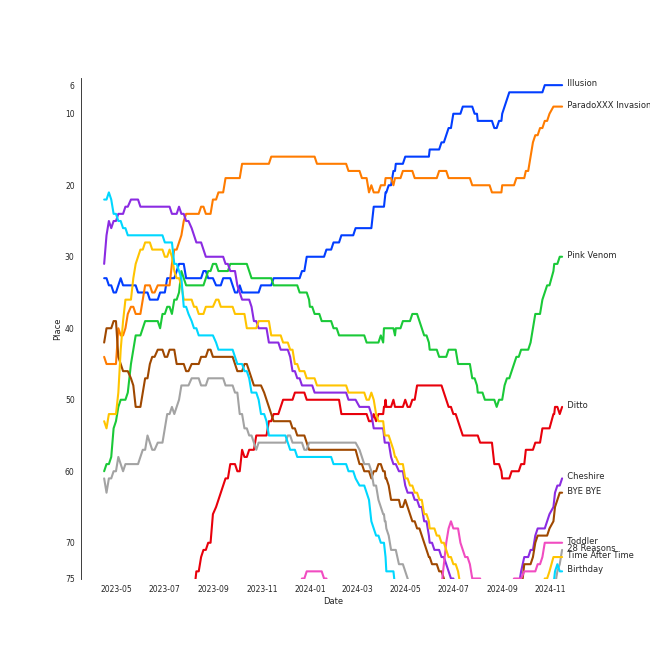

# Tracks in Liked Tracks from 2022

## Artists

| Art | Rank | Tracks | 💚 | Artist | 🔗 |
|:---|---:|---:|---:|:---|:---|
|  | 2 | 12 | 12 | [Red Velvet](../../../artists/red_velvet/overview.md) | [🔗](https://open.spotify.com/artist/1z4g3DjTBBZKhvAroFlhOM) |
|  | 10 | 10 | 10 | [Stray Kids](../../../artists/stray_kids/overview.md) | [🔗](https://open.spotify.com/artist/2dIgFjalVxs4ThymZ67YCE) |
|  | 6 | 9 | 9 | [(G)I-DLE](../../../artists/(g)i-dle/overview.md) | [🔗](https://open.spotify.com/artist/2AfmfGFbe0A0WsTYm0SDTx) |
|  | 7 | 8 | 8 | [ENHYPEN](../../../artists/enhypen/overview.md) | [🔗](https://open.spotify.com/artist/5t5FqBwTcgKTaWmfEbwQY9) |
|  | 8 | 8 | 8 | [TAEYEON](../../../artists/taeyeon/overview.md) | [🔗](https://open.spotify.com/artist/3qNVuliS40BLgXGxhdBdqu) |
|  | 70 | 7 | 7 | [BIBI](../../../artists/bibi/overview.md) | [🔗](https://open.spotify.com/artist/6UbmqUEgjLA6jAcXwbM1Z9) |
|  | 3 | 7 | 7 | [BLACKPINK](../../../artists/blackpink/overview.md) | [🔗](https://open.spotify.com/artist/41MozSoPIsD1dJM0CLPjZF) |
|  | 5 | 7 | 7 | [ITZY](../../../artists/itzy/overview.md) | [🔗](https://open.spotify.com/artist/2KC9Qb60EaY0kW4eH68vr3) |
|  | 1 | 6 | 6 | [aespa](../../../artists/aespa/overview.md) | [🔗](https://open.spotify.com/artist/6YVMFz59CuY7ngCxTxjpxE) |
|  | 13 | 6 | 6 | [LE SSERAFIM](../../../artists/le_sserafim/overview.md) | [🔗](https://open.spotify.com/artist/4SpbR6yFEvexJuaBpgAU5p) |

View all

| Art | Rank | Tracks | 💚 | Artist | 🔗 |
|:---|---:|---:|---:|:---|:---|
|  | 16 | 6 | 6 | [STAYC](../../../artists/stayc/overview.md) | [🔗](https://open.spotify.com/artist/01XYiBYaoMJcNhPokrg0l0) |
|  | 21 | 5 | 5 | [Billlie](../../../artists/billlie/overview.md) | [🔗](https://open.spotify.com/artist/2GQxKDojobwBjZMPf7aoh0) |
|  | 19 | 5 | 5 | [Taylor Swift](../../../artists/taylor_swift/overview.md) | [🔗](https://open.spotify.com/artist/06HL4z0CvFAxyc27GXpf02) |
|  | 23 | 4 | 4 | [NewJeans](../../../artists/newjeans/overview.md) | [🔗](https://open.spotify.com/artist/6HvZYsbFfjnjFrWF950C9d) |
|  | 32 | 4 | 4 | [BoA](../../../artists/boa/overview.md) | [🔗](https://open.spotify.com/artist/4muJrGMndyYWqZtfk8OWy4) |
|  | 114 | 4 | 4 | [P1Harmony](../../../artists/p1harmony/overview.md) | [🔗](https://open.spotify.com/artist/3JjvsPeGMbDJqsphe2z8xU) |
|  | 43 | 4 | 4 | [The Tarpeggios](../../../artists/the_tarpeggios/overview.md) | [🔗](https://open.spotify.com/artist/2HXd5pFHJyaQJr5aXfErrE) |
|  | 22 | 4 | 4 | [NMIXX](../../../artists/nmixx/overview.md) | [🔗](https://open.spotify.com/artist/28ot3wh4oNmoFOdVajibBl) |
|  | 24 | 4 | 4 | [NCT DREAM](../../../artists/nct_dream/overview.md) | [🔗](https://open.spotify.com/artist/1gBUSTR3TyDdTVFIaQnc02) |
|  | 414 | 4 | 4 | [j-hope](../../../artists/j-hope/overview.md) | [🔗](https://open.spotify.com/artist/0b1sIQumIAsNbqAoIClSpy) |
|  | 30 | 3 | 3 | [NCT 127](../../../artists/nct_127/overview.md) | [🔗](https://open.spotify.com/artist/7f4ignuCJhLXfZ9giKT7rH) |
|  | 94 | 3 | 3 | MAX CHANGMIN | [🔗](https://open.spotify.com/artist/7FiAkNWMb6ZBYI8tbQLuIS) |
|  | 40 | 3 | 3 | [SUNMI](../../../artists/sunmi/overview.md) | [🔗](https://open.spotify.com/artist/6MoXcK2GyGg7FIyxPU5yW6) |
|  | 29 | 3 | 3 | [Dreamcatcher](../../../artists/dreamcatcher/overview.md) | [🔗](https://open.spotify.com/artist/5V1qsQHdXNm4ZEZHWvFnqQ) |
|  | 133 | 3 | 3 | MRCH | [🔗](https://open.spotify.com/artist/4S0q5n7ZzNzeiW0dAUnYHl) |
|  | 72 | 3 | 3 | [TREASURE](../../../artists/treasure/overview.md) | [🔗](https://open.spotify.com/artist/3KonOYiLsU53m4yT7gNotP) |
|  | 35 | 3 | 3 | [SEULGI](../../../artists/seulgi/overview.md) | [🔗](https://open.spotify.com/artist/2QM5S4yO6xHgnNvF0nbZZq) |
|  | 14 | 3 | 3 | [CHUNG HA](../../../artists/chung_ha/overview.md) | [🔗](https://open.spotify.com/artist/2PSJ6YriU7JsFucxACpU7Y) |
|  | 66 | 3 | 3 | [PENTAGON](../../../artists/pentagon/overview.md) | [🔗](https://open.spotify.com/artist/1wKpMkucynaTfG8lyPprYV) |
|  | 74 | 3 | 3 | [Jackson Wang](../../../artists/jackson_wang/overview.md) | [🔗](https://open.spotify.com/artist/1kfWoWgCugPkyxQP8lkRlY) |
|  | 18 | 3 | 3 | [Girls' Generation](../../../artists/girls__generation/overview.md) | [🔗](https://open.spotify.com/artist/0Sadg1vgvaPqGTOjxu0N6c) |
|  | 200 | 2 | 2 | SZA | [🔗](https://open.spotify.com/artist/7tYKF4w9nC0nq9CsPZTHyP) |
|  | 12 | 2 | 2 | [SEVENTEEN](../../../artists/seventeen/overview.md) | [🔗](https://open.spotify.com/artist/7nqOGRxlXj7N2JYbgNEjYH) |
|  | 9 | 2 | 2 | [TWICE](../../../artists/twice/overview.md) | [🔗](https://open.spotify.com/artist/7n2Ycct7Beij7Dj7meI4X0) |
|  | 185 | 2 | 2 | [VIVIZ](../../../artists/viviz/overview.md) | [🔗](https://open.spotify.com/artist/7Lq3yAtwi0Z7zpxEwbQQNZ) |
|  | 245 | 2 | 2 | [WJSN](../../../artists/wjsn/overview.md) | [🔗](https://open.spotify.com/artist/6hhqsQZhtp9hfaZhSd0VSD) |
|  | 17 | 2 | 2 | [IVE](../../../artists/ive/overview.md) | [🔗](https://open.spotify.com/artist/6RHTUrRF63xao58xh9FXYJ) |
|  | 44 | 2 | 2 | [ATEEZ](../../../artists/ateez/overview.md) | [🔗](https://open.spotify.com/artist/68KmkJeZGfwe1OUaivBa2L) |
|  | 57 | 2 | 2 | [PURPLE KISS](../../../artists/purple_kiss/overview.md) | [🔗](https://open.spotify.com/artist/62T5PGHWJ9sxP2SJq20IHq) |
|  | 80 | 2 | 2 | NINGNING | [🔗](https://open.spotify.com/artist/5t1uryofgueHrjrryqX8vM) |
|  | 414 | 2 | 2 | Wonstein | [🔗](https://open.spotify.com/artist/5o615XColiSVMPDWlslKSk) |
|  | 199 | 2 | 2 | [Doja Cat](../../../artists/doja_cat/overview.md) | [🔗](https://open.spotify.com/artist/5cj0lLjcoR7YOSnhnX0Po5) |
|  | 65 | 2 | 2 | [Solar](../../../artists/solar/overview.md) | [🔗](https://open.spotify.com/artist/5cYcI546S8Lf97m4mNdYLD) |
|  | 157 | 2 | 2 | [YENA](../../../artists/yena/overview.md) | [🔗](https://open.spotify.com/artist/49muoiIu4uea4PO8vueUNN) |
|  | 198 | 2 | 2 | keshi | [🔗](https://open.spotify.com/artist/3pc0bOVB5whxmD50W79wwO) |
|  | 69 | 2 | 2 | [WINTER](../../../artists/winter/overview.md) | [🔗](https://open.spotify.com/artist/3mPquBmMu97Iq9TpzQ6ayI) |
|  | 27 | 2 | 2 | [BTS](../../../artists/bts/overview.md) | [🔗](https://open.spotify.com/artist/3Nrfpe0tUJi4K4DXYWgMUX) |
|  | 400 | 2 | 2 | Seori | [🔗](https://open.spotify.com/artist/2bWTIIQP9zaVc55RaMGu7e) |
|  | 414 | 2 | 2 | RM | [🔗](https://open.spotify.com/artist/2auC28zjQyVTsiZKNgPRGs) |
|  | 288 | 2 | 2 | [Kendrick Lamar](../../../artists/kendrick_lamar/overview.md) | [🔗](https://open.spotify.com/artist/2YZyLoL8N0Wb9xBt1NhZWg) |
|  | 414 | 2 | 2 | Charli xcx | [🔗](https://open.spotify.com/artist/25uiPmTg16RbhZWAqwLBy5) |
|  | 148 | 2 | 2 | NAYEON | [🔗](https://open.spotify.com/artist/1VwDG9aBflQupaFNjUru9A) |
|  | 340 | 2 | 2 | JVKE | [🔗](https://open.spotify.com/artist/164Uj4eKjl6zTBKfJLFKKK) |
|  | 15 | 2 | 2 | [MAMAMOO](../../../artists/mamamoo/overview.md) | [🔗](https://open.spotify.com/artist/0XATRDCYuuGhk0oE7C0o5G) |
|  | 255 | 1 | 1 | ONEW | [🔗](https://open.spotify.com/artist/7sZ5ipSoboWdqXkdj6AXHo) |
|  | 394 | 1 | 1 | Lapillus | [🔗](https://open.spotify.com/artist/7bcMJG1TkYFFD9Fit3STLJ) |
|  | 71 | 1 | 1 | JIHYO | [🔗](https://open.spotify.com/artist/7F1iAHRYxR3MY7yAEuFqgL) |
|  | 251 | 1 | 1 | YUJU | [🔗](https://open.spotify.com/artist/7Bu0r4MCDX3sbhcFD5IXyx) |
|  | 246 | 1 | 1 | MARK | [🔗](https://open.spotify.com/artist/70DFixYAFPv4Pf9kgSfR9O) |
|  | 31 | 1 | 1 | [GOT the beat](../../../artists/got_the_beat/overview.md) | [🔗](https://open.spotify.com/artist/6uNxlIP5lzPFf0BHuELOuX) |
|  | 414 | 1 | 1 | GOT7 | [🔗](https://open.spotify.com/artist/6nfDaffa50mKtEOwR8g4df) |
|  | 414 | 1 | 1 | MeloMance | [🔗](https://open.spotify.com/artist/6k4r73Wq8nhkCDoUsECL1e) |
|  | 179 | 1 | 1 | Fujii Kaze | [🔗](https://open.spotify.com/artist/6bDWAcdtVR3WHz2xtiIPUi) |
|  | 176 | 1 | 1 | [Crush](../../../artists/crush/overview.md) | [🔗](https://open.spotify.com/artist/6aLdhHUqgdKE86xbtNmY8g) |
|  | 414 | 1 | 1 | [Imogen Heap](../../../artists/imogen_heap/overview.md) | [🔗](https://open.spotify.com/artist/6Xb4ezwoAQC4516kI89nWz) |
|  | 414 | 1 | 1 | DARA | [🔗](https://open.spotify.com/artist/6WRl7KUrzOq7GpY97KrYxi) |
|  | 359 | 1 | 1 | Charlie Puth | [🔗](https://open.spotify.com/artist/6VuMaDnrHyPL1p4EHjYLi7) |
|  | 144 | 1 | 1 | TAEYONG | [🔗](https://open.spotify.com/artist/6SKusTjOAPsTZ6kareKQdm) |
|  | 414 | 1 | 1 | Frou Frou | [🔗](https://open.spotify.com/artist/6MUyqmIQ35inLjch0YzIEG) |
|  | 84 | 1 | 1 | [Dua Lipa](../../../artists/dua_lipa/overview.md) | [🔗](https://open.spotify.com/artist/6M2wZ9GZgrQXHCFfjv46we) |
|  | 166 | 1 | 1 | Younha | [🔗](https://open.spotify.com/artist/6GwM5CHqhWXzG3l5kzRSAS) |
|  | 414 | 1 | 1 | Soulja Boy | [🔗](https://open.spotify.com/artist/6GMYJwaziB4ekv1Y6wCDWS) |
| | 414 | 1 | 1 | Nam Joohyuk | [🔗](https://open.spotify.com/artist/69ybhMoBUPmIcH4MyDARDv) |
|  | 77 | 1 | 1 | [YOASOBI](../../../artists/yoasobi/overview.md) | [🔗](https://open.spotify.com/artist/64tJ2EAv1R6UaZqc4iOCyj) |
|  | 209 | 1 | 1 | PinkFantasy | [🔗](https://open.spotify.com/artist/5syu5kN4a5f4rgMCRGlnZp) |
|  | 414 | 1 | 1 | [The Rose](../../../artists/the_rose/overview.md) | [🔗](https://open.spotify.com/artist/5na1LmEmK2VzNLje9snJYW) |
|  | 36 | 1 | 1 | [HEIZE](../../../artists/heize/overview.md) | [🔗](https://open.spotify.com/artist/5dCvSnVduaFleCnyy98JMo) |
|  | 414 | 1 | 1 | tripleS | [🔗](https://open.spotify.com/artist/5Z71xE9prhpHrqL5thVMyK) |
|  | 274 | 1 | 1 | [MOMOLAND](../../../artists/momoland/overview.md) | [🔗](https://open.spotify.com/artist/5RR0MLwcjc87wjSw2JYdwx) |
|  | 402 | 1 | 1 | Kep1er | [🔗](https://open.spotify.com/artist/5R7AMwDeroq6Ls0COQYpS4) |
|  | 414 | 1 | 1 | DeVita | [🔗](https://open.spotify.com/artist/5PS3ZZE5bBiZ3Ct9HiRG2B) |
|  | 183 | 1 | 1 | Faouzia | [🔗](https://open.spotify.com/artist/5NhgsV7qPWHZqYEMKzbYvo) |
|  | 239 | 1 | 1 | WOOSUNG | [🔗](https://open.spotify.com/artist/5LHu1iF8m0XtRBEJbbwSoo) |
|  | 414 | 1 | 1 | Tyga | [🔗](https://open.spotify.com/artist/5LHRHt1k9lMyONurDHEdrp) |
| | 414 | 1 | 1 | Bona(WJSN) | [🔗](https://open.spotify.com/artist/5EHm62VI2botfXyNvboLlL) |
|  | 414 | 1 | 1 | Lizzo | [🔗](https://open.spotify.com/artist/56oDRnqbIiwx4mymNEv7dS) |
|  | 414 | 1 | 1 | ICHILLIN' | [🔗](https://open.spotify.com/artist/5357DGet3KsoJNwVkV7qvy) |
|  | 96 | 1 | 1 | [LOONA](../../../artists/loona/overview.md) | [🔗](https://open.spotify.com/artist/52zMTJCKluDlFwMQWmccY7) |
|  | 414 | 1 | 1 | Youjeen | [🔗](https://open.spotify.com/artist/4wVcCedmr7FHtUlFnIeJIG) |
| | 364 | 1 | 1 | Bang Chan | [🔗](https://open.spotify.com/artist/4qy7HANJDOZRObts4Z0KSV) |
| | 414 | 1 | 1 | Lee Joomyung | [🔗](https://open.spotify.com/artist/4dN1DsKUXV6xugiarFBAa6) |
|  | 128 | 1 | 1 | ZICO | [🔗](https://open.spotify.com/artist/4XpUIb8uuNlIWVKmgKZXC0) |
|  | 365 | 1 | 1 | Jay Park | [🔗](https://open.spotify.com/artist/4XDi67ZENZcbfKnvMnTYsI) |
|  | 414 | 1 | 1 | Maggie Rogers | [🔗](https://open.spotify.com/artist/4NZvixzsSefsNiIqXn0NDe) |
|  | 173 | 1 | 1 | BIGBANG | [🔗](https://open.spotify.com/artist/4Kxlr1PRlDKEB0ekOCyHgX) |
|  | 232 | 1 | 1 | FIFTY FIFTY | [🔗](https://open.spotify.com/artist/4GJ6xDCF5jaUqD6avOuQT6) |
| | 414 | 1 | 1 | Felix (Stray Kids) | [🔗](https://open.spotify.com/artist/40zyx4iztMjRbIIoI802r4) |
|  | 100 | 1 | 1 | Christopher | [🔗](https://open.spotify.com/artist/3zDRCqOhJXJfS2YWOEwGMC) |
|  | 79 | 1 | 1 | AILEE | [🔗](https://open.spotify.com/artist/3uGFTJ7JMllvhgGpumieHF) |
|  | 414 | 1 | 1 | Anna Zak | [🔗](https://open.spotify.com/artist/3lVXtKsFTJM8ecY8gqdoCo) |
|  | 414 | 1 | 1 | Anderson .Paak | [🔗](https://open.spotify.com/artist/3jK9MiCrA42lLAdMGUZpwa) |
|  | 119 | 1 | 1 | Kim Petras | [🔗](https://open.spotify.com/artist/3Xt3RrJMFv5SZkCfUE8C1J) |
|  | 367 | 1 | 1 | Changbin (Stray Kids) | [🔗](https://open.spotify.com/artist/3XSid6KaiKoMAVZs2ug3yw) |
|  | 414 | 1 | 1 | CARSTN | [🔗](https://open.spotify.com/artist/3Wb1mXnd1hXkGwys5m54YC) |
|  | 56 | 1 | 1 | HYO | [🔗](https://open.spotify.com/artist/3U7bOaJLuFkrmDQ1C1OqKl) |
|  | 42 | 1 | 1 | [TEN](../../../artists/ten/overview.md) | [🔗](https://open.spotify.com/artist/3Q5Qep7ytrjVleNnMnntgQ) |
|  | 414 | 1 | 1 | HOMIES | [🔗](https://open.spotify.com/artist/3PpfvyyncoZ79IgYe0Uls0) |
|  | 4 | 1 | 1 | [IU](../../../artists/iu/overview.md) | [🔗](https://open.spotify.com/artist/3HqSLMAZ3g3d5poNaI7GOU) |
|  | 196 | 1 | 1 | BLITZERS | [🔗](https://open.spotify.com/artist/3Exoh42YMeqnUvYahAGgUE) |
|  | 414 | 1 | 1 | CRAXY | [🔗](https://open.spotify.com/artist/3C13AlJZ4QWHSruAWe9VPI) |
|  | 414 | 1 | 1 | TAN | [🔗](https://open.spotify.com/artist/34Ecdzh8yGKt2YvPG37PKu) |
|  | 105 | 1 | 1 | &TEAM | [🔗](https://open.spotify.com/artist/2xfxRiKxoHl5tI0MKyvqV7) |
|  | 414 | 1 | 1 | Sam Smith | [🔗](https://open.spotify.com/artist/2wY79sveU1sp5g7SokKOiI) |
|  | 414 | 1 | 1 | pH-1 | [🔗](https://open.spotify.com/artist/2u7CP5T30c8ctenzXgEV1W) |
|  | 313 | 1 | 1 | LEE CHAE YEON | [🔗](https://open.spotify.com/artist/2nkZR6LwPxaAVtaVitNIPT) |
|  | 231 | 1 | 1 | PSY | [🔗](https://open.spotify.com/artist/2dd5mrQZvg6SmahdgVKDzh) |
|  | 337 | 1 | 1 | JAMIE | [🔗](https://open.spotify.com/artist/2YXlVLKq3X3soXd2aXUtIT) |
|  | 414 | 1 | 1 | Rina Sawayama | [🔗](https://open.spotify.com/artist/2KEqzdPS7M5YwGmiuPTdr5) |
|  | 414 | 1 | 1 | Anna Graceman | [🔗](https://open.spotify.com/artist/2B69uGl0nh5LMFUAZxVw5y) |
| | 414 | 1 | 1 | Choi Hyunwook | [🔗](https://open.spotify.com/artist/1z2J8XtoQxczs0U1lMWEiZ) |
|  | 282 | 1 | 1 | TAEIL | [🔗](https://open.spotify.com/artist/1z0Hi3myYw4x32xCq0H3aq) |
|  | 414 | 1 | 1 | ALICE | [🔗](https://open.spotify.com/artist/1mgzY8CsK8lyJy96tT8bV5) |
|  | 380 | 1 | 1 | Xdinary Heroes | [🔗](https://open.spotify.com/artist/1khChLj7REGqjM043PlYyn) |
|  | 168 | 1 | 1 | Moon Byul | [🔗](https://open.spotify.com/artist/1eTft3tXynrKdo6XD7QHLL) |
|  | 414 | 1 | 1 | MAX | [🔗](https://open.spotify.com/artist/1bqxdqvUtPWZri43cKHac8) |
|  | 414 | 1 | 1 | J.Y. Park | [🔗](https://open.spotify.com/artist/1TTx0YcbKUtJIZY1HEnh9B) |
|  | 414 | 1 | 1 | NATTI NATASHA | [🔗](https://open.spotify.com/artist/1GDbiv3spRmZ1XdM1jQbT7) |
|  | 214 | 1 | 1 | YOON MIRAE | [🔗](https://open.spotify.com/artist/1Do4bSzfUl0KWL9r1fITu0) |
|  | 414 | 1 | 1 | Megan Thee Stallion | [🔗](https://open.spotify.com/artist/181bsRPaVXVlUKXrxwZfHK) |
|  | 357 | 1 | 1 | HUH YUNJIN | [🔗](https://open.spotify.com/artist/13yWtUnz63q5VIs5SwoMhy) |
|  | 414 | 1 | 1 | GoldFish | [🔗](https://open.spotify.com/artist/0uRdK8gy7fXJGRywrlmPM7) |
|  | 414 | 1 | 1 | Guy Sigsworth | [🔗](https://open.spotify.com/artist/0uQWT7X0I9Y7zM7WWexpAj) |
|  | 346 | 1 | 1 | Gaeko | [🔗](https://open.spotify.com/artist/0tkHE1pQ5ZCgQb8WZ0ba79) |
|  | 414 | 1 | 1 | Hoàng Thùy Linh | [🔗](https://open.spotify.com/artist/0r63ReVRjxrS4ATbLrdcrL) |
|  | 414 | 1 | 1 | KWON EUNBI | [🔗](https://open.spotify.com/artist/0qr7Rhj0yU7BPySYecNUlm) |
|  | 307 | 1 | 1 | Yuuri | [🔗](https://open.spotify.com/artist/0ixzjrK1wkN2zWBXt3VW3W) |
|  | 147 | 1 | 1 | [TOMORROW X TOGETHER](../../../artists/tomorrow_x_together/overview.md) | [🔗](https://open.spotify.com/artist/0ghlgldX5Dd6720Q3qFyQB) |
|  | 318 | 1 | 1 | SUGA | [🔗](https://open.spotify.com/artist/0ebNdVaOfp6N0oZ1guIxM8) |
| | 414 | 1 | 1 | Kim Taeri | [🔗](https://open.spotify.com/artist/0bBDQ4QeizwResorw0iD7X) |
|  | 63 | 1 | 1 | Lee Young Ji | [🔗](https://open.spotify.com/artist/0Y2AcMPMpeuPXtPQGVvRBq) |
|  | 398 | 1 | 1 | B.I | [🔗](https://open.spotify.com/artist/0UntV1Bw2hk3fbRrm9eMP6) |
|  | 219 | 1 | 1 | XG | [🔗](https://open.spotify.com/artist/0LOK81e9H5lr61HlGGHqwA) |
|  | 28 | 1 | 1 | [WENDY](../../../artists/wendy/overview.md) | [🔗](https://open.spotify.com/artist/0FRUZvZNPzM3YJMABJxf2K) |
|  | 129 | 1 | 1 | PIXY | [🔗](https://open.spotify.com/artist/0CJkEzffVZLgav03xXeC9s) |
|  | 403 | 1 | 1 | Whee In | [🔗](https://open.spotify.com/artist/0BqRGrwqndrtNkojXiqIzL) |
|  | 116 | 1 | 1 | [Lana Del Rey](../../../artists/lana_del_rey/overview.md) | [🔗](https://open.spotify.com/artist/00FQb4jTyendYWaN8pK0wa) |

## Albums

| Art | Rank | Tracks | 💚 | Album | Release Date | 🔗 |
|:---|---:|---:|---:|:---|:---|:---|
|  | 40 | 7 | 7 | INVU - The 3rd Album | 2022-02-14 | [🔗](https://open.spotify.com/album/7i2YLTVQ0dyngRuUqtGmr9) |
|  | 41 | 7 | 7 | BORN PINK | 2022-09-16 | [🔗](https://open.spotify.com/album/7jaSNQUBJbvfbZHLNFrV7P) |
|  | 79 | 5 | 5 | ‘The ReVe Festival 2022 - Feel My Rhythm’ | 2022-03-21 | [🔗](https://open.spotify.com/album/3HgoCO9wWuPcNhz8Ip4C46) |
|  | 362 | 5 | 5 | Twenty-Five Twenty-One OST | 2022-04-03 | [🔗](https://open.spotify.com/album/77NPr874WU941XZhjO43dR) |
|  | 612 | 5 | 5 | Midnights | 2022-10-21 | [🔗](https://open.spotify.com/album/151w1FgRZfnKZA9FEcg9Z3) |
|  | 151 | 5 | 5 | I NEVER DIE | 2022-03-14 | [🔗](https://open.spotify.com/album/1T2W9vDajFreUuycPDjUXk) |
|  | 13 | 5 | 5 | Girls - The 2nd Mini Album | 2022-07-08 | [🔗](https://open.spotify.com/album/4w1dbvUy1crv0knXQvcSeY) |
|  | 33 | 4 | 4 | ‘The ReVe Festival 2022 - Birthday’ | 2022-11-28 | [🔗](https://open.spotify.com/album/58OR7UoaJkJzqeQGClHzh1) |
|  | 244 | 4 | 4 | YOUNG-LUV.COM | 2022-02-21 | [🔗](https://open.spotify.com/album/2xPdgNkM4yIQmP7axJ1T1o) |
|  | 22 | 4 | 4 | MANIFESTO : DAY 1 | 2022-07-04 | [🔗](https://open.spotify.com/album/5J8MNLLViH5zqM6VoGErz8) |

View all

| Art | Rank | Tracks | 💚 | Album | Release Date | 🔗 |
|:---|---:|---:|---:|:---|:---|:---|
|  | 94 | 4 | 4 | I love | 2022-10-17 | [🔗](https://open.spotify.com/album/2Hyuin3i1cSZ1FlQFeCPZH) |
|  | 612 | 4 | 4 | Homeward | 2022-04-08 | [🔗](https://open.spotify.com/album/2FiDSelqVoi7VQfpmaMRJK) |
|  | 504 | 3 | 3 | the collective soul and unconscious: chapter one | 2022-02-23 | [🔗](https://open.spotify.com/album/4ophrgcnwWi1I5nWYImyhw) |
|  | 150 | 3 | 3 | SKZ-REPLAY | 2022-12-21 | [🔗](https://open.spotify.com/album/3UXrliH0JUQvcaLnBD8Txz) |
|  | 345 | 3 | 3 | ODDINARY | 2022-03-18 | [🔗](https://open.spotify.com/album/0Gmf4pfe0POEQq2FgGAj2q) |
|  | 107 | 3 | 3 | NewJeans 1st EP 'New Jeans' | 2022-08-01 | [🔗](https://open.spotify.com/album/1HMLpmZAnNyl9pxvOnTovV) |
|  | 228 | 3 | 3 | MAGIC MAN | 2022-09-09 | [🔗](https://open.spotify.com/album/2VZ4og2ZbwyTQ3X1rbgCe1) |
|  | 101 | 3 | 3 | Lowlife Princess: Noir | 2022-11-18 | [🔗](https://open.spotify.com/album/0AwCgoJKJUOgLp1imhnxuH) |
|  | 612 | 3 | 3 | Jack In The Box | 2022-07-15 | [🔗](https://open.spotify.com/album/0FrC9lzgVhziJenigsrXdl) |
|  | 438 | 3 | 3 | IN:VITE U | 2022-01-24 | [🔗](https://open.spotify.com/album/5vxZM8rFJiNvjtAThYnwek) |
|  | 133 | 3 | 3 | Forgive Me - The 3rd Mini Album | 2022-11-22 | [🔗](https://open.spotify.com/album/0vufEpmNpfB9NUPLkbIBN7) |
|  | 612 | 3 | 3 | FOREVER 1 - The 7th Album | 2022-08-05 | [🔗](https://open.spotify.com/album/3CcgnUkTrUaPTt4Ms1MkoP) |
|  | 142 | 3 | 3 | FEARLESS | 2022-05-02 | [🔗](https://open.spotify.com/album/4Mc7WwYH41hgUWeKX25Sot) |
|  | 580 | 3 | 3 | CHECKMATE | 2022-07-15 | [🔗](https://open.spotify.com/album/64EGnoCD5NuC41OqQ3E7UK) |
|  | 73 | 3 | 3 | ANTIFRAGILE | 2022-10-17 | [🔗](https://open.spotify.com/album/3u0ggfmK0vjuHMNdUbtaa9) |
|  | 69 | 3 | 3 | 28 Reasons - The 1st Mini Album | 2022-10-04 | [🔗](https://open.spotify.com/album/1t5a29WYbJj83iy3RNICHw) |
|  | 71 | 3 | 3 | 2022 Winter SMTOWN : SMCU PALACE | 2022-12-26 | [🔗](https://open.spotify.com/album/1HwnXJfZx8N8qDfzwUbxcw) |
|  | 127 | 3 | 3 | 2 Baddies - The 4th Album | 2022-09-16 | [🔗](https://open.spotify.com/album/6p80QT3z7kOHpYdnsItQTQ) |
|  | 612 | 2 | 2 | 容 : FACE | 2022-03-16 | [🔗](https://open.spotify.com/album/6eSFX12WIqUtmGsD8UO3FT) |
|  | 412 | 2 | 2 | ˣ‿ˣ (SMiLEY) | 2022-01-17 | [🔗](https://open.spotify.com/album/7qldKtsOWklzmwgll5NjCw) |
|  | 153 | 2 | 2 | the Billage of perception: chapter two | 2022-08-31 | [🔗](https://open.spotify.com/album/0NuM7kwh6u6fIRjn7Zh7Ss) |
|  | 612 | 2 | 2 | [Apocalypse : Save us] | 2022-04-12 | [🔗](https://open.spotify.com/album/42mMFBIWT599FmtWK5op4a) |
|  | 356 | 2 | 2 | THE SECOND STEP : CHAPTER ONE | 2022-02-15 | [🔗](https://open.spotify.com/album/17l09k7ZDb4GYwmsIVGcRZ) |
|  | 261 | 2 | 2 | Street Man Fighter Original Vol.3 (Mission by Rank) | 2022-09-06 | [🔗](https://open.spotify.com/album/54UUQN3j32n8TA2OJxTcHP) |
|  | 232 | 2 | 2 | SOS | 2022-12-09 | [🔗](https://open.spotify.com/album/07w0rG5TETcyihsEIZR3qG) |
|  | 537 | 2 | 2 | SEVENTEEN 4th Album 'Face the Sun' | 2022-05-27 | [🔗](https://open.spotify.com/album/4lfFgz2rD1irxf7dZhNJht) |
|  | 470 | 2 | 2 | Proof | 2022-06-10 | [🔗](https://open.spotify.com/album/6al2VdKbb6FIz9d7lU7WRB) |
|  | 612 | 2 | 2 | Mr. Morale & The Big Steppers | 2022-05-13 | [🔗](https://open.spotify.com/album/79ONNoS4M9tfIA1mYLBYVX) |
|  | 158 | 2 | 2 | MIC ON | 2022-10-11 | [🔗](https://open.spotify.com/album/6TOnqVuglIk6Db2TdUwTcZ) |
|  | 249 | 2 | 2 | MAXIDENT | 2022-10-07 | [🔗](https://open.spotify.com/album/0T6hYH0UyDjNraWZk2mZWi) |
|  | 430 | 2 | 2 | LOVE & FEAR | 2022-12-12 | [🔗](https://open.spotify.com/album/2zsnrnJPMZY56QgIdc647c) |
|  | 612 | 2 | 2 | Indigo | 2022-12-02 | [🔗](https://open.spotify.com/album/2wGinO7YWLHN2sULIr4a7v) |
|  | 612 | 2 | 2 | IM NAYEON | 2022-06-24 | [🔗](https://open.spotify.com/album/0wqjfojWuTcbEvwaizvTMw) |
|  | 97 | 2 | 2 | Heart Burn | 2022-06-29 | [🔗](https://open.spotify.com/album/0ahb3lp7jXxKUx3beS7AVu) |
|  | 612 | 2 | 2 | HARMONY : SET IN | 2022-11-30 | [🔗](https://open.spotify.com/album/1JDHisMjuJ1QkhcXiiLnnX) |
|  | 612 | 2 | 2 | Glitch Mode - The 2nd Album | 2022-03-28 | [🔗](https://open.spotify.com/album/4cAcTMGFjTBufC7Eu0FizU) |
|  | 612 | 2 | 2 | ENTWURF | 2022-09-19 | [🔗](https://open.spotify.com/album/3wMlxC4t3dN70e1OF8wUfz) |
|  | 162 | 2 | 2 | Devil - The 2nd Mini Album | 2022-01-13 | [🔗](https://open.spotify.com/album/6bG2rY8NzT7dIzUNADDNCR) |
|  | 122 | 2 | 2 | DIMENSION : ANSWER | 2022-01-10 | [🔗](https://open.spotify.com/album/3nOj9hsnptBEDt9ie2lra5) |
|  | 612 | 2 | 2 | CRASH | 2022-03-18 | [🔗](https://open.spotify.com/album/1QqipMXWzJhr6yfcNKTp8B) |
|  | 68 | 2 | 2 | CHESHIRE | 2022-11-30 | [🔗](https://open.spotify.com/album/2a1ezg7hE6Dyuymv1aCnkm) |
|  | 344 | 2 | 2 | Bloom | 2022-04-06 | [🔗](https://open.spotify.com/album/4ualu7nMAcmoAqp47YaA95) |
|  | 612 | 2 | 2 | Bare&Rare, Pt. 1 | 2022-07-11 | [🔗](https://open.spotify.com/album/0fgLDYoqdQw5bhzPFWvclR) |
|  | 612 | 2 | 2 | BETWEEN 1&2 | 2022-08-26 | [🔗](https://open.spotify.com/album/3NZ94nQbqimcu2i71qhc4f) |
|  | 218 | 2 | 2 | AD MARE | 2022-02-22 | [🔗](https://open.spotify.com/album/2QbA97qjlAs81t6kVS6zBk) |
|  | 371 | 1 | 1 | 海のまにまに | 2022-11-18 | [🔗](https://open.spotify.com/album/6M4p4S5t8PuRZiq7zvMEPB) |
|  | 458 | 1 | 1 | 壱 | 2022-01-12 | [🔗](https://open.spotify.com/album/1YWoHzj5wHnG7m6gLlwBQd) |
|  | 612 | 1 | 1 | מי זאת | 2022-05-22 | [🔗](https://open.spotify.com/album/3vAQYVlLZrzs7lrjisl5VC) |
|  | 612 | 1 | 1 | this is what falling in love feels like (554Hz) | 2022-10-03 | [🔗](https://open.spotify.com/album/2uiQo0DIcriQKVm5ivXuDO) |
|  | 459 | 1 | 1 | this is what ____ feels like (Vol. 1-4) | 2022-09-23 | [🔗](https://open.spotify.com/album/69AaAkdktFGnk9POmHENkT) |
|  | 612 | 1 | 1 | minisode 2: Thursday's Child | 2022-05-09 | [🔗](https://open.spotify.com/album/1o8jYrnyZueTPIdhlHuTc8) |
|  | 343 | 1 | 1 | memeM | 2022-03-29 | [🔗](https://open.spotify.com/album/4nhtnBY8owIQnOsnGQGqW9) |
|  | 308 | 1 | 1 | [REC.] | 2022-01-18 | [🔗](https://open.spotify.com/album/6ofVW04Q32gN1Hxk50S9Fi) |
|  | 612 | 1 | 1 | [Apocalypse : Follow us] | 2022-10-11 | [🔗](https://open.spotify.com/album/10PIYVB08sIQbGNpWk3fXj) |
|  | 612 | 1 | 1 | Yummy Yummy Love | 2022-01-14 | [🔗](https://open.spotify.com/album/2r35RHvEtBjgKiONdItRR5) |
|  | 378 | 1 | 1 | YOUNHA 6th Album Repackage 'END THEORY : Final Edition' | 2022-03-30 | [🔗](https://open.spotify.com/album/63mur6I6yCG9cOxOst3i7c) |
|  | 110 | 1 | 1 | When I Get Old | 2022-10-20 | [🔗](https://open.spotify.com/album/3mJMHqT2w0HwjQkneNVE14) |
|  | 405 | 1 | 1 | WIN-DOW | 2022-07-20 | [🔗](https://open.spotify.com/album/4dcwVvd7l0sAGBg0pSmKK2) |
|  | 612 | 1 | 1 | WHEE | 2022-01-16 | [🔗](https://open.spotify.com/album/4BLxIwHfv87WeOQ9A4sm9E) |
|  | 612 | 1 | 1 | WE NEED LOVE | 2022-07-19 | [🔗](https://open.spotify.com/album/04EniWu488MF6louRYafKJ) |
|  | 336 | 1 | 1 | Voltage | 2022-03-23 | [🔗](https://open.spotify.com/album/3MXVqfk9VG3B757nLlow0D) |
|  | 612 | 1 | 1 | Unholy (feat. Kim Petras) | 2022-09-22 | [🔗](https://open.spotify.com/album/0gX9tkL5njRax8ymWcXARi) |
|  | 168 | 1 | 1 | Undo | 2022-06-30 | [🔗](https://open.spotify.com/album/2xR7YEyRweqClzs50bbW3J) |
|  | 544 | 1 | 1 | Tippy Toes | 2022-03-18 | [🔗](https://open.spotify.com/album/6P9erpHs7hgJlca7Tj3F0w) |
|  | 612 | 1 | 1 | The 1st Mini Album 'Beam Of Prism' | 2022-02-09 | [🔗](https://open.spotify.com/album/1SO45pKRdNI74Rdx7Hynh2) |
|  | 612 | 1 | 1 | THE WORLD EP.1 : MOVEMENT | 2022-07-29 | [🔗](https://open.spotify.com/album/3fgDrbflffzvV3H3plG9e6) |
|  | 114 | 1 | 1 | THE SECOND STEP : CHAPTER TWO | 2022-10-04 | [🔗](https://open.spotify.com/album/4l5YvRcmno5RMKZCZp1j0g) |
|  | 612 | 1 | 1 | THE FIFTY | 2022-11-18 | [🔗](https://open.spotify.com/album/5Khk4qZMCH9iMJWBzzdbNP) |
|  | 612 | 1 | 1 | Sweetest Pie | 2022-03-11 | [🔗](https://open.spotify.com/album/4qw41n8iWrdR70Ui3hYBPv) |
|  | 612 | 1 | 1 | Surrender | 2022-07-29 | [🔗](https://open.spotify.com/album/2VeOtQQAJxR8VyvmoXqIbI) |
|  | 612 | 1 | 1 | Summer Special [Flip That] | 2022-06-20 | [🔗](https://open.spotify.com/album/7odJeHxR62PWP4Cms4GpwB) |
|  | 612 | 1 | 1 | Street Man Fighter Original Vol.4 (Crew Songs) | 2022-09-20 | [🔗](https://open.spotify.com/album/7dwRGP1A80POqE3O9At5Vw) |
|  | 612 | 1 | 1 | Street Dance Girls Fighter(SGF) Special | 2022-01-04 | [🔗](https://open.spotify.com/album/4azL8fNPVZ8tmKqPyK1583) |
|  | 505 | 1 | 1 | Still Life | 2022-04-05 | [🔗](https://open.spotify.com/album/2oCAY48bhZvQte0l7apmYC) |
|  | 460 | 1 | 1 | Step Back | 2022-01-03 | [🔗](https://open.spotify.com/album/3gwL04bGAX4Kc2D5Wd7NMk) |
|  | 612 | 1 | 1 | Sequence | 2022-07-05 | [🔗](https://open.spotify.com/album/2Cv3xionHF2O7QL8p6MbCT) |
|  | 612 | 1 | 1 | See Tình | 2022-02-20 | [🔗](https://open.spotify.com/album/1AttOIOFrGkOPNSq5mB4pd) |
|  | 103 | 1 | 1 | SPIN OFF : FROM THE WITNESS | 2022-12-30 | [🔗](https://open.spotify.com/album/0NQQk6vo9LOOwKjZc2iUwm) |
|  | 612 | 1 | 1 | SHOW ME THE MONEY 11 Episode 3 | 2022-12-17 | [🔗](https://open.spotify.com/album/5LsGOvNXMG46qugdghRGRF) |
|  | 612 | 1 | 1 | Rush Hour | 2022-09-22 | [🔗](https://open.spotify.com/album/7egcy2gtlyoUUl1OlQrY3R) |
|  | 612 | 1 | 1 | Rum Pum Pum | 2022-10-27 | [🔗](https://open.spotify.com/album/1OeKgT4UKXTfZ5cDIs0HsZ) |
|  | 587 | 1 | 1 | Remarriage and Desires (Original Soundtrack from The Netflix Series) | 2022-07-15 | [🔗](https://open.spotify.com/album/2YM9Oahck5kVuWGiFQK1dg) |
|  | 612 | 1 | 1 | Raise y_our glass | 2022-08-09 | [🔗](https://open.spotify.com/album/5Ty5fWBzQypVhiboHneO3y) |
|  | 612 | 1 | 1 | REBORN | 2022-06-15 | [🔗](https://open.spotify.com/album/6kp9dsLnll5WEiBlBUwBME) |
|  | 612 | 1 | 1 | Poison Rose | 2022-11-10 | [🔗](https://open.spotify.com/album/7MfxSqUuOU0JfoafaA2L3H) |
|  | 531 | 1 | 1 | Pity Party | 2022-02-03 | [🔗](https://open.spotify.com/album/2yMHiLYBnrMsdUCUL3bFkU) |
|  | 612 | 1 | 1 | PSY 9th | 2022-04-29 | [🔗](https://open.spotify.com/album/7hbSWdxliNs551GXtflIZB) |
|  | 116 | 1 | 1 | POPPY (Japanese Ver.) | 2022-11-16 | [🔗](https://open.spotify.com/album/2nei1QXcpDotdoMz3IQxr4) |
|  | 536 | 1 | 1 | Our Blues, Pt. 10 (Original Television Soundtrack) | 2022-05-22 | [🔗](https://open.spotify.com/album/0mP330aRyX4P4ZjarRKnXO) |
|  | 612 | 1 | 1 | One In A Billion | 2022-09-06 | [🔗](https://open.spotify.com/album/19Jm8Jk0zQYs6zMaxhYJFd) |
|  | 305 | 1 | 1 | Oh Sorry Ya | 2022-03-08 | [🔗](https://open.spotify.com/album/4LKKDcLPX4aZXGfnlpFPi7) |
|  | 612 | 1 | 1 | Mr. Rover | 2022-07-15 | [🔗](https://open.spotify.com/album/0mkxSResK0c4KS5VFcQPhH) |
|  | 299 | 1 | 1 | MOTH | 2022-05-13 | [🔗](https://open.spotify.com/album/7JdpeV87hczflCV8GXF3yV) |
|  | 612 | 1 | 1 | Love, Maybe (A Business Proposal OST Special Track) | 2022-02-18 | [🔗](https://open.spotify.com/album/5lKdnY9bGYUyfaJhcRnHgk) |
|  | 612 | 1 | 1 | Love Theory - SM STATION | 2022-04-14 | [🔗](https://open.spotify.com/album/2i27IzG4jFQjX7pS5L6TIu) |
|  | 236 | 1 | 1 | LOVE DIVE | 2022-04-05 | [🔗](https://open.spotify.com/album/1AFVTHHm7kKoQ6Rgb25x3p) |
|  | 612 | 1 | 1 | LIMITED EDITION ‘1TAN’ | 2022-03-10 | [🔗](https://open.spotify.com/album/6037tvwFU3cqeiglPyBoMG) |
|  | 612 | 1 | 1 | Kirari Remixes (Asia Edition) | 2022-01-14 | [🔗](https://open.spotify.com/album/2OXwORzPU4tm1Skiv6l9KT) |
|  | 612 | 1 | 1 | IT'S YOU (feat. keshi) | 2022-09-09 | [🔗](https://open.spotify.com/album/1LtaBRxkVaAnoTSQQsWjJF) |
|  | 442 | 1 | 1 | I'M LOVIN' AMY | 2022-03-07 | [🔗](https://open.spotify.com/album/1N3ZneaWp9SVREC9JSgsia) |
|  | 612 | 1 | 1 | Hello, world! | 2022-07-20 | [🔗](https://open.spotify.com/album/5zjnlpEemkmaN6iv16vmDm) |
|  | 612 | 1 | 1 | HUSH RUSH | 2022-10-12 | [🔗](https://open.spotify.com/album/6ksAgHMbcJbfxwwO799483) |
|  | 570 | 1 | 1 | HIT YA! | 2022-06-20 | [🔗](https://open.spotify.com/album/5TIglX0Yp81a4cAvtdodI9) |
|  | 612 | 1 | 1 | HEAL | 2022-10-07 | [🔗](https://open.spotify.com/album/2n44vkxj8L01ma7nHfXNJW) |
|  | 612 | 1 | 1 | HARMONY : ZERO IN | 2022-07-20 | [🔗](https://open.spotify.com/album/73CTPjApMDvFsycjbbROji) |
|  | 612 | 1 | 1 | Groove Missing | 2022-11-21 | [🔗](https://open.spotify.com/album/2QjX22VyNZxSaKpv691QM1) |
|  | 612 | 1 | 1 | Geekyland | 2022-07-25 | [🔗](https://open.spotify.com/album/7EDCoH5wfSGYdZ7wXCmTF4) |
|  | 612 | 1 | 1 | GOT7 | 2022-05-23 | [🔗](https://open.spotify.com/album/3vIVsuFU7ZKCwKB2Yri8lM) |
|  | 612 | 1 | 1 | GANADARA | 2022-03-11 | [🔗](https://open.spotify.com/album/4cwyl5ynvYVojZRbZ3dSFH) |
|  | 612 | 1 | 1 | GABRIEL | 2022-03-25 | [🔗](https://open.spotify.com/album/1WVIJaAboRSwJOe4u0n0Q7) |
|  | 612 | 1 | 1 | Freaky Deaky | 2022-02-25 | [🔗](https://open.spotify.com/album/05oVghsqITa33yHnbW7uPz) |
|  | 118 | 1 | 1 | First Howling : ME | 2022-12-06 | [🔗](https://open.spotify.com/album/3jqV1FFra3A2179rdtiNdo) |
|  | 612 | 1 | 1 | FIRST IMPACT | 2022-01-03 | [🔗](https://open.spotify.com/album/7pHyAucSgWoDNlFHfhQfVN) |
|  | 335 | 1 | 1 | ELVIS (Original Motion Picture Soundtrack) | 2022-06-24 | [🔗](https://open.spotify.com/album/74g0V2gxEA5MCSaivAwZyb) |
|  | 55 | 1 | 1 | Ditto | 2022-12-19 | [🔗](https://open.spotify.com/album/7bnqo1fdJU9nSfXQd3bSMe) |
|  | 600 | 1 | 1 | DISHARMONY : FIND OUT | 2022-01-03 | [🔗](https://open.spotify.com/album/13kHQp4zyK5jBpsFZmTvHz) |
|  | 310 | 1 | 1 | DICE - The 2nd Mini Album | 2022-04-11 | [🔗](https://open.spotify.com/album/6tjdh7YCcSKD51C2kQTW9n) |
|  | 612 | 1 | 1 | DEEP - The 1st Mini Album | 2022-05-16 | [🔗](https://open.spotify.com/album/2qa6E3bEJ5OqwVgbfWOeF4) |
|  | 612 | 1 | 1 | DANCE ON | 2022-10-27 | [🔗](https://open.spotify.com/album/16KEnilBEGfqzkzrnIQ8CX) |
|  | 612 | 1 | 1 | Color It | 2022-09-04 | [🔗](https://open.spotify.com/album/5b4eIlmtGlTHfY6yPTjD75) |
|  | 612 | 1 | 1 | Color | 2022-04-04 | [🔗](https://open.spotify.com/album/3tTjCEJSxnjuVH2ztkCY03) |
|  | 503 | 1 | 1 | Child - SM STATION : NCT LAB | 2022-02-04 | [🔗](https://open.spotify.com/album/4XGMXl3AMjb11YIKdeujj1) |
|  | 612 | 1 | 1 | Chasing Tomorrow | 2022-07-22 | [🔗](https://open.spotify.com/album/2xZ3UkqpQhuMw41N2LuLxI) |
|  | 225 | 1 | 1 | Candy - Winter Special Mini Album | 2022-12-16 | [🔗](https://open.spotify.com/album/6lqazNXadymQLwUh41qW2K) |
|  | 612 | 1 | 1 | Can't Stop This Party | 2022-03-22 | [🔗](https://open.spotify.com/album/6nG0PLR5YgP7tHYKfwhiOI) |
|  | 612 | 1 | 1 | CITIZENS | 2022-05-19 | [🔗](https://open.spotify.com/album/3nh4uK04eRkHyrxIDWEfkp) |
|  | 410 | 1 | 1 | CIRCUS | 2022-06-10 | [🔗](https://open.spotify.com/album/4IQHY28D4aHus9lGDlSdPp) |
|  | 511 | 1 | 1 | CHARLIE | 2022-10-06 | [🔗](https://open.spotify.com/album/5Jk4Eg7pxYhDrWJCVVzmMt) |
|  | 612 | 1 | 1 | Bridge of Dreams | 2022-04-27 | [🔗](https://open.spotify.com/album/7l19KsnZJdODCoo1cS2Slu) |
|  | 395 | 1 | 1 | Bizarre Story | 2022-10-24 | [🔗](https://open.spotify.com/album/2a63YUr9pcvyfxxNKtw5HO) |
|  | 88 | 1 | 1 | Birthday - SM STATION : NCT LAB | 2022-10-26 | [🔗](https://open.spotify.com/album/6tcPTRUC3gwmG1iyWyzRzr) |
|  | 466 | 1 | 1 | Beatbox - The 2nd Album Repackage | 2022-05-30 | [🔗](https://open.spotify.com/album/4sM1qNxjzxOvoH6jeFHx3W) |
|  | 612 | 1 | 1 | BTBT | 2022-05-13 | [🔗](https://open.spotify.com/album/6z2Ij8op0iB16BnmrCy0vH) |
|  | 428 | 1 | 1 | Always | 2022-02-21 | [🔗](https://open.spotify.com/album/0kwAgLzLnzQxaKcdubyaMh) |
|  | 152 | 1 | 1 | After LIKE | 2022-08-22 | [🔗](https://open.spotify.com/album/0nzRF7khA2UDSZa9T0B6Da) |
|  | 612 | 1 | 1 | Acid Angel from Asia <ACCESS> | 2022-10-28 | [🔗](https://open.spotify.com/album/0EsUBCjxGF328J7VRAE48Y) |
|  | 612 | 1 | 1 | About Damn Time | 2022-04-14 | [🔗](https://open.spotify.com/album/4JApkbiesQxv5drdEZRlZC) |
|  | 612 | 1 | 1 | A New Kind Of Love (Demo) | 2022-04-08 | [🔗](https://open.spotify.com/album/484SKRaXGq7m9VV0rmSyeb) |
|  | 612 | 1 | 1 | <Queendom2> FINAL | 2022-05-27 | [🔗](https://open.spotify.com/album/5ZorEUDqewnEygf4FAOjhm) |
|  | 612 | 1 | 1 | 6equence | 2022-01-19 | [🔗](https://open.spotify.com/album/0SXzCRUFSNGBG1S1lqvzb1) |

## Tracks

| Art | Track | Album | Artists | Label | Rank | 💚 | 🔗 |
|:---|:---|:---|:---|:---|---:|:---|:---|
|  | Illusion | Girls - The 2nd Mini Album | [aespa](../../../artists/aespa/overview.md) | [SM Entertainment](../../../labels/sm_entertainment), [Warner Records](../../../labels/warner_records) | 11 | 💚 | [🔗](https://open.spotify.com/track/396FqjKmViUZ92Wmm4rx3i) |
|  | ParadoXXX Invasion | MANIFESTO : DAY 1 | [ENHYPEN](../../../artists/enhypen/overview.md) | [BELIFT LAB](../../../labels/belift_lab) | 20 | 💚 | [🔗](https://open.spotify.com/track/3OC2C8IpFhbUJTeMe55QYn) |
|  | Pink Venom | BORN PINK | [BLACKPINK](../../../artists/blackpink/overview.md) | [Interscope Records](../../../labels/interscope_records), [YG Entertainment](../../../labels/yg_entertainment) | 50 | 💚 | [🔗](https://open.spotify.com/track/6stcJnJHPO8RrYx5LLz5OP) |
|  | Ditto | Ditto | [NewJeans](../../../artists/newjeans/overview.md) | [ADOR](../../../labels/ador) | 56 | 💚 | [🔗](https://open.spotify.com/track/3r8RuvgbX9s7ammBn07D3W) |
|  | Toddler | INVU - The 3rd Album | [TAEYEON](../../../artists/taeyeon/overview.md) | [SM Entertainment](../../../labels/sm_entertainment) | 79 | 💚 | [🔗](https://open.spotify.com/track/73pehvxZUb87PhgyJJpTlw) |
|  | Can't Control Myself | INVU - The 3rd Album | [TAEYEON](../../../artists/taeyeon/overview.md) | [SM Entertainment](../../../labels/sm_entertainment) | 83 | 💚 | [🔗](https://open.spotify.com/track/2TZTpkpnDIKUOfU6riqCfE) |
|  | Feel My Rhythm | ‘The ReVe Festival 2022 - Feel My Rhythm’ | [Red Velvet](../../../artists/red_velvet/overview.md) | [SM Entertainment](../../../labels/sm_entertainment) | 84 | 💚 | [🔗](https://open.spotify.com/track/2oBMZYteeO8DyXV9gDx6Za) |
|  | Time After Time | 2022 Winter SMTOWN : SMCU PALACE | [BoA](../../../artists/boa/overview.md), [WENDY](../../../artists/wendy/overview.md), NINGNING | [SM Entertainment](../../../labels/sm_entertainment) | 85 | 💚 | [🔗](https://open.spotify.com/track/6LGcOydwjfaquaRgJwlPkK) |
|  | BYE BYE | ‘The ReVe Festival 2022 - Birthday’ | [Red Velvet](../../../artists/red_velvet/overview.md) | [SM Entertainment](../../../labels/sm_entertainment) | 86 | 💚 | [🔗](https://open.spotify.com/track/4OSVR8gq2l3ceJiXNR7iiM) |
|  | Cheshire | CHESHIRE | [ITZY](../../../artists/itzy/overview.md) | [Republic Records](../../../labels/republic_records) | 89 | 💚 | [🔗](https://open.spotify.com/track/7ixVW7RobslvMrvlzHYLha) |

View all

| Art | Track | Album | Artists | Label | Rank | 💚 | 🔗 |
|:---|:---|:---|:---|:---|---:|:---|:---|
|  | Impurities | ANTIFRAGILE | [LE SSERAFIM](../../../artists/le_sserafim/overview.md) | [SOURCE MUSIC](../../../labels/source_music) | 99 | 💚 | [🔗](https://open.spotify.com/track/7F0MuIk5glqtowCUjbn9es) |
|  | 28 Reasons | 28 Reasons - The 1st Mini Album | [SEULGI](../../../artists/seulgi/overview.md) | [SM Entertainment](../../../labels/sm_entertainment) | 102 | 💚 | [🔗](https://open.spotify.com/track/1dfsPqH09vnzUWEOsN98Ex) |
|  | Birthday | Birthday - SM STATION : NCT LAB | [TEN](../../../artists/ten/overview.md) | [SM Entertainment](../../../labels/sm_entertainment) | 104 | 💚 | [🔗](https://open.spotify.com/track/2cbllYULJNYhcDK37Uh8hR) |
|  | Birthday | ‘The ReVe Festival 2022 - Birthday’ | [Red Velvet](../../../artists/red_velvet/overview.md) | [SM Entertainment](../../../labels/sm_entertainment) | 112 | 💚 | [🔗](https://open.spotify.com/track/4LJgBT9yo0beHlaBesCFEv) |
|  | ZOOM | ‘The ReVe Festival 2022 - Birthday’ | [Red Velvet](../../../artists/red_velvet/overview.md) | [SM Entertainment](../../../labels/sm_entertainment) | 114 | 💚 | [🔗](https://open.spotify.com/track/18OjYSOz2ryc2vLmAeG2de) |
|  | Heart Burn | Heart Burn | [SUNMI](../../../artists/sunmi/overview.md) | Abyss Company | 121 | 💚 | [🔗](https://open.spotify.com/track/4JmbtS0Muijl37KP9lDscy) |
|  | Animal Farm | Lowlife Princess: Noir | [BIBI](../../../artists/bibi/overview.md) | [Feel Ghood Music/88risingMusic](../../../labels/88rising_music) | 124 | 💚 | [🔗](https://open.spotify.com/track/4g6ZT8vgKNq4iyEbezr3yI) |
|  | HALAZIA | SPIN OFF : FROM THE WITNESS | [ATEEZ](../../../artists/ateez/overview.md) | [KQ Entertainment](../../../labels/kq_entertainment) | 130 | 💚 | [🔗](https://open.spotify.com/track/5cTnKClHyczcUhFT8MKBZe) |
|  | On A Ride | ‘The ReVe Festival 2022 - Birthday’ | [Red Velvet](../../../artists/red_velvet/overview.md) | [SM Entertainment](../../../labels/sm_entertainment) | 133 | 💚 | [🔗](https://open.spotify.com/track/1hYQUY06GbO7YR8QeO7Qdk) |
|  | Hype Boy | NewJeans 1st EP 'New Jeans' | [NewJeans](../../../artists/newjeans/overview.md) | [ADOR](../../../labels/ador) | 136 | 💚 | [🔗](https://open.spotify.com/track/0a4MMyCrzT0En247IhqZbD) |
|  | When I Get Old | When I Get Old | Christopher, [CHUNG HA](../../../artists/chung_ha/overview.md) | Parlophone Denmark | 138 | 💚 | [🔗](https://open.spotify.com/track/5f2CcxzZoW7hNs1O8NhG6y) |
|  | ANTIFRAGILE | ANTIFRAGILE | [LE SSERAFIM](../../../artists/le_sserafim/overview.md) | [SOURCE MUSIC](../../../labels/source_music) | 141 | 💚 | [🔗](https://open.spotify.com/track/4fsQ0K37TOXa3hEQfjEic1) |
|  | Shut Down | BORN PINK | [BLACKPINK](../../../artists/blackpink/overview.md) | [Interscope Records](../../../labels/interscope_records), [YG Entertainment](../../../labels/yg_entertainment) | 143 | 💚 | [🔗](https://open.spotify.com/track/0ARKW62l9uWIDYMZTUmJHF) |
|  | HELLO | THE SECOND STEP : CHAPTER TWO | [TREASURE](../../../artists/treasure/overview.md) | [YG Entertainment](../../../labels/yg_entertainment) | 144 | 💚 | [🔗](https://open.spotify.com/track/1ex8euBuzVyqjThnYfwY2k) |
|  | Nxde | I love | [(G)I-DLE](../../../artists/(g)i-dle/overview.md) | [Cube Entertainment](../../../labels/cube_entertainment) | 145 | 💚 | [🔗](https://open.spotify.com/track/6NnCWIWV740gP7DQ8kqdIE) |
|  | POPPY - Japanese Ver. | POPPY (Japanese Ver.) | [STAYC](../../../artists/stayc/overview.md) | [Universal Music LLC](../../../labels/universal_music_llc) | 147 | 💚 | [🔗](https://open.spotify.com/track/2gpwaAJnSDTevgZa4uyM0H) |
|  | Scent of you | First Howling : ME | &TEAM | HYBE LABELS JAPAN | 149 | 💚 | [🔗](https://open.spotify.com/track/5ZYkN3JL30YiLogzEy38Sc) |
|  | Polaroid Love | DIMENSION : ANSWER | [ENHYPEN](../../../artists/enhypen/overview.md) | [BELIFT LAB](../../../labels/belift_lab) | 153 | 💚 | [🔗](https://open.spotify.com/track/5elW2CKSoqjYoJ32AGDxf1) |
|  | Snowy | CHESHIRE | [ITZY](../../../artists/itzy/overview.md) | [Republic Records](../../../labels/republic_records) | 159 | 💚 | [🔗](https://open.spotify.com/track/1i0NAz5emJMbRWSkADMsL7) |
|  | INVU | INVU - The 3rd Album | [TAEYEON](../../../artists/taeyeon/overview.md) | [SM Entertainment](../../../labels/sm_entertainment) | 161 | 💚 | [🔗](https://open.spotify.com/track/7rXcCpIAoOUCydkVDMcoPV) |
|  | 2 Baddies | 2 Baddies - The 4th Album | [NCT 127](../../../artists/nct_127/overview.md) | [SM Entertainment](../../../labels/sm_entertainment) | 162 | 💚 | [🔗](https://open.spotify.com/track/1WKLxJpDqkQ9x1qEDNutoX) |
|  | Crown | 28 Reasons - The 1st Mini Album | [SEULGI](../../../artists/seulgi/overview.md) | [SM Entertainment](../../../labels/sm_entertainment) | 166 | 💚 | [🔗](https://open.spotify.com/track/4Y0EawuG8OtyYNyJulWnDu) |
|  | Change | I love | [(G)I-DLE](../../../artists/(g)i-dle/overview.md) | [Cube Entertainment](../../../labels/cube_entertainment) | 171 | 💚 | [🔗](https://open.spotify.com/track/6wXYyw7TBQlJ0qh3RNP8MD) |
|  | Forgive Me | Forgive Me - The 3rd Mini Album | [BoA](../../../artists/boa/overview.md) | [SM Entertainment](../../../labels/sm_entertainment) | 175 | 💚 | [🔗](https://open.spotify.com/track/4TXo3KpvdwHSdrPJlWDfgn) |
|  | Dead Man Runnin’ | 28 Reasons - The 1st Mini Album | [SEULGI](../../../artists/seulgi/overview.md) | [SM Entertainment](../../../labels/sm_entertainment) | 179 | 💚 | [🔗](https://open.spotify.com/track/5eFGkCXi83auDi0bcDBEKD) |
|  | FEARLESS | FEARLESS | [LE SSERAFIM](../../../artists/le_sserafim/overview.md) | [SOURCE MUSIC](../../../labels/source_music) | 194 | 💚 | [🔗](https://open.spotify.com/track/296nXCOv97WJNRWzIBQnoj) |
|  | Beautiful Christmas | 2022 Winter SMTOWN : SMCU PALACE | [Red Velvet](../../../artists/red_velvet/overview.md), [aespa](../../../artists/aespa/overview.md) | [SM Entertainment](../../../labels/sm_entertainment) | 198 | 💚 | [🔗](https://open.spotify.com/track/1MsWVb6YW3AknP1EAZaKOQ) |
|  | TOMBOY | I NEVER DIE | [(G)I-DLE](../../../artists/(g)i-dle/overview.md) | [Cube Entertainment](../../../labels/cube_entertainment) | 207 | 💚 | [🔗](https://open.spotify.com/track/0IGUXY4JbK18bu9oD4mPIm) |
|  | After LIKE | After LIKE | [IVE](../../../artists/ive/overview.md) | [Starship Entertainment](../../../labels/starship_entertainment) | 208 | 💚 | [🔗](https://open.spotify.com/track/2gYj9lubBorOPIVWsTXugG) |
|  | RING ma Bell (what a wonderful world) | the Billage of perception: chapter two | [Billlie](../../../artists/billlie/overview.md) | [MYSTIC STORY](../../../labels/mystic_story) | 209 | 💚 | [🔗](https://open.spotify.com/track/2b2Nibg3lTUTKctwwb7bEv) |
|  | 1,2,3 Eoi! | MIC ON | [MAMAMOO](../../../artists/mamamoo/overview.md) | [RBW Inc.](../../../labels/rbw_inc_) | 219 | 💚 | [🔗](https://open.spotify.com/track/1uYgNXNnBTQnboOwlYBLd1) |
|  | Girls | Girls - The 2nd Mini Album | [aespa](../../../artists/aespa/overview.md) | [SM Entertainment](../../../labels/sm_entertainment), [Warner Records](../../../labels/warner_records) | 221 | 💚 | [🔗](https://open.spotify.com/track/2WTHLEVjfefbGoW7F3dXIg) |
|  | Devil | Devil - The 2nd Mini Album | MAX CHANGMIN | [SM Entertainment](../../../labels/sm_entertainment) | 224 | 💚 | [🔗](https://open.spotify.com/track/14jjsKr5HwNhZ18MJR5hYn) |
|  | Hard to Love | BORN PINK | [BLACKPINK](../../../artists/blackpink/overview.md) | [Interscope Records](../../../labels/interscope_records), [YG Entertainment](../../../labels/yg_entertainment) | 226 | 💚 | [🔗](https://open.spotify.com/track/3MJhPqL2IgGs7gHEB2M35q) |
|  | Priority | 2022 Winter SMTOWN : SMCU PALACE | MAX CHANGMIN, [TAEYEON](../../../artists/taeyeon/overview.md), [WINTER](../../../artists/winter/overview.md) | [SM Entertainment](../../../labels/sm_entertainment) | 229 | 💚 | [🔗](https://open.spotify.com/track/79musoVrfPaVxoMSBFJYuc) |
|  | Undo | Undo | [HEIZE](../../../artists/heize/overview.md) | [Genie Music Corporation](../../../labels/genie_music_corporation), [Stone Music Entertainment](../../../labels/stone_music_entertainment) | 234 | 💚 | [🔗](https://open.spotify.com/track/6z1pJ3KUmQagUpMVqL62sa) |
|  | TANK | AD MARE | [NMIXX](../../../artists/nmixx/overview.md) | [Republic Records](../../../labels/republic_records) | 296 | 💚 | [🔗](https://open.spotify.com/track/4ZbXs9DzvdWlsQfA9ZUkCV) |
|  | Candy | Candy - Winter Special Mini Album | [NCT DREAM](../../../artists/nct_dream/overview.md) | [SM Entertainment](../../../labels/sm_entertainment) | 306 | 💚 | [🔗](https://open.spotify.com/track/27bIik73QCu8Xzt3xpG1bI) |
|  | Kill Bill | SOS | SZA | [Top Dawg Entertainment/RCA Records](../../../labels/rca_records_label) | 315 | 💚 | [🔗](https://open.spotify.com/track/3OHfY25tqY28d16oZczHc8) |
|  | LOVE DIVE | LOVE DIVE | [IVE](../../../artists/ive/overview.md) | [STARSHIP Entertainment](../../../labels/starship_entertainment) | 325 | 💚 | [🔗](https://open.spotify.com/track/0Q5VnK2DYzRyfqQRJuUtvi) |
|  | Blow | MAGIC MAN | [Jackson Wang](../../../artists/jackson_wang/overview.md) | TEAM WANG records, [88rising Music](../../../labels/88rising_music), [Warner Records](../../../labels/warner_records) | 332 | 💚 | [🔗](https://open.spotify.com/track/53WD6QvMGh7wXQVP0U8Rnr) |
|  | Give Me Your TMI | MAXIDENT | [Stray Kids](../../../artists/stray_kids/overview.md) | [Republic Records](../../../labels/republic_records) | 348 | 💚 | [🔗](https://open.spotify.com/track/7CQhZA3qNDZBoTKWqjD7gR) |
|  | LAW (Prod. Czaer) | Street Man Fighter Original Vol.3 (Mission by Rank) | YOON MIRAE, [BIBI](../../../artists/bibi/overview.md) | [Genie Music Corporation](../../../labels/genie_music_corporation) | 362 | 💚 | [🔗](https://open.spotify.com/track/0VES0jpNQEdRpD31gYDIMe) |
|  | Phase Me | MOTH | WOOSUNG | Transparent Arts | 420 | 💚 | [🔗](https://open.spotify.com/track/62DCFw57LAAX4CTrzmUCny) |
|  | BAMBOLEO | ‘The ReVe Festival 2022 - Feel My Rhythm’ | [Red Velvet](../../../artists/red_velvet/overview.md) | [SM Entertainment](../../../labels/sm_entertainment) | 426 | 💚 | [🔗](https://open.spotify.com/track/0jXneVxiitQZsbtftH7HHJ) |
|  | Oh Sorry Ya | Oh Sorry Ya | [SUNMI](../../../artists/sunmi/overview.md) | Abyss Company | 431 | 💚 | [🔗](https://open.spotify.com/track/03HYOtfzbzx0HPHMcfLFOe) |
|  | Play | [REC.] | YUJU | ADA Korea | 432 | 💚 | [🔗](https://open.spotify.com/track/4zw0hc13H9fbzj2UpD6Rfu) |
|  | DICE | DICE - The 2nd Mini Album | ONEW | [SM Entertainment](../../../labels/sm_entertainment) | 438 | 💚 | [🔗](https://open.spotify.com/track/15wj06fykqiNYvyj8AVMnK) |
|  | DARK (X-file) | I love | [(G)I-DLE](../../../artists/(g)i-dle/overview.md) | [Cube Entertainment](../../../labels/cube_entertainment) | 440 | 💚 | [🔗](https://open.spotify.com/track/4xc3JpkI8kxLwk1SJafjzh) |
|  | BUTTERFLY | YOUNG-LUV.COM | [STAYC](../../../artists/stayc/overview.md) | [High Up Entertainment](../../../labels/high_up_entertainment) | 471 | 💚 | [🔗](https://open.spotify.com/track/1q97NRLZfQlXYvZJAQ7tln) |
|  | Voltage | Voltage | [ITZY](../../../artists/itzy/overview.md) | [WM Japan](../../../labels/wm_japan) | 475 | 💚 | [🔗](https://open.spotify.com/track/7e65OAe9L0xWPSHDiahjQe) |
|  | Vegas | ELVIS (Original Motion Picture Soundtrack) | [Doja Cat](../../../artists/doja_cat/overview.md) | [House of Iona/RCA Records](../../../labels/rca_records_label) | 477 | 💚 | [🔗](https://open.spotify.com/track/3FWwi61OP7vXEikwqhZCPZ) |
|  | Cold As Hell | INVU - The 3rd Album | [TAEYEON](../../../artists/taeyeon/overview.md) | [SM Entertainment](../../../labels/sm_entertainment) | 490 | 💚 | [🔗](https://open.spotify.com/track/7gosH4fL73GpiJBd5GK2rC) |
|  | Marionette | Bloom | [Red Velvet](../../../artists/red_velvet/overview.md) | [avex trax](../../../labels/avex_trax) | 495 | 💚 | [🔗](https://open.spotify.com/track/3KvMgB5V1FvQTCvvHz5aiO) |
|  | Good, Bad, Ugly | ‘The ReVe Festival 2022 - Feel My Rhythm’ | [Red Velvet](../../../artists/red_velvet/overview.md) | [SM Entertainment](../../../labels/sm_entertainment) | 500 | 💚 | [🔗](https://open.spotify.com/track/1DX08glq6CBGBA0N6uL3JV) |
|  | DARARI | THE SECOND STEP : CHAPTER ONE | [TREASURE](../../../artists/treasure/overview.md) | [YG Entertainment](../../../labels/yg_entertainment) | 519 | 💚 | [🔗](https://open.spotify.com/track/0dcnrLo8s1rhjm8euGjI4n) |
|  | Stardust love song | Twenty-Five Twenty-One OST | JIHYO | Studio MaumC, Hwa&Dam pictures | 527 | 💚 | [🔗](https://open.spotify.com/track/473Ow8LT8YYeadY3RqrPNn) |
|  | 海のまにまに | 海のまにまに | [YOASOBI](../../../artists/yoasobi/overview.md) | [YOASOBI](../../../labels/yoasobi) | 540 | 💚 | [🔗](https://open.spotify.com/track/0loZ1KfQSLJxYR0Y7dImKN) |
|  | RUN2U | YOUNG-LUV.COM | [STAYC](../../../artists/stayc/overview.md) | [High Up Entertainment](../../../labels/high_up_entertainment) | 543 | 💚 | [🔗](https://open.spotify.com/track/3gFcGnU4kTdMYLXDjH1TK8) |
|  | Sour Grapes | FEARLESS | [LE SSERAFIM](../../../artists/le_sserafim/overview.md) | [SOURCE MUSIC](../../../labels/source_music) | 546 | 💚 | [🔗](https://open.spotify.com/track/6wBpO4Xc4YgShnENGSFA1M) |
|  | Event Horizon | YOUNHA 6th Album Repackage 'END THEORY : Final Edition' | Younha | C9 Entertainment | 552 | 💚 | [🔗](https://open.spotify.com/track/6RBziRcDeiho3iTPdtEeg9) |
|  | No Celestial | ANTIFRAGILE | [LE SSERAFIM](../../../artists/le_sserafim/overview.md) | [SOURCE MUSIC](../../../labels/source_music) | 561 | 💚 | [🔗](https://open.spotify.com/track/21ApmVGIzIAIDSBdHu6SVt) |
|  | 기괴한 이야기 : Get Out | Bizarre Story | PinkFantasy | 마이돌엔터테인먼트 | 587 | 💚 | [🔗](https://open.spotify.com/track/27SBSNDFapgMmwvJTMZCYD) |
|  | VENOM | ODDINARY | [Stray Kids](../../../artists/stray_kids/overview.md) | [Republic Records](../../../labels/republic_records) | 594 | 💚 | [🔗](https://open.spotify.com/track/4b3rGL8LDSkbARUUA20136) |
|  | Love is New Gravity | WIN-DOW | BLITZERS | 우조엔터테인먼트 | 599 | 💚 | [🔗](https://open.spotify.com/track/0wnM9sXku9Uwzdz9kla047) |
|  | CIRCUS | CIRCUS | [Stray Kids](../../../artists/stray_kids/overview.md) | [Sony Music Labels Inc.](../../../labels/sony_music_labels_inc_) | 606 | 💚 | [🔗](https://open.spotify.com/track/2uw2ftfyS4yJLWiTtbxasE) |
|  | SMILEY(Feat. BIBI) | ˣ‿ˣ (SMiLEY) | [YENA](../../../artists/yena/overview.md), [BIBI](../../../artists/bibi/overview.md) | [Genie Music Corporation](../../../labels/genie_music_corporation), [Stone Music Entertainment](../../../labels/stone_music_entertainment) | 610 | 💚 | [🔗](https://open.spotify.com/track/4zCIxSnVWpGNghERX4uWZF) |
|  | VILLAIN DIES | I NEVER DIE | [(G)I-DLE](../../../artists/(g)i-dle/overview.md) | [Cube Entertainment](../../../labels/cube_entertainment) | 622 | 💚 | [🔗](https://open.spotify.com/track/6adPuBjUw3Zh6wK27d8Rgv) |
|  | Always | Always | [ENHYPEN](../../../artists/enhypen/overview.md) | [Universal Music LLC](../../../labels/universal_music_llc) | 634 | 💚 | [🔗](https://open.spotify.com/track/6bLZ6JV1mAGz4xfS1ZwOMV) |
|  | Love is a magic | LOVE & FEAR | MRCH | MRCH MUSIC | 636 | 💚 | [🔗](https://open.spotify.com/track/08ANRBOA33Hfn4shVjNBwi) |
|  | MANIAC | ODDINARY | [Stray Kids](../../../artists/stray_kids/overview.md) | [Republic Records](../../../labels/republic_records) | 637 | 💚 | [🔗](https://open.spotify.com/track/63irPUP3xB74fHdw1Aw9zR) |
|  | I GOT IT (HAN) | SKZ-REPLAY | [Stray Kids](../../../artists/stray_kids/overview.md) | [Republic Records](../../../labels/republic_records) | 644 | 💚 | [🔗](https://open.spotify.com/track/4atsZkGtoHHPugKK5wzAE1) |
|  | Sparkling Night | IN:VITE U | [PENTAGON](../../../artists/pentagon/overview.md) | [Cube Entertainment](../../../labels/cube_entertainment) | 648 | 💚 | [🔗](https://open.spotify.com/track/5muXLxcyjv5RY2sGwl68TL) |
|  | Murder On The Dance Floor | I'M LOVIN' AMY | AILEE | 더라이브레이블 | 654 | 💚 | [🔗](https://open.spotify.com/track/6nuAMaTLREca7BWlXlm52s) |
|  | ドライフラワー | 壱 | Yuuri | [Sony Music Labels Inc.](../../../labels/sony_music_labels_inc_) | 680 | 💚 | [🔗](https://open.spotify.com/track/4kPlQKwtPrnqLgrmmKFSlA) |
|  | Step Back | Step Back | [GOT the beat](../../../artists/got_the_beat/overview.md) | [SM Entertainment](../../../labels/sm_entertainment) | 681 | 💚 | [🔗](https://open.spotify.com/track/3LCwQoTrdQgHsGJE5gGVqx) |
|  | Cruel | MAGIC MAN | [Jackson Wang](../../../artists/jackson_wang/overview.md) | TEAM WANG records, [88rising Music](../../../labels/88rising_music), [Warner Records](../../../labels/warner_records) | 682 | 💚 | [🔗](https://open.spotify.com/track/32nxxRcrH6gqlVG2RYYMEN) |
|  | Beatbox | Beatbox - The 2nd Album Repackage | [NCT DREAM](../../../artists/nct_dream/overview.md) | [SM Entertainment](../../../labels/sm_entertainment) | 697 | 💚 | [🔗](https://open.spotify.com/track/0CatzXH85XWyBqqdB6qPMB) |
|  | Typa Girl | BORN PINK | [BLACKPINK](../../../artists/blackpink/overview.md) | [Interscope Records](../../../labels/interscope_records), [YG Entertainment](../../../labels/yg_entertainment) | 698 | 💚 | [🔗](https://open.spotify.com/track/0L8LOav65XwLjCLS11gNPD) |
|  | Run BTS | Proof | [BTS](../../../artists/bts/overview.md) | [BIGHIT MUSIC](../../../labels/bighit_music) | 706 | 💚 | [🔗](https://open.spotify.com/track/69xohKu8C1fsflYAiSNbwM) |
|  | Life's Too Short | Girls - The 2nd Mini Album | [aespa](../../../artists/aespa/overview.md) | [SM Entertainment](../../../labels/sm_entertainment), [Warner Records](../../../labels/warner_records) | 734 | 💚 | [🔗](https://open.spotify.com/track/1uIN3VCVKzMXqF2A2Qlw5q) |
|  | Child | Child - SM STATION : NCT LAB | MARK | [SM Entertainment](../../../labels/sm_entertainment) | 756 | 💚 | [🔗](https://open.spotify.com/track/5HaYRuf3zAfCb8RSO9LLea) |
|  | overlap (1/1) | the collective soul and unconscious: chapter one | [Billlie](../../../artists/billlie/overview.md) | [MYSTIC STORY](../../../labels/mystic_story) | 757 | 💚 | [🔗](https://open.spotify.com/track/3VMbll8GQGlE1WuWaTPtxJ) |
|  | Still Life | Still Life | BIGBANG | [YG Entertainment](../../../labels/yg_entertainment) | 758 | 💚 | [🔗](https://open.spotify.com/track/3TSLqZssCoCdDlMhCJ08XW) |
|  | Light Switch | CHARLIE | Charlie Puth | [Atlantic Records](../../../labels/atlantic_records) | 767 | 💚 | [🔗](https://open.spotify.com/track/1jEBSDN5vYViJQr78W7jr2) |
|  | Childhood | Heart Burn | [SUNMI](../../../artists/sunmi/overview.md) | Abyss Company | 771 | 💚 | [🔗](https://open.spotify.com/track/0YD0nPpSx4DSHoL1EGJ5Lj) |
|  | this is what falling in love feels like | this is what ____ feels like (Vol. 1-4) | JVKE | JVKE | 781 | 💚 | [🔗](https://open.spotify.com/track/2PWTZV5znjLtZC5T1EVJvL) |
|  | Pity Party | Pity Party | JAMIE | [WM Korea](../../../labels/wm_korea) | 795 | 💚 | [🔗](https://open.spotify.com/track/3hmjSgK0gSytIf3sbCFShk) |
|  | Maknae On Top (I.N) | SKZ-REPLAY | [Stray Kids](../../../artists/stray_kids/overview.md), Bang Chan, Changbin (Stray Kids) | [Republic Records](../../../labels/republic_records) | 796 | 💚 | [🔗](https://open.spotify.com/track/1J0qupz0gVGSB5jcRY35tL) |
|  | Darl+ing | SEVENTEEN 4th Album 'Face the Sun' | [SEVENTEEN](../../../artists/seventeen/overview.md) | [PLEDIS Entertainment](../../../labels/pledis_entertainment) | 802 | 💚 | [🔗](https://open.spotify.com/track/2j1Es5qEl4pD8GEe2WsYgP) |
|  | ONCE AGAIN | Our Blues, Pt. 10 (Original Television Soundtrack) | [WINTER](../../../artists/winter/overview.md), NINGNING | [Genie Music Corporation](../../../labels/genie_music_corporation), [Stone Music Entertainment](../../../labels/stone_music_entertainment) | 803 | 💚 | [🔗](https://open.spotify.com/track/5vsjD4VbQzkUUlvwFOhppn) |
|  | Tippy Toes | Tippy Toes | XG | XGALX | 816 | 💚 | [🔗](https://open.spotify.com/track/1MKmSbQfJpEVnC3XfGywyF) |
|  | HIT YA! | HIT YA! | Lapillus | MLD엔터테인먼트 | 859 | 💚 | [🔗](https://open.spotify.com/track/5m7UOBjNO6Zp9gWdyscqDx) |
|  | Free Fall | CHECKMATE | [ITZY](../../../artists/itzy/overview.md) | [Republic Records](../../../labels/republic_records) | 874 | 💚 | [🔗](https://open.spotify.com/track/3bW8vRr2qQwtmz46OEPZKk) |
|  | Wicked | Remarriage and Desires (Original Soundtrack from The Netflix Series) | Seori | [Genie Music Corporation](../../../labels/genie_music_corporation), [Stone Music Entertainment](../../../labels/stone_music_entertainment) | 880 | 💚 | [🔗](https://open.spotify.com/track/3B4u3uZGm7PCfhc18oTi1J) |
|  | CASE 143 | MAXIDENT | [Stray Kids](../../../artists/stray_kids/overview.md) | [Republic Records](../../../labels/republic_records) | 882 | 💚 | [🔗](https://open.spotify.com/track/3O8G8eVrhfXTGttyQ1xVuq) |
|  | WHAT I WANT | CHECKMATE | [ITZY](../../../artists/itzy/overview.md) | [Republic Records](../../../labels/republic_records) | 908 | 💚 | [🔗](https://open.spotify.com/track/28E5sYRuv2gpZPEdNAwMkE) |
|  | Do It Like This | DISHARMONY : FIND OUT | [P1Harmony](../../../artists/p1harmony/overview.md) | [FNC ENTERTAINMENT](../../../labels/fnc_entertainment) | 920 | 💚 | [🔗](https://open.spotify.com/track/0aW4RWeGekBfU2NhREc5kL) |
|  | WA DA DA | FIRST IMPACT | Kep1er | [Genie Music Corporation](../../../labels/genie_music_corporation), [Stone Music Entertainment](../../../labels/stone_music_entertainment) | 921 | 💚 | [🔗](https://open.spotify.com/track/4gdiCHNbwugojBqr5Jt3pq) |
|  | Weapon (With Newnion, FLOOR) (Prod.Czaer) | Street Dance Girls Fighter(SGF) Special | [ITZY](../../../artists/itzy/overview.md) | [Genie Music Corporation](../../../labels/genie_music_corporation) | 921 | 💚 | [🔗](https://open.spotify.com/track/6poVmpGU3y3jj1Z9xbbbH4) |
|  | Blessed-Cursed | DIMENSION : ANSWER | [ENHYPEN](../../../artists/enhypen/overview.md) | [BELIFT LAB](../../../labels/belift_lab) | 921 | 💚 | [🔗](https://open.spotify.com/track/7ecbsiAQ6PNdiAq0hplVZo) |
|  | Fever | Devil - The 2nd Mini Album | MAX CHANGMIN | [SM Entertainment](../../../labels/sm_entertainment) | 921 | 💚 | [🔗](https://open.spotify.com/track/5MI2yZmuoT2OZpb8HUws7z) |
|  | きらり | Kirari Remixes (Asia Edition) | Fujii Kaze | [Universal Music LLC](../../../labels/universal_music_llc) | 921 | 💚 | [🔗](https://open.spotify.com/track/51oc6MEsXTpnPn6GOw5VuP) |
|  | Yummy Yummy Love | Yummy Yummy Love | [MOMOLAND](../../../artists/momoland/overview.md), NATTI NATASHA | MLD entertainment | 921 | 💚 | [🔗](https://open.spotify.com/track/4yTvTZ68CSpqV1T6AuGikB) |
|  | Make Me Happy | WHEE | Whee In | [WM Korea](../../../labels/wm_korea) | 921 | 💚 | [🔗](https://open.spotify.com/track/6ry670EtSALRt1yd0W0wca) |
|  | Lxxk 2 U | ˣ‿ˣ (SMiLEY) | [YENA](../../../artists/yena/overview.md) | [Genie Music Corporation](../../../labels/genie_music_corporation), [Stone Music Entertainment](../../../labels/stone_music_entertainment) | 921 | 💚 | [🔗](https://open.spotify.com/track/5U7emXCoCl8EOEJUVNbguC) |
|  | LUNATIC | 6equence | Moon Byul | [RBW Inc.](../../../labels/rbw_inc_) | 921 | 💚 | [🔗](https://open.spotify.com/track/3hicr5nSY0RrKGEy3nYZwU) |
|  | Feelin' Like | IN:VITE U | [PENTAGON](../../../artists/pentagon/overview.md) | [Cube Entertainment](../../../labels/cube_entertainment) | 921 | 💚 | [🔗](https://open.spotify.com/track/5Wll1i0Y8GGjyePcP83L3x) |
|  | The Game | IN:VITE U | [PENTAGON](../../../artists/pentagon/overview.md) | [Cube Entertainment](../../../labels/cube_entertainment) | 921 | 💚 | [🔗](https://open.spotify.com/track/4uqfxy4VCvlbSfALhRQedJ) |
|  | BOP BOP! | The 1st Mini Album 'Beam Of Prism' | [VIVIZ](../../../artists/viviz/overview.md) | BIGPLANETMADE, SWING ENTERTAINMENT | 921 | 💚 | [🔗](https://open.spotify.com/track/3FNuG1PjKcOu7tAqZKB4kZ) |
|  | Heart | INVU - The 3rd Album | [TAEYEON](../../../artists/taeyeon/overview.md) | [SM Entertainment](../../../labels/sm_entertainment) | 921 | 💚 | [🔗](https://open.spotify.com/track/5wr4JYeZZz4POQao14IDFu) |
|  | Set Myself On Fire | INVU - The 3rd Album | [TAEYEON](../../../artists/taeyeon/overview.md) | [SM Entertainment](../../../labels/sm_entertainment) | 921 | 💚 | [🔗](https://open.spotify.com/track/002wiS64p2qXaYYVAP7KOW) |
|  | You Better Not | INVU - The 3rd Album | [TAEYEON](../../../artists/taeyeon/overview.md) | [SM Entertainment](../../../labels/sm_entertainment) | 921 | 💚 | [🔗](https://open.spotify.com/track/47Vgc15moDELPzmLAQSFgO) |
|  | JIKJIN | THE SECOND STEP : CHAPTER ONE | [TREASURE](../../../artists/treasure/overview.md) | [YG Entertainment](../../../labels/yg_entertainment) | 921 | 💚 | [🔗](https://open.spotify.com/track/2bnJ8IxZnVc2YmUaX0sZap) |
|  | Love, Maybe | Love, Maybe (A Business Proposal OST Special Track) | MeloMance | FLEX M | 921 | 💚 | [🔗](https://open.spotify.com/track/2X45nVBeYzmDlrXji9Av0Q) |
|  | See Tình | See Tình | Hoàng Thùy Linh | The Leader Entertainment | 921 | 💚 | [🔗](https://open.spotify.com/track/3bZGGKrMQLDGg18y2QqKFF) |
|  | SAME SAME | YOUNG-LUV.COM | [STAYC](../../../artists/stayc/overview.md) | [High Up Entertainment](../../../labels/high_up_entertainment) | 921 | 💚 | [🔗](https://open.spotify.com/track/5mr1d04qe0s5ux5fQQcH2p) |
|  | YOUNG LUV | YOUNG-LUV.COM | [STAYC](../../../artists/stayc/overview.md) | [High Up Entertainment](../../../labels/high_up_entertainment) | 921 | 💚 | [🔗](https://open.spotify.com/track/7HGKvoju3ucB7UqVt1GoJu) |
|  | O.O | AD MARE | [NMIXX](../../../artists/nmixx/overview.md) | [Republic Records](../../../labels/republic_records) | 921 | 💚 | [🔗](https://open.spotify.com/track/44zfpg3ndtGESsgpTbWeyE) |
|  | GingaMingaYo (the strange world) | the collective soul and unconscious: chapter one | [Billlie](../../../artists/billlie/overview.md) | [MYSTIC STORY](../../../labels/mystic_story) | 921 | 💚 | [🔗](https://open.spotify.com/track/3jHg6QE70y2FTdnsxSrCbv) |
|  | a sign ~ anonymous | the collective soul and unconscious: chapter one | [Billlie](../../../artists/billlie/overview.md) | [MYSTIC STORY](../../../labels/mystic_story) | 921 | 💚 | [🔗](https://open.spotify.com/track/3PBgdAFxOThx0srS6VkS0F) |
|  | Freaky Deaky | Freaky Deaky | Tyga, [Doja Cat](../../../artists/doja_cat/overview.md) | [Kemosabe / RCA Records / Last Kings Music / EMPIRE](../../../labels/rca_records_label) | 921 | 💚 | [🔗](https://open.spotify.com/track/3vySEUpD0tc801F2WZDLYw) |
|  | DU DU DU | LIMITED EDITION ‘1TAN’ | TAN | Think Ent. | 921 | 💚 | [🔗](https://open.spotify.com/track/0n3iQmhMVRBigicyMRPZIo) |
|  | GANADARA (Feat. IU) | GANADARA | Jay Park, [IU](../../../artists/iu/overview.md) | MORE VISION | 921 | 💚 | [🔗](https://open.spotify.com/track/5quFr5s5PXYfUX5jV2EBZ1) |
|  | Sweetest Pie | Sweetest Pie | Megan Thee Stallion, [Dua Lipa](../../../artists/dua_lipa/overview.md) | 300 Entertainment | 921 | 💚 | [🔗](https://open.spotify.com/track/7mFj0LlWtEJaEigguaWqYh) |
|  | ALREADY | I NEVER DIE | [(G)I-DLE](../../../artists/(g)i-dle/overview.md) | [Cube Entertainment](../../../labels/cube_entertainment) | 921 | 💚 | [🔗](https://open.spotify.com/track/1hQtfLmNABXQMSjjYRXqAX) |
|  | MY BAG | I NEVER DIE | [(G)I-DLE](../../../artists/(g)i-dle/overview.md) | [Cube Entertainment](../../../labels/cube_entertainment) | 921 | 💚 | [🔗](https://open.spotify.com/track/1t8sqIScEIP0B4bQzBuI2P) |
|  | Never Stop Me | I NEVER DIE | [(G)I-DLE](../../../artists/(g)i-dle/overview.md) | [Cube Entertainment](../../../labels/cube_entertainment) | 921 | 💚 | [🔗](https://open.spotify.com/track/0ckILmtBH2r5UFOtTf2cN0) |
|  | Big Booty | 容 : FACE | [Solar](../../../artists/solar/overview.md) | [RBW Inc.](../../../labels/rbw_inc_) | 921 | 💚 | [🔗](https://open.spotify.com/track/5bwzsMhJZHSHM6M6qslOgd) |
|  | HONEY | 容 : FACE | [Solar](../../../artists/solar/overview.md) | [RBW Inc.](../../../labels/rbw_inc_) | 921 | 💚 | [🔗](https://open.spotify.com/track/7JDiC68AKimlvMCmZQuA9n) |
|  | Beg for You (feat. Rina Sawayama) | CRASH | Charli xcx, Rina Sawayama | [Atlantic Records](../../../labels/atlantic_records) | 921 | 💚 | [🔗](https://open.spotify.com/track/11M8c9SHQYpd8DOrmcu25k) |
|  | Good Ones | CRASH | Charli xcx | [Atlantic Records](../../../labels/atlantic_records) | 921 | 💚 | [🔗](https://open.spotify.com/track/2grSOc6HNTXQQXNoRKt9UM) |
|  | Muddy Water (Changbin, Hyunjin, HAN, Felix) | ODDINARY | [Stray Kids](../../../artists/stray_kids/overview.md) | [Republic Records](../../../labels/republic_records) | 921 | 💚 | [🔗](https://open.spotify.com/track/0oHn3CGVerdfLqIrN6CT42) |
|  | Beg For Me | ‘The ReVe Festival 2022 - Feel My Rhythm’ | [Red Velvet](../../../artists/red_velvet/overview.md) | [SM Entertainment](../../../labels/sm_entertainment) | 921 | 💚 | [🔗](https://open.spotify.com/track/6Zr6W8j3jJ3z50XsBCvm3e) |
|  | In My Dreams | ‘The ReVe Festival 2022 - Feel My Rhythm’ | [Red Velvet](../../../artists/red_velvet/overview.md) | [SM Entertainment](../../../labels/sm_entertainment) | 921 | 💚 | [🔗](https://open.spotify.com/track/4ubg38wkWizzLsQwLuE6rM) |
|  | Can't Stop This Party | Can't Stop This Party | Seori | [ATISPAUS/88rising Music](../../../labels/88rising_music) | 921 | 💚 | [🔗](https://open.spotify.com/track/1FP2jE6moLiHoNUaWTUyJc) |
|  | LIMBO | GABRIEL | keshi | [Island Records](../../../labels/island_records) | 921 | 💚 | [🔗](https://open.spotify.com/track/2bdVgAQgosGUJoViVDNeOV) |
|  | Glitch Mode | Glitch Mode - The 2nd Album | [NCT DREAM](../../../artists/nct_dream/overview.md) | [SM Entertainment](../../../labels/sm_entertainment) | 921 | 💚 | [🔗](https://open.spotify.com/track/5b1PngLlxc7hj3fJXrE2Zm) |
|  | Saturday Drip | Glitch Mode - The 2nd Album | [NCT DREAM](../../../artists/nct_dream/overview.md) | [SM Entertainment](../../../labels/sm_entertainment) | 921 | 💚 | [🔗](https://open.spotify.com/track/2ohOA4P55RsoU1bOanNGyB) |
|  | memeM | memeM | [PURPLE KISS](../../../artists/purple_kiss/overview.md) | [RBW Inc.](../../../labels/rbw_inc_) | 921 | 💚 | [🔗](https://open.spotify.com/track/0qr3qIT7OrhzT33sW1syLI) |
|  | Starlight | Twenty-Five Twenty-One OST | TAEIL | Studio MaumC, Hwa&Dam pictures | 921 | 💚 | [🔗](https://open.spotify.com/track/7cIC9v7EfYZl7vFLPkIXTS) |
|  | Very, Slowly | Twenty-Five Twenty-One OST | [BIBI](../../../artists/bibi/overview.md) | Studio MaumC, Hwa&Dam pictures | 921 | 💚 | [🔗](https://open.spotify.com/track/1dpLjawAb5PhlDr1w1diEe) |
|  | With | Twenty-Five Twenty-One OST | Kim Taeri, Nam Joohyuk, Bona(WJSN), Choi Hyunwook, Lee Joomyung | Studio MaumC, Hwa&Dam pictures | 921 | 💚 | [🔗](https://open.spotify.com/track/73ZHqY7Ma03NpKiKs26yQU) |
|  | Your Existence | Twenty-Five Twenty-One OST | Wonstein | Studio MaumC, Hwa&Dam pictures | 921 | 💚 | [🔗](https://open.spotify.com/track/7pxEGJ7pMdl1UmvscZWiHf) |
|  | Glitch | Color | KWON EUNBI | Wollim Entertainment | 921 | 💚 | [🔗](https://open.spotify.com/track/3Xzyta15TXF33ggEjA5FxN) |
|  | WILDSIDE | Bloom | [Red Velvet](../../../artists/red_velvet/overview.md) | [avex trax](../../../labels/avex_trax) | 921 | 💚 | [🔗](https://open.spotify.com/track/4RmEqYXrb89Mlwzm2p6Wyd) |
|  | A New Kind Of Love - Demo | A New Kind Of Love (Demo) | Frou Frou, [Imogen Heap](../../../artists/imogen_heap/overview.md), Guy Sigsworth | Megaphonic | 921 | 💚 | [🔗](https://open.spotify.com/track/3fuyYaLhZ2RoP9eWpvfP1H) |
|  | Golden Slumbers / Carry That Weight | Homeward | [The Tarpeggios](../../../artists/the_tarpeggios/overview.md) | [The Tarpeggios](../../../labels/the_tarpeggios) | 921 | 💚 | [🔗](https://open.spotify.com/track/3CJwaHt5VqpKaoJ4h523AB) |
|  | Kiss the Sky | Homeward | [The Tarpeggios](../../../artists/the_tarpeggios/overview.md) | [The Tarpeggios](../../../labels/the_tarpeggios) | 921 | 💚 | [🔗](https://open.spotify.com/track/1alIiVzLvztXf92CxCXY1B) |
|  | The End (Interlude) | Homeward | [The Tarpeggios](../../../artists/the_tarpeggios/overview.md) | [The Tarpeggios](../../../labels/the_tarpeggios) | 921 | 💚 | [🔗](https://open.spotify.com/track/36TvCuzr3KGsG8UdZ9tk8e) |
|  | You Take My Breath Away | Homeward | [The Tarpeggios](../../../artists/the_tarpeggios/overview.md) | [The Tarpeggios](../../../labels/the_tarpeggios) | 921 | 💚 | [🔗](https://open.spotify.com/track/430GqLsbnIps8OZoZUCIYp) |
|  | MAISON | [Apocalypse : Save us] | [Dreamcatcher](../../../artists/dreamcatcher/overview.md) | [DREAMCATCHER COMPANY](../../../labels/dreamcatcher_company) | 921 | 💚 | [🔗](https://open.spotify.com/track/2fyhv2ThM2PDqlc8HVs32e) |
|  | Starlight | [Apocalypse : Save us] | [Dreamcatcher](../../../artists/dreamcatcher/overview.md) | [DREAMCATCHER COMPANY](../../../labels/dreamcatcher_company) | 921 | 💚 | [🔗](https://open.spotify.com/track/5D9ooWK4X7TryJoqS6IuS3) |
|  | About Damn Time | About Damn Time | Lizzo | [Nice Life/Atlantic](../../../labels/atlantic_records) | 921 | 💚 | [🔗](https://open.spotify.com/track/1PckUlxKqWQs3RlWXVBLw3) |
|  | Love Theory | Love Theory - SM STATION | TAEYONG, Wonstein | [SM Entertainment](../../../labels/sm_entertainment) | 921 | 💚 | [🔗](https://open.spotify.com/track/1dmi9lVthTKjuemmO8ucWm) |
|  | La Luna | Bridge of Dreams | ICHILLIN' | KMENT | 921 | 💚 | [🔗](https://open.spotify.com/track/75kvUnuuMDLR13fW3jD1RE) |
|  | That That (prod.&feat. SUGA of BTS) | PSY 9th | PSY, SUGA | P NATION | 921 | 💚 | [🔗](https://open.spotify.com/track/7GNRUsU3M4XNDDB9xle5Dz) |
|  | Blue Flame | FEARLESS | [LE SSERAFIM](../../../artists/le_sserafim/overview.md) | [SOURCE MUSIC](../../../labels/source_music) | 921 | 💚 | [🔗](https://open.spotify.com/track/37YoRLUu1qId0ewavgvnkG) |
|  | Opening Sequence | minisode 2: Thursday's Child | [TOMORROW X TOGETHER](../../../artists/tomorrow_x_together/overview.md) | [Republic Records](../../../labels/republic_records) | 921 | 💚 | [🔗](https://open.spotify.com/track/1exxGxUMlJWD1h9YcE9YZH) |
|  | BTBT | BTBT | B.I, Soulja Boy, DeVita | IOK x Transparent Arts | 921 | 💚 | [🔗](https://open.spotify.com/track/4XcxgZSriCYamtIA7BgT7V) |
|  | Count Me Out | Mr. Morale & The Big Steppers | [Kendrick Lamar](../../../artists/kendrick_lamar/overview.md) | Top Dawg Entertainment, [Aftermath](../../../labels/aftermath), [Interscope Records](../../../labels/interscope_records), pgLang | 921 | 💚 | [🔗](https://open.spotify.com/track/6BU1RZexmvJcBjgagVVt3M) |
|  | United In Grief | Mr. Morale & The Big Steppers | [Kendrick Lamar](../../../artists/kendrick_lamar/overview.md) | Top Dawg Entertainment, [Aftermath](../../../labels/aftermath), [Interscope Records](../../../labels/interscope_records), pgLang | 921 | 💚 | [🔗](https://open.spotify.com/track/5Gt9bxniM1SxN61yRzRhXL) |
|  | DEEP | DEEP - The 1st Mini Album | HYO | [SM Entertainment](../../../labels/sm_entertainment) | 921 | 💚 | [🔗](https://open.spotify.com/track/2afNmSvxjRvXw3Fqm9qWfK) |
|  | RIP, Love | CITIZENS | Faouzia | [Atlantic Records](../../../labels/atlantic_records) | 921 | 💚 | [🔗](https://open.spotify.com/track/4pDenOoD01LCPgkzJgu437) |
|  | מי זאת | מי זאת | Anna Zak | ITModels under exclusive license to D-Music | 921 | 💚 | [🔗](https://open.spotify.com/track/3iJQ54fGO6CyP374UzvDJu) |
|  | NANANA | GOT7 | GOT7 | [WM Korea](../../../labels/wm_korea) | 921 | 💚 | [🔗](https://open.spotify.com/track/2tEMbypmvYhf84mzVbhxwZ) |
|  | AURA | <Queendom2> FINAL | [WJSN](../../../artists/wjsn/overview.md) | [Genie Music Corporation](../../../labels/genie_music_corporation) | 921 | 💚 | [🔗](https://open.spotify.com/track/4jP982FpZoDv729D0X8BiN) |
|  | HOT | SEVENTEEN 4th Album 'Face the Sun' | [SEVENTEEN](../../../artists/seventeen/overview.md) | [PLEDIS Entertainment](../../../labels/pledis_entertainment) | 921 | 💚 | [🔗](https://open.spotify.com/track/6I2tqFhk8tq69iursYxuxd) |
|  | Butter | Proof | [BTS](../../../artists/bts/overview.md) | [BIGHIT MUSIC](../../../labels/bighit_music) | 921 | 💚 | [🔗](https://open.spotify.com/track/6jjYDGxVJsWS0a5wlVF5vS) |
|  | Villain | REBORN | PIXY | ALLART ENTERTAINMENT, HAPPYTRIBE ENTERTAINMENT | 921 | 💚 | [🔗](https://open.spotify.com/track/5Doeu3aSa5tBHayCx0EbHa) |
|  | Flip That | Summer Special [Flip That] | [LOONA](../../../artists/loona/overview.md) | [WM Korea](../../../labels/wm_korea) | 921 | 💚 | [🔗](https://open.spotify.com/track/7cHXwaBnIBFUPuP376z07E) |
|  | NO PROBLEM (Feat. Felix of Stray Kids) | IM NAYEON | NAYEON, Felix (Stray Kids) | Republic Records – NAYEON (TWICE) | 921 | 💚 | [🔗](https://open.spotify.com/track/4zHvWi4iFAG45lgiN7smLC) |
|  | POP! | IM NAYEON | NAYEON | Republic Records – NAYEON (TWICE) | 921 | 💚 | [🔗](https://open.spotify.com/track/3lOMJTQTd6J34faYwASc33) |
|  | Future Perfect (Pass the MIC) | MANIFESTO : DAY 1 | [ENHYPEN](../../../artists/enhypen/overview.md) | [BELIFT LAB](../../../labels/belift_lab) | 921 | 💚 | [🔗](https://open.spotify.com/track/6PRy17C5LiiN7VCLS6IA98) |
|  | SHOUT OUT | MANIFESTO : DAY 1 | [ENHYPEN](../../../artists/enhypen/overview.md) | [BELIFT LAB](../../../labels/belift_lab) | 921 | 💚 | [🔗](https://open.spotify.com/track/5Z2DNRAhs6r4VdINVkRhYY) |
|  | TFW (That Feeling When) | MANIFESTO : DAY 1 | [ENHYPEN](../../../artists/enhypen/overview.md) | [BELIFT LAB](../../../labels/belift_lab) | 921 | 💚 | [🔗](https://open.spotify.com/track/3bI34Ts8OMPfIpoPqzyZgM) |
|  | Last Sequence | Sequence | [WJSN](../../../artists/wjsn/overview.md) | [STARSHIP ENTERTAINMENT](../../../labels/starship_entertainment) | 921 | 💚 | [🔗](https://open.spotify.com/track/0lNPjT58llQGlycRA2mea4) |
|  | Life's Too Short (English Version) | Girls - The 2nd Mini Album | [aespa](../../../artists/aespa/overview.md) | [SM Entertainment](../../../labels/sm_entertainment), [Warner Records](../../../labels/warner_records) | 921 | 💚 | [🔗](https://open.spotify.com/track/2ouguQxJZn4jXisuNREqe5) |
|  | Lingo | Girls - The 2nd Mini Album | [aespa](../../../artists/aespa/overview.md) | [SM Entertainment](../../../labels/sm_entertainment), [Warner Records](../../../labels/warner_records) | 921 | 💚 | [🔗](https://open.spotify.com/track/3tB10LUdisNWISpLw5gPCk) |
|  | Crazy Like You (feat. BIBI) | Bare&Rare, Pt. 1 | [CHUNG HA](../../../artists/chung_ha/overview.md), [BIBI](../../../artists/bibi/overview.md) | [MNH ENTERTAINMENT](../../../labels/mnh_entertainment) | 921 | 💚 | [🔗](https://open.spotify.com/track/0oUK4m2wNIBPfejlcB1N9k) |
|  | Sparkling | Bare&Rare, Pt. 1 | [CHUNG HA](../../../artists/chung_ha/overview.md) | [MNH ENTERTAINMENT](../../../labels/mnh_entertainment) | 921 | 💚 | [🔗](https://open.spotify.com/track/6TzU11huC8Hz4FVEsvCeE7) |
|  | RACER | CHECKMATE | [ITZY](../../../artists/itzy/overview.md) | [Republic Records](../../../labels/republic_records) | 921 | 💚 | [🔗](https://open.spotify.com/track/5v15IF9D4nKZbto4US7Ar1) |
|  | = (Equal Sign) | Jack In The Box | [j-hope](../../../artists/j-hope/overview.md) | [BIGHIT MUSIC](../../../labels/bighit_music) | 921 | 💚 | [🔗](https://open.spotify.com/track/70XnKsO3UnIT4FnEwChQXx) |
|  | MORE | Jack In The Box | [j-hope](../../../artists/j-hope/overview.md) | [BIGHIT MUSIC](../../../labels/bighit_music) | 921 | 💚 | [🔗](https://open.spotify.com/track/7GARzfC1mwhDuk4t9WOACq) |
|  | Pandora's Box | Jack In The Box | [j-hope](../../../artists/j-hope/overview.md) | [BIGHIT MUSIC](../../../labels/bighit_music) | 921 | 💚 | [🔗](https://open.spotify.com/track/2On611HXKQAbaYkuc4NQAm) |
|  | Mr. Rover | Mr. Rover | DARA | Virginia Records | 921 | 💚 | [🔗](https://open.spotify.com/track/2fV8wXxMmdeulUgAarbWJU) |
|  | BEAUTIFUL MONSTER | WE NEED LOVE | [STAYC](../../../artists/stayc/overview.md) | [High Up Entertainment](../../../labels/high_up_entertainment) | 921 | 💚 | [🔗](https://open.spotify.com/track/56s2s5e8WuBsWVKnmz6J9L) |
|  | Doom Du Doom | HARMONY : ZERO IN | [P1Harmony](../../../artists/p1harmony/overview.md) | [FNC ENTERTAINMENT](../../../labels/fnc_entertainment) | 921 | 💚 | [🔗](https://open.spotify.com/track/41tvdK0UNp3oNKWDPkg7FO) |
|  | Strawberry Cake | Hello, world! | Xdinary Heroes | [Republic Records](../../../labels/republic_records) | 921 | 💚 | [🔗](https://open.spotify.com/track/4Bl1Hlu6CHjYocr6TqyW5d) |
|  | Chasing Tomorrow | Chasing Tomorrow | CARSTN, GoldFish, Anna Graceman | Kontor Records | 921 | 💚 | [🔗](https://open.spotify.com/track/3vBMircA5qKK86CGshh4Ir) |
|  | Nerdy | Geekyland | [PURPLE KISS](../../../artists/purple_kiss/overview.md) | [RBW Inc.](../../../labels/rbw_inc_) | 921 | 💚 | [🔗](https://open.spotify.com/track/6KExHY2Eo0DphK63s2dfYi) |
|  | That's Where I Am | Surrender | Maggie Rogers | [Capitol Records](../../../labels/capitol_records) | 921 | 💚 | [🔗](https://open.spotify.com/track/49EXOlUTFBGdI098L6SXDh) |
|  | Guerrilla | THE WORLD EP.1 : MOVEMENT | [ATEEZ](../../../artists/ateez/overview.md) | [KQ Entertainment](../../../labels/kq_entertainment) | 921 | 💚 | [🔗](https://open.spotify.com/track/0tYZo2UhV1lrUez5CA0Iyw) |
|  | Attention | NewJeans 1st EP 'New Jeans' | [NewJeans](../../../artists/newjeans/overview.md) | [ADOR](../../../labels/ador) | 921 | 💚 | [🔗](https://open.spotify.com/track/2pIUpMhHL6L9Z5lnKxJJr9) |
|  | Hurt | NewJeans 1st EP 'New Jeans' | [NewJeans](../../../artists/newjeans/overview.md) | [ADOR](../../../labels/ador) | 921 | 💚 | [🔗](https://open.spotify.com/track/5expoVGQPvXuwBBFuNGqBd) |
|  | FOREVER 1 | FOREVER 1 - The 7th Album | [Girls' Generation](../../../artists/girls__generation/overview.md) | [SM Entertainment](../../../labels/sm_entertainment) | 921 | 💚 | [🔗](https://open.spotify.com/track/1oen3GpTcA486fTHaT7neg) |
|  | Villain | FOREVER 1 - The 7th Album | [Girls' Generation](../../../artists/girls__generation/overview.md) | [SM Entertainment](../../../labels/sm_entertainment) | 921 | 💚 | [🔗](https://open.spotify.com/track/3FuL8QGYM7NWj9YWFCEc5W) |
|  | You Better Run | FOREVER 1 - The 7th Album | [Girls' Generation](../../../artists/girls__generation/overview.md) | [SM Entertainment](../../../labels/sm_entertainment) | 921 | 💚 | [🔗](https://open.spotify.com/track/7AKKUOFQjjhFyjzvhtawsM) |
|  | Raise y_our glass | Raise y_our glass | HUH YUNJIN | [SOURCE MUSIC](../../../labels/source_music) | 921 | 💚 | [🔗](https://open.spotify.com/track/7j1vFohEm1lbsctYY9gyGd) |
|  | Basics | BETWEEN 1&2 | [TWICE](../../../artists/twice/overview.md) | [Republic Records](../../../labels/republic_records) | 921 | 💚 | [🔗](https://open.spotify.com/track/63mL1DdcSFfxVJ9XGnSRQz) |
|  | Talk that Talk | BETWEEN 1&2 | [TWICE](../../../artists/twice/overview.md) | [Republic Records](../../../labels/republic_records) | 921 | 💚 | [🔗](https://open.spotify.com/track/0RDqNCRBGrSegk16Avfzuq) |
|  | Mcguffins ~ who’s the Joker? | the Billage of perception: chapter two | [Billlie](../../../artists/billlie/overview.md) | [MYSTIC STORY](../../../labels/mystic_story) | 921 | 💚 | [🔗](https://open.spotify.com/track/1MtbRyRbGe4qXMSNN999iI) |
|  | Color It | Color It | MRCH | MRCHMUSIC | 921 | 💚 | [🔗](https://open.spotify.com/track/5kFDEZPQLyyt7bvaiqPyRc) |
|  | One In A Billion | One In A Billion | [ENHYPEN](../../../artists/enhypen/overview.md) | [BELIFT LAB](../../../labels/belift_lab) | 921 | 💚 | [🔗](https://open.spotify.com/track/66wQlkJP6zHNOzRkyo5yZS) |
|  | New thing (Prod. ZICO) (Feat. Homies) | Street Man Fighter Original Vol.3 (Mission by Rank) | ZICO, HOMIES | [Genie Music Corporation](../../../labels/genie_music_corporation) | 921 | 💚 | [🔗](https://open.spotify.com/track/5mdWIwsJAzR97ShGkt8gcR) |
|  | IT'S YOU (feat. keshi) | IT'S YOU (feat. keshi) | MAX, keshi | [Warner Records](../../../labels/warner_records) | 921 | 💚 | [🔗](https://open.spotify.com/track/5SMCxRA6hB2jEhroaYfw6N) |
|  | Come Alive | MAGIC MAN | [Jackson Wang](../../../artists/jackson_wang/overview.md) | TEAM WANG records, [88rising Music](../../../labels/88rising_music), [Warner Records](../../../labels/warner_records) | 921 | 💚 | [🔗](https://open.spotify.com/track/2mrG7QoaHDD1kYhr5jeK9q) |
|  | Gold Dust | 2 Baddies - The 4th Album | [NCT 127](../../../artists/nct_127/overview.md) | [SM Entertainment](../../../labels/sm_entertainment) | 921 | 💚 | [🔗](https://open.spotify.com/track/0Hj4YtlD0Q5O0srdZxJUtl) |
|  | Time Lapse | 2 Baddies - The 4th Album | [NCT 127](../../../artists/nct_127/overview.md) | [SM Entertainment](../../../labels/sm_entertainment) | 921 | 💚 | [🔗](https://open.spotify.com/track/3FxGTxebY5j4Etl1KbIIZl) |
|  | Tally | BORN PINK | [BLACKPINK](../../../artists/blackpink/overview.md) | [Interscope Records](../../../labels/interscope_records), [YG Entertainment](../../../labels/yg_entertainment) | 921 | 💚 | [🔗](https://open.spotify.com/track/0bYVPJvXr8ACmw313cVvhB) |
|  | The Happiest Girl | BORN PINK | [BLACKPINK](../../../artists/blackpink/overview.md) | [Interscope Records](../../../labels/interscope_records), [YG Entertainment](../../../labels/yg_entertainment) | 921 | 💚 | [🔗](https://open.spotify.com/track/1XoY4WZrvPIphBaikXGjF8) |
|  | Yeah Yeah Yeah | BORN PINK | [BLACKPINK](../../../artists/blackpink/overview.md) | [Interscope Records](../../../labels/interscope_records), [YG Entertainment](../../../labels/yg_entertainment) | 921 | 💚 | [🔗](https://open.spotify.com/track/5TfKoQg9AjmDIWYKFoDqMN) |
|  | COOL (Your rainbow) | ENTWURF | [NMIXX](../../../artists/nmixx/overview.md) | [Republic Records](../../../labels/republic_records) | 921 | 💚 | [🔗](https://open.spotify.com/track/3D5t7S7W8BABJvA1SAIAHb) |
|  | DICE | ENTWURF | [NMIXX](../../../artists/nmixx/overview.md) | [Republic Records](../../../labels/republic_records) | 921 | 💚 | [🔗](https://open.spotify.com/track/5aaE27JUylnG7aPtGJPrrC) |
|  | HEYDAY (Prod. Czaer) | Street Man Fighter Original Vol.4 (Crew Songs) | [Stray Kids](../../../artists/stray_kids/overview.md) | [Genie Music Corporation](../../../labels/genie_music_corporation) | 921 | 💚 | [🔗](https://open.spotify.com/track/35sE2Ehvd1GzBzAIC0zFIu) |
|  | Rush Hour (Feat. j-hope of BTS) | Rush Hour | [Crush](../../../artists/crush/overview.md), [j-hope](../../../artists/j-hope/overview.md) | 피네이션 | 921 | 💚 | [🔗](https://open.spotify.com/track/5aucVLKiumD89mxVCB4zvS) |
|  | Unholy (feat. Kim Petras) | Unholy (feat. Kim Petras) | Sam Smith, Kim Petras | [Capitol Records UK / EMI](../../../labels/emi) | 921 | 💚 | [🔗](https://open.spotify.com/track/3nqQXoyQOWXiESFLlDF1hG) |
|  | golden hour | this is what falling in love feels like (554Hz) | JVKE | JVKE | 921 | 💚 | [🔗](https://open.spotify.com/track/4yNk9iz9WVJikRFle3XEvn) |
|  | Sour | HEAL | [The Rose](../../../artists/the_rose/overview.md) | Transparent Arts | 921 | 💚 | [🔗](https://open.spotify.com/track/3Jd4JERZ7EP1bdeWRh0rsD) |
|  | ILLELLA | MIC ON | [MAMAMOO](../../../artists/mamamoo/overview.md) | [RBW Inc.](../../../labels/rbw_inc_) | 921 | 💚 | [🔗](https://open.spotify.com/track/0oeVHAgY8Q7Mdce5Quj2G4) |
|  | VISION | [Apocalypse : Follow us] | [Dreamcatcher](../../../artists/dreamcatcher/overview.md) | [DREAMCATCHER COMPANY](../../../labels/dreamcatcher_company) | 921 | 💚 | [🔗](https://open.spotify.com/track/2pSxnhsiSDiqgtWclRUxHt) |
|  | HUSH RUSH | HUSH RUSH | LEE CHAE YEON | [Genie Music Corporation](../../../labels/genie_music_corporation), [Stone Music Entertainment](../../../labels/stone_music_entertainment) | 921 | 💚 | [🔗](https://open.spotify.com/track/0P2LW3jbuJLpH2mwg0lLzn) |
|  | Sculpture | I love | [(G)I-DLE](../../../artists/(g)i-dle/overview.md) | [Cube Entertainment](../../../labels/cube_entertainment) | 921 | 💚 | [🔗](https://open.spotify.com/track/7f9Nbqm1ds2kxGHioJtdf3) |
|  | Anti-Hero | Midnights | [Taylor Swift](../../../artists/taylor_swift/overview.md) | [Taylor Swift](../../../labels/taylor_swift) | 921 | 💚 | [🔗](https://open.spotify.com/track/0V3wPSX9ygBnCm8psDIegu) |
|  | Karma | Midnights | [Taylor Swift](../../../artists/taylor_swift/overview.md) | [Taylor Swift](../../../labels/taylor_swift) | 921 | 💚 | [🔗](https://open.spotify.com/track/7KokYm8cMIXCsGVmUvKtqf) |
|  | Lavender Haze | Midnights | [Taylor Swift](../../../artists/taylor_swift/overview.md) | [Taylor Swift](../../../labels/taylor_swift) | 921 | 💚 | [🔗](https://open.spotify.com/track/5jQI2r1RdgtuT8S3iG8zFC) |
|  | Midnight Rain | Midnights | [Taylor Swift](../../../artists/taylor_swift/overview.md) | [Taylor Swift](../../../labels/taylor_swift) | 921 | 💚 | [🔗](https://open.spotify.com/track/3rWDp9tBPQR9z6U5YyRSK4) |
|  | Snow On The Beach (feat. Lana Del Rey) | Midnights | [Taylor Swift](../../../artists/taylor_swift/overview.md), [Lana Del Rey](../../../artists/lana_del_rey/overview.md) | [Taylor Swift](../../../labels/taylor_swift) | 921 | 💚 | [🔗](https://open.spotify.com/track/1wtOxkiel43cVs0Yux5Q4h) |
|  | DANCE ON | DANCE ON | ALICE | IOK COMPANY | 921 | 💚 | [🔗](https://open.spotify.com/track/2GOrO1x1nBH8B63YF774QY) |
|  | Rum Pum Pum | Rum Pum Pum | [VIVIZ](../../../artists/viviz/overview.md) | Klap | 921 | 💚 | [🔗](https://open.spotify.com/track/0orUoBenQ9Cwx26z4I4RAT) |
|  | Generation | Acid Angel from Asia <ACCESS> | tripleS | MODHAUS | 921 | 💚 | [🔗](https://open.spotify.com/track/1RHTdr5QfviCYI70QPPDJN) |
|  | Poison Rose | Poison Rose | CRAXY | SAI-Ent. | 921 | 💚 | [🔗](https://open.spotify.com/track/2ktjnehUxCSikYLT1ipC1K) |
|  | BIBI Vengeance | Lowlife Princess: Noir | [BIBI](../../../artists/bibi/overview.md) | [Feel Ghood Music/88risingMusic](../../../labels/88rising_music) | 921 | 💚 | [🔗](https://open.spotify.com/track/6vq6B6ENjap5Ea1T4GkrFA) |
|  | Wet Nightmare | Lowlife Princess: Noir | [BIBI](../../../artists/bibi/overview.md) | [Feel Ghood Music/88risingMusic](../../../labels/88rising_music) | 921 | 💚 | [🔗](https://open.spotify.com/track/1MCRRGM8G6papoKnE7xtLN) |
|  | Tell Me | THE FIFTY | FIFTY FIFTY | ATTRAKT | 921 | 💚 | [🔗](https://open.spotify.com/track/7i8Jxfd0Sx98271iuNYSQp) |
|  | Groove Back | Groove Missing | J.Y. Park, Gaeko | [Republic Records](../../../labels/republic_records) | 921 | 💚 | [🔗](https://open.spotify.com/track/7dELSsVFXTj3aIe0OIKGw8) |
|  | Breathe | Forgive Me - The 3rd Mini Album | [BoA](../../../artists/boa/overview.md) | [SM Entertainment](../../../labels/sm_entertainment) | 921 | 💚 | [🔗](https://open.spotify.com/track/2Y79S1WsgBZbCC3BJi1Z01) |
|  | ZIP | Forgive Me - The 3rd Mini Album | [BoA](../../../artists/boa/overview.md) | [SM Entertainment](../../../labels/sm_entertainment) | 921 | 💚 | [🔗](https://open.spotify.com/track/0IaT9XnG72sPXvUAsYdEzC) |
|  | BFF (Best Friends Forever) | HARMONY : SET IN | [P1Harmony](../../../artists/p1harmony/overview.md) | [FNC ENTERTAINMENT](../../../labels/fnc_entertainment) | 921 | 💚 | [🔗](https://open.spotify.com/track/4sJqthsQcuyjhYbJS1JExL) |
|  | Back Down | HARMONY : SET IN | [P1Harmony](../../../artists/p1harmony/overview.md) | [FNC ENTERTAINMENT](../../../labels/fnc_entertainment) | 921 | 💚 | [🔗](https://open.spotify.com/track/7EP9G7AIKrywWGdYsYZzGv) |
|  | Still Life (with Anderson .Paak) | Indigo | RM, Anderson .Paak | [BIGHIT MUSIC](../../../labels/bighit_music) | 921 | 💚 | [🔗](https://open.spotify.com/track/3p4N6mBFv42M8dI8SUoPre) |
|  | Wild Flower (with youjeen) | Indigo | RM, Youjeen | [BIGHIT MUSIC](../../../labels/bighit_music) | 921 | 💚 | [🔗](https://open.spotify.com/track/1AZjCZSGEjlxUufFQwSszF) |
|  | Snooze | SOS | SZA | [Top Dawg Entertainment/RCA Records](../../../labels/rca_records_label) | 921 | 💚 | [🔗](https://open.spotify.com/track/4iZ4pt7kvcaH6Yo8UoZ4s2) |
|  | MRCH Mood | LOVE & FEAR | MRCH | MRCH MUSIC | 921 | 💚 | [🔗](https://open.spotify.com/track/5HAfw6MPMoKXTnUmmVLQ71) |
|  | NOT SORRY (Feat. pH-1) (Prod. by Slom) | SHOW ME THE MONEY 11 Episode 3 | Lee Young Ji, pH-1 | [Genie Music Corporation](../../../labels/genie_music_corporation) | 921 | 💚 | [🔗](https://open.spotify.com/track/5UOY3OZib7H4KFwTfsT66g) |
|  | Up All Night (Bang Chan, Changbin, Felix, Seungmin) | SKZ-REPLAY | [Stray Kids](../../../artists/stray_kids/overview.md) | [Republic Records](../../../labels/republic_records) | 921 | 💚 | [🔗](https://open.spotify.com/track/0bxB5Jie9fGKTIibfYVfei) |

