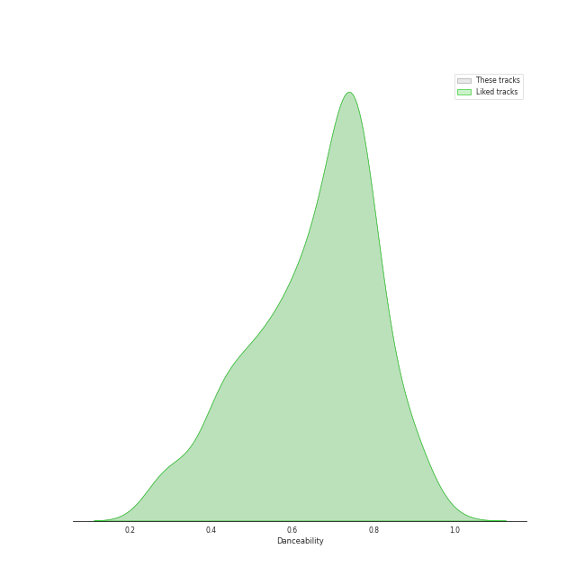
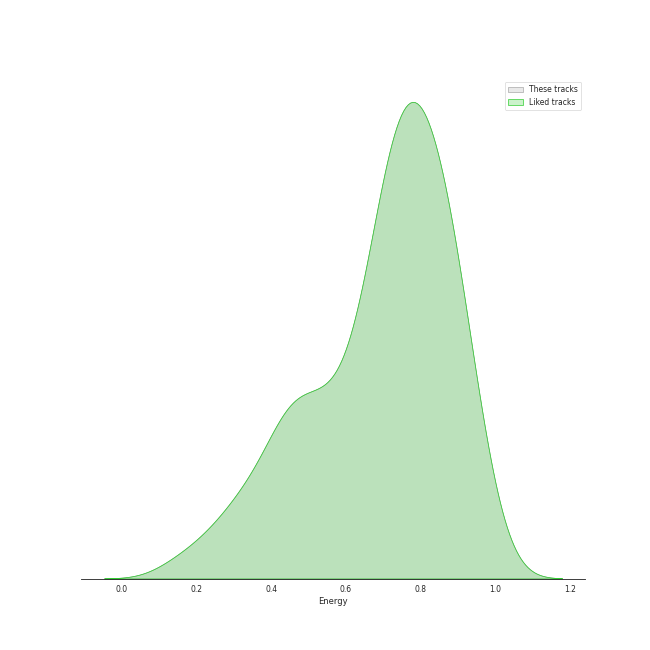
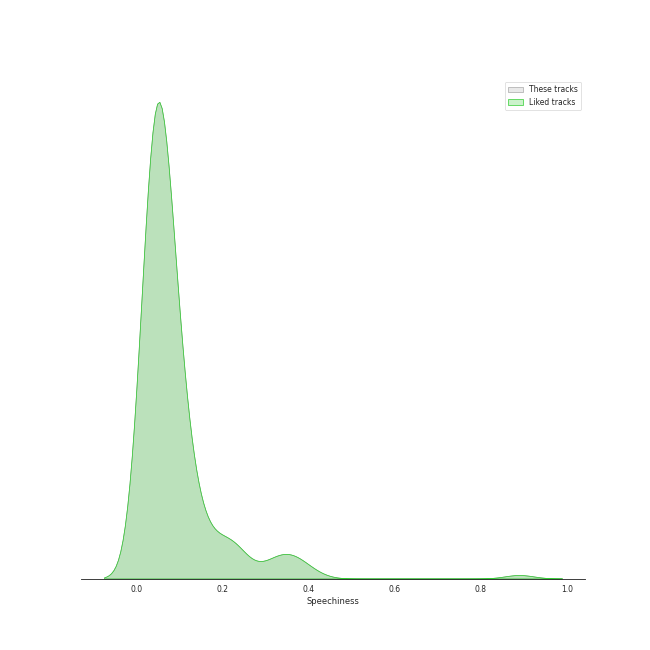
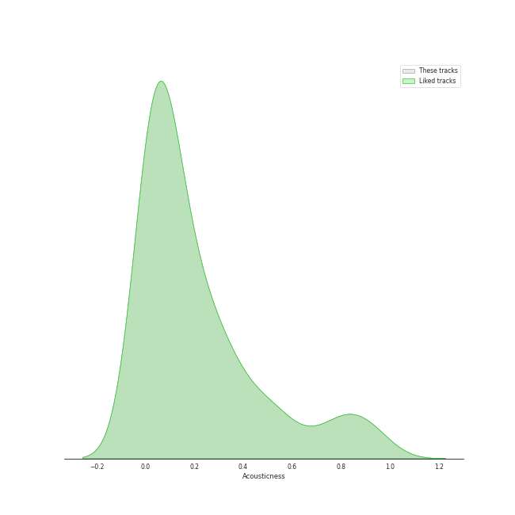
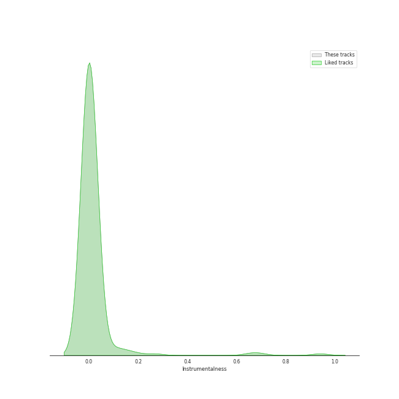
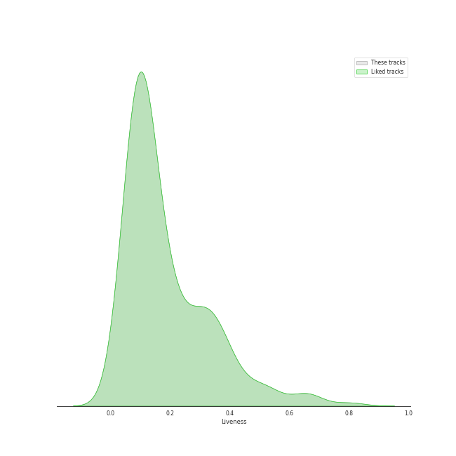
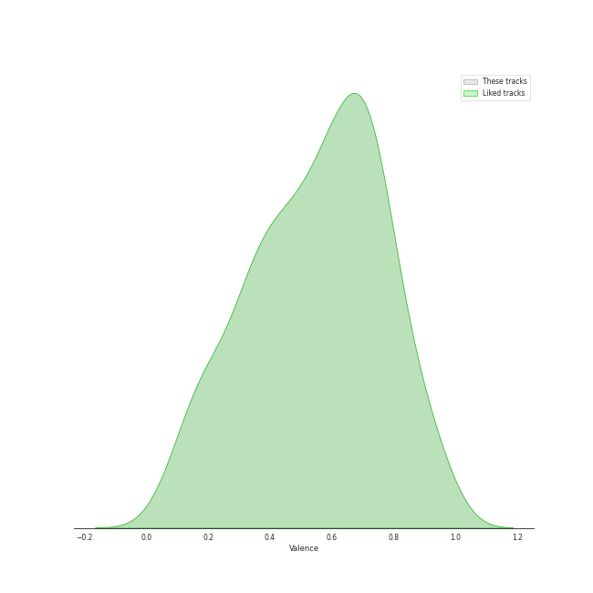
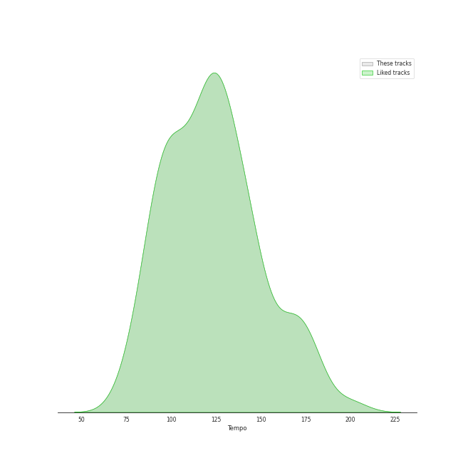

# Audio Features for Liked Tracks

## Danceability

| ​ | 10 most Danceable tracks | ​​ | 10 least Danceable tracks |
|:---|:---|:---|:---|
|  | Bando (0.97) |  | Pyramid Song (0.127) |
|  | SexyBack (feat. Timbaland) (0.967) |  | Bridge Over Troubled Water (0.149) |
|  | Anaconda (0.964) |  | Amore (0.167) |
|  | Cold Blooded (0.961) |  | The End (Interlude) (0.176) |
|  | #Twenty (0.956) |  | Born To Die (0.18) |
|  | FACE (0.954) |  | You Take My Breath Away (0.192) |
|  | Ah puh (0.954) |  | Lights (0.193) |
|  | Villain (0.95) |  | Nature Boy (0.203) |
|  | WAP (feat. Megan Thee Stallion) (0.935) |  | A Case of You (0.205) |
|  | Another One Bites The Dust - Remastered 2011 (0.933) |  | Fix You (0.209) |

## Energy

| ​ | 10 most Energetic tracks | ​​ | 10 least Energetic tracks |
|:---|:---|:---|:---|
|  | チョコレイト・ディスコ (0.99) |  | Kaleidoscope Heart (0.0516) |
|  | When Doves Cry (0.989) |  | Mad World (0.0585) |
|  | Shanti Shanti Shanti (0.988) |  | Run to You (0.0622) |
|  | Rondo of Nightmare (0.987) |  | And So It Goes (0.0871) |
|  | RING X RING (0.987) |  | Nature Boy (0.0895) |
|  | Headbangeeeeerrrrr!!!!! (0.985) |  | Used (0.0938) |
|  | Gimme Chocolate!! (0.985) |  | The Dawntreader (0.103) |
|  | Hit That Drum (0.984) |  | when the party's over (0.111) |
|  | KARATE (0.982) |  | xanny (0.125) |
|  | だいじょばない (0.982) |  | Blackbird - Remastered 2009 (0.127) |

## Speechiness

| ​ | 10 most Speechy tracks | ​​ | 10 least Speechy tracks |
|:---|:---|:---|:---|
|  | Youngblood (0.463) |  | With (0.0228) |
|  | Love Yourself (0.438) |  | Satellite Call (0.0241) |
|  | I Don't Need You (0.422) |  | 情非得已 (0.0241) |
|  | MANIAC (0.411) |  | Breakeven (0.0242) |
|  | Mambo No. 5 (a Little Bit of...) (0.408) |  | All Too Well (0.0243) |
|  | United In Grief (0.404) |  | The Scientist (0.0243) |
|  | LET GO (0.383) |  | Old Fashioned (0.0246) |
|  | Free Fall (0.376) |  | I'd Rather Go Blind (0.0247) |
|  | WAP (feat. Megan Thee Stallion) (0.375) |  | Set Fire to the Rain (0.0249) |
|  | bad guy (0.375) |  | Sweet Night (0.025) |

## Acousticness

| ​ | 10 most Acoustic tracks | ​​ | 10 least Acoustic tracks |
|:---|:---|:---|:---|
|  | when the party's over (0.978) |  | The Phantom Of The Opera (7.33e-06) |
|  | Mad World (0.976) |  | Kagerou (3.1e-05) |
|  | Manhattan (0.972) |  | Headbangeeeeerrrrr!!!!! (7.67e-05) |
|  | Nature Boy (0.971) |  | Poison (9.27e-05) |
|  | The Night We Met (0.969) |  | Let Down (0.000121) |
|  | I Had a King (0.968) |  | Mr. Simple (0.000219) |
|  | The Dawntreader (0.957) |  | Tamed-Dashed (0.000253) |
|  | Take It All (0.957) |  | Gimme Chocolate!! (0.000282) |
|  | Skinny Love (0.952) |  | Oh Sorry Ya (0.000315) |
|  | Lullabye (Goodnight, My Angel) (0.948) |  | Misery (0.000315) |

## Instrumentalness

| ​ | 10 most Instrumental tracks | ​​ | 10 least Instrumental tracks |
|:---|:---|:---|:---|
|  | Set the Controls for the Heart of the Sun (0.905) |  | Gangnam Style (강남스타일) (0.0) |
|  | Digital Love (0.867) |  | Traffic light (0.0) |
|  | だいじょばない (0.844) |  | No Hands (feat. Roscoe Dash & Wale) (0.0) |
|  | Animals (0.796) |  | Sweet As Whole (0.0) |
|  | Breathe (In the Air) (0.728) |  | GGBB (0.0) |
|  | Reptilia (0.713) |  | The Lighthouse's Tale (0.0) |
|  | Street Spirit (Fade Out) (0.694) |  | Fire in the belly (0.0) |
|  | A Fifth Of Beethoven (0.69) |  | Clean (0.0) |
|  | everything i wanted (0.657) |  | To the moon (0.0) |
|  | Instant Crush (feat. Julian Casablancas) (0.619) |  | Shut Down (0.0) |

## Liveness

| ​ | 10 most Live tracks | ​​ | 10 least Live tracks |
|:---|:---|:---|:---|
|  | Bel Air (0.901) |  | PING PONG (0.0202) |
|  | Thriller (0.89) |  | Ain't It Fun (0.021) |
|  | XS (0.869) |  | Finesse - Remix; feat. Cardi B (0.0215) |
|  | Can't Tell Me Nothing (0.82) |  | CASE 143 (0.0222) |
|  | Piano Man (0.807) |  | Finesse (0.0232) |
|  | You Better Run (0.803) |  | Fire in the belly (0.0266) |
|  | Red Lipstick (feat. Yoonmirae) (0.792) |  | That That (prod. & feat. SUGA of BTS) (0.0272) |
|  | MAKE U DANCE (feat. EUNHA) (0.792) |  | memeM (0.0287) |
|  | 미행 (그림자 : Shadow) (0.782) |  | YEPPI YEPPI (0.029) |
|  | Generation (0.777) |  | Holiday Party (0.0294) |

## Valence

| ​ | 10 most Happy tracks | ​​ | 10 least Happy tracks |
|:---|:---|:---|:---|
|  | Sour candy (0.98) |  | You Take My Breath Away (0.0384) |
|  | Big Yellow Taxi (0.97) |  | What Sarah Said (0.0401) |
|  | Like a Virgin (0.97) |  | Free (0.0494) |
|  | There's Nothing Holdin' Me Back (0.969) |  | Delicate (0.0499) |
|  | Twenty-three (0.968) |  | No Time To Die (0.0517) |
|  | Devil (0.968) |  | xanny (0.0528) |
|  | Mercy (0.964) |  | Once Upon Another Time (0.0551) |
|  | SexyBack (feat. Timbaland) (0.964) |  | Crystallize (0.0563) |
|  | I'm a Slave 4 U (0.963) |  | Lose Yourself (0.059) |
|  | So Hot (0.963) |  | Falling (0.0592) |

## Tempo

| ​ | 10 most Fast tracks | ​​ | 10 least Fast tracks |
|:---|:---|:---|:---|
|  | Signal (207.819) |  | Dream (48.973) |
|  | That Man (207.029) |  | Seven Devils (58.534) |
|  | Lights (205.422) |  | Desperado - 2013 Remaster (60.3) |
|  | Uncharted (203.962) |  | Bambi (61.45) |
|  | Every night (203.639) |  | My Everything (61.975) |
|  | 11:11 (203.155) |  | River (62.507) |
|  | O.O (200.263) |  | imagine (62.52) |
|  | Blue Whale - 2016 Version (200.096) |  | We Are The Champions - Remastered 2011 (64.223) |
|  | Strawberry Cake (199.943) |  | Run Devil Run (64.927) |
|  | No title (199.751) |  | Moondance - 2013 Remaster (67.409) |
