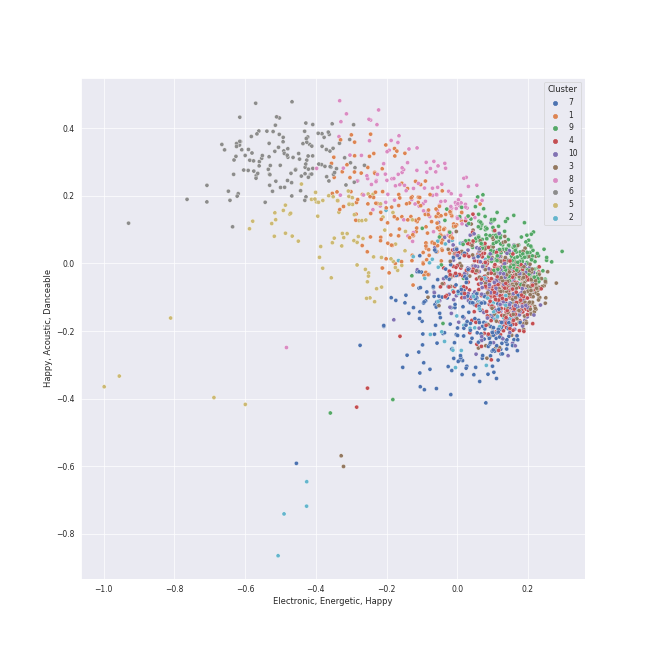

# Clusters in Liked Tracks

## Cluster #1

195 tracks

| Art | Track | Album | Artists | Label | Rank | 💚 | 🔗 |
|:---|:---|:---|:---|:---|---:|:---|:---|
|  | Talk that Talk | BETWEEN 1&2 | [TWICE](../../../../artists/twice/overview.md) | [Republic Records](../../../../labels/republic_records) | nan | 💚 | [🔗](https://open.spotify.com/track/0RDqNCRBGrSegk16Avfzuq) |
|  | 怪物 | 怪物 | YOASOBI | YOASOBI | 672 | 💚 | [🔗](https://open.spotify.com/track/06XQvnJb53SUYmlWIhUXUi) |
|  | ParadoXXX Invasion | MANIFESTO : DAY 1 | [ENHYPEN](../../../../artists/enhypen/overview.md) | [BELIFT LAB](../../../../labels/belift_lab) | 19 | 💚 | [🔗](https://open.spotify.com/track/3OC2C8IpFhbUJTeMe55QYn) |
|  | Jumpin' | ‘The ReVe Festival’ Finale | [Red Velvet](../../../../artists/red_velvet/overview.md) | [SM Entertainment](../../../../labels/sm_entertainment) | 339 | 💚 | [🔗](https://open.spotify.com/track/3q21kVfUIdkzqYpzBCbojN) |
|  | Giddy | LOVESTRUCK! | Kep1er | [Genie Music Corporation](../../../../labels/genie_music_corporation), [Stone Music Entertainment](../../../../labels/stone_music_entertainment) | nan | 💚 | [🔗](https://open.spotify.com/track/6blIAzkMKENKqAfMwj5cZQ) |
|  | Teddy Bear | Teddy Bear | [STAYC](../../../../artists/stayc/overview.md) | [High Up Entertainment](../../../../labels/high_up_entertainment) | 451 | 💚 | [🔗](https://open.spotify.com/track/4kSDi21MeOoSvpZs6MveI9) |
|  | Home | Carencro | Marc Broussard | [Island Records](../../../../labels/island_records) | nan | 💚 | [🔗](https://open.spotify.com/track/1XhzO8cuPaqsqUKw92Wbwc) |
|  | Rebel | 20&2 - The 9th Album | [TVXQ!](../../../../artists/tvxq!/overview.md) | [SM Entertainment](../../../../labels/sm_entertainment) | nan | 💚 | [🔗](https://open.spotify.com/track/4Vawz7UCdavhRW1OxovN4a) |
|  | Pity Party | Pity Party | JAMIE | [WM Korea](../../../../labels/wm_korea) | 646 | 💚 | [🔗](https://open.spotify.com/track/3hmjSgK0gSytIf3sbCFShk) |
|  | 脳裏上のクラッカー | 潜潜話 | ZUTOMAYO | [Universal Music LLC](../../../../labels/universal_music_llc) | nan | 💚 | [🔗](https://open.spotify.com/track/3FRU8JI3EK9G7hXSP3P4R8) |
## Cluster #2

153 tracks

| Art | Track | Album | Artists | Label | Rank | 💚 | 🔗 |
|:---|:---|:---|:---|:---|---:|:---|:---|
|  | If | Hong Gil Dong OST | [TAEYEON](../../../../artists/taeyeon/overview.md) | msmedia | nan | 💚 | [🔗](https://open.spotify.com/track/76do9IBWqoiwV3EyoP25Le) |
|  | Secret Garden | A flower bookmark | [IU](../../../../artists/iu/overview.md) | Fave Entertainment | nan | 💚 | [🔗](https://open.spotify.com/track/5F6nAnNIsRk9QbPOx9t11B) |
|  | Video Games | Born To Die | [Lana Del Rey](../../../../artists/lana_del_rey/overview.md) | [Polydor Records](../../../../labels/polydor_records) | nan | 💚 | [🔗](https://open.spotify.com/track/5by7gtiDrxe4n2qQQunL8S) |
|  | That Wasn't Me | Bear Creek | Brandi Carlile | [Columbia](../../../../labels/columbia) | nan | 💚 | [🔗](https://open.spotify.com/track/6iqAJh3X8bf94eo4reme5L) |
|  | How can I love the heartbreak, you're the one I love | SAILING | [AKMU](../../../../artists/akmu/overview.md) | [YG Entertainment](../../../../labels/yg_entertainment) | nan | 💚 | [🔗](https://open.spotify.com/track/0hqj5JBnFt1BHEz2UCFwrl) |
|  | Breakfast on the Morning Tram | Breakfast on the Morning Tram | Stacey Kent | Parlophone (France) | nan | 💚 | [🔗](https://open.spotify.com/track/0mcs5XA4bwgCVYLUxvJ9sg) |
|  | Wait It Out | Ellipse | [Imogen Heap](../../../../artists/imogen_heap/overview.md) | [RCA Records Label](../../../../labels/rca_records_label) | nan | 💚 | [🔗](https://open.spotify.com/track/4xszw2YraekWIpj0SZ6Lp6) |
|  | Work Song | Hozier (Expanded Edition) | Hozier | [Columbia](../../../../labels/columbia) | nan | 💚 | [🔗](https://open.spotify.com/track/5TgEJ62DOzBpGxZ7WRsrqb) |
|  | Honeybee | The 2¢ Show | Steam Powered Giraffe | Steam Powered Giraffe | nan | 💚 | [🔗](https://open.spotify.com/track/3MZjOGeXhpHbQ9ESMNFFnH) |
|  | DIE 4 YOU | DIE 4 YOU | DEAN | [Universal Music Ltd.](../../../../labels/universal_music_llc) | nan | 💚 | [🔗](https://open.spotify.com/track/7yZD4AVfQtAZD4cG8eRnPk) |
## Cluster #3

251 tracks

| Art | Track | Album | Artists | Label | Rank | 💚 | 🔗 |
|:---|:---|:---|:---|:---|---:|:---|:---|
|  | Blank Space | 1989 | [Taylor Swift](../../../../artists/taylor_swift/overview.md) | [Big Machine Records, LLC](../../../../labels/big_machine_records) | nan | 💚 | [🔗](https://open.spotify.com/track/1p80LdxRV74UKvL8gnD7ky) |
|  | Slow Grenade | Slow Grenade | Ellie Goulding, Lauv | [Polydor Records](../../../../labels/polydor_records) | nan | 💚 | [🔗](https://open.spotify.com/track/5z8uLrYMcUVvzTV28twt44) |
|  | Limbo | Vows (Deluxe Version) | [Kimbra](../../../../artists/kimbra/overview.md) | [Warner Records](../../../../labels/warner_records) | 720 | 💚 | [🔗](https://open.spotify.com/track/6go4VH47IaXtYlTGHizjhm) |
|  | Quit | Windy | [JEON SOYEON](../../../../artists/jeon_soyeon/overview.md) | [Universal Music LLC](../../../../labels/universal_music_llc) | nan | 💚 | [🔗](https://open.spotify.com/track/54y2W3EYYsSnyqL1rinbJb) |
|  | NAKKA (with IU) | NEXT EPISODE | [AKMU](../../../../artists/akmu/overview.md), [IU](../../../../artists/iu/overview.md) | [YG Entertainment](../../../../labels/yg_entertainment) | 702 | 💚 | [🔗](https://open.spotify.com/track/4t2FIqZJORKZGSKg30SShr) |
|  | XOXO | XOXO | JEON SOMI | [THE BLACK LABEL/Interscope Records](../../../../labels/interscope_records) | nan | 💚 | [🔗](https://open.spotify.com/track/4r34Yi0eltsu1tp6z4lq3x) |
|  | Anyone | SEVENTEEN 8th Mini Album 'Your Choice' | [SEVENTEEN](../../../../artists/seventeen/overview.md) | [PLEDIS Entertainment](../../../../labels/pledis_entertainment) | nan | 💚 | [🔗](https://open.spotify.com/track/12jngD7Hu6if6sIzPkO2k4) |
|  | You Calling My Name | Call My Name | GOT7 | [JYP Entertainment](../../../../labels/jyp_entertainment) | nan | 💚 | [🔗](https://open.spotify.com/track/6f4wghlwYWGLqGEIKc6HDQ) |
|  | All The Stars (with SZA) | Black Panther The Album Music From And Inspired By | [Kendrick Lamar](../../../../artists/kendrick_lamar/overview.md), SZA | Black Panther (TDE/DMG) PS | nan | 💚 | [🔗](https://open.spotify.com/track/3GCdLUSnKSMJhs4Tj6CV3s) |
|  | Ashes | Ashes | Stellar | Arista Records | nan | 💚 | [🔗](https://open.spotify.com/track/3Pj6u2KTgepyyidp5xfbHp) |
## Cluster #4

114 tracks

| Art | Track | Album | Artists | Label | Rank | 💚 | 🔗 |
|:---|:---|:---|:---|:---|---:|:---|:---|
|  | Life Goes On | BE | [BTS](../../../../artists/bts/overview.md) | [BIGHIT MUSIC](../../../../labels/bighit_music) | nan | 💚 | [🔗](https://open.spotify.com/track/5FVbvttjEvQ8r2BgUcJgNg) |
|  | CRIMINAL LOVE | CRIMINAL LOVE | [ENHYPEN](../../../../artists/enhypen/overview.md) | [BELIFT LAB](../../../../labels/belift_lab) | 107 | 💚 | [🔗](https://open.spotify.com/track/0Eglu3fErlG196PtTwCUPM) |
|  | F**kin' Perfect | Greatest Hits...So Far!!! | P!nk | LaFace Records | nan | 💚 | [🔗](https://open.spotify.com/track/3MGJF1CDFGfjXESL2Heva0) |
|  | Décalcomanie | MEMORY | [MAMAMOO](../../../../artists/mamamoo/overview.md) | [Genie Music Corporation](../../../../labels/genie_music_corporation), [Stone Music Entertainment](../../../../labels/stone_music_entertainment) | nan | 💚 | [🔗](https://open.spotify.com/track/5WitNasXEIRptoLIQUcXMx) |
|  | Lover To Lover | Ceremonials (Deluxe Edition) | [Florence + The Machine](../../../../artists/florence_+_the_machine/overview.md) | [Universal-Island Records Ltd.](../../../../labels/universal-island_records_ltd_) | nan | 💚 | [🔗](https://open.spotify.com/track/1LsZVVQxkbmL9izqfy1RRK) |
|  | TANK | AD MARE | [NMIXX](../../../../artists/nmixx/overview.md) | [Republic Records](../../../../labels/republic_records) | 478 | 💚 | [🔗](https://open.spotify.com/track/4ZbXs9DzvdWlsQfA9ZUkCV) |
|  | BEAUTIFUL MONSTER | WE NEED LOVE | [STAYC](../../../../artists/stayc/overview.md) | [High Up Entertainment](../../../../labels/high_up_entertainment) | nan | 💚 | [🔗](https://open.spotify.com/track/56s2s5e8WuBsWVKnmz6J9L) |
|  | Hobgoblin | CRYSTYLE | [CLC](../../../../artists/clc/overview.md) | [CUBE ENTERTAINMENT](../../../../labels/cube_entertainment) | 408 | 💚 | [🔗](https://open.spotify.com/track/2pSOUHBQXkN3fS2TAJHhfR) |
|  | i'm confident that i'm insecure | i'm confident that i'm insecure | Lawrence | Beautiful Mind | nan | 💚 | [🔗](https://open.spotify.com/track/2vcJAWazBGDeUIbzdU0zV8) |
|  | Galaxy | MYST3RY | LADIES' CODE | 폴라리스엔터테인먼트, BlockBerryCreative | nan | 💚 | [🔗](https://open.spotify.com/track/5rd00qaUJugfI8nhPcxA3o) |
## Cluster #5

170 tracks

| Art | Track | Album | Artists | Label | Rank | 💚 | 🔗 |
|:---|:---|:---|:---|:---|---:|:---|:---|
|  | the last great american dynasty | folklore | [Taylor Swift](../../../../artists/taylor_swift/overview.md) | [Taylor Swift](../../../../labels/taylor_swift) | nan | 💚 | [🔗](https://open.spotify.com/track/2Eeur20xVqfUoM3Q7EFPFt) |
|  | Eyes Locked, Hands Locked | ‘The ReVe Festival’ Day 2 | [Red Velvet](../../../../artists/red_velvet/overview.md) | [SM Entertainment](../../../../labels/sm_entertainment) | nan | 💚 | [🔗](https://open.spotify.com/track/4o6LdaI3q5QFjs0sziszsD) |
|  | I'm Yours | We Sing. We Dance. We Steal Things. | Jason Mraz | [Atlantic Records/ATG](../../../../labels/atlantic_records) | nan | 💚 | [🔗](https://open.spotify.com/track/1EzrEOXmMH3G43AXT1y7pA) |
|  | Free Man in Paris | Court and Spark | [Joni Mitchell](../../../../artists/joni_mitchell/overview.md) | [Rhino](../../../../labels/rhino) | nan | 💚 | [🔗](https://open.spotify.com/track/2by5mqpQ1ZP2G5FOIccMnu) |
|  | Delfino Plaza (From "Super Mario Sunshine") | Choose Your Character! | [The 8-Bit Big Band](../../../../artists/the_8-bit_big_band/overview.md) | The 8-Bit Big Band | nan | 💚 | [🔗](https://open.spotify.com/track/2gnqOaI0TpTOg8FufLil3Y) |
|  | Make Up (Feat. Crush) | Sun And Moon | Sam Kim, [Crush](../../../../artists/crush/overview.md) | Antenna | nan | 💚 | [🔗](https://open.spotify.com/track/19zsSUEuJNzNA6eqInqyF9) |
|  | Bottom of the River | Carry the Fire | Delta Rae | Sire | nan | 💚 | [🔗](https://open.spotify.com/track/2LzyUfJdRp3uqTrITBJXEY) |
|  | Orgel | SHINee The 3rd Album 'The Misconceptions Of Us' | [SHINee](../../../../artists/shinee/overview.md) | [SM Entertainment](../../../../labels/sm_entertainment) | 326 | 💚 | [🔗](https://open.spotify.com/track/5QW673bbf5BnFQcULXUUE5) |
|  | Cara Italia | Cara Italia | Ghali | WMI Italy | 718 | 💚 | [🔗](https://open.spotify.com/track/3atDsUhlUgDlQQrI0XFh7I) |
|  | Big Booty | 容 : FACE | Solar | [RBW Inc.](../../../../labels/rbw_inc_) | nan | 💚 | [🔗](https://open.spotify.com/track/5bwzsMhJZHSHM6M6qslOgd) |
## Cluster #6

128 tracks

| Art | Track | Album | Artists | Label | Rank | 💚 | 🔗 |
|:---|:---|:---|:---|:---|---:|:---|:---|
|  | Wine | Purpose - The 2nd Album | [TAEYEON](../../../../artists/taeyeon/overview.md) | [SM Entertainment](../../../../labels/sm_entertainment) | nan | 💚 | [🔗](https://open.spotify.com/track/2Bgjj3t5bOh34DfENfgyUY) |
|  | Stay With Me | Guardian (Original Television Soundtrack), Pt. 1 | CHANYEOL, Punch | [Genie Music Corporation](../../../../labels/genie_music_corporation), [Stone Music Entertainment](../../../../labels/stone_music_entertainment) | nan | 💚 | [🔗](https://open.spotify.com/track/1HYzRuWjmS9LXCkdVHi25K) |
|  | Save Me - Remastered 2011 | The Game (Deluxe Remastered Version) | [Queen](../../../../artists/queen/overview.md) | [Hollywood Records](../../../../labels/hollywood_records) | nan | 💚 | [🔗](https://open.spotify.com/track/2mGEqJahn3CSyCG1BTEqMs) |
|  | Happy Ending | Life in Cartoon Motion | MIKA | Casablanca Records/Island UK | nan | 💚 | [🔗](https://open.spotify.com/track/1wl3u4FrzcuBv2LQ97Z6TQ) |
|  | Goodbye Yellow Brick Road - Remastered 2014 | Goodbye Yellow Brick Road (Remastered) | Elton John | [UMC (Universal Music Catalogue)](../../../../labels/umc_(universal_music_catalogue)) | nan | 💚 | [🔗](https://open.spotify.com/track/4IRHwIZHzlHT1FQpRa5RdE) |
|  | Stone Cold | Confident | Demi Lovato | [Hollywood Records](../../../../labels/hollywood_records) | nan | 💚 | [🔗](https://open.spotify.com/track/3by8IfnW9dZ2t4pZw1WVxz) |
|  | Crown | 28 Reasons - The 1st Mini Album | [SEULGI](../../../../artists/seulgi/overview.md) | [SM Entertainment](../../../../labels/sm_entertainment) | 138 | 💚 | [🔗](https://open.spotify.com/track/4Y0EawuG8OtyYNyJulWnDu) |
|  | The Man Who Can't Be Moved | The Script | The Script | [Epic/Phonogenic](../../../../labels/epic) | nan | 💚 | [🔗](https://open.spotify.com/track/3nqqDo8CcCLke3ZoTgiOKf) |
|  | Wrecking Ball | Bangerz (Deluxe Version) | Miley Cyrus | [RCA Records Label](../../../../labels/rca_records_label) | 585 | 💚 | [🔗](https://open.spotify.com/track/2vwlzO0Qp8kfEtzTsCXfyE) |
|  | Summer Is for Falling in Love | Summer Is for Falling in Love | Sarah Kang, EyeLoveBrandon | Sarah Kang | nan | 💚 | [🔗](https://open.spotify.com/track/6yfGer1TKpxOjhSd5eL0DL) |
## Cluster #7

312 tracks

| Art | Track | Album | Artists | Label | Rank | 💚 | 🔗 |
|:---|:---|:---|:---|:---|---:|:---|:---|
|  | Don't Ask Me Why | Glass Houses | [Billy Joel](../../../../artists/billy_joel/overview.md) | [Columbia](../../../../labels/columbia) | nan | 💚 | [🔗](https://open.spotify.com/track/6g4vHtdGqD5eEgpf7nKISk) |
|  | Give Me Your TMI | MAXIDENT | [Stray Kids](../../../../artists/stray_kids/overview.md) | [Republic Records](../../../../labels/republic_records) | 268 | 💚 | [🔗](https://open.spotify.com/track/7CQhZA3qNDZBoTKWqjD7gR) |
|  | Run Away (RYUJIN) | BORN TO BE | [ITZY](../../../../artists/itzy/overview.md) | [Republic Records](../../../../labels/republic_records) | 240 | 💚 | [🔗](https://open.spotify.com/track/4e94KIas5maH8RixY26LiN) |
|  | Bad Boy | The Perfect Red Velvet - The 2nd Album Repackage | [Red Velvet](../../../../artists/red_velvet/overview.md) | [SM Entertainment](../../../../labels/sm_entertainment) | 12 | 💚 | [🔗](https://open.spotify.com/track/5GKwq4sO5ZHKuWaDmdwMQc) |
|  | yes, and? | eternal sunshine | [Ariana Grande](../../../../artists/ariana_grande/overview.md) | [Republic Records](../../../../labels/republic_records) | nan | 💚 | [🔗](https://open.spotify.com/track/5D34wRmbFS29AjtTOP2QJe) |
|  | HIP | reality in BLACK | [MAMAMOO](../../../../artists/mamamoo/overview.md) | [RBW, Inc](../../../../labels/rbw_inc_) | 2 | 💚 | [🔗](https://open.spotify.com/track/24nK8tW7Pt3Inh2utttuoG) |
|  | You Can Call Me Al | Graceland (25th Anniversary Deluxe Edition) | Paul Simon | Legacy Recordings | nan | 💚 | [🔗](https://open.spotify.com/track/0qxYx4F3vm1AOnfux6dDxP) |
|  | overlap (1/1) | the collective soul and unconscious: chapter one | [Billlie](../../../../artists/billlie/overview.md) | [MYSTIC STORY](../../../../labels/mystic_story) | 612 | 💚 | [🔗](https://open.spotify.com/track/3VMbll8GQGlE1WuWaTPtxJ) |
|  | Chasing Tomorrow | Chasing Tomorrow | CARSTN, GoldFish, Anna Graceman | Kontor Records | nan | 💚 | [🔗](https://open.spotify.com/track/3vBMircA5qKK86CGshh4Ir) |
|  | HONEY | 容 : FACE | Solar | [RBW Inc.](../../../../labels/rbw_inc_) | nan | 💚 | [🔗](https://open.spotify.com/track/7JDiC68AKimlvMCmZQuA9n) |
## Cluster #8

222 tracks

| Art | Track | Album | Artists | Label | Rank | 💚 | 🔗 |
|:---|:---|:---|:---|:---|---:|:---|:---|
|  | Cold As Hell | INVU - The 3rd Album | [TAEYEON](../../../../artists/taeyeon/overview.md) | [SM Entertainment](../../../../labels/sm_entertainment) | 711 | 💚 | [🔗](https://open.spotify.com/track/7gosH4fL73GpiJBd5GK2rC) |
|  | Dancing With Our Hands Tied | reputation | [Taylor Swift](../../../../artists/taylor_swift/overview.md) | [Big Machine Records, LLC](../../../../labels/big_machine_records) | nan | 💚 | [🔗](https://open.spotify.com/track/7I7JbDv63ZJJsSi24DyJrz) |
|  | Not Ready to Make Nice | Taking The Long Way | The Chicks | [Open Wide/Columbia](../../../../labels/columbia) | nan | 💚 | [🔗](https://open.spotify.com/track/6LCEyZZHFF4ebF1Mike1s5) |
|  | Summertime Sadness | Born To Die | [Lana Del Rey](../../../../artists/lana_del_rey/overview.md) | [Polydor Records](../../../../labels/polydor_records) | 413 | 💚 | [🔗](https://open.spotify.com/track/4cKtn8Shw999egpwBmWQmp) |
|  | All Of The Lights | My Beautiful Dark Twisted Fantasy | Kanye West | Roc-A-Fella | nan | 💚 | [🔗](https://open.spotify.com/track/22L7bfCiAkJo5xGSQgmiIO) |
|  | DRAMARAMA | THE CODE | MONSTA X | [Starship Entertainment](../../../../labels/starship_entertainment) | nan | 💚 | [🔗](https://open.spotify.com/track/1BSncOsSJPQkpl29QM0ipj) |
|  | KAZINO | KAZINO | [BIBI](../../../../artists/bibi/overview.md) | FeelGhoodMusic | 491 | 💚 | [🔗](https://open.spotify.com/track/245onUPHGD1DYuiacxTuW0) |
|  | Cough Syrup | Young The Giant (Special Edition) | Young the Giant | Roadrunner Records | nan | 💚 | [🔗](https://open.spotify.com/track/1UqhkbzB1kuFwt2iy4h29Q) |
|  | Breezeblocks | An Awesome Wave | alt-J | Canvasback/ATL | nan | 💚 | [🔗](https://open.spotify.com/track/3n69hLUdIsSa1WlRmjMZlW) |
|  | Say (All I Need) | Dreaming Out Loud | OneRepublic | [Mosley / Interscope](../../../../labels/interscope_records) | nan | 💚 | [🔗](https://open.spotify.com/track/6H4vq5gz0rlNjH0LBzu4An) |
## Cluster #9

278 tracks

| Art | Track | Album | Artists | Label | Rank | 💚 | 🔗 |
|:---|:---|:---|:---|:---|---:|:---|:---|
|  | Four Seasons | Four Seasons | [TAEYEON](../../../../artists/taeyeon/overview.md) | [SM Entertainment](../../../../labels/sm_entertainment) | nan | 💚 | [🔗](https://open.spotify.com/track/4ytyLpIwUXbdFsNOvgNnmP) |
|  | Fairytale | Little Voice | [Sara Bareilles](../../../../artists/sara_bareilles/overview.md) | [Epic](../../../../labels/epic) | 396 | 💚 | [🔗](https://open.spotify.com/track/1q8eyTNRSGEAqSvTATTgIG) |
|  | eight(Prod.&Feat. SUGA of BTS) | eight | [IU](../../../../artists/iu/overview.md), SUGA | [EDAM Entertainment](../../../../labels/edam_entertainment) | 734 | 💚 | [🔗](https://open.spotify.com/track/0pYacDCZuRhcrwGUA5nTBe) |
|  | Good day | REAL | [IU](../../../../artists/iu/overview.md) | [Kakao Entertainment](../../../../labels/kakao_entertainment) | nan | 💚 | [🔗](https://open.spotify.com/track/1SwZVVH9BnXtLRLi2cbFhw) |
|  | Problem | My Everything (Deluxe) | [Ariana Grande](../../../../artists/ariana_grande/overview.md), Iggy Azalea | [Universal Records](../../../../labels/universal_music_llc) | 320 | 💚 | [🔗](https://open.spotify.com/track/7vS3Y0IKjde7Xg85LWIEdP) |
|  | Cowboy Casanova | Play On | Carrie Underwood | 19 Recordings Limited / Arista Nashville | nan | 💚 | [🔗](https://open.spotify.com/track/6OqdF0vHI9xkqswI7EK0cD) |
|  | Dance in the Graveyards | Carry the Fire | Delta Rae | Sire | nan | 💚 | [🔗](https://open.spotify.com/track/1gOEbMyphMVhTyZ4HxXQro) |
|  | Rover | Rover - The 3rd Mini Album | KAI | [SM Entertainment](../../../../labels/sm_entertainment) | 215 | 💚 | [🔗](https://open.spotify.com/track/3WUyu94psXrYV6HZbXgcFA) |
|  | Set Me Free Pt.2 | FACE | Jimin | [BIGHIT MUSIC](../../../../labels/bighit_music) | 467 | 💚 | [🔗](https://open.spotify.com/track/1fpj1CJPxY3YvN3AMAEYvt) |
|  | Touch my body | TOUCH N MOVE | SISTAR | [Starship Entertainment](../../../../labels/starship_entertainment) | nan | 💚 | [🔗](https://open.spotify.com/track/5crARIrvoMiMf2AdlD78WN) |