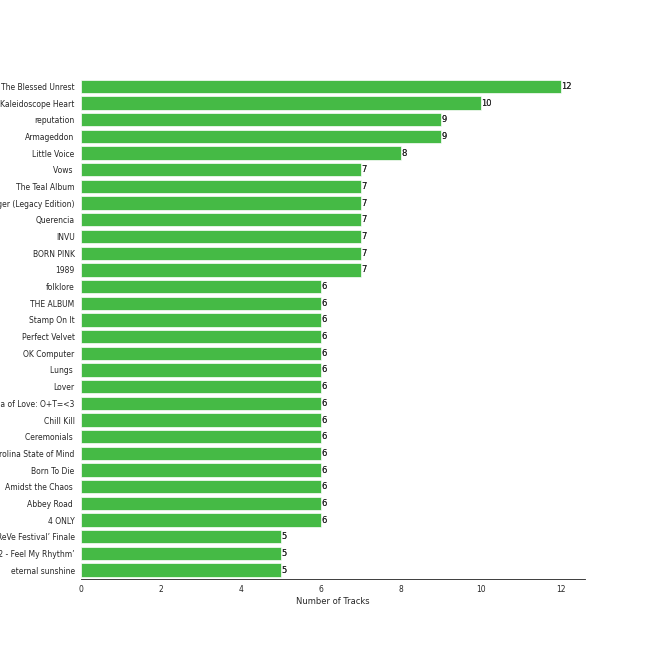
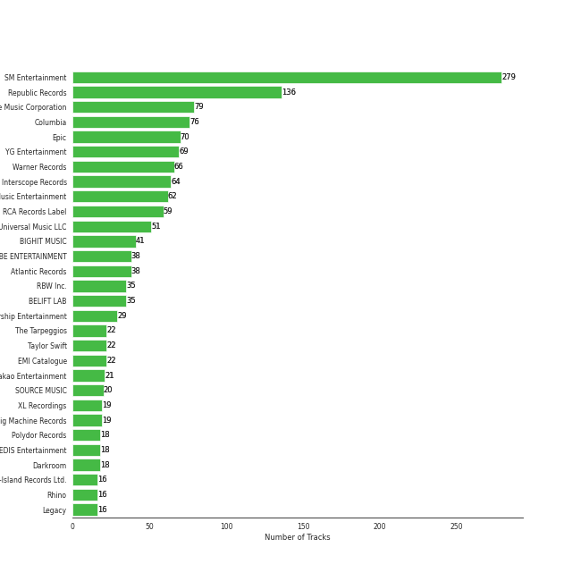
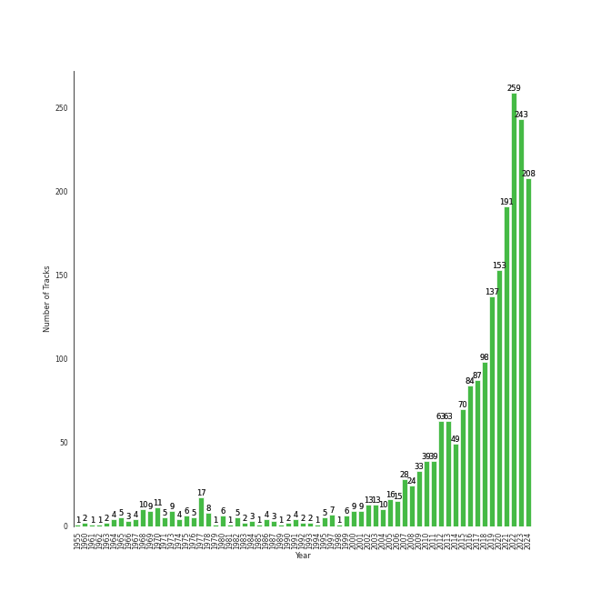

# Liked Tracks

1801 tracks

[See Track Features](audio_features.md)

[See Clusters](clusters/overview.md)

## Top Artists

| Art | Tracks | 💚 | Artist | 🔗 |
|:---|---:|---:|:---|:---|
|  | 59 | 59 | [Red Velvet](../../artists/red_velvet/overview.md) | [🔗](https://open.spotify.com/artist/1z4g3DjTBBZKhvAroFlhOM) |
|  | 41 | 41 | [Sara Bareilles](../../artists/sara_bareilles/overview.md) | [🔗](https://open.spotify.com/artist/2Sqr0DXoaYABbjBo9HaMkM) |
|  | 39 | 39 | [Taylor Swift](../../artists/taylor_swift/overview.md) | [🔗](https://open.spotify.com/artist/06HL4z0CvFAxyc27GXpf02) |
|  | 35 | 35 | [IU](../../artists/iu/overview.md) | [🔗](https://open.spotify.com/artist/3HqSLMAZ3g3d5poNaI7GOU) |
|  | 33 | 33 | [TWICE](../../artists/twice/overview.md) | [🔗](https://open.spotify.com/artist/7n2Ycct7Beij7Dj7meI4X0) |
|  | 31 | 31 | [(G)I-DLE](../../artists/(g)i-dle/overview.md) | [🔗](https://open.spotify.com/artist/2AfmfGFbe0A0WsTYm0SDTx) |
|  | 30 | 30 | [ITZY](../../artists/itzy/overview.md) | [🔗](https://open.spotify.com/artist/2KC9Qb60EaY0kW4eH68vr3) |
|  | 28 | 28 | [ENHYPEN](../../artists/enhypen/overview.md) | [🔗](https://open.spotify.com/artist/5t5FqBwTcgKTaWmfEbwQY9) |
|  | 26 | 26 | [aespa](../../artists/aespa/overview.md) | [🔗](https://open.spotify.com/artist/6YVMFz59CuY7ngCxTxjpxE) |
|  | 26 | 26 | [Stray Kids](../../artists/stray_kids/overview.md) | [🔗](https://open.spotify.com/artist/2dIgFjalVxs4ThymZ67YCE) |

See top 100 artists

| Art | Tracks | 💚 | Artist | 🔗 |
|:---|---:|---:|:---|:---|
|  | 25 | 25 | [TAEYEON](../../artists/taeyeon/overview.md) | [🔗](https://open.spotify.com/artist/3qNVuliS40BLgXGxhdBdqu) |
|  | 23 | 23 | [BLACKPINK](../../artists/blackpink/overview.md) | [🔗](https://open.spotify.com/artist/41MozSoPIsD1dJM0CLPjZF) |
|  | 23 | 23 | [BTS](../../artists/bts/overview.md) | [🔗](https://open.spotify.com/artist/3Nrfpe0tUJi4K4DXYWgMUX) |
|  | 22 | 22 | [The Beatles](../../artists/the_beatles/overview.md) | [🔗](https://open.spotify.com/artist/3WrFJ7ztbogyGnTHbHJFl2) |
|  | 20 | 20 | [The Tarpeggios](../../artists/the_tarpeggios/overview.md) | [🔗](https://open.spotify.com/artist/2HXd5pFHJyaQJr5aXfErrE) |
|  | 19 | 19 | [LeeHi](../../artists/leehi/overview.md) | [🔗](https://open.spotify.com/artist/7cVZApDoQZpS447nHTsNqu) |
|  | 17 | 17 | [Billy Joel](../../artists/billy_joel/overview.md) | [🔗](https://open.spotify.com/artist/6zFYqv1mOsgBRQbae3JJ9e) |
|  | 17 | 17 | [Ariana Grande](../../artists/ariana_grande/overview.md) | [🔗](https://open.spotify.com/artist/66CXWjxzNUsdJxJ2JdwvnR) |
|  | 16 | 16 | [Pentatonix](../../artists/pentatonix/overview.md) | [🔗](https://open.spotify.com/artist/26AHtbjWKiwYzsoGoUZq53) |
|  | 16 | 16 | [MAMAMOO](../../artists/mamamoo/overview.md) | [🔗](https://open.spotify.com/artist/0XATRDCYuuGhk0oE7C0o5G) |
|  | 14 | 14 | [Rihanna](../../artists/rihanna/overview.md) | [🔗](https://open.spotify.com/artist/5pKCCKE2ajJHZ9KAiaK11H) |
|  | 14 | 14 | [Radiohead](../../artists/radiohead/overview.md) | [🔗](https://open.spotify.com/artist/4Z8W4fKeB5YxbusRsdQVPb) |
|  | 14 | 14 | [CHUNG HA](../../artists/chung_ha/overview.md) | [🔗](https://open.spotify.com/artist/2PSJ6YriU7JsFucxACpU7Y) |
|  | 14 | 14 | [Florence + The Machine](../../artists/florence_+_the_machine/overview.md) | [🔗](https://open.spotify.com/artist/1moxjboGR7GNWYIMWsRjgG) |
|  | 14 | 14 | [Jacob Collier](../../artists/jacob_collier/overview.md) | [🔗](https://open.spotify.com/artist/0QWrMNukfcVOmgEU0FEDyD) |
|  | 13 | 13 | [Billie Eilish](../../artists/billie_eilish/overview.md) | [🔗](https://open.spotify.com/artist/6qqNVTkY8uBg9cP3Jd7DAH) |
|  | 13 | 13 | [STAYC](../../artists/stayc/overview.md) | [🔗](https://open.spotify.com/artist/01XYiBYaoMJcNhPokrg0l0) |
|  | 12 | 12 | [SEVENTEEN](../../artists/seventeen/overview.md) | [🔗](https://open.spotify.com/artist/7nqOGRxlXj7N2JYbgNEjYH) |
|  | 12 | 12 | [BIBI](../../artists/bibi/overview.md) | [🔗](https://open.spotify.com/artist/6UbmqUEgjLA6jAcXwbM1Z9) |
|  | 12 | 12 | [Dreamcatcher](../../artists/dreamcatcher/overview.md) | [🔗](https://open.spotify.com/artist/5V1qsQHdXNm4ZEZHWvFnqQ) |
|  | 12 | 12 | [Queen](../../artists/queen/overview.md) | [🔗](https://open.spotify.com/artist/1dfeR4HaWDbWqFHLkxsg1d) |
|  | 12 | 12 | [Bruno Mars](../../artists/bruno_mars/overview.md) | [🔗](https://open.spotify.com/artist/0du5cEVh5yTK9QJze8zA0C) |
|  | 11 | 11 | [Kimbra](../../artists/kimbra/overview.md) | [🔗](https://open.spotify.com/artist/6hk7Yq1DU9QcCCrz9uc0Ti) |
|  | 11 | 11 | [LE SSERAFIM](../../artists/le_sserafim/overview.md) | [🔗](https://open.spotify.com/artist/4SpbR6yFEvexJuaBpgAU5p) |
|  | 11 | 11 | [Billlie](../../artists/billlie/overview.md) | [🔗](https://open.spotify.com/artist/2GQxKDojobwBjZMPf7aoh0) |
|  | 10 | 10 | [IVE](../../artists/ive/overview.md) | [🔗](https://open.spotify.com/artist/6RHTUrRF63xao58xh9FXYJ) |
|  | 10 | 10 | [AKMU](../../artists/akmu/overview.md) | [🔗](https://open.spotify.com/artist/6OwKE9Ez6ALxpTaKcT5ayv) |
|  | 10 | 10 | [SUNMI](../../artists/sunmi/overview.md) | [🔗](https://open.spotify.com/artist/6MoXcK2GyGg7FIyxPU5yW6) |
|  | 10 | 10 | [BAEKHYUN](../../artists/baekhyun/overview.md) | [🔗](https://open.spotify.com/artist/4ufh0WuMZh6y4Dmdnklvdl) |
|  | 10 | 10 | [Girls' Generation](../../artists/girls__generation/overview.md) | [🔗](https://open.spotify.com/artist/0Sadg1vgvaPqGTOjxu0N6c) |
|  | 10 | 10 | [Lana Del Rey](../../artists/lana_del_rey/overview.md) | [🔗](https://open.spotify.com/artist/00FQb4jTyendYWaN8pK0wa) |
|  | 9 | 9 | [Beyoncé](../../artists/beyoncé/overview.md) | [🔗](https://open.spotify.com/artist/6vWDO969PvNqNYHIOW5v0m) |
|  | 9 | 9 | [JEON SOYEON](../../artists/jeon_soyeon/overview.md) | [🔗](https://open.spotify.com/artist/6Xg22wJOAcnvPUfk5WvODH) |
|  | 9 | 9 | [HEIZE](../../artists/heize/overview.md) | [🔗](https://open.spotify.com/artist/5dCvSnVduaFleCnyy98JMo) |
|  | 9 | 9 | [Lady Gaga](../../artists/lady_gaga/overview.md) | [🔗](https://open.spotify.com/artist/1HY2Jd0NmPuamShAr6KMms) |
|  | 8 | 8 | [HWASA](../../artists/hwasa/overview.md) | [🔗](https://open.spotify.com/artist/7bmYpVgQub656uNTu6qGNQ) |
|  | 8 | 8 | [Dua Lipa](../../artists/dua_lipa/overview.md) | [🔗](https://open.spotify.com/artist/6M2wZ9GZgrQXHCFfjv46we) |
|  | 8 | 8 | [NewJeans](../../artists/newjeans/overview.md) | [🔗](https://open.spotify.com/artist/6HvZYsbFfjnjFrWF950C9d) |
|  | 8 | 8 | [Doja Cat](../../artists/doja_cat/overview.md) | [🔗](https://open.spotify.com/artist/5cj0lLjcoR7YOSnhnX0Po5) |
|  | 8 | 8 | [Sia](../../artists/sia/overview.md) | [🔗](https://open.spotify.com/artist/5WUlDfRSoLAfcVSX1WnrxN) |
|  | 8 | 8 | [BoA](../../artists/boa/overview.md) | [🔗](https://open.spotify.com/artist/4muJrGMndyYWqZtfk8OWy4) |
|  | 8 | 8 | [NCT U](../../artists/nct_u/overview.md) | [🔗](https://open.spotify.com/artist/3paGCCtX1Xr4Gx53mSeZuQ) |
|  | 8 | 8 | [EXO](../../artists/exo/overview.md) | [🔗](https://open.spotify.com/artist/3cjEqqelV9zb4BYE3qDQ4O) |
|  | 8 | 8 | [EVERGLOW](../../artists/everglow/overview.md) | [🔗](https://open.spotify.com/artist/3ZZzT0naD25RhY2uZvIKkJ) |
|  | 8 | 8 | [NMIXX](../../artists/nmixx/overview.md) | [🔗](https://open.spotify.com/artist/28ot3wh4oNmoFOdVajibBl) |
|  | 8 | 8 | [NCT DREAM](../../artists/nct_dream/overview.md) | [🔗](https://open.spotify.com/artist/1gBUSTR3TyDdTVFIaQnc02) |
|  | 8 | 8 | [WENDY](../../artists/wendy/overview.md) | [🔗](https://open.spotify.com/artist/0FRUZvZNPzM3YJMABJxf2K) |
|  | 7 | 7 | [NCT 127](../../artists/nct_127/overview.md) | [🔗](https://open.spotify.com/artist/7f4ignuCJhLXfZ9giKT7rH) |
|  | 7 | 7 | [GOT the beat](../../artists/got_the_beat/overview.md) | [🔗](https://open.spotify.com/artist/6uNxlIP5lzPFf0BHuELOuX) |
|  | 7 | 7 | [Imogen Heap](../../artists/imogen_heap/overview.md) | [🔗](https://open.spotify.com/artist/6Xb4ezwoAQC4516kI89nWz) |
|  | 7 | 7 | [ATEEZ](../../artists/ateez/overview.md) | [🔗](https://open.spotify.com/artist/68KmkJeZGfwe1OUaivBa2L) |
|  | 7 | 7 | [BABYMETAL](../../artists/babymetal/overview.md) | [🔗](https://open.spotify.com/artist/630wzNP2OL7fl4Xl0GnMWq) |
|  | 7 | 7 | [Camila Cabello](../../artists/camila_cabello/overview.md) | [🔗](https://open.spotify.com/artist/4nDoRrQiYLoBzwC5BhVJzF) |
|  | 7 | 7 | [PENTAGON](../../artists/pentagon/overview.md) | [🔗](https://open.spotify.com/artist/1wKpMkucynaTfG8lyPprYV) |
|  | 7 | 7 | [TOMORROW X TOGETHER](../../artists/tomorrow_x_together/overview.md) | [🔗](https://open.spotify.com/artist/0ghlgldX5Dd6720Q3qFyQB) |
|  | 6 | 6 | [TVXQ!](../../artists/tvxq!/overview.md) | [🔗](https://open.spotify.com/artist/6nVMMEywS5Y4tsHPKx1nIo) |
|  | 6 | 6 | [WJSN](../../artists/wjsn/overview.md) | [🔗](https://open.spotify.com/artist/6hhqsQZhtp9hfaZhSd0VSD) |
|  | 6 | 6 | [SUPER JUNIOR](../../artists/super_junior/overview.md) | [🔗](https://open.spotify.com/artist/6gzXCdfYfFe5XKhPKkYqxV) |
|  | 6 | 6 | [The Who](../../artists/the_who/overview.md) | [🔗](https://open.spotify.com/artist/67ea9eGLXYMsO2eYQRui3w) |
|  | 6 | 6 | [Joni Mitchell](../../artists/joni_mitchell/overview.md) | [🔗](https://open.spotify.com/artist/5hW4L92KnC6dX9t7tYM4Ve) |
|  | 6 | 6 | [Gain](../../artists/gain/overview.md) | [🔗](https://open.spotify.com/artist/4R60A85t9mTZzCqJlVswuo) |
|  | 6 | 6 | [TREASURE](../../artists/treasure/overview.md) | [🔗](https://open.spotify.com/artist/3KonOYiLsU53m4yT7gNotP) |
|  | 6 | 6 | [P1Harmony](../../artists/p1harmony/overview.md) | [🔗](https://open.spotify.com/artist/3JjvsPeGMbDJqsphe2z8xU) |
|  | 6 | 6 | [OH MY GIRL](../../artists/oh_my_girl/overview.md) | [🔗](https://open.spotify.com/artist/2019zR22qK2RBvCqtudBaI) |
|  | 6 | 6 | [j-hope](../../artists/j-hope/overview.md) | [🔗](https://open.spotify.com/artist/0b1sIQumIAsNbqAoIClSpy) |
|  | 6 | 6 | [Jason Derulo](../../artists/jason_derulo/overview.md) | [🔗](https://open.spotify.com/artist/07YZf4WDAMNwqr4jfgOZ8y) |
|  | 5 | 5 | [VIVIZ](../../artists/viviz/overview.md) | [🔗](https://open.spotify.com/artist/7Lq3yAtwi0Z7zpxEwbQQNZ) |
|  | 5 | 5 | [Simon & Garfunkel](../../artists/simon___garfunkel/overview.md) | [🔗](https://open.spotify.com/artist/70cRZdQywnSFp9pnc2WTCE) |
|  | 5 | 5 | [Janelle Monáe](../../artists/janelle_monáe/overview.md) | [🔗](https://open.spotify.com/artist/6ueGR6SWhUJfvEhqkvMsVs) |
|  | 5 | 5 | [Crush](../../artists/crush/overview.md) | [🔗](https://open.spotify.com/artist/6aLdhHUqgdKE86xbtNmY8g) |
|  | 5 | 5 | [CLC](../../artists/clc/overview.md) | [🔗](https://open.spotify.com/artist/6QyO41KctzGc70mVaVnXQO) |
|  | 5 | 5 | [Clean Bandit](../../artists/clean_bandit/overview.md) | [🔗](https://open.spotify.com/artist/6MDME20pz9RveH9rEXvrOM) |
|  | 5 | 5 | [Jung Kook](../../artists/jung_kook/overview.md) | [🔗](https://open.spotify.com/artist/6HaGTQPmzraVmaVxvz6EUc) |
|  | 5 | 5 | [The Rose](../../artists/the_rose/overview.md) | [🔗](https://open.spotify.com/artist/5na1LmEmK2VzNLje9snJYW) |
|  | 5 | 5 | [Agust D](../../artists/agust_d/overview.md) | [🔗](https://open.spotify.com/artist/5RmQ8k4l3HZ8JoPb4mNsML) |
|  | 5 | 5 | [MOMOLAND](../../artists/momoland/overview.md) | [🔗](https://open.spotify.com/artist/5RR0MLwcjc87wjSw2JYdwx) |
|  | 5 | 5 | [Daft Punk](../../artists/daft_punk/overview.md) | [🔗](https://open.spotify.com/artist/4tZwfgrHOc3mvqYlEYSvVi) |
|  | 5 | 5 | [Coldplay](../../artists/coldplay/overview.md) | [🔗](https://open.spotify.com/artist/4gzpq5DPGxSnKTe4SA8HAU) |
|  | 5 | 5 | [KISS OF LIFE](../../artists/kiss_of_life/overview.md) | [🔗](https://open.spotify.com/artist/4TEK9tIkcoxib4GxT3O4ky) |
|  | 5 | 5 | [YENA](../../artists/yena/overview.md) | [🔗](https://open.spotify.com/artist/49muoiIu4uea4PO8vueUNN) |
|  | 5 | 5 | [Michael Jackson](../../artists/michael_jackson/overview.md) | [🔗](https://open.spotify.com/artist/3fMbdgg4jU18AjLCKBhRSm) |
|  | 5 | 5 | [Lindsey Stirling](../../artists/lindsey_stirling/overview.md) | [🔗](https://open.spotify.com/artist/378dH6EszOLFShpRzAQkVM) |
|  | 5 | 5 | [SHINee](../../artists/shinee/overview.md) | [🔗](https://open.spotify.com/artist/2hRQKC0gqlZGPrmUKbcchR) |
|  | 5 | 5 | [Rilo Kiley](../../artists/rilo_kiley/overview.md) | [🔗](https://open.spotify.com/artist/2cevwbv7ISD92VMNLYLHZA) |
|  | 5 | 5 | [Justin Bieber](../../artists/justin_bieber/overview.md) | [🔗](https://open.spotify.com/artist/1uNFoZAHBGtllmzznpCI3s) |
|  | 5 | 5 | [Jackson Wang](../../artists/jackson_wang/overview.md) | [🔗](https://open.spotify.com/artist/1kfWoWgCugPkyxQP8lkRlY) |
|  | 5 | 5 | [Michael Bublé](../../artists/michael_bublé/overview.md) | [🔗](https://open.spotify.com/artist/1GxkXlMwML1oSg5eLPiAz3) |
|  | 5 | 5 | [Maroon 5](../../artists/maroon_5/overview.md) | [🔗](https://open.spotify.com/artist/04gDigrS5kc9YWfZHwBETP) |
|  | 4 | 4 | Eminem | [🔗](https://open.spotify.com/artist/7dGJo4pcD2V6oG8kP0tJRR) |
|  | 4 | 4 | JIHYO | [🔗](https://open.spotify.com/artist/7F1iAHRYxR3MY7yAEuFqgL) |

## Top Albums

| Art | Tracks | 💚 | Album | Release Date | 🔗 |
|:---|---:|---:|:---|:---|:---|
|  | 11 | 11 | The Blessed Unrest | 2013-07-16 | [🔗](https://open.spotify.com/album/7lpbyGc4fHsQkBTsfWVBhp) |
|  | 10 | 10 | Kaleidoscope Heart | 2010-09-07 | [🔗](https://open.spotify.com/album/627ukPRwYxyBREHxBq0vGJ) |
|  | 9 | 9 | reputation | 2017-11-10 | [🔗](https://open.spotify.com/album/6DEjYFkNZh67HP7R9PSZvv) |
|  | 8 | 8 | Little Voice | 2007-07-03 | [🔗](https://open.spotify.com/album/2Z9WUERfMjOgQ6ze9TcGbF) |
|  | 7 | 7 | Vows (Deluxe Version) | 2011 | [🔗](https://open.spotify.com/album/6V9rvW05Um5bIHePPfeI8p) |
|  | 7 | 7 | The Teal Album | 2016-11-12 | [🔗](https://open.spotify.com/album/7mTQ62MIYHSbkZHGjY0Ftg) |
|  | 7 | 7 | Chill Kill - The 3rd Album | 2023-11-13 | [🔗](https://open.spotify.com/album/4UUICitfodUVCNhzmDFbrO) |
|  | 7 | 7 | BORN PINK | 2022-09-16 | [🔗](https://open.spotify.com/album/7jaSNQUBJbvfbZHLNFrV7P) |
|  | 7 | 7 | 1989 | 2014-10-27 | [🔗](https://open.spotify.com/album/2QJmrSgbdM35R67eoGQo4j) |
|  | 6 | 6 | folklore | 2020-07-24 | [🔗](https://open.spotify.com/album/2fenSS68JI1h4Fo296JfGr) |

See top 100 albums

| Art | Tracks | 💚 | Album | Release Date | 🔗 |
|:---|---:|---:|:---|:---|:---|
|  | 6 | 6 | The Stranger | 1977-09-29 | [🔗](https://open.spotify.com/album/3IILMjMMnoN2sKzgesX8KV) |
|  | 6 | 6 | THE ALBUM | 2020-10-02 | [🔗](https://open.spotify.com/album/71O60S5gIJSIAhdnrDIh3N) |
|  | 6 | 6 | Stamp On It - The 1st Mini Album | 2023-01-16 | [🔗](https://open.spotify.com/album/2Gxd1fr4RFHVNx6IxGr9I7) |
|  | 6 | 6 | Querencia | 2021-02-15 | [🔗](https://open.spotify.com/album/1p2OBhqq0d1N8awjHV9xA3) |
|  | 6 | 6 | Lungs | 2009-01-01 | [🔗](https://open.spotify.com/album/2KAK58PimXHF4lSoKO3RxA) |
|  | 6 | 6 | Lover | 2019-08-23 | [🔗](https://open.spotify.com/album/1NAmidJlEaVgA3MpcPFYGq) |
|  | 6 | 6 | INVU - The 3rd Album | 2022-02-14 | [🔗](https://open.spotify.com/album/7i2YLTVQ0dyngRuUqtGmr9) |
|  | 6 | 6 | Formula of Love: O+T=<3 | 2021-11-12 | [🔗](https://open.spotify.com/album/5052Ip89wdW8EGdpjEpNeq) |
|  | 6 | 6 | Ceremonials (Deluxe Edition) | 2011-01-01 | [🔗](https://open.spotify.com/album/5SxudoALxEAVh9l83kSebx) |
|  | 6 | 6 | Carolina State of Mind | 2013-11-15 | [🔗](https://open.spotify.com/album/3zKusinRVxdC5s2wOPYBgX) |
|  | 6 | 6 | Born To Die | 2012-01-30 | [🔗](https://open.spotify.com/album/4X8hAqIWpQyQks2yRhyqs4) |
|  | 6 | 6 | Abbey Road (Remastered) | 1969-09-26 | [🔗](https://open.spotify.com/album/0ETFjACtuP2ADo6LFhL6HN) |
|  | 6 | 6 | 4 ONLY | 2021-09-09 | [🔗](https://open.spotify.com/album/1DKgZeAYrjslAPZVMe6EFt) |
|  | 5 | 5 | ‘The ReVe Festival’ Finale | 2019-12-23 | [🔗](https://open.spotify.com/album/3rVtm00UfbuzWOewdm4iYM) |
|  | 5 | 5 | ‘The ReVe Festival 2022 - Feel My Rhythm’ | 2022-03-21 | [🔗](https://open.spotify.com/album/3HgoCO9wWuPcNhz8Ip4C46) |
|  | 5 | 5 | Windy | 2021-07-05 | [🔗](https://open.spotify.com/album/1lv92CIVZbB2BsHmIx7qJf) |
|  | 5 | 5 | WHEN WE ALL FALL ASLEEP, WHERE DO WE GO? | 2019-03-29 | [🔗](https://open.spotify.com/album/0S0KGZnfBGSIssfF54WSJh) |
|  | 5 | 5 | Twenty-Five Twenty-One OST | 2022-04-03 | [🔗](https://open.spotify.com/album/77NPr874WU941XZhjO43dR) |
|  | 5 | 5 | The Red - The 1st Album | 2015-09-09 | [🔗](https://open.spotify.com/album/6YL9J0E6PGtYzkhyMxnmXd) |
|  | 5 | 5 | The Beatles (Remastered) | 1968-11-22 | [🔗](https://open.spotify.com/album/1klALx0u4AavZNEvC4LrTL) |
|  | 5 | 5 | Savage - The 1st Mini Album | 2021-10-05 | [🔗](https://open.spotify.com/album/3vyyDkvYWC36DwgZCYd3Wu) |
|  | 5 | 5 | READY TO BE | 2023-03-10 | [🔗](https://open.spotify.com/album/7hzP5i7StxYG4StECA0rrJ) |
|  | 5 | 5 | Perfect Velvet - The 2nd Album | 2017-11-17 | [🔗](https://open.spotify.com/album/0rvrbZvaDX5S9ZBhwOwFfH) |
|  | 5 | 5 | OK Computer | 1997-05-28 | [🔗](https://open.spotify.com/album/6dVIqQ8qmQ5GBnJ9shOYGE) |
|  | 5 | 5 | Modern Times | 2013-10-08 | [🔗](https://open.spotify.com/album/2QcuXvQBWv1ZKyQtEhLbFe) |
|  | 5 | 5 | Midnights | 2022-10-21 | [🔗](https://open.spotify.com/album/151w1FgRZfnKZA9FEcg9Z3) |
|  | 5 | 5 | MY WORLD - The 3rd Mini Album | 2023-05-08 | [🔗](https://open.spotify.com/album/69xF8jTd0c4Zoo7DT3Rwrn) |
|  | 5 | 5 | Like Water - The 1st Mini Album | 2021-04-05 | [🔗](https://open.spotify.com/album/1Ao5vWPO13f4l0ldwxOKL7) |
|  | 5 | 5 | IU 5th Album 'LILAC' | 2021-03-25 | [🔗](https://open.spotify.com/album/01dPJcwyht77brL4JQiR8R) |
|  | 5 | 5 | I've IVE | 2023-04-10 | [🔗](https://open.spotify.com/album/38VzP4yWfHdHafITKKRHEB) |
|  | 5 | 5 | I NEVER DIE | 2022-03-14 | [🔗](https://open.spotify.com/album/1T2W9vDajFreUuycPDjUXk) |
|  | 5 | 5 | Girls - The 2nd Mini Album | 2022-07-08 | [🔗](https://open.spotify.com/album/4w1dbvUy1crv0knXQvcSeY) |
|  | 5 | 5 | Djesse Vol. 3 | 2020-08-14 | [🔗](https://open.spotify.com/album/33cj3kzLqVOg9zvy69Wrc8) |
|  | 5 | 5 | DIMENSION : DILEMMA | 2021-10-12 | [🔗](https://open.spotify.com/album/5jGRqioNCSWZGBl3QmyuFI) |
|  | 5 | 5 | BORN TO BE | 2024-01-08 | [🔗](https://open.spotify.com/album/3cm3EkNQLpKu58btSJT7fz) |
|  | 5 | 5 | Amidst the Chaos (Bonus Version) | 2019-05-10 | [🔗](https://open.spotify.com/album/5x2sDapUIdq0qk1ezff3gm) |
|  | 5 | 5 | 2 | 2024-01-29 | [🔗](https://open.spotify.com/album/0mC9MXPddkzggVsOXh5gd3) |
|  | 4 | 4 | ‘The ReVe Festival 2022 - Birthday’ | 2022-11-28 | [🔗](https://open.spotify.com/album/58OR7UoaJkJzqeQGClHzh1) |
|  | 4 | 4 | YOUNG-LUV.COM | 2022-02-21 | [🔗](https://open.spotify.com/album/2xPdgNkM4yIQmP7axJ1T1o) |
|  | 4 | 4 | UNFORGIVEN | 2023-05-01 | [🔗](https://open.spotify.com/album/4Oz7K9DRwwGMN49i4NbVDT) |
|  | 4 | 4 | To. X - The 5th Mini Album | 2023-11-27 | [🔗](https://open.spotify.com/album/0VciVDVU6NoqtQ0WAIlTmD) |
|  | 4 | 4 | This Is Acting (Deluxe Version) | 2016-10-21 | [🔗](https://open.spotify.com/album/2eV6DIPDnGl1idcjww6xyX) |
|  | 4 | 4 | Russian Roulette - The 3rd Mini Album | 2016-09-07 | [🔗](https://open.spotify.com/album/6MNlcai3skKLKv5syzFwC3) |
|  | 4 | 4 | Queendom - The 6th Mini Album | 2021-08-16 | [🔗](https://open.spotify.com/album/6Pe5LGQgU3mmvuRjFMsACV) |
|  | 4 | 4 | PTX, Vol. III | 2014-09-23 | [🔗](https://open.spotify.com/album/32y54TelUHSUDWVOx4h1B4) |
|  | 4 | 4 | Once Upon Another Time | 2012-05-22 | [🔗](https://open.spotify.com/album/1PrqYZJRzGNf8AsSOraxnZ) |
|  | 4 | 4 | NOEASY | 2021-08-23 | [🔗](https://open.spotify.com/album/558tpdCejjVQNFAumRAeQj) |
|  | 4 | 4 | My Everything (Deluxe) | 2014-08-25 | [🔗](https://open.spotify.com/album/6EVYTRG1drKdO8OnIQBeEj) |
|  | 4 | 4 | Masterpiece | 2023-07-26 | [🔗](https://open.spotify.com/album/3qmO83vO1SsdmP1Y0ljhSQ) |
|  | 4 | 4 | MANIFESTO : DAY 1 | 2022-07-04 | [🔗](https://open.spotify.com/album/5J8MNLLViH5zqM6VoGErz8) |
|  | 4 | 4 | Love poem | 2019-11-18 | [🔗](https://open.spotify.com/album/2xEH7SRzJq7LgA0fCtTlxH) |
|  | 4 | 4 | KILL MY DOUBT | 2023-07-31 | [🔗](https://open.spotify.com/album/6P01cKb7sdwfnNpuMLNEik) |
|  | 4 | 4 | In My Room | 2016-07-01 | [🔗](https://open.spotify.com/album/70N5l7CBZmAMCh1WfnM6in) |
|  | 4 | 4 | I love | 2022-10-17 | [🔗](https://open.spotify.com/album/2Hyuin3i1cSZ1FlQFeCPZH) |
|  | 4 | 4 | Homeward | 2022-04-08 | [🔗](https://open.spotify.com/album/2FiDSelqVoi7VQfpmaMRJK) |
|  | 4 | 4 | GUESS WHO | 2021-04-30 | [🔗](https://open.spotify.com/album/4lS8nhX8cplsYPzKjvhw6G) |
|  | 4 | 4 | GOLDEN | 2023-11-03 | [🔗](https://open.spotify.com/album/5pSk3c3wVwnb2arb6ohCPU) |
|  | 4 | 4 | Drama - The 4th Mini Album | 2023-11-10 | [🔗](https://open.spotify.com/album/5NMtxQJy4wq3mpo3ERVnLs) |
|  | 4 | 4 | DARK BLOOD | 2023-05-22 | [🔗](https://open.spotify.com/album/7q65W5gVANjh1j1KXLeU0f) |
|  | 4 | 4 | CRAZY IN LOVE | 2021-09-24 | [🔗](https://open.spotify.com/album/4U7rGOkJgtxs27H9L93Xli) |
|  | 4 | 4 | 1st Album [Dystopia : The Tree of Language] | 2020-02-18 | [🔗](https://open.spotify.com/album/7no7EZnKgoRWBbGMjZo9gB) |
|  | 4 | 4 | 1000 Forms Of Fear (Deluxe Version) | 2015-05-04 | [🔗](https://open.spotify.com/album/6FdNvoO5sF4EKwCX9je1MH) |
|  | 3 | 3 | ‘The ReVe Festival’ Day 1 | 2019-06-19 | [🔗](https://open.spotify.com/album/2nLEiP268mSFZHW5dajM4R) |
|  | 3 | 3 | the collective soul and unconscious: chapter one | 2022-02-23 | [🔗](https://open.spotify.com/album/4ophrgcnwWi1I5nWYImyhw) |
|  | 3 | 3 | the Billage of perception: chapter three | 2023-03-28 | [🔗](https://open.spotify.com/album/5bt0sTLia4il2rIlpqUo5g) |
|  | 3 | 3 | the Billage of perception : chapter one | 2021-11-10 | [🔗](https://open.spotify.com/album/1kp4txZsSpDNR4EoDFi2LD) |
|  | 3 | 3 | expérgo | 2023-03-20 | [🔗](https://open.spotify.com/album/6GbCvETnCVvkpvK6qCqTYS) |
|  | 3 | 3 | ZONE | 2023-08-18 | [🔗](https://open.spotify.com/album/1GIkapvyAw5lwdNw66hI44) |
|  | 3 | 3 | Unapologetic (Deluxe) | 2012-12-11 | [🔗](https://open.spotify.com/album/4eddbruVtOqw8khwxSH6H2) |
|  | 3 | 3 | Thriller | 1982-11-30 | [🔗](https://open.spotify.com/album/2ANVost0y2y52ema1E9xAZ) |
|  | 3 | 3 | The Game (Deluxe Remastered Version) | 1980-06-27 | [🔗](https://open.spotify.com/album/6wPXUmYJ9mOWrKlLzZ5cCa) |
|  | 3 | 3 | The Bends | 1995-03-13 | [🔗](https://open.spotify.com/album/35UJLpClj5EDrhpNIi4DFg) |
|  | 3 | 3 | Teenage Dream | 2010-01-01 | [🔗](https://open.spotify.com/album/3BoUxfC7YhxNq3TpOfnRif) |
|  | 3 | 3 | Taste of Love | 2021-06-11 | [🔗](https://open.spotify.com/album/00vb6sViDbJLmLLchfbRh4) |
|  | 3 | 3 | TEENFRESH | 2023-08-16 | [🔗](https://open.spotify.com/album/4P5wnRQTBnnjNbjt7A6S6x) |
|  | 3 | 3 | Speak for Yourself | 2005-07-18 | [🔗](https://open.spotify.com/album/0t0Cr8jA63wlm8nWj7qfvJ) |
|  | 3 | 3 | Songs About Jane | 2002-06-25 | [🔗](https://open.spotify.com/album/1Rv9WRKyYhFaGbuYDaQunN) |
|  | 3 | 3 | SKZ-REPLAY | 2022-12-21 | [🔗](https://open.spotify.com/album/3UXrliH0JUQvcaLnBD8Txz) |
|  | 3 | 3 | SEOULITE | 2016-03-09 | [🔗](https://open.spotify.com/album/2c41Flo2HQgy0A9P3xuSFf) |
|  | 3 | 3 | SAILING | 2019-09-25 | [🔗](https://open.spotify.com/album/7C0Ci0alKWwwXPIFYEdVcn) |
|  | 3 | 3 | Red | 2012-10-22 | [🔗](https://open.spotify.com/album/1EoDsNmgTLtmwe1BDAVxV5) |
|  | 3 | 3 | Reality Show - The 3rd Mini Album | 2023-08-07 | [🔗](https://open.spotify.com/album/1sNNtYLrWGMmPIGElMW42b) |
|  | 3 | 3 | ROCK-STAR | 2023-11-10 | [🔗](https://open.spotify.com/album/0aJnGEZWIc1VCYlZOXv05a) |
|  | 3 | 3 | Palette | 2017-04-21 | [🔗](https://open.spotify.com/album/5V8n6fqyAPxvFTibPhQVcp) |
|  | 3 | 3 | PTX, Vol. 2 | 2013-11-05 | [🔗](https://open.spotify.com/album/12dPqNFIdjiVFSHvtsDmzJ) |
|  | 3 | 3 | PTX, Vol. 1 | 2012-06-26 | [🔗](https://open.spotify.com/album/5wGlP6EqF7akh6N3UGfKVZ) |
|  | 3 | 3 | ORANGE BLOOD | 2023-11-17 | [🔗](https://open.spotify.com/album/7dsAlxH9cMgyREm8OLdWWT) |
|  | 3 | 3 | ODDINARY | 2022-03-18 | [🔗](https://open.spotify.com/album/0Gmf4pfe0POEQq2FgGAj2q) |
|  | 3 | 3 | No Strings Attached | 2000-03-21 | [🔗](https://open.spotify.com/album/20RMokVwJ2wjQ0s8FOdOFC) |
|  | 3 | 3 | NewJeans 2nd EP 'Get Up' | 2023-07-21 | [🔗](https://open.spotify.com/album/4N1fROq2oeyLGAlQ1C1j18) |

## Top Record Labels

| Tracks | 💚 | Label |
|---:|---:|:---|
| 233 | 233 | [SM Entertainment](../../labels/sm_entertainment/overview.md) |
| 109 | 109 | [Republic Records](../../labels/republic_records/overview.md) |
| 79 | 79 | [Genie Music Corporation](../../labels/genie_music_corporation/overview.md) |
| 68 | 68 | [YG Entertainment](../../labels/yg_entertainment/overview.md) |
| 63 | 63 | [Stone Music Entertainment](../../labels/stone_music_entertainment/overview.md) |
| 62 | 62 | [Interscope Records](../../labels/interscope_records/overview.md) |
| 61 | 61 | [Epic](../../labels/epic/overview.md) |
| 60 | 60 | [Warner Records](../../labels/warner_records/overview.md) |
| 60 | 60 | [Columbia](../../labels/columbia/overview.md) |
| 51 | 51 | [RCA Records Label](../../labels/rca_records_label/overview.md) |

See top 100 labels

| Tracks | 💚 | Label |
|---:|---:|:---|
| 45 | 45 | [Universal Music LLC](../../labels/universal_music_llc/overview.md) |
| 41 | 41 | [BIGHIT MUSIC](../../labels/bighit_music/overview.md) |
| 34 | 34 | [CUBE ENTERTAINMENT](../../labels/cube_entertainment/overview.md) |
| 31 | 31 | [Atlantic Records](../../labels/atlantic_records/overview.md) |
| 28 | 28 | [RBW Inc.](../../labels/rbw_inc_/overview.md) |
| 26 | 26 | [Starship Entertainment](../../labels/starship_entertainment/overview.md) |
| 26 | 26 | [BELIFT LAB](../../labels/belift_lab/overview.md) |
| 21 | 21 | [EMI Catalogue](../../labels/emi_catalogue/overview.md) |
| 20 | 20 | [Taylor Swift](../../labels/taylor_swift/overview.md) |
| 20 | 20 | [Kakao Entertainment](../../labels/kakao_entertainment/overview.md) |
| 19 | 19 | [Big Machine Records](../../labels/big_machine_records/overview.md) |
| 17 | 17 | [XL Recordings](../../labels/xl_recordings/overview.md) |
| 17 | 17 | [Polydor Records](../../labels/polydor_records/overview.md) |
| 16 | 16 | [Universal-Island Records Ltd.](../../labels/universal-island_records_ltd_/overview.md) |
| 16 | 16 | [SOURCE MUSIC](../../labels/source_music/overview.md) |
| 15 | 15 | [Rhino](../../labels/rhino/overview.md) |
| 15 | 15 | [PLEDIS Entertainment](../../labels/pledis_entertainment/overview.md) |
| 13 | 13 | [The Tarpeggios](../../labels/the_tarpeggios/overview.md) |
| 13 | 13 | [JYP Entertainment](../../labels/jyp_entertainment/overview.md) |
| 13 | 13 | [Hollywood Records](../../labels/hollywood_records/overview.md) |
| 13 | 13 | [Darkroom](../../labels/darkroom/overview.md) |
| 13 | 13 | [Capitol Records](../../labels/capitol_records/overview.md) |
| 12 | 12 | [MYSTIC STORY](../../labels/mystic_story/overview.md) |
| 12 | 12 | [High Up Entertainment](../../labels/high_up_entertainment/overview.md) |
| 12 | 12 | [Def Jam Recordings](../../labels/def_jam_recordings/overview.md) |
| 12 | 12 | [88rising Music](../../labels/88rising_music/overview.md) |
| 11 | 11 | [Syco Music](../../labels/syco_music/overview.md) |
| 11 | 11 | [Jive](../../labels/jive/overview.md) |
| 11 | 11 | [FNC ENTERTAINMENT](../../labels/fnc_entertainment/overview.md) |
| 11 | 11 | [Decca (UMO)](../../labels/decca_(umo)/overview.md) |
| 11 | 11 | [DREAMCATCHER COMPANY](../../labels/dreamcatcher_company/overview.md) |
| 9 | 9 | [WM Korea](../../labels/wm_korea/overview.md) |
| 9 | 9 | [MNH ENTERTAINMENT](../../labels/mnh_entertainment/overview.md) |
| 8 | 8 | [Monkey Puzzle Records](../../labels/monkey_puzzle_records/overview.md) |
| 8 | 8 | [MOTOWN](../../labels/motown/overview.md) |
| 8 | 8 | [Geffen](../../labels/geffen/overview.md) |
| 8 | 8 | EDAM Entertainment |
| 8 | 8 | [ADOR](../../labels/ador/overview.md) |
| 7 | 7 | [WM Japan](../../labels/wm_japan/overview.md) |
| 7 | 7 | [WM Entertainment](../../labels/wm_entertainment/overview.md) |
| 7 | 7 | The Unc - Chapel Hill Tarpeggios |
| 7 | 7 | Cooking Vinyl Limited |
| 6 | 6 | [Virgin Records](../../labels/virgin_records/overview.md) |
| 6 | 6 | [UNI](../../labels/uni/overview.md) |
| 6 | 6 | Sire |
| 6 | 6 | [KQ Entertainment](../../labels/kq_entertainment/overview.md) |
| 6 | 6 | [Fueled By Ramen](../../labels/fueled_by_ramen/overview.md) |
| 6 | 6 | Bad Boy |
| 6 | 6 | Abyss Company |
| 5 | 5 | Studio MaumC |
| 5 | 5 | [Sony Music Labels Inc.](../../labels/sony_music_labels_inc_/overview.md) |
| 5 | 5 | S2 ENTERTAINMENT INC. |
| 5 | 5 | [Reprise](../../labels/reprise/overview.md) |
| 5 | 5 | [Parlophone UK](../../labels/parlophone_uk/overview.md) |
| 5 | 5 | Parkwood Entertainment |
| 5 | 5 | P NATION |
| 5 | 5 | Kemosabe Records |
| 5 | 5 | Hwa&Dam pictures |
| 5 | 5 | Fave Entertainment |
| 5 | 5 | Atlantic Records UK |
| 5 | 5 | Aftermath |
| 5 | 5 | [143](../../labels/143/overview.md) |
| 4 | 4 | [avex trax](../../labels/avex_trax/overview.md) |
| 4 | 4 | YOASOBI |
| 4 | 4 | XGALX |
| 4 | 4 | [UMC (Universal Music Catalogue)](../../labels/umc_(universal_music_catalogue)/overview.md) |
| 4 | 4 | Top Dawg Entertainment |
| 4 | 4 | THE BLACK LABEL |
| 4 | 4 | TEAM WANG records |
| 4 | 4 | Sony Music Entertainment |
| 4 | 4 | Riot Games |
| 4 | 4 | Olivia Rodrigo PS |
| 4 | 4 | MYSTIC Entertainment |
| 4 | 4 | [Legacy](../../labels/legacy/overview.md) |
| 4 | 4 | Kakao M Corp. |
| 4 | 4 | [Island Records](../../labels/island_records/overview.md) |
| 4 | 4 | Hajanga Records |
| 4 | 4 | [HYBE](../../labels/hybe/overview.md) |
| 4 | 4 | Feel Ghood Music |
| 4 | 4 | Elektra |
| 4 | 4 | Beluga Heights |
| 4 | 4 | BIGPLANETMADE |
| 4 | 4 | Arista |
| 4 | 4 | ATL |
| 4 | 4 | A&M |
| 3 | 3 | 우조엔터테인먼트 |
| 3 | 3 | Universal (MT) |
| 3 | 3 | Steam Powered Giraffe |
| 3 | 3 | Sony BMG Music UK |
| 3 | 3 | SWING ENTERTAINMENT |

## Genres

| Tracks | 💚 | Genre |
|---:|---:|:---|
| 756 | 756 | [k-pop](../../genres/k-pop/overview.md) |
| 409 | 409 | [pop](../../genres/pop/overview.md) |
| 396 | 396 | [k-pop girl group](../../genres/k-pop_girl_group/overview.md) |
| 209 | 209 | [k-pop boy group](../../genres/k-pop_boy_group/overview.md) |
| 132 | 132 | [rock](../../genres/rock/overview.md) |
| 87 | 87 | [dance pop](../../genres/dance_pop/overview.md) |
| 84 | 84 | [classic rock](../../genres/classic_rock/overview.md) |
| 65 | 65 | [viral pop](../../genres/viral_pop/overview.md) |
| 56 | 56 | [neo mellow](../../genres/neo_mellow/overview.md) |
| 56 | 56 | [lilith](../../genres/lilith/overview.md) |

See top 100 genres

| Tracks | 💚 | Genre |
|---:|---:|:---|
| 54 | 54 | [acoustic pop](../../genres/acoustic_pop/overview.md) |
| 46 | 46 | [pop rock](../../genres/pop_rock/overview.md) |
| 43 | 43 | [modern rock](../../genres/modern_rock/overview.md) |
| 43 | 43 | [korean r&b](../../genres/korean_r_b/overview.md) |
| 42 | 42 | [post-teen pop](../../genres/post-teen_pop/overview.md) |
| 42 | 42 | [ectofolk](../../genres/ectofolk/overview.md) |
| 42 | 42 | [album rock](../../genres/album_rock/overview.md) |
| 38 | 38 | [soft rock](../../genres/soft_rock/overview.md) |
| 37 | 37 | [mellow gold](../../genres/mellow_gold/overview.md) |
| 34 | 34 | [art pop](../../genres/art_pop/overview.md) |
| 30 | 30 | [singer-songwriter](../../genres/singer-songwriter/overview.md) |
| 30 | 30 | [british invasion](../../genres/british_invasion/overview.md) |
| 28 | 28 | [uk alternative pop](../../genres/uk_alternative_pop/overview.md) |
| 28 | 28 | [permanent wave](../../genres/permanent_wave/overview.md) |
| 28 | 28 | [electropop](../../genres/electropop/overview.md) |
| 28 | 28 | [anime](../../genres/anime/overview.md) |
| 27 | 27 | [r&b](../../genres/r_b/overview.md) |
| 27 | 27 | [piano rock](../../genres/piano_rock/overview.md) |
| 27 | 27 | [heartland rock](../../genres/heartland_rock/overview.md) |
| 26 | 26 | [psychedelic rock](../../genres/psychedelic_rock/overview.md) |
| 25 | 25 | [alternative rock](../../genres/alternative_rock/overview.md) |
| 24 | 24 | [korean pop](../../genres/korean_pop/overview.md) |
| 24 | 24 | [k-rap](../../genres/k-rap/overview.md) |
| 23 | 23 | [uk pop](../../genres/uk_pop/overview.md) |
| 23 | 23 | [rap](../../genres/rap/overview.md) |
| 22 | 22 | merseybeat |
| 20 | 20 | [soul](../../genres/soul/overview.md) |
| 19 | 19 | melancholia |
| 19 | 19 | [hard rock](../../genres/hard_rock/overview.md) |
| 18 | 18 | [urban contemporary](../../genres/urban_contemporary/overview.md) |
| 17 | 17 | [canadian pop](../../genres/canadian_pop/overview.md) |
| 17 | 17 | art rock |
| 17 | 17 | [a cappella](../../genres/a_cappella/overview.md) |
| 16 | 16 | metropopolis |
| 16 | 16 | folk |
| 15 | 15 | folk rock |
| 14 | 14 | oxford indie |
| 14 | 14 | neo soul |
| 14 | 14 | glam rock |
| 14 | 14 | baroque pop |
| 13 | 13 | korean ost |
| 13 | 13 | atl hip hop |
| 13 | 13 | [adult standards](../../genres/adult_standards/overview.md) |
| 12 | 12 | indietronica |
| 12 | 12 | indie rock |
| 12 | 12 | barbadian pop |
| 12 | 12 | australian pop |
| 11 | 11 | [vocal jazz](../../genres/vocal_jazz/overview.md) |
| 11 | 11 | nz pop |
| 11 | 11 | j-pop |
| 11 | 11 | indie pop |
| 10 | 10 | pov: indie |
| 10 | 10 | pop soul |
| 10 | 10 | hip hop |
| 9 | 9 | [lounge](../../genres/lounge/overview.md) |
| 9 | 9 | korean city pop |
| 9 | 9 | bergen indie |
| 8 | 8 | pop rap |
| 8 | 8 | japanese teen pop |
| 8 | 8 | girl group |
| 8 | 8 | etherpop |
| 8 | 8 | country dawn |
| 8 | 8 | country |
| 8 | 8 | contemporary country |
| 8 | 8 | british soul |
| 8 | 8 | australian dance |
| 8 | 8 | alternative r&b |
| 7 | 7 | talent show |
| 7 | 7 | motown |
| 7 | 7 | modern alternative rock |
| 7 | 7 | latin pop |
| 7 | 7 | kawaii metal |
| 7 | 7 | j-metal |
| 7 | 7 | idol rock |
| 7 | 7 | chamber pop |
| 7 | 7 | canadian singer-songwriter |
| 7 | 7 | boy band |
| 7 | 7 | alt z |
| 6 | 6 | uk dance |
| 6 | 6 | stomp and holler |
| 6 | 6 | progressive rock |
| 6 | 6 | la indie |
| 6 | 6 | electro |
| 5 | 5 | uk funky |
| 5 | 5 | nyc pop |
| 5 | 5 | new wave pop |
| 5 | 5 | korean talent show |
| 5 | 5 | jazz pop |
| 5 | 5 | jazz blues |
| 5 | 5 | funktronica |

## Top Producers

| Art | Producer | Tracks | Credit Types |
|:---|:---|---:|:---|
| | Serban Ghenea | 74 | Producer |
| | 정은경 (Jung, Eun-Kyung) | 44 | Producer, Arranger |
| | John Hanes | 42 | Producer |
|  | [Taylor Swift](../../artists/taylor_swift/overview.md) | 40 | Songwriter, Lyricist, Producer |
|  | [Sara Bareilles](../../artists/sara_bareilles/overview.md) | 30 | Lyricist, Songwriter, Producer |
| | Max Martin | 30 | Producer, Songwriter, Lyricist |
| | TEDDY | 28 | Lyricist, Producer, Songwriter, Arranger |
| | Manny Marroquin | 27 | Producer |
| | George Martin | 22 | Producer, Arranger |
| | Sam Holland | 21 | Producer |

View all

| Art | Producer | Tracks | Credit Types |
|:---|:---|---:|:---|
| | John Lennon | 21 | Songwriter, Lyricist |
| | Jack Antonoff | 20 | Producer, Songwriter |
| | Laura Sisk | 20 | Producer |
| | Ryan S. Jhun | 20 | Arranger, Songwriter, Lyricist, Producer |
| | Paul McCartney | 20 | Songwriter |
| | 24 | 17 | Arranger, Producer, Songwriter |
| | 구종필 (Koo, Jong-Pil) | 16 | Producer |
| | Josh Gudwin | 16 | Producer |
| | Mark "Spike" Stent | 16 | Producer |
| | 서지음 (Seo, Ji Eum) | 16 | Lyricist |
| | 엄세희 (Um, Se-Hee) | 16 | Producer |
| | R.Tee | 15 | Producer, Arranger, Songwriter, Lyricist |
|  | [JEON SOYEON](../../artists/jeon_soyeon/overview.md) | 15 | Lyricist, Arranger, Songwriter |
| | Ollounder | 15 | Arranger, Lyricist, Songwriter |
| | 양영은 (Yang, Young-eun) | 15 | Producer |
| | 방시혁 (Bang, Si-Hyuk) | 15 | Songwriter, Lyricist |
| | Tony Maserati | 15 | Producer |
|  | [Billy Joel](../../artists/billy_joel/overview.md) | 15 | Lyricist, Producer, Songwriter, Arranger |
| | 구혜진 (Gu, Hye-jin) | 14 | Producer |
| | Phil Tan | 14 | Producer |
| | 블랙아이드필승 (Black Eyed Pilseung) | 14 | Lyricist, Songwriter, Arranger, Producer |
| | FINNEAS | 14 | Lyricist, Producer, Songwriter, Arranger |
| | LEEZ | 14 | Arranger, Lyricist, Songwriter, Producer |
|  | [Bruno Mars](../../artists/bruno_mars/overview.md) | 13 | Songwriter, Producer |
| | Łukasz Gottwald (Gottwald, Łukasz) | 13 | Songwriter |
| | Florence Welch | 13 | Songwriter, Lyricist |
|  | Bekuh Boom | 13 | Lyricist, Songwriter |
| | 유영진 (Yoo, Young-jin) | 13 | Arranger, Lyricist, Producer, Songwriter |
| | 라도 (Rado) | 13 | Arranger, Lyricist, Songwriter, Producer |
| | Shellback | 12 | Producer, Songwriter, Lyricist |
| | Ed O'Brien | 12 | Songwriter |
| | Philip Selway | 12 | Songwriter |
| | Jonny Greenwood | 12 | Songwriter, Arranger, Producer |
| | Nigel Godrich | 12 | Producer |
| | Colin Greenwood | 12 | Songwriter |
|  | [Queen](../../artists/queen/overview.md) | 12 | Producer, Arranger |
|  | [Ariana Grande](../../artists/ariana_grande/overview.md) | 12 | Lyricist, Producer, Songwriter, Arranger |
| | Thom Yorke | 12 | Lyricist, Producer, Songwriter, Arranger |
| | 조윤경 (Jo, Yoon Kyung) | 11 | Lyricist, Songwriter |
| | Pdogg | 11 | Producer, Songwriter, Arranger |
|  | [Radiohead](../../artists/radiohead/overview.md) | 11 | Arranger, Producer, Lyricist, Songwriter |
|  | RM | 11 | Songwriter, Arranger, Producer, Lyricist |
| | SCORE | 11 | Songwriter, Arranger, Lyricist, Producer |
| | Marcos Tovar | 11 | Producer |
| | 김병석 (Kim, Byung-seok) | 11 | Songwriter, Arranger, Lyricist, Producer |
| | Kriz | 10 | Songwriter, Arranger |
| | 전군 (Jeon Goon) | 10 | Lyricist, Songwriter, Producer |
| | Kuk Harrell | 10 | Producer |
|  | [Billie Eilish](../../artists/billie_eilish/overview.md) | 10 | Lyricist, Songwriter, Producer |
| | 이태섭 (Lee, Tae-Sub) | 10 | Producer |
| | Dr. Luke | 10 | Producer |
| | Geoff Emerick | 10 | Producer |
| | 13 | 10 | Producer |
|  | [Lana Del Rey](../../artists/lana_del_rey/overview.md) | 10 | Songwriter, Lyricist, Producer |
| | ILYA | 10 | Producer, Songwriter |
| | Rob Kinelski | 10 | Producer |
| | Greg Kurstin | 9 | Producer, Songwriter |
| | Alawn | 9 | Producer, Arranger |
| | Supreme Boi | 9 | Songwriter, Lyricist |
|  | [Lady Gaga](../../artists/lady_gaga/overview.md) | 9 | Songwriter, Producer, Arranger |
| | Tom Elmhirst | 9 | Producer |
| | 윤원권 (Yoon, Won-kwon) | 9 | Producer |
| | 김석민 (Kim Seog-min) | 9 | Producer |
| | Paul Epworth | 9 | Producer, Lyricist, Songwriter |
| | Jim Boyer | 9 | Producer |
| | Phil Ramone | 9 | Producer |
| | danke | 9 | Lyricist, Songwriter |
| | Savan Kotecha | 9 | Songwriter, Producer |
| | Brian May | 9 | Songwriter, Lyricist, Producer, Arranger |
| | John O'Mahony | 9 | Producer |
| | Glyn Johns | 9 | Producer |
|  | [Imogen Heap](../../artists/imogen_heap/overview.md) | 9 | Songwriter, Lyricist, Producer |
| | 이수만 (Lee, Soo-Man) | 9 | Producer |
| | Michael Ilbert | 9 | Producer |
|  | [Beyoncé](../../artists/beyoncé/overview.md) | 9 | Producer, Songwriter |
| | Philip Lawrence | 9 | Songwriter |
|  | [Sia](../../artists/sia/overview.md) | 8 | Producer, Songwriter |
| | Kenzie | 8 | Songwriter, Arranger, Lyricist |
| | 황민희 (Hwang, Min-hee) | 8 | Producer |
| | Phil McDonald | 8 | Producer |
| | Fuxxy | 8 | Lyricist, Songwriter, Arranger |
|  | [Doja Cat](../../artists/doja_cat/overview.md) | 8 | Songwriter |
|  | SUGA | 8 | Producer, Songwriter, Arranger, Lyricist |
| | Ali Tamposi | 8 | Songwriter |
| | 김영현 (Kim, Young-hyun) | 8 | Producer |
|  | [Kimbra](../../artists/kimbra/overview.md) | 8 | Lyricist, Producer, Songwriter |
| | Jaycen Joshua | 8 | Producer |
| | Neal Avron | 8 | Arranger, Producer |
| | 정의석 (Jung, Euisuk) | 8 | Producer |
| | DRK | 8 | Producer |

## Years

View all years

| Year | Number of Tracks |
|:---|---:|
| 2024 | 19 |
| [2023](2023.md) | 225 |
| [2022](2022.md) | 247 |
| [2021](2021.md) | 189 |
| [2020](2020.md) | 143 |
| [2019](2019.md) | 129 |
| [2018](2018.md) | 91 |
| [2017](2017.md) | 78 |
| [2016](2016.md) | 82 |
| [2015](2015.md) | 63 |
| [2014](2014.md) | 47 |
| [2013](2013.md) | 56 |
| [2012](2012.md) | 55 |
| [2011](2011.md) | 38 |
| [2010](2010.md) | 38 |
| [2009](2009.md) | 32 |
| [2008](2008.md) | 23 |
| [2007](2007.md) | 29 |
| 2006 | 14 |
| 2005 | 15 |
| 2004 | 9 |
| 2003 | 10 |
| 2002 | 13 |
| 2001 | 8 |
| 2000 | 9 |
| 1999 | 4 |
| 1998 | 1 |
| 1997 | 6 |
| 1995 | 6 |
| 1994 | 1 |
| 1993 | 2 |
| 1992 | 1 |
| 1991 | 3 |
| 1990 | 2 |
| 1989 | 1 |
| 1987 | 3 |
| 1986 | 1 |
| 1985 | 1 |
| 1984 | 2 |
| 1983 | 2 |
| 1982 | 3 |
| 1980 | 4 |
| 1978 | 6 |
| 1977 | 14 |
| 1976 | 2 |
| 1975 | 5 |
| 1974 | 3 |
| 1973 | 8 |
| 1971 | 5 |
| 1970 | 10 |
| 1969 | 9 |
| 1968 | 11 |
| 1967 | 4 |
| 1966 | 3 |
| 1965 | 5 |
| 1964 | 4 |
| 1963 | 2 |
| 1962 | 1 |
| 1961 | 1 |
| 1960 | 2 |
| 1955 | 1 |

| ​ | 10 newest albums | ​​ | 10 oldest albums |
|:---|:---|:---|:---|
|  | Killin' It (2024-02-05) |  | After Hours (1955-04-12) |
|  | Turn the Lights Back On (2024-02-01) |  | At Last! (1960) |
|  | 2 (2024-01-29) |  | The Nat King Cole Story (1961-09-25) |
|  | Love wins all (2024-01-24) |  | Sinatra/Basie: The Complete Reprise Studio Recordings (1962-12-10) |
|  | NO MORE (MA BOY) (2024-01-16) |  | Ring Of Fire: The Best Of Johnny Cash (1963-08-06) |
|  | GOOD MORNING (2024-01-15) |  | With The Beatles (Remastered) (1963-11-22) |
|  | Regret of the Times (2024 aespa Remake Version) - SM STATION (2024-01-15) |  | Mary Wells Sings My Guy (1964) |
|  | Fe3O4: BREAK (2024-01-15) |  | Days Of Wine And Roses, Moon River And Other Academy Award Winners (1964) |
|  | yes, and? (2024-01-12) |  | A Hard Day's Night (Remastered) (1964-07-10) |
|  | BORN TO BE (2024-01-08) |  | Wednesday Morning, 3 A.M. (1964-10-19) |