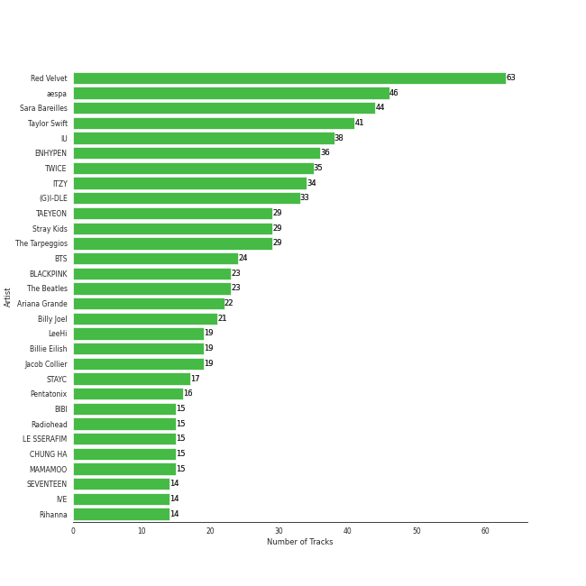
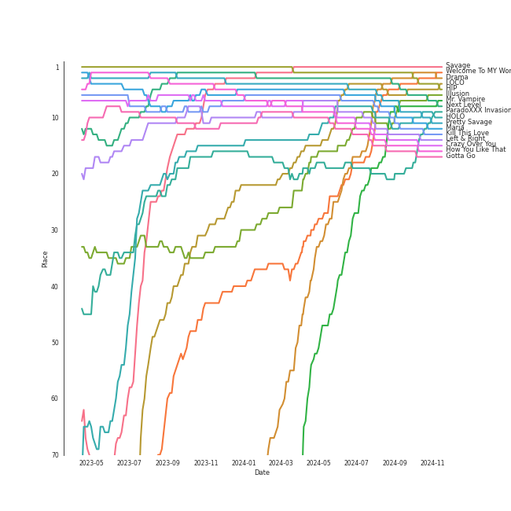

# Liked Tracks

2005 tracks

[See Track Features](audio_features.md)

[See Clusters](clusters/overview.md)

## Top Artists

| Art | Tracks | 💚 | Artist | 🔗 |
|:---|---:|---:|:---|:---|
|  | 60 | 60 | [Red Velvet](../../artists/red_velvet/overview.md) | [🔗](https://open.spotify.com/artist/1z4g3DjTBBZKhvAroFlhOM) |
|  | 44 | 44 | [Sara Bareilles](../../artists/sara_bareilles/overview.md) | [🔗](https://open.spotify.com/artist/2Sqr0DXoaYABbjBo9HaMkM) |
|  | 41 | 41 | [Taylor Swift](../../artists/taylor_swift/overview.md) | [🔗](https://open.spotify.com/artist/06HL4z0CvFAxyc27GXpf02) |
|  | 38 | 38 | [IU](../../artists/iu/overview.md) | [🔗](https://open.spotify.com/artist/3HqSLMAZ3g3d5poNaI7GOU) |
|  | 37 | 37 | [aespa](../../artists/aespa/overview.md) | [🔗](https://open.spotify.com/artist/6YVMFz59CuY7ngCxTxjpxE) |
|  | 35 | 35 | [TWICE](../../artists/twice/overview.md) | [🔗](https://open.spotify.com/artist/7n2Ycct7Beij7Dj7meI4X0) |
|  | 31 | 31 | [ENHYPEN](../../artists/enhypen/overview.md) | [🔗](https://open.spotify.com/artist/5t5FqBwTcgKTaWmfEbwQY9) |
|  | 31 | 31 | [(G)I-DLE](../../artists/(g)i-dle/overview.md) | [🔗](https://open.spotify.com/artist/2AfmfGFbe0A0WsTYm0SDTx) |
|  | 30 | 30 | [ITZY](../../artists/itzy/overview.md) | [🔗](https://open.spotify.com/artist/2KC9Qb60EaY0kW4eH68vr3) |
|  | 29 | 29 | [The Tarpeggios](../../artists/the_tarpeggios/overview.md) | [🔗](https://open.spotify.com/artist/2HXd5pFHJyaQJr5aXfErrE) |

See top 100 artists

| Art | Tracks | 💚 | Artist | 🔗 |
|:---|---:|---:|:---|:---|
|  | 26 | 26 | [TAEYEON](../../artists/taeyeon/overview.md) | [🔗](https://open.spotify.com/artist/3qNVuliS40BLgXGxhdBdqu) |
|  | 26 | 26 | [Stray Kids](../../artists/stray_kids/overview.md) | [🔗](https://open.spotify.com/artist/2dIgFjalVxs4ThymZ67YCE) |
|  | 24 | 24 | [BTS](../../artists/bts/overview.md) | [🔗](https://open.spotify.com/artist/3Nrfpe0tUJi4K4DXYWgMUX) |
|  | 23 | 23 | [BLACKPINK](../../artists/blackpink/overview.md) | [🔗](https://open.spotify.com/artist/41MozSoPIsD1dJM0CLPjZF) |
|  | 23 | 23 | [The Beatles](../../artists/the_beatles/overview.md) | [🔗](https://open.spotify.com/artist/3WrFJ7ztbogyGnTHbHJFl2) |
|  | 21 | 21 | [Billy Joel](../../artists/billy_joel/overview.md) | [🔗](https://open.spotify.com/artist/6zFYqv1mOsgBRQbae3JJ9e) |
|  | 21 | 21 | [Ariana Grande](../../artists/ariana_grande/overview.md) | [🔗](https://open.spotify.com/artist/66CXWjxzNUsdJxJ2JdwvnR) |
|  | 20 | 20 | [Jacob Collier](../../artists/jacob_collier/overview.md) | [🔗](https://open.spotify.com/artist/0QWrMNukfcVOmgEU0FEDyD) |
|  | 19 | 19 | [LeeHi](../../artists/leehi/overview.md) | [🔗](https://open.spotify.com/artist/7cVZApDoQZpS447nHTsNqu) |
|  | 16 | 16 | [CHUNG HA](../../artists/chung_ha/overview.md) | [🔗](https://open.spotify.com/artist/2PSJ6YriU7JsFucxACpU7Y) |
|  | 16 | 16 | [Pentatonix](../../artists/pentatonix/overview.md) | [🔗](https://open.spotify.com/artist/26AHtbjWKiwYzsoGoUZq53) |
|  | 15 | 15 | [BIBI](../../artists/bibi/overview.md) | [🔗](https://open.spotify.com/artist/6UbmqUEgjLA6jAcXwbM1Z9) |
|  | 15 | 15 | [Radiohead](../../artists/radiohead/overview.md) | [🔗](https://open.spotify.com/artist/4Z8W4fKeB5YxbusRsdQVPb) |
|  | 15 | 15 | [MAMAMOO](../../artists/mamamoo/overview.md) | [🔗](https://open.spotify.com/artist/0XATRDCYuuGhk0oE7C0o5G) |
|  | 14 | 14 | [SEVENTEEN](../../artists/seventeen/overview.md) | [🔗](https://open.spotify.com/artist/7nqOGRxlXj7N2JYbgNEjYH) |
|  | 14 | 14 | [Billie Eilish](../../artists/billie_eilish/overview.md) | [🔗](https://open.spotify.com/artist/6qqNVTkY8uBg9cP3Jd7DAH) |
|  | 14 | 14 | [IVE](../../artists/ive/overview.md) | [🔗](https://open.spotify.com/artist/6RHTUrRF63xao58xh9FXYJ) |
|  | 14 | 14 | [Rihanna](../../artists/rihanna/overview.md) | [🔗](https://open.spotify.com/artist/5pKCCKE2ajJHZ9KAiaK11H) |
|  | 14 | 14 | [LE SSERAFIM](../../artists/le_sserafim/overview.md) | [🔗](https://open.spotify.com/artist/4SpbR6yFEvexJuaBpgAU5p) |
|  | 14 | 14 | [Florence + The Machine](../../artists/florence_+_the_machine/overview.md) | [🔗](https://open.spotify.com/artist/1moxjboGR7GNWYIMWsRjgG) |
|  | 13 | 13 | [WENDY](../../artists/wendy/overview.md) | [🔗](https://open.spotify.com/artist/0FRUZvZNPzM3YJMABJxf2K) |
|  | 13 | 13 | [STAYC](../../artists/stayc/overview.md) | [🔗](https://open.spotify.com/artist/01XYiBYaoMJcNhPokrg0l0) |
|  | 12 | 12 | [Dreamcatcher](../../artists/dreamcatcher/overview.md) | [🔗](https://open.spotify.com/artist/5V1qsQHdXNm4ZEZHWvFnqQ) |
|  | 12 | 12 | [Bruno Mars](../../artists/bruno_mars/overview.md) | [🔗](https://open.spotify.com/artist/0du5cEVh5yTK9QJze8zA0C) |
|  | 12 | 12 | [Girls' Generation](../../artists/girls__generation/overview.md) | [🔗](https://open.spotify.com/artist/0Sadg1vgvaPqGTOjxu0N6c) |
|  | 11 | 11 | [Beyoncé](../../artists/beyoncé/overview.md) | [🔗](https://open.spotify.com/artist/6vWDO969PvNqNYHIOW5v0m) |
|  | 11 | 11 | [Kimbra](../../artists/kimbra/overview.md) | [🔗](https://open.spotify.com/artist/6hk7Yq1DU9QcCCrz9uc0Ti) |
|  | 11 | 11 | [AKMU](../../artists/akmu/overview.md) | [🔗](https://open.spotify.com/artist/6OwKE9Ez6ALxpTaKcT5ayv) |
|  | 11 | 11 | [SUNMI](../../artists/sunmi/overview.md) | [🔗](https://open.spotify.com/artist/6MoXcK2GyGg7FIyxPU5yW6) |
|  | 11 | 11 | [NewJeans](../../artists/newjeans/overview.md) | [🔗](https://open.spotify.com/artist/6HvZYsbFfjnjFrWF950C9d) |
|  | 11 | 11 | [Billlie](../../artists/billlie/overview.md) | [🔗](https://open.spotify.com/artist/2GQxKDojobwBjZMPf7aoh0) |
|  | 11 | 11 | [Queen](../../artists/queen/overview.md) | [🔗](https://open.spotify.com/artist/1dfeR4HaWDbWqFHLkxsg1d) |
|  | 10 | 10 | [NCT 127](../../artists/nct_127/overview.md) | [🔗](https://open.spotify.com/artist/7f4ignuCJhLXfZ9giKT7rH) |
|  | 10 | 10 | [BAEKHYUN](../../artists/baekhyun/overview.md) | [🔗](https://open.spotify.com/artist/4ufh0WuMZh6y4Dmdnklvdl) |
|  | 10 | 10 | [EVERGLOW](../../artists/everglow/overview.md) | [🔗](https://open.spotify.com/artist/3ZZzT0naD25RhY2uZvIKkJ) |
|  | 10 | 10 | [NMIXX](../../artists/nmixx/overview.md) | [🔗](https://open.spotify.com/artist/28ot3wh4oNmoFOdVajibBl) |
|  | 10 | 10 | [NCT DREAM](../../artists/nct_dream/overview.md) | [🔗](https://open.spotify.com/artist/1gBUSTR3TyDdTVFIaQnc02) |
|  | 10 | 10 | [Lana Del Rey](../../artists/lana_del_rey/overview.md) | [🔗](https://open.spotify.com/artist/00FQb4jTyendYWaN8pK0wa) |
|  | 9 | 9 | [JEON SOYEON](../../artists/jeon_soyeon/overview.md) | [🔗](https://open.spotify.com/artist/6Xg22wJOAcnvPUfk5WvODH) |
|  | 9 | 9 | [Doja Cat](../../artists/doja_cat/overview.md) | [🔗](https://open.spotify.com/artist/5cj0lLjcoR7YOSnhnX0Po5) |
|  | 9 | 9 | [Sia](../../artists/sia/overview.md) | [🔗](https://open.spotify.com/artist/5WUlDfRSoLAfcVSX1WnrxN) |
|  | 9 | 9 | [BoA](../../artists/boa/overview.md) | [🔗](https://open.spotify.com/artist/4muJrGMndyYWqZtfk8OWy4) |
|  | 9 | 9 | [Lady Gaga](../../artists/lady_gaga/overview.md) | [🔗](https://open.spotify.com/artist/1HY2Jd0NmPuamShAr6KMms) |
|  | 8 | 8 | [Janelle Monáe](../../artists/janelle_monáe/overview.md) | [🔗](https://open.spotify.com/artist/6ueGR6SWhUJfvEhqkvMsVs) |
|  | 8 | 8 | [Dua Lipa](../../artists/dua_lipa/overview.md) | [🔗](https://open.spotify.com/artist/6M2wZ9GZgrQXHCFfjv46we) |
|  | 8 | 8 | [YOASOBI](../../artists/yoasobi/overview.md) | [🔗](https://open.spotify.com/artist/64tJ2EAv1R6UaZqc4iOCyj) |
|  | 8 | 8 | [HEIZE](../../artists/heize/overview.md) | [🔗](https://open.spotify.com/artist/5dCvSnVduaFleCnyy98JMo) |
|  | 8 | 8 | [NCT U](../../artists/nct_u/overview.md) | [🔗](https://open.spotify.com/artist/3paGCCtX1Xr4Gx53mSeZuQ) |
|  | 8 | 8 | [EXO](../../artists/exo/overview.md) | [🔗](https://open.spotify.com/artist/3cjEqqelV9zb4BYE3qDQ4O) |
|  | 8 | 8 | [Kendrick Lamar](../../artists/kendrick_lamar/overview.md) | [🔗](https://open.spotify.com/artist/2YZyLoL8N0Wb9xBt1NhZWg) |
|  | 8 | 8 | [PENTAGON](../../artists/pentagon/overview.md) | [🔗](https://open.spotify.com/artist/1wKpMkucynaTfG8lyPprYV) |
|  | 7 | 7 | [HWASA](../../artists/hwasa/overview.md) | [🔗](https://open.spotify.com/artist/7bmYpVgQub656uNTu6qGNQ) |
|  | 7 | 7 | [GOT the beat](../../artists/got_the_beat/overview.md) | [🔗](https://open.spotify.com/artist/6uNxlIP5lzPFf0BHuELOuX) |
|  | 7 | 7 | [Imogen Heap](../../artists/imogen_heap/overview.md) | [🔗](https://open.spotify.com/artist/6Xb4ezwoAQC4516kI89nWz) |
|  | 7 | 7 | [BABYMETAL](../../artists/babymetal/overview.md) | [🔗](https://open.spotify.com/artist/630wzNP2OL7fl4Xl0GnMWq) |
|  | 7 | 7 | [PURPLE KISS](../../artists/purple_kiss/overview.md) | [🔗](https://open.spotify.com/artist/62T5PGHWJ9sxP2SJq20IHq) |
|  | 7 | 7 | [Camila Cabello](../../artists/camila_cabello/overview.md) | [🔗](https://open.spotify.com/artist/4nDoRrQiYLoBzwC5BhVJzF) |
|  | 7 | 7 | [KISS OF LIFE](../../artists/kiss_of_life/overview.md) | [🔗](https://open.spotify.com/artist/4TEK9tIkcoxib4GxT3O4ky) |
|  | 7 | 7 | [TOMORROW X TOGETHER](../../artists/tomorrow_x_together/overview.md) | [🔗](https://open.spotify.com/artist/0ghlgldX5Dd6720Q3qFyQB) |
|  | 6 | 6 | [TVXQ!](../../artists/tvxq!/overview.md) | [🔗](https://open.spotify.com/artist/6nVMMEywS5Y4tsHPKx1nIo) |
|  | 6 | 6 | [WJSN](../../artists/wjsn/overview.md) | [🔗](https://open.spotify.com/artist/6hhqsQZhtp9hfaZhSd0VSD) |
|  | 6 | 6 | [SUPER JUNIOR](../../artists/super_junior/overview.md) | [🔗](https://open.spotify.com/artist/6gzXCdfYfFe5XKhPKkYqxV) |
|  | 6 | 6 | [ATEEZ](../../artists/ateez/overview.md) | [🔗](https://open.spotify.com/artist/68KmkJeZGfwe1OUaivBa2L) |
|  | 6 | 6 | [The Who](../../artists/the_who/overview.md) | [🔗](https://open.spotify.com/artist/67ea9eGLXYMsO2eYQRui3w) |
|  | 6 | 6 | [Solar](../../artists/solar/overview.md) | [🔗](https://open.spotify.com/artist/5cYcI546S8Lf97m4mNdYLD) |
|  | 6 | 6 | [Gain](../../artists/gain/overview.md) | [🔗](https://open.spotify.com/artist/4R60A85t9mTZzCqJlVswuo) |
|  | 6 | 6 | [WINTER](../../artists/winter/overview.md) | [🔗](https://open.spotify.com/artist/3mPquBmMu97Iq9TpzQ6ayI) |
|  | 6 | 6 | [TREASURE](../../artists/treasure/overview.md) | [🔗](https://open.spotify.com/artist/3KonOYiLsU53m4yT7gNotP) |
|  | 6 | 6 | [P1Harmony](../../artists/p1harmony/overview.md) | [🔗](https://open.spotify.com/artist/3JjvsPeGMbDJqsphe2z8xU) |
|  | 6 | 6 | [SHINee](../../artists/shinee/overview.md) | [🔗](https://open.spotify.com/artist/2hRQKC0gqlZGPrmUKbcchR) |
|  | 6 | 6 | [YUQI](../../artists/yuqi/overview.md) | [🔗](https://open.spotify.com/artist/22aCD8IrQZjcPgZw728QT6) |
|  | 6 | 6 | [OH MY GIRL](../../artists/oh_my_girl/overview.md) | [🔗](https://open.spotify.com/artist/2019zR22qK2RBvCqtudBaI) |
|  | 6 | 6 | [Jackson Wang](../../artists/jackson_wang/overview.md) | [🔗](https://open.spotify.com/artist/1kfWoWgCugPkyxQP8lkRlY) |
|  | 6 | 6 | [j-hope](../../artists/j-hope/overview.md) | [🔗](https://open.spotify.com/artist/0b1sIQumIAsNbqAoIClSpy) |
|  | 6 | 6 | [Jason Derulo](../../artists/jason_derulo/overview.md) | [🔗](https://open.spotify.com/artist/07YZf4WDAMNwqr4jfgOZ8y) |
|  | 5 | 5 | [Eminem](../../artists/eminem/overview.md) | [🔗](https://open.spotify.com/artist/7dGJo4pcD2V6oG8kP0tJRR) |
|  | 5 | 5 | [VIVIZ](../../artists/viviz/overview.md) | [🔗](https://open.spotify.com/artist/7Lq3yAtwi0Z7zpxEwbQQNZ) |
|  | 5 | 5 | [Simon & Garfunkel](../../artists/simon___garfunkel/overview.md) | [🔗](https://open.spotify.com/artist/70cRZdQywnSFp9pnc2WTCE) |
|  | 5 | 5 | [Crush](../../artists/crush/overview.md) | [🔗](https://open.spotify.com/artist/6aLdhHUqgdKE86xbtNmY8g) |
|  | 5 | 5 | [CLC](../../artists/clc/overview.md) | [🔗](https://open.spotify.com/artist/6QyO41KctzGc70mVaVnXQO) |
|  | 5 | 5 | [Clean Bandit](../../artists/clean_bandit/overview.md) | [🔗](https://open.spotify.com/artist/6MDME20pz9RveH9rEXvrOM) |
|  | 5 | 5 | [The Rose](../../artists/the_rose/overview.md) | [🔗](https://open.spotify.com/artist/5na1LmEmK2VzNLje9snJYW) |
|  | 5 | 5 | [Joni Mitchell](../../artists/joni_mitchell/overview.md) | [🔗](https://open.spotify.com/artist/5hW4L92KnC6dX9t7tYM4Ve) |
|  | 5 | 5 | [The 8-Bit Big Band](../../artists/the_8-bit_big_band/overview.md) | [🔗](https://open.spotify.com/artist/5d1sgs6DwqUcHqQsvwStt2) |
|  | 5 | 5 | [Agust D](../../artists/agust_d/overview.md) | [🔗](https://open.spotify.com/artist/5RmQ8k4l3HZ8JoPb4mNsML) |
|  | 5 | 5 | [MOMOLAND](../../artists/momoland/overview.md) | [🔗](https://open.spotify.com/artist/5RR0MLwcjc87wjSw2JYdwx) |
|  | 5 | 5 | [LOONA](../../artists/loona/overview.md) | [🔗](https://open.spotify.com/artist/52zMTJCKluDlFwMQWmccY7) |
|  | 5 | 5 | [Daft Punk](../../artists/daft_punk/overview.md) | [🔗](https://open.spotify.com/artist/4tZwfgrHOc3mvqYlEYSvVi) |
|  | 5 | 5 | [Coldplay](../../artists/coldplay/overview.md) | [🔗](https://open.spotify.com/artist/4gzpq5DPGxSnKTe4SA8HAU) |
|  | 5 | 5 | [Adele](../../artists/adele/overview.md) | [🔗](https://open.spotify.com/artist/4dpARuHxo51G3z768sgnrY) |

## Top Tracks

Most and least listened tracks

| ​ | Most listened tracks | Rank | ​​ | Least listened tracks | Rank |
|:---|:---|---:|:---|:---|---:|
|  | [Savage](../../artists/aespa/overview.md) | 1 |  | [Sorry](../../artists/the_rose/overview.md) | 851 |
|  | [HIP](../../artists/mamamoo/overview.md) | 2 |  | [Big Girls Cry](../../artists/sia/overview.md) | 851 |
|  | [Next Level](../../artists/aespa/overview.md) | 3 |  | Hello Good Morning | 851 |
|  | [LOCO](../../artists/itzy/overview.md) | 4 |  | DIE 4 YOU | 851 |
|  | [Pretty Savage](../../artists/blackpink/overview.md) | 5 |  | [One Last Time](../../artists/ariana_grande/overview.md) | 851 |
|  | [Maria](../../artists/hwasa/overview.md) | 6 |  | Low Key (feat. Tyga) | 851 |
|  | [Kill This Love](../../artists/blackpink/overview.md) | 7 |  | Love Sex Magic (feat. Justin Timberlake) | 851 |
|  | [HOLO](../../artists/leehi/overview.md) | 8 |  | [New Jeans](../../artists/newjeans/overview.md) | 851 |
|  | [Left & Right](../../artists/seventeen/overview.md) | 9 |  | [So Long, London](../../artists/taylor_swift/overview.md) | 851 |
|  | [Crazy Over You](../../artists/blackpink/overview.md) | 10 |  | Cold as Ice | 851 |

## Top Albums

| Art | Tracks | 💚 | Album | Release Date | 🔗 |
|:---|---:|---:|:---|:---|:---|
|  | 12 | 12 | The Blessed Unrest | 2013-07-16 | [🔗](https://open.spotify.com/album/7lpbyGc4fHsQkBTsfWVBhp) |
|  | 10 | 10 | Kaleidoscope Heart | 2010-09-07 | [🔗](https://open.spotify.com/album/627ukPRwYxyBREHxBq0vGJ) |
|  | 9 | 9 | reputation | 2017-11-10 | [🔗](https://open.spotify.com/album/6DEjYFkNZh67HP7R9PSZvv) |
|  | 8 | 8 | Little Voice | 2007-07-03 | [🔗](https://open.spotify.com/album/2Z9WUERfMjOgQ6ze9TcGbF) |
|  | 8 | 8 | Armageddon - The 1st Album | 2024-05-27 | [🔗](https://open.spotify.com/album/058hCti9Bupb5CJc6bd3VB) |
|  | 7 | 7 | Vows (Deluxe Version) | 2011 | [🔗](https://open.spotify.com/album/6V9rvW05Um5bIHePPfeI8p) |
|  | 7 | 7 | The Teal Album | 2016-11-12 | [🔗](https://open.spotify.com/album/7mTQ62MIYHSbkZHGjY0Ftg) |
|  | 7 | 7 | The Stranger (Legacy Edition) | 1977 | [🔗](https://open.spotify.com/album/1Mhn9VosyjtWn4dMPFlna6) |
|  | 7 | 7 | Querencia | 2021-02-15 | [🔗](https://open.spotify.com/album/1p2OBhqq0d1N8awjHV9xA3) |
|  | 7 | 7 | BORN PINK | 2022-09-16 | [🔗](https://open.spotify.com/album/7jaSNQUBJbvfbZHLNFrV7P) |

See top 100 albums

| Art | Tracks | 💚 | Album | Release Date | 🔗 |
|:---|---:|---:|:---|:---|:---|
|  | 7 | 7 | 1989 | 2014-10-27 | [🔗](https://open.spotify.com/album/2QJmrSgbdM35R67eoGQo4j) |
|  | 6 | 6 | folklore | 2020-07-24 | [🔗](https://open.spotify.com/album/2fenSS68JI1h4Fo296JfGr) |
|  | 6 | 6 | THE ALBUM | 2020-10-02 | [🔗](https://open.spotify.com/album/71O60S5gIJSIAhdnrDIh3N) |
|  | 6 | 6 | Stamp On It - The 1st Mini Album | 2023-01-16 | [🔗](https://open.spotify.com/album/2Gxd1fr4RFHVNx6IxGr9I7) |
|  | 6 | 6 | Perfect Velvet - The 2nd Album | 2017-11-17 | [🔗](https://open.spotify.com/album/0rvrbZvaDX5S9ZBhwOwFfH) |
|  | 6 | 6 | OK Computer | 1997-05-28 | [🔗](https://open.spotify.com/album/6dVIqQ8qmQ5GBnJ9shOYGE) |
|  | 6 | 6 | Lungs (Deluxe Edition) | 2009 | [🔗](https://open.spotify.com/album/2FgknX5e7fJlriQtxvpLhZ) |
|  | 6 | 6 | Lover | 2019-08-23 | [🔗](https://open.spotify.com/album/1NAmidJlEaVgA3MpcPFYGq) |
|  | 6 | 6 | INVU - The 3rd Album | 2022-02-14 | [🔗](https://open.spotify.com/album/7i2YLTVQ0dyngRuUqtGmr9) |
|  | 6 | 6 | Formula of Love: O+T=<3 | 2021-11-12 | [🔗](https://open.spotify.com/album/5052Ip89wdW8EGdpjEpNeq) |
|  | 6 | 6 | Chill Kill - The 3rd Album | 2023-11-13 | [🔗](https://open.spotify.com/album/4UUICitfodUVCNhzmDFbrO) |
|  | 6 | 6 | Ceremonials (Deluxe Edition) | 2011-01-01 | [🔗](https://open.spotify.com/album/5SxudoALxEAVh9l83kSebx) |
|  | 6 | 6 | Carolina State of Mind | 2013-11-15 | [🔗](https://open.spotify.com/album/3zKusinRVxdC5s2wOPYBgX) |
|  | 6 | 6 | Born To Die | 2012-01-30 | [🔗](https://open.spotify.com/album/4X8hAqIWpQyQks2yRhyqs4) |
|  | 6 | 6 | Amidst the Chaos (Bonus Version) | 2019-05-10 | [🔗](https://open.spotify.com/album/5x2sDapUIdq0qk1ezff3gm) |
|  | 6 | 6 | Abbey Road (Remastered) | 1969-09-26 | [🔗](https://open.spotify.com/album/0ETFjACtuP2ADo6LFhL6HN) |
|  | 6 | 6 | 4 ONLY | 2021-09-09 | [🔗](https://open.spotify.com/album/1DKgZeAYrjslAPZVMe6EFt) |
|  | 5 | 5 | ‘The ReVe Festival’ Finale | 2019-12-23 | [🔗](https://open.spotify.com/album/3rVtm00UfbuzWOewdm4iYM) |
|  | 5 | 5 | ‘The ReVe Festival 2022 - Feel My Rhythm’ | 2022-03-21 | [🔗](https://open.spotify.com/album/3HgoCO9wWuPcNhz8Ip4C46) |
|  | 5 | 5 | Windy | 2021-07-05 | [🔗](https://open.spotify.com/album/1lv92CIVZbB2BsHmIx7qJf) |
|  | 5 | 5 | WHEN WE ALL FALL ASLEEP, WHERE DO WE GO? | 2019-03-29 | [🔗](https://open.spotify.com/album/0S0KGZnfBGSIssfF54WSJh) |
|  | 5 | 5 | Twenty-Five Twenty-One OST | 2022-04-03 | [🔗](https://open.spotify.com/album/77NPr874WU941XZhjO43dR) |
|  | 5 | 5 | The Red - The 1st Album | 2015-09-09 | [🔗](https://open.spotify.com/album/6YL9J0E6PGtYzkhyMxnmXd) |
|  | 5 | 5 | The Beatles (Remastered) | 1968-11-22 | [🔗](https://open.spotify.com/album/1klALx0u4AavZNEvC4LrTL) |
|  | 5 | 5 | Savage - The 1st Mini Album | 2021-10-05 | [🔗](https://open.spotify.com/album/3vyyDkvYWC36DwgZCYd3Wu) |
|  | 5 | 5 | READY TO BE | 2023-03-10 | [🔗](https://open.spotify.com/album/7hzP5i7StxYG4StECA0rrJ) |
|  | 5 | 5 | Once Upon Another Time | 2012-05-22 | [🔗](https://open.spotify.com/album/1PrqYZJRzGNf8AsSOraxnZ) |
|  | 5 | 5 | Modern Times | 2013-10-08 | [🔗](https://open.spotify.com/album/2QcuXvQBWv1ZKyQtEhLbFe) |
|  | 5 | 5 | Midnights | 2022-10-21 | [🔗](https://open.spotify.com/album/151w1FgRZfnKZA9FEcg9Z3) |
|  | 5 | 5 | MY WORLD - The 3rd Mini Album | 2023-05-08 | [🔗](https://open.spotify.com/album/69xF8jTd0c4Zoo7DT3Rwrn) |
|  | 5 | 5 | Like Water - The 1st Mini Album | 2021-04-05 | [🔗](https://open.spotify.com/album/1Ao5vWPO13f4l0ldwxOKL7) |
|  | 5 | 5 | IU 5th Album 'LILAC' | 2021-03-25 | [🔗](https://open.spotify.com/album/01dPJcwyht77brL4JQiR8R) |
|  | 5 | 5 | I've IVE | 2023-04-10 | [🔗](https://open.spotify.com/album/38VzP4yWfHdHafITKKRHEB) |
|  | 5 | 5 | I NEVER DIE | 2022-03-14 | [🔗](https://open.spotify.com/album/1T2W9vDajFreUuycPDjUXk) |
|  | 5 | 5 | Girls - The 2nd Mini Album | 2022-07-08 | [🔗](https://open.spotify.com/album/4w1dbvUy1crv0knXQvcSeY) |
|  | 5 | 5 | Djesse Vol. 4 | 2024-03-01 | [🔗](https://open.spotify.com/album/13r6eqjYlKELFQlNvVCBz1) |
|  | 5 | 5 | DIMENSION : DILEMMA | 2021-10-12 | [🔗](https://open.spotify.com/album/5jGRqioNCSWZGBl3QmyuFI) |
|  | 5 | 5 | Choose Your Character! | 2019-06-24 | [🔗](https://open.spotify.com/album/2d3PcBi2ID1sLe8ZRTmxIi) |
|  | 5 | 5 | Bloodline | 2024-05-15 | [🔗](https://open.spotify.com/album/5XMETYH0wL2F3qDpWfVKzw) |
|  | 5 | 5 | BORN TO BE | 2024-01-08 | [🔗](https://open.spotify.com/album/3cm3EkNQLpKu58btSJT7fz) |
|  | 5 | 5 | 2 | 2024-01-29 | [🔗](https://open.spotify.com/album/0mC9MXPddkzggVsOXh5gd3) |
|  | 4 | 4 | ‘The ReVe Festival 2022 - Birthday’ | 2022-11-28 | [🔗](https://open.spotify.com/album/58OR7UoaJkJzqeQGClHzh1) |
|  | 4 | 4 | eternal sunshine | 2024-03-08 | [🔗](https://open.spotify.com/album/5EYKrEDnKhhcNxGedaRQeK) |
|  | 4 | 4 | YOUNG-LUV.COM | 2022-02-21 | [🔗](https://open.spotify.com/album/2xPdgNkM4yIQmP7axJ1T1o) |
|  | 4 | 4 | Wish You Hell - The 2nd Mini Album | 2024-03-12 | [🔗](https://open.spotify.com/album/3f8n88uX0tNvA8HTROgSkr) |
|  | 4 | 4 | UNFORGIVEN | 2023-05-01 | [🔗](https://open.spotify.com/album/4Oz7K9DRwwGMN49i4NbVDT) |
|  | 4 | 4 | To. X - The 5th Mini Album | 2023-11-27 | [🔗](https://open.spotify.com/album/0VciVDVU6NoqtQ0WAIlTmD) |
|  | 4 | 4 | Thriller | 1982-11-30 | [🔗](https://open.spotify.com/album/2ANVost0y2y52ema1E9xAZ) |
|  | 4 | 4 | Russian Roulette - The 3rd Mini Album | 2016-09-07 | [🔗](https://open.spotify.com/album/6MNlcai3skKLKv5syzFwC3) |
|  | 4 | 4 | Queendom - The 6th Mini Album | 2021-08-16 | [🔗](https://open.spotify.com/album/6Pe5LGQgU3mmvuRjFMsACV) |
|  | 4 | 4 | Palette | 2017-04-21 | [🔗](https://open.spotify.com/album/5V8n6fqyAPxvFTibPhQVcp) |
|  | 4 | 4 | PTX, Vol. III | 2014-09-23 | [🔗](https://open.spotify.com/album/32y54TelUHSUDWVOx4h1B4) |
|  | 4 | 4 | NewJeans 2nd EP 'Get Up' | 2023-07-21 | [🔗](https://open.spotify.com/album/4N1fROq2oeyLGAlQ1C1j18) |
|  | 4 | 4 | NOEASY | 2021-08-23 | [🔗](https://open.spotify.com/album/558tpdCejjVQNFAumRAeQj) |
|  | 4 | 4 | My Everything (Deluxe) | 2014-08-22 | [🔗](https://open.spotify.com/album/6EVYTRG1drKdO8OnIQBeEj) |
|  | 4 | 4 | Masterpiece | 2023-07-26 | [🔗](https://open.spotify.com/album/3qmO83vO1SsdmP1Y0ljhSQ) |
|  | 4 | 4 | MANIFESTO : DAY 1 | 2022-07-04 | [🔗](https://open.spotify.com/album/5J8MNLLViH5zqM6VoGErz8) |
|  | 4 | 4 | Love poem | 2019-11-18 | [🔗](https://open.spotify.com/album/2xEH7SRzJq7LgA0fCtTlxH) |
|  | 4 | 4 | KILL MY DOUBT | 2023-07-31 | [🔗](https://open.spotify.com/album/6P01cKb7sdwfnNpuMLNEik) |
|  | 4 | 4 | In My Room | 2016-07-01 | [🔗](https://open.spotify.com/album/70N5l7CBZmAMCh1WfnM6in) |
|  | 4 | 4 | IVE SWITCH | 2024-04-29 | [🔗](https://open.spotify.com/album/7z61DsZtWO2S4nC5xd0b9p) |
|  | 4 | 4 | I love | 2022-10-17 | [🔗](https://open.spotify.com/album/2Hyuin3i1cSZ1FlQFeCPZH) |
|  | 4 | 4 | Homeward | 2022-04-08 | [🔗](https://open.spotify.com/album/2FiDSelqVoi7VQfpmaMRJK) |
|  | 4 | 4 | E-SIDE 3 | 2024-04-12 | [🔗](https://open.spotify.com/album/2HBkR5qNDKoo1EDrCaSy0U) |
|  | 4 | 4 | Drama - The 4th Mini Album | 2023-11-10 | [🔗](https://open.spotify.com/album/5NMtxQJy4wq3mpo3ERVnLs) |
|  | 4 | 4 | Djesse Vol. 3 | 2020-08-14 | [🔗](https://open.spotify.com/album/33cj3kzLqVOg9zvy69Wrc8) |
|  | 4 | 4 | DARK MOON SPECIAL ALBUM <MEMORABILIA> | 2024-05-13 | [🔗](https://open.spotify.com/album/0OhJwEzXbK9Km6GQSPdmPU) |
|  | 4 | 4 | DARK BLOOD | 2023-05-22 | [🔗](https://open.spotify.com/album/7q65W5gVANjh1j1KXLeU0f) |
|  | 4 | 4 | 1000 Forms Of Fear (Deluxe Version) | 2015-05-04 | [🔗](https://open.spotify.com/album/6FdNvoO5sF4EKwCX9je1MH) |
|  | 3 | 3 | ‘The ReVe Festival’ Day 1 | 2019-06-19 | [🔗](https://open.spotify.com/album/2nLEiP268mSFZHW5dajM4R) |
|  | 3 | 3 | the collective soul and unconscious: chapter one | 2022-02-23 | [🔗](https://open.spotify.com/album/4ophrgcnwWi1I5nWYImyhw) |
|  | 3 | 3 | the Billage of perception: chapter three | 2023-03-28 | [🔗](https://open.spotify.com/album/5bt0sTLia4il2rIlpqUo5g) |
|  | 3 | 3 | the Billage of perception : chapter one | 2021-11-10 | [🔗](https://open.spotify.com/album/1kp4txZsSpDNR4EoDFi2LD) |
|  | 3 | 3 | thank u, next | 2019-02-08 | [🔗](https://open.spotify.com/album/2fYhqwDWXjbpjaIJPEfKFw) |
|  | 3 | 3 | expérgo | 2023-03-20 | [🔗](https://open.spotify.com/album/6GbCvETnCVvkpvK6qCqTYS) |
|  | 3 | 3 | ZONE | 2023-08-18 | [🔗](https://open.spotify.com/album/1GIkapvyAw5lwdNw66hI44) |
|  | 3 | 3 | YUQ1 | 2024-04-23 | [🔗](https://open.spotify.com/album/7LYc8ngbhwha4aGJ5kVauc) |
|  | 3 | 3 | With YOU-th | 2024-02-23 | [🔗](https://open.spotify.com/album/575TQDOQqc0MAheeEeKWUR) |
|  | 3 | 3 | Unapologetic (Deluxe) | 2012-12-11 | [🔗](https://open.spotify.com/album/4eddbruVtOqw8khwxSH6H2) |
|  | 3 | 3 | This Is Acting (Deluxe Version) | 2016-10-21 | [🔗](https://open.spotify.com/album/2eV6DIPDnGl1idcjww6xyX) |
|  | 3 | 3 | The Winning | 2024-02-20 | [🔗](https://open.spotify.com/album/08CvAj58nVMpq1Nw7T6maj) |
|  | 3 | 3 | The Game (Deluxe Remastered Version) | 1980-06-27 | [🔗](https://open.spotify.com/album/6wPXUmYJ9mOWrKlLzZ5cCa) |
|  | 3 | 3 | The Bends | 1995-03-13 | [🔗](https://open.spotify.com/album/35UJLpClj5EDrhpNIi4DFg) |
|  | 3 | 3 | Teenage Dream | 2010-01-01 | [🔗](https://open.spotify.com/album/3BoUxfC7YhxNq3TpOfnRif) |
|  | 3 | 3 | Taste of Love | 2021-06-11 | [🔗](https://open.spotify.com/album/00vb6sViDbJLmLLchfbRh4) |
|  | 3 | 3 | TEN - The 1st Mini Album | 2024-02-13 | [🔗](https://open.spotify.com/album/50Zo1vf3YCQtXLUZr2oBiQ) |
|  | 3 | 3 | TEENFRESH | 2023-08-16 | [🔗](https://open.spotify.com/album/4P5wnRQTBnnjNbjt7A6S6x) |
|  | 3 | 3 | Speak for Yourself | 2005-07-18 | [🔗](https://open.spotify.com/album/0t0Cr8jA63wlm8nWj7qfvJ) |
|  | 3 | 3 | Songs About Jane | 2002-06-25 | [🔗](https://open.spotify.com/album/1Rv9WRKyYhFaGbuYDaQunN) |
|  | 3 | 3 | SKZ-REPLAY | 2022-12-21 | [🔗](https://open.spotify.com/album/3UXrliH0JUQvcaLnBD8Txz) |

## Top Record Labels

| Tracks | 💚 | Label |
|---:|---:|:---|
| 264 | 264 | [SM Entertainment](../../labels/sm_entertainment/overview.md) |
| 125 | 125 | [Republic Records](../../labels/republic_records/overview.md) |
| 78 | 78 | [Genie Music Corporation](../../labels/genie_music_corporation/overview.md) |
| 71 | 71 | [Columbia](../../labels/columbia/overview.md) |
| 70 | 70 | [YG Entertainment](../../labels/yg_entertainment/overview.md) |
| 70 | 70 | [Epic](../../labels/epic/overview.md) |
| 64 | 64 | [Warner Records](../../labels/warner_records/overview.md) |
| 62 | 62 | [Stone Music Entertainment](../../labels/stone_music_entertainment/overview.md) |
| 62 | 62 | [Interscope Records](../../labels/interscope_records/overview.md) |
| 55 | 55 | [RCA Records Label](../../labels/rca_records_label/overview.md) |

See top 100 labels

| Tracks | 💚 | Label |
|---:|---:|:---|
| 49 | 49 | [Universal Music LLC](../../labels/universal_music_llc/overview.md) |
| 41 | 41 | [BIGHIT MUSIC](../../labels/bighit_music/overview.md) |
| 37 | 37 | [CUBE ENTERTAINMENT](../../labels/cube_entertainment/overview.md) |
| 34 | 34 | [RBW Inc.](../../labels/rbw_inc_/overview.md) |
| 33 | 33 | [Atlantic Records](../../labels/atlantic_records/overview.md) |
| 30 | 30 | [BELIFT LAB](../../labels/belift_lab/overview.md) |
| 29 | 29 | [Starship Entertainment](../../labels/starship_entertainment/overview.md) |
| 22 | 22 | [The Tarpeggios](../../labels/the_tarpeggios/overview.md) |
| 22 | 22 | [Taylor Swift](../../labels/taylor_swift/overview.md) |
| 22 | 22 | [EMI Catalogue](../../labels/emi_catalogue/overview.md) |
| 21 | 21 | [Kakao Entertainment](../../labels/kakao_entertainment/overview.md) |
| 19 | 19 | [XL Recordings](../../labels/xl_recordings/overview.md) |
| 19 | 19 | [SOURCE MUSIC](../../labels/source_music/overview.md) |
| 19 | 19 | [Big Machine Records](../../labels/big_machine_records/overview.md) |
| 18 | 18 | [Polydor Records](../../labels/polydor_records/overview.md) |
| 17 | 17 | [PLEDIS Entertainment](../../labels/pledis_entertainment/overview.md) |
| 16 | 16 | [Universal-Island Records Ltd.](../../labels/universal-island_records_ltd_/overview.md) |
| 16 | 16 | [Rhino](../../labels/rhino/overview.md) |
| 16 | 16 | [Decca (UMO)](../../labels/decca_(umo)/overview.md) |
| 14 | 14 | [Legacy](../../labels/legacy/overview.md) |
| 14 | 14 | [Darkroom](../../labels/darkroom/overview.md) |
| 14 | 14 | [88rising Music](../../labels/88rising_music/overview.md) |
| 13 | 13 | [Capitol Records](../../labels/capitol_records/overview.md) |
| 12 | 12 | [MYSTIC STORY](../../labels/mystic_story/overview.md) |
| 12 | 12 | [Hollywood Records](../../labels/hollywood_records/overview.md) |
| 12 | 12 | [High Up Entertainment](../../labels/high_up_entertainment/overview.md) |
| 12 | 12 | [Def Jam Recordings](../../labels/def_jam_recordings/overview.md) |
| 11 | 11 | [WM Korea](../../labels/wm_korea/overview.md) |
| 11 | 11 | [Syco Music](../../labels/syco_music/overview.md) |
| 11 | 11 | [Jive](../../labels/jive/overview.md) |
| 11 | 11 | [FNC ENTERTAINMENT](../../labels/fnc_entertainment/overview.md) |
| 11 | 11 | [DREAMCATCHER COMPANY](../../labels/dreamcatcher_company/overview.md) |
| 11 | 11 | [ADOR](../../labels/ador/overview.md) |
| 10 | 10 | [MOTOWN](../../labels/motown/overview.md) |
| 10 | 10 | [MNH ENTERTAINMENT](../../labels/mnh_entertainment/overview.md) |
| 10 | 10 | [EDAM Entertainment](../../labels/edam_entertainment/overview.md) |
| 9 | 9 | [WM Japan](../../labels/wm_japan/overview.md) |
| 9 | 9 | [Bad Boy](../../labels/bad_boy/overview.md) |
| 9 | 9 | [Aftermath](../../labels/aftermath/overview.md) |
| 8 | 8 | [YOASOBI](../../labels/yoasobi/overview.md) |
| 8 | 8 | [Monkey Puzzle](../../labels/monkey_puzzle/overview.md) |
| 8 | 8 | [Geffen](../../labels/geffen/overview.md) |
| 7 | 7 | [WM Entertainment](../../labels/wm_entertainment/overview.md) |
| 7 | 7 | The Unc - Chapel Hill Tarpeggios |
| 7 | 7 | Sire |
| 7 | 7 | [S2 ENTERTAINMENT INC.](../../labels/s2_entertainment_inc_/overview.md) |
| 7 | 7 | Cooking Vinyl Limited |
| 7 | 7 | Abyss Company |
| 6 | 6 | [Virgin Records](../../labels/virgin_records/overview.md) |
| 6 | 6 | [UNI](../../labels/uni/overview.md) |
| 6 | 6 | Kemosabe Records |
| 6 | 6 | [JYP Entertainment](../../labels/jyp_entertainment/overview.md) |
| 6 | 6 | [Fueled By Ramen](../../labels/fueled_by_ramen/overview.md) |
| 6 | 6 | Fave Entertainment |
| 5 | 5 | Wondaland |
| 5 | 5 | The 8-Bit Big Band |
| 5 | 5 | Studio MaumC |
| 5 | 5 | [Sony Music Labels Inc.](../../labels/sony_music_labels_inc_/overview.md) |
| 5 | 5 | [Reprise](../../labels/reprise/overview.md) |
| 5 | 5 | [Parlophone UK](../../labels/parlophone_uk/overview.md) |
| 5 | 5 | Parkwood Entertainment |
| 5 | 5 | Olivia Rodrigo PS |
| 5 | 5 | [Nettwerk Music Group](../../labels/nettwerk_music_group/overview.md) |
| 5 | 5 | [KQ Entertainment](../../labels/kq_entertainment/overview.md) |
| 5 | 5 | [Island Records](../../labels/island_records/overview.md) |
| 5 | 5 | Hwa&Dam pictures |
| 5 | 5 | BIGPLANETMADE |
| 5 | 5 | Atlantic Records UK |
| 5 | 5 | Arista |
| 5 | 5 | [143](../../labels/143/overview.md) |
| 4 | 4 | [avex trax](../../labels/avex_trax/overview.md) |
| 4 | 4 | XGALX |
| 4 | 4 | [UMC (Universal Music Catalogue)](../../labels/umc_(universal_music_catalogue)/overview.md) |
| 4 | 4 | Top Dawg Entertainment |
| 4 | 4 | THE BLACK LABEL |
| 4 | 4 | TEAM WANG records |
| 4 | 4 | Sony Music Entertainment |
| 4 | 4 | SWING ENTERTAINMENT |
| 4 | 4 | Riot Games |
| 4 | 4 | Republic Records – NAYEON (TWICE) |
| 4 | 4 | P NATION |
| 4 | 4 | MYSTIC Entertainment |
| 4 | 4 | LaFace Records |
| 4 | 4 | Kakao M Corp. |
| 4 | 4 | Hajanga Records |
| 4 | 4 | FeelGhoodMusic |
| 4 | 4 | Feel Ghood Music |
| 4 | 4 | Elektra |
| 4 | 4 | [EMI](../../labels/emi/overview.md) |
| 4 | 4 | BlockBerryCreative |

## Genres

| Tracks | 💚 | Genre |
|---:|---:|:---|
| 817 | 817 | [k-pop](../../genres/k-pop/overview.md) |
| 435 | 435 | [pop](../../genres/pop/overview.md) |
| 429 | 429 | [k-pop girl group](../../genres/k-pop_girl_group/overview.md) |
| 222 | 222 | [k-pop boy group](../../genres/k-pop_boy_group/overview.md) |
| 143 | 143 | [rock](../../genres/rock/overview.md) |
| 94 | 94 | [classic rock](../../genres/classic_rock/overview.md) |
| 92 | 92 | [dance pop](../../genres/dance_pop/overview.md) |
| 74 | 74 | [neo mellow](../../genres/neo_mellow/overview.md) |
| 61 | 61 | [lilith](../../genres/lilith/overview.md) |
| 59 | 59 | [acoustic pop](../../genres/acoustic_pop/overview.md) |

See top 100 genres

| Tracks | 💚 | Genre |
|---:|---:|:---|
| 51 | 51 | [album rock](../../genres/album_rock/overview.md) |
| 49 | 49 | [soft rock](../../genres/soft_rock/overview.md) |
| 49 | 49 | [pop rock](../../genres/pop_rock/overview.md) |
| 48 | 48 | [korean r&b](../../genres/korean_r_b/overview.md) |
| 47 | 47 | [modern rock](../../genres/modern_rock/overview.md) |
| 47 | 47 | [ectofolk](../../genres/ectofolk/overview.md) |
| 46 | 46 | [mellow gold](../../genres/mellow_gold/overview.md) |
| 45 | 45 | [post-teen pop](../../genres/post-teen_pop/overview.md) |
| 39 | 39 | [art pop](../../genres/art_pop/overview.md) |
| 37 | 37 | [singer-songwriter](../../genres/singer-songwriter/overview.md) |
| 35 | 35 | [r&b](../../genres/r_b/overview.md) |
| 33 | 33 | [uk alternative pop](../../genres/uk_alternative_pop/overview.md) |
| 31 | 31 | [british invasion](../../genres/british_invasion/overview.md) |
| 31 | 31 | [anime](../../genres/anime/overview.md) |
| 31 | 31 | [5th gen k-pop](../../genres/5th_gen_k-pop/overview.md) |
| 30 | 30 | [rap](../../genres/rap/overview.md) |
| 30 | 30 | [piano rock](../../genres/piano_rock/overview.md) |
| 30 | 30 | [permanent wave](../../genres/permanent_wave/overview.md) |
| 28 | 28 | [korean pop](../../genres/korean_pop/overview.md) |
| 27 | 27 | [viral pop](../../genres/viral_pop/overview.md) |
| 27 | 27 | [soul](../../genres/soul/overview.md) |
| 27 | 27 | [psychedelic rock](../../genres/psychedelic_rock/overview.md) |
| 26 | 26 | [alternative rock](../../genres/alternative_rock/overview.md) |
| 25 | 25 | [uk pop](../../genres/uk_pop/overview.md) |
| 23 | 23 | merseybeat |
| 22 | 22 | [k-rap](../../genres/k-rap/overview.md) |
| 21 | 21 | [urban contemporary](../../genres/urban_contemporary/overview.md) |
| 21 | 21 | [hard rock](../../genres/hard_rock/overview.md) |
| 21 | 21 | [folk](../../genres/folk/overview.md) |
| 20 | 20 | melancholia |
| 20 | 20 | [art rock](../../genres/art_rock/overview.md) |
| 19 | 19 | metropopolis |
| 19 | 19 | [hip hop](../../genres/hip_hop/overview.md) |
| 19 | 19 | [canadian pop](../../genres/canadian_pop/overview.md) |
| 17 | 17 | neo soul |
| 17 | 17 | indie rock |
| 17 | 17 | atl hip hop |
| 17 | 17 | [a cappella](../../genres/a_cappella/overview.md) |
| 16 | 16 | indietronica |
| 15 | 15 | oxford indie |
| 15 | 15 | [j-pop](../../genres/j-pop/overview.md) |
| 15 | 15 | indie pop |
| 15 | 15 | glam rock |
| 15 | 15 | folk rock |
| 15 | 15 | electropop |
| 14 | 14 | baroque pop |
| 13 | 13 | korean ost |
| 13 | 13 | [adult standards](../../genres/adult_standards/overview.md) |
| 12 | 12 | [vocal jazz](../../genres/vocal_jazz/overview.md) |
| 12 | 12 | pov: indie |
| 12 | 12 | korean city pop |
| 12 | 12 | japanese teen pop |
| 12 | 12 | barbadian pop |
| 12 | 12 | australian pop |
| 11 | 11 | pop soul |
| 11 | 11 | nz pop |
| 11 | 11 | chamber pop |
| 11 | 11 | alternative r&b |
| 10 | 10 | stomp and holler |
| 10 | 10 | pop rap |
| 10 | 10 | motown |
| 10 | 10 | funk |
| 9 | 9 | modern alternative rock |
| 9 | 9 | [lounge](../../genres/lounge/overview.md) |
| 9 | 9 | indie folk |
| 9 | 9 | funk rock |
| 9 | 9 | country dawn |
| 9 | 9 | country |
| 9 | 9 | contemporary country |
| 9 | 9 | conscious hip hop |
| 9 | 9 | british soul |
| 9 | 9 | bergen indie |
| 9 | 9 | afrofuturism |
| 8 | 8 | yacht rock |
| 8 | 8 | west coast rap |
| 8 | 8 | talent show |
| 8 | 8 | nyc pop |
| 8 | 8 | girl group |
| 8 | 8 | etherpop |
| 8 | 8 | australian dance |
| 7 | 7 | progressive rock |
| 7 | 7 | latin pop |
| 7 | 7 | la indie |
| 7 | 7 | kawaii metal |
| 7 | 7 | j-metal |
| 7 | 7 | idol rock |
| 7 | 7 | disco |
| 7 | 7 | boy band |
| 7 | 7 | alt z |
| 6 | 6 | uk dance |

## Top Producers

| Art | Producer | Tracks | Credit Types |
|:---|:---|---:|:---|
| | [Serban Ghenea](../../producers/serban_ghenea/overview.md) | 83 | Producer |
| | [정은경 (Jung, Eun-Kyung)](../../producers/정은경_(jung,_eun-kyung)/overview.md) | 49 | Producer, Arranger |
| | [John Hanes](../../producers/john_hanes/overview.md) | 43 | Producer |
|  | [Taylor Swift](../../artists/taylor_swift/overview.md) | 42 | Producer, Songwriter, Lyricist |
| | [Max Martin](../../producers/max_martin/overview.md) | 36 | Producer, Songwriter, Lyricist, Arranger |
|  | [Sara Bareilles](../../artists/sara_bareilles/overview.md) | 32 | Lyricist, Songwriter, Producer |
| | [TEDDY](../../producers/teddy/overview.md) | 31 | Lyricist, Producer, Songwriter, Arranger |
| | [Manny Marroquin](../../producers/manny_marroquin/overview.md) | 27 | Producer |
| | [Sam Holland](../../producers/sam_holland/overview.md) | 26 | Producer |
| | [George Martin](../../producers/george_martin/overview.md) | 23 | Producer, Arranger |

View all

| Art | Producer | Tracks | Credit Types |
|:---|:---|---:|:---|
| | [John Lennon](../../producers/john_lennon/overview.md) | 22 | Songwriter, Lyricist |
| | [Jack Antonoff](../../producers/jack_antonoff/overview.md) | 22 | Songwriter, Producer |
| | [Laura Sisk](../../producers/laura_sisk/overview.md) | 21 | Producer |
| | [Paul McCartney](../../producers/paul_mccartney/overview.md) | 21 | Songwriter |
| | [Mark "Spike" Stent](../../producers/mark__spike__stent/overview.md) | 20 | Producer |
| | [구종필 (Koo, Jong-Pil)](../../producers/구종필_(koo,_jong-pil)/overview.md) | 20 | Producer |
| | [Ryan S. Jhun](../../producers/ryan_s__jhun/overview.md) | 20 | Arranger, Songwriter, Lyricist, Producer |
|  | [Billy Joel](../../artists/billy_joel/overview.md) | 19 | Lyricist, Producer, Songwriter, Arranger |
| | [서지음 (Seo, Ji Eum)](../../producers/서지음_(seo,_ji_eum)/overview.md) | 18 | Lyricist |
| | [24](../../producers/24/overview.md) | 17 | Arranger, Producer, Songwriter |
| | [Tony Maserati](../../producers/tony_maserati/overview.md) | 17 | Producer |
| | [Josh Gudwin](../../producers/josh_gudwin/overview.md) | 17 | Producer |
| | [엄세희 (Um, Se-Hee)](../../producers/엄세희_(um,_se-hee)/overview.md) | 17 | Producer |
|  | [JEON SOYEON](../../artists/jeon_soyeon/overview.md) | 16 | Lyricist, Arranger, Songwriter |
| | [구혜진 (Gu, Hye-jin)](../../producers/구혜진_(gu,_hye-jin)/overview.md) | 16 | Producer |
|  | [Ariana Grande](../../artists/ariana_grande/overview.md) | 16 | Lyricist, Producer, Songwriter, Arranger |
| | [유영진 (Yoo, Young-jin)](../../producers/유영진_(yoo,_young-jin)/overview.md) | 16 | Arranger, Lyricist, Producer, Songwriter |
| | [양영은 (Yang, Young-eun)](../../producers/양영은_(yang,_young-eun)/overview.md) | 15 | Producer |
| | [방시혁 (Bang, Si-Hyuk)](../../producers/방시혁_(bang,_si-hyuk)/overview.md) | 15 | Songwriter, Lyricist |
| | [R.Tee](../../producers/r_tee/overview.md) | 15 | Producer, Arranger, Songwriter, Lyricist |
| | [블랙아이드필승 (Black Eyed Pilseung)](../../producers/블랙아이드필승_(black_eyed_pilseung)/overview.md) | 15 | Lyricist, Songwriter, Arranger, Producer |
| | [FINNEAS](../../producers/finneas/overview.md) | 15 | Lyricist, Producer, Songwriter, Arranger |
| | [김이나 (Kim, Eana)](../../producers/김이나_(kim,_eana)/overview.md) | 14 | Lyricist |
| | [ILYA](../../producers/ilya/overview.md) | 14 | Producer, Songwriter, Arranger |
| | [Phil Tan](../../producers/phil_tan/overview.md) | 14 | Producer |
| | [라도 (Rado)](../../producers/라도_(rado)/overview.md) | 14 | Arranger, Lyricist, Songwriter, Producer |
| | [Ollounder](../../producers/ollounder/overview.md) | 14 | Arranger, Lyricist, Producer, Songwriter |
| | [LEEZ](../../producers/leez/overview.md) | 14 | Arranger, Lyricist, Songwriter, Producer |
| | [이태섭 (Lee, Tae-Sub)](../../producers/이태섭_(lee,_tae-sub)/overview.md) | 14 | Producer |
|  | [Bruno Mars](../../artists/bruno_mars/overview.md) | 13 | Songwriter, Producer |
| | [Łukasz Gottwald (Gottwald, Łukasz)](../../producers/łukasz_gottwald_(gottwald,_łukasz)/overview.md) | 13 | Songwriter |
| | [조윤경 (Jo, Yoon Kyung)](../../producers/조윤경_(jo,_yoon_kyung)/overview.md) | 13 | Lyricist, Songwriter |
| | [Jim Boyer](../../producers/jim_boyer/overview.md) | 13 | Producer |
|  | Bekuh Boom | 13 | Lyricist, Songwriter |
| | [Shellback](../../producers/shellback/overview.md) | 13 | Producer, Songwriter, Lyricist |
| | [Phil Ramone](../../producers/phil_ramone/overview.md) | 13 | Producer |
| | [Nigel Godrich](../../producers/nigel_godrich/overview.md) | 13 | Producer |
| | [Ed O'Brien](../../producers/ed_o_brien/overview.md) | 13 | Songwriter |
| | [Colin Greenwood](../../producers/colin_greenwood/overview.md) | 13 | Songwriter |
| | [Thom Yorke](../../producers/thom_yorke/overview.md) | 13 | Lyricist, Producer, Songwriter, Arranger |
| | [Jonny Greenwood](../../producers/jonny_greenwood/overview.md) | 13 | Songwriter, Arranger, Producer |
| | [Philip Selway](../../producers/philip_selway/overview.md) | 13 | Songwriter |
| | [Florence Welch](../../producers/florence_welch/overview.md) | 12 | Lyricist, Songwriter |
|  | [Radiohead](../../artists/radiohead/overview.md) | 12 | Arranger, Producer, Lyricist, Songwriter |
| | [Pdogg](../../producers/pdogg/overview.md) | 11 | Producer, Songwriter, Arranger |
| | [Marcos Tovar](../../producers/marcos_tovar/overview.md) | 11 | Producer |
|  | RM | 11 | Songwriter, Arranger, Producer, Lyricist |
|  | [Beyoncé](../../artists/beyoncé/overview.md) | 11 | Producer, Songwriter |
| | [김도훈 (Kim, Do-hoon)](../../producers/김도훈_(kim,_do-hoon)/overview.md) | 11 | Arranger, Lyricist, Songwriter |
| | [SCORE](../../producers/score/overview.md) | 11 | Songwriter, Arranger, Lyricist, Producer |
| | [Kriz](../../producers/kriz/overview.md) | 11 | Songwriter, Arranger |
| | [김병석 (Kim, Byung-seok)](../../producers/김병석_(kim,_byung-seok)/overview.md) | 11 | Songwriter, Arranger, Lyricist, Producer |
|  | [Queen](../../artists/queen/overview.md) | 11 | Producer, Arranger |
|  | [Billie Eilish](../../artists/billie_eilish/overview.md) | 11 | Lyricist, Songwriter, Producer |
| | John O'Mahony | 10 | Producer |
| | Geoff Emerick | 10 | Producer |
| | [전군 (Jeon Goon)](../../producers/전군_(jeon_goon)/overview.md) | 10 | Lyricist, Songwriter, Producer |
| | Kuk Harrell | 10 | Producer |
| | [이수만 (Lee, Soo-Man)](../../producers/이수만_(lee,_soo-man)/overview.md) | 10 | Producer |
| | Tom Elmhirst | 10 | Producer |
| | 13 | 10 | Producer |
|  | [Lana Del Rey](../../artists/lana_del_rey/overview.md) | 10 | Songwriter, Lyricist, Producer |
| | [Fuxxy](../../producers/fuxxy/overview.md) | 10 | Lyricist, Songwriter, Arranger |
| | Michael Ilbert | 10 | Producer |
| | [Savan Kotecha](../../producers/savan_kotecha/overview.md) | 10 | Songwriter, Producer |
| | Rob Kinelski | 10 | Producer |
| | Dr. Luke | 10 | Producer |
| | [Supreme Boi](../../producers/supreme_boi/overview.md) | 9 | Songwriter, Lyricist |
| | Glyn Johns | 9 | Producer |
|  | [Imogen Heap](../../artists/imogen_heap/overview.md) | 9 | Songwriter, Lyricist, Producer |
| | [Sounwave](../../producers/sounwave/overview.md) | 9 | Producer, Songwriter, Arranger |
| | Philip Lawrence | 9 | Songwriter |
| | [Paul Epworth](../../producers/paul_epworth/overview.md) | 9 | Producer, Lyricist, Songwriter |
| | 이상엽 (Lee, Sang-yeob) | 9 | Producer |
| | [Kenzie](../../producers/kenzie/overview.md) | 9 | Songwriter, Arranger, Lyricist |
| | [Greg Kurstin](../../producers/greg_kurstin/overview.md) | 9 | Producer, Songwriter |
| | 윤원권 (Yoon, Won-kwon) | 9 | Producer |
| | Alawn | 9 | Producer, Arranger |
| | [danke](../../producers/danke/overview.md) | 9 | Lyricist, Songwriter |
| | 김석민 (Kim Seog-min) | 9 | Producer |
|  | [Lady Gaga](../../artists/lady_gaga/overview.md) | 9 | Songwriter, Producer, Arranger |
| | Jason Roberts | 8 | Producer |
|  | benny blanco | 8 | Producer, Songwriter |
| | Neal Avron | 8 | Arranger, Producer |
| | 남궁진 (Nam Goong, Jin) | 8 | Producer |
| | Jaycen Joshua | 8 | Producer |
| | [Aaron Dessner](../../producers/aaron_dessner/overview.md) | 8 | Producer, Songwriter |
| | Bryce Bordone | 8 | Producer |
| | Ali Tamposi | 8 | Songwriter |
| | 황민희 (Hwang, Min-hee) | 8 | Producer |

## Years

View all years

| Year | Number of Tracks |
|:---|---:|
| [2024](2024/overview.md) | 123 |
| [2023](2023/overview.md) | 237 |
| [2022](2022/overview.md) | 254 |
| [2021](2021/overview.md) | 192 |
| [2020](2020/overview.md) | 151 |
| [2019](2019/overview.md) | 137 |
| [2018](2018/overview.md) | 98 |
| [2017](2017/overview.md) | 85 |
| [2016](2016/overview.md) | 83 |
| [2015](2015/overview.md) | 66 |
| [2014](2014/overview.md) | 47 |
| [2013](2013/overview.md) | 62 |
| [2012](2012/overview.md) | 63 |
| [2011](2011/overview.md) | 39 |
| [2010](2010/overview.md) | 39 |
| [2009](2009/overview.md) | 33 |
| [2008](2008/overview.md) | 24 |
| [2007](2007/overview.md) | 28 |
| 2006 | 15 |
| 2005 | 16 |
| 2004 | 9 |
| 2003 | 13 |
| 2002 | 13 |
| 2001 | 8 |
| 2000 | 9 |
| 1999 | 4 |
| 1998 | 1 |
| 1997 | 7 |
| 1995 | 5 |
| 1994 | 1 |
| 1993 | 2 |
| 1992 | 1 |
| 1991 | 4 |
| 1990 | 2 |
| 1989 | 1 |
| 1987 | 3 |
| 1986 | 4 |
| 1985 | 1 |
| 1984 | 3 |
| 1983 | 2 |
| 1982 | 5 |
| 1981 | 1 |
| 1980 | 6 |
| 1979 | 1 |
| 1978 | 8 |
| 1977 | 17 |
| 1976 | 5 |
| 1975 | 6 |
| 1974 | 4 |
| 1973 | 9 |
| 1971 | 5 |
| 1970 | 11 |
| 1969 | 9 |
| 1968 | 10 |
| 1967 | 4 |
| 1966 | 3 |
| 1965 | 5 |
| 1964 | 4 |
| 1963 | 2 |
| 1962 | 1 |
| 1961 | 1 |
| 1960 | 2 |
| 1955 | 1 |

| ​ | 10 newest albums | ​​ | 10 oldest albums |
|:---|:---|:---|:---|
|  | RIIZING - The 1st Mini Album (2024-06-17) |  | After Hours (1955-04-12) |
|  | NA (2024-06-14) |  | At Last! (1960) |
|  | Balloon in Love (2024-06-13) |  | The Nat King Cole Story (1961-09-25) |
|  | ZOMBIE (2024-06-10) |  | Sinatra/Basie: The Complete Reprise Studio Recordings (1962-12-10) |
|  | Please Please Please (2024-06-06) |  | Ring Of Fire: The Best Of Johnny Cash (1963-08-06) |
|  | OVERSTEP (2024-06-03) |  | With The Beatles (Remastered) (1963-11-22) |
|  | LOVE EPISODE (2024-06-03) |  | Days Of Wine And Roses, Moon River And Other Academy Award Winners (1964) |
|  | <Dall> (2024-05-31) |  | Mary Wells Sings My Guy (1964) |
|  | Armageddon - The 1st Album (2024-05-27) |  | A Hard Day's Night (Remastered) (1964-07-10) |
|  | How Sweet (2024-05-24) |  | Wednesday Morning, 3 A.M. (1964-10-19) |