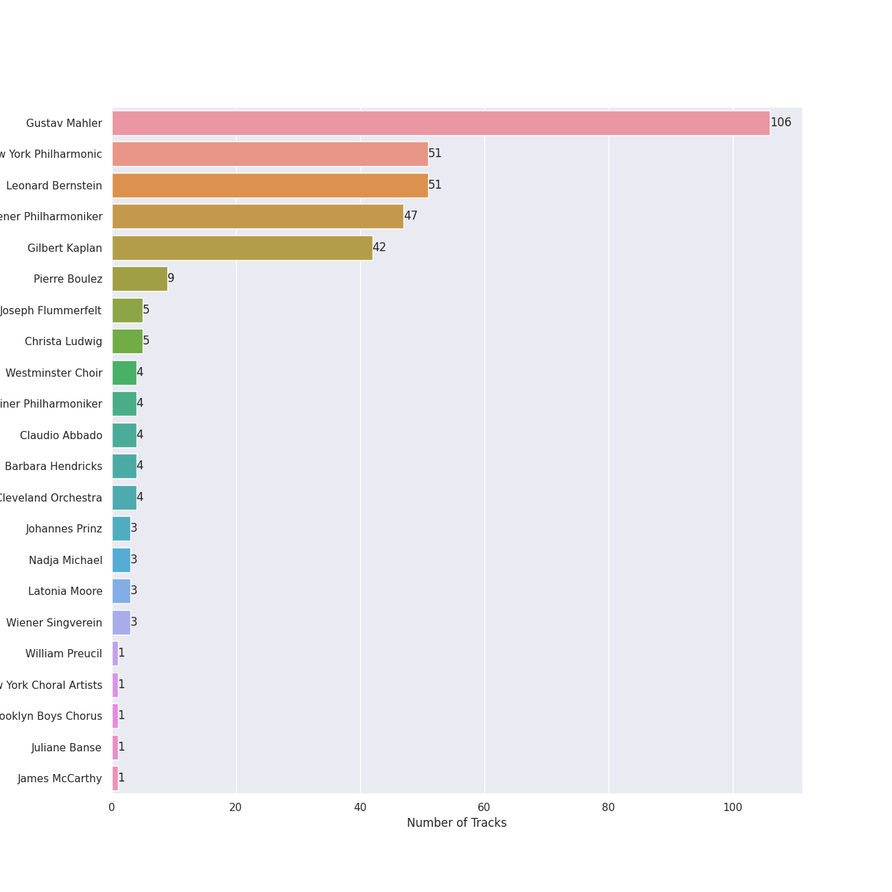

# Mahler

## Top Artists

See all artists

|   Number of Tracks | Artist                  |
|-------------------:|:------------------------|
|                106 | Gustav Mahler           |
|                 51 | New York Philharmonic   |
|                 51 | Leonard Bernstein       |
|                 47 | Wiener Philharmoniker   |
|                 42 | Gilbert Kaplan          |
|                  9 | Pierre Boulez           |
|                  5 | Joseph Flummerfelt      |
|                  5 | Christa Ludwig          |
|                  4 | Westminster Choir       |
|                  4 | Berliner Philharmoniker |
|                  4 | Claudio Abbado          |
|                  4 | Barbara Hendricks       |
|                  4 | Cleveland Orchestra     |
|                  3 | Johannes Prinz          |
|                  3 | Nadja Michael           |
|                  3 | Latonia Moore           |
|                  3 | Wiener Singverein       |
|                  1 | William Preucil         |
|                  1 | New York Choral Artists |
|                  1 | Brooklyn Boys Chorus    |
|                  1 | Juliane Banse           |
|                  1 | James McCarthy          |

## Tracks

| Track                                                                                                                                           | Album                                | Artists                                                                                                                                                                                                                                                             | Liked   |
|:------------------------------------------------------------------------------------------------------------------------------------------------|:-------------------------------------|:--------------------------------------------------------------------------------------------------------------------------------------------------------------------------------------------------------------------------------------------------------------------|:--------|
| Symphony No. 1 in D Major: 1. Langsam. Schleppend - Live                                                                                        | Mahler: Symphony No.1                | [Gustav Mahler](../artists/gustav_mahler.md), [Berliner Philharmoniker](../artists/berliner_philharmoniker.md), Claudio Abbado                                                                                                                                      |         |
| Symphony No. 1 in D Major: 2. Kräftig bewegt - Live                                                                                             | Mahler: Symphony No.1                | [Gustav Mahler](../artists/gustav_mahler.md), [Berliner Philharmoniker](../artists/berliner_philharmoniker.md), Claudio Abbado                                                                                                                                      |         |
| Symphony No. 1 in D Major: 3. Feierlich und gemessen, ohne zu schleppen - Live                                                                  | Mahler: Symphony No.1                | [Gustav Mahler](../artists/gustav_mahler.md), [Berliner Philharmoniker](../artists/berliner_philharmoniker.md), Claudio Abbado                                                                                                                                      |         |
| Symphony No. 1 in D Major: 4. Stürmisch bewegt - Live                                                                                           | Mahler: Symphony No.1                | [Gustav Mahler](../artists/gustav_mahler.md), [Berliner Philharmoniker](../artists/berliner_philharmoniker.md), Claudio Abbado                                                                                                                                      |         |
| Symphony No. 4 in G Major: I. Bedächtig. Nicht eilen                                                                                            | Mahler: Symphony No.4                | [Gustav Mahler](../artists/gustav_mahler.md), Cleveland Orchestra, Pierre Boulez                                                                                                                                                                                    |         |
| Symphony No. 4 in G Major: III. Ruhevoll (Poco adagio)                                                                                          | Mahler: Symphony No.4                | [Gustav Mahler](../artists/gustav_mahler.md), Cleveland Orchestra, Pierre Boulez                                                                                                                                                                                    |         |
| Symphony No. 4 in G Major: IV. Sehr behaglich: "Wir genießen die himmlischen Freuden"                                                           | Mahler: Symphony No.4                | [Gustav Mahler](../artists/gustav_mahler.md), Cleveland Orchestra, Pierre Boulez, Juliane Banse                                                                                                                                                                     |         |
| Symphony No. 4 in G Major: II. In gemächlicher Bewegung. Ohne Hast                                                                              | Mahler: Symphony No.4                | [Gustav Mahler](../artists/gustav_mahler.md), Cleveland Orchestra, Pierre Boulez, William Preucil                                                                                                                                                                   |         |
| Symphony No. 2 In C Minor - "Resurrection" / 1st Movement - Allegro maestoso (Totenfeier): Mit durchaus ernstem und feierlichem Ausdruck - Live | Mahler: Symphony No.2 "Resurrection" | [Gustav Mahler](../artists/gustav_mahler.md), [New York Philharmonic](../artists/new_york_philharmonic.md), [Leonard Bernstein](../artists/leonard_bernstein.md)                                                                                                    |         |
| Symphony No. 2 In C Minor - "Resurrection" / 1st Movement - Allegro maestoso (Totenfeier): Schnell - Live                                       | Mahler: Symphony No.2 "Resurrection" | [Gustav Mahler](../artists/gustav_mahler.md), [New York Philharmonic](../artists/new_york_philharmonic.md), [Leonard Bernstein](../artists/leonard_bernstein.md)                                                                                                    |         |
| Symphony No. 2 In C Minor - "Resurrection" / 1st Movement - Allegro maestoso (Totenfeier): Sehr mäßig und zurückhaltend - Live                  | Mahler: Symphony No.2 "Resurrection" | [Gustav Mahler](../artists/gustav_mahler.md), [New York Philharmonic](../artists/new_york_philharmonic.md), [Leonard Bernstein](../artists/leonard_bernstein.md)                                                                                                    |         |
| Symphony No. 2 In C Minor - "Resurrection" / 1st Movement - Allegro maestoso (Totenfeier): Tempo I - Live                                       | Mahler: Symphony No.2 "Resurrection" | [Gustav Mahler](../artists/gustav_mahler.md), [New York Philharmonic](../artists/new_york_philharmonic.md), [Leonard Bernstein](../artists/leonard_bernstein.md)                                                                                                    |         |
| Symphony No. 2 In C Minor - "Resurrection" / 1st Movement - Allegro maestoso (Totenfeier): Tempo sostenuto - Live                               | Mahler: Symphony No.2 "Resurrection" | [Gustav Mahler](../artists/gustav_mahler.md), [New York Philharmonic](../artists/new_york_philharmonic.md), [Leonard Bernstein](../artists/leonard_bernstein.md)                                                                                                    |         |
| Symphony No. 2 In C Minor - "Resurrection" / 2nd Movement - Andante moderato: Energisch bewegt - Live                                           | Mahler: Symphony No.2 "Resurrection" | [Gustav Mahler](../artists/gustav_mahler.md), [New York Philharmonic](../artists/new_york_philharmonic.md), [Leonard Bernstein](../artists/leonard_bernstein.md)                                                                                                    |         |
| Symphony No. 2 In C Minor - "Resurrection" / 2nd Movement - Andante moderato: In Tempo I zurückkehren - Live                                    | Mahler: Symphony No.2 "Resurrection" | [Gustav Mahler](../artists/gustav_mahler.md), [New York Philharmonic](../artists/new_york_philharmonic.md), [Leonard Bernstein](../artists/leonard_bernstein.md)                                                                                                    |         |
| Symphony No. 2 In C Minor - "Resurrection" / 2nd Movement - Andante moderato: Nicht eilen. Sehr gemächlich - Live                               | Mahler: Symphony No.2 "Resurrection" | [Gustav Mahler](../artists/gustav_mahler.md), [New York Philharmonic](../artists/new_york_philharmonic.md), [Leonard Bernstein](../artists/leonard_bernstein.md)                                                                                                    |         |
| Symphony No. 2 In C Minor - "Resurrection" / 2nd Movement - Andante moderato: Sehr gemächlich - Live                                            | Mahler: Symphony No.2 "Resurrection" | [Gustav Mahler](../artists/gustav_mahler.md), [New York Philharmonic](../artists/new_york_philharmonic.md), [Leonard Bernstein](../artists/leonard_bernstein.md)                                                                                                    |         |
| Symphony No. 2 In C Minor - "Resurrection" / 2nd Movement - Andante moderato: Wieder ins Tempo zurückgehen. TempoI - Live                       | Mahler: Symphony No.2 "Resurrection" | [Gustav Mahler](../artists/gustav_mahler.md), [New York Philharmonic](../artists/new_york_philharmonic.md), [Leonard Bernstein](../artists/leonard_bernstein.md)                                                                                                    |         |
| Symphony No. 2 In C Minor - "Resurrection" / 3: (Scherzo): In ruhiger fließender Bewegung - Live                                                | Mahler: Symphony No.2 "Resurrection" | [Gustav Mahler](../artists/gustav_mahler.md), [New York Philharmonic](../artists/new_york_philharmonic.md), [Leonard Bernstein](../artists/leonard_bernstein.md)                                                                                                    |         |
| Symphony No. 2 In C Minor - "Resurrection" / 3: (Scherzo): Sehr getragen und gesangvoll - Live                                                  | Mahler: Symphony No.2 "Resurrection" | [Gustav Mahler](../artists/gustav_mahler.md), [New York Philharmonic](../artists/new_york_philharmonic.md), [Leonard Bernstein](../artists/leonard_bernstein.md)                                                                                                    |         |
| Symphony No. 2 In C Minor - "Resurrection" / 3: (Scherzo): Zum Tempo I zurückkehren - Live                                                      | Mahler: Symphony No.2 "Resurrection" | [Gustav Mahler](../artists/gustav_mahler.md), [New York Philharmonic](../artists/new_york_philharmonic.md), [Leonard Bernstein](../artists/leonard_bernstein.md)                                                                                                    |         |
| Symphony No. 2 In C Minor - "Resurrection" / 5: Im Tempo des Scherzo: Am Anfang sehr zurückgehalten - Live                                      | Mahler: Symphony No.2 "Resurrection" | [Gustav Mahler](../artists/gustav_mahler.md), [New York Philharmonic](../artists/new_york_philharmonic.md), [Leonard Bernstein](../artists/leonard_bernstein.md)                                                                                                    |         |
| Symphony No. 2 In C Minor - "Resurrection" / 5: Im Tempo des Scherzo: Im Tempo des Scherzos - Live                                              | Mahler: Symphony No.2 "Resurrection" | [Gustav Mahler](../artists/gustav_mahler.md), [New York Philharmonic](../artists/new_york_philharmonic.md), [Leonard Bernstein](../artists/leonard_bernstein.md)                                                                                                    |         |
| Symphony No. 2 In C Minor - "Resurrection" / 5: Im Tempo des Scherzo: Langsam - Live                                                            | Mahler: Symphony No.2 "Resurrection" | [Gustav Mahler](../artists/gustav_mahler.md), [New York Philharmonic](../artists/new_york_philharmonic.md), [Leonard Bernstein](../artists/leonard_bernstein.md)                                                                                                    |         |
| Symphony No. 2 In C Minor - "Resurrection" / 5: Im Tempo des Scherzo: Molto ritenuto. Maestoso - Live                                           | Mahler: Symphony No.2 "Resurrection" | [Gustav Mahler](../artists/gustav_mahler.md), [New York Philharmonic](../artists/new_york_philharmonic.md), [Leonard Bernstein](../artists/leonard_bernstein.md)                                                                                                    |         |
| Symphony No. 2 In C Minor - "Resurrection" / 5: Im Tempo des Scherzo: Sehr langsam und gedehnt - Live                                           | Mahler: Symphony No.2 "Resurrection" | [Gustav Mahler](../artists/gustav_mahler.md), [New York Philharmonic](../artists/new_york_philharmonic.md), [Leonard Bernstein](../artists/leonard_bernstein.md)                                                                                                    |         |
| Symphony No. 2 In C Minor - "Resurrection" / 5: Im Tempo des Scherzo: Wieder sehr breit - Live                                                  | Mahler: Symphony No.2 "Resurrection" | [Gustav Mahler](../artists/gustav_mahler.md), [New York Philharmonic](../artists/new_york_philharmonic.md), [Leonard Bernstein](../artists/leonard_bernstein.md)                                                                                                    |         |
| Symphony No. 2 In C Minor - "Resurrection" / 5: Im Tempo des Scherzo: Wieder zurückhaltend - Live                                               | Mahler: Symphony No.2 "Resurrection" | [Gustav Mahler](../artists/gustav_mahler.md), [New York Philharmonic](../artists/new_york_philharmonic.md), [Leonard Bernstein](../artists/leonard_bernstein.md)                                                                                                    |         |
| Symphony No. 3 In D Minor / Part 1: 1. - Im alten Marschtempo (Allegro Moderato) - Live                                                         | Mahler: Symphony No.3                | [Gustav Mahler](../artists/gustav_mahler.md), [New York Philharmonic](../artists/new_york_philharmonic.md), [Leonard Bernstein](../artists/leonard_bernstein.md)                                                                                                    |         |
| Symphony No. 3 In D Minor / Part 1: 1. - Immer das gleiche Tempo - Live                                                                         | Mahler: Symphony No.3                | [Gustav Mahler](../artists/gustav_mahler.md), [New York Philharmonic](../artists/new_york_philharmonic.md), [Leonard Bernstein](../artists/leonard_bernstein.md)                                                                                                    |         |
| Symphony No. 3 In D Minor / Part 1: 1. - Immer dasselbe Tempo. (Marsch.) Nicht eilen - Live                                                     | Mahler: Symphony No.3                | [Gustav Mahler](../artists/gustav_mahler.md), [New York Philharmonic](../artists/new_york_philharmonic.md), [Leonard Bernstein](../artists/leonard_bernstein.md)                                                                                                    |         |
| Symphony No. 3 In D Minor / Part 1: 1. - Tempo I - Live                                                                                         | Mahler: Symphony No.3                | [Gustav Mahler](../artists/gustav_mahler.md), [New York Philharmonic](../artists/new_york_philharmonic.md), [Leonard Bernstein](../artists/leonard_bernstein.md)                                                                                                    |         |
| Symphony No. 3 In D Minor / Part 1: 1. - Tempo I - Live                                                                                         | Mahler: Symphony No.3                | [Gustav Mahler](../artists/gustav_mahler.md), [New York Philharmonic](../artists/new_york_philharmonic.md), [Leonard Bernstein](../artists/leonard_bernstein.md)                                                                                                    |         |
| Symphony No. 3 In D Minor / Part 1: 1. - Zeit lassen - Live                                                                                     | Mahler: Symphony No.3                | [Gustav Mahler](../artists/gustav_mahler.md), [New York Philharmonic](../artists/new_york_philharmonic.md), [Leonard Bernstein](../artists/leonard_bernstein.md)                                                                                                    |         |
| Symphony No. 3 In D Minor / Part 1: 1. - Zeit lassen - Live                                                                                     | Mahler: Symphony No.3                | [Gustav Mahler](../artists/gustav_mahler.md), [New York Philharmonic](../artists/new_york_philharmonic.md), [Leonard Bernstein](../artists/leonard_bernstein.md)                                                                                                    |         |
| Symphony No. 3 In D Minor / Part 1: 1. Kräftig. Entschieden - Live                                                                              | Mahler: Symphony No.3                | [Gustav Mahler](../artists/gustav_mahler.md), [New York Philharmonic](../artists/new_york_philharmonic.md), [Leonard Bernstein](../artists/leonard_bernstein.md)                                                                                                    |         |
| Symphony No. 3 In D Minor / Part 2: 2. - A tempo. (Wie im Anfang) - Live                                                                        | Mahler: Symphony No.3                | [Gustav Mahler](../artists/gustav_mahler.md), [New York Philharmonic](../artists/new_york_philharmonic.md), [Leonard Bernstein](../artists/leonard_bernstein.md)                                                                                                    |         |
| Symphony No. 3 In D Minor / Part 2: 2. - Ganz ploetzlich gemaechlich. Tempo di Menuetto - Live                                                  | Mahler: Symphony No.3                | [Gustav Mahler](../artists/gustav_mahler.md), [New York Philharmonic](../artists/new_york_philharmonic.md), [Leonard Bernstein](../artists/leonard_bernstein.md)                                                                                                    |         |
| Symphony No. 3 In D Minor / Part 2: 2. - L'istesso tempo - Live                                                                                 | Mahler: Symphony No.3                | [Gustav Mahler](../artists/gustav_mahler.md), [New York Philharmonic](../artists/new_york_philharmonic.md), [Leonard Bernstein](../artists/leonard_bernstein.md)                                                                                                    |         |
| Symphony No. 3 In D Minor / Part 2: 3. Comodo. Scherzando. Ohne Hast - Live                                                                     | Mahler: Symphony No.3                | [Gustav Mahler](../artists/gustav_mahler.md), [New York Philharmonic](../artists/new_york_philharmonic.md), [Leonard Bernstein](../artists/leonard_bernstein.md)                                                                                                    |         |
| Symphony No. 3 In D Minor / Part 2: 3.- Etwas zurueckhaltend - Live                                                                             | Mahler: Symphony No.3                | [Gustav Mahler](../artists/gustav_mahler.md), [New York Philharmonic](../artists/new_york_philharmonic.md), [Leonard Bernstein](../artists/leonard_bernstein.md)                                                                                                    |         |
| Symphony No. 3 In D Minor / Part 2: 3.- Schnell und schmetternd wie eine Fanfare - Tempo I. Mit geheimnisvoller Hast - Live                     | Mahler: Symphony No.3                | [Gustav Mahler](../artists/gustav_mahler.md), [New York Philharmonic](../artists/new_york_philharmonic.md), [Leonard Bernstein](../artists/leonard_bernstein.md)                                                                                                    |         |
| Symphony No. 3 In D Minor / Part 2: 3.- Wieder sehr gemaechlich, beinahe langsam                                                                | Mahler: Symphony No.3                | [Gustav Mahler](../artists/gustav_mahler.md), [New York Philharmonic](../artists/new_york_philharmonic.md), [Leonard Bernstein](../artists/leonard_bernstein.md)                                                                                                    |         |
| Symphony No. 3 In D Minor / Part 2: 3.- Wieder sehr gemaechlich, wie zu Anfang - Live                                                           | Mahler: Symphony No.3                | [Gustav Mahler](../artists/gustav_mahler.md), [New York Philharmonic](../artists/new_york_philharmonic.md), [Leonard Bernstein](../artists/leonard_bernstein.md)                                                                                                    |         |
| Symphony No. 3 In D Minor / Part 2: 4.- Più mosso subito - Live                                                                                 | Mahler: Symphony No.3                | [Gustav Mahler](../artists/gustav_mahler.md), [New York Philharmonic](../artists/new_york_philharmonic.md), [Leonard Bernstein](../artists/leonard_bernstein.md)                                                                                                    |         |
| Symphony No. 3 In D Minor / Part 2: 6. Langsam. Ruhevoll. Empfunden - Live                                                                      | Mahler: Symphony No.3                | [Gustav Mahler](../artists/gustav_mahler.md), [New York Philharmonic](../artists/new_york_philharmonic.md), [Leonard Bernstein](../artists/leonard_bernstein.md)                                                                                                    |         |
| Symphony No. 3 In D Minor / Part 2: 6.- Langsam. Tempo I - Live                                                                                 | Mahler: Symphony No.3                | [Gustav Mahler](../artists/gustav_mahler.md), [New York Philharmonic](../artists/new_york_philharmonic.md), [Leonard Bernstein](../artists/leonard_bernstein.md)                                                                                                    |         |
| Symphony No. 3 In D Minor / Part 2: 6.- Nicht mehr so breit - Live                                                                              | Mahler: Symphony No.3                | [Gustav Mahler](../artists/gustav_mahler.md), [New York Philharmonic](../artists/new_york_philharmonic.md), [Leonard Bernstein](../artists/leonard_bernstein.md)                                                                                                    |         |
| Symphony No. 3 In D Minor / Part 2: 6.- Nicht mehr so breit - Live                                                                              | Mahler: Symphony No.3                | [Gustav Mahler](../artists/gustav_mahler.md), [New York Philharmonic](../artists/new_york_philharmonic.md), [Leonard Bernstein](../artists/leonard_bernstein.md)                                                                                                    |         |
| Symphony No. 3 In D Minor / Part 2: 6.- Tempo I - Live                                                                                          | Mahler: Symphony No.3                | [Gustav Mahler](../artists/gustav_mahler.md), [New York Philharmonic](../artists/new_york_philharmonic.md), [Leonard Bernstein](../artists/leonard_bernstein.md)                                                                                                    |         |
| Symphony No. 3 In D Minor / Part 2: 6.- Tempo I. Ruhevoll - Live                                                                                | Mahler: Symphony No.3                | [Gustav Mahler](../artists/gustav_mahler.md), [New York Philharmonic](../artists/new_york_philharmonic.md), [Leonard Bernstein](../artists/leonard_bernstein.md)                                                                                                    |         |
| Symphony No.3 In D Minor / Part 2: 2. Tempo di minuetto. Sehr mäßig - Live                                                                      | Mahler: Symphony No.3                | [Gustav Mahler](../artists/gustav_mahler.md), [New York Philharmonic](../artists/new_york_philharmonic.md), [Leonard Bernstein](../artists/leonard_bernstein.md)                                                                                                    |         |
| Symphony No. 2 in C Minor - "Resurrection" / 4: "Urlicht": Sehr feierlich, aber schlicht - Live                                                 | Mahler: Symphony No.2 "Resurrection" | [Gustav Mahler](../artists/gustav_mahler.md), [New York Philharmonic](../artists/new_york_philharmonic.md), [Leonard Bernstein](../artists/leonard_bernstein.md), Christa Ludwig                                                                                    |         |
| Symphony No. 3 In D Minor / Part 2: 4. Sehr langsam. Misterioso ppp - "O Mensch! Gib acht" - Live                                               | Mahler: Symphony No.3                | [Gustav Mahler](../artists/gustav_mahler.md), [New York Philharmonic](../artists/new_york_philharmonic.md), [Leonard Bernstein](../artists/leonard_bernstein.md), Christa Ludwig                                                                                    |         |
| Symphony No. 2 In C Minor - "Resurrection" / 5: Im Tempo des Scherzo: Etwas bewegter - "O glaube, mein Herz, o glaube" - Live                   | Mahler: Symphony No.2 "Resurrection" | [Gustav Mahler](../artists/gustav_mahler.md), [New York Philharmonic](../artists/new_york_philharmonic.md), [Leonard Bernstein](../artists/leonard_bernstein.md), Christa Ludwig, Joseph Flummerfelt, Barbara Hendricks, Westminster Choir                          |         |
| Symphony No. 2 In C Minor - "Resurrection" / 5: Im Tempo des Scherzo: Mit Aufschwung, aber nicht eilen - "O Schmerz, du Alldurchdringer" - Live | Mahler: Symphony No.2 "Resurrection" | [Gustav Mahler](../artists/gustav_mahler.md), [New York Philharmonic](../artists/new_york_philharmonic.md), [Leonard Bernstein](../artists/leonard_bernstein.md), Christa Ludwig, Joseph Flummerfelt, Barbara Hendricks, Westminster Choir                          |         |
| Symphony No. 3 In D Minor / Part 2: 5. Lustig im Tempo und keck im Ausdruck: "Bimm Bamm. Es sungen drei Engel" - Live                           | Mahler: Symphony No.3                | [Gustav Mahler](../artists/gustav_mahler.md), [New York Philharmonic](../artists/new_york_philharmonic.md), [Leonard Bernstein](../artists/leonard_bernstein.md), Christa Ludwig, New York Choral Artists, Brooklyn Boys Chorus, Joseph Flummerfelt, James McCarthy |         |
| Symphony No. 2 In C Minor - "Resurrection" / 5: Im Tempo des Scherzo: Langsam ppp. Nicht schleppen - "Wieder aufzublühn wirst du gesät" - Live  | Mahler: Symphony No.2 "Resurrection" | [Gustav Mahler](../artists/gustav_mahler.md), [New York Philharmonic](../artists/new_york_philharmonic.md), [Leonard Bernstein](../artists/leonard_bernstein.md), Joseph Flummerfelt, Barbara Hendricks, Westminster Choir                                          |         |
| Symphony No. 2 In C Minor - "Resurrection" / 5: Im Tempo des Scherzo: Langsam. Misterioso - "Auferstehen, ja auferstehen wirst du gesät" - Live | Mahler: Symphony No.2 "Resurrection" | [Gustav Mahler](../artists/gustav_mahler.md), [New York Philharmonic](../artists/new_york_philharmonic.md), [Leonard Bernstein](../artists/leonard_bernstein.md), Joseph Flummerfelt, Barbara Hendricks, Westminster Choir                                          |         |
| Symphony No. 5 In C Sharp Minor: 1. Trauermarsch (In gemessenem Schritt. Streng. Wie ein Kondukt) [Symphony No.5 in C sharp minor / Part 1]     | Mahler: Symphony No.5                | [Gustav Mahler](../artists/gustav_mahler.md), Pierre Boulez, [Wiener Philharmoniker](../artists/wiener_philharmoniker.md)                                                                                                                                           |         |
| Symphony No. 5 In C Sharp Minor: II. Stürmisch bewegt. Mit größter Vehemenz                                                                     | Mahler: Symphony No.5                | [Gustav Mahler](../artists/gustav_mahler.md), Pierre Boulez, [Wiener Philharmoniker](../artists/wiener_philharmoniker.md)                                                                                                                                           |         |
| Symphony No. 5 In C Sharp Minor: III. Scherzo. Kräftig, nicht zu schnell                                                                        | Mahler: Symphony No.5                | [Gustav Mahler](../artists/gustav_mahler.md), Pierre Boulez, [Wiener Philharmoniker](../artists/wiener_philharmoniker.md)                                                                                                                                           |         |
| Symphony No. 5 In C Sharp Minor: IV. Adagietto. Sehr langsam                                                                                    | Mahler: Symphony No.5                | [Gustav Mahler](../artists/gustav_mahler.md), Pierre Boulez, [Wiener Philharmoniker](../artists/wiener_philharmoniker.md)                                                                                                                                           |         |
| Symphony No. 5 In C Sharp Minor: V. Rondo-Finale. Allegro - Allegro giocoso. Frisch                                                             | Mahler: Symphony No.5                | [Gustav Mahler](../artists/gustav_mahler.md), Pierre Boulez, [Wiener Philharmoniker](../artists/wiener_philharmoniker.md)                                                                                                                                           |         |
| Symphony No. 2 In C Minor - "Resurrection" / 1st Movement - Allegro maestoso (Totenfeier): (English horn)                                       | Mahler: Symphony No. 2               | [Gustav Mahler](../artists/gustav_mahler.md), [Wiener Philharmoniker](../artists/wiener_philharmoniker.md), [Gilbert Kaplan](../artists/gilbert_kaplan.md)                                                                                                          |         |
| Symphony No. 2 In C Minor - "Resurrection" / 1st Movement - Allegro maestoso (Totenfeier): Allegro maestoso                                     | Mahler: Symphony No. 2               | [Gustav Mahler](../artists/gustav_mahler.md), [Wiener Philharmoniker](../artists/wiener_philharmoniker.md), [Gilbert Kaplan](../artists/gilbert_kaplan.md)                                                                                                          |         |
| Symphony No. 2 In C Minor - "Resurrection" / 1st Movement - Allegro maestoso (Totenfeier): Ausdrucksvoll (English horn & bass clarinet)         | Mahler: Symphony No. 2               | [Gustav Mahler](../artists/gustav_mahler.md), [Wiener Philharmoniker](../artists/wiener_philharmoniker.md), [Gilbert Kaplan](../artists/gilbert_kaplan.md)                                                                                                          |         |
| Symphony No. 2 In C Minor - "Resurrection" / 1st Movement - Allegro maestoso (Totenfeier): Etwas drängend                                       | Mahler: Symphony No. 2               | [Gustav Mahler](../artists/gustav_mahler.md), [Wiener Philharmoniker](../artists/wiener_philharmoniker.md), [Gilbert Kaplan](../artists/gilbert_kaplan.md)                                                                                                          |         |
| Symphony No. 2 In C Minor - "Resurrection" / 1st Movement - Allegro maestoso (Totenfeier): Im Tempo nachgeben                                   | Mahler: Symphony No. 2               | [Gustav Mahler](../artists/gustav_mahler.md), [Wiener Philharmoniker](../artists/wiener_philharmoniker.md), [Gilbert Kaplan](../artists/gilbert_kaplan.md)                                                                                                          |         |
| Symphony No. 2 In C Minor - "Resurrection" / 1st Movement - Allegro maestoso (Totenfeier): Molto pesante                                        | Mahler: Symphony No. 2               | [Gustav Mahler](../artists/gustav_mahler.md), [Wiener Philharmoniker](../artists/wiener_philharmoniker.md), [Gilbert Kaplan](../artists/gilbert_kaplan.md)                                                                                                          |         |
| Symphony No. 2 In C Minor - "Resurrection" / 1st Movement - Allegro maestoso (Totenfeier): Schnell                                              | Mahler: Symphony No. 2               | [Gustav Mahler](../artists/gustav_mahler.md), [Wiener Philharmoniker](../artists/wiener_philharmoniker.md), [Gilbert Kaplan](../artists/gilbert_kaplan.md)                                                                                                          |         |
| Symphony No. 2 In C Minor - "Resurrection" / 1st Movement - Allegro maestoso (Totenfeier): Sehr getragen (Trumpet & trombone)                   | Mahler: Symphony No. 2               | [Gustav Mahler](../artists/gustav_mahler.md), [Wiener Philharmoniker](../artists/wiener_philharmoniker.md), [Gilbert Kaplan](../artists/gilbert_kaplan.md)                                                                                                          |         |
| Symphony No. 2 In C Minor - "Resurrection" / 1st Movement - Allegro maestoso (Totenfeier): Sehr langsam beginnend                               | Mahler: Symphony No. 2               | [Gustav Mahler](../artists/gustav_mahler.md), [Wiener Philharmoniker](../artists/wiener_philharmoniker.md), [Gilbert Kaplan](../artists/gilbert_kaplan.md)                                                                                                          |         |
| Symphony No. 2 In C Minor - "Resurrection" / 1st Movement - Allegro maestoso (Totenfeier): Sehr mässig und zurückhaltend                        | Mahler: Symphony No. 2               | [Gustav Mahler](../artists/gustav_mahler.md), [Wiener Philharmoniker](../artists/wiener_philharmoniker.md), [Gilbert Kaplan](../artists/gilbert_kaplan.md)                                                                                                          |         |
| Symphony No. 2 In C Minor - "Resurrection" / 1st Movement - Allegro maestoso (Totenfeier): Tempo I                                              | Mahler: Symphony No. 2               | [Gustav Mahler](../artists/gustav_mahler.md), [Wiener Philharmoniker](../artists/wiener_philharmoniker.md), [Gilbert Kaplan](../artists/gilbert_kaplan.md)                                                                                                          |         |
| Symphony No. 2 In C Minor - "Resurrection" / 1st Movement - Allegro maestoso (Totenfeier): Tempo sostenuto                                      | Mahler: Symphony No. 2               | [Gustav Mahler](../artists/gustav_mahler.md), [Wiener Philharmoniker](../artists/wiener_philharmoniker.md), [Gilbert Kaplan](../artists/gilbert_kaplan.md)                                                                                                          |         |
| Symphony No. 2 In C Minor - "Resurrection" / 1st Movement - Allegro maestoso (Totenfeier): Wie zu Anfang                                        | Mahler: Symphony No. 2               | [Gustav Mahler](../artists/gustav_mahler.md), [Wiener Philharmoniker](../artists/wiener_philharmoniker.md), [Gilbert Kaplan](../artists/gilbert_kaplan.md)                                                                                                          |         |
| Symphony No. 2 In C Minor - "Resurrection" / 1st Movement - Allegro maestoso (Totenfeier): Zurückhalten                                         | Mahler: Symphony No. 2               | [Gustav Mahler](../artists/gustav_mahler.md), [Wiener Philharmoniker](../artists/wiener_philharmoniker.md), [Gilbert Kaplan](../artists/gilbert_kaplan.md)                                                                                                          |         |
| Symphony No. 2 In C Minor - "Resurrection" / 2nd Movement - Andante moderato: 3 bars before Wieder ins Tempo zurückgehen. Tempo I               | Mahler: Symphony No. 2               | [Gustav Mahler](../artists/gustav_mahler.md), [Wiener Philharmoniker](../artists/wiener_philharmoniker.md), [Gilbert Kaplan](../artists/gilbert_kaplan.md)                                                                                                          |         |
| Symphony No. 2 In C Minor - "Resurrection" / 2nd Movement - Andante moderato: Andante moderato                                                  | Mahler: Symphony No. 2               | [Gustav Mahler](../artists/gustav_mahler.md), [Wiener Philharmoniker](../artists/wiener_philharmoniker.md), [Gilbert Kaplan](../artists/gilbert_kaplan.md)                                                                                                          |         |
| Symphony No. 2 In C Minor - "Resurrection" / 2nd Movement - Andante moderato: In Tempo I zurückkehren                                           | Mahler: Symphony No. 2               | [Gustav Mahler](../artists/gustav_mahler.md), [Wiener Philharmoniker](../artists/wiener_philharmoniker.md), [Gilbert Kaplan](../artists/gilbert_kaplan.md)                                                                                                          |         |
| Symphony No. 2 In C Minor - "Resurrection" / 2nd Movement - Andante moderato: Nicht eilen. Sehr gemächlich                                      | Mahler: Symphony No. 2               | [Gustav Mahler](../artists/gustav_mahler.md), [Wiener Philharmoniker](../artists/wiener_philharmoniker.md), [Gilbert Kaplan](../artists/gilbert_kaplan.md)                                                                                                          |         |
| Symphony No. 2 In C Minor - "Resurrection" / 2nd Movement - Andante moderato: Tempo I. Energisch bewegt                                         | Mahler: Symphony No. 2               | [Gustav Mahler](../artists/gustav_mahler.md), [Wiener Philharmoniker](../artists/wiener_philharmoniker.md), [Gilbert Kaplan](../artists/gilbert_kaplan.md)                                                                                                          |         |
| Symphony No. 2 in C minor - "Resurrection" / 3rd Movement - (Scherzo): (Bassoon & violas)                                                       | Mahler: Symphony No. 2               | [Gustav Mahler](../artists/gustav_mahler.md), [Wiener Philharmoniker](../artists/wiener_philharmoniker.md), [Gilbert Kaplan](../artists/gilbert_kaplan.md)                                                                                                          |         |
| Symphony No. 2 in C minor - "Resurrection" / 3rd Movement - (Scherzo): (Cellos & Basses)                                                        | Mahler: Symphony No. 2               | [Gustav Mahler](../artists/gustav_mahler.md), [Wiener Philharmoniker](../artists/wiener_philharmoniker.md), [Gilbert Kaplan](../artists/gilbert_kaplan.md)                                                                                                          |         |
| Symphony No. 2 in C minor - "Resurrection" / 3rd Movement - (Scherzo): (Piccolo)                                                                | Mahler: Symphony No. 2               | [Gustav Mahler](../artists/gustav_mahler.md), [Wiener Philharmoniker](../artists/wiener_philharmoniker.md), [Gilbert Kaplan](../artists/gilbert_kaplan.md)                                                                                                          |         |
| Symphony No. 2 in C minor - "Resurrection" / 3rd Movement - (Scherzo): (Trumpets & trombones)                                                   | Mahler: Symphony No. 2               | [Gustav Mahler](../artists/gustav_mahler.md), [Wiener Philharmoniker](../artists/wiener_philharmoniker.md), [Gilbert Kaplan](../artists/gilbert_kaplan.md)                                                                                                          |         |
| Symphony No. 2 in C minor - "Resurrection" / 3rd Movement - (Scherzo): (Violas, cellos & basses)                                                | Mahler: Symphony No. 2               | [Gustav Mahler](../artists/gustav_mahler.md), [Wiener Philharmoniker](../artists/wiener_philharmoniker.md), [Gilbert Kaplan](../artists/gilbert_kaplan.md)                                                                                                          |         |
| Symphony No. 2 in C minor - "Resurrection" / 3rd Movement - (Scherzo): In ruhig fliessender Bewegung                                            | Mahler: Symphony No. 2               | [Gustav Mahler](../artists/gustav_mahler.md), [Wiener Philharmoniker](../artists/wiener_philharmoniker.md), [Gilbert Kaplan](../artists/gilbert_kaplan.md)                                                                                                          |         |
| Symphony No. 2 in C minor - "Resurrection" / 3rd Movement - (Scherzo): Sehr getragen und gesangvoll                                             | Mahler: Symphony No. 2               | [Gustav Mahler](../artists/gustav_mahler.md), [Wiener Philharmoniker](../artists/wiener_philharmoniker.md), [Gilbert Kaplan](../artists/gilbert_kaplan.md)                                                                                                          |         |
| Symphony No. 2 in C minor - "Resurrection" / 3rd Movement - (Scherzo): Vorwärts                                                                 | Mahler: Symphony No. 2               | [Gustav Mahler](../artists/gustav_mahler.md), [Wiener Philharmoniker](../artists/wiener_philharmoniker.md), [Gilbert Kaplan](../artists/gilbert_kaplan.md)                                                                                                          |         |
| Symphony No. 2 in C minor - "Resurrection" / 3rd Movement - (Scherzo): Zum Tempo I. zurückkehren                                                | Mahler: Symphony No. 2               | [Gustav Mahler](../artists/gustav_mahler.md), [Wiener Philharmoniker](../artists/wiener_philharmoniker.md), [Gilbert Kaplan](../artists/gilbert_kaplan.md)                                                                                                          |         |
| Symphony No. 2 in C minor - "Resurrection" / 5th Movement: (Trombone)                                                                           | Mahler: Symphony No. 2               | [Gustav Mahler](../artists/gustav_mahler.md), [Wiener Philharmoniker](../artists/wiener_philharmoniker.md), [Gilbert Kaplan](../artists/gilbert_kaplan.md)                                                                                                          |         |
| Symphony No. 2 in C minor - "Resurrection" / 5th Movement: Im Anfang sehr zurückgehalten                                                        | Mahler: Symphony No. 2               | [Gustav Mahler](../artists/gustav_mahler.md), [Wiener Philharmoniker](../artists/wiener_philharmoniker.md), [Gilbert Kaplan](../artists/gilbert_kaplan.md)                                                                                                          |         |
| Symphony No. 2 in C minor - "Resurrection" / 5th Movement: Im Tempo des Scherzos. Wild herausfahrend                                            | Mahler: Symphony No. 2               | [Gustav Mahler](../artists/gustav_mahler.md), [Wiener Philharmoniker](../artists/wiener_philharmoniker.md), [Gilbert Kaplan](../artists/gilbert_kaplan.md)                                                                                                          |         |
| Symphony No. 2 in C minor - "Resurrection" / 5th Movement: Langsam                                                                              | Mahler: Symphony No. 2               | [Gustav Mahler](../artists/gustav_mahler.md), [Wiener Philharmoniker](../artists/wiener_philharmoniker.md), [Gilbert Kaplan](../artists/gilbert_kaplan.md)                                                                                                          |         |
| Symphony No. 2 in C minor - "Resurrection" / 5th Movement: Langsam                                                                              | Mahler: Symphony No. 2               | [Gustav Mahler](../artists/gustav_mahler.md), [Wiener Philharmoniker](../artists/wiener_philharmoniker.md), [Gilbert Kaplan](../artists/gilbert_kaplan.md)                                                                                                          |         |
| Symphony No. 2 in C minor - "Resurrection" / 5th Movement: Pesante                                                                              | Mahler: Symphony No. 2               | [Gustav Mahler](../artists/gustav_mahler.md), [Wiener Philharmoniker](../artists/wiener_philharmoniker.md), [Gilbert Kaplan](../artists/gilbert_kaplan.md)                                                                                                          |         |
| Symphony No. 2 in C minor - "Resurrection" / 5th Movement: Ritenuto                                                                             | Mahler: Symphony No. 2               | [Gustav Mahler](../artists/gustav_mahler.md), [Wiener Philharmoniker](../artists/wiener_philharmoniker.md), [Gilbert Kaplan](../artists/gilbert_kaplan.md)                                                                                                          |         |
| Symphony No. 2 in C minor - "Resurrection" / 5th Movement: Sehr langsam und gedehnt ("der grosse Appell")                                       | Mahler: Symphony No. 2               | [Gustav Mahler](../artists/gustav_mahler.md), [Wiener Philharmoniker](../artists/wiener_philharmoniker.md), [Gilbert Kaplan](../artists/gilbert_kaplan.md)                                                                                                          |         |
| Symphony No. 2 in C minor - "Resurrection" / 5th Movement: Wieder sehr breit                                                                    | Mahler: Symphony No. 2               | [Gustav Mahler](../artists/gustav_mahler.md), [Wiener Philharmoniker](../artists/wiener_philharmoniker.md), [Gilbert Kaplan](../artists/gilbert_kaplan.md)                                                                                                          |         |
| Symphony No. 2 in C minor - "Resurrection" / 5th Movement: Wieder zurückhaltend                                                                 | Mahler: Symphony No. 2               | [Gustav Mahler](../artists/gustav_mahler.md), [Wiener Philharmoniker](../artists/wiener_philharmoniker.md), [Gilbert Kaplan](../artists/gilbert_kaplan.md)                                                                                                          |         |
| Symphony No. 2 in C minor - "Resurrection" / 5th Movement: Langsam. Misterioso (Chorus: "Aufersteh'n")                                          | Mahler: Symphony No. 2               | [Gustav Mahler](../artists/gustav_mahler.md), [Wiener Philharmoniker](../artists/wiener_philharmoniker.md), [Gilbert Kaplan](../artists/gilbert_kaplan.md), Latonia Moore, [Wiener Singverein](../artists/wiener_singverein.md), Johannes Prinz                     |         |
| Symphony No. 2 in C minor - "Resurrection" / 4th Movement - "Urlicht": Sehr feierlich, aber schlicht (Choralmässig)                             | Mahler: Symphony No. 2               | [Gustav Mahler](../artists/gustav_mahler.md), [Wiener Philharmoniker](../artists/wiener_philharmoniker.md), [Gilbert Kaplan](../artists/gilbert_kaplan.md), Nadja Michael                                                                                           |         |
| Symphony No. 2 in C minor - "Resurrection" / 5th Movement: Etwas bewegter (Solo: "O Glaube")                                                    | Mahler: Symphony No. 2               | [Gustav Mahler](../artists/gustav_mahler.md), [Wiener Philharmoniker](../artists/wiener_philharmoniker.md), [Gilbert Kaplan](../artists/gilbert_kaplan.md), Nadja Michael, Latonia Moore, [Wiener Singverein](../artists/wiener_singverein.md), Johannes Prinz      |         |
| Symphony No. 2 in C minor - "Resurrection" / 5th Movement: Mit Aufschwung, aber nicht eilen (Duet: "O Schmerz")                                 | Mahler: Symphony No. 2               | [Gustav Mahler](../artists/gustav_mahler.md), [Wiener Philharmoniker](../artists/wiener_philharmoniker.md), [Gilbert Kaplan](../artists/gilbert_kaplan.md), Nadja Michael, Latonia Moore, [Wiener Singverein](../artists/wiener_singverein.md), Johannes Prinz      |         |
