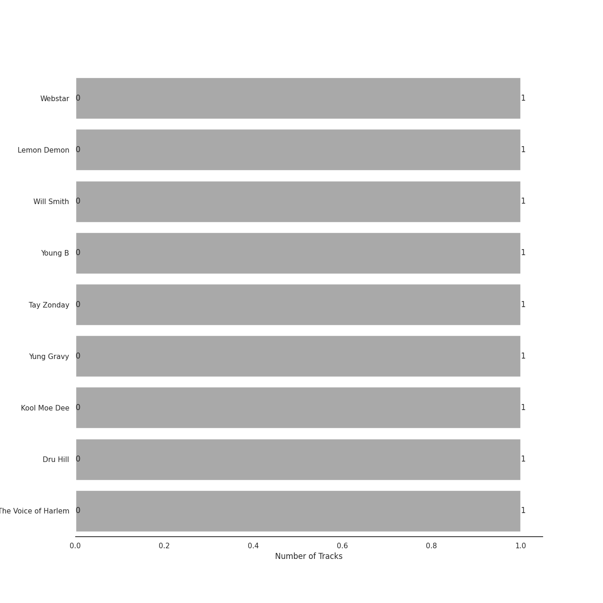
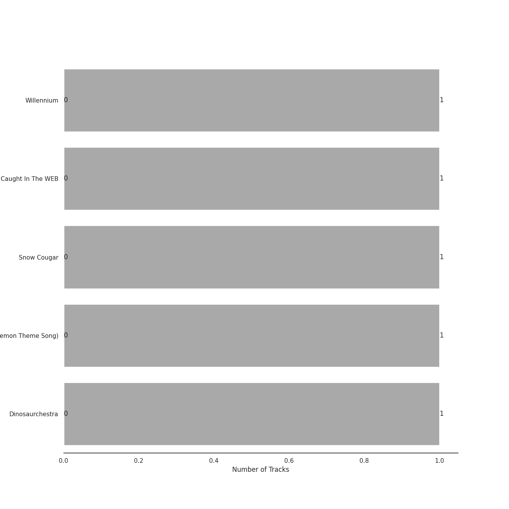
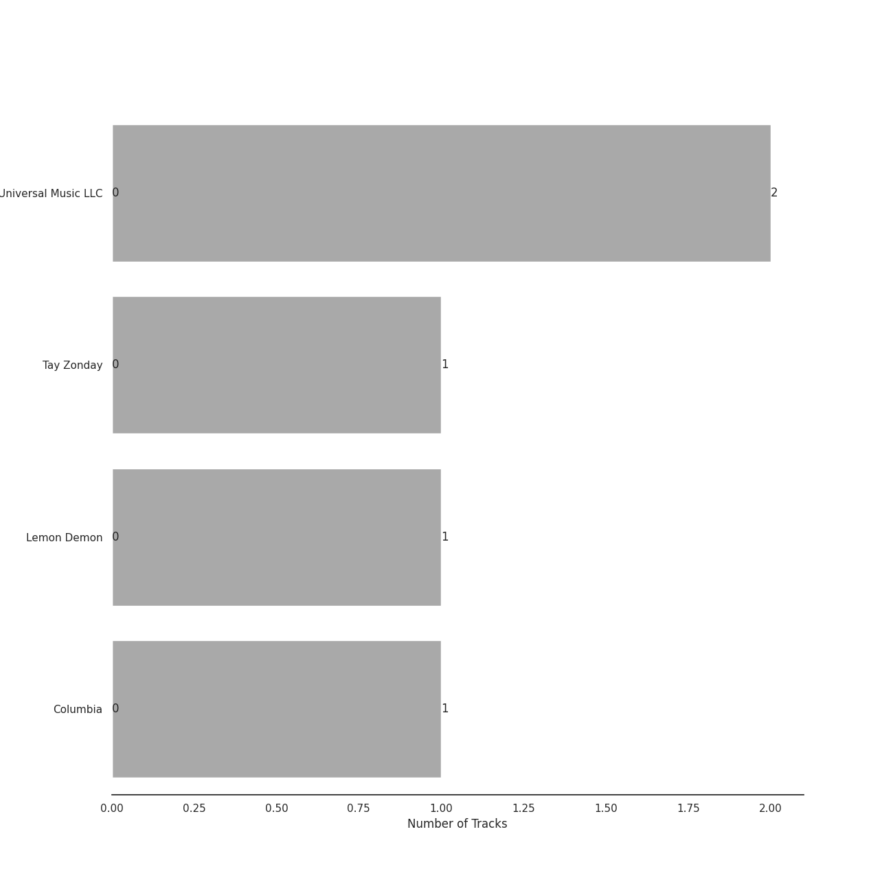
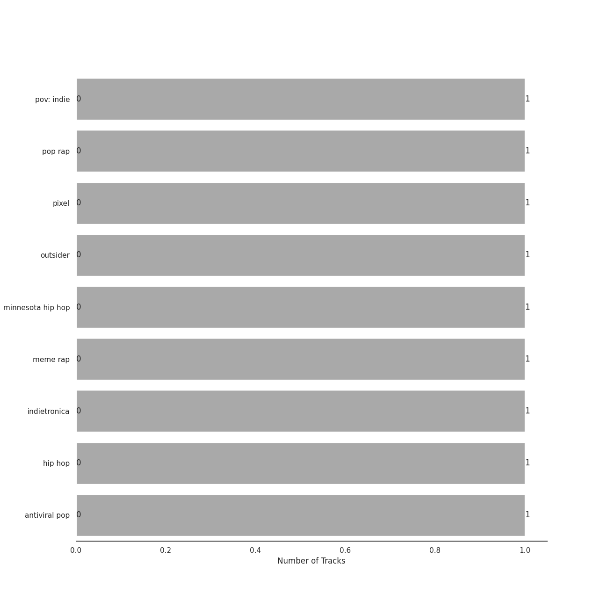
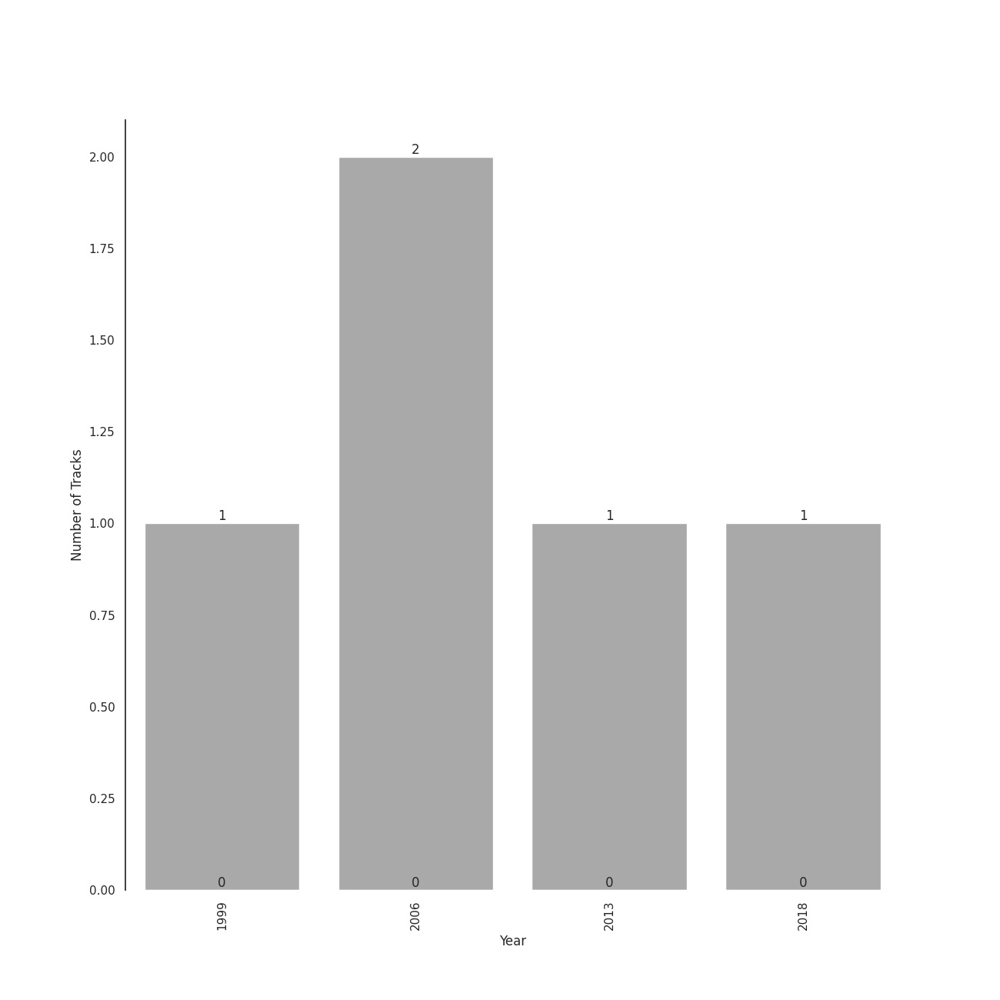

# Memes

[5 tracks (0 liked) 🔗](https://open.spotify.com/playlist/3y11VzeS7U1PPGgpRpKoxr)

## Top Artists

| Art | Tracks | 💚 | Artist | 🔗 |
|:---|---:|---:|:---|:---|
|  | 1 | 0 | Webstar | [🔗](https://open.spotify.com/artist/4oWRwCsvTevGlcq7OVN2Jq) |
|  | 1 | 0 | Lemon Demon | [🔗](https://open.spotify.com/artist/4llAOeA6kEF4ytaB2fsmcW) |
|  | 1 | 0 | Will Smith | [🔗](https://open.spotify.com/artist/41qil2VaGbD194gaEcmmyx) |
|  | 1 | 0 | Young B | [🔗](https://open.spotify.com/artist/3gHXLeb9xeEGgIDiJk0pFa) |
|  | 1 | 0 | Tay Zonday | [🔗](https://open.spotify.com/artist/3LG7uFsPbPBjaBRpzwqLuX) |
|  | 1 | 0 | Yung Gravy | [🔗](https://open.spotify.com/artist/2YOYua8FpudSEiB9s88IgQ) |
|  | 1 | 0 | Kool Moe Dee | [🔗](https://open.spotify.com/artist/2RE8NwNxsOyuNZDD0jRxHP) |
|  | 1 | 0 | Dru Hill | [🔗](https://open.spotify.com/artist/1255GTUKNCLCTvH9ctD4cT) |
|  | 1 | 0 | AG aka The Voice of Harlem | [🔗](https://open.spotify.com/artist/0K1DwTQ4cfIuFUrWQ4E13Q) |

## Top Albums

| Art | Tracks | 💚 | Album | Release Date | 🔗 |
|:---|---:|---:|:---|:---|:---|
|  | 1 | 0 | Willennium | 1999-11-16 | [🔗](https://open.spotify.com/album/38ZO2nTo4L4PNtubKwtiAk) |
|  | 1 | 0 | Webstar Presents: Caught In The WEB | 2006-01-01 | [🔗](https://open.spotify.com/album/4RcQ4QcQISIA3hRsuTtAhA) |
|  | 1 | 0 | Snow Cougar | 2018-05-04 | [🔗](https://open.spotify.com/album/5JzxLWdYLLpZTE6kaBLooY) |
|  | 1 | 0 | Gotta Catch 'em All (Pokemon Theme Song) | 2013-10-13 | [🔗](https://open.spotify.com/album/7KGo2EffN8utT5Ea4waO1w) |
|  | 1 | 0 | Dinosaurchestra | 2006-07-20 | [🔗](https://open.spotify.com/album/4ZE05qOXBcWmItdv95gyiy) |

## Top Record Labels

| Tracks | 💚 | Label |
|---:|---:|:---|
| 2 | 0 | [Universal Music LLC](../../labels/universal_music_llc/overview.md) |
| 1 | 0 | Tay Zonday |
| 1 | 0 | Lemon Demon |
| 1 | 0 | [Columbia](../../labels/columbia/overview.md) |

## Genres

| Tracks | 💚 | Genre |
|---:|---:|:---|
| 1 | 0 | pov: indie |
| 1 | 0 | pop rap |
| 1 | 0 | pixel |
| 1 | 0 | outsider |
| 1 | 0 | minnesota hip hop |
| 1 | 0 | meme rap |
| 1 | 0 | indietronica |
| 1 | 0 | hip hop |
| 1 | 0 | antiviral pop |

## Years

| ​ | 10 newest albums | ​​ | 10 oldest albums |
|:---|:---|:---|:---|
|  | Snow Cougar (2018-05-04) |  | Willennium (1999-11-16) |
|  | Gotta Catch 'em All (Pokemon Theme Song) (2013-10-13) |  | Webstar Presents: Caught In The WEB (2006-01-01) |
|  | Dinosaurchestra (2006-07-20) |  | Dinosaurchestra (2006-07-20) |
|  | Webstar Presents: Caught In The WEB (2006-01-01) |  | Gotta Catch 'em All (Pokemon Theme Song) (2013-10-13) |
|  | Willennium (1999-11-16) |  | Snow Cougar (2018-05-04) |