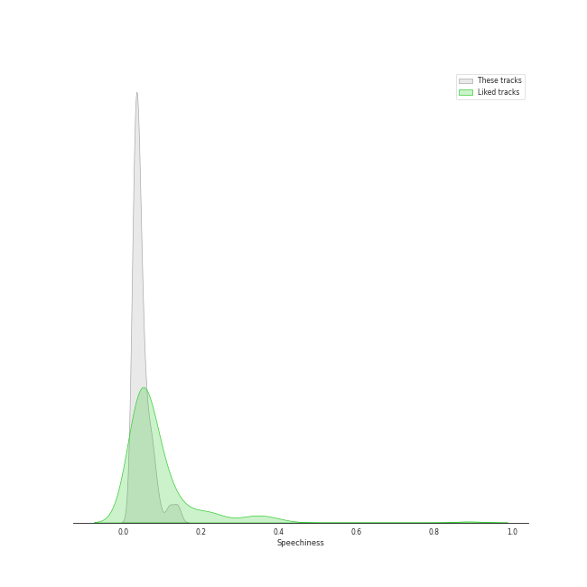
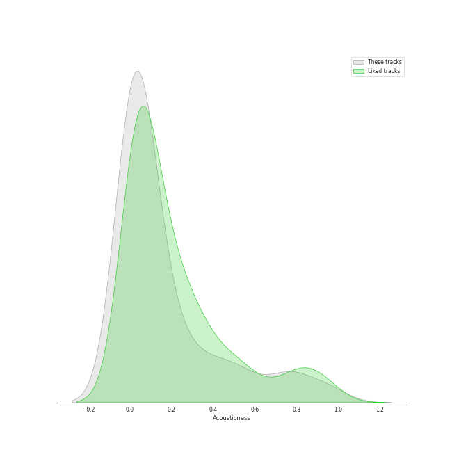
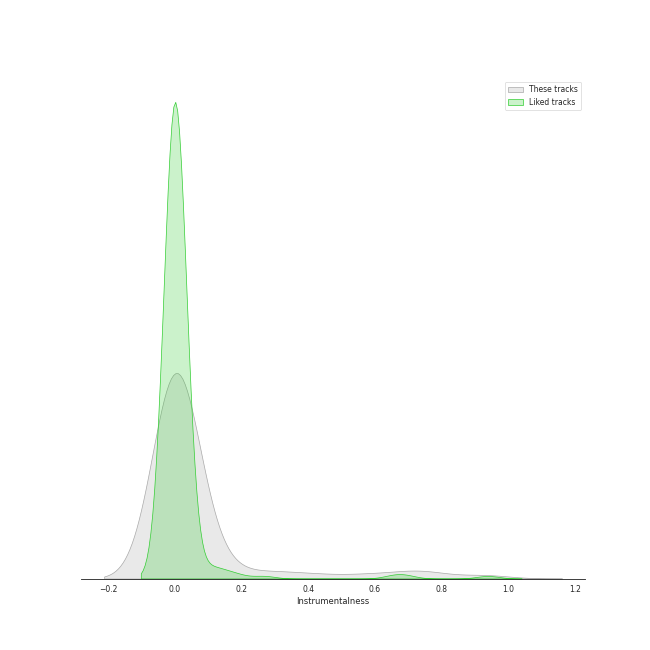

# Track Features for Modern Rock

## Danceability

| ​ | 10 most Danceable tracks | ​​ | 10 least Danceable tracks |
|:---|:---|:---|:---|
|  | Steal My Kisses (0.914) |  | Pyramid Song (0.12) |
|  | Dreadlock Holiday (0.837) |  | Fix You (0.209) |
|  | Believer (0.776) |  | Paranoid Android (0.251) |
|  | Stacy's Mom (0.774) |  | No Surprises (0.255) |
|  | 1979 - Remastered 2012 (0.767) |  | In the Aeroplane Over the Sea (0.271) |
|  | Black Horse And The Cherry Tree (0.748) |  | Exit Music (For A Film) (0.293) |
|  | Maps (0.742) |  | Everything In Its Right Place (0.296) |
|  | Payphone (0.739) |  | El Pastor (0.298) |
|  | Good Morning Judge (0.737) |  | Mykonos (0.3) |
|  | Running Out Of Time (0.736) |  | Subterranean Homesick Alien (0.312) |

## Energy

| ​ | 10 most Energetic tracks | ​​ | 10 least Energetic tracks |
|:---|:---|:---|:---|
|  | American Idiot (0.988) |  | Mad World (0.0585) |
|  | Welcome To The Jungle (0.987) |  | Hurt (0.158) |
|  | The Motherload (0.971) |  | Honeybee (0.186) |
|  | Knights of Cydonia (0.963) |  | I Will Follow You into the Dark (0.206) |
|  | We Didn’t Start The Fire (Bonus Track) (0.961) |  | Fake Plastic Trees (0.229) |
|  | The Pretender (0.959) |  | BrokEn (0.271) |
|  | Dirty Little Secret (0.954) |  | Exit Music (For A Film) (0.276) |
|  | Little Things (0.948) |  | Pyramid Song (0.336) |
|  | End Of All Hope (0.946) |  | Slow Cheetah (0.344) |
|  | Bring Me To Life (0.943) |  | Nothing Else Matters (0.364) |

## Speechiness

| ​ | 10 most Speechy tracks | ​​ | 10 least Speechy tracks |
|:---|:---|:---|:---|
|  | Knights of Cydonia (0.142) |  | Breakeven (0.0242) |
|  | Stressed Out (0.141) |  | The Scientist (0.0243) |
|  | I Write Sins Not Tragedies (0.14) |  | High and Dry (0.0256) |
|  | Believer (0.128) |  | Karma Police (0.0258) |
|  | Accidntel Deth (0.123) |  | Reckoner (0.0262) |
|  | sweet little kitty (0.118) |  | Nothing Else Matters (0.0265) |
|  | Steal My Kisses (0.113) |  | White Winter Hymnal (0.0268) |
|  | Ain't It Fun (0.0921) |  | What Sarah Said (0.0268) |
|  | Good Morning Judge (0.0916) |  | Paradise (0.0268) |
|  | Welcome To The Jungle (0.0881) |  | Californication (0.027) |

## Acousticness

| ​ | 10 most Acoustic tracks | ​​ | 10 least Acoustic tracks |
|:---|:---|:---|:---|
|  | Mad World (0.976) |  | The Motherload (7.1e-06) |
|  | The Night We Met (0.969) |  | The Phantom Of The Opera (7.33e-06) |
|  | I Will Follow You into the Dark (0.924) |  | Blood and Thunder (8.58e-06) |
|  | BrokEn (0.923) |  | Learn to Fly (1.83e-05) |
|  | Honeybee (0.871) |  | Smells Like Teen Spirit (2.55e-05) |
|  | What Sarah Said (0.801) |  | American Idiot (2.64e-05) |
|  | Pyramid Song (0.786) |  | Everlong (5.99e-05) |
|  | Hurt (0.773) |  | End Of All Hope (6.14e-05) |
|  | Weird Fishes/ Arpeggi (0.772) |  | That's What You Get (9.43e-05) |
|  | yellow is the color of her eyes (0.754) |  | Let Down (0.000121) |

## Instrumentalness

| ​ | 10 most Instrumental tracks | ​​ | 10 least Instrumental tracks |
|:---|:---|:---|:---|
|  | Ace of Aces (0.95) |  | Mr. Brightside (0.0) |
|  | A Better Son/Daughter (0.914) |  | White Winter Hymnal (0.0) |
|  | Animals (0.796) |  | Believer (0.0) |
|  | Weird Fishes/ Arpeggi (0.756) |  | Black Horse And The Cherry Tree (0.0) |
|  | Blood and Thunder (0.729) |  | sweet little kitty (0.0) |
|  | Reptilia (0.713) |  | That's What You Get (0.0) |
|  | Street Spirit (Fade Out) (0.694) |  | Sunday Morning (0.0) |
|  | Lost Kitten (0.617) |  | BrokEn (0.0) |
|  | 1979 - Remastered 2012 (0.583) |  | Me And My Broken Heart (0.0) |
|  | There, There (0.52) |  | Automatonic Electronic Harmonics (0.0) |

## Liveness

| ​ | 10 most Live tracks | ​​ | 10 least Live tracks |
|:---|:---|:---|:---|
|  | Animals (0.696) |  | Ain't It Fun (0.021) |
|  | Radioactive (0.668) |  | The Pretender (0.028) |
|  | The Night We Met (0.641) |  | Blood and Thunder (0.0317) |
|  | All The Small Things (0.612) |  | 1979 - Remastered 2012 (0.0513) |
|  | Dirty Little Secret (0.573) |  | Relimerence (0.0528) |
|  | ZITTI E BUONI (0.424) |  | Paranoid Android (0.0545) |
|  | Like A Lady (0.413) |  | The Middle (0.058) |
|  | Payphone (0.37) |  | Boulevard of Broken Dreams (0.0589) |
|  | My Happy Ending (0.369) |  | Maps (0.059) |
|  | sweet little kitty (0.369) |  | Enter Sandman (0.059) |

## Valence

| ​ | 10 most Happy tracks | ​​ | 10 least Happy tracks |
|:---|:---|:---|:---|
|  | 1979 - Remastered 2012 (0.964) |  | What Sarah Said (0.0401) |
|  | Stacy's Mom (0.927) |  | A Better Son/Daughter (0.0474) |
|  | Black Horse And The Cherry Tree (0.917) |  | Everything In Its Right Place (0.0629) |
|  | The Middle (0.903) |  | Pyramid Song (0.0679) |
|  | Ace of Aces (0.896) |  | Hurt (0.0826) |
|  | Dreadlock Holiday (0.892) |  | All I Need (0.0997) |
|  | Maps (0.879) |  | The Night We Met (0.1) |
|  | Can't Stop (0.875) |  | Creep (0.104) |
|  | Steal My Kisses (0.87) |  | No Surprises (0.118) |
|  | This Love (0.808) |  | Gimme Sympathy (0.119) |

## Tempo

| ​ | 10 most Fast tracks | ​​ | 10 least Fast tracks |
|:---|:---|:---|:---|
|  | Blue Whale - 2016 Version (200.096) |  | El Pastor (60.497) |
|  | American Idiot (186.113) |  | Pyramid Song (72.64) |
|  | Madness (180.301) |  | Fake Plastic Trees (73.543) |
|  | Slow Cheetah (178.102) |  | Karma Police (74.807) |
|  | Mad World (174.149) |  | Ride (74.989) |
|  | Me And My Broken Heart (174.084) |  | No Surprises (76.426) |
|  | sorry (173.61) |  | Can I Believe You (77.415) |
|  | Yellow (173.372) |  | Does He Love You? (78.983) |
|  | The Pretender (172.984) |  | Hurt (79.833) |
|  | Misery Business (172.977) |  | End Of All Hope (79.948) |
