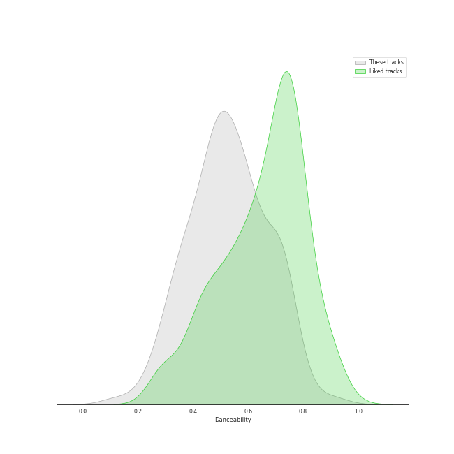
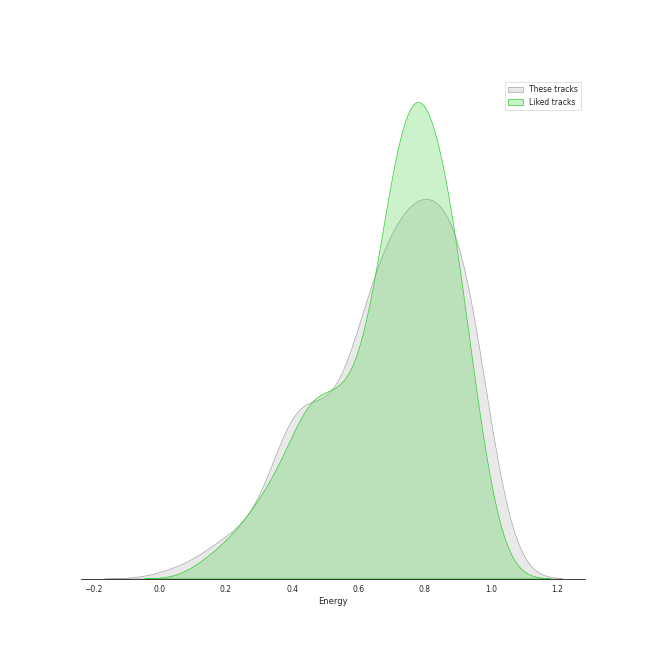
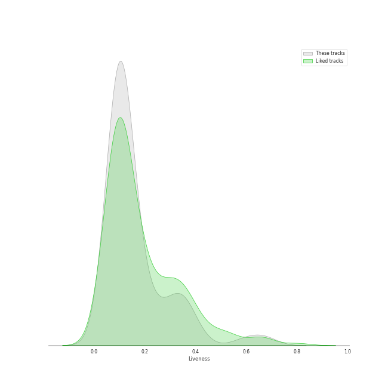
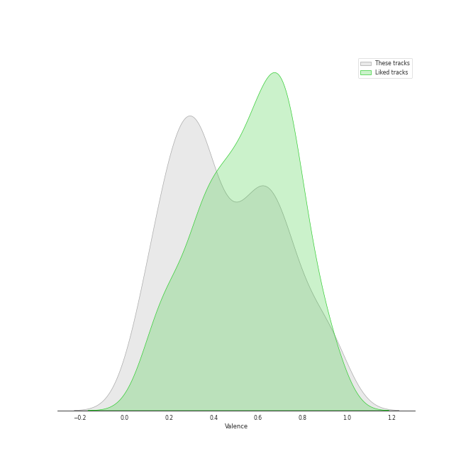
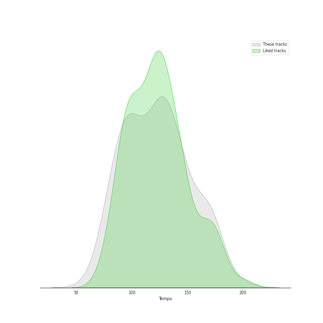

# Audio Features for Modern Rock

## Danceability

| ​ | 10 most Danceable tracks | ​​ | 10 least Danceable tracks |
|:---|:---|:---|:---|
|  | Believer (0.776) |  | Pyramid Song (0.127) |
|  | 1979 - Remastered 2012 (0.767) |  | Fix You (0.209) |
|  | Black Horse And The Cherry Tree (0.748) |  | Paranoid Android (0.251) |
|  | Maps (0.742) |  | No Surprises (0.255) |
|  | Payphone (0.739) |  | In the Aeroplane Over the Sea (0.271) |
|  | Stressed Out (0.734) |  | Exit Music (For A Film) (0.293) |
|  | Moves Like Jagger - Studio Recording From "The Voice" Performance (0.722) |  | Everything In Its Right Place (0.296) |
|  | Beggin' (0.714) |  | Does He Love You? (0.317) |
|  | This Love (0.712) |  | Mad World (0.344) |
|  | Ashes (0.712) |  | Feeling Good (0.345) |

## Energy

| ​ | 10 most Energetic tracks | ​​ | 10 least Energetic tracks |
|:---|:---|:---|:---|
|  | American Idiot (0.988) |  | Mad World (0.0585) |
|  | The Motherload (0.971) |  | Hurt (0.158) |
|  | Knights of Cydonia (0.963) |  | Honeybee (0.186) |
|  | The Pretender (0.959) |  | I Will Follow You into the Dark (0.206) |
|  | End Of All Hope (0.946) |  | Fake Plastic Trees (0.229) |
|  | Best of You (0.94) |  | Exit Music (For A Film) (0.276) |
|  | Can't Stop (0.938) |  | Pyramid Song (0.335) |
|  | My Happy Ending (0.936) |  | Slow Cheetah (0.344) |
|  | Blood and Thunder (0.935) |  | Nothing Else Matters (0.364) |
|  | Everybody Talks (0.924) |  | The Night We Met (0.366) |

## Speechiness

| ​ | 10 most Speechy tracks | ​​ | 10 least Speechy tracks |
|:---|:---|:---|:---|
|  | Knights of Cydonia (0.142) |  | Breakeven (0.0242) |
|  | Stressed Out (0.141) |  | The Scientist (0.0243) |
|  | Believer (0.128) |  | High and Dry (0.0256) |
|  | Accidntel Deth (0.123) |  | Karma Police (0.0258) |
|  | Ain't It Fun (0.0921) |  | Reckoner (0.0262) |
|  | Geronimo (0.0805) |  | Nothing Else Matters (0.0265) |
|  | The Motherload (0.0776) |  | What Sarah Said (0.0268) |
|  | My Happy Ending (0.0758) |  | Paradise (0.0268) |
|  | Gimme Sympathy (0.0752) |  | Californication (0.027) |
|  | Mr. Brightside (0.0747) |  | No Surprises (0.0278) |

## Acousticness

| ​ | 10 most Acoustic tracks | ​​ | 10 least Acoustic tracks |
|:---|:---|:---|:---|
|  | Mad World (0.976) |  | The Motherload (7.1e-06) |
|  | The Night We Met (0.969) |  | The Phantom Of The Opera (7.33e-06) |
|  | I Will Follow You into the Dark (0.924) |  | Blood and Thunder (8.58e-06) |
|  | Honeybee (0.871) |  | Learn to Fly (1.83e-05) |
|  | What Sarah Said (0.801) |  | Smells Like Teen Spirit (2.55e-05) |
|  | Pyramid Song (0.786) |  | American Idiot (2.64e-05) |
|  | Hurt (0.773) |  | Everlong (5.99e-05) |
|  | Weird Fishes/ Arpeggi (0.772) |  | End Of All Hope (6.14e-05) |
|  | Brass Goggles (0.736) |  | Let Down (0.000121) |
|  | The Scientist (0.731) |  | Nemo (0.000185) |

## Instrumentalness

| ​ | 10 most Instrumental tracks | ​​ | 10 least Instrumental tracks |
|:---|:---|:---|:---|
|  | A Better Son/Daughter (0.91) |  | Mr. Brightside (0.0) |
|  | Animals (0.796) |  | Believer (0.0) |
|  | Weird Fishes/ Arpeggi (0.756) |  | Black Horse And The Cherry Tree (0.0) |
|  | Blood and Thunder (0.729) |  | Sunday Morning (0.0) |
|  | Reptilia (0.713) |  | Me And My Broken Heart (0.0) |
|  | Street Spirit (Fade Out) (0.694) |  | Automatonic Electronic Harmonics (0.0) |
|  | 1979 - Remastered 2012 (0.583) |  | Breakeven (0.0) |
|  | There, There (0.52) |  | Ride (0.0) |
|  | All I Need (0.428) |  | Everybody Talks (0.0) |
|  | Pyramid Song (0.427) |  | Ashes (0.0) |

## Liveness

| ​ | 10 most Live tracks | ​​ | 10 least Live tracks |
|:---|:---|:---|:---|
|  | Animals (0.696) |  | Ain't It Fun (0.021) |
|  | Radioactive (0.668) |  | The Pretender (0.028) |
|  | The Night We Met (0.641) |  | Blood and Thunder (0.0317) |
|  | Payphone (0.37) |  | 1979 - Remastered 2012 (0.0513) |
|  | My Happy Ending (0.369) |  | Paranoid Android (0.0545) |
|  | American Idiot (0.368) |  | Boulevard of Broken Dreams (0.0589) |
|  | Someday (0.367) |  | Maps (0.059) |
|  | Beggin' (0.359) |  | Enter Sandman (0.059) |
|  | Brass Goggles (0.356) |  | Sunday Morning (0.0595) |
|  | Dani California (0.346) |  | Stressed Out (0.0602) |

## Valence

| ​ | 10 most Happy tracks | ​​ | 10 least Happy tracks |
|:---|:---|:---|:---|
|  | 1979 - Remastered 2012 (0.964) |  | What Sarah Said (0.0401) |
|  | Black Horse And The Cherry Tree (0.917) |  | A Better Son/Daughter (0.0473) |
|  | Maps (0.879) |  | Everything In Its Right Place (0.0629) |
|  | Can't Stop (0.875) |  | Pyramid Song (0.0686) |
|  | This Love (0.809) |  | Hurt (0.0826) |
|  | Jigsaw Falling Into Place (0.807) |  | All I Need (0.0997) |
|  | Sunday Morning (0.805) |  | The Night We Met (0.1) |
|  | Supermassive Black Hole (0.782) |  | Creep (0.104) |
|  | Reptilia (0.77) |  | No Surprises (0.118) |
|  | American Idiot (0.769) |  | Gimme Sympathy (0.119) |

## Tempo

| ​ | 10 most Fast tracks | ​​ | 10 least Fast tracks |
|:---|:---|:---|:---|
|  | American Idiot (186.113) |  | Fake Plastic Trees (73.543) |
|  | Madness (180.301) |  | Karma Police (74.807) |
|  | Slow Cheetah (178.102) |  | Ride (74.989) |
|  | Mad World (174.149) |  | No Surprises (76.426) |
|  | Me And My Broken Heart (174.084) |  | Pyramid Song (77.078) |
|  | Yellow (173.372) |  | Does He Love You? (78.983) |
|  | The Pretender (172.984) |  | Hurt (79.833) |
|  | Misery Business (172.977) |  | End Of All Hope (79.948) |
|  | My Happy Ending (170.229) |  | Other Side Of The World (80.039) |
|  | Animals (169.987) |  | I Will Follow You into the Dark (80.401) |
