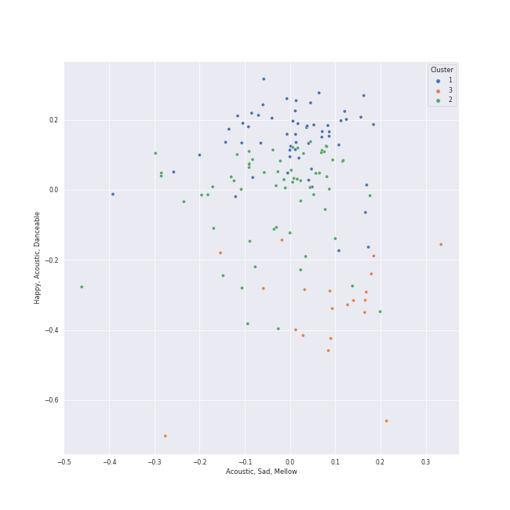

# Clusters in Modern Rock

## Cluster #1

25 tracks

| Art | Track | Album | Artists | Label | Rank | 💚 | 🔗 |
|:---|:---|:---|:---|:---|---:|:---|:---|
|  | Reckoner | In Rainbows | [Radiohead](../../../../artists/radiohead/overview.md) | [XL Recordings](../../../../labels/xl_recordings) | 892 | 💚 | [🔗](https://open.spotify.com/track/02ppMPbg1OtEdHgoPqoqju) |
|  | All I Need | In Rainbows | [Radiohead](../../../../artists/radiohead/overview.md) | [XL Recordings](../../../../labels/xl_recordings) | 892 | | [🔗](https://open.spotify.com/track/5Qv2Nby1xTr9pQyjkrc94J) |
|  | Street Spirit (Fade Out) | The Bends | [Radiohead](../../../../artists/radiohead/overview.md) | [XL Recordings](../../../../labels/xl_recordings) | 670 | 💚 | [🔗](https://open.spotify.com/track/2QwObYJWyJTiozvs0RI7CF) |
|  | Everything In Its Right Place | Kid A | [Radiohead](../../../../artists/radiohead/overview.md) | [XL Recordings](../../../../labels/xl_recordings) | 892 | 💚 | [🔗](https://open.spotify.com/track/2kRFrWaLWiKq48YYVdGcm8) |
|  | The Scientist | A Rush of Blood to the Head | [Coldplay](../../../../artists/coldplay/overview.md) | Parlophone Records Limited | 892 | 💚 | [🔗](https://open.spotify.com/track/75JFxkI2RXiU7L9VXzMkle) |
|  | Hurt | The Downward Spiral | Nine Inch Nails | TVT Records | 892 | 💚 | [🔗](https://open.spotify.com/track/1lo9k4PrxFd5Np4cAxXoKo) |
|  | Honeybee | The 2¢ Show | Steam Powered Giraffe | Steam Powered Giraffe | 207 | 💚 | [🔗](https://open.spotify.com/track/3MZjOGeXhpHbQ9ESMNFFnH) |
|  | What Sarah Said | Plans | Death Cab for Cutie | [Atlantic Records](../../../../labels/atlantic_records) | 892 | 💚 | [🔗](https://open.spotify.com/track/2JFrlsJBH4IDt3Suot97dP) |
|  | yellow is the color of her eyes | color theory | Soccer Mommy | Loma Vista Recordings | 892 | 💚 | [🔗](https://open.spotify.com/track/5EDBVVqd2ogoG89XVQOvsn) |
|  | Relimerence | Concentrate | The Happy Fits | The Happy Fits Records | 892 | 💚 | [🔗](https://open.spotify.com/track/77fgmofMCNb6Lra5ZMvEDE) |
## Cluster #2

56 tracks

| Art | Track | Album | Artists | Label | Rank | 💚 | 🔗 |
|:---|:---|:---|:---|:---|---:|:---|:---|
|  | Mr. Brightside | Hot Fuss | The Killers | [Island Records](../../../../labels/island_records) | 892 | | [🔗](https://open.spotify.com/track/003vvx7Niy0yvhvHt4a68B) |
|  | Paranoid Android | OK Computer | [Radiohead](../../../../artists/radiohead/overview.md) | [XL Recordings](../../../../labels/xl_recordings) | 270 | 💚 | [🔗](https://open.spotify.com/track/6LgJvl0Xdtc73RJ1mmpotq) |
|  | Strip My Mind | Stadium Arcadium | Red Hot Chili Peppers | [Warner Records](../../../../labels/warner_records) | 892 | | [🔗](https://open.spotify.com/track/0J3ytriezGZ3KCREfHKDOI) |
|  | Yellow | Parachutes | [Coldplay](../../../../artists/coldplay/overview.md) | [Parlophone UK](../../../../labels/parlophone_uk) | 892 | 💚 | [🔗](https://open.spotify.com/track/3AJwUDP919kvQ9QcozQPxg) |
|  | We Are | Ambitions | ONE OK ROCK | [Fueled By Ramen](../../../../labels/fueled_by_ramen) | 892 | 💚 | [🔗](https://open.spotify.com/track/57sk9X1fPLXRfkw74XNrmK) |
|  | Portions for Foxes | More Adventurous (U.S. Release) | [Rilo Kiley](../../../../artists/rilo_kiley/overview.md) | [Brute/Beaute/Warner Records](../../../../labels/warner_records) | 892 | 💚 | [🔗](https://open.spotify.com/track/4yY8JqTOQyi7K4O1QcQtBG) |
|  | Closing Time | 20th Century Masters: The Millennium Collection: Best Of Semisonic | Semisonic | [Geffen*](../../../../labels/geffen) | 892 | 💚 | [🔗](https://open.spotify.com/track/1A5V1sxyCLpKJezp75tUXn) |
|  | Cough Syrup | Young The Giant (Special Edition) | Young the Giant | Roadrunner Records | 892 | 💚 | [🔗](https://open.spotify.com/track/1UqhkbzB1kuFwt2iy4h29Q) |
|  | Breezeblocks | An Awesome Wave | alt-J | Canvasback/ATL | 349 | 💚 | [🔗](https://open.spotify.com/track/3n69hLUdIsSa1WlRmjMZlW) |
|  | The Phantom Of The Opera | Century Child | Nightwish | Spin-Farm Oy | 892 | 💚 | [🔗](https://open.spotify.com/track/2WmbbiWfFEKsSZe6E5GeVe) |
## Cluster #3

65 tracks

| Art | Track | Album | Artists | Label | Rank | 💚 | 🔗 |
|:---|:---|:---|:---|:---|---:|:---|:---|
|  | Snow (Hey Oh) | Stadium Arcadium | Red Hot Chili Peppers | [Warner Records](../../../../labels/warner_records) | 892 | 💚 | [🔗](https://open.spotify.com/track/2aibwv5hGXSgw7Yru8IYTO) |
|  | Suddenly I See | Eye To The Telescope | KT Tunstall | [Relentless/Virgin](../../../../labels/virgin_records) | 892 | | [🔗](https://open.spotify.com/track/5p9XWUdvbUzmPCukOmwoU3) |
|  | Enter Sandman | Metallica | Metallica | Blackened Recordings | 892 | 💚 | [🔗](https://open.spotify.com/track/5BIMPccDwShpXq784RJlJp) |
|  | That's What You Get | Riot! | Paramore | [Fueled By Ramen](../../../../labels/fueled_by_ramen) | 892 | | [🔗](https://open.spotify.com/track/1JdKrFyoU05abww0Zv0ayQ) |
|  | Misery Business | Riot! | Paramore | [Fueled By Ramen](../../../../labels/fueled_by_ramen) | 319 | 💚 | [🔗](https://open.spotify.com/track/6SpLc7EXZIPpy0sVko0aoU) |
|  | Ain't It Fun | Paramore | Paramore | [Fueled By Ramen](../../../../labels/fueled_by_ramen) | 892 | 💚 | [🔗](https://open.spotify.com/track/1j8z4TTjJ1YOdoFEDwJTQa) |
|  | Half of the Way | Hill Climber | Vulfpeck, Theo Katzman | Vulf Records | 892 | 💚 | [🔗](https://open.spotify.com/track/3uFp6gGgNMtSEmzx1cHTG4) |
|  | I Write Sins Not Tragedies | A Fever You Can't Sweat Out | Panic! At The Disco | [Decaydance Records / Fueled By Ramen](../../../../labels/fueled_by_ramen) | 892 | | [🔗](https://open.spotify.com/track/4bPQs0PHn4xbipzdPfn6du) |
|  | The Adults Are Talking | The New Abnormal | The Strokes | [Cult Records/RCA Records](../../../../labels/rca_records_label) | 892 | 💚 | [🔗](https://open.spotify.com/track/5ruzrDWcT0vuJIOMW7gMnW) |
|  | Smells Like Teen Spirit | Nevermind (Remastered) | Nirvana | [Geffen](../../../../labels/geffen) | 892 | | [🔗](https://open.spotify.com/track/5ghIJDpPoe3CfHMGu71E6T) |