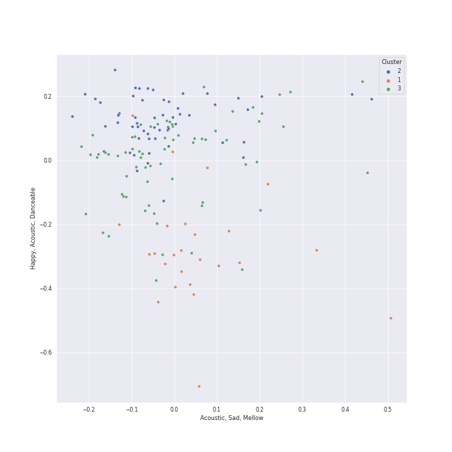

# Clusters in Modern Rock

## Cluster #1

16 tracks

| Art | Track | Album | Artists | Label | 💚 | 🔗 |
|:---|:---|:---|:---|:---|:---|:---|
|  | The Scientist | A Rush of Blood to the Head | [Coldplay](../../../../artists/coldplay/overview.md) | Parlophone Records Limited | 💚 | [🔗](https://open.spotify.com/track/75JFxkI2RXiU7L9VXzMkle) |
|  | What Sarah Said | Plans | Death Cab for Cutie | [Atlantic Records](../../../../labels/atlantic_records) | 💚 | [🔗](https://open.spotify.com/track/2JFrlsJBH4IDt3Suot97dP) |
|  | Mad World | Trading Snakeoil for Wolftickets | Gary Jules, Michael Andrews | Down Up Down Music | 💚 | [🔗](https://open.spotify.com/track/3JOVTQ5h8HGFnDdp4VT3MP) |
|  | Hurt | The Downward Spiral | Nine Inch Nails | TVT Records | 💚 | [🔗](https://open.spotify.com/track/1lo9k4PrxFd5Np4cAxXoKo) |
|  | Street Spirit (Fade Out) | The Bends | [Radiohead](../../../../artists/radiohead/overview.md) | [XL Recordings](../../../../labels/xl_recordings) | 💚 | [🔗](https://open.spotify.com/track/2QwObYJWyJTiozvs0RI7CF) |
|  | Everything In Its Right Place | Kid A | [Radiohead](../../../../artists/radiohead/overview.md) | [XL Recordings](../../../../labels/xl_recordings) | 💚 | [🔗](https://open.spotify.com/track/2kRFrWaLWiKq48YYVdGcm8) |
|  | All I Need | In Rainbows | [Radiohead](../../../../artists/radiohead/overview.md) | [XL Recordings](../../../../labels/xl_recordings) | | [🔗](https://open.spotify.com/track/5Qv2Nby1xTr9pQyjkrc94J) |
|  | Reckoner | In Rainbows | [Radiohead](../../../../artists/radiohead/overview.md) | [XL Recordings](../../../../labels/xl_recordings) | 💚 | [🔗](https://open.spotify.com/track/02ppMPbg1OtEdHgoPqoqju) |
|  | Weird Fishes/ Arpeggi | In Rainbows | [Radiohead](../../../../artists/radiohead/overview.md) | [XL Recordings](../../../../labels/xl_recordings) | | [🔗](https://open.spotify.com/track/4wajJ1o7jWIg62YqpkHC7S) |
|  | Honeybee | The 2¢ Show | Steam Powered Giraffe | Steam Powered Giraffe | 💚 | [🔗](https://open.spotify.com/track/3MZjOGeXhpHbQ9ESMNFFnH) |
## Cluster #2

49 tracks

| Art | Track | Album | Artists | Label | 💚 | 🔗 |
|:---|:---|:---|:---|:---|:---|:---|
|  | Believer | Evolve | Imagine Dragons | [Kid Ina Korner / Interscope](../../../../labels/interscope_records) | 💚 | [🔗](https://open.spotify.com/track/0pqnGHJpmpxLKifKRmU6WP) |
|  | Suddenly I See | Eye To The Telescope | KT Tunstall | [Relentless/Virgin](../../../../labels/virgin_records) | | [🔗](https://open.spotify.com/track/5p9XWUdvbUzmPCukOmwoU3) |
|  | This Love | Songs About Jane | [Maroon 5](../../../../artists/maroon_5/overview.md) | [Interscope Records*](../../../../labels/interscope_records) | 💚 | [🔗](https://open.spotify.com/track/6YgV0EF8xJMZz0Zm6BTaT4) |
|  | Enter Sandman | Metallica | Metallica | Blackened Recordings | 💚 | [🔗](https://open.spotify.com/track/5BIMPccDwShpXq784RJlJp) |
|  | Supermassive Black Hole | Black Holes and Revelations | Muse | [Warner Records](../../../../labels/warner_records) | 💚 | [🔗](https://open.spotify.com/track/3lPr8ghNDBLc2uZovNyLs9) |
|  | Ain't It Fun | Paramore | Paramore | Fueled By Ramen | 💚 | [🔗](https://open.spotify.com/track/1j8z4TTjJ1YOdoFEDwJTQa) |
|  | Young Folks | Writer's Block | Peter Bjorn and John | Universal Music AB | | [🔗](https://open.spotify.com/track/4dyx5SzxPPaD8xQIid5Wjj) |
|  | Me And My Broken Heart | Let The Road | Rixton | Silent Records/Giant Little Man | 💚 | [🔗](https://open.spotify.com/track/1oew3nFNY3vMacJAsvry0S) |
|  | Someday | Is This It | The Strokes | [RCA Records Label](../../../../labels/rca_records_label) | | [🔗](https://open.spotify.com/track/7hm4HTk9encxT0LYC0J6oI) |
|  | The Adults Are Talking | The New Abnormal | The Strokes | [Cult Records/RCA Records](../../../../labels/rca_records_label) | 💚 | [🔗](https://open.spotify.com/track/5ruzrDWcT0vuJIOMW7gMnW) |
## Cluster #3

50 tracks

| Art | Track | Album | Artists | Label | 💚 | 🔗 |
|:---|:---|:---|:---|:---|:---|:---|
|  | Yellow | Parachutes | [Coldplay](../../../../artists/coldplay/overview.md) | Parlophone UK | 💚 | [🔗](https://open.spotify.com/track/3AJwUDP919kvQ9QcozQPxg) |
|  | Paradise | Mylo Xyloto | [Coldplay](../../../../artists/coldplay/overview.md) | Parlophone UK | | [🔗](https://open.spotify.com/track/6nek1Nin9q48AVZcWs9e9D) |
|  | Nemo | Once | Nightwish | Nuclear Blast Entertainment | | [🔗](https://open.spotify.com/track/5OF7nhjVV0dmngqYjDrZGw) |
|  | Amaranth | Dark Passion Play | Nightwish | Nuclear Blast Entertainment | 💚 | [🔗](https://open.spotify.com/track/1vzqcPRQ6P1Uw7NZ5M77wJ) |
|  | Karma Police | OK Computer | [Radiohead](../../../../artists/radiohead/overview.md) | [XL Recordings](../../../../labels/xl_recordings) | 💚 | [🔗](https://open.spotify.com/track/63OQupATfueTdZMWTxW03A) |
|  | Strip My Mind | Stadium Arcadium | Red Hot Chili Peppers | [Warner Records](../../../../labels/warner_records) | | [🔗](https://open.spotify.com/track/0J3ytriezGZ3KCREfHKDOI) |
|  | Does He Love You? | More Adventurous (U.S. Release) | [Rilo Kiley](../../../../artists/rilo_kiley/overview.md) | [Brute/Beaute/Warner Records](../../../../labels/warner_records) | 💚 | [🔗](https://open.spotify.com/track/56J7o1BuXpJH2UXqElmsEF) |
|  | Portions for Foxes | More Adventurous (U.S. Release) | [Rilo Kiley](../../../../artists/rilo_kiley/overview.md) | [Brute/Beaute/Warner Records](../../../../labels/warner_records) | 💚 | [🔗](https://open.spotify.com/track/4yY8JqTOQyi7K4O1QcQtBG) |
|  | All These Things That I've Done | Hot Fuss | The Killers | [Island Records](../../../../labels/island_records) | | [🔗](https://open.spotify.com/track/5vollujufHY0jMZxx77VWr) |
|  | Cough Syrup | Young The Giant (Special Edition) | Young the Giant | Roadrunner Records | 💚 | [🔗](https://open.spotify.com/track/1UqhkbzB1kuFwt2iy4h29Q) |