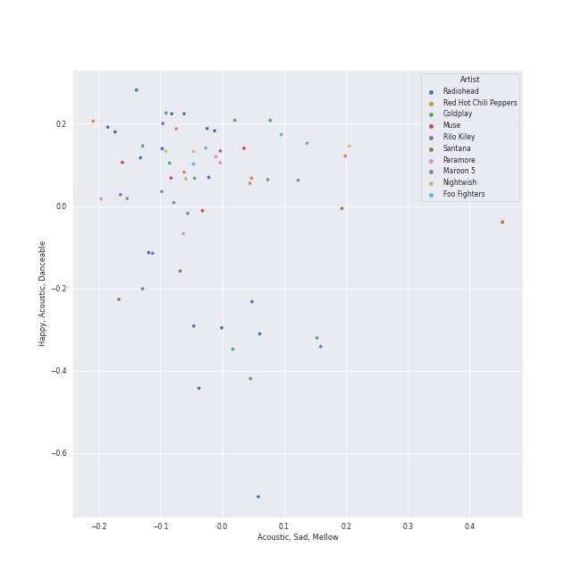
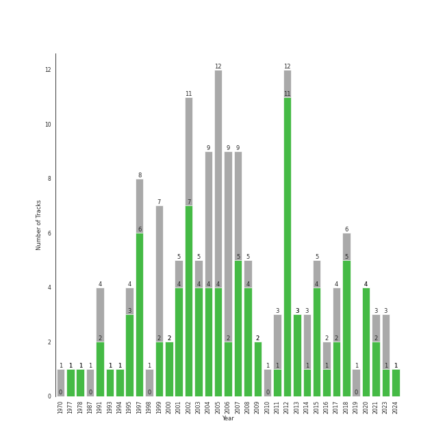

# Modern Rock

[72 songs (57 liked)](tracks.md)

## Top Artists

See all 31 artists

| Art | Tracks | 💚 | Artist | 🔗 |
|:---|---:|---:|:---|:---|
|  | 16 | 14 | [Radiohead](../../artists/radiohead) | [🔗](https://open.spotify.com/artist/4Z8W4fKeB5YxbusRsdQVPb) |
|  | 6 | 5 | Rilo Kiley | [🔗](https://open.spotify.com/artist/2cevwbv7ISD92VMNLYLHZA) |
|  | 5 | 4 | Muse | [🔗](https://open.spotify.com/artist/12Chz98pHFMPJEknJQMWvI) |
|  | 4 | 2 | Nightwish | [🔗](https://open.spotify.com/artist/2NPduAUeLVsfIauhRwuft1) |
|  | 3 | 3 | alt-J | [🔗](https://open.spotify.com/artist/3XHO7cRUPCLOr6jwp8vsx5) |
|  | 3 | 3 | Steam Powered Giraffe | [🔗](https://open.spotify.com/artist/1yqs45BSh7457Flyhmdv7f) |
|  | 3 | 2 | The Strokes | [🔗](https://open.spotify.com/artist/0epOFNiUfyON9EYx7Tpr6V) |
|  | 3 | 1 | KT Tunstall | [🔗](https://open.spotify.com/artist/5zzrJD2jXrE9dZ1AklRFcL) |
|  | 2 | 2 | Paramore | [🔗](https://open.spotify.com/artist/74XFHRwlV6OrjEM0A2NCMF) |
|  | 2 | 2 | Imagine Dragons | [🔗](https://open.spotify.com/artist/53XhwfbYqKCa1cC15pYq2q) |
|  | 2 | 2 | Twenty One Pilots | [🔗](https://open.spotify.com/artist/3YQKmKGau1PzlVlkL1iodx) |
|  | 2 | 2 | The Script | [🔗](https://open.spotify.com/artist/3AQRLZ9PuTAozP28Skbq8V) |
|  | 2 | 2 | Death Cab for Cutie | [🔗](https://open.spotify.com/artist/0YrtvWJMgSdVrk3SfNjTbx) |
|  | 2 | 1 | Metallica | [🔗](https://open.spotify.com/artist/2ye2Wgw4gimLv2eAKyk1NB) |
|  | 2 | 0 | Mastodon | [🔗](https://open.spotify.com/artist/1Dvfqq39HxvCJ3GvfeIFuT) |
|  | 1 | 1 | ONE OK ROCK | [🔗](https://open.spotify.com/artist/7k73EtZwoPs516ZxE72KsO) |
|  | 1 | 1 | The Neighbourhood | [🔗](https://open.spotify.com/artist/77SW9BnxLY8rJ0RciFqkHh) |
|  | 1 | 1 | Lord Huron | [🔗](https://open.spotify.com/artist/6ltzsmQQbmdoHHbLZ4ZN25) |
|  | 1 | 1 | Sheppard | [🔗](https://open.spotify.com/artist/6VxCmtR7S3yz4vnzsJqhSV) |
|  | 1 | 1 | Gary Jules | [🔗](https://open.spotify.com/artist/5oRnbmgqvvq7fVlgk4vcEa) |
|  | 1 | 1 | Young the Giant | [🔗](https://open.spotify.com/artist/4j56EQDQu5XnL7R3E9iFJT) |
|  | 1 | 1 | Metric | [🔗](https://open.spotify.com/artist/1rCIEwPp5OnXW0ornlSsRl) |
|  | 1 | 1 | Avril Lavigne | [🔗](https://open.spotify.com/artist/0p4nmQO2msCgU4IF37Wi3j) |
|  | 1 | 1 | Måneskin | [🔗](https://open.spotify.com/artist/0lAWpj5szCSwM4rUMHYmrr) |
|  | 1 | 1 | Rixton | [🔗](https://open.spotify.com/artist/0kkxsdcaWmWU2yWAqclDh4) |
|  | 1 | 1 | Nine Inch Nails | [🔗](https://open.spotify.com/artist/0X380XXQSNBYuleKzav5UO) |
|  | 1 | 1 | Neon Trees | [🔗](https://open.spotify.com/artist/0RpddSzUHfncUWNJXKOsjy) |
|  | 1 | 1 | Michael Andrews | [🔗](https://open.spotify.com/artist/0RkqytrwoGyXGvDiZwT6i2) |
|  | 1 | 0 | Peter Bjorn and John | [🔗](https://open.spotify.com/artist/6u11Qbko2N2hP4lTBYjX86) |
|  | 1 | 0 | The Smashing Pumpkins | [🔗](https://open.spotify.com/artist/40Yq4vzPs9VNUrIBG5Jr2i) |
|  | 1 | 0 | Neutral Milk Hotel | [🔗](https://open.spotify.com/artist/2ooIqOf4X2uz4mMptXCtie) |

## Top Albums

See all 48 albums

| Art | Tracks | 💚 | Album | Release Date | 🔗 |
|:---|---:|---:|:---|:---|:---|
|  | 5 | 5 | OK Computer | 1997-05-28 | [🔗](https://open.spotify.com/album/6dVIqQ8qmQ5GBnJ9shOYGE) |
|  | 4 | 2 | In Rainbows | 2007-12-28 | [🔗](https://open.spotify.com/album/5vkqYmiPBYLaalcmjujWxK) |
|  | 3 | 3 | The Bends | 1995-03-13 | [🔗](https://open.spotify.com/album/35UJLpClj5EDrhpNIi4DFg) |
|  | 3 | 3 | More Adventurous (U.S. Release) | 2004-07-27 | [🔗](https://open.spotify.com/album/4n36X2GMJ84BKh9D9zMRVI) |
|  | 3 | 3 | An Awesome Wave | 2012-09-18 | [🔗](https://open.spotify.com/album/6k3vC8nep1BfqAIJ81L6OL) |
|  | 3 | 1 | Eye To The Telescope | 2005-01-01 | [🔗](https://open.spotify.com/album/3j70PDKieTWQAwas3bPHRZ) |
|  | 2 | 2 | The Script | 2008-07-14 | [🔗](https://open.spotify.com/album/1r5J0N6Ep181K0i8YuTYgO) |
|  | 2 | 2 | The 2¢ Show | 2012-05-23 | [🔗](https://open.spotify.com/album/4DECRyKlhKJgjZLLuvfAI6) |
|  | 2 | 2 | The 2nd Law | 2012-09-24 | [🔗](https://open.spotify.com/album/3KuXEGcqLcnEYWnn3OEGy0) |
|  | 2 | 2 | Plans | 2005-08-29 | [🔗](https://open.spotify.com/album/1NFGnxmeIEBakre4DvLaJq) |
|  | 2 | 2 | Blurryface | 2015-05-15 | [🔗](https://open.spotify.com/album/3cQO7jp5S9qLBoIVtbkSM1) |
|  | 2 | 1 | The Execution Of All Things | 2002-10-01 | [🔗](https://open.spotify.com/album/23EqcK0ZR1ravQaEsGpQyH) |
|  | 2 | 1 | Metallica | 1991-08-12 | [🔗](https://open.spotify.com/album/6QdCohkHKNTVoaSx1ZzitH) |
|  | 2 | 1 | Century Child | 2002 | [🔗](https://open.spotify.com/album/4FFDudC4xBVF6MYJUynRsN) |
|  | 2 | 1 | Black Holes and Revelations | 2006-06-19 | [🔗](https://open.spotify.com/album/0lw68yx3MhKflWFqCsGkIs) |
|  | 1 | 1 | Young The Giant (Special Edition) | 2011 | [🔗](https://open.spotify.com/album/2ww7MYrkExsljnKhcINDse) |
|  | 1 | 1 | Under The Blacklight (Standard Version) | 2007-08-20 | [🔗](https://open.spotify.com/album/2f9RsTZpsYMLRVZBtW7En8) |
|  | 1 | 1 | Under My Skin | 2004 | [🔗](https://open.spotify.com/album/7851Vsjv3apS52sXUik6iF) |
|  | 1 | 1 | Trading Snakeoil for Wolftickets | 2001-01-01 | [🔗](https://open.spotify.com/album/1OydCrx4m7fguwcX4stR9z) |
|  | 1 | 1 | The New Abnormal | 2020-04-10 | [🔗](https://open.spotify.com/album/2xkZV2Hl1Omi8rk2D7t5lN) |
|  | 1 | 1 | The Downward Spiral | 1994-03-08 | [🔗](https://open.spotify.com/album/3nJnyDV8fwFpffo0EyHQto) |
|  | 1 | 1 | Strange Trails | 2015-04-07 | [🔗](https://open.spotify.com/album/3yoNZlqerJnsnMN5EDwwBS) |
|  | 1 | 1 | Room On Fire | 2003-10-28 | [🔗](https://open.spotify.com/album/3HFbH1loOUbqCyPsLuHLLh) |
|  | 1 | 1 | Riot! | 2007-06-11 | [🔗](https://open.spotify.com/album/71rziY9eLo1tA2dBMxrwhc) |
|  | 1 | 1 | Picture Show | 2012-01-01 | [🔗](https://open.spotify.com/album/0uRFz92JmjwDbZbB7hEBIr) |
|  | 1 | 1 | Paramore | 2013-04-05 | [🔗](https://open.spotify.com/album/4sgYpkIASM1jVlNC8Wp9oF) |
|  | 1 | 1 | Pablo Honey | 1993-02-22 | [🔗](https://open.spotify.com/album/3gBVdu4a1MMJVMy6vwPEb8) |
|  | 1 | 1 | Origin of Symmetry | 2001 | [🔗](https://open.spotify.com/album/1AP6uGYHdakRgwuWQsP5pK) |
|  | 1 | 1 | Night Visions | 2012-09-04 | [🔗](https://open.spotify.com/album/6htgf3qv7vGcsdxLCDxKp8) |
|  | 1 | 1 | Let The Road | 2014-01-01 | [🔗](https://open.spotify.com/album/02ae5i5UAoFrt2peVox9Xd) |
|  | 1 | 1 | Kid A | 2000-10-02 | [🔗](https://open.spotify.com/album/6GjwtEZcfenmOf6l18N7T7) |
|  | 1 | 1 | I Love You. | 2013-04-19 | [🔗](https://open.spotify.com/album/4xkM0BwLM9H2IUcbYzpcBI) |
|  | 1 | 1 | Hail To the Thief | 2003-06-09 | [🔗](https://open.spotify.com/album/5mzoI3VH0ZWk1pLFR6RoYy) |
|  | 1 | 1 | Fantasies | 2009-04-14 | [🔗](https://open.spotify.com/album/3Oj8FdHcV6kAiOVWfkqRaA) |
|  | 1 | 1 | Evolve | 2017-06-23 | [🔗](https://open.spotify.com/album/33pt9HBdGlAbRGBHQgsZsU) |
|  | 1 | 1 | Dark Passion Play | 2007 | [🔗](https://open.spotify.com/album/4oOfQhhbHBfIcIDwuJjwTy) |
|  | 1 | 1 | Chosen | 2017-12-08 | [🔗](https://open.spotify.com/album/2qJw6w5XwQO0PQlSWPu7Tw) |
|  | 1 | 1 | Bombs Away | 2015-03-10 | [🔗](https://open.spotify.com/album/2Yi29VOccHCwktsZNqtxbt) |
|  | 1 | 1 | Amnesiac | 2001-03-12 | [🔗](https://open.spotify.com/album/6V9YnBmFjWmXCBaUVRCVXP) |
|  | 1 | 1 | Ambitions | 2017-01-13 | [🔗](https://open.spotify.com/album/0p1YL9nzIuKTonZH6Gq58i) |
|  | 1 | 1 | Album One | 2009-10-30 | [🔗](https://open.spotify.com/album/60nJMMPYjHWNjli6APs40v) |
|  | 1 | 0 | Writer's Block | 2006-01-01 | [🔗](https://open.spotify.com/album/5g4E06cxsFEMFE9hSekAt2) |
|  | 1 | 0 | Once More 'Round the Sun | 2014-06-20 | [🔗](https://open.spotify.com/album/7mEkBi9a2p2f1WQbnH8Qk5) |
|  | 1 | 0 | Once | 2004-01-04 | [🔗](https://open.spotify.com/album/0aDCpYtFdQ0S8C3oAtOonk) |
|  | 1 | 0 | Mellon Collie And The Infinite Sadness (Deluxe Edition) | 1995 | [🔗](https://open.spotify.com/album/55RhFRyQFihIyGf61MgcfV) |
|  | 1 | 0 | Leviathan | 2004-08-31 | [🔗](https://open.spotify.com/album/6khFoLWnJZDQvZ7Pijym3b) |
|  | 1 | 0 | Is This It | 2001-07-30 | [🔗](https://open.spotify.com/album/2k8KgmDp9oHrmu0MIj4XDE) |
|  | 1 | 0 | In the Aeroplane Over the Sea | 1998-02-20 | [🔗](https://open.spotify.com/album/0vVekV45lOaVKs6RZQQNob) |

## Top Record Labels

See all 36 labels

| Tracks | 💚 | Label |
|---:|---:|:---|
| 16 | 14 | [XL Recordings](../../labels/xl_recordings) |
| 9 | 8 | [Warner Records](../../labels/warner_records) |
| 5 | 5 | Fueled By Ramen |
| 4 | 3 | [RCA Records Label](../../labels/rca_records_label) |
| 4 | 1 | [Virgin Records](../../labels/virgin_records) |
| 3 | 3 | Steam Powered Giraffe |
| 3 | 3 | Canvasback |
| 3 | 3 | Brute |
| 3 | 3 | Beaute |
| 3 | 3 | ATL |
| 3 | 1 | Relentless |
| 2 | 2 | Phonogenic |
| 2 | 2 | Kid Ina Korner |
| 2 | 2 | [Interscope Records](../../labels/interscope_records) |
| 2 | 2 | [Epic](../../labels/epic) |
| 2 | 2 | [Atlantic Records](../../labels/atlantic_records) |
| 2 | 1 | Spin-Farm Oy |
| 2 | 1 | Saddle Creek |
| 2 | 1 | Nuclear Blast Entertainment |
| 2 | 1 | Blackened Recordings |
| 1 | 1 | TVT Records |
| 1 | 1 | Silent Records |
| 1 | 1 | Roadrunner Records |
| 1 | 1 | Metric Music International |
| 1 | 1 | Mercury Records |
| 1 | 1 | IAMSOUND |
| 1 | 1 | Giant Little Man |
| 1 | 1 | Down Up Down Music |
| 1 | 1 | [Decca (UMO)](../../labels/decca__umo_) |
| 1 | 1 | Cult Records |
| 1 | 1 | [Columbia](../../labels/columbia) |
| 1 | 1 | Arista |
| 1 | 0 | Universal Music AB |
| 1 | 0 | [Reprise](../../labels/reprise) |
| 1 | 0 | Relapse Records |
| 1 | 0 | Merge Records |

## Genres

See all 81 genres

| Tracks | 💚 | Genre |
|---:|---:|:---|
| 34 | 28 | [rock](../../genres/rock) |
| 25 | 20 | permanent wave |
| 22 | 19 | modern rock |
| 22 | 17 | alternative rock |
| 16 | 14 | oxford indie |
| 16 | 14 | melancholia |
| 16 | 14 | art rock |
| 14 | 11 | indie rock |
| 10 | 7 | indie pop |
| 9 | 6 | [pop rock](../../genres/pop_rock) |
| 9 | 6 | [lilith](../../genres/lilith) |
| 7 | 5 | anti-folk |
| 6 | 6 | [pop](../../genres/pop) |
| 6 | 5 | la indie |
| 6 | 4 | [neo mellow](../../genres/neo_mellow) |
| 4 | 4 | [dance pop](../../genres/dance_pop) |
| 4 | 2 | symphonic metal |
| 4 | 2 | power metal |
| 4 | 2 | opera metal |
| 4 | 2 | gothic symphonic metal |
| 4 | 2 | gothic metal |
| 4 | 2 | finnish power metal |
| 4 | 2 | finnish metal |
| 4 | 1 | metal |
| 4 | 1 | alternative metal |
| 3 | 3 | steampunk |
| 3 | 3 | modern alternative rock |
| 3 | 3 | comic |
| 3 | 3 | candy pop |
| 3 | 2 | stomp and holler |
| 3 | 2 | garage rock |
| 3 | 1 | scottish singer-songwriter |
| 3 | 1 | nu metal |
| 3 | 1 | [acoustic pop](../../genres/acoustic_pop) |
| 2 | 2 | washington indie |
| 2 | 2 | [post-teen pop](../../genres/post_teen_pop) |
| 2 | 2 | pop punk |
| 2 | 2 | pop emo |
| 2 | 2 | pixie |
| 2 | 2 | celtic rock |
| 2 | 1 | thrash metal |
| 2 | 1 | old school thrash |
| 2 | 1 | hard rock |
| 2 | 0 | stoner metal |
| 2 | 0 | sludge metal |
| 2 | 0 | progressive sludge |
| 2 | 0 | progressive groove metal |
| 2 | 0 | atlanta metal |
| 1 | 1 | visual kei |
| 1 | 1 | shimmer pop |
| 1 | 1 | neo-synthpop |
| 1 | 1 | metropopolis |
| 1 | 1 | japanese emo |
| 1 | 1 | j-rock |
| 1 | 1 | j-poprock |
| 1 | 1 | j-pop |
| 1 | 1 | italian pop |
| 1 | 1 | industrial rock |
| 1 | 1 | industrial metal |
| 1 | 1 | industrial |
| 1 | 1 | indie rock italiano |
| 1 | 1 | indie poptimism |
| 1 | 1 | folk-pop |
| 1 | 1 | [electropop](../../genres/electropop) |
| 1 | 1 | electronic rock |
| 1 | 1 | cyberpunk |
| 1 | 1 | canadian rock |
| 1 | 1 | canadian pop |
| 1 | 1 | canadian indie |
| 1 | 1 | australian pop |
| 1 | 1 | australian indie |
| 1 | 0 | swedish indie pop |
| 1 | 0 | swedish alternative rock |
| 1 | 0 | spacegrunge |
| 1 | 0 | new rave |
| 1 | 0 | lo-fi |
| 1 | 0 | grunge |
| 1 | 0 | elephant 6 |
| 1 | 0 | chamber pop |
| 1 | 0 | baroque pop |
| 1 | 0 | alternative dance |

## Years

| 10 newest albums | 10 oldest albums |
|:---|:---|
| 
 The New Abnormal (2020-04-10)
 | 
 Metallica (1991-08-12)
 |
| 
 Chosen (2017-12-08)
 | 
 Pablo Honey (1993-02-22)
 |
| 
 Evolve (2017-06-23)
 | 
 The Downward Spiral (1994-03-08)
 |
| 
 Ambitions (2017-01-13)
 | 
 Mellon Collie And The Infinite Sadness (Deluxe Edition) (1995)
 |
| 
 Blurryface (2015-05-15)
 | 
 The Bends (1995-03-13)
 |
| 
 Strange Trails (2015-04-07)
 | 
 OK Computer (1997-05-28)
 |
| 
 Bombs Away (2015-03-10)
 | 
 In the Aeroplane Over the Sea (1998-02-20)
 |
| 
 Once More 'Round the Sun (2014-06-20)
 | 
 Kid A (2000-10-02)
 |
| 
 Let The Road (2014-01-01)
 | 
 Origin of Symmetry (2001)
 |
| 
 I Love You. (2013-04-19)
 | 
 Trading Snakeoil for Wolftickets (2001-01-01)
 |
## Audio Features

| 10 most Danceable tracks | 10 least Danceable tracks |
|:---|:---|
| Believer (0.776) | Pyramid Song (0.127) |
| 1979 - Remastered 2012 (0.767) | Paranoid Android (0.251) |
| Black Horse And The Cherry Tree (0.748) | No Surprises (0.255) |
| Stressed Out (0.734) | In the Aeroplane Over the Sea (0.271) |
| Beggin' (0.714) | Exit Music (For A Film) (0.293) |
| Silver Lining (0.709) | Everything In Its Right Place (0.296) |
| Geronimo (0.705) | Does He Love You? (0.317) |
| Tessellate (0.702) | Mad World (0.344) |
| Young Folks (0.699) | Feeling Good (0.345) |
| All I Need (0.67) | Let Down (0.351) |

| 10 most Energetic tracks | 10 least Energetic tracks |
|:---|:---|
| The Motherload (0.971) | Mad World (0.0585) |
| Knights of Cydonia (0.963) | Hurt (0.158) |
| End Of All Hope (0.946) | Honeybee (0.186) |
| My Happy Ending (0.936) | I Will Follow You into the Dark (0.206) |
| Blood and Thunder (0.935) | Fake Plastic Trees (0.229) |
| Everybody Talks (0.924) | Exit Music (For A Film) (0.276) |
| Supermassive Black Hole (0.921) | Pyramid Song (0.335) |
| Misery Business (0.906) | Nothing Else Matters (0.364) |
| Ain't It Fun (0.893) | The Night We Met (0.366) |
| Gimme Sympathy (0.886) | High and Dry (0.383) |

| 10 most Speechy tracks | 10 least Speechy tracks |
|:---|:---|
| Knights of Cydonia (0.142) | Breakeven (0.0242) |
| Stressed Out (0.141) | High and Dry (0.0256) |
| Believer (0.128) | Karma Police (0.0258) |
| Accidntel Deth (0.123) | Reckoner (0.0262) |
| Ain't It Fun (0.0921) | Nothing Else Matters (0.0265) |
| Geronimo (0.0805) | What Sarah Said (0.0268) |
| The Motherload (0.0776) | No Surprises (0.0278) |
| My Happy Ending (0.0758) | The Man Who Can't Be Moved (0.0279) |
| Gimme Sympathy (0.0752) | Silver Lining (0.0288) |
| Misery Business (0.0735) | Fake Plastic Trees (0.0297) |

| 10 most Acoustic tracks | 10 least Acoustic tracks |
|:---|:---|
| Mad World (0.976) | The Motherload (7.1e-06) |
| The Night We Met (0.969) | The Phantom Of The Opera (7.33e-06) |
| I Will Follow You into the Dark (0.924) | Blood and Thunder (8.58e-06) |
| Honeybee (0.871) | End Of All Hope (6.14e-05) |
| What Sarah Said (0.801) | Let Down (0.000121) |
| Pyramid Song (0.786) | Nemo (0.000185) |
| Hurt (0.773) | Knights of Cydonia (0.000273) |
| Weird Fishes/ Arpeggi (0.772) | Reptilia (0.000603) |
| Brass Goggles (0.736) | Portions for Foxes (0.000938) |
| Everything In Its Right Place (0.705) | My Happy Ending (0.00136) |

| 10 most Instrumental tracks | 10 least Instrumental tracks |
|:---|:---|
| A Better Son/Daughter (0.91) | Believer (0.0) |
| Animals (0.796) | Black Horse And The Cherry Tree (0.0) |
| Weird Fishes/ Arpeggi (0.756) | Me And My Broken Heart (0.0) |
| Blood and Thunder (0.729) | Automatonic Electronic Harmonics (0.0) |
| Reptilia (0.713) | Breakeven (0.0) |
| Street Spirit (Fade Out) (0.694) | Ride (0.0) |
| 1979 - Remastered 2012 (0.583) | Everybody Talks (0.0) |
| There, There (0.52) | Beggin' (0.0) |
| All I Need (0.428) | I Will Follow You into the Dark (0.0) |
| Pyramid Song (0.427) | The Man Who Can't Be Moved (0.0) |

| 10 most Live tracks | 10 least Live tracks |
|:---|:---|
| Animals (0.696) | Ain't It Fun (0.021) |
| Radioactive (0.668) | Blood and Thunder (0.0317) |
| The Night We Met (0.641) | 1979 - Remastered 2012 (0.0513) |
| My Happy Ending (0.369) | Paranoid Android (0.0545) |
| Someday (0.367) | Enter Sandman (0.059) |
| Beggin' (0.359) | Stressed Out (0.0602) |
| Brass Goggles (0.356) | Reckoner (0.0679) |
| Black Horse And The Cherry Tree (0.34) | The Execution Of All Things (0.0686) |
| End Of All Hope (0.333) | Jigsaw Falling Into Place (0.0741) |
| The Adults Are Talking (0.314) | Nothing Else Matters (0.0753) |

| 10 most Happy tracks | 10 least Happy tracks |
|:---|:---|
| 1979 - Remastered 2012 (0.964) | What Sarah Said (0.0401) |
| Black Horse And The Cherry Tree (0.917) | A Better Son/Daughter (0.0473) |
| Jigsaw Falling Into Place (0.807) | Everything In Its Right Place (0.0629) |
| Supermassive Black Hole (0.782) | Pyramid Song (0.0686) |
| Reptilia (0.77) | Hurt (0.0826) |
| My Happy Ending (0.74) | All I Need (0.0997) |
| Misery Business (0.731) | The Night We Met (0.1) |
| Everybody Talks (0.725) | Creep (0.104) |
| There, There (0.716) | No Surprises (0.118) |
| Silver Lining (0.692) | Gimme Sympathy (0.119) |
