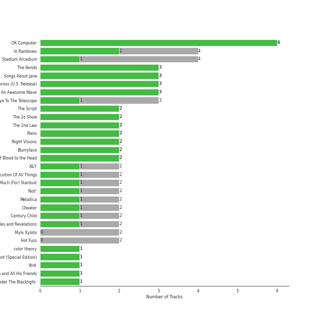
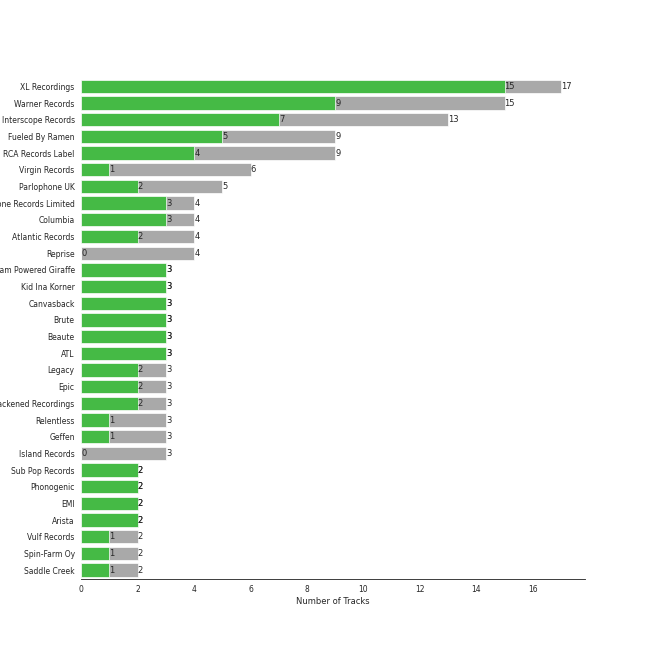

# Modern Rock

[120 tracks (73 liked) 🔗](https://open.spotify.com/playlist/1PjJceUCPGCW1uMWAs5dMe)

[See Track Features](audio_features.md)

[See Clusters](clusters/overview.md)

## Top Artists

| Art | Tracks | 💚 | Artist | 🔗 |
|:---|---:|---:|:---|:---|
|  | 16 | 14 | [Radiohead](../../artists/radiohead/overview.md) | [🔗](https://open.spotify.com/artist/4Z8W4fKeB5YxbusRsdQVPb) |
|  | 8 | 5 | [Coldplay](../../artists/coldplay/overview.md) | [🔗](https://open.spotify.com/artist/4gzpq5DPGxSnKTe4SA8HAU) |
|  | 6 | 5 | [Rilo Kiley](../../artists/rilo_kiley/overview.md) | [🔗](https://open.spotify.com/artist/2cevwbv7ISD92VMNLYLHZA) |
|  | 5 | 4 | Muse | [🔗](https://open.spotify.com/artist/12Chz98pHFMPJEknJQMWvI) |
|  | 6 | 3 | [Maroon 5](../../artists/maroon_5/overview.md) | [🔗](https://open.spotify.com/artist/04gDigrS5kc9YWfZHwBETP) |
|  | 3 | 3 | Imagine Dragons | [🔗](https://open.spotify.com/artist/53XhwfbYqKCa1cC15pYq2q) |
|  | 3 | 3 | alt-J | [🔗](https://open.spotify.com/artist/3XHO7cRUPCLOr6jwp8vsx5) |
|  | 3 | 3 | Steam Powered Giraffe | [🔗](https://open.spotify.com/artist/1yqs45BSh7457Flyhmdv7f) |
|  | 4 | 2 | Nightwish | [🔗](https://open.spotify.com/artist/2NPduAUeLVsfIauhRwuft1) |
|  | 3 | 2 | Paramore | [🔗](https://open.spotify.com/artist/74XFHRwlV6OrjEM0A2NCMF) |

See all 54 artists

| Art | Tracks | 💚 | Artist | 🔗 |
|:---|---:|---:|:---|:---|
|  | 3 | 2 | Twenty One Pilots | [🔗](https://open.spotify.com/artist/3YQKmKGau1PzlVlkL1iodx) |
|  | 3 | 2 | Metallica | [🔗](https://open.spotify.com/artist/2ye2Wgw4gimLv2eAKyk1NB) |
|  | 3 | 2 | The Strokes | [🔗](https://open.spotify.com/artist/0epOFNiUfyON9EYx7Tpr6V) |
|  | 2 | 2 | The Script | [🔗](https://open.spotify.com/artist/3AQRLZ9PuTAozP28Skbq8V) |
|  | 2 | 2 | Metric | [🔗](https://open.spotify.com/artist/1rCIEwPp5OnXW0ornlSsRl) |
|  | 2 | 2 | Death Cab for Cutie | [🔗](https://open.spotify.com/artist/0YrtvWJMgSdVrk3SfNjTbx) |
|  | 6 | 1 | Red Hot Chili Peppers | [🔗](https://open.spotify.com/artist/0L8ExT028jH3ddEcZwqJJ5) |
|  | 3 | 1 | KT Tunstall | [🔗](https://open.spotify.com/artist/5zzrJD2jXrE9dZ1AklRFcL) |
|  | 1 | 1 | ONE OK ROCK | [🔗](https://open.spotify.com/artist/7k73EtZwoPs516ZxE72KsO) |
|  | 1 | 1 | The Neighbourhood | [🔗](https://open.spotify.com/artist/77SW9BnxLY8rJ0RciFqkHh) |
|  | 1 | 1 | Lord Huron | [🔗](https://open.spotify.com/artist/6ltzsmQQbmdoHHbLZ4ZN25) |
|  | 1 | 1 | Sheppard | [🔗](https://open.spotify.com/artist/6VxCmtR7S3yz4vnzsJqhSV) |
|  | 1 | 1 | Stellar | [🔗](https://open.spotify.com/artist/5yw4tA8D5uG7tT3NaDvq10) |
|  | 1 | 1 | Gary Jules | [🔗](https://open.spotify.com/artist/5oRnbmgqvvq7fVlgk4vcEa) |
|  | 1 | 1 | Evanescence | [🔗](https://open.spotify.com/artist/5nGIFgo0shDenQYSE0Sn7c) |
|  | 1 | 1 | Young the Giant | [🔗](https://open.spotify.com/artist/4j56EQDQu5XnL7R3E9iFJT) |
|  | 1 | 1 | Jimmy Eat World | [🔗](https://open.spotify.com/artist/3Ayl7mCk0nScecqOzvNp6s) |
|  | 1 | 1 | Avril Lavigne | [🔗](https://open.spotify.com/artist/0p4nmQO2msCgU4IF37Wi3j) |
|  | 1 | 1 | Måneskin | [🔗](https://open.spotify.com/artist/0lAWpj5szCSwM4rUMHYmrr) |
|  | 1 | 1 | Rixton | [🔗](https://open.spotify.com/artist/0kkxsdcaWmWU2yWAqclDh4) |
|  | 1 | 1 | Nine Inch Nails | [🔗](https://open.spotify.com/artist/0X380XXQSNBYuleKzav5UO) |
|  | 1 | 1 | Neon Trees | [🔗](https://open.spotify.com/artist/0RpddSzUHfncUWNJXKOsjy) |
|  | 1 | 1 | Michael Andrews | [🔗](https://open.spotify.com/artist/0RkqytrwoGyXGvDiZwT6i2) |
|  | 1 | 1 | Delta Sleep | [🔗](https://open.spotify.com/artist/05MlomiA9La0OiNIAGqECk) |
|  | 4 | 0 | Foo Fighters | [🔗](https://open.spotify.com/artist/7jy3rLJdDQY21OgRLCZ9sD) |
|  | 3 | 0 | Green Day | [🔗](https://open.spotify.com/artist/7oPftvlwr6VrsViSDV7fJY) |
|  | 2 | 0 | The All-American Rejects | [🔗](https://open.spotify.com/artist/3vAaWhdBR38Q02ohXqaNHT) |
|  | 2 | 0 | Mastodon | [🔗](https://open.spotify.com/artist/1Dvfqq39HxvCJ3GvfeIFuT) |
|  | 2 | 0 | The Killers | [🔗](https://open.spotify.com/artist/0C0XlULifJtAgn6ZNCW2eu) |
|  | 1 | 0 | Ben Harper And The Innocent Criminals | [🔗](https://open.spotify.com/artist/7sJ9LR0mCMgFlzJ6Y9xP64) |
|  | 1 | 0 | Peter Bjorn and John | [🔗](https://open.spotify.com/artist/6u11Qbko2N2hP4lTBYjX86) |
|  | 1 | 0 | Nirvana | [🔗](https://open.spotify.com/artist/6olE6TJLqED3rqDCT0FyPh) |
|  | 1 | 0 | blink-182 | [🔗](https://open.spotify.com/artist/6FBDaR13swtiWwGhX1WQsP) |
|  | 1 | 0 | [Rihanna](../../artists/rihanna/overview.md) | [🔗](https://open.spotify.com/artist/5pKCCKE2ajJHZ9KAiaK11H) |
|  | 1 | 0 | Fall Out Boy | [🔗](https://open.spotify.com/artist/4UXqAaa6dQYAk18Lv7PEgX) |
|  | 1 | 0 | The Smashing Pumpkins | [🔗](https://open.spotify.com/artist/40Yq4vzPs9VNUrIBG5Jr2i) |
|  | 1 | 0 | cherryfilter | [🔗](https://open.spotify.com/artist/3uk3Jz2yT37niCo3c5GMf2) |
|  | 1 | 0 | Neutral Milk Hotel | [🔗](https://open.spotify.com/artist/2ooIqOf4X2uz4mMptXCtie) |
|  | 1 | 0 | Panic! At The Disco | [🔗](https://open.spotify.com/artist/20JZFwl6HVl6yg8a4H3ZqK) |
|  | 1 | 0 | Fountains Of Wayne | [🔗](https://open.spotify.com/artist/1pgtr4nhBQjp9oCUBPyYWh) |
|  | 1 | 0 | Christina Aguilera | [🔗](https://open.spotify.com/artist/1l7ZsJRRS8wlW3WfJfPfNS) |
|  | 1 | 0 | Hannah Georgas | [🔗](https://open.spotify.com/artist/1ZBR8sri8ddYowXDENBwKS) |
|  | 1 | 0 | Wiz Khalifa | [🔗](https://open.spotify.com/artist/137W8MRPWKqSmrBGDBFSop) |
|  | 1 | 0 | Northcote | [🔗](https://open.spotify.com/artist/0238bOScDVbMG0RBP2NguG) |

## Top Albums

| Art | Tracks | 💚 | Album | Release Date | 🔗 |
|:---|---:|---:|:---|:---|:---|
|  | 5 | 5 | OK Computer | 1997-05-28 | [🔗](https://open.spotify.com/album/6dVIqQ8qmQ5GBnJ9shOYGE) |
|  | 4 | 2 | In Rainbows | 2007-12-28 | [🔗](https://open.spotify.com/album/5vkqYmiPBYLaalcmjujWxK) |
|  | 4 | 1 | Stadium Arcadium | 2006-05-09 | [🔗](https://open.spotify.com/album/7xl50xr9NDkd3i2kBbzsNZ) |
|  | 3 | 3 | The Bends | 1995-03-13 | [🔗](https://open.spotify.com/album/35UJLpClj5EDrhpNIi4DFg) |
|  | 3 | 3 | Songs About Jane | 2002-06-25 | [🔗](https://open.spotify.com/album/1Rv9WRKyYhFaGbuYDaQunN) |
|  | 3 | 3 | More Adventurous (U.S. Release) | 2004-07-27 | [🔗](https://open.spotify.com/album/4n36X2GMJ84BKh9D9zMRVI) |
|  | 3 | 3 | An Awesome Wave | 2012-09-18 | [🔗](https://open.spotify.com/album/6k3vC8nep1BfqAIJ81L6OL) |
|  | 3 | 1 | Eye To The Telescope | 2005-01-01 | [🔗](https://open.spotify.com/album/3j70PDKieTWQAwas3bPHRZ) |
|  | 2 | 2 | The Script | 2008-07-14 | [🔗](https://open.spotify.com/album/1r5J0N6Ep181K0i8YuTYgO) |
|  | 2 | 2 | The 2¢ Show | 2012-05-23 | [🔗](https://open.spotify.com/album/4DECRyKlhKJgjZLLuvfAI6) |

See all 85 albums

| Art | Tracks | 💚 | Album | Release Date | 🔗 |
|:---|---:|---:|:---|:---|:---|
|  | 2 | 2 | The 2nd Law | 2012-09-24 | [🔗](https://open.spotify.com/album/3KuXEGcqLcnEYWnn3OEGy0) |
|  | 2 | 2 | Plans | 2005-08-29 | [🔗](https://open.spotify.com/album/1NFGnxmeIEBakre4DvLaJq) |
|  | 2 | 2 | Night Visions | 2012-09-04 | [🔗](https://open.spotify.com/album/6htgf3qv7vGcsdxLCDxKp8) |
|  | 2 | 2 | Blurryface | 2015-05-15 | [🔗](https://open.spotify.com/album/3cQO7jp5S9qLBoIVtbkSM1) |
|  | 2 | 2 | A Rush of Blood to the Head | 2002-08-08 | [🔗](https://open.spotify.com/album/0RHX9XECH8IVI3LNgWDpmQ) |
|  | 2 | 1 | X&Y | 2005-06-07 | [🔗](https://open.spotify.com/album/4E7bV0pzG0LciBSWTszra6) |
|  | 2 | 1 | The Execution Of All Things | 2002-10-01 | [🔗](https://open.spotify.com/album/23EqcK0ZR1ravQaEsGpQyH) |
|  | 2 | 1 | Riot! | 2007-06-11 | [🔗](https://open.spotify.com/album/71rziY9eLo1tA2dBMxrwhc) |
|  | 2 | 1 | Metallica | 1991-08-12 | [🔗](https://open.spotify.com/album/6QdCohkHKNTVoaSx1ZzitH) |
|  | 2 | 1 | Century Child | 2002 | [🔗](https://open.spotify.com/album/4FFDudC4xBVF6MYJUynRsN) |
|  | 2 | 1 | Black Holes and Revelations | 2006-06-19 | [🔗](https://open.spotify.com/album/0lw68yx3MhKflWFqCsGkIs) |
|  | 2 | 0 | Mylo Xyloto | 2011-10-24 | [🔗](https://open.spotify.com/album/2R7iJz5uaHjLEVnMkloO18) |
|  | 2 | 0 | Hot Fuss | 2004 | [🔗](https://open.spotify.com/album/4piJq7R3gjUOxnYs6lDCTg) |
|  | 1 | 1 | Young The Giant (Special Edition) | 2011 | [🔗](https://open.spotify.com/album/2ww7MYrkExsljnKhcINDse) |
|  | 1 | 1 | Viva La Vida or Death and All His Friends | 2008-05-26 | [🔗](https://open.spotify.com/album/1CEODgTmTwLyabvwd7HBty) |
|  | 1 | 1 | Under The Blacklight (Standard Version) | 2007-08-20 | [🔗](https://open.spotify.com/album/2f9RsTZpsYMLRVZBtW7En8) |
|  | 1 | 1 | Under My Skin | 2004 | [🔗](https://open.spotify.com/album/7851Vsjv3apS52sXUik6iF) |
|  | 1 | 1 | Trading Snakeoil for Wolftickets | 2001-01-01 | [🔗](https://open.spotify.com/album/1OydCrx4m7fguwcX4stR9z) |
|  | 1 | 1 | The New Abnormal | 2020-04-10 | [🔗](https://open.spotify.com/album/2xkZV2Hl1Omi8rk2D7t5lN) |
|  | 1 | 1 | The Downward Spiral | 1994-03-08 | [🔗](https://open.spotify.com/album/3nJnyDV8fwFpffo0EyHQto) |
|  | 1 | 1 | Synthetica (Deluxe Edition) | 2012-01-01 | [🔗](https://open.spotify.com/album/2xbkLrXys1oVlp5fgTgwSJ) |
|  | 1 | 1 | Strange Trails | 2015-04-07 | [🔗](https://open.spotify.com/album/3yoNZlqerJnsnMN5EDwwBS) |
|  | 1 | 1 | Room On Fire | 2003-10-28 | [🔗](https://open.spotify.com/album/3HFbH1loOUbqCyPsLuHLLh) |
|  | 1 | 1 | Picture Show | 2012-01-01 | [🔗](https://open.spotify.com/album/0uRFz92JmjwDbZbB7hEBIr) |
|  | 1 | 1 | Paramore | 2013-04-05 | [🔗](https://open.spotify.com/album/4sgYpkIASM1jVlNC8Wp9oF) |
|  | 1 | 1 | Parachutes | 2000-07-10 | [🔗](https://open.spotify.com/album/6ZG5lRT77aJ3btmArcykra) |
|  | 1 | 1 | Pablo Honey | 1993-02-22 | [🔗](https://open.spotify.com/album/3gBVdu4a1MMJVMy6vwPEb8) |
|  | 1 | 1 | Origin of Symmetry | 2001 | [🔗](https://open.spotify.com/album/1AP6uGYHdakRgwuWQsP5pK) |
|  | 1 | 1 | Metallica (Remastered) | 1991-08-12 | [🔗](https://open.spotify.com/album/55fq75UfkYbGMq4CncCtOH) |
|  | 1 | 1 | Let The Road | 2014-01-01 | [🔗](https://open.spotify.com/album/02ae5i5UAoFrt2peVox9Xd) |
|  | 1 | 1 | Kid A | 2000-10-02 | [🔗](https://open.spotify.com/album/6GjwtEZcfenmOf6l18N7T7) |
|  | 1 | 1 | I Love You. | 2013-04-19 | [🔗](https://open.spotify.com/album/4xkM0BwLM9H2IUcbYzpcBI) |
|  | 1 | 1 | Hail To the Thief | 2003-06-09 | [🔗](https://open.spotify.com/album/5mzoI3VH0ZWk1pLFR6RoYy) |
|  | 1 | 1 | Ghost City | 2018-08-10 | [🔗](https://open.spotify.com/album/63PgGSb6ZkwPVfMZVOhObO) |
|  | 1 | 1 | Fantasies | 2009-04-14 | [🔗](https://open.spotify.com/album/3Oj8FdHcV6kAiOVWfkqRaA) |
|  | 1 | 1 | Fallen | 2003-03-04 | [🔗](https://open.spotify.com/album/02w1xMzzdF2OJxTeh1basm) |
|  | 1 | 1 | Evolve | 2017-06-23 | [🔗](https://open.spotify.com/album/33pt9HBdGlAbRGBHQgsZsU) |
|  | 1 | 1 | Dark Passion Play | 2007 | [🔗](https://open.spotify.com/album/4oOfQhhbHBfIcIDwuJjwTy) |
|  | 1 | 1 | Chosen | 2017-12-08 | [🔗](https://open.spotify.com/album/2qJw6w5XwQO0PQlSWPu7Tw) |
|  | 1 | 1 | Bombs Away | 2015-03-10 | [🔗](https://open.spotify.com/album/2Yi29VOccHCwktsZNqtxbt) |
|  | 1 | 1 | Bleed American | 2001-07-17 | [🔗](https://open.spotify.com/album/0UJhhj5bn5AGAjryFnhueP) |
|  | 1 | 1 | Ashes | 2020-05-03 | [🔗](https://open.spotify.com/album/41gMZm0ib3Je8hU0eFNUwS) |
|  | 1 | 1 | Amnesiac | 2001-03-12 | [🔗](https://open.spotify.com/album/6V9YnBmFjWmXCBaUVRCVXP) |
|  | 1 | 1 | Ambitions | 2017-01-13 | [🔗](https://open.spotify.com/album/0p1YL9nzIuKTonZH6Gq58i) |
|  | 1 | 1 | Album One | 2009-10-30 | [🔗](https://open.spotify.com/album/60nJMMPYjHWNjli6APs40v) |
|  | 1 | 0 | Writer's Block | 2006-01-01 | [🔗](https://open.spotify.com/album/5g4E06cxsFEMFE9hSekAt2) |
|  | 1 | 0 | When The World Comes Down | 2008-01-01 | [🔗](https://open.spotify.com/album/3BCMpDOcQlbCZpf5vnTadZ) |
|  | 1 | 0 | Welcome Interstate Managers | 2003-01-01 | [🔗](https://open.spotify.com/album/6TZp52tXShLQbq8yNMxqNT) |
|  | 1 | 0 | V | 2014-09-02 | [🔗](https://open.spotify.com/album/2Auw0pTT6EcQdvHNimhLQI) |
|  | 1 | 0 | There Is Nothing Left To Lose | 1999-11-02 | [🔗](https://open.spotify.com/album/28q2N44ocJECgf8sbHEDfY) |
|  | 1 | 0 | The Colour And The Shape | 1997-05-20 | [🔗](https://open.spotify.com/album/30ly6F6Xl0TKmyBCU50Khv) |
|  | 1 | 0 | Overexposed (Deluxe) | 2012-01-01 | [🔗](https://open.spotify.com/album/2pjfMmH52fryXVQuWTWOgP) |
|  | 1 | 0 | Once More 'Round the Sun | 2014-06-20 | [🔗](https://open.spotify.com/album/7mEkBi9a2p2f1WQbnH8Qk5) |
|  | 1 | 0 | Once | 2004-01-04 | [🔗](https://open.spotify.com/album/0aDCpYtFdQ0S8C3oAtOonk) |
|  | 1 | 0 | Nimrod | 1997-10-14 | [🔗](https://open.spotify.com/album/3x2uer6Xh0d5rF8toWpRDA) |
|  | 1 | 0 | Nevermind (Remastered) | 1991-09-26 | [🔗](https://open.spotify.com/album/2guirTSEqLizK7j9i1MTTZ) |
|  | 1 | 0 | Move Along | 2005-01-01 | [🔗](https://open.spotify.com/album/3PWEGZ6CYvXRnr0JCECsDe) |
|  | 1 | 0 | Mellon Collie And The Infinite Sadness (Deluxe Edition) | 1995 | [🔗](https://open.spotify.com/album/55RhFRyQFihIyGf61MgcfV) |
|  | 1 | 0 | Made In Korea? | 2002-08-13 | [🔗](https://open.spotify.com/album/1Gm4TRAlvSj5RB8pM3wmRk) |
|  | 1 | 0 | Leviathan | 2004-08-31 | [🔗](https://open.spotify.com/album/6khFoLWnJZDQvZ7Pijym3b) |
|  | 1 | 0 | Is This It | 2001-07-30 | [🔗](https://open.spotify.com/album/2k8KgmDp9oHrmu0MIj4XDE) |
|  | 1 | 0 | In the Aeroplane Over the Sea | 1998-02-20 | [🔗](https://open.spotify.com/album/0vVekV45lOaVKs6RZQQNob) |
|  | 1 | 0 | In Your Honor | 2005-06-14 | [🔗](https://open.spotify.com/album/2eprpJCYbCbPZRKVGIEJxZ) |
|  | 1 | 0 | Hope Is Made Of Steel | 2015-09-25 | [🔗](https://open.spotify.com/album/7tefnClE8qN0ueSP3AX8mP) |
|  | 1 | 0 | Heathens | 2016-06-16 | [🔗](https://open.spotify.com/album/3J8W9AOjQhnBLCX33m3atT) |
|  | 1 | 0 | Hands All Over | 2010 | [🔗](https://open.spotify.com/album/7strNUlU6xZqlVWBNUdOYv) |
|  | 1 | 0 | Greatest Hits: God's Favorite Band | 2017-11-17 | [🔗](https://open.spotify.com/album/3id4t9IqRoB1f1smOERtrY) |
|  | 1 | 0 | From Under The Cork Tree | 2005-05-03 | [🔗](https://open.spotify.com/album/5nkUSlIhtoJZMOUlB0sNCp) |
|  | 1 | 0 | Enema Of The State | 1999-01-01 | [🔗](https://open.spotify.com/album/5qt11cWjSs5Gbqj2Wyfu38) |
|  | 1 | 0 | Echoes, Silence, Patience & Grace | 2007-09-25 | [🔗](https://open.spotify.com/album/3ilXDEG0xiajK8AbqboeJz) |
|  | 1 | 0 | Californication (Deluxe Edition) | 1999-06-08 | [🔗](https://open.spotify.com/album/2Y9IRtehByVkegoD7TcLfi) |
|  | 1 | 0 | By the Way (Deluxe Edition) | 2002-07-09 | [🔗](https://open.spotify.com/album/6deiaArbeoqp1xPEGdEKp1) |
|  | 1 | 0 | Burn To Shine | 1999-09-21 | [🔗](https://open.spotify.com/album/51B1RzotO05EShjth3xkOZ) |
|  | 1 | 0 | American Idiot | 2004-09-21 | [🔗](https://open.spotify.com/album/5dN7F9DV0Qg1XRdIgW8rke) |
|  | 1 | 0 | A Fever You Can't Sweat Out | 2005-09-27 | [🔗](https://open.spotify.com/album/2YeOhhJg3OWpN0F1VYPxtW) |

## Top Record Labels

| Tracks | 💚 | Label |
|---:|---:|:---|
| 16 | 14 | [XL Recordings](../../labels/xl_recordings/overview.md) |
| 15 | 9 | [Warner Records](../../labels/warner_records/overview.md) |
| 13 | 7 | [Interscope Records](../../labels/interscope_records/overview.md) |
| 7 | 5 | Fueled By Ramen |
| 8 | 3 | [RCA Records Label](../../labels/rca_records_label/overview.md) |
| 4 | 3 | Parlophone Records Limited |
| 3 | 3 | Steam Powered Giraffe |
| 3 | 3 | Kid Ina Korner |
| 3 | 3 | Canvasback |
| 3 | 3 | Brute |

See all 48 labels

| Tracks | 💚 | Label |
|---:|---:|:---|
| 3 | 3 | Beaute |
| 3 | 3 | ATL |
| 4 | 2 | Parlophone UK |
| 3 | 2 | Blackened Recordings |
| 3 | 2 | [Atlantic Records](../../labels/atlantic_records/overview.md) |
| 2 | 2 | Phonogenic |
| 2 | 2 | [Epic](../../labels/epic/overview.md) |
| 2 | 2 | Arista |
| 5 | 1 | [Virgin Records](../../labels/virgin_records/overview.md) |
| 3 | 1 | Relentless |
| 2 | 1 | Spin-Farm Oy |
| 2 | 1 | Saddle Creek |
| 2 | 1 | Nuclear Blast Entertainment |
| 1 | 1 | The Bicycle Music Company |
| 1 | 1 | TVT Records |
| 1 | 1 | Silent Records |
| 1 | 1 | Roadrunner Records |
| 1 | 1 | Metric Music International |
| 1 | 1 | Mercury Records |
| 1 | 1 | MMI |
| 1 | 1 | IAMSOUND |
| 1 | 1 | Giant Little Man |
| 1 | 1 | Down Up Down Music |
| 1 | 1 | [Decca (UMO)](../../labels/decca__umo_/overview.md) |
| 1 | 1 | Cult Records |
| 1 | 1 | Crystal Math |
| 1 | 1 | [Columbia](../../labels/columbia/overview.md) |
| 1 | 1 | Big Scary Monsters |
| 4 | 0 | [Reprise](../../labels/reprise/overview.md) |
| 3 | 0 | Island Records |
| 1 | 0 | Universal Music AB |
| 1 | 0 | S-Curve Records |
| 1 | 0 | Relapse Records |
| 1 | 0 | Music Farm |
| 1 | 0 | Merge Records |
| 1 | 0 | [Geffen](../../labels/geffen/overview.md) |
| 1 | 0 | Decaydance |
| 1 | 0 | Black Box Recordings Inc. |

## Genres

| Tracks | 💚 | Genre |
|---:|---:|:---|
| 60 | 35 | [rock](../../genres/rock/overview.md) |
| 49 | 26 | [permanent wave](../../genres/permanent_wave/overview.md) |
| 42 | 25 | [alternative rock](../../genres/alternative_rock/overview.md) |
| 41 | 22 | [modern rock](../../genres/modern_rock/overview.md) |
| 29 | 19 | [pop](../../genres/pop/overview.md) |
| 16 | 14 | oxford indie |
| 16 | 14 | melancholia |
| 16 | 14 | art rock |
| 15 | 12 | indie rock |
| 8 | 8 | indietronica |

See top 100 genres

| Tracks | 💚 | Genre |
|---:|---:|:---|
| 9 | 7 | chamber pop |
| 9 | 6 | [lilith](../../genres/lilith/overview.md) |
| 6 | 5 | pov: indie |
| 6 | 5 | la indie |
| 6 | 5 | indie pop |
| 6 | 5 | funktronica |
| 5 | 5 | modern alternative rock |
| 13 | 3 | alternative metal |
| 8 | 3 | [pop rock](../../genres/pop_rock/overview.md) |
| 7 | 3 | pop punk |
| 7 | 3 | [neo mellow](../../genres/neo_mellow/overview.md) |
| 4 | 3 | candy pop |
| 3 | 3 | steampunk |
| 8 | 2 | post-grunge |
| 5 | 2 | metal |
| 4 | 2 | symphonic metal |
| 4 | 2 | power metal |
| 4 | 2 | opera metal |
| 4 | 2 | gothic symphonic metal |
| 4 | 2 | gothic metal |
| 4 | 2 | finnish power metal |
| 4 | 2 | finnish metal |
| 4 | 2 | fantasy metal |
| 3 | 2 | thrash metal |
| 3 | 2 | pop emo |
| 3 | 2 | pixie |
| 3 | 2 | old school thrash |
| 3 | 2 | [hard rock](../../genres/hard_rock/overview.md) |
| 3 | 2 | garage rock |
| 2 | 2 | washington indie |
| 2 | 2 | stomp and holler |
| 2 | 2 | seattle indie |
| 2 | 2 | neo-synthpop |
| 2 | 2 | metropopolis |
| 2 | 2 | celtic rock |
| 2 | 2 | canadian rock |
| 2 | 2 | canadian indie |
| 6 | 1 | funk rock |
| 6 | 1 | funk metal |
| 5 | 1 | punk |
| 3 | 1 | scottish singer-songwriter |
| 3 | 1 | nu metal |
| 3 | 1 | neon pop punk |
| 3 | 1 | [ectofolk](../../genres/ectofolk/overview.md) |
| 2 | 1 | emo |
| 1 | 1 | [viral pop](../../genres/viral_pop/overview.md) |
| 1 | 1 | teen pop |
| 1 | 1 | talent show |
| 1 | 1 | social media pop |
| 1 | 1 | [post-teen pop](../../genres/post_teen_pop/overview.md) |
| 1 | 1 | modern power pop |
| 1 | 1 | math rock |
| 1 | 1 | math pop |
| 1 | 1 | japanese emo |
| 1 | 1 | j-rock |
| 1 | 1 | [j-pop](../../genres/j_pop/overview.md) |
| 1 | 1 | italian pop |
| 1 | 1 | industrial rock |
| 1 | 1 | industrial metal |
| 1 | 1 | industrial |
| 1 | 1 | indie rock italiano |
| 1 | 1 | indie folk |
| 1 | 1 | folk-pop |
| 1 | 1 | electronic rock |
| 1 | 1 | [dance pop](../../genres/dance_pop/overview.md) |
| 1 | 1 | cyberpunk |
| 1 | 1 | [canadian pop](../../genres/canadian_pop/overview.md) |
| 1 | 1 | british math rock |
| 1 | 1 | brighton indie |
| 1 | 1 | australian pop |
| 1 | 1 | australian indie |
| 2 | 0 | stoner rock |
| 2 | 0 | stoner metal |
| 2 | 0 | sludge metal |
| 2 | 0 | progressive sludge |
| 2 | 0 | progressive groove metal |
| 2 | 0 | grunge |
| 2 | 0 | dance rock |
| 2 | 0 | atlanta metal |
| 1 | 0 | swedish indie pop |
| 1 | 0 | swedish alternative rock |
| 1 | 0 | spacegrunge |
| 1 | 0 | socal pop punk |
| 1 | 0 | shimmer pop |
| 1 | 0 | power pop |
| 1 | 0 | noise pop |
| 1 | 0 | new rave |
| 1 | 0 | modern folk rock |
| 1 | 0 | lo-fi |
| 1 | 0 | k-rock |

## Top Producers

| Art | Producer | Tracks | Credit Types |
|:---|:---|---:|:---|
| | Nigel Godrich | 12 | Producer |
| | Colin Greenwood | 12 | Songwriter |
| | Thom Yorke | 12 | Lyricist, Producer, Songwriter, Arranger |
| | Philip Selway | 12 | Songwriter |
| | Ed O'Brien | 12 | Songwriter |
| | Jonny Greenwood | 12 | Songwriter, Arranger, Producer |
|  | [Radiohead](../../artists/radiohead/overview.md) | 11 | Arranger, Producer, Lyricist, Songwriter |
| | Will Champion | 5 | Songwriter |
| | Jonny Buckland | 5 | Songwriter |
| | Jenny Lewis | 5 | Lyricist, Songwriter |

View all

| Art | Producer | Tracks | Credit Types |
|:---|:---|---:|:---|
| | Chris Martin | 5 | Songwriter |
| | Guy Berryman | 5 | Songwriter |
|  | Muse | 4 | Producer |
|  | [Coldplay](../../artists/coldplay/overview.md) | 4 | Producer |
| | Ken Nelson | 4 | Producer |
| | James Valentine | 3 | Lyricist, Songwriter |
| | Blake Sennett | 3 | Songwriter |
| | Michael Brauer | 3 | Producer |
| | Joe Newman | 3 | Songwriter |
| | Paul Q. Kolderie | 3 | Producer |
| | Thom Green | 3 | Songwriter |
| | John Leckie | 3 | Producer |
| | Dan Reynolds | 3 | Songwriter |
| | Ben McKee | 3 | Songwriter |
|  | Chris Brown | 3 | Producer |
| | Wayne Sermon | 3 | Songwriter |
| | Matt Bellamy | 3 | Lyricist, Songwriter |
| | Sean Slade | 3 | Producer |
| | Gus Unger-Hamilton | 3 | Songwriter |
| | Adam Levine | 3 | Lyricist, Songwriter |
| | Charlie Andrew | 3 | Producer, Songwriter |
| | Jason Lader | 3 | Producer |
| | Mike Mogis | 3 | Producer |
| | Rik Simpson | 3 | Producer |
| | Gwil Sainsbury | 3 | Songwriter |
| | Jim Warren | 2 | Producer |
| | Tyler Joseph | 2 | Lyricist, Producer, Songwriter |
| | Randy Staub | 2 | Producer |
| | Justin Meldal-Johnsen | 2 | Producer |
| | James Hetfield | 2 | Producer, Songwriter |
| | Richard Woodcraft | 2 | Producer |
| | Adrian Bushby | 2 | Producer |
| | Mark Phythian | 2 | Producer |
| | Chris Blair | 2 | Producer |
| | Mickey Madden | 2 | Lyricist, Songwriter |
| | Mark Trombino | 2 | Producer |
| | Tommaso Colliva | 2 | Producer |
| | Tero Kinnunen | 2 | Producer, Arranger |
| | Ryan Dusick | 2 | Lyricist, Songwriter |
| | Alex da Kid | 2 | Producer, Songwriter |
| | Hayley Williams | 2 | Songwriter |
| | Jesse Carmichael | 2 | Lyricist, Songwriter |
| | Hugo Nicolson | 2 | Producer |
| | Rick Rubin | 2 | Producer |
| | Tuomas Holopainen | 2 | Producer, Arranger, Lyricist, Songwriter |
| | Chris Walla | 2 | Producer |
|  | Julian Casablancas | 2 | Lyricist, Songwriter |
| | Bob Rock | 2 | Producer |
| | Benjamin Gibbard | 2 | Lyricist, Songwriter |
| | Manny Marroquin | 2 | Producer |
| | Lars Ulrich | 2 | Producer, Songwriter |
| | Mikko Karmila | 2 | Producer |
| | Neal Avron | 2 | Producer |
| | Dan Grech-Marguerat | 2 | Producer |
| | Beau Sorenson | 2 | Producer |
| | Josh Mosser | 2 | Producer, Songwriter |
| | John Cornfield | 1 | Producer |
|  | Charles Hart | 1 | Lyricist |
| | Gerard Navarro | 1 | Producer |
| | Ryan Hewitt | 1 | Producer |
| | Joe Viers | 1 | Producer |
| | Bruno Ellingham | 1 | Producer |
| | Nikolai Fraiture | 1 | Songwriter |
|  | [Rilo Kiley](../../artists/rilo_kiley/overview.md) | 1 | Producer |
| | Rich Costey | 1 | Producer |
| | John Frusciante | 1 | Songwriter |
| | Ben Baptie | 1 | Producer |
| | John O'Mahony | 1 | Producer |
| | Chad Smith | 1 | Songwriter |
| | Mattman & Robin | 1 | Producer |
| | Chris Holmes | 1 | Producer |
|  | The Strokes | 1 | Arranger |
| | Tyler Glenn | 1 | Songwriter |
| | Andrew Kapner | 1 | Producer |
| | Danny O'Donoghue | 1 | Songwriter |
| | Mark Linett | 1 | Producer |
|  | Jimmy Eat World | 1 | Producer |
| | Emppu Vuorinen | 1 | Arranger, Producer |
| | Nate Walcott | 1 | Arranger |
| | Taylor York | 1 | Producer, Songwriter |
| | Jimmy Tamborello | 1 | Producer |
| | Graeme Stewart | 1 | Producer |
| | Ben Sabin | 1 | Producer |
| | Ben Boyer | 1 | Songwriter |
| | Ren Swan | 1 | Producer |
| | Gordon Raphael | 1 | Producer |
| | Zachary Abels | 1 | Songwriter |
| | Steve Osborne | 1 | Producer |
| | Ben Tolliday | 1 | Producer |
| | Markus Dravs | 1 | Producer |

## Years

| ​ | 10 newest albums | ​​ | 10 oldest albums |
|:---|:---|:---|:---|
|  | Ashes (2020-05-03) |  | Metallica (1991-08-12) |
|  | The New Abnormal (2020-04-10) |  | Metallica (Remastered) (1991-08-12) |
|  | Ghost City (2018-08-10) |  | Nevermind (Remastered) (1991-09-26) |
|  | Chosen (2017-12-08) |  | Pablo Honey (1993-02-22) |
|  | Greatest Hits: God's Favorite Band (2017-11-17) |  | The Downward Spiral (1994-03-08) |
|  | Evolve (2017-06-23) |  | Mellon Collie And The Infinite Sadness (Deluxe Edition) (1995) |
|  | Ambitions (2017-01-13) |  | The Bends (1995-03-13) |
|  | Heathens (2016-06-16) |  | The Colour And The Shape (1997-05-20) |
|  | Hope Is Made Of Steel (2015-09-25) |  | OK Computer (1997-05-28) |
|  | Blurryface (2015-05-15) |  | Nimrod (1997-10-14) |