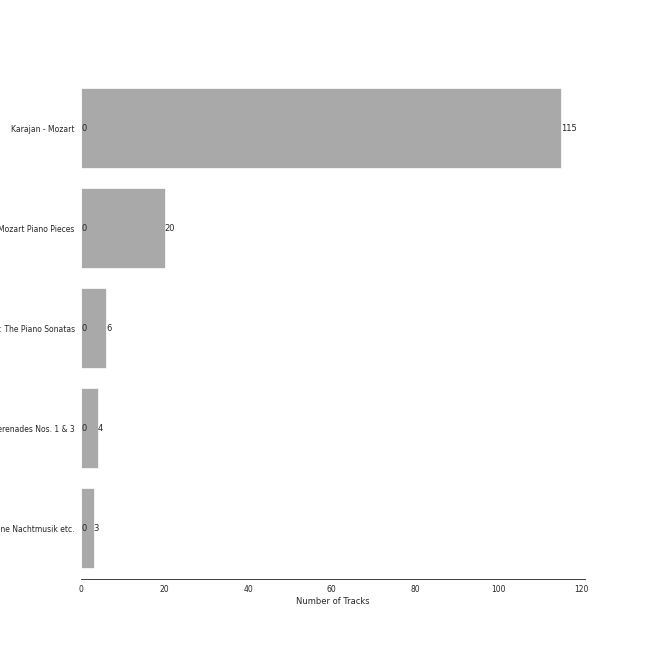

# Mozart

[225 songs](mozart_tracks.md)

## Top Artists

See all 65 artists

|   Number of Tracks | Art                                                                                              | Artist                                                                                   | 🔗                                                           |
|-------------------:|:-------------------------------------------------------------------------------------------------|:-----------------------------------------------------------------------------------------|:------------------------------------------------------------|
|                216 |  | [Wolfgang Amadeus Mozart](../artists/wolfgang_amadeus_mozart.md)                         | [🔗](https://open.spotify.com/artist/4NJhFmfw43RLBLjQvxDuRS) |
|                181 |  | [Herbert von Karajan](../artists/herbert_von_karajan.md)                                 | [🔗](https://open.spotify.com/artist/5zCaQxjl110XTrm4LQ1CxY) |
|                167 |  | [Berliner Philharmoniker](../artists/berliner_philharmoniker.md)                         | [🔗](https://open.spotify.com/artist/6uRJnvQ3f8whVnmeoecv5Z) |
|                 35 |  | [Samuel Ramey](../artists/samuel_ramey.md)                                               | [🔗](https://open.spotify.com/artist/4z6dlDfmoZstfKLVC60nM0) |
|                 28 |  | [Anna Tomowa-Sintow](../artists/anna_tomowa_sintow.md)                                   | [🔗](https://open.spotify.com/artist/6NSIW1uEq8JZmxEkHMF17c) |
|                 25 |  | [Agnes Baltsa](../artists/agnes_baltsa.md)                                               | [🔗](https://open.spotify.com/artist/2amF56vDuTTbZJQsqUgbuC) |
|                 24 |  | [Ferruccio Furlanetto](../artists/ferruccio_furlanetto.md)                               | [🔗](https://open.spotify.com/artist/5fN6PDw4pvvYRQtseOS4ru) |
|                 18 |  | [Wiener Singverein](../artists/wiener_singverein.md)                                     | [🔗](https://open.spotify.com/artist/35QSympF887CO8h5eZHme2) |
|                 17 |  | [Gösta Winbergh](../artists/g_sta_winbergh.md)                                           | [🔗](https://open.spotify.com/artist/7mKGVHZ08PYQA8UfvIrJb1) |
|                 17 |  | [Kathleen Battle](../artists/kathleen_battle.md)                                         | [🔗](https://open.spotify.com/artist/13Tfk6ZpGdF0G3v9B3kasP) |
|                 15 |  | [Alexander Malta](../artists/alexander_malta.md)                                         | [🔗](https://open.spotify.com/artist/4oWIwabbO1pHb0qKxbNase) |
|                 14 |  | [Academy of St. Martin in the Fields](../artists/academy_of_st__martin_in_the_fields.md) | [🔗](https://open.spotify.com/artist/77CaCn32H4mOMQA7UElzfF) |
|                 14 |  | [Sir Neville Marriner](../artists/sir_neville_marriner.md)                               | [🔗](https://open.spotify.com/artist/6NUhQz7eAEsZvjEHTKHux9) |
|                 14 |  | [Wiener Philharmoniker](../artists/wiener_philharmoniker.md)                             | [🔗](https://open.spotify.com/artist/003f4bk13c6Q3gAUXv7dGJ) |
|                 12 |  | [Carmen Piazzini](../artists/carmen_piazzini.md)                                         | [🔗](https://open.spotify.com/artist/6aQUOvrKLOquCAvIGdIwTx) |
|                 11 |  | [Gerd Seifert](../artists/gerd_seifert.md)                                               | [🔗](https://open.spotify.com/artist/4aIYtx2Z5X9vRlysnruy66) |
|                  7 |  | [José van Dam](../artists/jos__van_dam.md)                                               | [🔗](https://open.spotify.com/artist/5qNUHMEhszyeXNYMn4sswd) |
|                  7 |  | Paata Burchuladze                                                                        | [🔗](https://open.spotify.com/artist/1JzOJmq9kk0u7OWqzXkBcc) |
|                  6 |  | Anne-Sophie Mutter                                                                       | [🔗](https://open.spotify.com/artist/6pzfUmBsQAKxOhy0NSi8zn) |
|                  6 |  | András Schiff                                                                            | [🔗](https://open.spotify.com/artist/24K6LTZFqBAvKsorwK0iXd) |
|                  5 |  | Werner Krenn                                                                             | [🔗](https://open.spotify.com/artist/3PuXD6h01YqjNWQ055CWxA) |
|                  5 |  | Chor der Deutschen Oper Berlin                                                           | [🔗](https://open.spotify.com/artist/2KvV4gawnuMNG74DgSAQ0n) |
|                  4 |  | Gottfried Hornik                                                                         | [🔗](https://open.spotify.com/artist/6aFQ4LADfHVe08B5gQuE8X) |
|                  4 |  | Cologne New Philharmonic Orchestra                                                       | [🔗](https://open.spotify.com/artist/4jSOT0xN5OKPgEfawfzInB) |
|                  4 |  | Helga Muller-Molinari                                                                    | [🔗](https://open.spotify.com/artist/3s5xNX5n6PAzpusMRhmHbA) |
|                  4 |  | Manfred Klier                                                                            | [🔗](https://open.spotify.com/artist/3KkpLfmwQob3Y75ePPdtse) |
|                  4 |  | Vinson Cole                                                                              | [🔗](https://open.spotify.com/artist/2j6cP3f3TxyHzcKdWYSm6h) |
|                  4 |  | Mikhail Gantvarg                                                                         | [🔗](https://open.spotify.com/artist/1SCRjxxRnRFsoctLKXIoZx) |
|                  4 |  | Volker Hartung                                                                           | [🔗](https://open.spotify.com/artist/19nzpbhd3Yv5PQXtWKZkhX) |
|                  4 |  | The St. Petersburg Soloists                                                              | [🔗](https://open.spotify.com/artist/11K9yxwc8iVyEh0ya9v9XY) |
|                  3 |                                                               | Ossip Schnirlin                                                                          | [🔗](https://open.spotify.com/artist/7eI7DJSWlJy2W2337B9oTL) |
|                  3 |  | Joseph Joachim                                                                           | [🔗](https://open.spotify.com/artist/6QuJ4aZSRMebqwDXiJ3SuA) |
|                  3 |                                                               | Sam Franko                                                                               | [🔗](https://open.spotify.com/artist/3vkG71N5uQBzhzwEDr6icH) |
|                  2 |  | Elisabeth Sombart                                                                        | [🔗](https://open.spotify.com/artist/6pp4xqAWH1oHFQX0kJtVvO) |
|                  2 |  | Roberte Mamou                                                                            | [🔗](https://open.spotify.com/artist/6DsbdauTI2Fn2NN4B1EIUN) |
|                  2 |  | Berliner Symphoniker                                                                     | [🔗](https://open.spotify.com/artist/5pF76lplGIvEFGb8lI48hA) |
|                  2 |  | Edvard Grieg                                                                             | [🔗](https://open.spotify.com/artist/5ihY290YPGc3aY2xTyx7Gy) |
|                  2 |  | Walter Hagen-Groll                                                                       | [🔗](https://open.spotify.com/artist/5iMb1u0pxxzSPONrB4j0Zb) |
|                  2 |  | Francisco Araiza                                                                         | [🔗](https://open.spotify.com/artist/5M0cOgeTBOetAbsM4FDVDP) |
|                  2 |  | Gerard Oskamp                                                                            | [🔗](https://open.spotify.com/artist/4TWzdKT6XMuddLAoj6PgXi) |
|                  2 |  | Munich Youth Orchestra                                                                   | [🔗](https://open.spotify.com/artist/3jgBofW8eFrbtrsSbLy8Br) |
|                  2 |  | Karin Ott                                                                                | [🔗](https://open.spotify.com/artist/2sZHeIbU96txBewcnCJLj7) |
|                  2 |  | Edith Mathis                                                                             | [🔗](https://open.spotify.com/artist/0eOythKkGSageuVFr6nDHf) |
|                  2 |                                                               | Jordi Mora                                                                               | [🔗](https://open.spotify.com/artist/0bE9Z0z4cxaixqTRU2O5BA) |
|                  2 |  | Axel Gillison                                                                            | [🔗](https://open.spotify.com/artist/05ukT24TP30K50Blikom8z) |
|                  1 |  | Mostar Symphony Orchestra                                                                | [🔗](https://open.spotify.com/artist/70i7O3jytAajMDs0nV0Zbk) |
|                  1 |                                                               | Wolfgang Bünten                                                                          | [🔗](https://open.spotify.com/artist/6qZFjcGH1SfhbkrNfnzH7z) |
|                  1 |  | [Felix Mendelssohn](../artists/felix_mendelssohn.md)                                     | [🔗](https://open.spotify.com/artist/6MF58APd3YV72Ln2eVg710) |
|                  1 |  | Johann Pachelbel                                                                         | [🔗](https://open.spotify.com/artist/62TD7509VQIxUe4WpwO0s3) |
|                  1 |  | [Johann Sebastian Bach](../artists/johann_sebastian_bach.md)                             | [🔗](https://open.spotify.com/artist/5aIqB5nVVvmFsvSdExz408) |
|                  1 |  | Iona Brown                                                                               | [🔗](https://open.spotify.com/artist/4EQ6Hw3KV9S80ZG1swsFN5) |
|                  1 |  | Heinz Kruse                                                                              | [🔗](https://open.spotify.com/artist/44kp24Y9MhmQ4RT64CUaV2) |
|                  1 |  | [Pyotr Ilyich Tchaikovsky](../artists/pyotr_ilyich_tchaikovsky.md)                       | [🔗](https://open.spotify.com/artist/3MKCzCnpzw3TjUYs2v7vDA) |
|                  1 |  | Luigi Boccherini                                                                         | [🔗](https://open.spotify.com/artist/2l4vGfFV7e46yO8lxfxR76) |
|                  1 |  | Gabriel Fauré                                                                            | [🔗](https://open.spotify.com/artist/2gClsBep1tt1rv1CN210SO) |
|                  1 |  | Remo Giazotto                                                                            | [🔗](https://open.spotify.com/artist/2XVw29JYdo8C5MfteMnCqL) |
|                  1 |                                                               | Tobias Pfulb                                                                             | [🔗](https://open.spotify.com/artist/2GD6gK1wj1cD8TFGe2BpJC) |
|                  1 |                                                               | Vestischen Chamber Orchestra                                                             | [🔗](https://open.spotify.com/artist/1m3ycS5catGCiLB0J5eKDG) |
|                  1 |  | Janet Perry                                                                              | [🔗](https://open.spotify.com/artist/1bV3KjOPs1AI3OolJiYogN) |
|                  1 |  | Tomaso Albinoni                                                                          | [🔗](https://open.spotify.com/artist/17OArJzEhRR3OmhtGcnfBq) |
|                  1 |  | Hanna Schwarz                                                                            | [🔗](https://open.spotify.com/artist/0uzYuEP2MlAJ5FdVIYIalx) |
|                  1 |  | Christian Schulz                                                                         | [🔗](https://open.spotify.com/artist/0sqQ1nXbUwTWglq8jWopvZ) |
|                  1 |  | Ilmar Lapinsch                                                                           | [🔗](https://open.spotify.com/artist/0dI3iXIxXjAtMkzZCsOVEg) |
|                  1 |  | Ratko Delorko                                                                            | [🔗](https://open.spotify.com/artist/0E1sM06TDvSpGqNQBx8FV0) |
|                  1 |  | Gints Berzins                                                                            | [🔗](https://open.spotify.com/artist/0CqCB3JQz4h9k3qk74ihWT) |

## Top Albums

See all 5 albums

|   Number of Tracks | Art                                                                                              | Album                                                                             | 🔗                                                          |
|-------------------:|:-------------------------------------------------------------------------------------------------|:----------------------------------------------------------------------------------|:-----------------------------------------------------------|
|                181 |  | Karajan - Mozart                                                                  | [🔗](https://open.spotify.com/album/1HSJhsMIW2EDD4YSSkbc9e) |
|                 20 |  | Mozart Piano Pieces                                                               | [🔗](https://open.spotify.com/album/3AYEvo7R1gY4O5xJuMwy3U) |
|                 14 |  | Mozart: Eine Kleine Nachtmusik etc.                                               | [🔗](https://open.spotify.com/album/5YCuibCDJrkVcS3UOAYqr9) |
|                  6 |  | Mozart: The Piano Sonatas                                                         | [🔗](https://open.spotify.com/album/1qM2Z3rhkJLQIXnAQpIUdY) |
|                  4 |  | Mozart: Symphony No. 40 in G Minor, Bassoon Concerto & Flute Serenades Nos. 1 & 3 | [🔗](https://open.spotify.com/album/3WHqaCZ66SWzL7LyYnrn9y) |

## Top Record Labels

See all 5 labels

|   Number of Tracks | Label                                                                                   |
|-------------------:|:----------------------------------------------------------------------------------------|
|                181 | [UME - Global Clearing House](../labels/ume___global_clearing_house.md)                 |
|                 20 | [Warner Music Group - X5 Music Group](../labels/warner_music_group___x5_music_group.md) |
|                 14 | [Warner Classics](../labels/warner_classics.md)                                         |
|                  6 | [Decca Music Group Ltd.](../labels/decca_music_group_ltd_.md)                           |
|                  4 | [JPK Musik](../labels/jpk_musik.md)                                                     |

