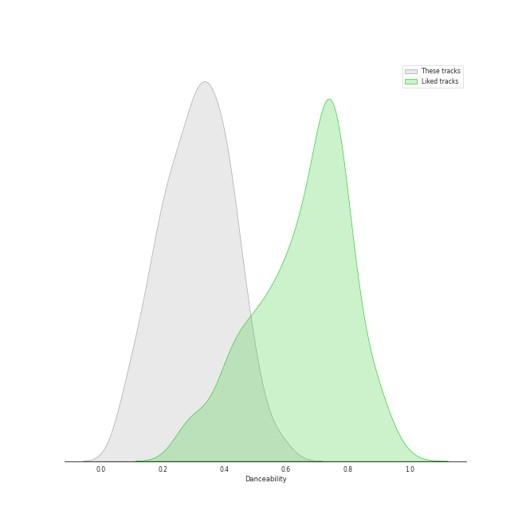
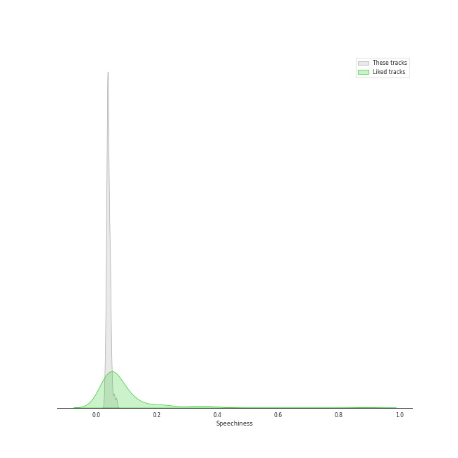
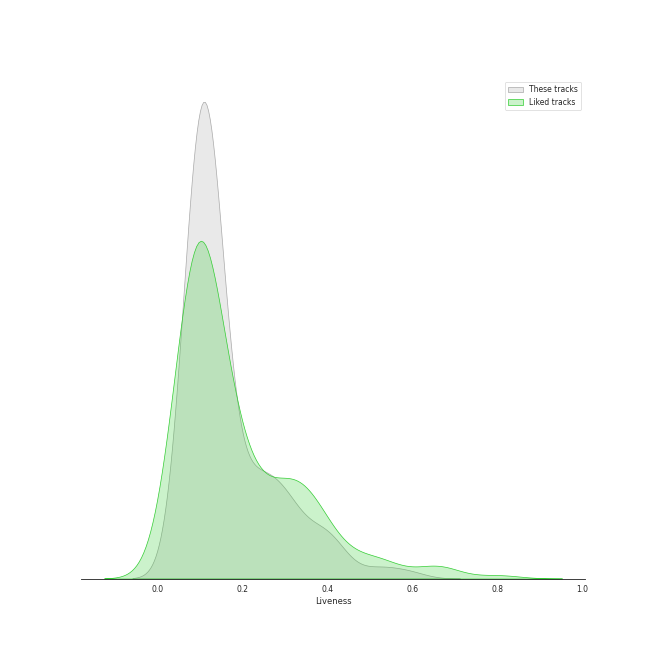
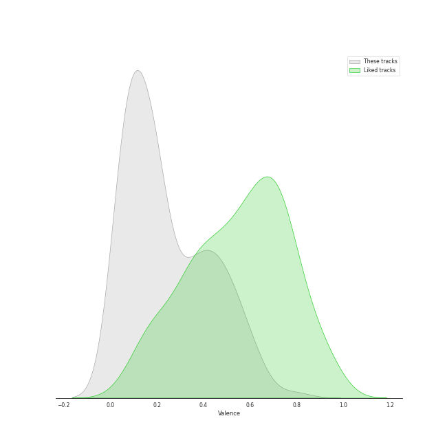
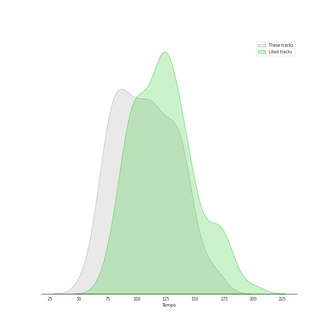

# Audio Features for Mozart

## Danceability

| 10 most Danceable tracks | 10 least Danceable tracks |
|:---|:---|
| Divertimento No. 11 in D, K.251 "Nannerl-Septett": Menuetto (Tema con variazioni) (0.593) | Die Zauberflöte, K.620 / Act 2: "O Isis und Osiris, welche Wonne!" (0.0663) |
| Piano Sonata No. 11 in A Major, K. 331 "Turkish March": III. Alla turca (0.571) | Horn Concerto No. 4 in E-Flat Major, K. 495: II. Romanza. Andante (0.0683) |
| Piano Sonata No. 11 in A Major, K. 331: 3. Alla Turca. Allegretto (0.55) | Requiem In D Minor, K.626: 7. Agnus Dei (0.0749) |
| Violin Concerto No. 3 in G Major, K. 216: III. Rondo (Allegro) (0.507) | Divertimento No. 15 in B Flat Major, K. 287: IV. Adagio (0.0898) |
| Die Zauberflöte, K.620 / Act 2: "Pa-Pa-Pa-Pa-Pa-Pa-Papagena!" (0.504) | Horn Concerto No. 2 in E-Flat Major, K. 417: II. Andante (0.099) |
| Die Zauberflöte, K.620 / Act 2: Alles fühlt der Liebe Freuden (Monostatos) (0.499) | Divertimento in D, K.334 - Orchestral Version: 4. Adagio (0.101) |
| Piano Sonata No. 16 in C Major, K. 545 "Sonata facile": III. Rondo (0.49) | Symphony No. 33 in B flat, K.319: 2. Andante moderato (0.116) |
| Piano Sonata No. 12 in F Major, K. 332: II. Adagio (0.486) | Mass In C, K.317 "Coronation": 1. Kyrie (0.117) |
| Piano Sonata No. 9 in D Major, K. 311: II. Andante con expressione (0.485) | Requiem In D Minor, K.626: 3. Sequentia: Confutatis (0.118) |
| Serenade In G, K.525 "Eine kleine Nachtmusik": 4. Rondo (Allegro) (0.478) | Symphony No. 35 in D Major, K. 385 "Haffner": 2. Andante (0.124) |

## Energy

| 10 most Energetic tracks | 10 least Energetic tracks |
|:---|:---|
| Requiem in D Minor, K.626: 3a. Sequientia: Dies irae (0.542) | Piano Sonata No. 10 in C Major, K. 330: II. Andante cantabile (0.00316) |
| Symphony No. 39 in E flat, K.543: 4. Finale (Allegro) (0.441) | Die Zauberflöte, K.620 / Act 2: "Seid uns zum zweiten Mal willkommen" (0.00404) |
| Mass In C, K.317 "Coronation": 3. Credo (0.433) | Symphony No. 40 in G Minor, K. 550: II. Andante (0.0102) |
| Symphony No. 41 In C, K.551 - "Jupiter": 4. Molto allegro (0.408) | Piano Sonata No. 16 in C, K.545 "Sonata facile": 2. Andante (0.0117) |
| Mass In C, K.317 "Coronation": 4. Sanctus (0.373) | Piano Concerto No. 23 in A Major, K. 488: II. Adagio (0.0131) |
| Requiem In D Minor, K.626: 5. Sanctus (0.363) | Piano Sonata No. 9 in D Major, K. 311: II. Andante con expressione (0.0132) |
| Requiem In D Minor, K.626: 2. Kyrie (0.33) | Piano Sonata No. 16 in C Major, K. 545 "Sonata facile": II. Andante (0.0138) |
| Symphony No. 40 In G Minor, K.550: 4. Finale (Allegro assai) (0.295) | Piano Concerto No. 27 in B-Flat Major, K. 595: II. Larghetto (0.0142) |
| Symphony No. 40 In G Minor, K.550: 1. Molto allegro (0.295) | Divertimento No. 15 in B-Flat Major, K. 287: 5. Menuetto (0.0183) |
| Symphony No. 35 in D Major, K. 385 "Haffner": 1. Allegro con spirito (0.275) | Requiem In D Minor, K.626: 3. Sequentia: Confutatis (0.0185) |

## Speechiness

| 10 most Speechy tracks | 10 least Speechy tracks |
|:---|:---|
| Divertimento No. 11 in D, K.251 "Nannerl-Septett": Menuetto (Tema con variazioni) (0.068) | Requiem In D Minor, K.626: 4. Offertorium: Domine Jesu (0.0293) |
| Die Zauberflöte, K.620 / Act 2: Alles fühlt der Liebe Freuden (Monostatos) (0.0662) | Symphony No. 39 in E flat, K.543: 3. Menuetto (Allegretto) (0.0297) |
| Die Zauberflöte, K.620 / Act 1: "Bei Männern, welche Liebe fühlen" (0.0611) | Requiem In D Minor, K.626: 5. Sanctus (0.0301) |
| Die Zauberflöte, K.620 / Act 1: Zu Hilfe! Zu Hilfe! (Tamino, Die drei Damen) (0.0591) | Requiem In D Minor, K.626: 2. Kyrie (0.0304) |
| Serenade in G, K.525 "Eine kleine Nachtmusik": 1. Allegro (0.0585) | Requiem In D Minor, K.626: 3. Sequentia: Rex tremendae (0.0315) |
| Piano Sonata No. 10 in C Major, K. 330: II. Andante cantabile (0.0534) | Requiem In D Minor, K.626: 4. Offertorium: Hostias (0.0316) |
| Die Zauberflöte, K.620 / Act 1: Der Vogelfänger bin ich ja (Papageno) (0.0522) | Requiem In D Minor, K.626: 8.Communio: Lux aeterna (0.0317) |
| Die Zauberflöte, K.620 / Act 2: Der Hölle Rache kocht in meinem Herzen (Königin der Nacht) (0.0521) | Mass In C, K.317 "Coronation": 4. Sanctus (0.0321) |
| Die Zauberflöte, K.620 / Act 2: "Pa-Pa-Pa-Pa-Pa-Pa-Papagena!" (0.052) | Requiem in D Minor, K.626: 3a. Sequientia: Dies irae (0.0325) |
| Piano Sonata No. 9 in D Major, K. 311: II. Andante con expressione (0.0509) | Divertimento No. 11 in D, K.251 "Nannerl-Septett": Marcia alla francese (0.0334) |

## Acousticness

| 10 most Acoustic tracks | 10 least Acoustic tracks |
|:---|:---|
| Piano Sonata No. 10 in C Major, K. 330: II. Andante cantabile (0.996) | Die Zauberflöte, K.620 / Act 2: Ein Mädchen oder Weibchen (Papageno) (0.623) |
| Piano Sonata No. 16 in C Major, K. 545 "Sonata facile": II. Andante (0.995) | Serenade In G, K.525 "Eine kleine Nachtmusik": 3. Menuetto (Allegretto) (0.828) |
| Piano Sonata No. 9 in D Major, K. 311: II. Andante con expressione (0.995) | Symphony No. 41 In C, K.551 - "Jupiter": 4. Molto allegro (0.852) |
| Piano Sonata No. 12 in F Major, K. 332: II. Adagio (0.995) | Die Zauberflöte, K.620 / Act 2: Alles fühlt der Liebe Freuden (Monostatos) (0.865) |
| Piano Sonata No. 18 in D Major, K. 576: I. Allegro (0.994) | Symphony No. 35 in D Major, K. 385 "Haffner": 4. Finale (Presto) (0.896) |
| Piano Sonata No. 10 in C Major, K. 330: I. Allegro moderato (0.994) | Serenade In G, K.525 "Eine kleine Nachtmusik": 2. Romance (Andante) (0.912) |
| Piano Sonata No. 16 in C, K.545 "Sonata facile": 3. Rondo (Allegro) (0.994) | Symphony No. 40 In G Minor, K.550: 1. Molto allegro (0.917) |
| Piano Sonata No. 16 in C, K.545 "Sonata facile": 2. Andante (0.994) | Divertimento No. 15 in B-Flat Major, K. 287: 4. Adagio (0.919) |
| Piano Sonata No. 11 in A Major, K. 331: 1. Tema (Andante grazioso) con variazioni (0.994) | Serenade in G, K.525 "Eine kleine Nachtmusik": 1. Allegro (0.919) |
| Piano Sonata No. 11 in A Major, K. 331 "Turkish March": III. Alla turca (0.994) | Symphony No. 36 in C Major, K. 425 "Linz": 2. Andante (0.92) |

## Instrumentalness

| 10 most Instrumental tracks | 10 least Instrumental tracks |
|:---|:---|
| Divertimento No. 11 in D, K.251 "Nannerl-Septett": Menuetto (Tema con variazioni) (0.958) | Die Zauberflöte, K.620 / Act 2: Ein Mädchen oder Weibchen (Papageno) (0.0) |
| Horn Concerto No. 2 in E-Flat Major, K. 417: II. Andante (0.954) | Die Zauberflöte, K.620 / Act 1: "Bei Männern, welche Liebe fühlen" (0.0) |
| Piano Sonata No. 16 in C Major, K. 545 "Sonata facile": III. Rondo (0.954) | Die Zauberflöte, K.620 / Act 1: Der Vogelfänger bin ich ja (Papageno) (1.03e-05) |
| Horn Concerto No. 1 in D Major, K. 386b (K. 412 & 514): I. (Allegro) K. 412 (0.95) | Die Zauberflöte, K.620 / Act 2: "Seid uns zum zweiten Mal willkommen" (1.46e-05) |
| Piano Sonata No. 16 in C, K.545 "Sonata facile": 1. Allegro (0.949) | Die Zauberflöte, K.620 / Act 1: Zu Hilfe! Zu Hilfe! (Tamino, Die drei Damen) (5.54e-05) |
| Horn Concerto No. 4 in E-Flat Major, K. 495: II. Romanza. Andante (0.949) | Die Zauberflöte, K.620 / Act 2: Alles fühlt der Liebe Freuden (Monostatos) (5.9e-05) |
| Piano Concerto No. 20 in D Minor, K. 466: I. Allegro (0.948) | Requiem In D Minor, K.626: 3. Sequentia: Recordare (0.000349) |
| Requiem In D Minor, K.626: 3. Sequentia: Confutatis (0.944) | Requiem In D Minor, K.626: 3. Sequentia: Tuba mirum (0.0004) |
| Symphony No. 40 In G Minor, K.550: 4. Finale (Allegro assai) (0.941) | Requiem In D Minor, K.626: 6. Benedictus (0.000441) |
| Piano Sonata No. 11 in A Major, K. 331: 1. Tema (Andante grazioso) con variazioni (0.941) | Die Zauberflöte, K.620 / Act 1: Dies Bildnis ist bezaubernd schön (Tamino) (0.00077) |

## Liveness

| 10 most Live tracks | 10 least Live tracks |
|:---|:---|
| Symphony No. 36 in C Major, K. 425 "Linz": 3. Menuetto (0.594) | Piano Sonata No. 10 in C Major, K. 330: II. Andante cantabile (0.0583) |
| Requiem In D Minor, K.626: 3. Sequentia: Recordare (0.541) | Piano Sonata No. 16 in C Major, K. 545 "Sonata facile": II. Andante (0.0625) |
| Die Zauberflöte, K.620 / Act 2: Alles fühlt der Liebe Freuden (Monostatos) (0.508) | Divertimento in D, K.334 - Orchestral Version: 2. Thema mit Variationen (Andante) (0.0641) |
| Requiem in D Minor, K.626: 3a. Sequientia: Dies irae (0.444) | Violin Concerto No. 5 in A Major, K. 219: III. Rondeau (Tempo di minuetto) (0.0665) |
| Die Zauberflöte, K.620 / Act 1: Der Vogelfänger bin ich ja (Papageno) (0.421) | Violin Concerto No. 5 in A Major, K. 219: I. Allegro aperto (0.0674) |
| Divertimento In F, K.247: Menuetto (0.412) | Piano Sonata No. 10 in C Major, K. 330: I. Allegro moderato (0.0702) |
| Symphony No. 33 in B flat, K.319: 3. Menuetto (0.409) | Requiem In D Minor, K.626: 8.Communio: Lux aeterna (0.0716) |
| Divertimento No. 11 in D, K.251 "Nannerl-Septett": Marcia alla francese (0.392) | Die Zauberflöte, K.620 / Act 2: Der Hölle Rache kocht in meinem Herzen (Königin der Nacht) (0.0743) |
| Die Zauberflöte, K.620 / Act 2: "Seid uns zum zweiten Mal willkommen" (0.386) | Symphony No. 39 in E flat, K.543: 2. Andante con moto (0.0759) |
| Symphony No. 41 In C, K.551 - "Jupiter": 3. Menuetto (Allegretto) (0.384) | Mass In C, K.317 "Coronation": 3. Credo (0.0762) |

## Valence

| 10 most Happy tracks | 10 least Happy tracks |
|:---|:---|
| Die Zauberflöte, K.620 / Act 2: Alles fühlt der Liebe Freuden (Monostatos) (0.792) | Requiem In D Minor, K.626: 7. Agnus Dei (0.0338) |
| Mozart: Eine kleine Nachtmusik, K. 525: IV. Rondo. Allegro (0.646) | Requiem In D Minor, K.626: 3. Sequentia: Confutatis (0.0351) |
| Serenade In G, K.525 "Eine kleine Nachtmusik": 4. Rondo (Allegro) (0.64) | Die Zauberflöte, K.620 / Act 2: O Isis und Osiris (Sarastro, Chor) (0.0353) |
| Piano Sonata No. 10 in C Major, K. 330: I. Allegro moderato (0.616) | Die Zauberflöte, K.620 / Act 2: Ach, ich fühl's, es ist verschwunden (Pamina) (0.0373) |
| Piano Sonata No. 11 in A Major, K. 331 "Turkish March": III. Alla turca (0.612) | Divertimento In F, K.247: Adagio (0.0381) |
| Requiem in D Minor, K.626: 3a. Sequientia: Dies irae (0.596) | Mass In C, K.317 "Coronation": 6. Agnus Dei (0.0384) |
| Divertimento No. 11 in D, K.251 "Nannerl-Septett": Menuetto (Tema con variazioni) (0.57) | Symphony No. 41 In C, K.551 - "Jupiter": 2. Andante cantabile (0.0385) |
| Piano Sonata No. 11 in A Major, K. 331: 3. Alla Turca. Allegretto (0.562) | Symphony No. 40 In G Minor, K.550: 2. Andante (0.0392) |
| Divertimento No. 11 in D, K.251 "Nannerl-Septett": Marcia alla francese (0.56) | Requiem In D Minor, K.626: 3. Sequentia: Lacrimosa (0.0394) |
| Mozart: Eine kleine Nachtmusik, K. 525: III. Menuetto. Allegretto (0.554) | Divertimento in D, K.334 - Orchestral Version: 4. Adagio (0.04) |

## Tempo

| 10 most Fast tracks | 10 least Fast tracks |
|:---|:---|
| Divertimento in D, K.334 - Orchestral Version: 4. Adagio (168.802) | Divertimento No. 15 in B Flat Major, K. 287: IV. Adagio (56.647) |
| Piano Sonata No. 14 in C Minor, K. 457: I. Molto allegro (168.671) | Mass In C, K.317 "Coronation": 5. Benedictus (57.355) |
| Symphony No. 33 in B flat, K.319: 2. Andante moderato (165.957) | Horn Concerto No. 4 in E-Flat Major, K. 495: III. Rondo. Allegro vivace (63.172) |
| Symphony No. 33 in B flat, K.319: 1. Allegro assai (165.933) | Requiem In D Minor, K.626: 3. Sequentia: Confutatis (65.236) |
| Divertimento No. 15 in B Flat Major, K. 287: I. Allegro (153.666) | Piano Sonata No. 16 in C, K.545 "Sonata facile": 2. Andante (67.143) |
| Serenade In G, K.525 "Eine kleine Nachtmusik": 2. Romance (Andante) (153.555) | Requiem In D Minor, K.626: 5. Sanctus (68.345) |
| Symphony No. 39 in E flat, K.543: 1. Adagio - Allegro (153.184) | Mozart: Eine kleine Nachtmusik, K. 525: II. Romance. Andante (69.457) |
| Mass In C, K.317 "Coronation": 2. Gloria (152.459) | Die Zauberflöte, K.620 / Act 1: Zu Hilfe! Zu Hilfe! (Tamino, Die drei Damen) (70.475) |
| Horn Concerto No. 2 in E-Flat Major, K. 417: III. Rondo (144.224) | Symphony No. 40 in G Minor, K. 550: III. Menuetto. Allegretto (72.476) |
| Symphony No. 41 In C, K.551 - "Jupiter": 4. Molto allegro (144.103) | Die Zauberflöte, K.620 / Act 2: "O Isis und Osiris, welche Wonne!" (73.462) |
