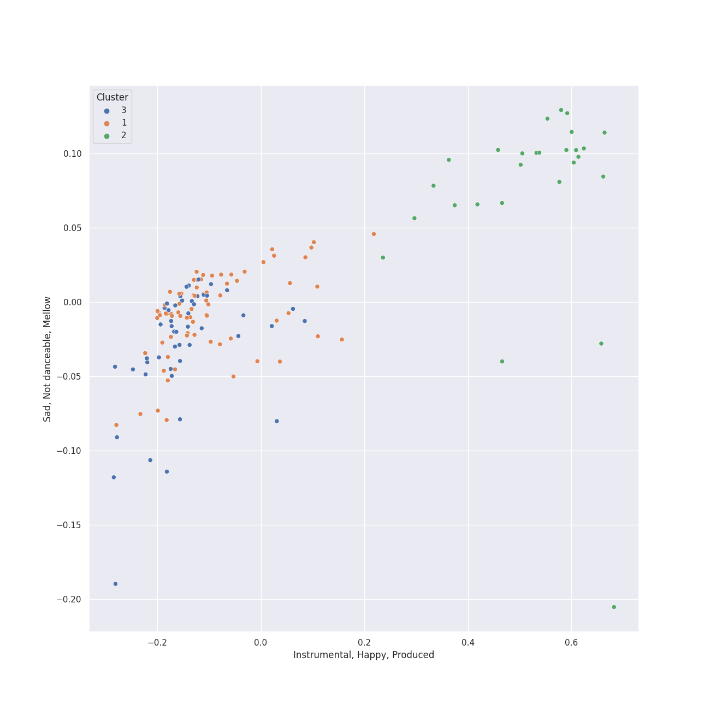

# Clusters in Mozart

## Cluster #1

73 tracks

| Art | Track | Album | Artists | Label | 💚 | 🔗 |
|:---|:---|:---|:---|:---|:---|:---|
|  | Divertimento In F, K.247: Andante grazioso | Karajan - Mozart | [Wolfgang Amadeus Mozart](../../../../artists/wolfgang_amadeus_mozart/overview.md), [Berliner Philharmoniker](../../../../artists/berliner_philharmoniker/overview.md), [Herbert von Karajan](../../../../artists/herbert_von_karajan/overview.md) | [UME - Global Clearing House](../../../../labels/ume___global_clearing_house) | | [🔗](https://open.spotify.com/track/3iaBg32tC3kAL7lsYkr8Ff) |
|  | Divertimento No. 15 in B Flat Major, K. 287: III. Menuetto (I) | Karajan - Mozart | [Wolfgang Amadeus Mozart](../../../../artists/wolfgang_amadeus_mozart/overview.md), [Berliner Philharmoniker](../../../../artists/berliner_philharmoniker/overview.md), [Herbert von Karajan](../../../../artists/herbert_von_karajan/overview.md) | [UME - Global Clearing House](../../../../labels/ume___global_clearing_house) | | [🔗](https://open.spotify.com/track/6TQjyU0bNyhYwSBfqJUm6O) |
|  | Divertimento No. 15 in B Flat Major, K. 287: VI. Andante - Allegro molto | Karajan - Mozart | [Wolfgang Amadeus Mozart](../../../../artists/wolfgang_amadeus_mozart/overview.md), [Berliner Philharmoniker](../../../../artists/berliner_philharmoniker/overview.md), [Herbert von Karajan](../../../../artists/herbert_von_karajan/overview.md) | [UME - Global Clearing House](../../../../labels/ume___global_clearing_house) | | [🔗](https://open.spotify.com/track/7tjIU7PoARM3stmC4GB60u) |
|  | Divertimento No. 15 in B-Flat Major, K. 287: 3. Menuetto | Karajan - Mozart | [Wolfgang Amadeus Mozart](../../../../artists/wolfgang_amadeus_mozart/overview.md), [Berliner Philharmoniker](../../../../artists/berliner_philharmoniker/overview.md), [Herbert von Karajan](../../../../artists/herbert_von_karajan/overview.md) | [UME - Global Clearing House](../../../../labels/ume___global_clearing_house) | | [🔗](https://open.spotify.com/track/3doNQlb1qU7MRMzWAvdOSK) |
|  | Requiem In D Minor, K.626: 3. Sequentia: Rex tremendae | Karajan - Mozart | [Wolfgang Amadeus Mozart](../../../../artists/wolfgang_amadeus_mozart/overview.md), Wiener Singverein, Wiener Philharmoniker, [Herbert von Karajan](../../../../artists/herbert_von_karajan/overview.md) | [UME - Global Clearing House](../../../../labels/ume___global_clearing_house) | | [🔗](https://open.spotify.com/track/1GgJCt9psWwrZcdGm9Z69d) |
|  | Symphony No. 33 in B flat, K.319: 1. Allegro assai | Karajan - Mozart | [Wolfgang Amadeus Mozart](../../../../artists/wolfgang_amadeus_mozart/overview.md), [Berliner Philharmoniker](../../../../artists/berliner_philharmoniker/overview.md), [Herbert von Karajan](../../../../artists/herbert_von_karajan/overview.md) | [UME - Global Clearing House](../../../../labels/ume___global_clearing_house) | | [🔗](https://open.spotify.com/track/54Qj0SzLte0T6UaTLtNSSp) |
|  | Symphony No. 36 in C Major, K. 425 "Linz": 1. Adagio - Allegro spiritoso | Karajan - Mozart | [Wolfgang Amadeus Mozart](../../../../artists/wolfgang_amadeus_mozart/overview.md), [Berliner Philharmoniker](../../../../artists/berliner_philharmoniker/overview.md), [Herbert von Karajan](../../../../artists/herbert_von_karajan/overview.md) | [UME - Global Clearing House](../../../../labels/ume___global_clearing_house) | | [🔗](https://open.spotify.com/track/2j4BI5TZsucyNmOe3WA2Yq) |
|  | Piano Concerto No. 20 in D Minor, K. 466: II. Romance | Mozart Piano Pieces | [Wolfgang Amadeus Mozart](../../../../artists/wolfgang_amadeus_mozart/overview.md), Roberte Mamou, Gerard Oskamp, Berliner Symphoniker | [Warner Music Group - X5 Music Group](../../../../labels/warner_music_group___x5_music_group) | | [🔗](https://open.spotify.com/track/2XY6ID1TAueZidFAfkjUCK) |
|  | Piano Concerto No. 24 in C Minor, K. 491: II. Larghetto | Mozart Piano Pieces | [Wolfgang Amadeus Mozart](../../../../artists/wolfgang_amadeus_mozart/overview.md), Carmen Piazzini, Mikhail Gantvarg, The St. Petersburg Soloists | [Warner Music Group - X5 Music Group](../../../../labels/warner_music_group___x5_music_group) | | [🔗](https://open.spotify.com/track/1So9jHVpEqcbNX6rU9wUDC) |
|  | Piano Concerto No. 5 in D Major, K. 175: II. Andante ma un poco adagio | Mozart Piano Pieces | [Wolfgang Amadeus Mozart](../../../../artists/wolfgang_amadeus_mozart/overview.md), Ratko Delorko, Vestischen Chamber Orchestra | [Warner Music Group - X5 Music Group](../../../../labels/warner_music_group___x5_music_group) | | [🔗](https://open.spotify.com/track/4pdYTfl39K3FeRYEUFVVhI) |
## Cluster #2

27 tracks

| Art | Track | Album | Artists | Label | 💚 | 🔗 |
|:---|:---|:---|:---|:---|:---|:---|
|  | Mozart: Serenade No. 13 in G Major, K. 525 "Eine kleine Nachtmusik": II. Romance. Andante | Mozart: Eine Kleine Nachtmusik etc. | [Wolfgang Amadeus Mozart](../../../../artists/wolfgang_amadeus_mozart/overview.md), Sir Neville Marriner, Academy of St. Martin in the Fields | [Warner Classics](../../../../labels/warner_classics) | | [🔗](https://open.spotify.com/track/5c8aHvonwKaBAoOIXmHQdt) |
|  | Die Zauberflöte, K.620 / Act 1: "Bei Männern, welche Liebe fühlen" | Karajan - Mozart | [Wolfgang Amadeus Mozart](../../../../artists/wolfgang_amadeus_mozart/overview.md), Edith Mathis, Gottfried Hornik, [Berliner Philharmoniker](../../../../artists/berliner_philharmoniker/overview.md), [Herbert von Karajan](../../../../artists/herbert_von_karajan/overview.md) | [UME - Global Clearing House](../../../../labels/ume___global_clearing_house) | | [🔗](https://open.spotify.com/track/7earPy3QwSWpSKX2eYX9US) |
|  | Die Zauberflöte, K.620 / Act 1: "O zittre nicht, mein lieber Sohn" | Karajan - Mozart | [Wolfgang Amadeus Mozart](../../../../artists/wolfgang_amadeus_mozart/overview.md), Karin Ott, [Berliner Philharmoniker](../../../../artists/berliner_philharmoniker/overview.md), [Herbert von Karajan](../../../../artists/herbert_von_karajan/overview.md) | [UME - Global Clearing House](../../../../labels/ume___global_clearing_house) | | [🔗](https://open.spotify.com/track/6DT54QnrQN2kHlWCf6KroH) |
|  | Die Zauberflöte, K.620 / Act 1: Zu Hilfe! Zu Hilfe! (Tamino, Die drei Damen) | Karajan - Mozart | [Wolfgang Amadeus Mozart](../../../../artists/wolfgang_amadeus_mozart/overview.md), Francisco Araiza, Anna Tomowa-Sintow, Agnes Baltsa, Hanna Schwarz, [Berliner Philharmoniker](../../../../artists/berliner_philharmoniker/overview.md), [Herbert von Karajan](../../../../artists/herbert_von_karajan/overview.md) | [UME - Global Clearing House](../../../../labels/ume___global_clearing_house) | | [🔗](https://open.spotify.com/track/3dFThyBhorrpp8sOOUIS0o) |
|  | Divertimento in D, K.334 - Orchestral Version: 3. Menuetto - Trio - Menuetto | Karajan - Mozart | [Wolfgang Amadeus Mozart](../../../../artists/wolfgang_amadeus_mozart/overview.md), [Berliner Philharmoniker](../../../../artists/berliner_philharmoniker/overview.md), [Herbert von Karajan](../../../../artists/herbert_von_karajan/overview.md) | [UME - Global Clearing House](../../../../labels/ume___global_clearing_house) | | [🔗](https://open.spotify.com/track/3ctljk3sbkkNUztuLcAekT) |
|  | Mass In C, K.317 "Coronation": 2. Gloria | Karajan - Mozart | [Wolfgang Amadeus Mozart](../../../../artists/wolfgang_amadeus_mozart/overview.md), Anna Tomowa-Sintow, Agnes Baltsa, Werner Krenn, José van Dam, [Berliner Philharmoniker](../../../../artists/berliner_philharmoniker/overview.md), [Herbert von Karajan](../../../../artists/herbert_von_karajan/overview.md), Wiener Singverein | [UME - Global Clearing House](../../../../labels/ume___global_clearing_house) | | [🔗](https://open.spotify.com/track/0nN6oNjnxZ9yUfNP3Vq5VY) |
|  | Mass In C, K.317 "Coronation": 7. Agnus Dei. Dona nobis pacem - Allegro con spirito | Karajan - Mozart | [Wolfgang Amadeus Mozart](../../../../artists/wolfgang_amadeus_mozart/overview.md), Anna Tomowa-Sintow, Agnes Baltsa, Werner Krenn, José van Dam, [Berliner Philharmoniker](../../../../artists/berliner_philharmoniker/overview.md), [Herbert von Karajan](../../../../artists/herbert_von_karajan/overview.md), Wiener Singverein | [UME - Global Clearing House](../../../../labels/ume___global_clearing_house) | | [🔗](https://open.spotify.com/track/5xoJs5tSHWZ0u8Y3GkRvem) |
|  | Requiem In D Minor, K.626: 3. Sequentia: Tuba mirum | Karajan - Mozart | [Wolfgang Amadeus Mozart](../../../../artists/wolfgang_amadeus_mozart/overview.md), Anna Tomowa-Sintow, Helga Muller-Molinari, Vinson Cole, Paata Burchuladze, Wiener Philharmoniker, [Herbert von Karajan](../../../../artists/herbert_von_karajan/overview.md) | [UME - Global Clearing House](../../../../labels/ume___global_clearing_house) | | [🔗](https://open.spotify.com/track/5xItkHeimSWCAWwh6WvV86) |
|  | Requiem In D Minor, K.626: 4. Offertorium: Domine Jesu | Karajan - Mozart | [Wolfgang Amadeus Mozart](../../../../artists/wolfgang_amadeus_mozart/overview.md), Anna Tomowa-Sintow, Helga Muller-Molinari, Vinson Cole, Paata Burchuladze, Wiener Singverein, Wiener Philharmoniker, [Herbert von Karajan](../../../../artists/herbert_von_karajan/overview.md) | [UME - Global Clearing House](../../../../labels/ume___global_clearing_house) | | [🔗](https://open.spotify.com/track/7rFbjvOVAjimxhIMVVatF6) |
|  | Requiem In D Minor, K.626: 6. Benedictus | Karajan - Mozart | [Wolfgang Amadeus Mozart](../../../../artists/wolfgang_amadeus_mozart/overview.md), Anna Tomowa-Sintow, Helga Muller-Molinari, Vinson Cole, Paata Burchuladze, Wiener Singverein, Wiener Philharmoniker, [Herbert von Karajan](../../../../artists/herbert_von_karajan/overview.md) | [UME - Global Clearing House](../../../../labels/ume___global_clearing_house) | | [🔗](https://open.spotify.com/track/0HFIawlgXNMh01tMP3rur4) |
## Cluster #3

48 tracks

| Art | Track | Album | Artists | Label | 💚 | 🔗 |
|:---|:---|:---|:---|:---|:---|:---|
|  | Piano Sonata No. 11 in A Major, K. 331: 2. Menuetto | Mozart: The Piano Sonatas | [Wolfgang Amadeus Mozart](../../../../artists/wolfgang_amadeus_mozart/overview.md), András Schiff | [Decca Music Group Ltd.](../../../../labels/decca_music_group_ltd_) | | [🔗](https://open.spotify.com/track/4P8zSaqjPV3i1Vc9Q4lT10) |
|  | Symphony No. 40 in G Minor, K. 550: III. Menuetto. Allegretto | Mozart: Symphony No. 40 in G Minor, Bassoon Concerto & Flute Serenades Nos. 1 & 3 | [Wolfgang Amadeus Mozart](../../../../artists/wolfgang_amadeus_mozart/overview.md), Cologne New Philharmonic Orchestra, Volker Hartung | JPK Musik | | [🔗](https://open.spotify.com/track/3ZbnjLCpvVdSThFWbfRJrf) |
|  | Symphony No. 40 in G Minor, K. 550: IV. Allegro assai | Mozart: Symphony No. 40 in G Minor, Bassoon Concerto & Flute Serenades Nos. 1 & 3 | [Wolfgang Amadeus Mozart](../../../../artists/wolfgang_amadeus_mozart/overview.md), Cologne New Philharmonic Orchestra, Volker Hartung | JPK Musik | | [🔗](https://open.spotify.com/track/7hV999Y5iTFvBJhI48ZAuo) |
|  | Horn Concerto No. 1 in D Major, K. 386b (K. 412 & 514): II. Rondò. Allegro K. 514 | Karajan - Mozart | [Wolfgang Amadeus Mozart](../../../../artists/wolfgang_amadeus_mozart/overview.md), Gerd Seifert, [Berliner Philharmoniker](../../../../artists/berliner_philharmoniker/overview.md), [Herbert von Karajan](../../../../artists/herbert_von_karajan/overview.md) | [UME - Global Clearing House](../../../../labels/ume___global_clearing_house) | | [🔗](https://open.spotify.com/track/4sHYPGjXXhFpJB1DMVc14A) |
|  | Horn Concerto No. 3 in E-Flat Major, K. 447: III. Allegro | Karajan - Mozart | [Wolfgang Amadeus Mozart](../../../../artists/wolfgang_amadeus_mozart/overview.md), Manfred Klier, Gerd Seifert, [Berliner Philharmoniker](../../../../artists/berliner_philharmoniker/overview.md), [Herbert von Karajan](../../../../artists/herbert_von_karajan/overview.md) | [UME - Global Clearing House](../../../../labels/ume___global_clearing_house) | | [🔗](https://open.spotify.com/track/1UPNWzHNtv70waHBGDTQxq) |
|  | Symphony No. 33 in B flat, K.319: 4. Finale (Allegro assai) | Karajan - Mozart | [Wolfgang Amadeus Mozart](../../../../artists/wolfgang_amadeus_mozart/overview.md), [Berliner Philharmoniker](../../../../artists/berliner_philharmoniker/overview.md), [Herbert von Karajan](../../../../artists/herbert_von_karajan/overview.md) | [UME - Global Clearing House](../../../../labels/ume___global_clearing_house) | | [🔗](https://open.spotify.com/track/6tx5pjn919UXtGD80ElBa9) |
|  | Symphony No. 38 In D, K.504 "Prague": 3. Finale (Presto) | Karajan - Mozart | [Wolfgang Amadeus Mozart](../../../../artists/wolfgang_amadeus_mozart/overview.md), [Berliner Philharmoniker](../../../../artists/berliner_philharmoniker/overview.md), [Herbert von Karajan](../../../../artists/herbert_von_karajan/overview.md) | [UME - Global Clearing House](../../../../labels/ume___global_clearing_house) | | [🔗](https://open.spotify.com/track/5OlBFvqwbhQcoihA42rIdk) |
|  | Piano Sonata No. 16 in C Major, K. 545 "Sonata facile": II. Andante | Mozart Piano Pieces | [Wolfgang Amadeus Mozart](../../../../artists/wolfgang_amadeus_mozart/overview.md), Carmen Piazzini | [Warner Music Group - X5 Music Group](../../../../labels/warner_music_group___x5_music_group) | | [🔗](https://open.spotify.com/track/6q7iZv8b4xt4tppt53d18d) |
|  | Piano Sonata No. 16 in C Major, K. 545 "Sonata facile": III. Rondo | Mozart Piano Pieces | [Wolfgang Amadeus Mozart](../../../../artists/wolfgang_amadeus_mozart/overview.md), Carmen Piazzini | [Warner Music Group - X5 Music Group](../../../../labels/warner_music_group___x5_music_group) | | [🔗](https://open.spotify.com/track/1JLOh8aetP2T5OUPZnu4Jb) |
|  | Piano Sonata No. 18 in D Major, K. 576: I. Allegro | Mozart Piano Pieces | [Wolfgang Amadeus Mozart](../../../../artists/wolfgang_amadeus_mozart/overview.md), Carmen Piazzini | [Warner Music Group - X5 Music Group](../../../../labels/warner_music_group___x5_music_group) | | [🔗](https://open.spotify.com/track/7bv1oLv8wGSVp96UkZsPgJ) |