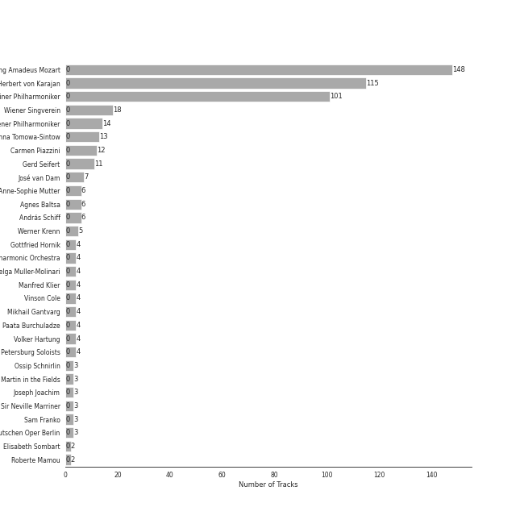
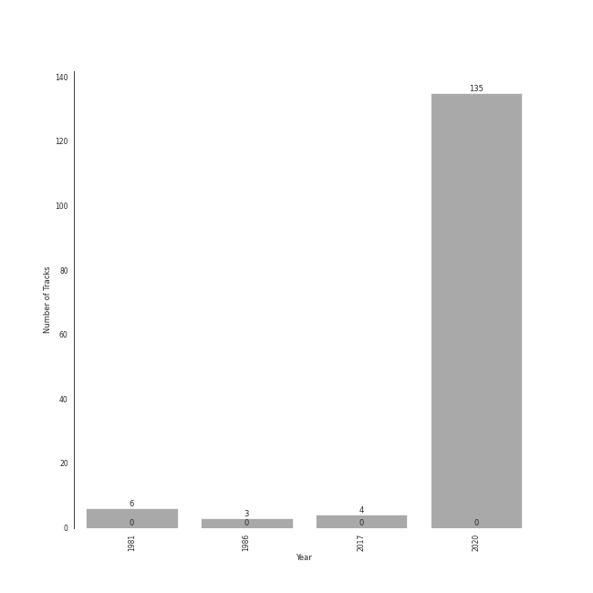

# Mozart

[148 songs](tracks.md)

## Top Artists

See all 50 artists

| Number of Tracks | Art | Artist | 🔗 |
|---:|:---|:---|:---|
| 148 |  | [Wolfgang Amadeus Mozart](../../artists/wolfgang_amadeus_mozart.md) | [🔗](https://open.spotify.com/artist/4NJhFmfw43RLBLjQvxDuRS) |
| 115 |  | [Herbert von Karajan](../../artists/herbert_von_karajan.md) | [🔗](https://open.spotify.com/artist/5zCaQxjl110XTrm4LQ1CxY) |
| 101 |  | [Berliner Philharmoniker](../../artists/berliner_philharmoniker.md) | [🔗](https://open.spotify.com/artist/6uRJnvQ3f8whVnmeoecv5Z) |
| 18 |  | [Wiener Singverein](../../artists/wiener_singverein.md) | [🔗](https://open.spotify.com/artist/35QSympF887CO8h5eZHme2) |
| 14 |  | [Wiener Philharmoniker](../../artists/wiener_philharmoniker.md) | [🔗](https://open.spotify.com/artist/003f4bk13c6Q3gAUXv7dGJ) |
| 13 |  | [Anna Tomowa-Sintow](../../artists/anna_tomowa_sintow.md) | [🔗](https://open.spotify.com/artist/6NSIW1uEq8JZmxEkHMF17c) |
| 12 |  | [Carmen Piazzini](../../artists/carmen_piazzini.md) | [🔗](https://open.spotify.com/artist/6aQUOvrKLOquCAvIGdIwTx) |
| 11 |  | [Gerd Seifert](../../artists/gerd_seifert.md) | [🔗](https://open.spotify.com/artist/4aIYtx2Z5X9vRlysnruy66) |
| 7 |  | José van Dam | [🔗](https://open.spotify.com/artist/5qNUHMEhszyeXNYMn4sswd) |
| 6 |  | Anne-Sophie Mutter | [🔗](https://open.spotify.com/artist/6pzfUmBsQAKxOhy0NSi8zn) |
| 6 |  | Agnes Baltsa | [🔗](https://open.spotify.com/artist/2amF56vDuTTbZJQsqUgbuC) |
| 6 |  | András Schiff | [🔗](https://open.spotify.com/artist/24K6LTZFqBAvKsorwK0iXd) |
| 5 |  | Werner Krenn | [🔗](https://open.spotify.com/artist/3PuXD6h01YqjNWQ055CWxA) |
| 4 |  | Gottfried Hornik | [🔗](https://open.spotify.com/artist/6aFQ4LADfHVe08B5gQuE8X) |
| 4 |  | Cologne New Philharmonic Orchestra | [🔗](https://open.spotify.com/artist/4jSOT0xN5OKPgEfawfzInB) |
| 4 |  | Helga Muller-Molinari | [🔗](https://open.spotify.com/artist/3s5xNX5n6PAzpusMRhmHbA) |
| 4 |  | Manfred Klier | [🔗](https://open.spotify.com/artist/3KkpLfmwQob3Y75ePPdtse) |
| 4 |  | Vinson Cole | [🔗](https://open.spotify.com/artist/2j6cP3f3TxyHzcKdWYSm6h) |
| 4 |  | Mikhail Gantvarg | [🔗](https://open.spotify.com/artist/1SCRjxxRnRFsoctLKXIoZx) |
| 4 |  | Paata Burchuladze | [🔗](https://open.spotify.com/artist/1JzOJmq9kk0u7OWqzXkBcc) |
| 4 |  | Volker Hartung | [🔗](https://open.spotify.com/artist/19nzpbhd3Yv5PQXtWKZkhX) |
| 4 |  | The St. Petersburg Soloists | [🔗](https://open.spotify.com/artist/11K9yxwc8iVyEh0ya9v9XY) |
| 3 |  | Ossip Schnirlin | [🔗](https://open.spotify.com/artist/7eI7DJSWlJy2W2337B9oTL) |
| 3 |  | [Academy of St. Martin in the Fields](../../artists/academy_of_st__martin_in_the_fields.md) | [🔗](https://open.spotify.com/artist/77CaCn32H4mOMQA7UElzfF) |
| 3 |  | Joseph Joachim | [🔗](https://open.spotify.com/artist/6QuJ4aZSRMebqwDXiJ3SuA) |
| 3 |  | [Sir Neville Marriner](../../artists/sir_neville_marriner.md) | [🔗](https://open.spotify.com/artist/6NUhQz7eAEsZvjEHTKHux9) |
| 3 |  | Sam Franko | [🔗](https://open.spotify.com/artist/3vkG71N5uQBzhzwEDr6icH) |
| 3 |  | Chor der Deutschen Oper Berlin | [🔗](https://open.spotify.com/artist/2KvV4gawnuMNG74DgSAQ0n) |
| 2 |  | Elisabeth Sombart | [🔗](https://open.spotify.com/artist/6pp4xqAWH1oHFQX0kJtVvO) |
| 2 |  | Roberte Mamou | [🔗](https://open.spotify.com/artist/6DsbdauTI2Fn2NN4B1EIUN) |
| 2 |  | Berliner Symphoniker | [🔗](https://open.spotify.com/artist/5pF76lplGIvEFGb8lI48hA) |
| 2 |  | Walter Hagen-Groll | [🔗](https://open.spotify.com/artist/5iMb1u0pxxzSPONrB4j0Zb) |
| 2 |  | Francisco Araiza | [🔗](https://open.spotify.com/artist/5M0cOgeTBOetAbsM4FDVDP) |
| 2 |  | Gerard Oskamp | [🔗](https://open.spotify.com/artist/4TWzdKT6XMuddLAoj6PgXi) |
| 2 |  | Munich Youth Orchestra | [🔗](https://open.spotify.com/artist/3jgBofW8eFrbtrsSbLy8Br) |
| 2 |  | Karin Ott | [🔗](https://open.spotify.com/artist/2sZHeIbU96txBewcnCJLj7) |
| 2 |  | Edith Mathis | [🔗](https://open.spotify.com/artist/0eOythKkGSageuVFr6nDHf) |
| 2 |  | Jordi Mora | [🔗](https://open.spotify.com/artist/0bE9Z0z4cxaixqTRU2O5BA) |
| 2 |  | Axel Gillison | [🔗](https://open.spotify.com/artist/05ukT24TP30K50Blikom8z) |
| 1 |  | Mostar Symphony Orchestra | [🔗](https://open.spotify.com/artist/70i7O3jytAajMDs0nV0Zbk) |
| 1 |  | Wolfgang Bünten | [🔗](https://open.spotify.com/artist/6qZFjcGH1SfhbkrNfnzH7z) |
| 1 |  | Heinz Kruse | [🔗](https://open.spotify.com/artist/44kp24Y9MhmQ4RT64CUaV2) |
| 1 |  | Tobias Pfulb | [🔗](https://open.spotify.com/artist/2GD6gK1wj1cD8TFGe2BpJC) |
| 1 |  | Vestischen Chamber Orchestra | [🔗](https://open.spotify.com/artist/1m3ycS5catGCiLB0J5eKDG) |
| 1 |  | Janet Perry | [🔗](https://open.spotify.com/artist/1bV3KjOPs1AI3OolJiYogN) |
| 1 |  | Hanna Schwarz | [🔗](https://open.spotify.com/artist/0uzYuEP2MlAJ5FdVIYIalx) |
| 1 |  | Christian Schulz | [🔗](https://open.spotify.com/artist/0sqQ1nXbUwTWglq8jWopvZ) |
| 1 |  | Ilmar Lapinsch | [🔗](https://open.spotify.com/artist/0dI3iXIxXjAtMkzZCsOVEg) |
| 1 |  | Ratko Delorko | [🔗](https://open.spotify.com/artist/0E1sM06TDvSpGqNQBx8FV0) |
| 1 |  | Gints Berzins | [🔗](https://open.spotify.com/artist/0CqCB3JQz4h9k3qk74ihWT) |

## Top Albums

See all 5 albums

| Number of Tracks | Art | Album | Release Date | 🔗 |
|---:|:---|:---|:---|:---|
| 115 |  | Karajan - Mozart | 2020-06-16 | [🔗](https://open.spotify.com/album/1HSJhsMIW2EDD4YSSkbc9e) |
| 20 |  | Mozart Piano Pieces | 2020-10-13 | [🔗](https://open.spotify.com/album/3AYEvo7R1gY4O5xJuMwy3U) |
| 6 |  | Mozart: The Piano Sonatas | 1981-01-01 | [🔗](https://open.spotify.com/album/1qM2Z3rhkJLQIXnAQpIUdY) |
| 4 |  | Mozart: Symphony No. 40 in G Minor, Bassoon Concerto & Flute Serenades Nos. 1 & 3 | 2017-12-08 | [🔗](https://open.spotify.com/album/3WHqaCZ66SWzL7LyYnrn9y) |
| 3 |  | Mozart: Eine Kleine Nachtmusik etc. | 1986 | [🔗](https://open.spotify.com/album/5YCuibCDJrkVcS3UOAYqr9) |

## Top Record Labels

See all 5 labels

| Number of Tracks | Label |
|---:|:---|
| 115 | [UME - Global Clearing House](../../labels/ume___global_clearing_house.md) |
| 20 | [Warner Music Group - X5 Music Group](../../labels/warner_music_group___x5_music_group.md) |
| 6 | [Decca Music Group Ltd.](../../labels/decca_music_group_ltd_.md) |
| 4 | JPK Musik |
| 3 | [Warner Classics](../../labels/warner_classics.md) |

## Genres

See all 2 genres

| Number of Tracks | Genre |
|---:|:---|
| 148 | [classical era](../../genres/classical_era.md) |
| 148 | [classical](../../genres/classical.md) |

## Years

View all years

| Year | Number of Tracks |
|:---|---:|
| [2020](2020.md) | 135 |
| 2017 | 4 |
| 1986 | 3 |
| 1981 | 6 |

| 10 newest albums | 10 oldest albums |
|:---|:---|
| 
 Mozart Piano Pieces (2020-10-13)
 | 
 Mozart: The Piano Sonatas (1981-01-01)
 |
| 
 Karajan - Mozart (2020-06-16)
 | 
 Mozart: Eine Kleine Nachtmusik etc. (1986)
 |
| 
 Mozart: Symphony No. 40 in G Minor, Bassoon Concerto & Flute Serenades Nos. 1 & 3 (2017-12-08)
 | 
 Mozart: Symphony No. 40 in G Minor, Bassoon Concerto & Flute Serenades Nos. 1 & 3 (2017-12-08)
 |
| 
 Mozart: Eine Kleine Nachtmusik etc. (1986)
 | 
 Karajan - Mozart (2020-06-16)
 |
| 
 Mozart: The Piano Sonatas (1981-01-01)
 | 
 Mozart Piano Pieces (2020-10-13)
 |
## Audio Features

| 10 most Danceable tracks | 10 least Danceable tracks |
|:---|:---|
| Divertimento No. 11 in D, K.251 "Nannerl-Septett": Menuetto (Tema con variazioni) (0.593) | Die Zauberflöte, K.620 / Act 2: "O Isis und Osiris, welche Wonne!" (0.0663) |
| Piano Sonata No. 11 in A Major, K. 331 "Turkish March": III. Alla turca (0.571) | Horn Concerto No. 4 in E-Flat Major, K. 495: II. Romanza. Andante (0.0683) |
| Piano Sonata No. 11 in A Major, K. 331: 3. Alla Turca. Allegretto (0.55) | Requiem In D Minor, K.626: 7. Agnus Dei (0.0749) |
| Violin Concerto No. 3 in G Major, K. 216: III. Rondo (Allegro) (0.507) | Divertimento No. 15 in B Flat Major, K. 287: IV. Adagio (0.0898) |
| Die Zauberflöte, K.620 / Act 2: "Pa-Pa-Pa-Pa-Pa-Pa-Papagena!" (0.504) | Horn Concerto No. 2 in E-Flat Major, K. 417: II. Andante (0.099) |
| Die Zauberflöte, K.620 / Act 2: Alles fühlt der Liebe Freuden (Monostatos) (0.499) | Divertimento in D, K.334 - Orchestral Version: 4. Adagio (0.101) |
| Piano Sonata No. 16 in C Major, K. 545 "Sonata facile": III. Rondo (0.49) | Symphony No. 33 in B flat, K.319: 2. Andante moderato (0.116) |
| Piano Sonata No. 12 in F Major, K. 332: II. Adagio (0.486) | Mass In C, K.317 "Coronation": 1. Kyrie (0.117) |
| Piano Sonata No. 9 in D Major, K. 311: II. Andante con expressione (0.485) | Requiem In D Minor, K.626: 3. Sequentia: Confutatis (0.118) |
| Serenade In G, K.525 "Eine kleine Nachtmusik": 4. Rondo (Allegro) (0.478) | Symphony No. 35 in D Major, K. 385 "Haffner": 2. Andante (0.124) |

| 10 most Energetic tracks | 10 least Energetic tracks |
|:---|:---|
| Requiem in D Minor, K.626: 3a. Sequientia: Dies irae (0.542) | Piano Sonata No. 10 in C Major, K. 330: II. Andante cantabile (0.00316) |
| Symphony No. 39 in E flat, K.543: 4. Finale (Allegro) (0.441) | Die Zauberflöte, K.620 / Act 2: "Seid uns zum zweiten Mal willkommen" (0.00404) |
| Mass In C, K.317 "Coronation": 3. Credo (0.433) | Symphony No. 40 in G Minor, K. 550: II. Andante (0.0102) |
| Symphony No. 41 In C, K.551 - "Jupiter": 4. Molto allegro (0.408) | Piano Sonata No. 16 in C, K.545 "Sonata facile": 2. Andante (0.0117) |
| Mass In C, K.317 "Coronation": 4. Sanctus (0.373) | Piano Concerto No. 23 in A Major, K. 488: II. Adagio (0.0131) |
| Requiem In D Minor, K.626: 5. Sanctus (0.363) | Piano Sonata No. 9 in D Major, K. 311: II. Andante con expressione (0.0132) |
| Requiem In D Minor, K.626: 2. Kyrie (0.33) | Piano Sonata No. 16 in C Major, K. 545 "Sonata facile": II. Andante (0.0138) |
| Symphony No. 40 In G Minor, K.550: 4. Finale (Allegro assai) (0.295) | Piano Concerto No. 27 in B-Flat Major, K. 595: II. Larghetto (0.0142) |
| Symphony No. 40 In G Minor, K.550: 1. Molto allegro (0.295) | Divertimento No. 15 in B-Flat Major, K. 287: 5. Menuetto (0.0183) |
| Symphony No. 35 in D Major, K. 385 "Haffner": 1. Allegro con spirito (0.275) | Requiem In D Minor, K.626: 3. Sequentia: Confutatis (0.0185) |

| 10 most Speechy tracks | 10 least Speechy tracks |
|:---|:---|
| Divertimento No. 11 in D, K.251 "Nannerl-Septett": Menuetto (Tema con variazioni) (0.068) | Requiem In D Minor, K.626: 4. Offertorium: Domine Jesu (0.0293) |
| Die Zauberflöte, K.620 / Act 2: Alles fühlt der Liebe Freuden (Monostatos) (0.0662) | Symphony No. 39 in E flat, K.543: 3. Menuetto (Allegretto) (0.0297) |
| Die Zauberflöte, K.620 / Act 1: "Bei Männern, welche Liebe fühlen" (0.0611) | Requiem In D Minor, K.626: 5. Sanctus (0.0301) |
| Die Zauberflöte, K.620 / Act 1: Zu Hilfe! Zu Hilfe! (Tamino, Die drei Damen) (0.0591) | Requiem In D Minor, K.626: 2. Kyrie (0.0304) |
| Serenade in G, K.525 "Eine kleine Nachtmusik": 1. Allegro (0.0585) | Requiem In D Minor, K.626: 3. Sequentia: Rex tremendae (0.0315) |
| Piano Sonata No. 10 in C Major, K. 330: II. Andante cantabile (0.0534) | Requiem In D Minor, K.626: 4. Offertorium: Hostias (0.0316) |
| Die Zauberflöte, K.620 / Act 1: Der Vogelfänger bin ich ja (Papageno) (0.0522) | Requiem In D Minor, K.626: 8.Communio: Lux aeterna (0.0317) |
| Die Zauberflöte, K.620 / Act 2: Der Hölle Rache kocht in meinem Herzen (Königin der Nacht) (0.0521) | Mass In C, K.317 "Coronation": 4. Sanctus (0.0321) |
| Die Zauberflöte, K.620 / Act 2: "Pa-Pa-Pa-Pa-Pa-Pa-Papagena!" (0.052) | Requiem in D Minor, K.626: 3a. Sequientia: Dies irae (0.0325) |
| Piano Sonata No. 9 in D Major, K. 311: II. Andante con expressione (0.0509) | Divertimento No. 11 in D, K.251 "Nannerl-Septett": Marcia alla francese (0.0334) |

| 10 most Acoustic tracks | 10 least Acoustic tracks |
|:---|:---|
| Piano Sonata No. 10 in C Major, K. 330: II. Andante cantabile (0.996) | Die Zauberflöte, K.620 / Act 2: Ein Mädchen oder Weibchen (Papageno) (0.623) |
| Piano Sonata No. 16 in C Major, K. 545 "Sonata facile": II. Andante (0.995) | Serenade In G, K.525 "Eine kleine Nachtmusik": 3. Menuetto (Allegretto) (0.828) |
| Piano Sonata No. 9 in D Major, K. 311: II. Andante con expressione (0.995) | Symphony No. 41 In C, K.551 - "Jupiter": 4. Molto allegro (0.852) |
| Piano Sonata No. 12 in F Major, K. 332: II. Adagio (0.995) | Die Zauberflöte, K.620 / Act 2: Alles fühlt der Liebe Freuden (Monostatos) (0.865) |
| Piano Sonata No. 18 in D Major, K. 576: I. Allegro (0.994) | Symphony No. 35 in D Major, K. 385 "Haffner": 4. Finale (Presto) (0.896) |
| Piano Sonata No. 10 in C Major, K. 330: I. Allegro moderato (0.994) | Serenade In G, K.525 "Eine kleine Nachtmusik": 2. Romance (Andante) (0.912) |
| Piano Sonata No. 16 in C, K.545 "Sonata facile": 3. Rondo (Allegro) (0.994) | Symphony No. 40 In G Minor, K.550: 1. Molto allegro (0.917) |
| Piano Sonata No. 16 in C, K.545 "Sonata facile": 2. Andante (0.994) | Divertimento No. 15 in B-Flat Major, K. 287: 4. Adagio (0.919) |
| Piano Sonata No. 11 in A Major, K. 331: 1. Tema (Andante grazioso) con variazioni (0.994) | Serenade in G, K.525 "Eine kleine Nachtmusik": 1. Allegro (0.919) |
| Piano Sonata No. 11 in A Major, K. 331 "Turkish March": III. Alla turca (0.994) | Symphony No. 36 in C Major, K. 425 "Linz": 2. Andante (0.92) |

| 10 most Instrumental tracks | 10 least Instrumental tracks |
|:---|:---|
| Divertimento No. 11 in D, K.251 "Nannerl-Septett": Menuetto (Tema con variazioni) (0.958) | Die Zauberflöte, K.620 / Act 2: Ein Mädchen oder Weibchen (Papageno) (0.0) |
| Horn Concerto No. 2 in E-Flat Major, K. 417: II. Andante (0.954) | Die Zauberflöte, K.620 / Act 1: "Bei Männern, welche Liebe fühlen" (0.0) |
| Piano Sonata No. 16 in C Major, K. 545 "Sonata facile": III. Rondo (0.954) | Die Zauberflöte, K.620 / Act 1: Der Vogelfänger bin ich ja (Papageno) (1.03e-05) |
| Horn Concerto No. 1 in D Major, K. 386b (K. 412 & 514): I. (Allegro) K. 412 (0.95) | Die Zauberflöte, K.620 / Act 2: "Seid uns zum zweiten Mal willkommen" (1.46e-05) |
| Piano Sonata No. 16 in C, K.545 "Sonata facile": 1. Allegro (0.949) | Die Zauberflöte, K.620 / Act 1: Zu Hilfe! Zu Hilfe! (Tamino, Die drei Damen) (5.54e-05) |
| Horn Concerto No. 4 in E-Flat Major, K. 495: II. Romanza. Andante (0.949) | Die Zauberflöte, K.620 / Act 2: Alles fühlt der Liebe Freuden (Monostatos) (5.9e-05) |
| Piano Concerto No. 20 in D Minor, K. 466: I. Allegro (0.948) | Requiem In D Minor, K.626: 3. Sequentia: Recordare (0.000349) |
| Requiem In D Minor, K.626: 3. Sequentia: Confutatis (0.944) | Requiem In D Minor, K.626: 3. Sequentia: Tuba mirum (0.0004) |
| Symphony No. 40 In G Minor, K.550: 4. Finale (Allegro assai) (0.941) | Requiem In D Minor, K.626: 6. Benedictus (0.000441) |
| Piano Sonata No. 11 in A Major, K. 331: 1. Tema (Andante grazioso) con variazioni (0.941) | Die Zauberflöte, K.620 / Act 1: Dies Bildnis ist bezaubernd schön (Tamino) (0.00077) |

| 10 most Live tracks | 10 least Live tracks |
|:---|:---|
| Symphony No. 36 in C Major, K. 425 "Linz": 3. Menuetto (0.594) | Piano Sonata No. 10 in C Major, K. 330: II. Andante cantabile (0.0583) |
| Requiem In D Minor, K.626: 3. Sequentia: Recordare (0.541) | Piano Sonata No. 16 in C Major, K. 545 "Sonata facile": II. Andante (0.0625) |
| Die Zauberflöte, K.620 / Act 2: Alles fühlt der Liebe Freuden (Monostatos) (0.508) | Divertimento in D, K.334 - Orchestral Version: 2. Thema mit Variationen (Andante) (0.0641) |
| Requiem in D Minor, K.626: 3a. Sequientia: Dies irae (0.444) | Violin Concerto No. 5 in A Major, K. 219: III. Rondeau (Tempo di minuetto) (0.0665) |
| Die Zauberflöte, K.620 / Act 1: Der Vogelfänger bin ich ja (Papageno) (0.421) | Violin Concerto No. 5 in A Major, K. 219: I. Allegro aperto (0.0674) |
| Divertimento In F, K.247: Menuetto (0.412) | Piano Sonata No. 10 in C Major, K. 330: I. Allegro moderato (0.0702) |
| Symphony No. 33 in B flat, K.319: 3. Menuetto (0.409) | Requiem In D Minor, K.626: 8.Communio: Lux aeterna (0.0716) |
| Divertimento No. 11 in D, K.251 "Nannerl-Septett": Marcia alla francese (0.392) | Die Zauberflöte, K.620 / Act 2: Der Hölle Rache kocht in meinem Herzen (Königin der Nacht) (0.0743) |
| Die Zauberflöte, K.620 / Act 2: "Seid uns zum zweiten Mal willkommen" (0.386) | Symphony No. 39 in E flat, K.543: 2. Andante con moto (0.0759) |
| Symphony No. 41 In C, K.551 - "Jupiter": 3. Menuetto (Allegretto) (0.384) | Mass In C, K.317 "Coronation": 3. Credo (0.0762) |

| 10 most Happy tracks | 10 least Happy tracks |
|:---|:---|
| Die Zauberflöte, K.620 / Act 2: Alles fühlt der Liebe Freuden (Monostatos) (0.792) | Requiem In D Minor, K.626: 7. Agnus Dei (0.0338) |
| Mozart: Eine kleine Nachtmusik, K. 525: IV. Rondo. Allegro (0.646) | Requiem In D Minor, K.626: 3. Sequentia: Confutatis (0.0351) |
| Serenade In G, K.525 "Eine kleine Nachtmusik": 4. Rondo (Allegro) (0.64) | Die Zauberflöte, K.620 / Act 2: O Isis und Osiris (Sarastro, Chor) (0.0353) |
| Piano Sonata No. 10 in C Major, K. 330: I. Allegro moderato (0.616) | Die Zauberflöte, K.620 / Act 2: Ach, ich fühl's, es ist verschwunden (Pamina) (0.0373) |
| Piano Sonata No. 11 in A Major, K. 331 "Turkish March": III. Alla turca (0.612) | Divertimento In F, K.247: Adagio (0.0381) |
| Requiem in D Minor, K.626: 3a. Sequientia: Dies irae (0.596) | Mass In C, K.317 "Coronation": 6. Agnus Dei (0.0384) |
| Divertimento No. 11 in D, K.251 "Nannerl-Septett": Menuetto (Tema con variazioni) (0.57) | Symphony No. 41 In C, K.551 - "Jupiter": 2. Andante cantabile (0.0385) |
| Piano Sonata No. 11 in A Major, K. 331: 3. Alla Turca. Allegretto (0.562) | Symphony No. 40 In G Minor, K.550: 2. Andante (0.0392) |
| Divertimento No. 11 in D, K.251 "Nannerl-Septett": Marcia alla francese (0.56) | Requiem In D Minor, K.626: 3. Sequentia: Lacrimosa (0.0394) |
| Mozart: Eine kleine Nachtmusik, K. 525: III. Menuetto. Allegretto (0.554) | Divertimento in D, K.334 - Orchestral Version: 4. Adagio (0.04) |
