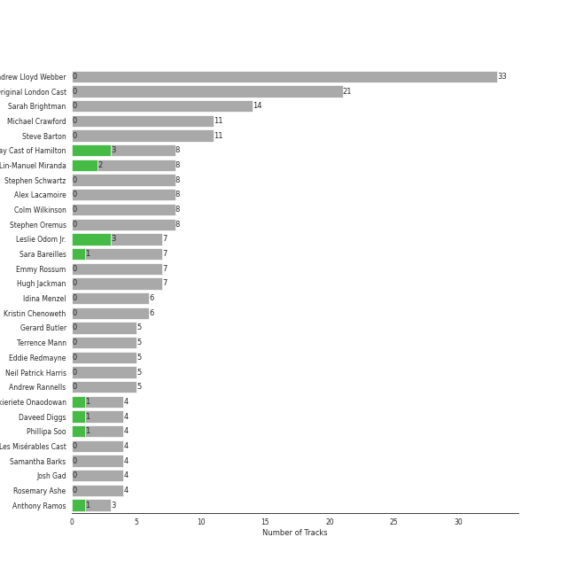

# Musicals

## Top Artists

See all artists

|   Number of Tracks | Artist                                         |
|-------------------:|:-----------------------------------------------|
|                 33 | Original Broadway Cast of Hamilton             |
|                 31 | Andrew Lloyd Webber                            |
|                 30 | Lin-Manuel Miranda                             |
|                 22 | Leslie Odom Jr.                                |
|                 21 | Phantom Of The Opera Original London Cast      |
|                 14 | Sarah Brightman                                |
|                 13 | Daveed Diggs                                   |
|                 12 | Okieriete Onaodowan                            |
|                 11 | Anthony Ramos                                  |
|                 11 | Michael Crawford                               |
|                 11 | Phillipa Soo                                   |
|                 11 | Steve Barton                                   |
|                  7 | Christopher Jackson                            |
|                  7 | Emmy Rossum                                    |
|                  7 | Colm Wilkinson                                 |
|                  6 | Sara Bareilles                                 |
|                  5 | Gerard Butler                                  |
|                  5 | Renée Elise Goldsberry                         |
|                  4 | Rosemary Ashe                                  |
|                  3 | Jonathan Groff                                 |
|                  3 | Janet Devenish                                 |
|                  3 | Frances Ruffelle                               |
|                  3 | Terrence Mann                                  |
|                  3 | David Firth                                    |
|                  3 | Eddie Redmayne                                 |
|                  3 | John Savident                                  |
|                  3 | Mary Millar                                    |
|                  2 | Judy Kuhn                                      |
|                  2 | Michael Maguire                                |
|                  2 | Samantha Barks                                 |
|                  2 | Jasmine Cephas-Jones                           |
|                  2 | Robert Billig                                  |
|                  2 | David Bryant                                   |
|                  2 | Randy Graff                                    |
|                  2 | Patrick Wilson                                 |
|                  1 | Students                                       |
|                  1 | Les Misérables Cast                            |
|                  1 | Jon Rua                                        |
|                  1 | Aaron Tveit                                    |
|                  1 | Minnie Driver                                  |
|                  1 | Amanda Seyfried                                |
|                  1 | John Aron                                      |
|                  1 | Hugh Jackman                                   |
|                  1 | Jesse Corti                                    |
|                  1 | Jason Mraz                                     |
|                  1 | Thayne Jasperson                               |
|                  1 | Donna Vivino                                   |
|                  1 | Ephraim Sykes                                  |
|                  1 | Janos Kurucz                                   |
|                  1 | Jennifer Ellison                               |
|                  1 | Sydney James Harcourt                          |
|                  1 | Ariana DeBose                                  |
|                  1 | Anne Hathaway                                  |
|                  1 | Braden Danner                                  |
|                  1 | Les Misérables - 10th Anniversary Concert Cast |
|                  1 | Sasha Hutchings                                |
|                  1 | Cindy Benson                                   |

## Tracks

| Track                                      | Album                                                                 | Artists                                                                                                                                                                                                                                                                                                                                                                                                               | Liked   |
|:-------------------------------------------|:----------------------------------------------------------------------|:----------------------------------------------------------------------------------------------------------------------------------------------------------------------------------------------------------------------------------------------------------------------------------------------------------------------------------------------------------------------------------------------------------------------|:--------|
| In My Life                                 | Les Misérables: The Motion Picture Soundtrack Deluxe (Deluxe Edition) | Amanda Seyfried, Eddie Redmayne, Samantha Barks, Hugh Jackman                                                                                                                                                                                                                                                                                                                                                         |         |
| Overture                                   | The Phantom Of The Opera (Original Motion Picture Soundtrack)         | [Andrew Lloyd Webber](../artists/andrew_lloyd_webber.md)                                                                                                                                                                                                                                                                                                                                                              |         |
| Wishing You Were Somehow Here Again        | The Phantom Of The Opera (Original Motion Picture Soundtrack)         | [Andrew Lloyd Webber](../artists/andrew_lloyd_webber.md), Emmy Rossum                                                                                                                                                                                                                                                                                                                                                 |         |
| The Mirror (Angel Of Music)                | The Phantom Of The Opera (Original Motion Picture Soundtrack)         | [Andrew Lloyd Webber](../artists/andrew_lloyd_webber.md), Emmy Rossum, Gerard Butler                                                                                                                                                                                                                                                                                                                                  |         |
| The Phantom Of the Opera                   | The Phantom Of The Opera (Original Motion Picture Soundtrack)         | [Andrew Lloyd Webber](../artists/andrew_lloyd_webber.md), Emmy Rossum, Gerard Butler                                                                                                                                                                                                                                                                                                                                  |         |
| The Point Of No Return                     | The Phantom Of The Opera (Original Motion Picture Soundtrack)         | [Andrew Lloyd Webber](../artists/andrew_lloyd_webber.md), Emmy Rossum, Gerard Butler                                                                                                                                                                                                                                                                                                                                  |         |
| Angel Of Music                             | The Phantom Of The Opera (Original Motion Picture Soundtrack)         | [Andrew Lloyd Webber](../artists/andrew_lloyd_webber.md), Emmy Rossum, Gerard Butler, Jennifer Ellison                                                                                                                                                                                                                                                                                                                |         |
| All I Ask Of You                           | The Phantom Of The Opera (Original Motion Picture Soundtrack)         | [Andrew Lloyd Webber](../artists/andrew_lloyd_webber.md), Emmy Rossum, Patrick Wilson                                                                                                                                                                                                                                                                                                                                 |         |
| Think Of Me                                | The Phantom Of The Opera (Original Motion Picture Soundtrack)         | [Andrew Lloyd Webber](../artists/andrew_lloyd_webber.md), Emmy Rossum, Patrick Wilson                                                                                                                                                                                                                                                                                                                                 |         |
| The Music Of The Night                     | The Phantom Of The Opera (Original Motion Picture Soundtrack)         | [Andrew Lloyd Webber](../artists/andrew_lloyd_webber.md), Gerard Butler                                                                                                                                                                                                                                                                                                                                               |         |
| Learn To Be Lonely                         | The Phantom Of The Opera (Original Motion Picture Soundtrack)         | [Andrew Lloyd Webber](../artists/andrew_lloyd_webber.md), Minnie Driver                                                                                                                                                                                                                                                                                                                                               |         |
| Overture                                   | The Phantom Of The Opera                                              | [Andrew Lloyd Webber](../artists/andrew_lloyd_webber.md), [Phantom Of The Opera Original London Cast](../artists/phantom_of_the_opera_original_london_cast.md)                                                                                                                                                                                                                                                        |         |
| Magical Lasso                              | The Phantom Of The Opera                                              | [Andrew Lloyd Webber](../artists/andrew_lloyd_webber.md), [Phantom Of The Opera Original London Cast](../artists/phantom_of_the_opera_original_london_cast.md), Janet Devenish, Janos Kurucz, Mary Millar                                                                                                                                                                                                             |         |
| Entr'Acte                                  | The Phantom Of The Opera                                              | [Andrew Lloyd Webber](../artists/andrew_lloyd_webber.md), [Phantom Of The Opera Original London Cast](../artists/phantom_of_the_opera_original_london_cast.md), John Savident, David Firth                                                                                                                                                                                                                            |         |
| The Music Of The Night                     | The Phantom Of The Opera                                              | [Andrew Lloyd Webber](../artists/andrew_lloyd_webber.md), [Phantom Of The Opera Original London Cast](../artists/phantom_of_the_opera_original_london_cast.md), [Michael Crawford](../artists/michael_crawford.md)                                                                                                                                                                                                    |         |
| Poor Fool, He Makes Me Laugh               | The Phantom Of The Opera                                              | [Andrew Lloyd Webber](../artists/andrew_lloyd_webber.md), [Phantom Of The Opera Original London Cast](../artists/phantom_of_the_opera_original_london_cast.md), Rosemary Ashe                                                                                                                                                                                                                                         |         |
| Wishing You Were Somehow Here Again        | The Phantom Of The Opera                                              | [Andrew Lloyd Webber](../artists/andrew_lloyd_webber.md), [Phantom Of The Opera Original London Cast](../artists/phantom_of_the_opera_original_london_cast.md), [Sarah Brightman](../artists/sarah_brightman.md)                                                                                                                                                                                                      |         |
| Angel Of Music                             | The Phantom Of The Opera                                              | [Andrew Lloyd Webber](../artists/andrew_lloyd_webber.md), [Phantom Of The Opera Original London Cast](../artists/phantom_of_the_opera_original_london_cast.md), [Sarah Brightman](../artists/sarah_brightman.md), Janet Devenish                                                                                                                                                                                      |         |
| I Remember / Stranger Than You Dreamt It   | The Phantom Of The Opera                                              | [Andrew Lloyd Webber](../artists/andrew_lloyd_webber.md), [Phantom Of The Opera Original London Cast](../artists/phantom_of_the_opera_original_london_cast.md), [Sarah Brightman](../artists/sarah_brightman.md), [Michael Crawford](../artists/michael_crawford.md)                                                                                                                                                  |         |
| The Phantom Of The Opera                   | The Phantom Of The Opera                                              | [Andrew Lloyd Webber](../artists/andrew_lloyd_webber.md), [Phantom Of The Opera Original London Cast](../artists/phantom_of_the_opera_original_london_cast.md), [Sarah Brightman](../artists/sarah_brightman.md), [Michael Crawford](../artists/michael_crawford.md)                                                                                                                                                  |         |
| The Point Of No Return                     | The Phantom Of The Opera                                              | [Andrew Lloyd Webber](../artists/andrew_lloyd_webber.md), [Phantom Of The Opera Original London Cast](../artists/phantom_of_the_opera_original_london_cast.md), [Sarah Brightman](../artists/sarah_brightman.md), [Michael Crawford](../artists/michael_crawford.md)                                                                                                                                                  |         |
| Prologue                                   | The Phantom Of The Opera                                              | [Andrew Lloyd Webber](../artists/andrew_lloyd_webber.md), [Phantom Of The Opera Original London Cast](../artists/phantom_of_the_opera_original_london_cast.md), [Steve Barton](../artists/steve_barton.md)                                                                                                                                                                                                            |         |
| Notes / Prima Donna                        | The Phantom Of The Opera                                              | [Andrew Lloyd Webber](../artists/andrew_lloyd_webber.md), [Phantom Of The Opera Original London Cast](../artists/phantom_of_the_opera_original_london_cast.md), [Steve Barton](../artists/steve_barton.md), Rosemary Ashe, Janet Devenish, [Michael Crawford](../artists/michael_crawford.md), Mary Millar, John Savident, David Firth                                                                                |         |
| Think Of Me                                | The Phantom Of The Opera                                              | [Andrew Lloyd Webber](../artists/andrew_lloyd_webber.md), [Phantom Of The Opera Original London Cast](../artists/phantom_of_the_opera_original_london_cast.md), [Steve Barton](../artists/steve_barton.md), Rosemary Ashe, [Sarah Brightman](../artists/sarah_brightman.md)                                                                                                                                           |         |
| Notes / Twisted Every Way                  | The Phantom Of The Opera                                              | [Andrew Lloyd Webber](../artists/andrew_lloyd_webber.md), [Phantom Of The Opera Original London Cast](../artists/phantom_of_the_opera_original_london_cast.md), [Steve Barton](../artists/steve_barton.md), Rosemary Ashe, [Sarah Brightman](../artists/sarah_brightman.md), [Michael Crawford](../artists/michael_crawford.md), Mary Millar, John Savident, David Firth, John Aron                                   |         |
| All I Ask Of You                           | The Phantom Of The Opera                                              | [Andrew Lloyd Webber](../artists/andrew_lloyd_webber.md), [Phantom Of The Opera Original London Cast](../artists/phantom_of_the_opera_original_london_cast.md), [Steve Barton](../artists/steve_barton.md), [Sarah Brightman](../artists/sarah_brightman.md)                                                                                                                                                          |         |
| Why Have You Brought Me Here               | The Phantom Of The Opera                                              | [Andrew Lloyd Webber](../artists/andrew_lloyd_webber.md), [Phantom Of The Opera Original London Cast](../artists/phantom_of_the_opera_original_london_cast.md), [Steve Barton](../artists/steve_barton.md), [Sarah Brightman](../artists/sarah_brightman.md)                                                                                                                                                          |         |
| All I Ask Of You - Reprise                 | The Phantom Of The Opera                                              | [Andrew Lloyd Webber](../artists/andrew_lloyd_webber.md), [Phantom Of The Opera Original London Cast](../artists/phantom_of_the_opera_original_london_cast.md), [Steve Barton](../artists/steve_barton.md), [Sarah Brightman](../artists/sarah_brightman.md), [Michael Crawford](../artists/michael_crawford.md)                                                                                                      |         |
| Down Once More / Track Down This Murderer  | The Phantom Of The Opera                                              | [Andrew Lloyd Webber](../artists/andrew_lloyd_webber.md), [Phantom Of The Opera Original London Cast](../artists/phantom_of_the_opera_original_london_cast.md), [Steve Barton](../artists/steve_barton.md), [Sarah Brightman](../artists/sarah_brightman.md), [Michael Crawford](../artists/michael_crawford.md)                                                                                                      |         |
| Little Lotte / The Mirror (Angel Of Music) | The Phantom Of The Opera                                              | [Andrew Lloyd Webber](../artists/andrew_lloyd_webber.md), [Phantom Of The Opera Original London Cast](../artists/phantom_of_the_opera_original_london_cast.md), [Steve Barton](../artists/steve_barton.md), [Sarah Brightman](../artists/sarah_brightman.md), [Michael Crawford](../artists/michael_crawford.md)                                                                                                      |         |
| Masquerade / Why So Silent                 | The Phantom Of The Opera                                              | [Andrew Lloyd Webber](../artists/andrew_lloyd_webber.md), [Phantom Of The Opera Original London Cast](../artists/phantom_of_the_opera_original_london_cast.md), [Steve Barton](../artists/steve_barton.md), [Sarah Brightman](../artists/sarah_brightman.md), [Michael Crawford](../artists/michael_crawford.md)                                                                                                      |         |
| Wandering Child / Bravo, Monsieur          | The Phantom Of The Opera                                              | [Andrew Lloyd Webber](../artists/andrew_lloyd_webber.md), [Phantom Of The Opera Original London Cast](../artists/phantom_of_the_opera_original_london_cast.md), [Steve Barton](../artists/steve_barton.md), [Sarah Brightman](../artists/sarah_brightman.md), [Michael Crawford](../artists/michael_crawford.md)                                                                                                      |         |
| I Dreamed A Dream - From "Les Misérables"  | Les Misérables: The Motion Picture Soundtrack Deluxe (Deluxe Edition) | Anne Hathaway                                                                                                                                                                                                                                                                                                                                                                                                         |         |
| Look Down                                  | Les Misérables (Original Broadway Cast Recording)                     | Braden Danner                                                                                                                                                                                                                                                                                                                                                                                                         |         |
| One Day More                               | Les Misérables (Original Broadway Cast Recording)                     | Cindy Benson, Jesse Corti                                                                                                                                                                                                                                                                                                                                                                                             |         |
| Bring Him Home                             | Les Misérables (Original Broadway Cast Recording)                     | Colm Wilkinson                                                                                                                                                                                                                                                                                                                                                                                                        |         |
| What Have I Done?                          | Les Misérables (Original Broadway Cast Recording)                     | Colm Wilkinson                                                                                                                                                                                                                                                                                                                                                                                                        |         |
| Who Am I?                                  | Les Misérables (Original Broadway Cast Recording)                     | Colm Wilkinson                                                                                                                                                                                                                                                                                                                                                                                                        |         |
| In My Life                                 | Les Misérables (Original Broadway Cast Recording)                     | Colm Wilkinson, Judy Kuhn, David Bryant, Frances Ruffelle                                                                                                                                                                                                                                                                                                                                                             |         |
| Come To Me (Fantine's Death)               | Les Misérables (Original Broadway Cast Recording)                     | Colm Wilkinson, Randy Graff                                                                                                                                                                                                                                                                                                                                                                                           |         |
| Cabinet Battle #1                          | Hamilton (Original Broadway Cast Recording)                           | [Daveed Diggs](../artists/daveed_diggs.md), [Okieriete Onaodowan](../artists/okieriete_onaodowan.md), [Lin-Manuel Miranda](../artists/lin_manuel_miranda.md), Christopher Jackson                                                                                                                                                                                                                                     |         |
| Cabinet Battle #2                          | Hamilton (Original Broadway Cast Recording)                           | [Daveed Diggs](../artists/daveed_diggs.md), [Okieriete Onaodowan](../artists/okieriete_onaodowan.md), [Lin-Manuel Miranda](../artists/lin_manuel_miranda.md), Christopher Jackson                                                                                                                                                                                                                                     |         |
| The Story of Tonight                       | Hamilton (Original Broadway Cast Recording)                           | [Daveed Diggs](../artists/daveed_diggs.md), [Okieriete Onaodowan](../artists/okieriete_onaodowan.md), [Lin-Manuel Miranda](../artists/lin_manuel_miranda.md), [Original Broadway Cast of Hamilton](../artists/original_broadway_cast_of_hamilton.md), [Anthony Ramos](../artists/anthony_ramos.md)                                                                                                                    |         |
| Empty Chairs At Empty Tables               | Les Misérables (Original Broadway Cast Recording)                     | David Bryant                                                                                                                                                                                                                                                                                                                                                                                                          |         |
| Castle On A Cloud                          | Les Misérables (Original Broadway Cast Recording)                     | Donna Vivino                                                                                                                                                                                                                                                                                                                                                                                                          |         |
| Empty Chairs At Empty Tables               | Les Misérables: The Motion Picture Soundtrack Deluxe (Deluxe Edition) | Eddie Redmayne                                                                                                                                                                                                                                                                                                                                                                                                        |         |
| Do You Hear The People Sing?               | Les Misérables: The Motion Picture Soundtrack Deluxe (Deluxe Edition) | Eddie Redmayne, Aaron Tveit, Students, Les Misérables Cast                                                                                                                                                                                                                                                                                                                                                            |         |
| A Little Fall Of Rain                      | Les Misérables (Original Broadway Cast Recording)                     | Frances Ruffelle                                                                                                                                                                                                                                                                                                                                                                                                      |         |
| On My Own                                  | Les Misérables (Original Broadway Cast Recording)                     | Frances Ruffelle                                                                                                                                                                                                                                                                                                                                                                                                      |         |
| Bad Idea (feat. Jason Mraz)                | What's Inside: Songs from Waitress                                    | Jason Mraz, [Sara Bareilles](../artists/sara_bareilles.md)                                                                                                                                                                                                                                                                                                                                                            |         |
| I Know Him                                 | Hamilton (Original Broadway Cast Recording)                           | Jonathan Groff                                                                                                                                                                                                                                                                                                                                                                                                        |         |
| What Comes Next?                           | Hamilton (Original Broadway Cast Recording)                           | Jonathan Groff                                                                                                                                                                                                                                                                                                                                                                                                        |         |
| A Heart Full Of Love                       | Les Misérables (Original Broadway Cast Recording)                     | Judy Kuhn                                                                                                                                                                                                                                                                                                                                                                                                             |         |
| Building the Barricade / On My Own - Live  | Les Misérables: In Concert at the Royal Albert Hall                   | Les Misérables - 10th Anniversary Concert Cast                                                                                                                                                                                                                                                                                                                                                                        |         |
| We Know                                    | Hamilton (Original Broadway Cast Recording)                           | [Leslie Odom Jr.](../artists/leslie_odom_jr_.md), [Daveed Diggs](../artists/daveed_diggs.md), [Okieriete Onaodowan](../artists/okieriete_onaodowan.md), [Lin-Manuel Miranda](../artists/lin_manuel_miranda.md)                                                                                                                                                                                                        |         |
| Aaron Burr, Sir                            | Hamilton (Original Broadway Cast Recording)                           | [Leslie Odom Jr.](../artists/leslie_odom_jr_.md), [Daveed Diggs](../artists/daveed_diggs.md), [Okieriete Onaodowan](../artists/okieriete_onaodowan.md), [Lin-Manuel Miranda](../artists/lin_manuel_miranda.md), [Anthony Ramos](../artists/anthony_ramos.md)                                                                                                                                                          |         |
| The Story of Tonight - Reprise             | Hamilton (Original Broadway Cast Recording)                           | [Leslie Odom Jr.](../artists/leslie_odom_jr_.md), [Daveed Diggs](../artists/daveed_diggs.md), [Okieriete Onaodowan](../artists/okieriete_onaodowan.md), [Lin-Manuel Miranda](../artists/lin_manuel_miranda.md), [Anthony Ramos](../artists/anthony_ramos.md)                                                                                                                                                          |         |
| The Election of 1800                       | Hamilton (Original Broadway Cast Recording)                           | [Leslie Odom Jr.](../artists/leslie_odom_jr_.md), [Daveed Diggs](../artists/daveed_diggs.md), [Okieriete Onaodowan](../artists/okieriete_onaodowan.md), [Lin-Manuel Miranda](../artists/lin_manuel_miranda.md), [Original Broadway Cast of Hamilton](../artists/original_broadway_cast_of_hamilton.md)                                                                                                                |         |
| The Room Where It Happens                  | Hamilton (Original Broadway Cast Recording)                           | [Leslie Odom Jr.](../artists/leslie_odom_jr_.md), [Daveed Diggs](../artists/daveed_diggs.md), [Okieriete Onaodowan](../artists/okieriete_onaodowan.md), [Lin-Manuel Miranda](../artists/lin_manuel_miranda.md), [Original Broadway Cast of Hamilton](../artists/original_broadway_cast_of_hamilton.md)                                                                                                                |         |
| My Shot                                    | Hamilton (Original Broadway Cast Recording)                           | [Leslie Odom Jr.](../artists/leslie_odom_jr_.md), [Daveed Diggs](../artists/daveed_diggs.md), [Okieriete Onaodowan](../artists/okieriete_onaodowan.md), [Lin-Manuel Miranda](../artists/lin_manuel_miranda.md), [Original Broadway Cast of Hamilton](../artists/original_broadway_cast_of_hamilton.md), [Anthony Ramos](../artists/anthony_ramos.md)                                                                  | 💚       |
| Alexander Hamilton                         | Hamilton (Original Broadway Cast Recording)                           | [Leslie Odom Jr.](../artists/leslie_odom_jr_.md), [Daveed Diggs](../artists/daveed_diggs.md), [Okieriete Onaodowan](../artists/okieriete_onaodowan.md), [Lin-Manuel Miranda](../artists/lin_manuel_miranda.md), [Phillipa Soo](../artists/phillipa_soo.md), Christopher Jackson, [Original Broadway Cast of Hamilton](../artists/original_broadway_cast_of_hamilton.md), [Anthony Ramos](../artists/anthony_ramos.md) | 💚       |
| Washington on Your Side                    | Hamilton (Original Broadway Cast Recording)                           | [Leslie Odom Jr.](../artists/leslie_odom_jr_.md), [Daveed Diggs](../artists/daveed_diggs.md), [Okieriete Onaodowan](../artists/okieriete_onaodowan.md), [Original Broadway Cast of Hamilton](../artists/original_broadway_cast_of_hamilton.md)                                                                                                                                                                        |         |
| What'd I Miss                              | Hamilton (Original Broadway Cast Recording)                           | [Leslie Odom Jr.](../artists/leslie_odom_jr_.md), [Daveed Diggs](../artists/daveed_diggs.md), [Okieriete Onaodowan](../artists/okieriete_onaodowan.md), [Original Broadway Cast of Hamilton](../artists/original_broadway_cast_of_hamilton.md)                                                                                                                                                                        |         |
| Guns and Ships                             | Hamilton (Original Broadway Cast Recording)                           | [Leslie Odom Jr.](../artists/leslie_odom_jr_.md), [Daveed Diggs](../artists/daveed_diggs.md), [Original Broadway Cast of Hamilton](../artists/original_broadway_cast_of_hamilton.md)                                                                                                                                                                                                                                  |         |
| Dear Theodosia                             | Hamilton (Original Broadway Cast Recording)                           | [Leslie Odom Jr.](../artists/leslie_odom_jr_.md), [Lin-Manuel Miranda](../artists/lin_manuel_miranda.md)                                                                                                                                                                                                                                                                                                              |         |
| Meet Me Inside                             | Hamilton (Original Broadway Cast Recording)                           | [Leslie Odom Jr.](../artists/leslie_odom_jr_.md), [Lin-Manuel Miranda](../artists/lin_manuel_miranda.md), Christopher Jackson, [Original Broadway Cast of Hamilton](../artists/original_broadway_cast_of_hamilton.md), [Anthony Ramos](../artists/anthony_ramos.md)                                                                                                                                                   |         |
| A Winter's Ball                            | Hamilton (Original Broadway Cast Recording)                           | [Leslie Odom Jr.](../artists/leslie_odom_jr_.md), [Lin-Manuel Miranda](../artists/lin_manuel_miranda.md), [Original Broadway Cast of Hamilton](../artists/original_broadway_cast_of_hamilton.md)                                                                                                                                                                                                                      |         |
| Right Hand Man                             | Hamilton (Original Broadway Cast Recording)                           | [Leslie Odom Jr.](../artists/leslie_odom_jr_.md), [Lin-Manuel Miranda](../artists/lin_manuel_miranda.md), [Original Broadway Cast of Hamilton](../artists/original_broadway_cast_of_hamilton.md)                                                                                                                                                                                                                      |         |
| The World Was Wide Enough                  | Hamilton (Original Broadway Cast Recording)                           | [Leslie Odom Jr.](../artists/leslie_odom_jr_.md), [Lin-Manuel Miranda](../artists/lin_manuel_miranda.md), [Original Broadway Cast of Hamilton](../artists/original_broadway_cast_of_hamilton.md)                                                                                                                                                                                                                      |         |
| Your Obedient Servant                      | Hamilton (Original Broadway Cast Recording)                           | [Leslie Odom Jr.](../artists/leslie_odom_jr_.md), [Lin-Manuel Miranda](../artists/lin_manuel_miranda.md), [Original Broadway Cast of Hamilton](../artists/original_broadway_cast_of_hamilton.md)                                                                                                                                                                                                                      |         |
| Ten Duel Commandments                      | Hamilton (Original Broadway Cast Recording)                           | [Leslie Odom Jr.](../artists/leslie_odom_jr_.md), [Lin-Manuel Miranda](../artists/lin_manuel_miranda.md), [Original Broadway Cast of Hamilton](../artists/original_broadway_cast_of_hamilton.md), [Anthony Ramos](../artists/anthony_ramos.md), Jon Rua                                                                                                                                                               |         |
| Say No to This                             | Hamilton (Original Broadway Cast Recording)                           | [Leslie Odom Jr.](../artists/leslie_odom_jr_.md), [Lin-Manuel Miranda](../artists/lin_manuel_miranda.md), [Original Broadway Cast of Hamilton](../artists/original_broadway_cast_of_hamilton.md), Jasmine Cephas-Jones, Sydney James Harcourt                                                                                                                                                                         | 💚       |
| Schuyler Defeated                          | Hamilton (Original Broadway Cast Recording)                           | [Leslie Odom Jr.](../artists/leslie_odom_jr_.md), [Lin-Manuel Miranda](../artists/lin_manuel_miranda.md), [Phillipa Soo](../artists/phillipa_soo.md), [Anthony Ramos](../artists/anthony_ramos.md)                                                                                                                                                                                                                    |         |
| Non-Stop                                   | Hamilton (Original Broadway Cast Recording)                           | [Leslie Odom Jr.](../artists/leslie_odom_jr_.md), [Lin-Manuel Miranda](../artists/lin_manuel_miranda.md), [Phillipa Soo](../artists/phillipa_soo.md), Christopher Jackson, [Original Broadway Cast of Hamilton](../artists/original_broadway_cast_of_hamilton.md), Renée Elise Goldsberry                                                                                                                             |         |
| Wait for It                                | Hamilton (Original Broadway Cast Recording)                           | [Leslie Odom Jr.](../artists/leslie_odom_jr_.md), [Original Broadway Cast of Hamilton](../artists/original_broadway_cast_of_hamilton.md)                                                                                                                                                                                                                                                                              | 💚       |
| The Schuyler Sisters                       | Hamilton (Original Broadway Cast Recording)                           | [Leslie Odom Jr.](../artists/leslie_odom_jr_.md), [Phillipa Soo](../artists/phillipa_soo.md), [Original Broadway Cast of Hamilton](../artists/original_broadway_cast_of_hamilton.md), Renée Elise Goldsberry, Jasmine Cephas-Jones                                                                                                                                                                                    |         |
| History Has Its Eyes on You                | Hamilton (Original Broadway Cast Recording)                           | [Lin-Manuel Miranda](../artists/lin_manuel_miranda.md), Christopher Jackson, [Original Broadway Cast of Hamilton](../artists/original_broadway_cast_of_hamilton.md)                                                                                                                                                                                                                                                   |         |
| One Last Time                              | Hamilton (Original Broadway Cast Recording)                           | [Lin-Manuel Miranda](../artists/lin_manuel_miranda.md), Christopher Jackson, [Original Broadway Cast of Hamilton](../artists/original_broadway_cast_of_hamilton.md)                                                                                                                                                                                                                                                   |         |
| Hurricane                                  | Hamilton (Original Broadway Cast Recording)                           | [Lin-Manuel Miranda](../artists/lin_manuel_miranda.md), [Original Broadway Cast of Hamilton](../artists/original_broadway_cast_of_hamilton.md)                                                                                                                                                                                                                                                                        |         |
| Blow Us All Away                           | Hamilton (Original Broadway Cast Recording)                           | [Lin-Manuel Miranda](../artists/lin_manuel_miranda.md), [Original Broadway Cast of Hamilton](../artists/original_broadway_cast_of_hamilton.md), [Anthony Ramos](../artists/anthony_ramos.md), Ariana DeBose, Sasha Hutchings, Ephraim Sykes                                                                                                                                                                           |         |
| Farmer Refuted                             | Hamilton (Original Broadway Cast Recording)                           | [Lin-Manuel Miranda](../artists/lin_manuel_miranda.md), [Original Broadway Cast of Hamilton](../artists/original_broadway_cast_of_hamilton.md), Thayne Jasperson                                                                                                                                                                                                                                                      |         |
| Best of Wives and Best of Women            | Hamilton (Original Broadway Cast Recording)                           | [Lin-Manuel Miranda](../artists/lin_manuel_miranda.md), [Phillipa Soo](../artists/phillipa_soo.md)                                                                                                                                                                                                                                                                                                                    |         |
| That Would Be Enough                       | Hamilton (Original Broadway Cast Recording)                           | [Lin-Manuel Miranda](../artists/lin_manuel_miranda.md), [Phillipa Soo](../artists/phillipa_soo.md)                                                                                                                                                                                                                                                                                                                    |         |
| Take a Break                               | Hamilton (Original Broadway Cast Recording)                           | [Lin-Manuel Miranda](../artists/lin_manuel_miranda.md), [Phillipa Soo](../artists/phillipa_soo.md), [Anthony Ramos](../artists/anthony_ramos.md), Renée Elise Goldsberry                                                                                                                                                                                                                                              |         |
| Stay Alive - Reprise                       | Hamilton (Original Broadway Cast Recording)                           | [Lin-Manuel Miranda](../artists/lin_manuel_miranda.md), [Phillipa Soo](../artists/phillipa_soo.md), [Original Broadway Cast of Hamilton](../artists/original_broadway_cast_of_hamilton.md), [Anthony Ramos](../artists/anthony_ramos.md)                                                                                                                                                                              |         |
| It's Quiet Uptown                          | Hamilton (Original Broadway Cast Recording)                           | [Lin-Manuel Miranda](../artists/lin_manuel_miranda.md), [Phillipa Soo](../artists/phillipa_soo.md), [Original Broadway Cast of Hamilton](../artists/original_broadway_cast_of_hamilton.md), Renée Elise Goldsberry                                                                                                                                                                                                    |         |
| Do You Hear The People Sing?               | Les Misérables (Original Broadway Cast Recording)                     | Michael Maguire                                                                                                                                                                                                                                                                                                                                                                                                       |         |
| Red And Black                              | Les Misérables (Original Broadway Cast Recording)                     | Michael Maguire                                                                                                                                                                                                                                                                                                                                                                                                       |         |
| Stay Alive                                 | Hamilton (Original Broadway Cast Recording)                           | [Original Broadway Cast of Hamilton](../artists/original_broadway_cast_of_hamilton.md)                                                                                                                                                                                                                                                                                                                                |         |
| The Adams Administration                   | Hamilton (Original Broadway Cast Recording)                           | [Original Broadway Cast of Hamilton](../artists/original_broadway_cast_of_hamilton.md)                                                                                                                                                                                                                                                                                                                                |         |
| The Reynolds Pamphlet                      | Hamilton (Original Broadway Cast Recording)                           | [Original Broadway Cast of Hamilton](../artists/original_broadway_cast_of_hamilton.md)                                                                                                                                                                                                                                                                                                                                |         |
| Who Lives, Who Dies, Who Tells Your Story  | Hamilton (Original Broadway Cast Recording)                           | [Original Broadway Cast of Hamilton](../artists/original_broadway_cast_of_hamilton.md)                                                                                                                                                                                                                                                                                                                                |         |
| Yorktown (The World Turned Upside Down)    | Hamilton (Original Broadway Cast Recording)                           | [Original Broadway Cast of Hamilton](../artists/original_broadway_cast_of_hamilton.md)                                                                                                                                                                                                                                                                                                                                |         |
| You'll Be Back                             | Hamilton (Original Broadway Cast Recording)                           | [Original Broadway Cast of Hamilton](../artists/original_broadway_cast_of_hamilton.md), Jonathan Groff                                                                                                                                                                                                                                                                                                                |         |
| Satisfied                                  | Hamilton (Original Broadway Cast Recording)                           | [Original Broadway Cast of Hamilton](../artists/original_broadway_cast_of_hamilton.md), Renée Elise Goldsberry                                                                                                                                                                                                                                                                                                        |         |
| Burn                                       | Hamilton (Original Broadway Cast Recording)                           | [Phillipa Soo](../artists/phillipa_soo.md)                                                                                                                                                                                                                                                                                                                                                                            |         |
| Helpless                                   | Hamilton (Original Broadway Cast Recording)                           | [Phillipa Soo](../artists/phillipa_soo.md), [Original Broadway Cast of Hamilton](../artists/original_broadway_cast_of_hamilton.md)                                                                                                                                                                                                                                                                                    |         |
| I Dreamed A Dream                          | Les Misérables (Original Broadway Cast Recording)                     | Randy Graff                                                                                                                                                                                                                                                                                                                                                                                                           |         |
| At The End Of The Day                      | Les Misérables (Original Broadway Cast Recording)                     | Robert Billig                                                                                                                                                                                                                                                                                                                                                                                                         |         |
| Lovely Ladies                              | Les Misérables (Original Broadway Cast Recording)                     | Robert Billig                                                                                                                                                                                                                                                                                                                                                                                                         |         |
| On My Own                                  | Les Misérables: The Motion Picture Soundtrack Deluxe (Deluxe Edition) | Samantha Barks                                                                                                                                                                                                                                                                                                                                                                                                        |         |
| Everything Changes                         | What's Inside: Songs from Waitress                                    | [Sara Bareilles](../artists/sara_bareilles.md)                                                                                                                                                                                                                                                                                                                                                                        |         |
| I Didn't Plan It                           | What's Inside: Songs from Waitress                                    | [Sara Bareilles](../artists/sara_bareilles.md)                                                                                                                                                                                                                                                                                                                                                                        |         |
| Opening Up                                 | What's Inside: Songs from Waitress                                    | [Sara Bareilles](../artists/sara_bareilles.md)                                                                                                                                                                                                                                                                                                                                                                        |         |
| She Used To Be Mine                        | What's Inside: Songs from Waitress                                    | [Sara Bareilles](../artists/sara_bareilles.md)                                                                                                                                                                                                                                                                                                                                                                        | 💚       |
| What's Inside                              | What's Inside: Songs from Waitress                                    | [Sara Bareilles](../artists/sara_bareilles.md)                                                                                                                                                                                                                                                                                                                                                                        |         |
| Stars                                      | Les Misérables (Original Broadway Cast Recording)                     | Terrence Mann                                                                                                                                                                                                                                                                                                                                                                                                         |         |
| Confrontation                              | Les Misérables (Original Broadway Cast Recording)                     | Terrence Mann, Colm Wilkinson                                                                                                                                                                                                                                                                                                                                                                                         |         |
| Overture / Work Song                       | Les Misérables (Original Broadway Cast Recording)                     | Terrence Mann, Colm Wilkinson                                                                                                                                                                                                                                                                                                                                                                                         |         |
