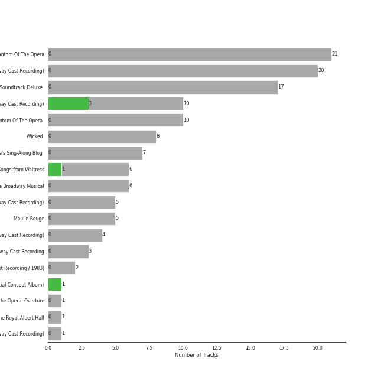

# Musicals

109 songs

## Top Artists

See all 57 artists

|   Number of Tracks | Art                                                                                              | Artist                                                                                               | 🔗                                                           |
|-------------------:|:-------------------------------------------------------------------------------------------------|:-----------------------------------------------------------------------------------------------------|:------------------------------------------------------------|
|                 33 |  | [Original Broadway Cast of Hamilton](../artists/original_broadway_cast_of_hamilton.md)               | [🔗](https://open.spotify.com/artist/3UUJfRbrA2nTbcg4i0MOwu) |
|                 31 |  | [Andrew Lloyd Webber](../artists/andrew_lloyd_webber.md)                                             | [🔗](https://open.spotify.com/artist/4aP1lp10BRYZO658B2NwkG) |
|                 30 |  | [Lin-Manuel Miranda](../artists/lin_manuel_miranda.md)                                               | [🔗](https://open.spotify.com/artist/4aXXDj9aZnlshx7mzj3W1N) |
|                 22 |  | [Leslie Odom Jr.](../artists/leslie_odom_jr_.md)                                                     | [🔗](https://open.spotify.com/artist/3cR4rhS2hBWqI7rJEBacvN) |
|                 21 |  | [Phantom Of The Opera Original London Cast](../artists/phantom_of_the_opera_original_london_cast.md) | [🔗](https://open.spotify.com/artist/3LfD2yRlfHAtTryX8rFp25) |
|                 14 |  | [Sarah Brightman](../artists/sarah_brightman.md)                                                     | [🔗](https://open.spotify.com/artist/7Ead768rc4ShGxnqtqccU5) |
|                 13 |  | [Daveed Diggs](../artists/daveed_diggs.md)                                                           | [🔗](https://open.spotify.com/artist/3twuAojvYNrlWZpMkxLm3P) |
|                 12 |                                                               | [Okieriete Onaodowan](../artists/okieriete_onaodowan.md)                                             | [🔗](https://open.spotify.com/artist/6G3sPhnj4JBCsBVBGvZnkk) |
|                 11 |  | [Anthony Ramos](../artists/anthony_ramos.md)                                                         | [🔗](https://open.spotify.com/artist/660YptcR0hNHJ8iEr1qcse) |
|                 11 |  | [Michael Crawford](../artists/michael_crawford.md)                                                   | [🔗](https://open.spotify.com/artist/5fRiVl9fyhUEZhcpMyIxUG) |
|                 11 |  | [Phillipa Soo](../artists/phillipa_soo.md)                                                           | [🔗](https://open.spotify.com/artist/2OEGI2wrCVmvavKEOMlccy) |
|                 11 |  | [Steve Barton](../artists/steve_barton.md)                                                           | [🔗](https://open.spotify.com/artist/1gEOIEK9jgpYvvG57BP0US) |
|                  7 |  | Christopher Jackson                                                                                  | [🔗](https://open.spotify.com/artist/6sLwRSXSUF5JTUnQaFenyj) |
|                  7 |  | Emmy Rossum                                                                                          | [🔗](https://open.spotify.com/artist/6JcDqt1rBKIWfnoPjXFYqc) |
|                  7 |  | Colm Wilkinson                                                                                       | [🔗](https://open.spotify.com/artist/4hKV8PcRBaHZqBJjSn8OJE) |
|                  6 |  | [Sara Bareilles](../artists/sara_bareilles.md)                                                       | [🔗](https://open.spotify.com/artist/2Sqr0DXoaYABbjBo9HaMkM) |
|                  5 |  | Gerard Butler                                                                                        | [🔗](https://open.spotify.com/artist/7H25O93TTUoaZ0ZaFk318U) |
|                  5 |  | Renée Elise Goldsberry                                                                               | [🔗](https://open.spotify.com/artist/5VJN4jB6PqqEg4kJiAj6Eu) |
|                  4 |  | Rosemary Ashe                                                                                        | [🔗](https://open.spotify.com/artist/3Oju6zkuJzum4svKeVhKiK) |
|                  3 |  | Jonathan Groff                                                                                       | [🔗](https://open.spotify.com/artist/7KkqUt65v6LMtR369OQ6FB) |
|                  3 |                                                               | Janet Devenish                                                                                       | [🔗](https://open.spotify.com/artist/7Ev9dg2zamUgQsRUp9DdRl) |
|                  3 |  | Frances Ruffelle                                                                                     | [🔗](https://open.spotify.com/artist/5uSeMCBhe3DiROdFrwaXkw) |
|                  3 |                                                               | Terrence Mann                                                                                        | [🔗](https://open.spotify.com/artist/5uBIsYz9WatgoViLG6pVj2) |
|                  3 |  | David Firth                                                                                          | [🔗](https://open.spotify.com/artist/4kjJU6zIfQi87yTWJMxJNw) |
|                  3 |  | Eddie Redmayne                                                                                       | [🔗](https://open.spotify.com/artist/4EJP6Qhk6l18LumCcpEfLw) |
|                  3 |                                                               | John Savident                                                                                        | [🔗](https://open.spotify.com/artist/2V0W4YzPCESOh86ss7D2QE) |
|                  3 |                                                               | Mary Millar                                                                                          | [🔗](https://open.spotify.com/artist/1SBvpcra5uod7N0rxJxa3J) |
|                  2 |  | Judy Kuhn                                                                                            | [🔗](https://open.spotify.com/artist/7tHd518aPjJYUgyv9bidBz) |
|                  2 |  | Michael Maguire                                                                                      | [🔗](https://open.spotify.com/artist/6QjRwce37TfXfjx81KqQ7N) |
|                  2 |  | Samantha Barks                                                                                       | [🔗](https://open.spotify.com/artist/4gOl5m9dY7IGAipqpul7GZ) |
|                  2 |  | Jasmine Cephas-Jones                                                                                 | [🔗](https://open.spotify.com/artist/4H3e5t5utgPvj6Nsuda5QF) |
|                  2 |                                                               | Robert Billig                                                                                        | [🔗](https://open.spotify.com/artist/3Ybg9gi5V2x6i8OsLc9M7p) |
|                  2 |  | David Bryant                                                                                         | [🔗](https://open.spotify.com/artist/2yPfp367ZwywK1lbGg00b8) |
|                  2 |                                                               | Randy Graff                                                                                          | [🔗](https://open.spotify.com/artist/2iRiwwxcJb6fXCxO5jt1cz) |
|                  2 |                                                               | Patrick Wilson                                                                                       | [🔗](https://open.spotify.com/artist/0z5nxdz5osD8FsmaUDmfC0) |
|                  1 |  | Students                                                                                             | [🔗](https://open.spotify.com/artist/7oaoEBdRqHXfoiGYa55Atp) |
|                  1 |  | Les Misérables Cast                                                                                  | [🔗](https://open.spotify.com/artist/71wy5iisVKXLZgoPxdFi8A) |
|                  1 |  | Jon Rua                                                                                              | [🔗](https://open.spotify.com/artist/69NsP4MC1JbfvKMwpx2oy8) |
|                  1 |  | Aaron Tveit                                                                                          | [🔗](https://open.spotify.com/artist/68h2f0WXn4zEctSgNYozXx) |
|                  1 |  | Minnie Driver                                                                                        | [🔗](https://open.spotify.com/artist/5rNwd5kb1cxVBCQKnDO4b8) |
|                  1 |  | Amanda Seyfried                                                                                      | [🔗](https://open.spotify.com/artist/5RZjpmuD14JKXvB8Ry1G1u) |
|                  1 |                                                               | John Aron                                                                                            | [🔗](https://open.spotify.com/artist/5Hco9oOhEcTrU0hzzIkoF7) |
|                  1 |  | Hugh Jackman                                                                                         | [🔗](https://open.spotify.com/artist/5F1aoppMtU3OMiltO8ymJ2) |
|                  1 |                                                               | Jesse Corti                                                                                          | [🔗](https://open.spotify.com/artist/53vhGhGRoi9ARM7kr3jrz5) |
|                  1 |  | Jason Mraz                                                                                           | [🔗](https://open.spotify.com/artist/4phGZZrJZRo4ElhRtViYdl) |
|                  1 |                                                               | Thayne Jasperson                                                                                     | [🔗](https://open.spotify.com/artist/4lSm9vkdpKSs1O8nKflRaB) |
|                  1 |  | Donna Vivino                                                                                         | [🔗](https://open.spotify.com/artist/4IDNKwIch36V0UvtfUQF9k) |
|                  1 |                                                               | Ephraim Sykes                                                                                        | [🔗](https://open.spotify.com/artist/3brilvMAN6ILRUMvaqJWdG) |
|                  1 |                                                               | Janos Kurucz                                                                                         | [🔗](https://open.spotify.com/artist/3MiTXPOmIgoJioulWki8dz) |
|                  1 |  | Jennifer Ellison                                                                                     | [🔗](https://open.spotify.com/artist/3FAYTkACAc9Ir1snu0ZzSy) |
|                  1 |                                                               | Sydney James Harcourt                                                                                | [🔗](https://open.spotify.com/artist/2fHcpUAFhqmfloo2HkBN3e) |
|                  1 |  | Ariana DeBose                                                                                        | [🔗](https://open.spotify.com/artist/1Np9GsrPO7dlczjvdehBxs) |
|                  1 |  | Anne Hathaway                                                                                        | [🔗](https://open.spotify.com/artist/0nIyPY7J7G68WgQEOLHn0x) |
|                  1 |                                                               | Braden Danner                                                                                        | [🔗](https://open.spotify.com/artist/0n5FRSY5ldzVwzb6Tq9Ya3) |
|                  1 |  | Les Misérables - 10th Anniversary Concert Cast                                                       | [🔗](https://open.spotify.com/artist/0cRX0gc8vmwKmV0RWqCV2L) |
|                  1 |                                                               | Sasha Hutchings                                                                                      | [🔗](https://open.spotify.com/artist/0Pg2rEmiZEnmxw4eQwtvsR) |
|                  1 |  | Cindy Benson                                                                                         | [🔗](https://open.spotify.com/artist/0OIRFXSbEOgnGZXXccjvgt) |

## Top Albums

See all 7 albums

|   Number of Tracks | Art                                                                                              | Album                                                                 | 🔗                                                          |
|-------------------:|:-------------------------------------------------------------------------------------------------|:----------------------------------------------------------------------|:-----------------------------------------------------------|
|                 46 |  | Hamilton (Original Broadway Cast Recording)                           | [🔗](https://open.spotify.com/album/1kCHru7uhxBUdzkm4gzRQc) |
|                 21 |  | The Phantom Of The Opera                                              | [🔗](https://open.spotify.com/album/36bEg6FTBaZGLg9ngJZIU6) |
|                 20 |  | Les Misérables (Original Broadway Cast Recording)                     | [🔗](https://open.spotify.com/album/3jbKDx0zB1QoJQTw8i1AvD) |
|                 10 |  | The Phantom Of The Opera (Original Motion Picture Soundtrack)         | [🔗](https://open.spotify.com/album/1zwEN9cLtWg39zFJnj8brt) |
|                  6 |  | What's Inside: Songs from Waitress                                    | [🔗](https://open.spotify.com/album/1s6codM2ZAB008t9GTyaEk) |
|                  5 |  | Les Misérables: The Motion Picture Soundtrack Deluxe (Deluxe Edition) | [🔗](https://open.spotify.com/album/0I6Bl1dVB1hQsSoQF6KuTg) |
|                  1 |  | Les Misérables: In Concert at the Royal Albert Hall                   | [🔗](https://open.spotify.com/album/15L0rrHDr8Q21y7e8WAo8S) |

## Top Record Labels

See all 6 labels

|   Number of Tracks | Label                           |
|-------------------:|:--------------------------------|
|                 46 | Atlantic Records                |
|                 26 | Polydor Records                 |
|                 20 | Verve (Adult Contemporary) MC   |
|                 10 | UMC (Universal Music Catalogue) |
|                  6 | Epic                            |
|                  1 | First Night Records             |

## Tracks

| Art                                                                                              | Track                                                                                | Album                                                                 | Artists                                                                                                                                                                                                                                                                                                                                                                                                               | Label                           | 💚   | 🔗                                                          |
|:-------------------------------------------------------------------------------------------------|:-------------------------------------------------------------------------------------|:----------------------------------------------------------------------|:----------------------------------------------------------------------------------------------------------------------------------------------------------------------------------------------------------------------------------------------------------------------------------------------------------------------------------------------------------------------------------------------------------------------|:--------------------------------|:----|:-----------------------------------------------------------|
|  | In My Life                                                                           | Les Misérables: The Motion Picture Soundtrack Deluxe (Deluxe Edition) | Amanda Seyfried, Eddie Redmayne, Samantha Barks, Hugh Jackman                                                                                                                                                                                                                                                                                                                                                         | Polydor Records                 |     | [🔗](https://open.spotify.com/track/36vPj8etuV0nTqjpvpp2CA) |
|  | Overture - From 'The Phantom Of The Opera' Motion Picture                            | The Phantom Of The Opera (Original Motion Picture Soundtrack)         | [Andrew Lloyd Webber](../artists/andrew_lloyd_webber.md)                                                                                                                                                                                                                                                                                                                                                              | UMC (Universal Music Catalogue) |     | [🔗](https://open.spotify.com/track/7o3DV1szMH5Fd38f1QwgPO) |
|  | Wishing You Were Somehow Here Again - From 'The Phantom Of The Opera' Motion Picture | The Phantom Of The Opera (Original Motion Picture Soundtrack)         | [Andrew Lloyd Webber](../artists/andrew_lloyd_webber.md), Emmy Rossum                                                                                                                                                                                                                                                                                                                                                 | UMC (Universal Music Catalogue) |     | [🔗](https://open.spotify.com/track/6axlN6wdRRrzElmyPXuGIC) |
|  | The Mirror (Angel Of Music) - From 'The Phantom Of The Opera' Motion Picture         | The Phantom Of The Opera (Original Motion Picture Soundtrack)         | [Andrew Lloyd Webber](../artists/andrew_lloyd_webber.md), Emmy Rossum, Gerard Butler                                                                                                                                                                                                                                                                                                                                  | UMC (Universal Music Catalogue) |     | [🔗](https://open.spotify.com/track/5PRz8hvi9y6S36WIreol1U) |
|  | The Phantom Of the Opera - From 'The Phantom Of The Opera' Motion Picture            | The Phantom Of The Opera (Original Motion Picture Soundtrack)         | [Andrew Lloyd Webber](../artists/andrew_lloyd_webber.md), Emmy Rossum, Gerard Butler                                                                                                                                                                                                                                                                                                                                  | UMC (Universal Music Catalogue) |     | [🔗](https://open.spotify.com/track/4EaBMhUIOfnFEbIgqCfKbi) |
|  | The Point Of No Return - From 'The Phantom Of The Opera' Motion Picture              | The Phantom Of The Opera (Original Motion Picture Soundtrack)         | [Andrew Lloyd Webber](../artists/andrew_lloyd_webber.md), Emmy Rossum, Gerard Butler                                                                                                                                                                                                                                                                                                                                  | UMC (Universal Music Catalogue) |     | [🔗](https://open.spotify.com/track/1eFXVUWd8Dc8bTfbKzTntz) |
|  | Angel Of Music - From 'The Phantom Of The Opera' Motion Picture                      | The Phantom Of The Opera (Original Motion Picture Soundtrack)         | [Andrew Lloyd Webber](../artists/andrew_lloyd_webber.md), Emmy Rossum, Gerard Butler, Jennifer Ellison                                                                                                                                                                                                                                                                                                                | UMC (Universal Music Catalogue) |     | [🔗](https://open.spotify.com/track/5o0xOQhYxr3KqYn4cRE6Ed) |
|  | All I Ask Of You - From 'The Phantom Of The Opera' Motion Picture                    | The Phantom Of The Opera (Original Motion Picture Soundtrack)         | [Andrew Lloyd Webber](../artists/andrew_lloyd_webber.md), Emmy Rossum, Patrick Wilson                                                                                                                                                                                                                                                                                                                                 | UMC (Universal Music Catalogue) |     | [🔗](https://open.spotify.com/track/5klrh466oGToybceGHPGAX) |
|  | Think Of Me - From 'The Phantom Of The Opera' Motion Picture                         | The Phantom Of The Opera (Original Motion Picture Soundtrack)         | [Andrew Lloyd Webber](../artists/andrew_lloyd_webber.md), Emmy Rossum, Patrick Wilson                                                                                                                                                                                                                                                                                                                                 | UMC (Universal Music Catalogue) |     | [🔗](https://open.spotify.com/track/6eJ0qhctR7doDBkS9SL9cy) |
|  | The Music Of The Night - From 'The Phantom Of The Opera' Motion Picture              | The Phantom Of The Opera (Original Motion Picture Soundtrack)         | [Andrew Lloyd Webber](../artists/andrew_lloyd_webber.md), Gerard Butler                                                                                                                                                                                                                                                                                                                                               | UMC (Universal Music Catalogue) |     | [🔗](https://open.spotify.com/track/5byUll2f3Zgnli3wJPoKRL) |
|  | Learn To Be Lonely - From 'The Phantom Of The Opera' Motion Picture                  | The Phantom Of The Opera (Original Motion Picture Soundtrack)         | [Andrew Lloyd Webber](../artists/andrew_lloyd_webber.md), Minnie Driver                                                                                                                                                                                                                                                                                                                                               | UMC (Universal Music Catalogue) |     | [🔗](https://open.spotify.com/track/3LpvO6PZRuQ0OeFL1LQwtB) |
|  | Overture                                                                             | The Phantom Of The Opera                                              | [Andrew Lloyd Webber](../artists/andrew_lloyd_webber.md), [Phantom Of The Opera Original London Cast](../artists/phantom_of_the_opera_original_london_cast.md)                                                                                                                                                                                                                                                        | Polydor Records                 |     | [🔗](https://open.spotify.com/track/37u4N8Nje0UIJINbW7QULX) |
|  | Magical Lasso                                                                        | The Phantom Of The Opera                                              | [Andrew Lloyd Webber](../artists/andrew_lloyd_webber.md), [Phantom Of The Opera Original London Cast](../artists/phantom_of_the_opera_original_london_cast.md), Janet Devenish, Janos Kurucz, Mary Millar                                                                                                                                                                                                             | Polydor Records                 |     | [🔗](https://open.spotify.com/track/7egD3vWokabEvOB2TD7iCl) |
|  | Entr'Acte                                                                            | The Phantom Of The Opera                                              | [Andrew Lloyd Webber](../artists/andrew_lloyd_webber.md), [Phantom Of The Opera Original London Cast](../artists/phantom_of_the_opera_original_london_cast.md), John Savident, David Firth                                                                                                                                                                                                                            | Polydor Records                 |     | [🔗](https://open.spotify.com/track/0cLoao2k6VaLjbvtxtYCtO) |
|  | The Music Of The Night                                                               | The Phantom Of The Opera                                              | [Andrew Lloyd Webber](../artists/andrew_lloyd_webber.md), [Phantom Of The Opera Original London Cast](../artists/phantom_of_the_opera_original_london_cast.md), [Michael Crawford](../artists/michael_crawford.md)                                                                                                                                                                                                    | Polydor Records                 |     | [🔗](https://open.spotify.com/track/2jF3AQzvTj9L1Ax9Di5BYu) |
|  | Poor Fool, He Makes Me Laugh                                                         | The Phantom Of The Opera                                              | [Andrew Lloyd Webber](../artists/andrew_lloyd_webber.md), [Phantom Of The Opera Original London Cast](../artists/phantom_of_the_opera_original_london_cast.md), Rosemary Ashe                                                                                                                                                                                                                                         | Polydor Records                 |     | [🔗](https://open.spotify.com/track/50yxhOQupboMoF1xgzLza3) |
|  | Wishing You Were Somehow Here Again                                                  | The Phantom Of The Opera                                              | [Andrew Lloyd Webber](../artists/andrew_lloyd_webber.md), [Phantom Of The Opera Original London Cast](../artists/phantom_of_the_opera_original_london_cast.md), [Sarah Brightman](../artists/sarah_brightman.md)                                                                                                                                                                                                      | Polydor Records                 |     | [🔗](https://open.spotify.com/track/1bjDpl9BW6AWAjH4ZKtxHX) |
|  | Angel Of Music                                                                       | The Phantom Of The Opera                                              | [Andrew Lloyd Webber](../artists/andrew_lloyd_webber.md), [Phantom Of The Opera Original London Cast](../artists/phantom_of_the_opera_original_london_cast.md), [Sarah Brightman](../artists/sarah_brightman.md), Janet Devenish                                                                                                                                                                                      | Polydor Records                 |     | [🔗](https://open.spotify.com/track/48eRbUfNOF4xnNHwSSYubb) |
|  | I Remember / Stranger Than You Dreamt It                                             | The Phantom Of The Opera                                              | [Andrew Lloyd Webber](../artists/andrew_lloyd_webber.md), [Phantom Of The Opera Original London Cast](../artists/phantom_of_the_opera_original_london_cast.md), [Sarah Brightman](../artists/sarah_brightman.md), [Michael Crawford](../artists/michael_crawford.md)                                                                                                                                                  | Polydor Records                 |     | [🔗](https://open.spotify.com/track/0FwP3tsHCfmMJDe0vEkRUG) |
|  | The Phantom Of The Opera                                                             | The Phantom Of The Opera                                              | [Andrew Lloyd Webber](../artists/andrew_lloyd_webber.md), [Phantom Of The Opera Original London Cast](../artists/phantom_of_the_opera_original_london_cast.md), [Sarah Brightman](../artists/sarah_brightman.md), [Michael Crawford](../artists/michael_crawford.md)                                                                                                                                                  | Polydor Records                 |     | [🔗](https://open.spotify.com/track/5qlABWwod6dgDCmRAAF5J5) |
|  | The Point Of No Return                                                               | The Phantom Of The Opera                                              | [Andrew Lloyd Webber](../artists/andrew_lloyd_webber.md), [Phantom Of The Opera Original London Cast](../artists/phantom_of_the_opera_original_london_cast.md), [Sarah Brightman](../artists/sarah_brightman.md), [Michael Crawford](../artists/michael_crawford.md)                                                                                                                                                  | Polydor Records                 |     | [🔗](https://open.spotify.com/track/18y1ZP9WCMunAe6QgByGif) |
|  | Prologue                                                                             | The Phantom Of The Opera                                              | [Andrew Lloyd Webber](../artists/andrew_lloyd_webber.md), [Phantom Of The Opera Original London Cast](../artists/phantom_of_the_opera_original_london_cast.md), [Steve Barton](../artists/steve_barton.md)                                                                                                                                                                                                            | Polydor Records                 |     | [🔗](https://open.spotify.com/track/1bdfgBPqPzUrSDQf46KMVz) |
|  | Notes / Prima Donna                                                                  | The Phantom Of The Opera                                              | [Andrew Lloyd Webber](../artists/andrew_lloyd_webber.md), [Phantom Of The Opera Original London Cast](../artists/phantom_of_the_opera_original_london_cast.md), [Steve Barton](../artists/steve_barton.md), Rosemary Ashe, Janet Devenish, [Michael Crawford](../artists/michael_crawford.md), Mary Millar, John Savident, David Firth                                                                                | Polydor Records                 |     | [🔗](https://open.spotify.com/track/7uFofIX6vcvU7vl4jlttEr) |
|  | Think Of Me                                                                          | The Phantom Of The Opera                                              | [Andrew Lloyd Webber](../artists/andrew_lloyd_webber.md), [Phantom Of The Opera Original London Cast](../artists/phantom_of_the_opera_original_london_cast.md), [Steve Barton](../artists/steve_barton.md), Rosemary Ashe, [Sarah Brightman](../artists/sarah_brightman.md)                                                                                                                                           | Polydor Records                 |     | [🔗](https://open.spotify.com/track/31Irb8d3UBRfEcaHDzQxsK) |
|  | Notes / Twisted Every Way                                                            | The Phantom Of The Opera                                              | [Andrew Lloyd Webber](../artists/andrew_lloyd_webber.md), [Phantom Of The Opera Original London Cast](../artists/phantom_of_the_opera_original_london_cast.md), [Steve Barton](../artists/steve_barton.md), Rosemary Ashe, [Sarah Brightman](../artists/sarah_brightman.md), [Michael Crawford](../artists/michael_crawford.md), Mary Millar, John Savident, David Firth, John Aron                                   | Polydor Records                 |     | [🔗](https://open.spotify.com/track/7n36JwlTBuGU7TfrRwjjSr) |
|  | All I Ask Of You                                                                     | The Phantom Of The Opera                                              | [Andrew Lloyd Webber](../artists/andrew_lloyd_webber.md), [Phantom Of The Opera Original London Cast](../artists/phantom_of_the_opera_original_london_cast.md), [Steve Barton](../artists/steve_barton.md), [Sarah Brightman](../artists/sarah_brightman.md)                                                                                                                                                          | Polydor Records                 |     | [🔗](https://open.spotify.com/track/52KiYg6Kn2NB9riY2IwUgi) |
|  | Why Have You Brought Me Here                                                         | The Phantom Of The Opera                                              | [Andrew Lloyd Webber](../artists/andrew_lloyd_webber.md), [Phantom Of The Opera Original London Cast](../artists/phantom_of_the_opera_original_london_cast.md), [Steve Barton](../artists/steve_barton.md), [Sarah Brightman](../artists/sarah_brightman.md)                                                                                                                                                          | Polydor Records                 |     | [🔗](https://open.spotify.com/track/6DGALltLYPxUv3zmWLGT4x) |
|  | All I Ask Of You - Reprise                                                           | The Phantom Of The Opera                                              | [Andrew Lloyd Webber](../artists/andrew_lloyd_webber.md), [Phantom Of The Opera Original London Cast](../artists/phantom_of_the_opera_original_london_cast.md), [Steve Barton](../artists/steve_barton.md), [Sarah Brightman](../artists/sarah_brightman.md), [Michael Crawford](../artists/michael_crawford.md)                                                                                                      | Polydor Records                 |     | [🔗](https://open.spotify.com/track/0F8VLTQGhNjBi1ltbVerdE) |
|  | Down Once More / Track Down This Murderer                                            | The Phantom Of The Opera                                              | [Andrew Lloyd Webber](../artists/andrew_lloyd_webber.md), [Phantom Of The Opera Original London Cast](../artists/phantom_of_the_opera_original_london_cast.md), [Steve Barton](../artists/steve_barton.md), [Sarah Brightman](../artists/sarah_brightman.md), [Michael Crawford](../artists/michael_crawford.md)                                                                                                      | Polydor Records                 |     | [🔗](https://open.spotify.com/track/08w39owyASWYcB9lO30DRC) |
|  | Little Lotte / The Mirror (Angel Of Music)                                           | The Phantom Of The Opera                                              | [Andrew Lloyd Webber](../artists/andrew_lloyd_webber.md), [Phantom Of The Opera Original London Cast](../artists/phantom_of_the_opera_original_london_cast.md), [Steve Barton](../artists/steve_barton.md), [Sarah Brightman](../artists/sarah_brightman.md), [Michael Crawford](../artists/michael_crawford.md)                                                                                                      | Polydor Records                 |     | [🔗](https://open.spotify.com/track/6DUe3XqMPk2OMsT3QQfcVE) |
|  | Masquerade / Why So Silent                                                           | The Phantom Of The Opera                                              | [Andrew Lloyd Webber](../artists/andrew_lloyd_webber.md), [Phantom Of The Opera Original London Cast](../artists/phantom_of_the_opera_original_london_cast.md), [Steve Barton](../artists/steve_barton.md), [Sarah Brightman](../artists/sarah_brightman.md), [Michael Crawford](../artists/michael_crawford.md)                                                                                                      | Polydor Records                 |     | [🔗](https://open.spotify.com/track/1z2oyr9Uu9GCz31kycvPuX) |
|  | Wandering Child / Bravo, Monsieur                                                    | The Phantom Of The Opera                                              | [Andrew Lloyd Webber](../artists/andrew_lloyd_webber.md), [Phantom Of The Opera Original London Cast](../artists/phantom_of_the_opera_original_london_cast.md), [Steve Barton](../artists/steve_barton.md), [Sarah Brightman](../artists/sarah_brightman.md), [Michael Crawford](../artists/michael_crawford.md)                                                                                                      | Polydor Records                 |     | [🔗](https://open.spotify.com/track/6hrnZnUl70iElye8lbjoI5) |
|  | I Dreamed A Dream - From "Les Misérables"                                            | Les Misérables: The Motion Picture Soundtrack Deluxe (Deluxe Edition) | Anne Hathaway                                                                                                                                                                                                                                                                                                                                                                                                         | Polydor Records                 |     | [🔗](https://open.spotify.com/track/7CNVenAoty0IomwFPaMaaH) |
|  | Look Down                                                                            | Les Misérables (Original Broadway Cast Recording)                     | Braden Danner                                                                                                                                                                                                                                                                                                                                                                                                         | Verve (Adult Contemporary) MC   |     | [🔗](https://open.spotify.com/track/3AUnp0h9tIgQW9IWRVFciJ) |
|  | One Day More                                                                         | Les Misérables (Original Broadway Cast Recording)                     | Cindy Benson, Jesse Corti                                                                                                                                                                                                                                                                                                                                                                                             | Verve (Adult Contemporary) MC   |     | [🔗](https://open.spotify.com/track/7pbmOho4IKzn3F4o65tsas) |
|  | Bring Him Home                                                                       | Les Misérables (Original Broadway Cast Recording)                     | Colm Wilkinson                                                                                                                                                                                                                                                                                                                                                                                                        | Verve (Adult Contemporary) MC   |     | [🔗](https://open.spotify.com/track/5JZNwoZsUfmxslDNt43DxK) |
|  | What Have I Done?                                                                    | Les Misérables (Original Broadway Cast Recording)                     | Colm Wilkinson                                                                                                                                                                                                                                                                                                                                                                                                        | Verve (Adult Contemporary) MC   |     | [🔗](https://open.spotify.com/track/0xsW9HCRzCmqwvWbd4RzQn) |
|  | Who Am I?                                                                            | Les Misérables (Original Broadway Cast Recording)                     | Colm Wilkinson                                                                                                                                                                                                                                                                                                                                                                                                        | Verve (Adult Contemporary) MC   |     | [🔗](https://open.spotify.com/track/3BY5jmyzzZxqulvAx6a4Or) |
|  | In My Life                                                                           | Les Misérables (Original Broadway Cast Recording)                     | Colm Wilkinson, Judy Kuhn, David Bryant, Frances Ruffelle                                                                                                                                                                                                                                                                                                                                                             | Verve (Adult Contemporary) MC   |     | [🔗](https://open.spotify.com/track/14SBWK1wvWIvh82Fzv1LQG) |
|  | Come To Me (Fantine's Death)                                                         | Les Misérables (Original Broadway Cast Recording)                     | Colm Wilkinson, Randy Graff                                                                                                                                                                                                                                                                                                                                                                                           | Verve (Adult Contemporary) MC   |     | [🔗](https://open.spotify.com/track/1YQ0vVVE0Fd8IwxT19NrVF) |
|  | Cabinet Battle #1                                                                    | Hamilton (Original Broadway Cast Recording)                           | [Daveed Diggs](../artists/daveed_diggs.md), [Okieriete Onaodowan](../artists/okieriete_onaodowan.md), [Lin-Manuel Miranda](../artists/lin_manuel_miranda.md), Christopher Jackson                                                                                                                                                                                                                                     | Atlantic Records                |     | [🔗](https://open.spotify.com/track/3TfKt8mPpdXfQTMfRjHzyz) |
|  | Cabinet Battle #2                                                                    | Hamilton (Original Broadway Cast Recording)                           | [Daveed Diggs](../artists/daveed_diggs.md), [Okieriete Onaodowan](../artists/okieriete_onaodowan.md), [Lin-Manuel Miranda](../artists/lin_manuel_miranda.md), Christopher Jackson                                                                                                                                                                                                                                     | Atlantic Records                |     | [🔗](https://open.spotify.com/track/6KRHMYPIWRgFWlXPgqO2Fp) |
|  | The Story of Tonight                                                                 | Hamilton (Original Broadway Cast Recording)                           | [Daveed Diggs](../artists/daveed_diggs.md), [Okieriete Onaodowan](../artists/okieriete_onaodowan.md), [Lin-Manuel Miranda](../artists/lin_manuel_miranda.md), [Original Broadway Cast of Hamilton](../artists/original_broadway_cast_of_hamilton.md), [Anthony Ramos](../artists/anthony_ramos.md)                                                                                                                    | Atlantic Records                |     | [🔗](https://open.spotify.com/track/0NJWhm3hUwIZSy5s0TGJ8q) |
|  | Empty Chairs At Empty Tables                                                         | Les Misérables (Original Broadway Cast Recording)                     | David Bryant                                                                                                                                                                                                                                                                                                                                                                                                          | Verve (Adult Contemporary) MC   |     | [🔗](https://open.spotify.com/track/6maepGvney4cfp1Ru3lJf3) |
|  | Castle On A Cloud                                                                    | Les Misérables (Original Broadway Cast Recording)                     | Donna Vivino                                                                                                                                                                                                                                                                                                                                                                                                          | Verve (Adult Contemporary) MC   |     | [🔗](https://open.spotify.com/track/6Emg88gR3KBl21UAcCF5OU) |
|  | Empty Chairs At Empty Tables                                                         | Les Misérables: The Motion Picture Soundtrack Deluxe (Deluxe Edition) | Eddie Redmayne                                                                                                                                                                                                                                                                                                                                                                                                        | Polydor Records                 |     | [🔗](https://open.spotify.com/track/29bONW7GKEq7ZDBqiQC2PV) |
|  | Do You Hear The People Sing?                                                         | Les Misérables: The Motion Picture Soundtrack Deluxe (Deluxe Edition) | Eddie Redmayne, Aaron Tveit, Students, Les Misérables Cast                                                                                                                                                                                                                                                                                                                                                            | Polydor Records                 |     | [🔗](https://open.spotify.com/track/0g8H61FNXHHhMVHB0jwdzH) |
|  | A Little Fall Of Rain                                                                | Les Misérables (Original Broadway Cast Recording)                     | Frances Ruffelle                                                                                                                                                                                                                                                                                                                                                                                                      | Verve (Adult Contemporary) MC   |     | [🔗](https://open.spotify.com/track/4jS5Ho70Scjk6rucwTgaNe) |
|  | On My Own                                                                            | Les Misérables (Original Broadway Cast Recording)                     | Frances Ruffelle                                                                                                                                                                                                                                                                                                                                                                                                      | Verve (Adult Contemporary) MC   |     | [🔗](https://open.spotify.com/track/0XLXG7LJ8jLMhHC5qH9rq6) |
|  | Bad Idea (feat. Jason Mraz)                                                          | What's Inside: Songs from Waitress                                    | Jason Mraz, [Sara Bareilles](../artists/sara_bareilles.md)                                                                                                                                                                                                                                                                                                                                                            | Epic                            |     | [🔗](https://open.spotify.com/track/1xi7L6YU6TRzXgh2rogz1h) |
|  | I Know Him                                                                           | Hamilton (Original Broadway Cast Recording)                           | Jonathan Groff                                                                                                                                                                                                                                                                                                                                                                                                        | Atlantic Records                |     | [🔗](https://open.spotify.com/track/4eeN8erNIbW2osT0knz5vT) |
|  | What Comes Next?                                                                     | Hamilton (Original Broadway Cast Recording)                           | Jonathan Groff                                                                                                                                                                                                                                                                                                                                                                                                        | Atlantic Records                |     | [🔗](https://open.spotify.com/track/3D4J0o9w44QKFrBrYrSVJY) |
|  | A Heart Full Of Love                                                                 | Les Misérables (Original Broadway Cast Recording)                     | Judy Kuhn                                                                                                                                                                                                                                                                                                                                                                                                             | Verve (Adult Contemporary) MC   |     | [🔗](https://open.spotify.com/track/1audfn0M2y51sgmKFHCxoC) |
|  | Building the Barricade / On My Own - Live                                            | Les Misérables: In Concert at the Royal Albert Hall                   | Les Misérables - 10th Anniversary Concert Cast                                                                                                                                                                                                                                                                                                                                                                        | First Night Records             |     | [🔗](https://open.spotify.com/track/4B1FeCxxKZYrwrb4UkpNBu) |
|  | We Know                                                                              | Hamilton (Original Broadway Cast Recording)                           | [Leslie Odom Jr.](../artists/leslie_odom_jr_.md), [Daveed Diggs](../artists/daveed_diggs.md), [Okieriete Onaodowan](../artists/okieriete_onaodowan.md), [Lin-Manuel Miranda](../artists/lin_manuel_miranda.md)                                                                                                                                                                                                        | Atlantic Records                |     | [🔗](https://open.spotify.com/track/1DLfR4MOfLYbV6v3xrmWa8) |
|  | Aaron Burr, Sir                                                                      | Hamilton (Original Broadway Cast Recording)                           | [Leslie Odom Jr.](../artists/leslie_odom_jr_.md), [Daveed Diggs](../artists/daveed_diggs.md), [Okieriete Onaodowan](../artists/okieriete_onaodowan.md), [Lin-Manuel Miranda](../artists/lin_manuel_miranda.md), [Anthony Ramos](../artists/anthony_ramos.md)                                                                                                                                                          | Atlantic Records                |     | [🔗](https://open.spotify.com/track/6dr7ekfhlbquvsVY8D7gyk) |
|  | The Story of Tonight - Reprise                                                       | Hamilton (Original Broadway Cast Recording)                           | [Leslie Odom Jr.](../artists/leslie_odom_jr_.md), [Daveed Diggs](../artists/daveed_diggs.md), [Okieriete Onaodowan](../artists/okieriete_onaodowan.md), [Lin-Manuel Miranda](../artists/lin_manuel_miranda.md), [Anthony Ramos](../artists/anthony_ramos.md)                                                                                                                                                          | Atlantic Records                |     | [🔗](https://open.spotify.com/track/1CzeuSrm71wHP9qsjg7p3F) |
|  | The Election of 1800                                                                 | Hamilton (Original Broadway Cast Recording)                           | [Leslie Odom Jr.](../artists/leslie_odom_jr_.md), [Daveed Diggs](../artists/daveed_diggs.md), [Okieriete Onaodowan](../artists/okieriete_onaodowan.md), [Lin-Manuel Miranda](../artists/lin_manuel_miranda.md), [Original Broadway Cast of Hamilton](../artists/original_broadway_cast_of_hamilton.md)                                                                                                                | Atlantic Records                |     | [🔗](https://open.spotify.com/track/0LpHC9mhPAQC98IjXZIrif) |
|  | The Room Where It Happens                                                            | Hamilton (Original Broadway Cast Recording)                           | [Leslie Odom Jr.](../artists/leslie_odom_jr_.md), [Daveed Diggs](../artists/daveed_diggs.md), [Okieriete Onaodowan](../artists/okieriete_onaodowan.md), [Lin-Manuel Miranda](../artists/lin_manuel_miranda.md), [Original Broadway Cast of Hamilton](../artists/original_broadway_cast_of_hamilton.md)                                                                                                                | Atlantic Records                |     | [🔗](https://open.spotify.com/track/2TK2KSrzXD6W01qjXVjNGh) |
|  | My Shot                                                                              | Hamilton (Original Broadway Cast Recording)                           | [Leslie Odom Jr.](../artists/leslie_odom_jr_.md), [Daveed Diggs](../artists/daveed_diggs.md), [Okieriete Onaodowan](../artists/okieriete_onaodowan.md), [Lin-Manuel Miranda](../artists/lin_manuel_miranda.md), [Original Broadway Cast of Hamilton](../artists/original_broadway_cast_of_hamilton.md), [Anthony Ramos](../artists/anthony_ramos.md)                                                                  | Atlantic Records                |     | [🔗](https://open.spotify.com/track/4cxvludVmQxryrnx1m9FqL) |
|  | Alexander Hamilton                                                                   | Hamilton (Original Broadway Cast Recording)                           | [Leslie Odom Jr.](../artists/leslie_odom_jr_.md), [Daveed Diggs](../artists/daveed_diggs.md), [Okieriete Onaodowan](../artists/okieriete_onaodowan.md), [Lin-Manuel Miranda](../artists/lin_manuel_miranda.md), [Phillipa Soo](../artists/phillipa_soo.md), Christopher Jackson, [Original Broadway Cast of Hamilton](../artists/original_broadway_cast_of_hamilton.md), [Anthony Ramos](../artists/anthony_ramos.md) | Atlantic Records                | 💚   | [🔗](https://open.spotify.com/track/4TTV7EcfroSLWzXRY6gLv6) |
|  | Washington on Your Side                                                              | Hamilton (Original Broadway Cast Recording)                           | [Leslie Odom Jr.](../artists/leslie_odom_jr_.md), [Daveed Diggs](../artists/daveed_diggs.md), [Okieriete Onaodowan](../artists/okieriete_onaodowan.md), [Original Broadway Cast of Hamilton](../artists/original_broadway_cast_of_hamilton.md)                                                                                                                                                                        | Atlantic Records                |     | [🔗](https://open.spotify.com/track/1WHNqqRWhJVZIdCScFKtl5) |
|  | What'd I Miss                                                                        | Hamilton (Original Broadway Cast Recording)                           | [Leslie Odom Jr.](../artists/leslie_odom_jr_.md), [Daveed Diggs](../artists/daveed_diggs.md), [Okieriete Onaodowan](../artists/okieriete_onaodowan.md), [Original Broadway Cast of Hamilton](../artists/original_broadway_cast_of_hamilton.md)                                                                                                                                                                        | Atlantic Records                |     | [🔗](https://open.spotify.com/track/2W9u3whoCkQYOUbmnSrHi1) |
|  | Guns and Ships                                                                       | Hamilton (Original Broadway Cast Recording)                           | [Leslie Odom Jr.](../artists/leslie_odom_jr_.md), [Daveed Diggs](../artists/daveed_diggs.md), [Original Broadway Cast of Hamilton](../artists/original_broadway_cast_of_hamilton.md)                                                                                                                                                                                                                                  | Atlantic Records                |     | [🔗](https://open.spotify.com/track/7m9XR7FquXLP1FewdAcNS9) |
|  | Dear Theodosia                                                                       | Hamilton (Original Broadway Cast Recording)                           | [Leslie Odom Jr.](../artists/leslie_odom_jr_.md), [Lin-Manuel Miranda](../artists/lin_manuel_miranda.md)                                                                                                                                                                                                                                                                                                              | Atlantic Records                |     | [🔗](https://open.spotify.com/track/2sEq2rC3ynYsT49x7utWnd) |
|  | Meet Me Inside                                                                       | Hamilton (Original Broadway Cast Recording)                           | [Leslie Odom Jr.](../artists/leslie_odom_jr_.md), [Lin-Manuel Miranda](../artists/lin_manuel_miranda.md), Christopher Jackson, [Original Broadway Cast of Hamilton](../artists/original_broadway_cast_of_hamilton.md), [Anthony Ramos](../artists/anthony_ramos.md)                                                                                                                                                   | Atlantic Records                |     | [🔗](https://open.spotify.com/track/6p7jXaTJdpzGWnOJoK2jYr) |
|  | A Winter's Ball                                                                      | Hamilton (Original Broadway Cast Recording)                           | [Leslie Odom Jr.](../artists/leslie_odom_jr_.md), [Lin-Manuel Miranda](../artists/lin_manuel_miranda.md), [Original Broadway Cast of Hamilton](../artists/original_broadway_cast_of_hamilton.md)                                                                                                                                                                                                                      | Atlantic Records                |     | [🔗](https://open.spotify.com/track/2yBMVrq96wb9OHbMdBs0lF) |
|  | Right Hand Man                                                                       | Hamilton (Original Broadway Cast Recording)                           | [Leslie Odom Jr.](../artists/leslie_odom_jr_.md), [Lin-Manuel Miranda](../artists/lin_manuel_miranda.md), [Original Broadway Cast of Hamilton](../artists/original_broadway_cast_of_hamilton.md)                                                                                                                                                                                                                      | Atlantic Records                |     | [🔗](https://open.spotify.com/track/3nJYcY9yvKP8Oi2Ml8brXt) |
|  | The World Was Wide Enough                                                            | Hamilton (Original Broadway Cast Recording)                           | [Leslie Odom Jr.](../artists/leslie_odom_jr_.md), [Lin-Manuel Miranda](../artists/lin_manuel_miranda.md), [Original Broadway Cast of Hamilton](../artists/original_broadway_cast_of_hamilton.md)                                                                                                                                                                                                                      | Atlantic Records                |     | [🔗](https://open.spotify.com/track/0P09TBGSKiQwfUsEh1UafT) |
|  | Your Obedient Servant                                                                | Hamilton (Original Broadway Cast Recording)                           | [Leslie Odom Jr.](../artists/leslie_odom_jr_.md), [Lin-Manuel Miranda](../artists/lin_manuel_miranda.md), [Original Broadway Cast of Hamilton](../artists/original_broadway_cast_of_hamilton.md)                                                                                                                                                                                                                      | Atlantic Records                |     | [🔗](https://open.spotify.com/track/6SHI6STEW51cQkAXBRpLNj) |
|  | Ten Duel Commandments                                                                | Hamilton (Original Broadway Cast Recording)                           | [Leslie Odom Jr.](../artists/leslie_odom_jr_.md), [Lin-Manuel Miranda](../artists/lin_manuel_miranda.md), [Original Broadway Cast of Hamilton](../artists/original_broadway_cast_of_hamilton.md), [Anthony Ramos](../artists/anthony_ramos.md), Jon Rua                                                                                                                                                               | Atlantic Records                |     | [🔗](https://open.spotify.com/track/3lXyAQ0kekAvY5LodpWmUs) |
|  | Say No to This                                                                       | Hamilton (Original Broadway Cast Recording)                           | [Leslie Odom Jr.](../artists/leslie_odom_jr_.md), [Lin-Manuel Miranda](../artists/lin_manuel_miranda.md), [Original Broadway Cast of Hamilton](../artists/original_broadway_cast_of_hamilton.md), Jasmine Cephas-Jones, Sydney James Harcourt                                                                                                                                                                         | Atlantic Records                | 💚   | [🔗](https://open.spotify.com/track/3s9itRgJYcKhem01P17865) |
|  | Schuyler Defeated                                                                    | Hamilton (Original Broadway Cast Recording)                           | [Leslie Odom Jr.](../artists/leslie_odom_jr_.md), [Lin-Manuel Miranda](../artists/lin_manuel_miranda.md), [Phillipa Soo](../artists/phillipa_soo.md), [Anthony Ramos](../artists/anthony_ramos.md)                                                                                                                                                                                                                    | Atlantic Records                |     | [🔗](https://open.spotify.com/track/05bhmaAD1urZnQMWNd6p3S) |
|  | Non-Stop                                                                             | Hamilton (Original Broadway Cast Recording)                           | [Leslie Odom Jr.](../artists/leslie_odom_jr_.md), [Lin-Manuel Miranda](../artists/lin_manuel_miranda.md), [Phillipa Soo](../artists/phillipa_soo.md), Christopher Jackson, [Original Broadway Cast of Hamilton](../artists/original_broadway_cast_of_hamilton.md), Renée Elise Goldsberry                                                                                                                             | Atlantic Records                |     | [🔗](https://open.spotify.com/track/7qfoq1JFKBUEIvhqOHzuqX) |
|  | Wait for It                                                                          | Hamilton (Original Broadway Cast Recording)                           | [Leslie Odom Jr.](../artists/leslie_odom_jr_.md), [Original Broadway Cast of Hamilton](../artists/original_broadway_cast_of_hamilton.md)                                                                                                                                                                                                                                                                              | Atlantic Records                | 💚   | [🔗](https://open.spotify.com/track/7EqpEBPOohgk7NnKvBGFWo) |
|  | The Schuyler Sisters                                                                 | Hamilton (Original Broadway Cast Recording)                           | [Leslie Odom Jr.](../artists/leslie_odom_jr_.md), [Phillipa Soo](../artists/phillipa_soo.md), [Original Broadway Cast of Hamilton](../artists/original_broadway_cast_of_hamilton.md), Renée Elise Goldsberry, Jasmine Cephas-Jones                                                                                                                                                                                    | Atlantic Records                |     | [🔗](https://open.spotify.com/track/71X7bPDljJHrmEGYCe7kQ8) |
|  | History Has Its Eyes on You                                                          | Hamilton (Original Broadway Cast Recording)                           | [Lin-Manuel Miranda](../artists/lin_manuel_miranda.md), Christopher Jackson, [Original Broadway Cast of Hamilton](../artists/original_broadway_cast_of_hamilton.md)                                                                                                                                                                                                                                                   | Atlantic Records                |     | [🔗](https://open.spotify.com/track/1mGO8rwCE9zk7H06OxcU5m) |
|  | One Last Time                                                                        | Hamilton (Original Broadway Cast Recording)                           | [Lin-Manuel Miranda](../artists/lin_manuel_miranda.md), Christopher Jackson, [Original Broadway Cast of Hamilton](../artists/original_broadway_cast_of_hamilton.md)                                                                                                                                                                                                                                                   | Atlantic Records                |     | [🔗](https://open.spotify.com/track/0Iys022UwQ8xBfxE1g4nWZ) |
|  | Hurricane                                                                            | Hamilton (Original Broadway Cast Recording)                           | [Lin-Manuel Miranda](../artists/lin_manuel_miranda.md), [Original Broadway Cast of Hamilton](../artists/original_broadway_cast_of_hamilton.md)                                                                                                                                                                                                                                                                        | Atlantic Records                |     | [🔗](https://open.spotify.com/track/16sNPUamj4vnA7uQLozRpU) |
|  | Blow Us All Away                                                                     | Hamilton (Original Broadway Cast Recording)                           | [Lin-Manuel Miranda](../artists/lin_manuel_miranda.md), [Original Broadway Cast of Hamilton](../artists/original_broadway_cast_of_hamilton.md), [Anthony Ramos](../artists/anthony_ramos.md), Ariana DeBose, Sasha Hutchings, Ephraim Sykes                                                                                                                                                                           | Atlantic Records                |     | [🔗](https://open.spotify.com/track/6lsFGDo1IEEPFKh94c9kFe) |
|  | Farmer Refuted                                                                       | Hamilton (Original Broadway Cast Recording)                           | [Lin-Manuel Miranda](../artists/lin_manuel_miranda.md), [Original Broadway Cast of Hamilton](../artists/original_broadway_cast_of_hamilton.md), Thayne Jasperson                                                                                                                                                                                                                                                      | Atlantic Records                |     | [🔗](https://open.spotify.com/track/2G9lekfCh83S0lt2yfffBz) |
|  | Best of Wives and Best of Women                                                      | Hamilton (Original Broadway Cast Recording)                           | [Lin-Manuel Miranda](../artists/lin_manuel_miranda.md), [Phillipa Soo](../artists/phillipa_soo.md)                                                                                                                                                                                                                                                                                                                    | Atlantic Records                |     | [🔗](https://open.spotify.com/track/1dZutYKh4BtPlxbC81wV34) |
|  | That Would Be Enough                                                                 | Hamilton (Original Broadway Cast Recording)                           | [Lin-Manuel Miranda](../artists/lin_manuel_miranda.md), [Phillipa Soo](../artists/phillipa_soo.md)                                                                                                                                                                                                                                                                                                                    | Atlantic Records                |     | [🔗](https://open.spotify.com/track/6oF8ueLn5hIl4PRp17sxW6) |
|  | Take a Break                                                                         | Hamilton (Original Broadway Cast Recording)                           | [Lin-Manuel Miranda](../artists/lin_manuel_miranda.md), [Phillipa Soo](../artists/phillipa_soo.md), [Anthony Ramos](../artists/anthony_ramos.md), Renée Elise Goldsberry                                                                                                                                                                                                                                              | Atlantic Records                |     | [🔗](https://open.spotify.com/track/2qFIJT5hjqaNFA1GKwl9me) |
|  | Stay Alive - Reprise                                                                 | Hamilton (Original Broadway Cast Recording)                           | [Lin-Manuel Miranda](../artists/lin_manuel_miranda.md), [Phillipa Soo](../artists/phillipa_soo.md), [Original Broadway Cast of Hamilton](../artists/original_broadway_cast_of_hamilton.md), [Anthony Ramos](../artists/anthony_ramos.md)                                                                                                                                                                              | Atlantic Records                |     | [🔗](https://open.spotify.com/track/2ydKgIVZAQXeYLWtxU8DFS) |
|  | It's Quiet Uptown                                                                    | Hamilton (Original Broadway Cast Recording)                           | [Lin-Manuel Miranda](../artists/lin_manuel_miranda.md), [Phillipa Soo](../artists/phillipa_soo.md), [Original Broadway Cast of Hamilton](../artists/original_broadway_cast_of_hamilton.md), Renée Elise Goldsberry                                                                                                                                                                                                    | Atlantic Records                |     | [🔗](https://open.spotify.com/track/40LYL1Z6xgCn5cBybo5K0D) |
|  | Do You Hear The People Sing?                                                         | Les Misérables (Original Broadway Cast Recording)                     | Michael Maguire                                                                                                                                                                                                                                                                                                                                                                                                       | Verve (Adult Contemporary) MC   |     | [🔗](https://open.spotify.com/track/491YFwJXZsHzw3SFcETr8b) |
|  | Red And Black                                                                        | Les Misérables (Original Broadway Cast Recording)                     | Michael Maguire                                                                                                                                                                                                                                                                                                                                                                                                       | Verve (Adult Contemporary) MC   |     | [🔗](https://open.spotify.com/track/7IzBQ5a1LIFNW3U9jqWCaF) |
|  | Stay Alive                                                                           | Hamilton (Original Broadway Cast Recording)                           | [Original Broadway Cast of Hamilton](../artists/original_broadway_cast_of_hamilton.md)                                                                                                                                                                                                                                                                                                                                | Atlantic Records                |     | [🔗](https://open.spotify.com/track/27MB0qHaYAZiTlwg25js1Y) |
|  | The Adams Administration                                                             | Hamilton (Original Broadway Cast Recording)                           | [Original Broadway Cast of Hamilton](../artists/original_broadway_cast_of_hamilton.md)                                                                                                                                                                                                                                                                                                                                | Atlantic Records                |     | [🔗](https://open.spotify.com/track/68Ijc4fPmT3P5BN6Vrl2s2) |
|  | The Reynolds Pamphlet                                                                | Hamilton (Original Broadway Cast Recording)                           | [Original Broadway Cast of Hamilton](../artists/original_broadway_cast_of_hamilton.md)                                                                                                                                                                                                                                                                                                                                | Atlantic Records                |     | [🔗](https://open.spotify.com/track/7D1Lf7N7AtCuEq5PGJtIPz) |
|  | Who Lives, Who Dies, Who Tells Your Story                                            | Hamilton (Original Broadway Cast Recording)                           | [Original Broadway Cast of Hamilton](../artists/original_broadway_cast_of_hamilton.md)                                                                                                                                                                                                                                                                                                                                | Atlantic Records                |     | [🔗](https://open.spotify.com/track/7EsSVPxaYoAZjQwhspJBs2) |
|  | Yorktown (The World Turned Upside Down)                                              | Hamilton (Original Broadway Cast Recording)                           | [Original Broadway Cast of Hamilton](../artists/original_broadway_cast_of_hamilton.md)                                                                                                                                                                                                                                                                                                                                | Atlantic Records                |     | [🔗](https://open.spotify.com/track/733tju3KUeatsbjcTRQ04i) |
|  | You'll Be Back                                                                       | Hamilton (Original Broadway Cast Recording)                           | [Original Broadway Cast of Hamilton](../artists/original_broadway_cast_of_hamilton.md), Jonathan Groff                                                                                                                                                                                                                                                                                                                | Atlantic Records                |     | [🔗](https://open.spotify.com/track/6OG1S805gIrH5nAQbEOPY3) |
|  | Satisfied                                                                            | Hamilton (Original Broadway Cast Recording)                           | [Original Broadway Cast of Hamilton](../artists/original_broadway_cast_of_hamilton.md), Renée Elise Goldsberry                                                                                                                                                                                                                                                                                                        | Atlantic Records                |     | [🔗](https://open.spotify.com/track/3dP0pLbg9OfVwssDjp9aT0) |
|  | Burn                                                                                 | Hamilton (Original Broadway Cast Recording)                           | [Phillipa Soo](../artists/phillipa_soo.md)                                                                                                                                                                                                                                                                                                                                                                            | Atlantic Records                |     | [🔗](https://open.spotify.com/track/4B3qvzOMzLQXLeYgPsG3KA) |
|  | Helpless                                                                             | Hamilton (Original Broadway Cast Recording)                           | [Phillipa Soo](../artists/phillipa_soo.md), [Original Broadway Cast of Hamilton](../artists/original_broadway_cast_of_hamilton.md)                                                                                                                                                                                                                                                                                    | Atlantic Records                |     | [🔗](https://open.spotify.com/track/54Sc7mZQ1RM03STpk4SfaA) |
|  | I Dreamed A Dream                                                                    | Les Misérables (Original Broadway Cast Recording)                     | Randy Graff                                                                                                                                                                                                                                                                                                                                                                                                           | Verve (Adult Contemporary) MC   |     | [🔗](https://open.spotify.com/track/0c5Y1J8ihMN8vvQ3bsoxlZ) |
|  | At The End Of The Day                                                                | Les Misérables (Original Broadway Cast Recording)                     | Robert Billig                                                                                                                                                                                                                                                                                                                                                                                                         | Verve (Adult Contemporary) MC   |     | [🔗](https://open.spotify.com/track/0mF1fLbjCfkE4mO4n5xHWk) |
|  | Lovely Ladies                                                                        | Les Misérables (Original Broadway Cast Recording)                     | Robert Billig                                                                                                                                                                                                                                                                                                                                                                                                         | Verve (Adult Contemporary) MC   |     | [🔗](https://open.spotify.com/track/35QHqaQSfKROhcBJxgFlct) |
|  | On My Own                                                                            | Les Misérables: The Motion Picture Soundtrack Deluxe (Deluxe Edition) | Samantha Barks                                                                                                                                                                                                                                                                                                                                                                                                        | Polydor Records                 |     | [🔗](https://open.spotify.com/track/3Mr6ofzF6ZuYiqHh8qNud3) |
|  | Everything Changes                                                                   | What's Inside: Songs from Waitress                                    | [Sara Bareilles](../artists/sara_bareilles.md)                                                                                                                                                                                                                                                                                                                                                                        | Epic                            |     | [🔗](https://open.spotify.com/track/11R6SmSuzXE8ftk1vlPEKP) |
|  | I Didn't Plan It                                                                     | What's Inside: Songs from Waitress                                    | [Sara Bareilles](../artists/sara_bareilles.md)                                                                                                                                                                                                                                                                                                                                                                        | Epic                            |     | [🔗](https://open.spotify.com/track/5EPytk5jah5T1EqOmu1QfP) |
|  | Opening Up                                                                           | What's Inside: Songs from Waitress                                    | [Sara Bareilles](../artists/sara_bareilles.md)                                                                                                                                                                                                                                                                                                                                                                        | Epic                            |     | [🔗](https://open.spotify.com/track/24VwpFC93affqIkztFIIic) |
|  | She Used To Be Mine                                                                  | What's Inside: Songs from Waitress                                    | [Sara Bareilles](../artists/sara_bareilles.md)                                                                                                                                                                                                                                                                                                                                                                        | Epic                            | 💚   | [🔗](https://open.spotify.com/track/2D4BSm5Z8Hq5zYbSgJwEOh) |
|  | What's Inside                                                                        | What's Inside: Songs from Waitress                                    | [Sara Bareilles](../artists/sara_bareilles.md)                                                                                                                                                                                                                                                                                                                                                                        | Epic                            |     | [🔗](https://open.spotify.com/track/2t0P8YsXXHVLs7e95rwZbt) |
|  | Stars                                                                                | Les Misérables (Original Broadway Cast Recording)                     | Terrence Mann                                                                                                                                                                                                                                                                                                                                                                                                         | Verve (Adult Contemporary) MC   |     | [🔗](https://open.spotify.com/track/7a0dC4TKvEGZMbyAQUuiex) |
|  | Confrontation                                                                        | Les Misérables (Original Broadway Cast Recording)                     | Terrence Mann, Colm Wilkinson                                                                                                                                                                                                                                                                                                                                                                                         | Verve (Adult Contemporary) MC   |     | [🔗](https://open.spotify.com/track/2eqCnMN561yzr6wag6VeiB) |
|  | Overture / Work Song                                                                 | Les Misérables (Original Broadway Cast Recording)                     | Terrence Mann, Colm Wilkinson                                                                                                                                                                                                                                                                                                                                                                                         | Verve (Adult Contemporary) MC   |     | [🔗](https://open.spotify.com/track/1J9f8hnL1JpkzQwwDMhhx8) |
