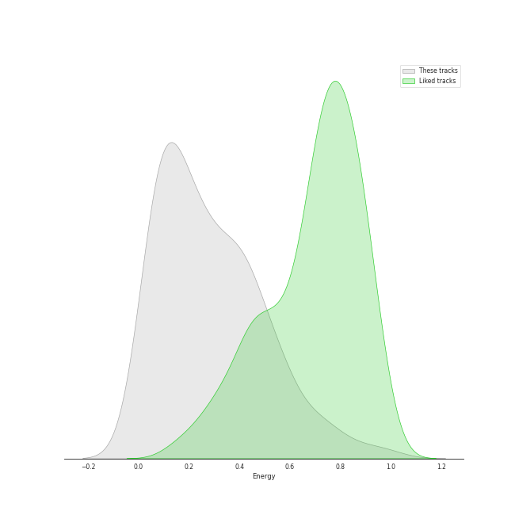
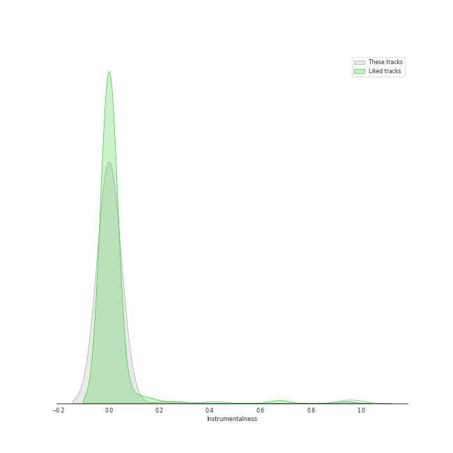
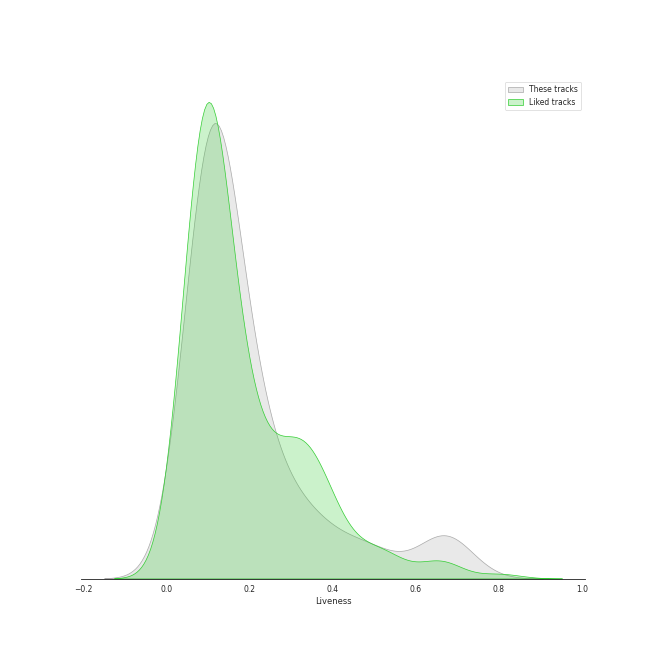

# Audio Features for Musicals

## Danceability

| 10 most Danceable tracks | 10 least Danceable tracks |
|:---|:---|
| Ten Duel Commandments (0.887) | The Music Of The Night - From 'The Phantom Of The Opera' Motion Picture (0.169) |
| Washington on Your Side (0.884) | All I Ask Of You - Reprise (0.191) |
| A Winter's Ball (0.854) | All I Ask Of You - From 'The Phantom Of The Opera' Motion Picture (0.194) |
| Blow Us All Away (0.82) | I Dreamed A Dream (0.214) |
| The Adams Administration (0.8) | One Day More (0.214) |
| Farmer Refuted (0.795) | Wishing You Were Somehow Here Again - From 'The Phantom Of The Opera' Motion Picture (0.219) |
| Non-Stop (0.77) | All I Ask Of You (0.222) |
| Yorktown (The World Turned Upside Down) (0.76) | Overture (0.224) |
| Say No to This (0.754) | Learn To Be Lonely - From 'The Phantom Of The Opera' Motion Picture (0.227) |
| Cabinet Battle #2 (0.753) | Entr'Acte (0.231) |

## Energy

| 10 most Energetic tracks | 10 least Energetic tracks |
|:---|:---|
| Bad Idea (feat. Jason Mraz) (0.889) | Castle On A Cloud (0.0129) |
| Yorktown (The World Turned Upside Down) (0.883) | A Little Fall Of Rain (0.0291) |
| The Schuyler Sisters (0.727) | Magical Lasso (0.0314) |
| Opening Up (0.723) | Angel Of Music - From 'The Phantom Of The Opera' Motion Picture (0.0401) |
| I Didn't Plan It (0.699) | Bring Him Home (0.0586) |
| Guns and Ships (0.666) | In My Life (0.0594) |
| Cabinet Battle #1 (0.658) | Wishing You Were Somehow Here Again - From 'The Phantom Of The Opera' Motion Picture (0.0617) |
| My Shot (0.649) | All I Ask Of You - Reprise (0.0679) |
| Meet Me Inside (0.643) | Empty Chairs At Empty Tables (0.0688) |
| The Phantom Of the Opera - From 'The Phantom Of The Opera' Motion Picture (0.608) | Come To Me (Fantine's Death) (0.0698) |

## Speechiness

| 10 most Speechy tracks | 10 least Speechy tracks |
|:---|:---|
| Aaron Burr, Sir (0.818) | History Has Its Eyes on You (0.0291) |
| Prologue (0.748) | Dear Theodosia (0.0303) |
| Ten Duel Commandments (0.658) | Stars (0.0307) |
| The World Was Wide Enough (0.648) | Learn To Be Lonely - From 'The Phantom Of The Opera' Motion Picture (0.0317) |
| The Adams Administration (0.544) | Overture / Work Song (0.0328) |
| Cabinet Battle #2 (0.537) | Empty Chairs At Empty Tables (0.0347) |
| We Know (0.523) | Entr'Acte (0.0353) |
| A Winter's Ball (0.507) | That Would Be Enough (0.0355) |
| Your Obedient Servant (0.502) | I Didn't Plan It (0.0365) |
| Right Hand Man (0.492) | The Music Of The Night (0.0367) |

## Acousticness

| 10 most Acoustic tracks | 10 least Acoustic tracks |
|:---|:---|
| Bring Him Home (0.981) | Overture - From 'The Phantom Of The Opera' Motion Picture (0.000596) |
| I Dreamed A Dream (0.972) | Overture (0.00451) |
| Castle On A Cloud (0.969) | Bad Idea (feat. Jason Mraz) (0.0168) |
| A Heart Full Of Love (0.968) | The Reynolds Pamphlet (0.0277) |
| On My Own (0.967) | The Phantom Of The Opera (0.0533) |
| In My Life (0.96) | Cabinet Battle #2 (0.0582) |
| Empty Chairs At Empty Tables (0.957) | Ten Duel Commandments (0.0691) |
| A Little Fall Of Rain (0.955) | Cabinet Battle #1 (0.0859) |
| Angel Of Music - From 'The Phantom Of The Opera' Motion Picture (0.954) | I Didn't Plan It (0.0951) |
| Come To Me (Fantine's Death) (0.953) | Opening Up (0.111) |

## Instrumentalness

| 10 most Instrumental tracks | 10 least Instrumental tracks |
|:---|:---|
| Entr'Acte (0.42) | Schuyler Defeated (0.0) |
| Overture (0.245) | One Last Time (0.0) |
| All I Ask Of You - Reprise (0.0315) | The Election of 1800 (0.0) |
| Overture - From 'The Phantom Of The Opera' Motion Picture (0.0276) | The Story of Tonight (0.0) |
| Bring Him Home (0.00993) | The World Was Wide Enough (0.0) |
| The Phantom Of The Opera (0.0096) | Do You Hear The People Sing? (0.0) |
| Wishing You Were Somehow Here Again (0.00674) | What Have I Done? (0.0) |
| The Point Of No Return (0.00348) | Everything Changes (0.0) |
| Little Lotte / The Mirror (Angel Of Music) (0.0025) | In My Life (0.0) |
| All I Ask Of You - From 'The Phantom Of The Opera' Motion Picture (0.000737) | Hurricane (0.0) |

## Liveness

| 10 most Live tracks | 10 least Live tracks |
|:---|:---|
| Yorktown (The World Turned Upside Down) (0.727) | Your Obedient Servant (0.042) |
| I Know Him (0.722) | Farmer Refuted (0.0548) |
| Building the Barricade / On My Own - Live (0.682) | Bring Him Home (0.069) |
| Stars (0.681) | Dear Theodosia (0.0723) |
| The Point Of No Return - From 'The Phantom Of The Opera' Motion Picture (0.671) | All I Ask Of You - Reprise (0.0754) |
| The Room Where It Happens (0.664) | Washington on Your Side (0.0756) |
| The Story of Tonight (0.648) | Opening Up (0.0762) |
| The Schuyler Sisters (0.627) | It's Quiet Uptown (0.0785) |
| Ten Duel Commandments (0.617) | Think Of Me - From 'The Phantom Of The Opera' Motion Picture (0.0798) |
| Blow Us All Away (0.563) | Stay Alive - Reprise (0.0801) |

## Valence

| 10 most Happy tracks | 10 least Happy tracks |
|:---|:---|
| Schuyler Defeated (0.842) | Wishing You Were Somehow Here Again (0.0374) |
| Ten Duel Commandments (0.828) | Wandering Child / Bravo, Monsieur (0.0392) |
| The Schuyler Sisters (0.792) | Little Lotte / The Mirror (Angel Of Music) (0.0465) |
| The Adams Administration (0.792) | Down Once More / Track Down This Murderer (0.0529) |
| I Didn't Plan It (0.787) | I Remember / Stranger Than You Dreamt It (0.0574) |
| Bad Idea (feat. Jason Mraz) (0.787) | All I Ask Of You - Reprise (0.0624) |
| Helpless (0.737) | Bring Him Home (0.0685) |
| We Know (0.692) | Wishing You Were Somehow Here Again - From 'The Phantom Of The Opera' Motion Picture (0.071) |
| A Winter's Ball (0.688) | Why Have You Brought Me Here (0.0742) |
| Blow Us All Away (0.665) | The Point Of No Return (0.0757) |

## Tempo

| 10 most Fast tracks | 10 least Fast tracks |
|:---|:---|
| My Shot (180.466) | The Music Of The Night - From 'The Phantom Of The Opera' Motion Picture (46.168) |
| What'd I Miss (177.787) | What's Inside (63.218) |
| One Last Time (176.989) | A Little Fall Of Rain (63.337) |
| Learn To Be Lonely - From 'The Phantom Of The Opera' Motion Picture (175.838) | A Heart Full Of Love (65.684) |
| The Room Where It Happens (173.552) | Stars (66.03) |
| Hurricane (171.289) | The Election of 1800 (67.426) |
| Bad Idea (feat. Jason Mraz) (167.936) | On My Own (71.842) |
| I Dreamed A Dream (167.711) | Who Lives, Who Dies, Who Tells Your Story (75.5) |
| Your Obedient Servant (165.908) | In My Life (75.556) |
| Opening Up (161.071) | Building the Barricade / On My Own - Live (76.194) |
