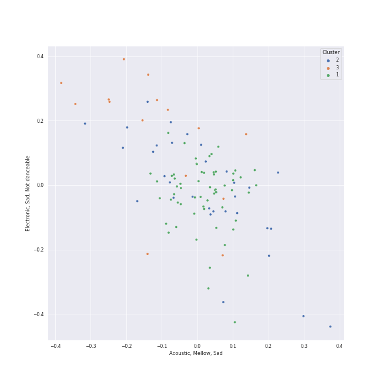

# Clusters in Musicals

## Cluster #1

34 tracks

| Art | Track | Album | Artists | Label | Rank | 💚 | 🔗 |
|:---|:---|:---|:---|:---|---:|:---|:---|
|  | Masquerade / Why So Silent | The Phantom Of The Opera | Andrew Lloyd Webber, Phantom Of The Opera Original London Cast, Sarah Brightman, Steve Barton, Michael Crawford | [Polydor Records](../../../../labels/polydor_records) | nan | | [🔗](https://open.spotify.com/track/1z2oyr9Uu9GCz31kycvPuX) |
|  | Notes / Prima Donna | The Phantom Of The Opera | Andrew Lloyd Webber, Phantom Of The Opera Original London Cast, John Savident, David Firth, Steve Barton, Rosemary Ashe, Mary Millar, Janet Devenish, Michael Crawford | [Polydor Records](../../../../labels/polydor_records) | nan | | [🔗](https://open.spotify.com/track/7uFofIX6vcvU7vl4jlttEr) |
|  | Macavity: The Mystery Cat | Cats (Original Broadway Cast Recording / 1983) | Andrew Lloyd Webber, "Cats" 1983 Broadway Cast, Wendy Edmead, Donna King, Hector Jaime Mercado, Kenneth Ard, Harry Groener | [UMC (Universal Music Catalogue)](../../../../labels/umc_(universal_music_catalogue)) | nan | | [🔗](https://open.spotify.com/track/1xTp65doSyf0vZz7OEsTyr) |
|  | Valjean's Soliloquy | Les Misérables: The Motion Picture Soundtrack Deluxe (Deluxe Edition) | Hugh Jackman | [Polydor Records](../../../../labels/polydor_records) | nan | | [🔗](https://open.spotify.com/track/0kGWR2TUDw8AIHgmFwjk1V) |
|  | The Confrontation | Les Misérables: The Motion Picture Soundtrack Deluxe (Deluxe Edition) | Hugh Jackman, Russell Crowe | [Polydor Records](../../../../labels/polydor_records) | nan | | [🔗](https://open.spotify.com/track/31dATgmleDm4vrtFKkRhEd) |
|  | Confrontation | Les Misérables (Original Broadway Cast Recording) | Colm Wilkinson, Terrence Mann | [Verve (Adult Contemporary) MC](../../../../labels/verve_(adult_contemporary)_mc) | nan | | [🔗](https://open.spotify.com/track/2eqCnMN561yzr6wag6VeiB) |
|  | One Last Time | Hamilton (Original Broadway Cast Recording) | Christopher Jackson, Lin-Manuel Miranda, Original Broadway Cast of Hamilton | [Atlantic Records](../../../../labels/atlantic_records) | nan | | [🔗](https://open.spotify.com/track/0Iys022UwQ8xBfxE1g4nWZ) |
|  | Dancing Through Life - From "Wicked" Original Broadway Cast Recording/2003 | Wicked (Original Broadway Cast Recording / Deluxe Edition) | Stephen Schwartz, Norbert Leo Butz, Kristin Chenoweth, Christopher Fitzgerald, Michelle Federer, Idina Menzel, Stephen Oremus, Alex Lacamoire | [Verve (Adult Contemporary) MC](../../../../labels/verve_(adult_contemporary)_mc) | nan | | [🔗](https://open.spotify.com/track/45Yr7rD2vH3OsTRseT6gfA) |
|  | Giants In The Sky | Into The Woods (2022 Broadway Cast Recording) | Cole Thompson | [Craft Recordings](../../../../labels/craft_recordings) | 285 | | [🔗](https://open.spotify.com/track/3RDesmUopi3TgcFJdPAZnN) |
|  | Elephant Love Medley - From "Moulin Rouge" Soundtrack | Moulin Rouge | Nicole Kidman, Ewan McGregor, Jamie Allen | [Moulin Rouge / Interscope](../../../../labels/interscope_records) | nan | | [🔗](https://open.spotify.com/track/1M5iGApccrA2uBzQMELW9w) |
## Cluster #2

15 tracks

| Art | Track | Album | Artists | Label | Rank | 💚 | 🔗 |
|:---|:---|:---|:---|:---|---:|:---|:---|
|  | Opening Up | What's Inside: Songs from Waitress | [Sara Bareilles](../../../../artists/sara_bareilles/overview.md) | [Epic](../../../../labels/epic) | nan | | [🔗](https://open.spotify.com/track/24VwpFC93affqIkztFIIic) |
|  | I Didn't Plan It | What's Inside: Songs from Waitress | [Sara Bareilles](../../../../artists/sara_bareilles/overview.md) | [Epic](../../../../labels/epic) | nan | | [🔗](https://open.spotify.com/track/5EPytk5jah5T1EqOmu1QfP) |
|  | The Phantom Of The Opera | The Phantom Of The Opera | Andrew Lloyd Webber, Phantom Of The Opera Original London Cast, Michael Crawford, Sarah Brightman | [Polydor Records](../../../../labels/polydor_records) | nan | | [🔗](https://open.spotify.com/track/5qlABWwod6dgDCmRAAF5J5) |
|  | The Phantom Of the Opera - From 'The Phantom Of The Opera' Motion Picture | The Phantom Of The Opera (Original Motion Picture Soundtrack) | Andrew Lloyd Webber, Gerard Butler, Emmy Rossum | [UMC (Universal Music Catalogue)](../../../../labels/umc_(universal_music_catalogue)) | nan | | [🔗](https://open.spotify.com/track/4EaBMhUIOfnFEbIgqCfKbi) |
|  | Overture - From 'The Phantom Of The Opera' Motion Picture | The Phantom Of The Opera (Original Motion Picture Soundtrack) | Andrew Lloyd Webber | [UMC (Universal Music Catalogue)](../../../../labels/umc_(universal_music_catalogue)) | nan | | [🔗](https://open.spotify.com/track/7o3DV1szMH5Fd38f1QwgPO) |
|  | The Election of 1800 | Hamilton (Original Broadway Cast Recording) | Daveed Diggs, Okieriete Onaodowan, Leslie Odom Jr., Lin-Manuel Miranda, Original Broadway Cast of Hamilton | [Atlantic Records](../../../../labels/atlantic_records) | nan | | [🔗](https://open.spotify.com/track/0LpHC9mhPAQC98IjXZIrif) |
|  | Say No to This | Hamilton (Original Broadway Cast Recording) | Jasmine Cephas-Jones, Leslie Odom Jr., Lin-Manuel Miranda, Sydney James Harcourt, Original Broadway Cast of Hamilton | [Atlantic Records](../../../../labels/atlantic_records) | nan | 💚 | [🔗](https://open.spotify.com/track/3s9itRgJYcKhem01P17865) |
|  | Wait for It | Hamilton (Original Broadway Cast Recording) | Leslie Odom Jr., Original Broadway Cast of Hamilton | [Atlantic Records](../../../../labels/atlantic_records) | nan | 💚 | [🔗](https://open.spotify.com/track/7EqpEBPOohgk7NnKvBGFWo) |
|  | My Shot | Hamilton (Original Broadway Cast Recording) | Lin-Manuel Miranda, Daveed Diggs, Okieriete Onaodowan, Leslie Odom Jr., Original Broadway Cast of Hamilton, Anthony Ramos | [Atlantic Records](../../../../labels/atlantic_records) | nan | | [🔗](https://open.spotify.com/track/4cxvludVmQxryrnx1m9FqL) |
|  | Aaron Burr, Sir | Hamilton (Original Broadway Cast Recording) | Lin-Manuel Miranda, Leslie Odom Jr., Daveed Diggs, Okieriete Onaodowan, Anthony Ramos | [Atlantic Records](../../../../labels/atlantic_records) | nan | | [🔗](https://open.spotify.com/track/6dr7ekfhlbquvsVY8D7gyk) |
## Cluster #3

49 tracks

| Art | Track | Album | Artists | Label | Rank | 💚 | 🔗 |
|:---|:---|:---|:---|:---|---:|:---|:---|
|  | The Music Of The Night | The Phantom Of The Opera | Andrew Lloyd Webber, Phantom Of The Opera Original London Cast, Michael Crawford | [Polydor Records](../../../../labels/polydor_records) | nan | | [🔗](https://open.spotify.com/track/2jF3AQzvTj9L1Ax9Di5BYu) |
|  | Think Of Me | The Phantom Of The Opera | Andrew Lloyd Webber, Phantom Of The Opera Original London Cast, Rosemary Ashe, Sarah Brightman, Steve Barton | [Polydor Records](../../../../labels/polydor_records) | nan | | [🔗](https://open.spotify.com/track/31Irb8d3UBRfEcaHDzQxsK) |
|  | Angel Of Music | The Phantom Of The Opera | Andrew Lloyd Webber, Phantom Of The Opera Original London Cast, Janet Devenish, Sarah Brightman | [Polydor Records](../../../../labels/polydor_records) | nan | | [🔗](https://open.spotify.com/track/48eRbUfNOF4xnNHwSSYubb) |
|  | Why Have You Brought Me Here | The Phantom Of The Opera | Andrew Lloyd Webber, Phantom Of The Opera Original London Cast, Steve Barton, Sarah Brightman | [Polydor Records](../../../../labels/polydor_records) | nan | | [🔗](https://open.spotify.com/track/6DGALltLYPxUv3zmWLGT4x) |
|  | Learn To Be Lonely - From 'The Phantom Of The Opera' Motion Picture | The Phantom Of The Opera (Original Motion Picture Soundtrack) | Andrew Lloyd Webber, Minnie Driver | [UMC (Universal Music Catalogue)](../../../../labels/umc_(universal_music_catalogue)) | nan | | [🔗](https://open.spotify.com/track/3LpvO6PZRuQ0OeFL1LQwtB) |
|  | The Mirror (Angel Of Music) - From 'The Phantom Of The Opera' Motion Picture | The Phantom Of The Opera (Original Motion Picture Soundtrack) | Andrew Lloyd Webber, Gerard Butler, Emmy Rossum | [UMC (Universal Music Catalogue)](../../../../labels/umc_(universal_music_catalogue)) | nan | | [🔗](https://open.spotify.com/track/5PRz8hvi9y6S36WIreol1U) |
|  | On My Own | Les Misérables: The Motion Picture Soundtrack Deluxe (Deluxe Edition) | Samantha Barks | [Polydor Records](../../../../labels/polydor_records) | nan | | [🔗](https://open.spotify.com/track/3Mr6ofzF6ZuYiqHh8qNud3) |
|  | Come To Me (Fantine's Death) | Les Misérables (Original Broadway Cast Recording) | Colm Wilkinson, Randy Graff | [Verve (Adult Contemporary) MC](../../../../labels/verve_(adult_contemporary)_mc) | nan | | [🔗](https://open.spotify.com/track/1YQ0vVVE0Fd8IwxT19NrVF) |
|  | On My Own | Les Misérables (Original Broadway Cast Recording) | Frances Ruffelle | [Verve (Adult Contemporary) MC](../../../../labels/verve_(adult_contemporary)_mc) | nan | | [🔗](https://open.spotify.com/track/0XLXG7LJ8jLMhHC5qH9rq6) |
|  | A Heart Full Of Love | Les Misérables (Original Broadway Cast Recording) | Judy Kuhn | [Verve (Adult Contemporary) MC](../../../../labels/verve_(adult_contemporary)_mc) | nan | | [🔗](https://open.spotify.com/track/1audfn0M2y51sgmKFHCxoC) |