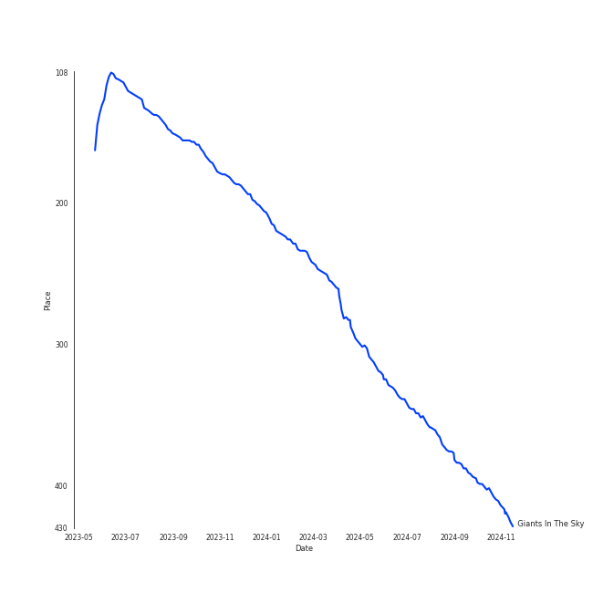
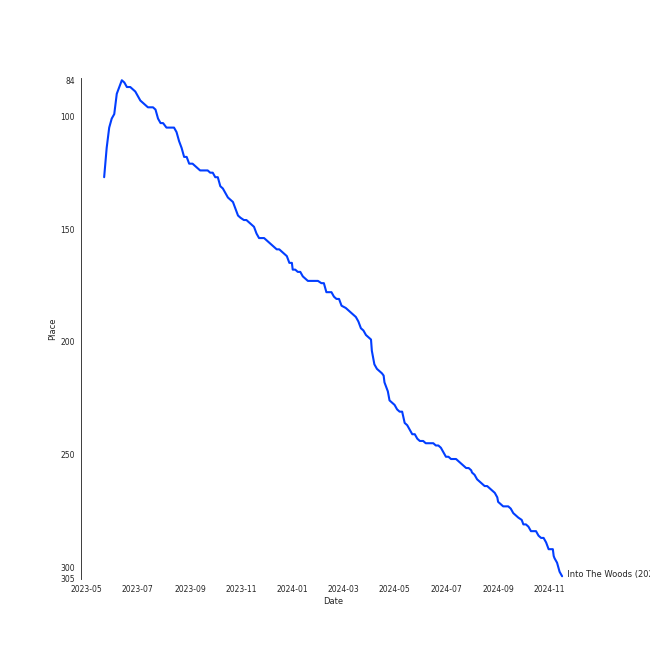
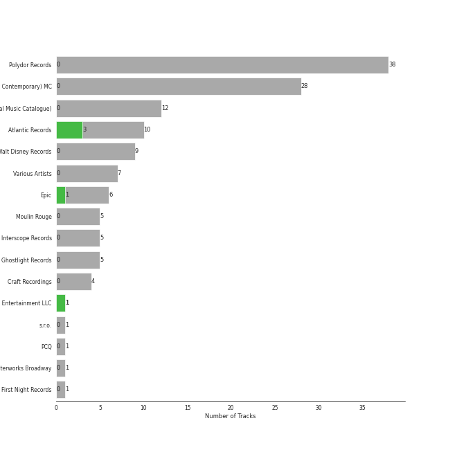
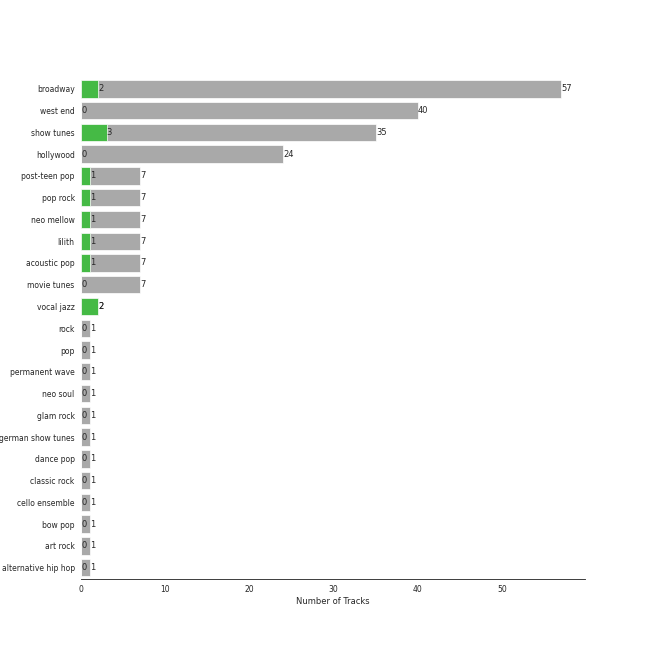

# Musicals

[128 tracks (5 liked) 🔗](https://open.spotify.com/playlist/54LRPekls9oCtaWOnmM3N0)

[See Track Features](audio_features.md)

[See Clusters](clusters/overview.md)

## Top Artists

| Art | Rank | Tracks | 💚 | Artist | 🔗 |
|:---|---:|---:|---:|:---|:---|
|  | 421 | 8 | 3 | Original Broadway Cast of Hamilton | [🔗](https://open.spotify.com/artist/3UUJfRbrA2nTbcg4i0MOwu) |
|  | 421 | 7 | 3 | Leslie Odom Jr. | [🔗](https://open.spotify.com/artist/3cR4rhS2hBWqI7rJEBacvN) |
|  | 421 | 8 | 2 | Lin-Manuel Miranda | [🔗](https://open.spotify.com/artist/4aXXDj9aZnlshx7mzj3W1N) |
|  | 23 | 7 | 1 | [Sara Bareilles](../../artists/sara_bareilles/overview.md) | [🔗](https://open.spotify.com/artist/2Sqr0DXoaYABbjBo9HaMkM) |
| | 421 | 4 | 1 | Okieriete Onaodowan | [🔗](https://open.spotify.com/artist/6G3sPhnj4JBCsBVBGvZnkk) |
|  | 421 | 4 | 1 | Daveed Diggs | [🔗](https://open.spotify.com/artist/3twuAojvYNrlWZpMkxLm3P) |
|  | 421 | 4 | 1 | Phillipa Soo | [🔗](https://open.spotify.com/artist/2OEGI2wrCVmvavKEOMlccy) |
|  | 421 | 3 | 1 | Anthony Ramos | [🔗](https://open.spotify.com/artist/660YptcR0hNHJ8iEr1qcse) |
|  | 421 | 2 | 1 | Christopher Jackson | [🔗](https://open.spotify.com/artist/6sLwRSXSUF5JTUnQaFenyj) |
|  | 421 | 2 | 1 | Jasmine Cephas-Jones | [🔗](https://open.spotify.com/artist/4H3e5t5utgPvj6Nsuda5QF) |

See top 100 artists

| Art | Rank | Tracks | 💚 | Artist | 🔗 |
|:---|---:|---:|---:|:---|:---|
|  | 392 | 1 | 1 | Jorge Rivera-Herrans | [🔗](https://open.spotify.com/artist/2kdmTOXncgNHSuYVMhdd5I) |
|  | 421 | 1 | 1 | Sydney James Harcourt | [🔗](https://open.spotify.com/artist/2fHcpUAFhqmfloo2HkBN3e) |
|  | 421 | 1 | 1 | Steven Rodriguez | [🔗](https://open.spotify.com/artist/2a84LFOuPFQX3qGB26eu9O) |
|  | 421 | 1 | 1 | Cast of EPIC: The Musical | [🔗](https://open.spotify.com/artist/1gV480zBnPy4ktKHfHKxZ5) |
|  | 421 | 33 | 0 | Andrew Lloyd Webber | [🔗](https://open.spotify.com/artist/4aP1lp10BRYZO658B2NwkG) |
|  | 421 | 21 | 0 | Phantom Of The Opera Original London Cast | [🔗](https://open.spotify.com/artist/3LfD2yRlfHAtTryX8rFp25) |
|  | 421 | 14 | 0 | Sarah Brightman | [🔗](https://open.spotify.com/artist/7Ead768rc4ShGxnqtqccU5) |
|  | 421 | 11 | 0 | Michael Crawford | [🔗](https://open.spotify.com/artist/5fRiVl9fyhUEZhcpMyIxUG) |
|  | 421 | 11 | 0 | Steve Barton | [🔗](https://open.spotify.com/artist/1gEOIEK9jgpYvvG57BP0US) |
|  | 421 | 8 | 0 | Stephen Schwartz | [🔗](https://open.spotify.com/artist/7daPb40K64rRtF36wd3ZOk) |
|  | 421 | 8 | 0 | Alex Lacamoire | [🔗](https://open.spotify.com/artist/5TLQArskPwpPQULjjE2tsW) |
|  | 421 | 8 | 0 | Colm Wilkinson | [🔗](https://open.spotify.com/artist/4hKV8PcRBaHZqBJjSn8OJE) |
|  | 421 | 8 | 0 | Stephen Oremus | [🔗](https://open.spotify.com/artist/1e6BRnFiiwNZl04xu1yqmi) |
|  | 421 | 7 | 0 | Emmy Rossum | [🔗](https://open.spotify.com/artist/6JcDqt1rBKIWfnoPjXFYqc) |
|  | 421 | 7 | 0 | Hugh Jackman | [🔗](https://open.spotify.com/artist/5F1aoppMtU3OMiltO8ymJ2) |
|  | 336 | 6 | 0 | Idina Menzel | [🔗](https://open.spotify.com/artist/73Np75Wv2tju61Eo9Zw4IR) |
|  | 421 | 6 | 0 | Kristin Chenoweth | [🔗](https://open.spotify.com/artist/3DgcBA7P0ji5co7Z1Gfp2Q) |
|  | 421 | 5 | 0 | Gerard Butler | [🔗](https://open.spotify.com/artist/7H25O93TTUoaZ0ZaFk318U) |
| | 421 | 5 | 0 | Terrence Mann | [🔗](https://open.spotify.com/artist/5uBIsYz9WatgoViLG6pVj2) |
|  | 421 | 5 | 0 | Eddie Redmayne | [🔗](https://open.spotify.com/artist/4EJP6Qhk6l18LumCcpEfLw) |
|  | 421 | 5 | 0 | Neil Patrick Harris | [🔗](https://open.spotify.com/artist/3UBvyQF5Hipou6Pm7wncxr) |
|  | 421 | 5 | 0 | Andrew Rannells | [🔗](https://open.spotify.com/artist/0GxSAKOw8AV0JsEQ0HYY4b) |
|  | 421 | 4 | 0 | Les Misérables Cast | [🔗](https://open.spotify.com/artist/71wy5iisVKXLZgoPxdFi8A) |
|  | 421 | 4 | 0 | Samantha Barks | [🔗](https://open.spotify.com/artist/4gOl5m9dY7IGAipqpul7GZ) |
|  | 421 | 4 | 0 | Josh Gad | [🔗](https://open.spotify.com/artist/4dSQICBjdUIp5iK6RRU2bY) |
|  | 421 | 4 | 0 | Rosemary Ashe | [🔗](https://open.spotify.com/artist/3Oju6zkuJzum4svKeVhKiK) |
|  | 421 | 3 | 0 | Brian Sears | [🔗](https://open.spotify.com/artist/7prZJzDK9Eaidya20kUciB) |
| | 421 | 3 | 0 | Beth Fowler | [🔗](https://open.spotify.com/artist/7KNW6OwcA260MsaEtnvhxV) |
| | 421 | 3 | 0 | Janet Devenish | [🔗](https://open.spotify.com/artist/7Ev9dg2zamUgQsRUp9DdRl) |
| | 421 | 3 | 0 | Clark Johnsen | [🔗](https://open.spotify.com/artist/6xWxKaEFEKU3r7AUzUKylT) |
| | 421 | 3 | 0 | Kevin Duda | [🔗](https://open.spotify.com/artist/6b1coNssyWbKkbgZfK9MB5) |
|  | 421 | 3 | 0 | Frances Ruffelle | [🔗](https://open.spotify.com/artist/5uSeMCBhe3DiROdFrwaXkw) |
| | 421 | 3 | 0 | Benjamin Schrader | [🔗](https://open.spotify.com/artist/5OPT8oIrU42hqfKMJv0b5B) |
| | 421 | 3 | 0 | Rory O'Malley | [🔗](https://open.spotify.com/artist/4ypbxQ7Pb5JKm2ulHXDcBP) |
|  | 421 | 3 | 0 | David Firth | [🔗](https://open.spotify.com/artist/4kjJU6zIfQi87yTWJMxJNw) |
| | 421 | 3 | 0 | Justin Bohon | [🔗](https://open.spotify.com/artist/4MYUIgtNTRdEfksW6IwvAe) |
|  | 421 | 3 | 0 | Jason Michael Snow | [🔗](https://open.spotify.com/artist/32oXmsd7TLzVccshoWY0mm) |
| | 421 | 3 | 0 | John Savident | [🔗](https://open.spotify.com/artist/2V0W4YzPCESOh86ss7D2QE) |
| | 421 | 3 | 0 | Mary Millar | [🔗](https://open.spotify.com/artist/1SBvpcra5uod7N0rxJxa3J) |
| | 421 | 3 | 0 | Scott Barnhardt | [🔗](https://open.spotify.com/artist/1A4dOeSiYZ0yBf6l5uYY7m) |
|  | 421 | 3 | 0 | Ewan McGregor | [🔗](https://open.spotify.com/artist/105Paee9vmV5rfLSG652e1) |
| | 421 | 3 | 0 | Ensemble - The Lion King | [🔗](https://open.spotify.com/artist/0s0Hfb6ckk9qTjDeUOZXJp) |
|  | 421 | 3 | 0 | Anne Hathaway | [🔗](https://open.spotify.com/artist/0nIyPY7J7G68WgQEOLHn0x) |
| | 421 | 2 | 0 | Lewis Cleale | [🔗](https://open.spotify.com/artist/7tihd0CgVerCoDl6LeDHQW) |
|  | 421 | 2 | 0 | Judy Kuhn | [🔗](https://open.spotify.com/artist/7tHd518aPjJYUgyv9bidBz) |
|  | 421 | 2 | 0 | Susan Egan | [🔗](https://open.spotify.com/artist/7CckquWatDQSr3PFKkjM8M) |
|  | 421 | 2 | 0 | Michael Maguire | [🔗](https://open.spotify.com/artist/6QjRwce37TfXfjx81KqQ7N) |
|  | 421 | 2 | 0 | Charles Hart | [🔗](https://open.spotify.com/artist/6IFUhDPbZkH4ytZZDiu0x4) |
|  | 421 | 2 | 0 | Felicia Day | [🔗](https://open.spotify.com/artist/67pV3IHfrxmBSOdhwyKDQU) |
| | 421 | 2 | 0 | Burke Moses | [🔗](https://open.spotify.com/artist/64BC8AWWTaiOhej6ZYAXzv) |
|  | 421 | 2 | 0 | Renée Elise Goldsberry | [🔗](https://open.spotify.com/artist/5VJN4jB6PqqEg4kJiAj6Eu) |
|  | 421 | 2 | 0 | Amanda Seyfried | [🔗](https://open.spotify.com/artist/5RZjpmuD14JKXvB8Ry1G1u) |
| | 421 | 2 | 0 | Heath Lamberts | [🔗](https://open.spotify.com/artist/4YYb7AZfDDAmEHSdNCtQfL) |
| | 421 | 2 | 0 | Robert Billig | [🔗](https://open.spotify.com/artist/3Ybg9gi5V2x6i8OsLc9M7p) |
|  | 421 | 2 | 0 | Russell Crowe | [🔗](https://open.spotify.com/artist/3YBIrJozn8fop4UYIt7wcV) |
| | 421 | 2 | 0 | Broadway Cast of Beauty and the Beast | [🔗](https://open.spotify.com/artist/31gtcs2n8ILyd09TvlSwJt) |
|  | 421 | 2 | 0 | David Bryant | [🔗](https://open.spotify.com/artist/2yPfp367ZwywK1lbGg00b8) |
|  | 421 | 2 | 0 | Randy Graff | [🔗](https://open.spotify.com/artist/2iRiwwxcJb6fXCxO5jt1cz) |
|  | 421 | 2 | 0 | "Cats" 1983 Broadway Cast | [🔗](https://open.spotify.com/artist/2cez574BwRD00PGEbNl4SH) |
|  | 421 | 2 | 0 | Kenny Raskin | [🔗](https://open.spotify.com/artist/28OYna1pjzLUp2TrXnkK6p) |
| | 421 | 2 | 0 | Sarah Solie Shannon | [🔗](https://open.spotify.com/artist/1A2F6sucjT7YDTJtVtB9Oz) |
| | 421 | 2 | 0 | Patrick Wilson | [🔗](https://open.spotify.com/artist/0z5nxdz5osD8FsmaUDmfC0) |
| | 421 | 2 | 0 | Linda Talcott | [🔗](https://open.spotify.com/artist/0XmsLZGAfaW5GvksORVlXJ) |
| | 421 | 2 | 0 | Gary Beach | [🔗](https://open.spotify.com/artist/0OckhIDFyA68SQXxyefMcH) |
| | 421 | 2 | 0 | Paige Price | [🔗](https://open.spotify.com/artist/0GzTqQj6pGeI2iW6cA0uSR) |
|  | 421 | 2 | 0 | Nicole Kidman | [🔗](https://open.spotify.com/artist/0ExYzTb7raTAfsXPtiI5vq) |
|  | 421 | 1 | 0 | Brian Press | [🔗](https://open.spotify.com/artist/7ytM1slwsB4EJ8JYhMtBmf) |
| | 421 | 1 | 0 | Jason Raize | [🔗](https://open.spotify.com/artist/7wtyPvLmy8LAf2CO0Xwy4p) |
|  | 421 | 1 | 0 | Students | [🔗](https://open.spotify.com/artist/7oaoEBdRqHXfoiGYa55Atp) |
| | 421 | 1 | 0 | Hector Jaime Mercado | [🔗](https://open.spotify.com/artist/7mGrd0nUrFLiz1ettU2olj) |
| | 421 | 1 | 0 | Helena Bonham Carter | [🔗](https://open.spotify.com/artist/7gX22Ua3mEH2KXTCpIfoOP) |
|  | 421 | 1 | 0 | Ann Harada | [🔗](https://open.spotify.com/artist/743OB85I8BftMRfuNAO1RS) |
| | 421 | 1 | 0 | Michelle Federer | [🔗](https://open.spotify.com/artist/724Af947xg6pNu4xiwhYsV) |
|  | 421 | 1 | 0 | Ensemble | [🔗](https://open.spotify.com/artist/6zMAnfrMg3Wg0BcgoPUbG7) |
|  | 421 | 1 | 0 | Mýa | [🔗](https://open.spotify.com/artist/6lHL3ubAMgSasKjNqKb8HF) |
| | 421 | 1 | 0 | Max Casella | [🔗](https://open.spotify.com/artist/6ZpL3BxODab84CTGSL7UO8) |
|  | 421 | 1 | 0 | Harry Groener | [🔗](https://open.spotify.com/artist/6S61JShQr2Td7pyjOKFEpQ) |
|  | 421 | 1 | 0 | Aaron Tveit | [🔗](https://open.spotify.com/artist/68h2f0WXn4zEctSgNYozXx) |
|  | 421 | 1 | 0 | Lil' Kim | [🔗](https://open.spotify.com/artist/5tth2a3v0sWwV1C7bApBdX) |
|  | 421 | 1 | 0 | Minnie Driver | [🔗](https://open.spotify.com/artist/5rNwd5kb1cxVBCQKnDO4b8) |
|  | 421 | 1 | 0 | Jamie Allen | [🔗](https://open.spotify.com/artist/5R51XX6tR8R2zlBYRmXm0o) |
| | 421 | 1 | 0 | Jan Neuberger | [🔗](https://open.spotify.com/artist/5LATQYuPWELZCDEdGYN5YH) |
|  | 421 | 1 | 0 | Alessandro Safina | [🔗](https://open.spotify.com/artist/5ITJs06INM9JWxK5hROEj3) |
| | 421 | 1 | 0 | John Aron | [🔗](https://open.spotify.com/artist/5Hco9oOhEcTrU0hzzIkoF7) |
|  | 421 | 1 | 0 | Prague Cello Quartet | [🔗](https://open.spotify.com/artist/5GeMh4YY04Q71E55hL6D9A) |
| | 421 | 1 | 0 | Kenneth Ard | [🔗](https://open.spotify.com/artist/5FrpB7toJvnhPRiZ4I1mxQ) |
| | 421 | 1 | 0 | Jesse Corti | [🔗](https://open.spotify.com/artist/53vhGhGRoi9ARM7kr3jrz5) |
|  | 421 | 1 | 0 | Sean McCourt | [🔗](https://open.spotify.com/artist/53KxkH27mKZgcCmtdKYBl7) |
|  | 369 | 1 | 0 | Jason Mraz | [🔗](https://open.spotify.com/artist/4phGZZrJZRo4ElhRtViYdl) |
|  | 421 | 1 | 0 | John Tartaglia | [🔗](https://open.spotify.com/artist/4L7TL4CnvDR3iZQuVy6ESm) |

## Top Tracks

Most and least listened tracks

| Rank | ​ | Most listened tracks | Rank | ​​ | Least listened tracks |
|---:|:---|:---|---:|:---|:---|
| 378 |  | Giants In The Sky | 938 |  | Can You Feel The Love Tonight |
| 938 |  | So They Say | 938 |  | Notes / Prima Donna |
| 938 |  | Hello! | 938 |  | One Day More |
| 938 |  | Down Once More / Track Down This Murderer | 938 |  | Overture - From 'The Phantom Of The Opera' Motion Picture |
| 938 |  | Beauty and the Beast | 938 |  | Notes / Twisted Every Way |
| 938 |  | Who Am I? - From "Les Miserables'' | 938 |  | Two by Two |
| 938 |  | All I Ask Of You - Reprise | 938 |  | Magical Lasso |
| 938 |  | I Remember / Stranger Than You Dreamt It | 938 |  | Stars |
| 938 |  | One Last Time | 938 |  | Red And Black |
| 938 |  | The Election of 1800 | 938 |  | Lady Marmalade - From "Moulin Rouge" Soundtrack |

## Top Albums

| Art | Rank | Tracks | 💚 | Album | Release Date | 🔗 |
|:---|---:|---:|---:|:---|:---|:---|
|  | 621 | 21 | 0 | The Phantom Of The Opera | 1987-01-01 | [🔗](https://open.spotify.com/album/36bEg6FTBaZGLg9ngJZIU6) |
|  | 621 | 20 | 0 | Les Misérables (Original Broadway Cast Recording) | 1987-05-11 | [🔗](https://open.spotify.com/album/3jbKDx0zB1QoJQTw8i1AvD) |
|  | 621 | 17 | 0 | Les Misérables: The Motion Picture Soundtrack Deluxe (Deluxe Edition) | 2013-01-01 | [🔗](https://open.spotify.com/album/0I6Bl1dVB1hQsSoQF6KuTg) |
|  | 621 | 10 | 3 | Hamilton (Original Broadway Cast Recording) | 2015-09-25 | [🔗](https://open.spotify.com/album/1kCHru7uhxBUdzkm4gzRQc) |
|  | 621 | 10 | 0 | The Phantom Of The Opera (Original Motion Picture Soundtrack) | 2004-12-10 | [🔗](https://open.spotify.com/album/1zwEN9cLtWg39zFJnj8brt) |
|  | 621 | 8 | 0 | Wicked (Original Broadway Cast Recording / Deluxe Edition) | 2013-01-01 | [🔗](https://open.spotify.com/album/1woCvthHJakakroP6dXNxs) |
|  | 621 | 7 | 0 | Dr. Horrible's Sing-Along Blog (Motion Picture Soundtrack) | 2008-09-02 | [🔗](https://open.spotify.com/album/1ZCs5TZ79t6vQojJMeILu0) |
|  | 621 | 6 | 1 | What's Inside: Songs from Waitress | 2015-11-06 | [🔗](https://open.spotify.com/album/1s6codM2ZAB008t9GTyaEk) |
|  | 621 | 6 | 0 | Beauty And The Beast: The Broadway Musical | 2006-06-06 | [🔗](https://open.spotify.com/album/3Pzoe4ffuNsxdgTHGaFJmo) |
|  | 621 | 5 | 0 | The Book Of Mormon (Original Broadway Cast Recording) | 2011-05-17 | [🔗](https://open.spotify.com/album/5yauUuXppqUj2ulor38hvI) |

See all 18 albums

| Art | Rank | Tracks | 💚 | Album | Release Date | 🔗 |
|:---|---:|---:|---:|:---|:---|:---|
|  | 621 | 5 | 0 | Moulin Rouge | 2001-01-01 | [🔗](https://open.spotify.com/album/1Kg7AyuyIMTfD6geg9VghI) |
|  | 267 | 4 | 0 | Into The Woods (2022 Broadway Cast Recording) | 2022-09-30 | [🔗](https://open.spotify.com/album/5z6BFXI711HbSAXDjgOAHE) |
|  | 621 | 3 | 0 | The Lion King: Original Broadway Cast Recording | 1997-01-01 | [🔗](https://open.spotify.com/album/1y6p6tINBthUWsQVQJmiYK) |
|  | 621 | 2 | 0 | Cats (Original Broadway Cast Recording / 1983) | 1983-01-01 | [🔗](https://open.spotify.com/album/7dIID5jd8V3fR2NXkonyD3) |
|  | 621 | 1 | 1 | EPIC: The Ocean Saga (Official Concept Album) | 2023-12-25 | [🔗](https://open.spotify.com/album/6q6FBKPiH2waQezdzpxhuz) |
|  | 621 | 1 | 0 | The Phantom of the Opera: Overture | 2017-10-13 | [🔗](https://open.spotify.com/album/0oMltgMweWTGOBQPhuDU9j) |
|  | 621 | 1 | 0 | Les Misérables: In Concert at the Royal Albert Hall | 1996 | [🔗](https://open.spotify.com/album/15L0rrHDr8Q21y7e8WAo8S) |
|  | 621 | 1 | 0 | Avenue Q (Original Broadway Cast Recording) | 2003-10-06 | [🔗](https://open.spotify.com/album/4Ok0WpQf9ucxEbd0wJV5Cx) |

## Top Record Labels

| Tracks | 💚 | Label |
|---:|---:|:---|
| 10 | 3 | [Atlantic Records](../../labels/atlantic_records/overview.md) |
| 6 | 1 | [Epic](../../labels/epic/overview.md) |
| 1 | 1 | Winion Entertainment LLC |
| 38 | 0 | [Polydor Records](../../labels/polydor_records/overview.md) |
| 28 | 0 | [Verve (Adult Contemporary) MC](../../labels/verve_(adult_contemporary)_mc/overview.md) |
| 12 | 0 | [UMC (Universal Music Catalogue)](../../labels/umc_(universal_music_catalogue)/overview.md) |
| 9 | 0 | [Walt Disney Records](../../labels/walt_disney_records/overview.md) |
| 7 | 0 | Various Artists |
| 5 | 0 | Moulin Rouge |
| 5 | 0 | [Interscope Records](../../labels/interscope_records/overview.md) |

See all 16 labels

| Tracks | 💚 | Label |
|---:|---:|:---|
| 5 | 0 | Ghostlight Records |
| 4 | 0 | [Craft Recordings](../../labels/craft_recordings/overview.md) |
| 1 | 0 | s.r.o. |
| 1 | 0 | PCQ |
| 1 | 0 | Masterworks Broadway |
| 1 | 0 | First Night Records |

## Genres

| Tracks | 💚 | Genre |
|---:|---:|:---|
| 35 | 3 | [show tunes](../../genres/show_tunes/overview.md) |
| 57 | 2 | [broadway](../../genres/broadway/overview.md) |
| 2 | 2 | [vocal jazz](../../genres/vocal_jazz/overview.md) |
| 7 | 1 | [post-teen pop](../../genres/post-teen_pop/overview.md) |
| 7 | 1 | [pop rock](../../genres/pop_rock/overview.md) |
| 7 | 1 | [neo mellow](../../genres/neo_mellow/overview.md) |
| 7 | 1 | [lilith](../../genres/lilith/overview.md) |
| 7 | 1 | [ectofolk](../../genres/ectofolk/overview.md) |
| 7 | 1 | [acoustic pop](../../genres/acoustic_pop/overview.md) |
| 40 | 0 | west end |

See all 24 genres

| Tracks | 💚 | Genre |
|---:|---:|:---|
| 24 | 0 | hollywood |
| 7 | 0 | [movie tunes](../../genres/movie_tunes/overview.md) |
| 1 | 0 | [rock](../../genres/rock/overview.md) |
| 1 | 0 | [pop](../../genres/pop/overview.md) |
| 1 | 0 | [permanent wave](../../genres/permanent_wave/overview.md) |
| 1 | 0 | neo soul |
| 1 | 0 | glam rock |
| 1 | 0 | german show tunes |
| 1 | 0 | [dance pop](../../genres/dance_pop/overview.md) |
| 1 | 0 | [classic rock](../../genres/classic_rock/overview.md) |
| 1 | 0 | cello ensemble |
| 1 | 0 | bow pop |
| 1 | 0 | [art rock](../../genres/art_rock/overview.md) |
| 1 | 0 | alternative hip hop |

## Top Producers

| Art | Producer | Tracks | Credit Types |
|:---|:---|---:|:---|
|  | Lin-Manuel Miranda | 3 | Lyricist, Songwriter |
|  | Alex Lacamoire | 2 | Arranger |
|  | [Sara Bareilles](../../artists/sara_bareilles/overview.md) | 1 | Lyricist, Songwriter |
| | Neal Avron | 1 | Producer |

## Years

View all years

| Year | Number of Tracks |
|:---|---:|
| 2023 | 1 |
| 2022 | 4 |
| 2017 | 1 |
| 2015 | 16 |
| [2013](2013/overview.md) | 25 |
| 2011 | 5 |
| 2008 | 7 |
| 2006 | 6 |
| 2004 | 10 |
| 2003 | 1 |
| 2001 | 5 |
| 1997 | 3 |
| 1996 | 1 |
| [1987](1987/overview.md) | 41 |
| 1983 | 2 |

| ​ | 10 newest albums | ​​ | 10 oldest albums |
|:---|:---|:---|:---|
|  | EPIC: The Ocean Saga (Official Concept Album) (2023-12-25) |  | Cats (Original Broadway Cast Recording / 1983) (1983-01-01) |
|  | Into The Woods (2022 Broadway Cast Recording) (2022-09-30) |  | The Phantom Of The Opera (1987-01-01) |
|  | The Phantom of the Opera: Overture (2017-10-13) |  | Les Misérables (Original Broadway Cast Recording) (1987-05-11) |
|  | What's Inside: Songs from Waitress (2015-11-06) |  | Les Misérables: In Concert at the Royal Albert Hall (1996) |
|  | Hamilton (Original Broadway Cast Recording) (2015-09-25) |  | The Lion King: Original Broadway Cast Recording (1997-01-01) |
|  | Les Misérables: The Motion Picture Soundtrack Deluxe (Deluxe Edition) (2013-01-01) |  | Moulin Rouge (2001-01-01) |
|  | Wicked (Original Broadway Cast Recording / Deluxe Edition) (2013-01-01) |  | Avenue Q (Original Broadway Cast Recording) (2003-10-06) |
|  | The Book Of Mormon (Original Broadway Cast Recording) (2011-05-17) |  | The Phantom Of The Opera (Original Motion Picture Soundtrack) (2004-12-10) |
|  | Dr. Horrible's Sing-Along Blog (Motion Picture Soundtrack) (2008-09-02) |  | Beauty And The Beast: The Broadway Musical (2006-06-06) |
|  | Beauty And The Beast: The Broadway Musical (2006-06-06) |  | Dr. Horrible's Sing-Along Blog (Motion Picture Soundtrack) (2008-09-02) |